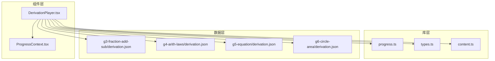
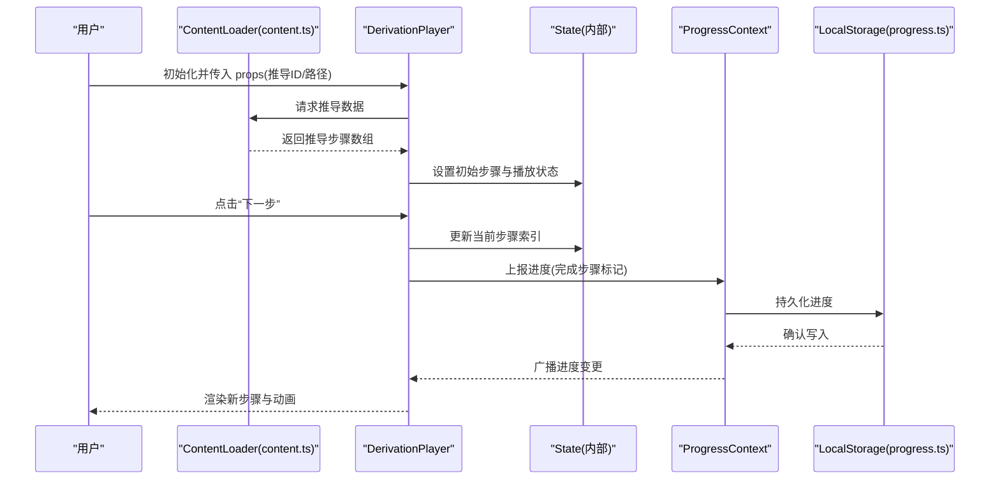
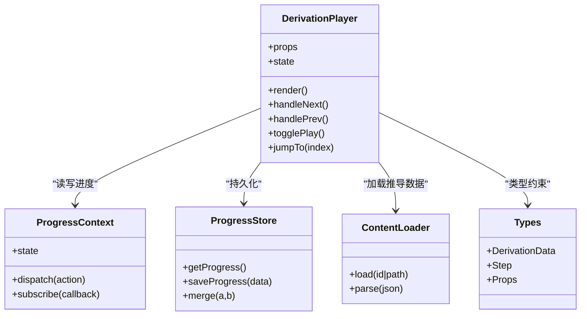

# DerivationPlayer 组件

<cite>
**本文引用的文件**   
- [DerivationPlayer.tsx](file://src/components/DerivationPlayer.tsx)
- [ProgressContext.tsx](file://src/context/ProgressContext.tsx)
- [progress.ts](file://src/lib/progress.ts)
- [types.ts](file://src/lib/types.ts)
- [content.ts](file://src/lib/content.ts)
- [g3-fraction-add-sub/derivation.json](file://src/content/knowledge-points/g3-fraction-add-sub/derivation.json)
- [g4-arith-laws/derivation.json](file://src/content/knowledge-points/g4-arith-laws/derivation.json)
- [g5-equation/derivation.json](file://src/content/knowledge-points/g5-equation/derivation.json)
- [g6-circle-area/derivation.json](file://src/content/knowledge-points/g6-circle-area/derivation.json)
</cite>

## 目录
1. [简介](#简介)
2. [项目结构](#项目结构)
3. [核心组件](#核心组件)
4. [架构总览](#架构总览)
5. [详细组件分析](#详细组件分析)
6. [依赖关系分析](#依赖关系分析)
7. [性能考虑](#性能考虑)
8. [故障排查指南](#故障排查指南)
9. [结论](#结论)
10. [附录](#附录)

## 简介
本文件为 DerivationPlayer 组件的权威文档，面向开发者与内容作者。该组件用于播放和处理数学推导过程，提供步骤导航、动画效果与用户交互能力。文档涵盖：
- Props 接口定义（推导数据格式、播放控制、样式定制）
- 推导步骤渲染、进度跟踪与用户操作响应机制
- 生命周期管理、性能优化与可访问性支持
- 使用示例与高级配置选项

## 项目结构
DerivationPlayer 位于 src/components 下，依赖上下文 ProgressContext 与库模块 progress.ts、types.ts、content.ts；推导数据以 derivation.json 形式存放于各知识点目录下。

图表来源
- [DerivationPlayer.tsx](file://src/components/DerivationPlayer.tsx)
- [ProgressContext.tsx](file://src/context/ProgressContext.tsx)
- [progress.ts](file://src/lib/progress.ts)
- [types.ts](file://src/lib/types.ts)
- [content.ts](file://src/lib/content.ts)
- [g3-fraction-add-sub/derivation.json](file://src/content/knowledge-points/g3-fraction-add-sub/derivation.json)
- [g4-arith-laws/derivation.json](file://src/content/knowledge-points/g4-arith-laws/derivation.json)
- [g5-equation/derivation.json](file://src/content/knowledge-points/g5-equation/derivation.json)
- [g6-circle-area/derivation.json](file://src/content/knowledge-points/g6-circle-area/derivation.json)

章节来源
- [DerivationPlayer.tsx](file://src/components/DerivationPlayer.tsx)
- [ProgressContext.tsx](file://src/context/ProgressContext.tsx)
- [progress.ts](file://src/lib/progress.ts)
- [types.ts](file://src/lib/types.ts)
- [content.ts](file://src/lib/content.ts)

## 核心组件
- DerivationPlayer：负责加载推导数据、维护播放状态、渲染当前步骤、处理用户交互（前进/后退/暂停/跳转）、更新全局进度。
- ProgressContext：集中管理学习进度（如已完成的推导项），供其他页面或组件订阅与同步。
- progress.ts：进度持久化与计算逻辑（读取/保存、合并、去重等）。
- types.ts：类型定义（推导数据结构、Props 接口、事件回调签名等）。
- content.ts：内容加载与解析（从 JSON 或 Markdown 获取推导数据）。

章节来源
- [DerivationPlayer.tsx](file://src/components/DerivationPlayer.tsx)
- [ProgressContext.tsx](file://src/context/ProgressContext.tsx)
- [progress.ts](file://src/lib/progress.ts)
- [types.ts](file://src/lib/types.ts)
- [content.ts](file://src/lib/content.ts)

## 架构总览
DerivationPlayer 通过 content.ts 加载 derivation.json，依据 types.ts 中的类型约束进行校验与转换，随后在 UI 中按步骤渲染。播放控制由内部状态驱动，并通过 ProgressContext 与 progress.ts 将进度写入持久化存储。

图表来源
- [content.ts](file://src/lib/content.ts)
- [DerivationPlayer.tsx](file://src/components/DerivationPlayer.tsx)
- [ProgressContext.tsx](file://src/context/ProgressContext.tsx)
- [progress.ts](file://src/lib/progress.ts)

## 详细组件分析

### Props 接口与推导数据格式
- 推导数据（derivation.json）通常包含：
  - id：唯一标识
  - title：标题
  - steps：步骤数组，每个步骤包含文本、公式、图示或可视化组件引用、动画配置、是否可交互等字段
  - meta：元信息（难度、适用年级、预计时长等）
- DerivationPlayer 的 Props 建议包括：
  - data：推导数据对象（可直接传入或提供 id/path 由 content.ts 加载）
  - autoPlay：是否自动播放
  - speed：播放速度（影响自动步进间隔）
  - controls：控制栏显示开关（前进/后退/暂停/进度条）
  - theme：主题与样式覆盖（颜色、字体、布局尺寸）
  - onStepChange：步骤切换回调
  - onComplete：完成回调
  - accessibility：无障碍配置（朗读、键盘导航）

章节来源
- [types.ts](file://src/lib/types.ts)
- [content.ts](file://src/lib/content.ts)
- [g3-fraction-add-sub/derivation.json](file://src/content/knowledge-points/g3-fraction-add-sub/derivation.json)
- [g4-arith-laws/derivation.json](file://src/content/knowledge-points/g4-arith-laws/derivation.json)
- [g5-equation/derivation.json](file://src/content/knowledge-points/g5-equation/derivation.json)
- [g6-circle-area/derivation.json](file://src/content/knowledge-points/g6-circle-area/derivation.json)

### 步骤渲染与动画
- 渲染策略：
  - 根据当前步骤索引选择对应步骤节点
  - 对文本与公式进行安全渲染（防 XSS）
  - 若步骤包含可视化组件引用，则动态加载对应可视化
- 动画效果：
  - 步骤进入/离开过渡（淡入淡出、滑动）
  - 关键元素高亮与强调（缩放、描边）
  - 自动播放时按 speed 控制节奏

章节来源
- [DerivationPlayer.tsx](file://src/components/DerivationPlayer.tsx)

### 播放控制与用户交互
- 控制项：
  - 前进/后退：更新当前步骤索引，触发 onStepChange
  - 暂停/继续：控制自动播放定时器
  - 进度条：直接跳转到指定步骤
  - 键盘快捷键：左右箭头、空格键
- 交互反馈：
  - 按钮禁用状态（首尾边界）
  - 进度指示器与步骤标签
  - 错误提示（步骤缺失、数据异常）

章节来源
- [DerivationPlayer.tsx](file://src/components/DerivationPlayer.tsx)

### 进度跟踪与持久化
- 进度模型：
  - 记录已完成步骤集合与最后一步索引
  - 支持跨会话恢复
- 持久化流程：
  - 步骤完成后调用 ProgressContext 更新
  - progress.ts 写入本地存储并去重
  - 页面刷新后从存储恢复进度

章节来源
- [ProgressContext.tsx](file://src/context/ProgressContext.tsx)
- [progress.ts](file://src/lib/progress.ts)

### 生命周期管理
- 挂载阶段：
  - 加载推导数据（content.ts）
  - 初始化状态与动画参数
  - 订阅 ProgressContext 变化
- 运行阶段：
  - 监听用户输入与键盘事件
  - 自动播放定时器管理
- 卸载阶段：
  - 清理定时器与事件监听
  - 释放资源（可视化实例）

章节来源
- [DerivationPlayer.tsx](file://src/components/DerivationPlayer.tsx)

### 可访问性支持
- 语义化标签与 ARIA 属性
- 屏幕阅读器友好（步骤朗读、状态播报）
- 键盘可达性与焦点管理
- 对比度与字体大小适配

章节来源
- [DerivationPlayer.tsx](file://src/components/DerivationPlayer.tsx)

## 依赖关系分析
DerivationPlayer 依赖类型定义、内容加载、进度管理与外部推导数据。下图展示主要依赖关系与数据流向。

图表来源
- [DerivationPlayer.tsx](file://src/components/DerivationPlayer.tsx)
- [ProgressContext.tsx](file://src/context/ProgressContext.tsx)
- [progress.ts](file://src/lib/progress.ts)
- [content.ts](file://src/lib/content.ts)
- [types.ts](file://src/lib/types.ts)

章节来源
- [DerivationPlayer.tsx](file://src/components/DerivationPlayer.tsx)
- [ProgressContext.tsx](file://src/context/ProgressContext.tsx)
- [progress.ts](file://src/lib/progress.ts)
- [content.ts](file://src/lib/content.ts)
- [types.ts](file://src/lib/types.ts)

## 性能考虑
- 懒加载可视化组件：仅在需要时引入对应可视化模块，减少初始包体积
- 步骤缓存：对已渲染步骤进行 DOM 或虚拟节点缓存，避免重复计算
- 动画节流：限制高频动画帧率，必要时使用 requestAnimationFrame
- 内存管理：卸载时清理定时器、事件监听与可视化实例
- 大数据集分页：超长推导分片加载，按需渲染

[本节为通用指导，不直接分析具体文件]

## 故障排查指南
- 数据加载失败：
  - 检查 derivation.json 路径与权限
  - 验证 JSON 结构与 types.ts 一致
  - 查看网络请求与解析日志
- 步骤渲染异常：
  - 确认步骤字段完整（文本/公式/可视化引用）
  - 检查可视化组件注册表是否正确
- 进度不同步：
  - 确认 ProgressContext 订阅与派发正常
  - 检查本地存储配额与序列化兼容性
- 动画卡顿：
  - 降低动画复杂度或关闭部分特效
  - 使用浏览器性能面板定位瓶颈

章节来源
- [content.ts](file://src/lib/content.ts)
- [ProgressContext.tsx](file://src/context/ProgressContext.tsx)
- [progress.ts](file://src/lib/progress.ts)
- [DerivationPlayer.tsx](file://src/components/DerivationPlayer.tsx)

## 结论
DerivationPlayer 提供了完整的数学推导播放体验，涵盖数据加载、步骤渲染、动画与交互、进度持久化与可访问性。通过清晰的 Props 接口与模块化依赖，便于扩展与定制。建议在生产环境中启用懒加载与缓存策略，并结合无障碍配置提升用户体验。

[本节为总结，不直接分析具体文件]

## 附录

### 使用示例（概念说明）
- 基础用法：传入推导 ID，组件自动加载并渲染
- 自定义主题：通过 theme 覆盖颜色与字体
- 控制播放：autoPlay 与 speed 控制自动播放节奏
- 回调处理：onStepChange/onComplete 实现业务逻辑

[本节为概念说明，不直接分析具体文件]

### 高级配置选项
- 步骤级配置：每步可设置动画、交互、条件显示
- 多语言支持：通过 content.ts 扩展语言包
- 可视化扩展：在 registry 中注册新的可视化组件

[本节为概念说明，不直接分析具体文件]