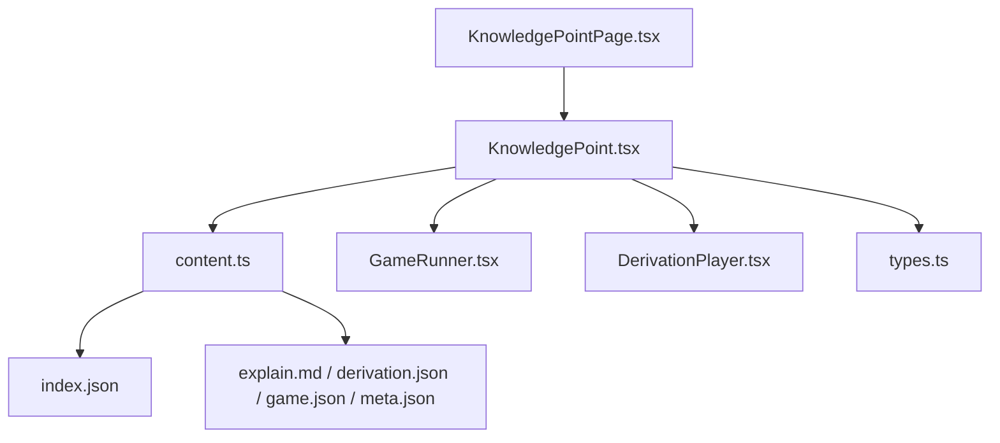
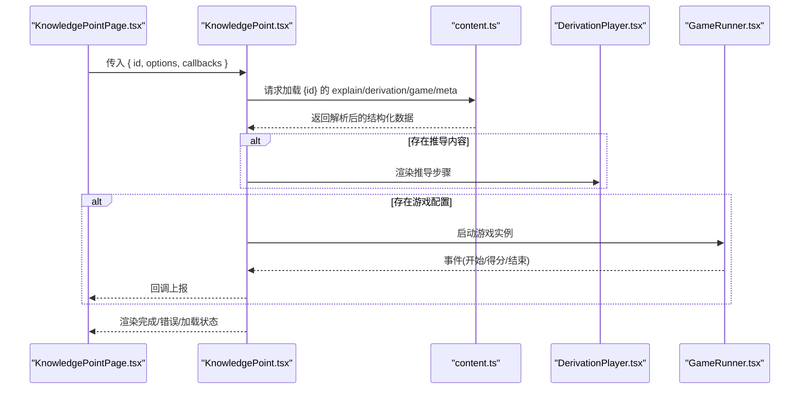
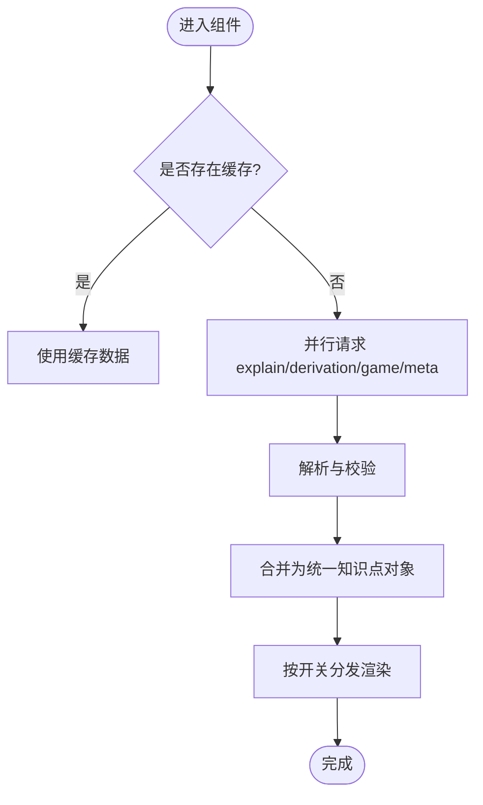
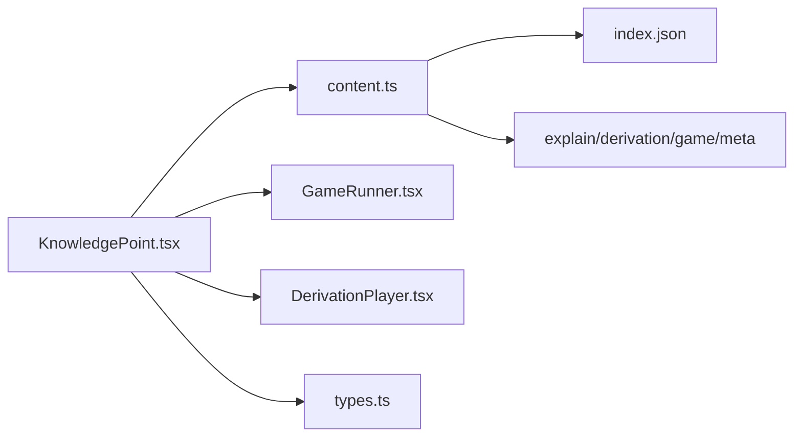

# KnowledgePoint 组件

<cite>
**本文档引用的文件**
- [KnowledgePoint.tsx](file://src/components/KnowledgePoint.tsx)
- [content.ts](file://src/lib/content.ts)
- [types.ts](file://src/lib/types.ts)
- [GameRunner.tsx](file://src/components/GameRunner.tsx)
- [DerivationPlayer.tsx](file://src/components/DerivationPlayer.tsx)
- [KnowledgePointPage.tsx](file://src/pages/KnowledgePointPage.tsx)
- [index.json](file://src/content/index.json)
- [g3-add-sub-10000/explain.md](file://src/content/knowledge-points/g3-add-sub-10000/explain.md)
- [g3-fraction-add-sub/derivation.json](file://src/content/knowledge-points/g3-fraction-add-sub/derivation.json)
- [g3-add-sub-10000/game.json](file://src/content/knowledge-points/g3-add-sub-10000/game.json)
- [g3-add-sub-10000/meta.json](file://src/content/knowledge-points/g3-add-sub-10000/meta.json)
</cite>

## 目录
1. [简介](#简介)
2. [项目结构](#项目结构)
3. [核心组件](#核心组件)
4. [架构总览](#架构总览)
5. [详细组件分析](#详细组件分析)
6. [依赖关系分析](#依赖关系分析)
7. [性能考量](#性能考量)
8. [故障排查指南](#故障排查指南)
9. [结论](#结论)
10. [附录](#附录)

## 简介
本文件为 KnowledgePoint 组件的权威文档，聚焦于该组件如何渲染数学知识点内容，包括标题、描述、游戏配置与元数据的处理；详细说明 Props 接口定义（知识点数据格式、样式选项、事件回调）；记录组件对不同类型教学内容（explain.md、derivation.json、game.json）的处理方式与动态加载机制；并涵盖状态管理、错误处理与加载状态展示。文末提供使用示例与自定义扩展方法，帮助读者快速集成与二次开发。

## 项目结构
KnowledgePoint 组件位于 src/components/KnowledgePoint.tsx，围绕它的内容解析与渲染由以下模块协同完成：
- 内容资源：src/content/knowledge-points/{id}/ 下的 explain.md、derivation.json、game.json、meta.json
- 内容索引与加载：src/lib/content.ts（负责按 id 聚合与加载上述资源）
- 类型定义：src/lib/types.ts（统一数据类型与 Props 接口）
- 游戏运行器：src/components/GameRunner.tsx（根据 game.json 驱动具体游戏）
- 推导播放器：src/components/DerivationPlayer.tsx（渲染 derivation.json 步骤）
- 页面入口：src/pages/KnowledgePointPage.tsx（组装 KnowledgePoint 与路由参数）
- 索引文件：src/content/index.json（可选的知识点清单或导航）

图表来源
- [KnowledgePoint.tsx](file://src/components/KnowledgePoint.tsx)
- [content.ts](file://src/lib/content.ts)
- [GameRunner.tsx](file://src/components/GameRunner.tsx)
- [DerivationPlayer.tsx](file://src/components/DerivationPlayer.tsx)
- [KnowledgePointPage.tsx](file://src/pages/KnowledgePointPage.tsx)
- [index.json](file://src/content/index.json)

章节来源
- [KnowledgePoint.tsx](file://src/components/KnowledgePoint.tsx)
- [content.ts](file://src/lib/content.ts)
- [types.ts](file://src/lib/types.ts)
- [GameRunner.tsx](file://src/components/GameRunner.tsx)
- [DerivationPlayer.tsx](file://src/components/DerivationPlayer.tsx)
- [KnowledgePointPage.tsx](file://src/pages/KnowledgePointPage.tsx)
- [index.json](file://src/content/index.json)

## 核心组件
KnowledgePoint 组件是知识点的“编排者”，其职责包括：
- 接收 props 中的知识点标识与渲染配置
- 通过 content.ts 动态加载 explain.md、derivation.json、game.json、meta.json
- 根据可用资源决定渲染分支：纯讲解、推导流程、互动游戏或组合呈现
- 管理加载、成功、错误等状态，并向用户提供反馈
- 将游戏结果、进度等事件回调给父级

章节来源
- [KnowledgePoint.tsx](file://src/components/KnowledgePoint.tsx)
- [content.ts](file://src/lib/content.ts)
- [types.ts](file://src/lib/types.ts)

## 架构总览
下图展示了 KnowledgePoint 在页面中的调用链与数据流：页面传入知识点 id 与渲染配置，组件内部通过 content.ts 拉取多源内容，再分发给 DerivationPlayer 与 GameRunner 进行渲染，最终将用户交互事件回传至页面层。

图表来源
- [KnowledgePointPage.tsx](file://src/pages/KnowledgePointPage.tsx)
- [KnowledgePoint.tsx](file://src/components/KnowledgePoint.tsx)
- [content.ts](file://src/lib/content.ts)
- [DerivationPlayer.tsx](file://src/components/DerivationPlayer.tsx)
- [GameRunner.tsx](file://src/components/GameRunner.tsx)

## 详细组件分析

### Props 接口与数据模型
- 知识点标识与路径
  - id：字符串，对应 src/content/knowledge-points/{id}/ 目录名
  - basePath：可选，覆盖默认内容根路径
- 渲染选项
  - showTitle：是否显示标题（来自 meta.json）
  - showDescription：是否显示描述（来自 explain.md 或 meta.json）
  - showDerivation：是否显示推导流程
  - showGame：是否显示游戏
  - theme：主题或样式配置对象
  - layout：布局模式（如单栏/双栏）
- 事件回调
  - onGameStart/onGameEnd：游戏生命周期回调
  - onScoreChange：分数变化回调
  - onError：错误回调
  - onProgressUpdate：进度更新回调
- 知识点数据结构
  - meta：元数据（标题、描述、难度、标签、版本等）
  - explain：Markdown 文本（解释说明）
  - derivation：推导步骤数组（含步骤标题、内容、可视化标记等）
  - game：游戏配置（类型、关卡、规则、初始状态等）

章节来源
- [types.ts](file://src/lib/types.ts)
- [KnowledgePoint.tsx](file://src/components/KnowledgePoint.tsx)

### 内容加载与动态解析
- 加载策略
  - 基于 id 拼接相对路径，依次尝试加载 explain.md、derivation.json、game.json、meta.json
  - 支持按需加载：仅当开关开启时才请求相应资源
  - 失败重试与降级：某资源缺失时跳过对应模块，不影响其他模块渲染
- 解析与校验
  - Markdown 文本直接作为讲解内容
  - JSON 文件按 types.ts 定义的结构进行校验与转换
  - 对缺失字段提供默认值，保证渲染鲁棒性
- 缓存与去重
  - 已加载的 id 可缓存，避免重复网络请求
  - 支持强制刷新参数以绕过缓存

图表来源
- [content.ts](file://src/lib/content.ts)
- [types.ts](file://src/lib/types.ts)

章节来源
- [content.ts](file://src/lib/content.ts)
- [types.ts](file://src/lib/types.ts)

### 渲染分支与 UI 编排
- 标题与描述
  - 标题优先取自 meta.title，其次 fallback 到 explain 摘要或 id 解析
  - 描述优先取自 meta.description，其次 fallback 到 explain 前若干行
- 推导流程
  - 若存在 derivation.json，则交由 DerivationPlayer 逐步渲染
  - 支持步骤导航、高亮当前步骤、动画过渡
- 游戏模块
  - 若存在 game.json，则交由 GameRunner 初始化并启动
  - 根据 game.type 选择具体游戏实现（选择题、填空、拖拽匹配等）
- 组合模式
  - 可同时显示讲解+推导+游戏，按 layout 控制排列顺序与比例

章节来源
- [KnowledgePoint.tsx](file://src/components/KnowledgePoint.tsx)
- [DerivationPlayer.tsx](file://src/components/DerivationPlayer.tsx)
- [GameRunner.tsx](file://src/components/GameRunner.tsx)

### 状态管理与错误处理
- 状态机
  - loading：加载中
  - ready：数据就绪
  - error：加载或解析失败
  - playing：游戏进行中
  - finished：游戏结束
- 错误处理
  - 网络异常：捕获并提示“加载失败，请重试”
  - 解析异常：捕获 JSON/Markdown 解析错误，给出友好提示
  - 运行时异常：包裹关键渲染逻辑，防止崩溃
- 加载状态显示
  - 骨架屏或占位符
  - 重试按钮与错误详情折叠面板

章节来源
- [KnowledgePoint.tsx](file://src/components/KnowledgePoint.tsx)

### 事件与回调
- 游戏事件
  - onGameStart：游戏初始化完成后触发
  - onGameEnd：游戏结束时触发，附带总分与用时
  - onScoreChange：每次得分变化时触发
- 进度事件
  - onProgressUpdate：随学习进度推进上报（如完成步骤、通关关卡）
- 错误事件
  - onError：统一错误上报，便于埋点与监控

章节来源
- [KnowledgePoint.tsx](file://src/components/KnowledgePoint.tsx)

### 使用示例
- 基础用法
  - 传入 id 与 showGame=true，即可加载并渲染对应的知识点与游戏
- 自定义主题与布局
  - 通过 theme 与 layout 控制外观与排版
- 监听事件
  - 订阅 onGameEnd 与 onProgressUpdate，用于统计与激励

章节来源
- [KnowledgePointPage.tsx](file://src/pages/KnowledgePointPage.tsx)
- [types.ts](file://src/lib/types.ts)

### 自定义扩展方法
- 新增游戏类型
  - 在 GameRunner 中注册新的 game.type 映射到具体游戏组件
  - 在 game.json 中使用新 type 即可无缝接入
- 自定义推导步骤渲染
  - 扩展 DerivationPlayer 的步骤渲染器，支持自定义可视化或交互
- 内容钩子
  - 在 content.ts 中增加解析钩子，对 explain/derivation/game/meta 做预处理或增强

章节来源
- [GameRunner.tsx](file://src/components/GameRunner.tsx)
- [DerivationPlayer.tsx](file://src/components/DerivationPlayer.tsx)
- [content.ts](file://src/lib/content.ts)

## 依赖关系分析
- 组件内依赖
  - KnowledgePoint.tsx 依赖 content.ts（数据获取）、types.ts（类型）、GameRunner.tsx（游戏）、DerivationPlayer.tsx（推导）
- 外部资源依赖
  - 各知识点的 explain.md、derivation.json、game.json、meta.json
  - 可选 index.json（知识点清单/导航）
- 可能的循环依赖
  - 组件之间单向依赖，无循环引用
- 耦合与内聚
  - 组件职责清晰，数据与渲染分离，易于替换与扩展

图表来源
- [KnowledgePoint.tsx](file://src/components/KnowledgePoint.tsx)
- [content.ts](file://src/lib/content.ts)
- [GameRunner.tsx](file://src/components/GameRunner.tsx)
- [DerivationPlayer.tsx](file://src/components/DerivationPlayer.tsx)
- [types.ts](file://src/lib/types.ts)
- [index.json](file://src/content/index.json)

章节来源
- [KnowledgePoint.tsx](file://src/components/KnowledgePoint.tsx)
- [content.ts](file://src/lib/content.ts)
- [types.ts](file://src/lib/types.ts)
- [GameRunner.tsx](file://src/components/GameRunner.tsx)
- [DerivationPlayer.tsx](file://src/components/DerivationPlayer.tsx)
- [index.json](file://src/content/index.json)

## 性能考量
- 按需加载：仅在需要时请求 explain/derivation/game/meta，减少首屏压力
- 并发请求：并行拉取多个资源，缩短等待时间
- 缓存策略：对已加载的 id 进行内存缓存，避免重复请求
- 懒渲染：游戏与推导模块在可见区域或用户操作后再渲染
- 增量更新：仅更新变化的状态片段，避免整树重渲染

[本节为通用指导，不直接分析具体文件]

## 故障排查指南
- 常见问题
  - 资源 404：检查 id 与目录命名是否一致，确认 explain/derivation/game/meta 是否存在
  - JSON 解析失败：核对 JSON 结构与 types.ts 定义是否一致
  - Markdown 渲染异常：检查语法与特殊字符转义
  - 游戏无法启动：确认 game.json 的 type 是否在 GameRunner 中注册
- 调试建议
  - 打开 onError 回调打印错误堆栈
  - 使用浏览器开发者工具查看网络请求与缓存命中情况
  - 临时关闭某些渲染开关，定位问题模块

章节来源
- [KnowledgePoint.tsx](file://src/components/KnowledgePoint.tsx)
- [content.ts](file://src/lib/content.ts)
- [GameRunner.tsx](file://src/components/GameRunner.tsx)
- [DerivationPlayer.tsx](file://src/components/DerivationPlayer.tsx)

## 结论
KnowledgePoint 组件以统一的 Props 接口与清晰的渲染分支，实现了多模态教学内容的灵活编排。通过 content.ts 的动态加载与 types.ts 的类型约束，组件具备良好的可扩展性与健壮性。结合 GameRunner 与 DerivationPlayer，既能满足讲解型内容，也能承载互动式学习与推导过程。遵循本文档的使用与扩展指南，可以快速构建高质量的数学知识点页面。

[本节为总结性内容，不直接分析具体文件]

## 附录

### 知识点数据格式参考
- meta.json：包含标题、描述、难度、标签、版本等元信息
- explain.md：Markdown 格式的讲解内容
- derivation.json：推导步骤数组，每步包含标题、内容与可视化标记
- game.json：游戏配置，包含类型、关卡、规则与初始状态

章节来源
- [g3-add-sub-10000/meta.json](file://src/content/knowledge-points/g3-add-sub-10000/meta.json)
- [g3-add-sub-10000/explain.md](file://src/content/knowledge-points/g3-add-sub-10000/explain.md)
- [g3-fraction-add-sub/derivation.json](file://src/content/knowledge-points/g3-fraction-add-sub/derivation.json)
- [g3-add-sub-10000/game.json](file://src/content/knowledge-points/g3-add-sub-10000/game.json)