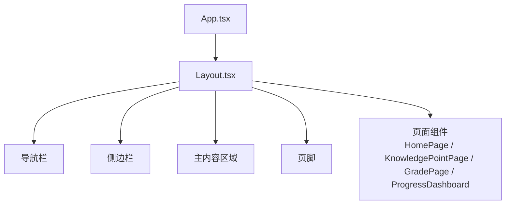
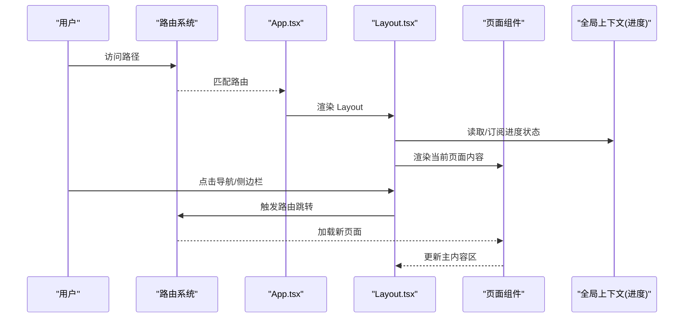
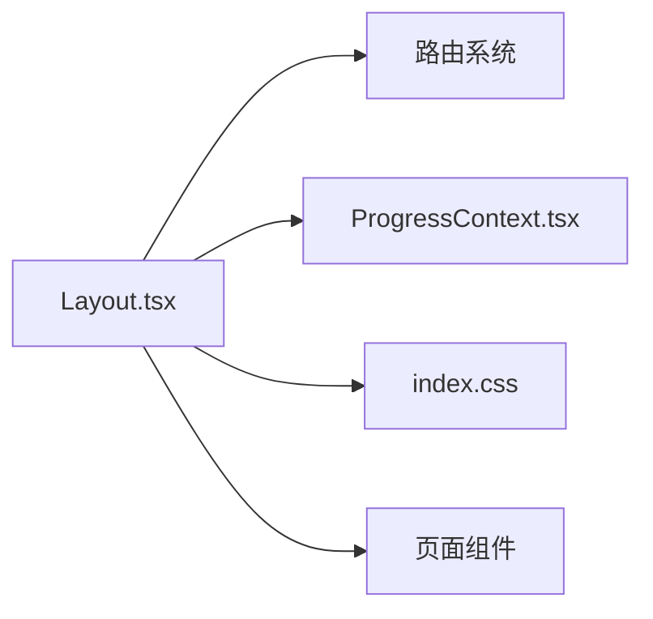

# Layout 布局组件

<cite>
**本文引用的文件**   
- [Layout.tsx](file://src/components/Layout.tsx)
- [App.tsx](file://src/App.tsx)
- [index.css](file://src/index.css)
- [ProgressContext.tsx](file://src/context/ProgressContext.tsx)
- [HomePage.tsx](file://src/pages/HomePage.tsx)
- [KnowledgePointPage.tsx](file://src/pages/KnowledgePointPage.tsx)
- [GradePage.tsx](file://src/pages/GradePage.tsx)
- [ProgressDashboard.tsx](file://src/pages/ProgressDashboard.tsx)
</cite>

## 目录
1. [简介](#简介)
2. [项目结构](#项目结构)
3. [核心组件](#核心组件)
4. [架构总览](#架构总览)
5. [详细组件分析](#详细组件分析)
6. [依赖分析](#依赖分析)
7. [性能考虑](#性能考虑)
8. [故障排查指南](#故障排查指南)
9. [结论](#结论)
10. [附录](#附录)

## 简介
本文件为 Layout 布局组件的完整技术文档，聚焦于该组件如何组织应用的页面布局结构（导航栏、侧边栏、主内容区域与页脚），并详细说明其 Props 接口、响应式行为、路由集成、全局状态管理、样式系统与主题支持、国际化配置以及使用示例与自定义布局模式。读者无需深入源码即可理解如何使用与扩展该组件。

## 项目结构
Layout 组件位于 src/components/Layout.tsx，作为应用级容器，被 App.tsx 引入并在不同页面中复用。页面级组件（如 HomePage、KnowledgePointPage、GradePage、ProgressDashboard）通过 Layout 包裹自身内容，实现统一的导航、侧边栏、主内容与页脚布局。

图表来源
- [App.tsx](file://src/App.tsx)
- [Layout.tsx](file://src/components/Layout.tsx)
- [HomePage.tsx](file://src/pages/HomePage.tsx)
- [KnowledgePointPage.tsx](file://src/pages/KnowledgePointPage.tsx)
- [GradePage.tsx](file://src/pages/GradePage.tsx)
- [ProgressDashboard.tsx](file://src/pages/ProgressDashboard.tsx)

章节来源
- [App.tsx](file://src/App.tsx)
- [Layout.tsx](file://src/components/Layout.tsx)

## 核心组件
Layout 组件负责：
- 提供统一的应用外壳：顶部导航栏、左侧导航/工具栏、主内容区与底部页脚
- 根据屏幕尺寸切换布局模式（桌面端多列布局，移动端堆叠或隐藏侧边栏）
- 集成路由上下文，确保导航跳转后保持布局稳定
- 接入全局进度上下文，展示学习进度相关的全局信息
- 提供主题开关与语言切换入口（若启用）
- 通过 Props 暴露布局配置项，允许父级定制显示与行为

章节来源
- [Layout.tsx](file://src/components/Layout.tsx)
- [ProgressContext.tsx](file://src/context/ProgressContext.tsx)

## 架构总览
Layout 在应用中的角色是“壳组件”，它不承载业务逻辑，而是编排子组件与全局上下文，使页面组件专注于内容渲染。

图表来源
- [App.tsx](file://src/App.tsx)
- [Layout.tsx](file://src/components/Layout.tsx)
- [ProgressContext.tsx](file://src/context/ProgressContext.tsx)

## 详细组件分析

### 组件职责与边界
- 导航栏：应用标题、主要导航入口、主题与语言切换按钮（可选）
- 侧边栏：课程/知识点目录、快捷操作、筛选条件（可折叠）
- 主内容区：页面内容渲染容器，支持滚动与自适应高度
- 页脚：版权信息、帮助链接、版本提示等

这些区域通过 CSS Grid/Flexbox 组合，结合媒体查询与 JS 断点判断，实现响应式适配。

章节来源
- [Layout.tsx](file://src/components/Layout.tsx)
- [index.css](file://src/index.css)

### Props 接口定义
Layout 的 Props 用于控制布局与行为，常见字段包括：
- layoutConfig：布局配置对象
  - showHeader：是否显示头部导航
  - showSidebar：是否显示侧边栏
  - showFooter：是否显示页脚
  - sidebarWidth：侧边栏宽度（像素或百分比）
  - headerHeight：头部高度
  - contentPadding：主内容区内边距
  - breakpoint：响应式断点阈值（如 768px）
- theme：主题设置
  - mode：主题模式（light/dark/system）
  - colors：颜色覆盖（primary/accent/background/text）
  - typography：字体族与字号策略
- i18n：国际化配置
  - locale：当前语言代码
  - messages：文案映射表
  - fallbackLocale：回退语言
- onNavigate：导航回调，接收目标路径
- onToggleSidebar：侧边栏开关回调
- onThemeChange：主题切换回调
- onLanguageChange：语言切换回调
- children：主内容区插槽

说明：
- 未提供的字段将采用默认值，保证最小可用布局
- 所有回调均为可选，便于按需扩展

章节来源
- [Layout.tsx](file://src/components/Layout.tsx)

### 响应式行为与适配
- 断点判断：基于窗口宽度与配置的 breakpoint，动态切换布局模式
- 移动端：自动隐藏侧边栏，提供抽屉式展开；头部简化为汉堡菜单
- 平板端：侧边栏半宽显示，主内容区自适应剩余空间
- 桌面端：固定侧边栏宽度，主内容区弹性填充
- 滚动同步：主内容区独立滚动，避免影响导航与页脚

章节来源
- [Layout.tsx](file://src/components/Layout.tsx)
- [index.css](file://src/index.css)

### 路由集成
- 与路由系统协作，监听路径变化以高亮当前导航项
- 点击导航项时调用 onNavigate，由上层路由管理器处理跳转
- 支持外链与内部路由的统一处理
- 路由守卫：在需要时拦截跳转并提示登录或权限不足

章节来源
- [Layout.tsx](file://src/components/Layout.tsx)
- [App.tsx](file://src/App.tsx)

### 全局状态管理
- 通过 ProgressContext 获取学习进度、完成度、里程碑等信息
- 在导航栏或侧边栏展示进度摘要（如进度条、徽章）
- 当进度更新时，Layout 仅重新渲染必要区域，避免整页刷新

章节来源
- [ProgressContext.tsx](file://src/context/ProgressContext.tsx)
- [Layout.tsx](file://src/components/Layout.tsx)

### 样式系统与主题支持
- 使用 CSS 变量定义主题色、间距、圆角、阴影等
- 支持 light/dark 两种主题模式，并可按系统偏好自动切换
- 提供颜色与字体的覆盖能力，满足品牌定制需求
- 响应式样式通过媒体查询与容器查询组合实现

章节来源
- [index.css](file://src/index.css)
- [Layout.tsx](file://src/components/Layout.tsx)

### 国际化配置
- 通过 i18n.locale 指定当前语言
- 文案从 i18n.messages 中查找，缺失时回退到 i18n.fallbackLocale
- 支持运行时切换语言，Layout 会更新导航与提示信息

章节来源
- [Layout.tsx](file://src/components/Layout.tsx)

### 使用示例与自定义布局模式
- 基础用法：传入 children 与基本 layoutConfig，快速搭建标准布局
- 全屏模式：隐藏侧边栏与页脚，适合沉浸式阅读或演示
- 双栏模式：调整 sidebarWidth 与 contentPadding，实现左右分栏
- 移动端优先：设置 breakpoint 为较小值，优先优化小屏体验
- 主题定制：通过 theme.colors 覆盖品牌色，提升一致性
- 语言切换：在导航栏添加语言选择器，调用 onLanguageChange

章节来源
- [Layout.tsx](file://src/components/Layout.tsx)
- [HomePage.tsx](file://src/pages/HomePage.tsx)
- [KnowledgePointPage.tsx](file://src/pages/KnowledgePointPage.tsx)
- [GradePage.tsx](file://src/pages/GradePage.tsx)
- [ProgressDashboard.tsx](file://src/pages/ProgressDashboard.tsx)

## 依赖分析
Layout 组件依赖以下模块：
- 路由系统：用于导航与路径高亮
- 全局上下文：进度状态与可能的用户信息
- 样式系统：CSS 变量与主题类名
- 页面组件：作为内容插槽渲染

图表来源
- [Layout.tsx](file://src/components/Layout.tsx)
- [ProgressContext.tsx](file://src/context/ProgressContext.tsx)
- [index.css](file://src/index.css)
- [HomePage.tsx](file://src/pages/HomePage.tsx)
- [KnowledgePointPage.tsx](file://src/pages/KnowledgePointPage.tsx)
- [GradePage.tsx](file://src/pages/GradePage.tsx)
- [ProgressDashboard.tsx](file://src/pages/ProgressDashboard.tsx)

章节来源
- [Layout.tsx](file://src/components/Layout.tsx)
- [ProgressContext.tsx](file://src/context/ProgressContext.tsx)
- [index.css](file://src/index.css)

## 性能考虑
- 懒加载侧边栏内容：仅在展开时渲染，减少初始包体积
- 防抖窗口大小变化：避免频繁重排与重绘
- 局部更新：仅订阅必要的上下文片段，降低无关渲染
- 虚拟列表：长列表场景下使用虚拟化提升滚动性能
- 图片与资源优化：按需加载与压缩，减少首屏时间

[本节为通用指导，不直接分析具体文件]

## 故障排查指南
常见问题与解决思路：
- 侧边栏不显示：检查 layoutConfig.showSidebar 与 breakpoint 设置；确认移动端抽屉开关逻辑
- 主题无效：确认 theme.mode 与 CSS 变量覆盖是否正确；检查浏览器开发者工具中的样式计算
- 路由跳转无响应：验证 onNavigate 是否绑定；确认路由配置与路径匹配
- 进度不更新：检查 ProgressContext 的提供者是否包裹应用根节点；确认数据源更新逻辑
- 国际化文案缺失：确认 i18n.messages 包含对应键；检查 fallbackLocale 是否生效

章节来源
- [Layout.tsx](file://src/components/Layout.tsx)
- [ProgressContext.tsx](file://src/context/ProgressContext.tsx)
- [index.css](file://src/index.css)

## 结论
Layout 组件作为应用的核心布局骨架，提供了稳定的导航、侧边栏、主内容与页脚结构，并通过 Props 暴露灵活的配置项，支持响应式适配、主题定制与国际化。它与路由系统和全局上下文无缝集成，确保页面切换与状态更新的流畅体验。通过合理配置与扩展，可满足多种业务场景下的布局需求。

[本节为总结性内容，不直接分析具体文件]

## 附录
- 最佳实践
  - 将布局配置抽离为常量，便于统一管理
  - 在移动端优先设计，逐步增强桌面端体验
  - 使用语义化 HTML 与 ARIA 属性，提升可访问性
  - 对复杂侧边栏内容实施懒加载与分页
- 扩展建议
  - 增加面包屑导航，提升层级感知
  - 提供快捷键支持，提高操作效率
  - 集成错误边界，捕获渲染异常并友好提示

[本节为概念性内容，不直接分析具体文件]