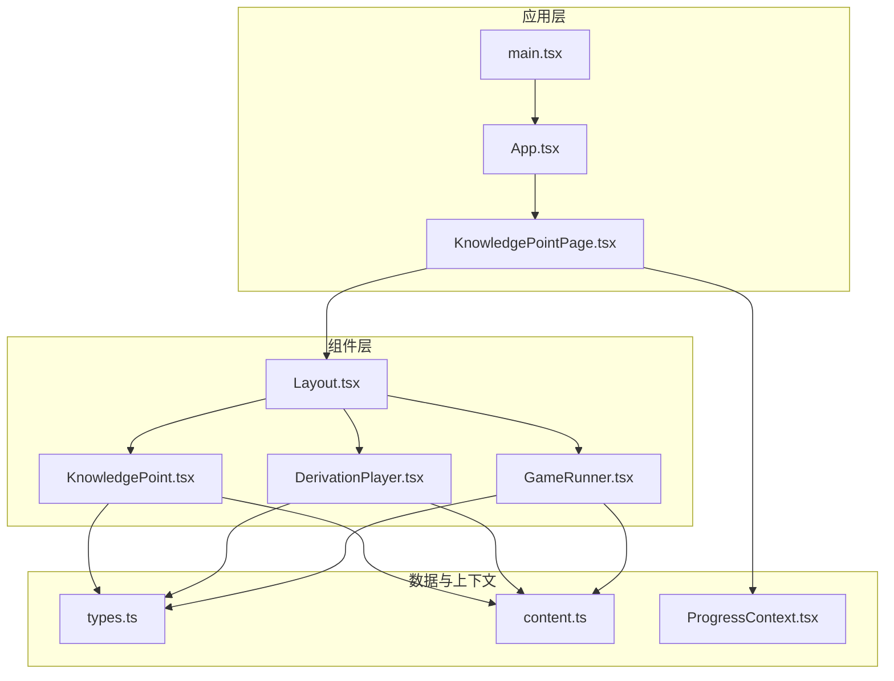
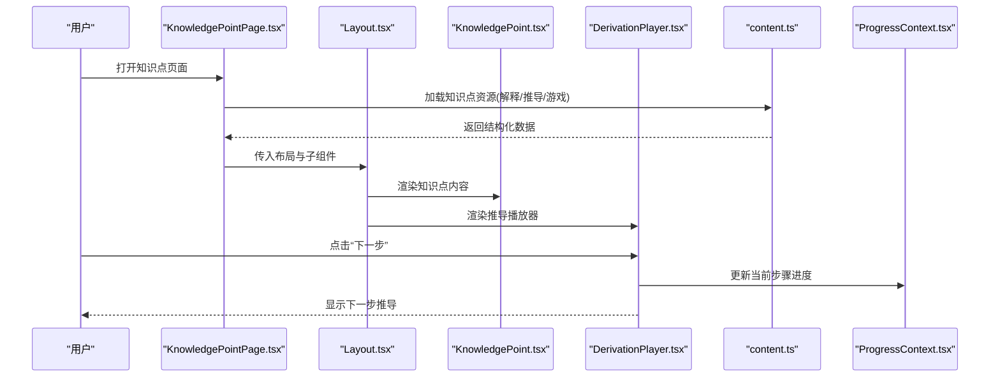
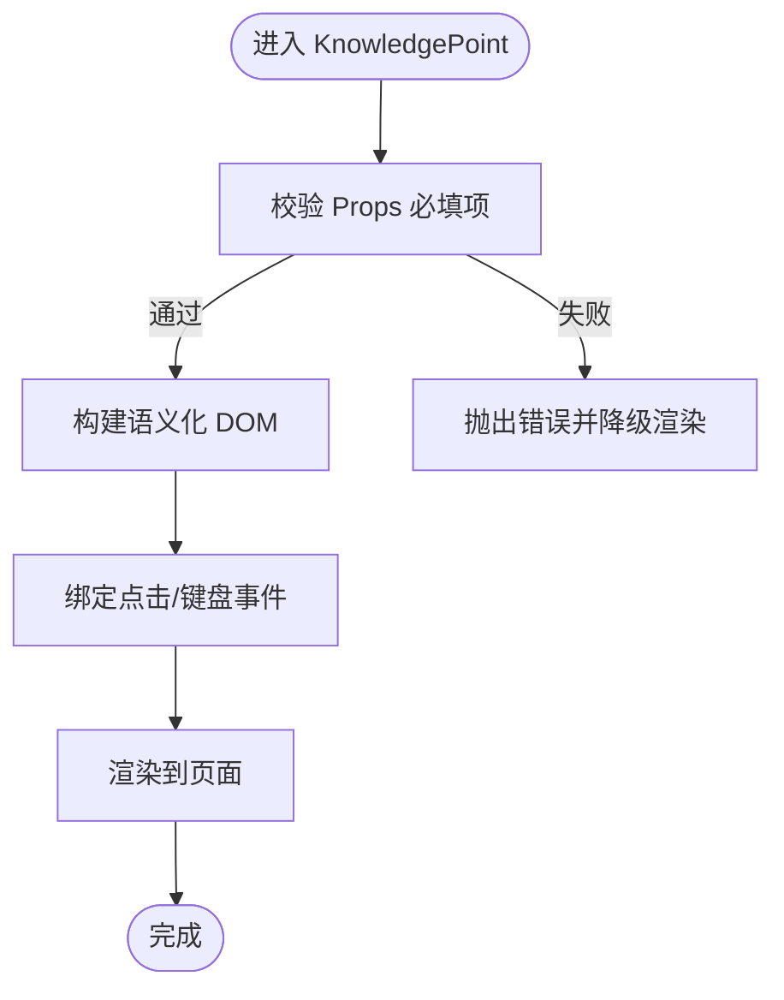
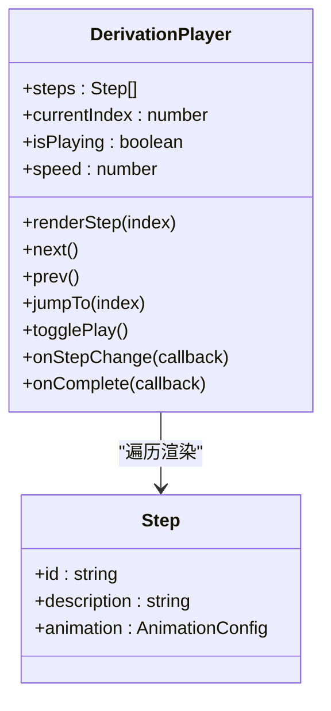
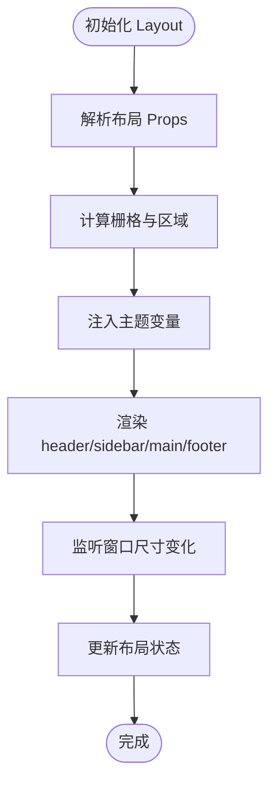
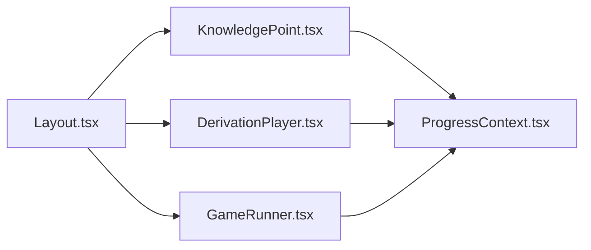
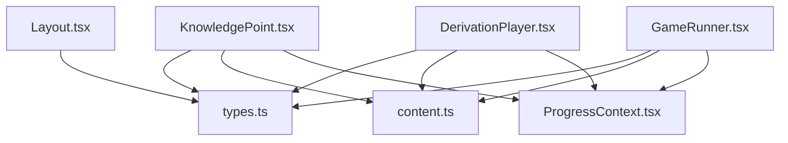

# UI 组件库

<cite>
**本文引用的文件**   
- [src/components/KnowledgePoint.tsx](file://src/components/KnowledgePoint.tsx)
- [src/components/DerivationPlayer.tsx](file://src/components/DerivationPlayer.tsx)
- [src/components/Layout.tsx](file://src/components/Layout.tsx)
- [src/components/GameRunner.tsx](file://src/components/GameRunner.tsx)
- [src/lib/types.ts](file://src/lib/types.ts)
- [src/lib/content.ts](file://src/lib/content.ts)
- [src/context/ProgressContext.tsx](file://src/context/ProgressContext.tsx)
- [src/pages/KnowledgePointPage.tsx](file://src/pages/KnowledgePointPage.tsx)
- [src/App.tsx](file://src/App.tsx)
- [src/main.tsx](file://src/main.tsx)
- [package.json](file://package.json)
</cite>

## 目录
1. [简介](#简介)
2. [项目结构](#项目结构)
3. [核心组件](#核心组件)
4. [架构总览](#架构总览)
5. [详细组件分析](#详细组件分析)
6. [依赖关系分析](#依赖关系分析)
7. [性能考量](#性能考量)
8. [故障排查指南](#故障排查指南)
9. [结论](#结论)
10. [附录](#附录)

## 简介
本文件为 math-k6 UI 组件库的权威文档，聚焦于以下三个核心组件：KnowledgePoint、DerivationPlayer、Layout。文档从设计模式、Props 接口、渲染流程、样式定制、事件处理、响应式行为、组合模式、主题支持与可访问性等方面进行全面说明，并提供使用示例与最佳实践，帮助开发者快速集成与扩展。

## 项目结构
math-k6 采用基于功能分层的组织方式：
- components：UI 组件（知识点、推导播放器、布局、游戏运行器等）
- content：按知识点划分的资源（解释文本、推导数据、游戏配置、元信息）
- lib：类型定义、内容加载与进度管理工具
- context：全局上下文（如学习进度）
- pages：页面级路由与编排
- visualizations：数学可视化图表与模型
- App/main：应用入口与根组件

**图示来源** 
- [src/App.tsx](file://src/App.tsx)
- [src/main.tsx](file://src/main.tsx)
- [src/pages/KnowledgePointPage.tsx](file://src/pages/KnowledgePointPage.tsx)
- [src/components/Layout.tsx](file://src/components/Layout.tsx)
- [src/components/KnowledgePoint.tsx](file://src/components/KnowledgePoint.tsx)
- [src/components/DerivationPlayer.tsx](file://src/components/DerivationPlayer.tsx)
- [src/components/GameRunner.tsx](file://src/components/GameRunner.tsx)
- [src/lib/content.ts](file://src/lib/content.ts)
- [src/lib/types.ts](file://src/lib/types.ts)
- [src/context/ProgressContext.tsx](file://src/context/ProgressContext.tsx)

**章节来源**
- [src/App.tsx](file://src/App.tsx)
- [src/main.tsx](file://src/main.tsx)
- [package.json](file://package.json)

## 核心组件
- KnowledgePoint：负责渲染知识点内容（解释文本、图片、公式等），提供标题、正文、媒体与交互插槽，支持无障碍标签与键盘导航。
- DerivationPlayer：负责渲染数学推导过程（步骤序列、动画控制、回放、暂停/继续、步序跳转），内置进度与状态管理。
- Layout：负责页面骨架与区域划分（头部、侧边栏、主内容区、底部），提供响应式栅格与主题变量注入。

**章节来源**
- [src/components/KnowledgePoint.tsx](file://src/components/KnowledgePoint.tsx)
- [src/components/DerivationPlayer.tsx](file://src/components/DerivationPlayer.tsx)
- [src/components/Layout.tsx](file://src/components/Layout.tsx)

## 架构总览
组件间通过 props 与上下文进行通信，数据流自下而上（内容加载→组件渲染→用户交互→进度更新）。

**图示来源** 
- [src/pages/KnowledgePointPage.tsx](file://src/pages/KnowledgePointPage.tsx)
- [src/components/Layout.tsx](file://src/components/Layout.tsx)
- [src/components/KnowledgePoint.tsx](file://src/components/KnowledgePoint.tsx)
- [src/components/DerivationPlayer.tsx](file://src/components/DerivationPlayer.tsx)
- [src/lib/content.ts](file://src/lib/content.ts)
- [src/context/ProgressContext.tsx](file://src/context/ProgressContext.tsx)

## 详细组件分析

### KnowledgePoint 组件
- 设计模式
  - 受控渲染：由外部传入知识点数据（标题、正文、媒体、元信息），内部仅负责展示与基础交互。
  - 插槽化扩展：预留插槽用于插入自定义媒体或交互元素。
  - 无障碍优先：语义化标签、aria-* 属性、键盘可达性。
- Props 接口要点
  - 标题、正文、媒体列表、元信息（难度、年级、标签）、事件回调（点击、完成、错误）。
  - 可选的主题覆盖键（颜色、字号、间距）。
- 渲染流程
  - 解析输入数据 → 校验必填字段 → 生成 DOM 结构 → 绑定事件 → 输出。
- 样式定制
  - CSS 变量注入（主题色、字体、圆角、阴影）。
  - 响应式断点适配（移动端单列、桌面端双列）。
- 事件处理
  - 点击媒体预览、展开折叠、标记已学、提交反馈。
- 响应式行为
  - 小屏隐藏次要信息，放大关键公式与图示。
- 可访问性
  - 标题层级正确、图片 alt、焦点顺序、屏幕阅读器友好。

**图示来源** 
- [src/components/KnowledgePoint.tsx](file://src/components/KnowledgePoint.tsx)

**章节来源**
- [src/components/KnowledgePoint.tsx](file://src/components/KnowledgePoint.tsx)
- [src/lib/types.ts](file://src/lib/types.ts)

### DerivationPlayer 组件
- 设计模式
  - 状态机驱动：步骤序列作为状态，前进/后退/跳转触发状态转换。
  - 受控播放：外部控制播放状态（开始/暂停/停止），内部维护当前步索引与动画帧。
- Props 接口要点
  - 推导数据（步骤数组、每步描述、动画参数）、控制按钮可见性、自动播放开关、速度调节、回调（onStepChange、onComplete）。
- 渲染流程
  - 加载推导数据 → 初始化状态 → 渲染当前步骤 → 监听用户操作 → 更新状态与视图。
- 样式定制
  - 步骤卡片样式、高亮当前步、过渡动画时长与缓动函数。
- 事件处理
  - 上一步/下一步、跳转到指定步、暂停/继续、完成回调。
- 响应式行为
  - 移动端增大触控区域，减少动画复杂度以提升流畅度。
- 可访问性
  - 步骤朗读、键盘快捷键（左右箭头）、ARIA 角色与状态同步。

**图示来源** 
- [src/components/DerivationPlayer.tsx](file://src/components/DerivationPlayer.tsx)
- [src/lib/types.ts](file://src/lib/types.ts)

**章节来源**
- [src/components/DerivationPlayer.tsx](file://src/components/DerivationPlayer.tsx)
- [src/lib/types.ts](file://src/lib/types.ts)

### Layout 组件
- 设计模式
  - 容器组件：接收 children 并按区域分配（header、sidebar、main、footer）。
  - 主题注入：提供 CSS 变量与类名前缀，便于全局主题切换。
- Props 接口要点
  - 区域显隐控制、侧边栏宽度、是否固定头部、响应式断点、主题键。
- 渲染流程
  - 解析布局配置 → 计算栅格 → 渲染区域 → 注入主题样式。
- 样式定制
  - 网格系统、间距、边框、阴影、暗色/亮色主题切换。
- 事件处理
  - 侧边栏展开/收起、窗口尺寸变化监听。
- 响应式行为
  - 根据视口宽度动态调整布局（移动端堆叠、桌面端并排）。
- 可访问性
  - 区域 landmark 语义（header、nav、main、footer）、焦点管理。

**图示来源** 
- [src/components/Layout.tsx](file://src/components/Layout.tsx)

**章节来源**
- [src/components/Layout.tsx](file://src/components/Layout.tsx)

### 组件组合模式
- 典型组合：Layout 包裹 KnowledgePoint 与 DerivationPlayer，形成“讲解+推导”的学习单元。
- 数据共享：通过 ProgressContext 共享学习进度，避免重复状态。
- 可扩展性：新增可视化组件时，只需遵循统一 Props 接口即可嵌入 Layout 主区域。

**图示来源** 
- [src/components/Layout.tsx](file://src/components/Layout.tsx)
- [src/components/KnowledgePoint.tsx](file://src/components/KnowledgePoint.tsx)
- [src/components/DerivationPlayer.tsx](file://src/components/DerivationPlayer.tsx)
- [src/components/GameRunner.tsx](file://src/components/GameRunner.tsx)
- [src/context/ProgressContext.tsx](file://src/context/ProgressContext.tsx)

## 依赖关系分析
- 组件依赖
  - KnowledgePoint 依赖 types 与 content 工具。
  - DerivationPlayer 依赖 types 与 content 工具。
  - Layout 依赖 types 与主题变量。
- 上下文依赖
  - ProgressContext 被多个组件订阅以同步进度。
- 外部依赖
  - React、Vite、TypeScript、CSS 变量系统。

**图示来源** 
- [src/components/KnowledgePoint.tsx](file://src/components/KnowledgePoint.tsx)
- [src/components/DerivationPlayer.tsx](file://src/components/DerivationPlayer.tsx)
- [src/components/Layout.tsx](file://src/components/Layout.tsx)
- [src/components/GameRunner.tsx](file://src/components/GameRunner.tsx)
- [src/lib/types.ts](file://src/lib/types.ts)
- [src/lib/content.ts](file://src/lib/content.ts)
- [src/context/ProgressContext.tsx](file://src/context/ProgressContext.tsx)

**章节来源**
- [src/lib/types.ts](file://src/lib/types.ts)
- [src/lib/content.ts](file://src/lib/content.ts)
- [src/context/ProgressContext.tsx](file://src/context/ProgressContext.tsx)

## 性能考量
- 懒加载：知识点内容与推导数据按需加载，减少首屏体积。
- 防抖节流：窗口尺寸变化与频繁点击事件进行节流处理。
- 动画优化：移动端降低动画复杂度，使用 transform 与 will-change 提升渲染性能。
- 缓存策略：对常用知识点数据进行内存缓存，避免重复请求。

[本节为通用指导，不直接分析具体文件]

## 故障排查指南
- 常见问题
  - 知识点未渲染：检查 content 数据结构是否符合 types 定义。
  - 推导播放器无响应：确认步骤数组非空且 currentIndex 在有效范围。
  - 布局错乱：检查 CSS 变量是否正确注入与断点设置。
- 调试建议
  - 使用浏览器开发者工具查看组件 props 与状态。
  - 在 ProgressContext 中打印进度变更日志。
  - 对 content.ts 的加载路径进行断点验证。

**章节来源**
- [src/lib/content.ts](file://src/lib/content.ts)
- [src/context/ProgressContext.tsx](file://src/context/ProgressContext.tsx)

## 结论
math-k6 UI 组件库以 KnowledgePoint、DerivationPlayer、Layout 为核心，构建了“讲解—推导—练习”的完整学习闭环。通过统一的类型定义、上下文共享与主题注入，实现了高内聚、低耦合与良好的可扩展性。遵循本文档的最佳实践，可快速搭建稳定、可访问、高性能的数学学习界面。

[本节为总结性内容，不直接分析具体文件]

## 附录
- 使用示例（概念性）
  - 在页面中引入 Layout，并在主区域放置 KnowledgePoint 与 DerivationPlayer。
  - 通过 ProgressContext 订阅进度变化，实现跨组件的状态同步。
  - 使用 CSS 变量覆盖主题，实现暗色/亮色切换。
- 最佳实践
  - 始终提供语义化标签与 aria-* 属性。
  - 对小屏设备进行触控与可读性优化。
  - 对复杂动画进行降级处理，确保低端设备可用性。

[本节为概念性内容，不直接分析具体文件]