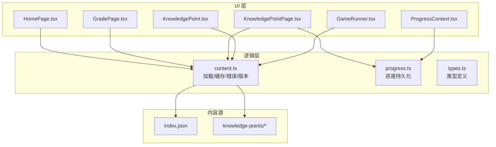
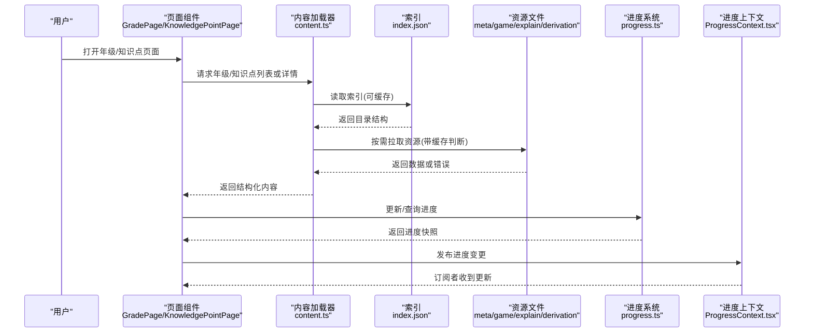
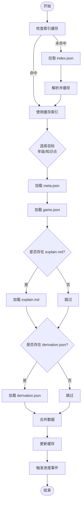
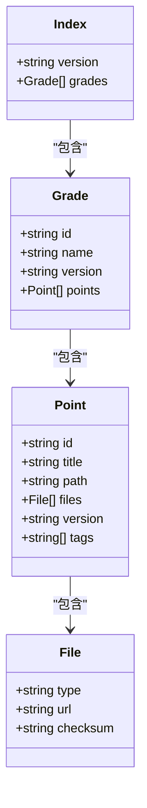
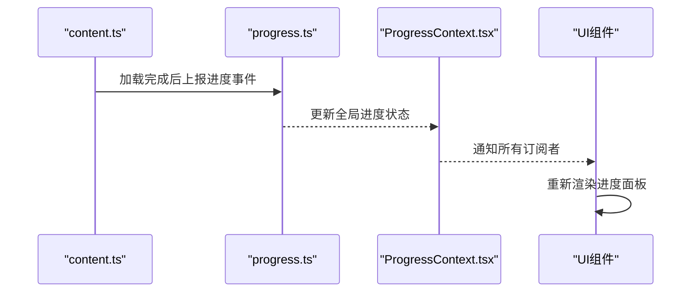
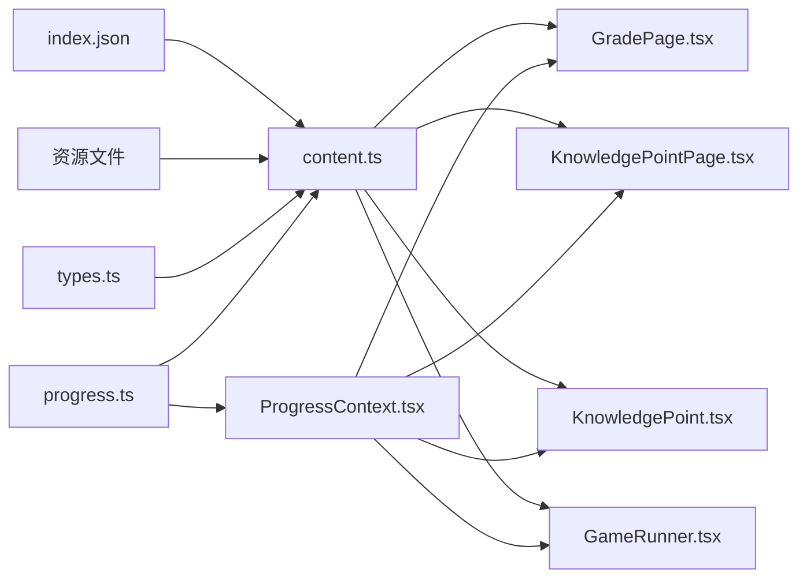

# 内容加载机制

<cite>
**本文引用的文件**   
- [content.ts](file://src/lib/content.ts)
- [index.json](file://src/content/index.json)
- [ProgressContext.tsx](file://src/context/ProgressContext.tsx)
- [progress.ts](file://src/lib/progress.ts)
- [types.ts](file://src/lib/types.ts)
- [KnowledgePointPage.tsx](file://src/pages/KnowledgePointPage.tsx)
- [GradePage.tsx](file://src/pages/GradePage.tsx)
- [HomePage.tsx](file://src/pages/HomePage.tsx)
- [GameRunner.tsx](file://src/components/GameRunner.tsx)
- [KnowledgePoint.tsx](file://src/components/KnowledgePoint.tsx)
</cite>

## 目录
1. [简介](#简介)
2. [项目结构](#项目结构)
3. [核心组件](#核心组件)
4. [架构总览](#架构总览)
5. [详细组件分析](#详细组件分析)
6. [依赖关系分析](#依赖关系分析)
7. [性能考虑](#性能考虑)
8. [故障排查指南](#故障排查指南)
9. [结论](#结论)
10. [附录](#附录)

## 简介
本文件面向 math-k6 的内容加载机制，围绕 src/lib/content.ts 中的内容加载函数、缓存策略与错误处理进行深入解析；说明 src/content/index.json 索引文件的作用与结构；解释知识点目录的遍历算法；记录异步加载流程、进度跟踪与数据同步机制。同时提供版本管理、增量更新与缓存失效策略的实践建议，并给出性能优化与调试方法。文档力求对非技术读者友好，并通过图示帮助理解。

## 项目结构
- 内容与资源
  - src/content/knowledge-points：按年级与知识点划分的目录，每个知识点包含 meta.json、game.json、explain.md、derivation.json 等。
  - src/content/index.json：全局索引，描述年级与知识点的层级结构与元信息。
- 逻辑层
  - src/lib/content.ts：内容加载、缓存、错误处理、版本与增量更新的核心实现。
  - src/lib/progress.ts：学习进度持久化与计算。
  - src/lib/types.ts：类型定义（知识点、游戏、元数据、索引结构等）。
- UI 层
  - src/pages/*：页面入口，触发不同范围的内容加载（首页、年级页、知识点页）。
  - src/components/*：渲染与交互组件（如 KnowledgePoint.tsx、GameRunner.tsx）。
  - src/context/ProgressContext.tsx：进度上下文，跨组件共享进度状态。

**图表来源** 
- [content.ts](file://src/lib/content.ts)
- [index.json](file://src/content/index.json)
- [progress.ts](file://src/lib/progress.ts)
- [types.ts](file://src/lib/types.ts)
- [HomePage.tsx](file://src/pages/HomePage.tsx)
- [GradePage.tsx](file://src/pages/GradePage.tsx)
- [KnowledgePointPage.tsx](file://src/pages/KnowledgePointPage.tsx)
- [KnowledgePoint.tsx](file://src/components/KnowledgePoint.tsx)
- [GameRunner.tsx](file://src/components/GameRunner.tsx)
- [ProgressContext.tsx](file://src/context/ProgressContext.tsx)

**章节来源**
- [content.ts](file://src/lib/content.ts)
- [index.json](file://src/content/index.json)
- [progress.ts](file://src/lib/progress.ts)
- [types.ts](file://src/lib/types.ts)
- [HomePage.tsx](file://src/pages/HomePage.tsx)
- [GradePage.tsx](file://src/pages/GradePage.tsx)
- [KnowledgePointPage.tsx](file://src/pages/KnowledgePointPage.tsx)
- [KnowledgePoint.tsx](file://src/components/KnowledgePoint.tsx)
- [GameRunner.tsx](file://src/components/GameRunner.tsx)
- [ProgressContext.tsx](file://src/context/ProgressContext.tsx)

## 核心组件
- 内容加载器 content.ts
  - 负责从 index.json 构建目录树、按需拉取知识点资源（meta/game/explain/derivation）、维护内存缓存与本地缓存、处理网络与解析错误、支持版本与增量更新。
- 索引文件 index.json
  - 描述年级到知识点的映射、路径、元信息与版本标记，作为内容发现与预取的依据。
- 进度系统 progress.ts + ProgressContext.tsx
  - 记录用户完成度、练习次数、正确率等，并在 UI 中实时展示。
- 类型定义 types.ts
  - 统一知识点、游戏、元数据、索引等数据结构，确保前后端一致。

**章节来源**
- [content.ts](file://src/lib/content.ts)
- [index.json](file://src/content/index.json)
- [progress.ts](file://src/lib/progress.ts)
- [types.ts](file://src/lib/types.ts)
- [ProgressContext.tsx](file://src/context/ProgressContext.tsx)

## 架构总览
内容加载的整体流程如下：
- 启动时或进入页面时，先读取 index.json 获取目录结构。
- 根据用户选择（年级/知识点）按需加载对应资源，命中缓存则直接返回。
- 加载失败时进行重试与降级，并上报错误。
- 进度通过 context 与 progress.ts 同步，供 UI 展示。

**图表来源** 
- [content.ts](file://src/lib/content.ts)
- [index.json](file://src/content/index.json)
- [progress.ts](file://src/lib/progress.ts)
- [ProgressContext.tsx](file://src/context/ProgressContext.tsx)
- [GradePage.tsx](file://src/pages/GradePage.tsx)
- [KnowledgePointPage.tsx](file://src/pages/KnowledgePointPage.tsx)

## 详细组件分析

### 内容加载器 content.ts
- 功能要点
  - 目录构建：基于 index.json 生成年级→知识点的树形结构，便于快速检索。
  - 资源加载：按知识点 ID 拉取 meta.json、game.json、explain.md、derivation.json，支持并发与去重。
  - 缓存策略：内存 Map 缓存热点数据；可选本地存储（localStorage/IndexedDB）做离线与持久化。
  - 错误处理：网络异常、JSON 解析失败、字段缺失等场景的统一封装与重试。
  - 版本与增量：通过版本号或时间戳比较，仅拉取变更资源；支持回滚与降级。
  - 进度集成：在加载完成后触发进度更新回调，供 UI 刷新。
- 关键接口（概念性）
  - getGradeList(): Promise<Grade[]>
  - getKnowledgePoints(gradeId): Promise<KnowledgePoint[]>
  - loadKnowledgePoint(id, options?): Promise<KnowledgePointData>
  - preloadRange(range): Promise<void>
  - clearCache(keys?): Promise<void>
  - onProgress(callback): Unsubscribe
- 缓存设计
  - 内存缓存：以 key=资源路径为键，value=解析后的对象，设置 TTL 与最大容量。
  - 本地缓存：写入前校验版本，避免覆盖新版本；读取失败回退到网络。
  - 失效策略：按知识点粒度失效；支持全量清理与按年级清理。
- 错误处理
  - 分类：网络错误、解析错误、业务校验错误。
  - 行为：重试（指数退避）、降级（返回最小可用数据）、上报（日志/监控）。
- 版本与增量
  - 版本来源：index.json 的 version 字段或资源文件的 _v/_t 标记。
  - 增量策略：对比本地与远端版本，仅下载差异；合并冲突时采用“最新优先”或“用户确认”。

**图表来源** 
- [content.ts](file://src/lib/content.ts)
- [index.json](file://src/content/index.json)

**章节来源**
- [content.ts](file://src/lib/content.ts)

### 索引文件 index.json
- 作用
  - 提供年级与知识点的完整目录，包括 id、名称、路径、版本、依赖关系等。
  - 作为预取与懒加载的依据，减少不必要的请求。
- 结构（概念性）
  - grades: 年级数组，每项包含 id、name、version、points[]。
  - points: 知识点项，包含 id、title、path、files[]、version、tags 等。
  - files: 资源清单，包含 type（meta/game/explain/derivation）、url、checksum 等。
- 遍历算法
  - 深度优先或广度优先均可；推荐按年级分组后顺序遍历，保证 UI 渲染稳定。
  - 过滤与排序：支持按标签、难度、版本筛选与排序。
- 版本管理
  - 全局 version 与局部 point.version 共同决定增量更新范围。
  - 当 index 版本变化时，强制刷新相关缓存。

**图表来源** 
- [index.json](file://src/content/index.json)

**章节来源**
- [index.json](file://src/content/index.json)

### 进度系统与上下文
- progress.ts
  - 记录知识点完成状态、练习次数、正确率、最近学习时间等。
  - 提供 save/load 接口，支持本地持久化与冲突合并。
- ProgressContext.tsx
  - 暴露进度状态与更新方法，订阅者可在任意组件消费。
  - 与 content.ts 联动：内容加载完成后触发进度刷新。

**图表来源** 
- [content.ts](file://src/lib/content.ts)
- [progress.ts](file://src/lib/progress.ts)
- [ProgressContext.tsx](file://src/context/ProgressContext.tsx)

**章节来源**
- [progress.ts](file://src/lib/progress.ts)
- [ProgressContext.tsx](file://src/context/ProgressContext.tsx)

### 页面与组件调用示例（概念性）
- 加载特定年级内容
  - 在 GradePage.tsx 中调用 content.getGradeList() 获取年级列表，再根据选择的 gradeId 调用 content.getKnowledgePoints(gradeId)。
- 加载特定知识点内容
  - 在 KnowledgePointPage.tsx 中调用 content.loadKnowledgePoint(pointId)，成功后渲染 KnowledgePoint.tsx 与 GameRunner.tsx。
- 预取与懒加载
  - 在 HomePage.tsx 中根据用户浏览轨迹预取相邻知识点，提升切换速度。

**章节来源**
- [GradePage.tsx](file://src/pages/GradePage.tsx)
- [KnowledgePointPage.tsx](file://src/pages/KnowledgePointPage.tsx)
- [KnowledgePoint.tsx](file://src/components/KnowledgePoint.tsx)
- [GameRunner.tsx](file://src/components/GameRunner.tsx)

## 依赖关系分析
- content.ts 依赖
  - index.json：目录与版本信息。
  - 资源文件：meta/game/explain/derivation。
  - progress.ts：进度持久化。
  - types.ts：类型约束。
- UI 依赖
  - pages/* 与 components/* 通过 content.ts 获取数据，通过 ProgressContext.tsx 消费进度。

**图表来源** 
- [content.ts](file://src/lib/content.ts)
- [index.json](file://src/content/index.json)
- [progress.ts](file://src/lib/progress.ts)
- [types.ts](file://src/lib/types.ts)
- [GradePage.tsx](file://src/pages/GradePage.tsx)
- [KnowledgePointPage.tsx](file://src/pages/KnowledgePointPage.tsx)
- [KnowledgePoint.tsx](file://src/components/KnowledgePoint.tsx)
- [GameRunner.tsx](file://src/components/GameRunner.tsx)
- [ProgressContext.tsx](file://src/context/ProgressContext.tsx)

**章节来源**
- [content.ts](file://src/lib/content.ts)
- [index.json](file://src/content/index.json)
- [progress.ts](file://src/lib/progress.ts)
- [types.ts](file://src/lib/types.ts)
- [GradePage.tsx](file://src/pages/GradePage.tsx)
- [KnowledgePointPage.tsx](file://src/pages/KnowledgePointPage.tsx)
- [KnowledgePoint.tsx](file://src/components/KnowledgePoint.tsx)
- [GameRunner.tsx](file://src/components/GameRunner.tsx)
- [ProgressContext.tsx](file://src/context/ProgressContext.tsx)

## 性能考虑
- 缓存策略
  - 内存缓存：热点数据常驻，设置合理 TTL 与 LRU 淘汰。
  - 本地缓存：区分读写路径，写时校验版本，读时优先本地，失败回退网络。
  - 预取策略：基于用户行为预测，提前加载相邻知识点。
- 并发控制
  - 限制并发数，避免带宽拥塞；对大文件分片下载。
- 增量更新
  - 仅拉取变更资源，减少带宽与解析开销。
- 渲染优化
  - 骨架屏与占位符提升感知速度；虚拟滚动长列表。
- 监控与度量
  - 记录加载耗时、命中率、错误率，定位瓶颈。

[本节为通用指导，不直接分析具体文件]

## 故障排查指南
- 常见问题
  - 索引加载失败：检查网络、CORS、CDN 配置；查看 index.json 格式。
  - 资源解析错误：核对 JSON/Markdown 语法与字段完整性。
  - 缓存不一致：清理本地缓存后重试；检查版本字段是否递增。
  - 进度不同步：确认进度事件触发时机与订阅者是否正确注册。
- 调试方法
  - 启用详细日志，记录请求 URL、响应码、缓存命中情况。
  - 使用浏览器开发者工具观察 Network 与 Storage。
  - 在 content.ts 中添加断点，验证缓存键与失效逻辑。
  - 构造失败用例（模拟超时、404、500），验证重试与降级。

**章节来源**
- [content.ts](file://src/lib/content.ts)
- [progress.ts](file://src/lib/progress.ts)

## 结论
math-k6 的内容加载机制以 index.json 为核心，结合 content.ts 的缓存、错误处理与版本管理，实现了高效、可靠、可扩展的知识内容分发。配合 progress.ts 与 ProgressContext.tsx，形成完整的进度同步闭环。通过合理的并发控制、预取与增量更新策略，可在复杂内容规模下保持良好性能与用户体验。

[本节为总结性内容，不直接分析具体文件]

## 附录
- 最佳实践
  - 为每个知识点设置唯一稳定的 id 与版本号。
  - 将大文本（explain.md）与结构化数据（game.json、derivation.json）分离，便于独立缓存与更新。
  - 在 UI 层提供明确的加载状态与错误提示，提升可用性。
- 扩展方向
  - 引入 Service Worker 实现离线缓存与后台同步。
  - 增加 A/B 测试与个性化推荐，动态调整预取策略。
  - 接入服务端统计，收集加载与使用指标，持续优化。

[本节为补充性内容，不直接分析具体文件]