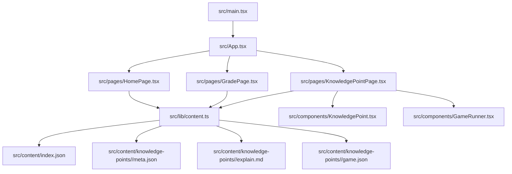
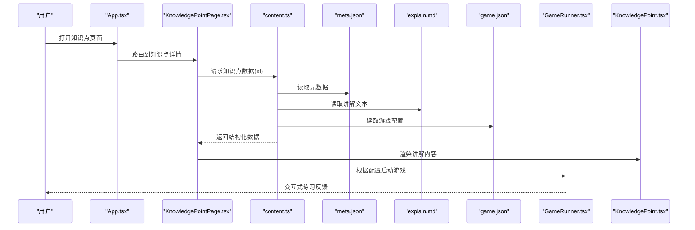
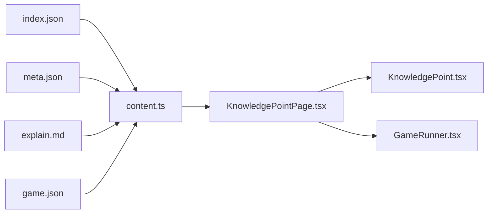
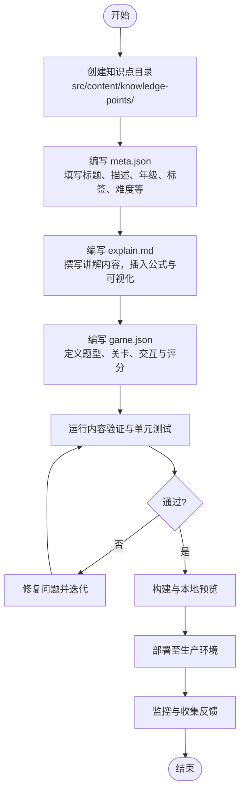

# 内容扩展指南

<cite>
**本文档引用的文件**   
- [README.md](file://README.md)
- [package.json](file://package.json)
- [vite.config.ts](file://vite.config.ts)
- [src/main.tsx](file://src/main.tsx)
- [src/App.tsx](file://src/App.tsx)
- [src/content/index.json](file://src/content/index.json)
- [src/lib/content.ts](file://src/lib/content.ts)
- [src/lib/types.ts](file://src/lib/types.ts)
- [src/components/KnowledgePoint.tsx](file://src/components/KnowledgePoint.tsx)
- [src/components/GameRunner.tsx](file://src/components/GameRunner.tsx)
- [src/pages/HomePage.tsx](file://src/pages/HomePage.tsx)
- [src/pages/GradePage.tsx](file://src/pages/GradePage.tsx)
- [src/pages/KnowledgePointPage.tsx](file://src/pages/KnowledgePointPage.tsx)
- [src/test/content.test.ts](file://src/test/content.test.ts)
- [src/test/gameRunner.test.ts](file://src/test/gameRunner.test.ts)
- [src/test/setup.ts](file://src/test/setup.ts)
- [src/content/knowledge-points/g3-add-sub-10000/meta.json](file://src/content/knowledge-points/g3-add-sub-10000/meta.json)
- [src/content/knowledge-points/g3-add-sub-10000/explain.md](file://src/content/knowledge-points/g3-add-sub-10000/explain.md)
- [src/content/knowledge-points/g3-add-sub-10000/game.json](file://src/content/knowledge-points/g3-add-sub-10000/game.json)
- [src/content/knowledge-points/g5-fraction-meaning/meta.json](file://src/content/knowledge-points/g5-fraction-meaning/meta.json)
</cite>

## 目录
1. [简介](#简介)
2. [项目结构](#项目结构)
3. [核心组件](#核心组件)
4. [架构总览](#架构总览)
5. [详细组件分析](#详细组件分析)
6. [依赖关系分析](#依赖关系分析)
7. [性能考虑](#性能考虑)
8. [故障排查指南](#故障排查指南)
9. [结论](#结论)
10. [附录](#附录)

## 简介
本指南面向希望在 math-k6 项目中新增“知识点”内容的作者与维护者。文档将系统说明：
- 如何创建新的知识点条目（目录结构、命名规范、必需文件清单）
- 内容开发工作流（从 meta.json 到 explain.md 与 game.json 的完整流程）
- 内容验证规则、测试方法与部署步骤
- 完整的知识点创建示例（从简单概念到复杂主题）
- 内容质量控制、版本管理与协作开发建议
- 多语言内容与响应式设计适配的处理方式

## 项目结构
math-k6 采用“内容即数据”的组织方式，知识点以目录为单位存放于 src/content/knowledge-points 下，每个子目录对应一个知识点，包含元数据、讲解与游戏配置等文件。应用通过统一的加载器读取 index.json 与各知识点的配置文件，渲染页面并驱动游戏运行。

图表来源
- [src/main.tsx](file://src/main.tsx)
- [src/App.tsx](file://src/App.tsx)
- [src/pages/HomePage.tsx](file://src/pages/HomePage.tsx)
- [src/pages/GradePage.tsx](file://src/pages/GradePage.tsx)
- [src/pages/KnowledgePointPage.tsx](file://src/pages/KnowledgePointPage.tsx)
- [src/lib/content.ts](file://src/lib/content.ts)
- [src/content/index.json](file://src/content/index.json)

章节来源
- [README.md](file://README.md)
- [package.json](file://package.json)
- [vite.config.ts](file://vite.config.ts)

## 核心组件
- 内容加载与类型定义
  - 内容加载器负责聚合 index.json 与各知识点目录下的 meta.json、explain.md、game.json，并提供统一的数据访问接口。
  - 类型定义集中管理知识点、游戏配置、进度等数据结构，确保前后端一致性与可维护性。
- 页面与组件
  - 首页与年级页负责导航与列表展示；知识点详情页负责渲染讲解与游戏。
  - KnowledgePoint 组件用于渲染讲解内容；GameRunner 组件负责根据 game.json 启动相应游戏。
- 测试
  - 针对内容加载、游戏运行与进度管理的单元测试，保障内容变更不会破坏现有功能。

章节来源
- [src/lib/content.ts](file://src/lib/content.ts)
- [src/lib/types.ts](file://src/lib/types.ts)
- [src/components/KnowledgePoint.tsx](file://src/components/KnowledgePoint.tsx)
- [src/components/GameRunner.tsx](file://src/components/GameRunner.tsx)
- [src/pages/HomePage.tsx](file://src/pages/HomePage.tsx)
- [src/pages/GradePage.tsx](file://src/pages/GradePage.tsx)
- [src/pages/KnowledgePointPage.tsx](file://src/pages/KnowledgePointPage.tsx)
- [src/test/content.test.ts](file://src/test/content.test.ts)
- [src/test/gameRunner.test.ts](file://src/test/gameRunner.test.ts)

## 架构总览
下图展示了从入口到内容渲染与游戏运行的整体调用链，以及内容文件的组织与加载路径。

图表来源
- [src/App.tsx](file://src/App.tsx)
- [src/pages/KnowledgePointPage.tsx](file://src/pages/KnowledgePointPage.tsx)
- [src/lib/content.ts](file://src/lib/content.ts)
- [src/components/KnowledgePoint.tsx](file://src/components/KnowledgePoint.tsx)
- [src/components/GameRunner.tsx](file://src/components/GameRunner.tsx)

## 详细组件分析

### 知识点目录结构与命名规范
- 目录位置：src/content/knowledge-points/<id>
- 目录命名：<年级前缀>-<主题标识>，例如 g3-add-sub-10000、g5-fraction-meaning
- 必需文件清单：
  - meta.json：知识点元数据（标题、描述、年级、标签、难度、顺序等）
  - explain.md：讲解内容（Markdown 格式，支持数学公式与可视化引用）
  - game.json：游戏配置（题型、关卡、交互逻辑、评分规则等）
- 可选文件：
  - derivation.json：推导过程或教学脚本（部分知识点需要）
  - 资源文件：图片、音频等（按需放置并在配置中引用）

章节来源
- [src/content/knowledge-points/g3-add-sub-10000/meta.json](file://src/content/knowledge-points/g3-add-sub-10000/meta.json)
- [src/content/knowledge-points/g3-add-sub-10000/explain.md](file://src/content/knowledge-points/g3-add-sub-10000/explain.md)
- [src/content/knowledge-points/g3-add-sub-10000/game.json](file://src/content/knowledge-points/g3-add-sub-10000/game.json)
- [src/content/knowledge-points/g5-fraction-meaning/meta.json](file://src/content/knowledge-points/g5-fraction-meaning/meta.json)

### 内容加载与类型系统
- content.ts 提供统一的加载函数，按 id 聚合 meta.json、explain.md、game.json，并进行基础校验与缓存。
- types.ts 定义了知识点、游戏配置、进度等类型，确保数据一致性。
- 建议在新增知识点时同步更新类型定义，避免运行时错误。

章节来源
- [src/lib/content.ts](file://src/lib/content.ts)
- [src/lib/types.ts](file://src/lib/types.ts)

### 页面与组件职责
- HomePage.tsx：展示年级入口与知识点列表，数据来源为 index.json。
- GradePage.tsx：按年级筛选知识点，提供跳转至知识点详情的能力。
- KnowledgePointPage.tsx：加载指定知识点数据，渲染讲解与游戏。
- KnowledgePoint.tsx：渲染 explain.md 的内容，支持数学公式与可视化组件。
- GameRunner.tsx：解析 game.json，实例化并运行对应的游戏组件。

章节来源
- [src/pages/HomePage.tsx](file://src/pages/HomePage.tsx)
- [src/pages/GradePage.tsx](file://src/pages/GradePage.tsx)
- [src/pages/KnowledgePointPage.tsx](file://src/pages/KnowledgePointPage.tsx)
- [src/components/KnowledgePoint.tsx](file://src/components/KnowledgePoint.tsx)
- [src/components/GameRunner.tsx](file://src/components/GameRunner.tsx)

### 内容验证规则
- 必填字段校验：meta.json 中的标题、描述、年级、标签、难度等字段必须存在且类型正确。
- 文件完整性：每个知识点目录必须包含 meta.json、explain.md、game.json。
- 语法校验：explain.md 需符合 Markdown 规范；game.json 需满足 schema 约束。
- 引用一致性：游戏配置中引用的可视化组件需在 registry 中注册。

章节来源
- [src/test/content.test.ts](file://src/test/content.test.ts)
- [src/lib/types.ts](file://src/lib/types.ts)

### 测试方法
- 内容测试：验证 index.json 与知识点元数据的完整性与一致性。
- 游戏运行测试：模拟用户交互，检查游戏状态流转与评分逻辑。
- 进度测试：验证学习进度记录与恢复机制。
- 建议新增知识点后补充对应测试用例，确保回归稳定。

章节来源
- [src/test/content.test.ts](file://src/test/content.test.ts)
- [src/test/gameRunner.test.ts](file://src/test/gameRunner.test.ts)
- [src/test/setup.ts](file://src/test/setup.ts)

### 部署步骤
- 本地开发：安装依赖后启动开发服务器，实时预览内容变更。
- 构建产物：执行构建命令生成静态资源，部署至任意静态托管服务。
- 环境变量：如需多语言或外部资源，可通过环境变量注入。

章节来源
- [package.json](file://package.json)
- [vite.config.ts](file://vite.config.ts)

## 依赖关系分析
知识点内容加载与渲染的关键依赖如下：

图表来源
- [src/content/index.json](file://src/content/index.json)
- [src/lib/content.ts](file://src/lib/content.ts)
- [src/pages/KnowledgePointPage.tsx](file://src/pages/KnowledgePointPage.tsx)
- [src/components/KnowledgePoint.tsx](file://src/components/KnowledgePoint.tsx)
- [src/components/GameRunner.tsx](file://src/components/GameRunner.tsx)

章节来源
- [src/lib/content.ts](file://src/lib/content.ts)
- [src/lib/types.ts](file://src/lib/types.ts)

## 性能考虑
- 内容懒加载：仅在访问知识点详情时加载对应文件，减少初始包体积。
- 缓存策略：对已加载的知识点数据进行内存缓存，避免重复 IO。
- 资源优化：压缩图片与媒体资源，按需加载可视化组件。
- 渲染优化：使用虚拟滚动或分页加载长列表，提升首屏性能。

[本节为通用指导，不直接分析具体文件]

## 故障排查指南
- 常见错误
  - 缺少必需文件：检查知识点目录下是否包含 meta.json、explain.md、game.json。
  - 字段缺失或类型错误：对照 types.ts 中的定义修正元数据。
  - 游戏配置无效：检查 game.json 的 schema，确保引用的组件已注册。
  - 渲染异常：确认 explain.md 的语法与公式标记正确。
- 调试建议
  - 使用浏览器开发者工具查看网络请求与控制台日志。
  - 运行单元测试定位问题范围。
  - 逐步注释或简化配置，定位冲突点。

章节来源
- [src/test/content.test.ts](file://src/test/content.test.ts)
- [src/test/gameRunner.test.ts](file://src/test/gameRunner.test.ts)

## 结论
通过规范的目录结构、严格的文件清单与类型定义，结合完善的测试与部署流程，math-k6 能够高效地扩展知识点内容。遵循本指南，作者可以快速创建高质量的学习内容，并确保在多设备与多语言环境下的良好体验。

[本节为总结性内容，不直接分析具体文件]

## 附录

### 知识点创建工作流（从创建到上线）

[本图为概念流程图，不映射具体源码文件]

### 完整示例：从简单概念到复杂主题
- 简单概念示例
  - 目标：创建一个基础的加减法知识点
  - 步骤：
    - 创建目录 g3-add-sub-10000
    - 编写 meta.json（标题、描述、年级、标签、难度）
    - 编写 explain.md（引入概念、示例与练习提示）
    - 编写 game.json（选择题或填空题，设置正确答案与反馈）
    - 运行测试，确保无报错
    - 构建并预览，验证交互与显示
- 复杂主题示例
  - 目标：创建一个分数除法知识点
  - 步骤：
    - 创建目录 g6-fraction-div
    - 编写 meta.json（增加更详细的标签与难度分级）
    - 编写 explain.md（分步推导、图示与常见问题解答）
    - 编写 game.json（多关卡、混合题型、自适应难度）
    - 添加 derivation.json（推导脚本或教学流程）
    - 运行测试与人工评审，确保内容准确性与交互流畅
    - 构建并部署，收集用户反馈进行迭代

[本节为概念性示例，不直接分析具体文件]

### 内容质量控制、版本管理与协作开发建议
- 质量控制
  - 建立内容审查清单（术语、公式、图示、游戏逻辑）
  - 引入同行评审与自动化测试
  - 定期回顾与更新过时内容
- 版本管理
  - 使用 Git 分支策略（feature/content-<id>）
  - 提交信息规范化（feat: 新增知识点 <id>）
  - 发布前进行全量测试与回滚预案
- 协作开发
  - 明确角色分工（内容作者、技术维护、测试工程师）
  - 使用 Issue 跟踪需求与缺陷
  - 建立贡献指南与代码规范

[本节为通用指导，不直接分析具体文件]

### 多语言内容与响应式设计适配
- 多语言
  - 在 meta.json 中增加多语言字段（如 title_zh、title_en）
  - 在 explain.md 中使用语言切换组件或独立文件
  - 通过环境变量或路由参数控制默认语言
- 响应式设计
  - 使用相对单位与弹性布局
  - 针对不同屏幕尺寸优化游戏交互（触控与鼠标）
  - 测试移动端与桌面端的兼容性与性能

[本节为通用指导，不直接分析具体文件]