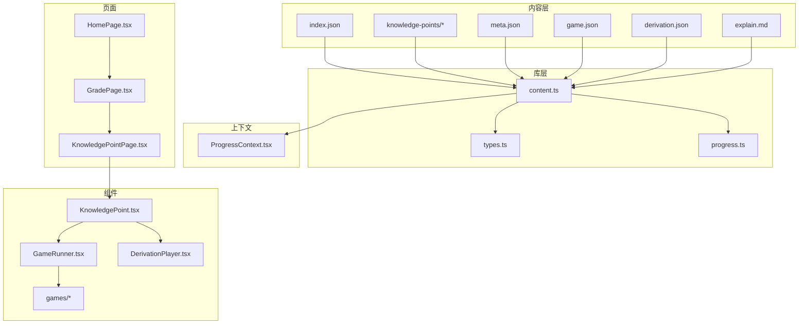
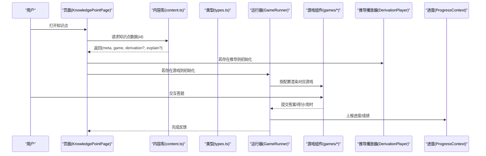
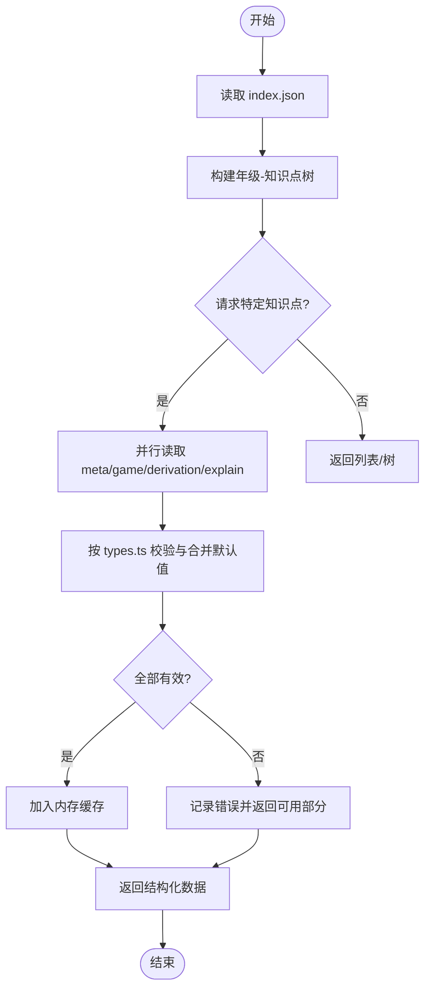
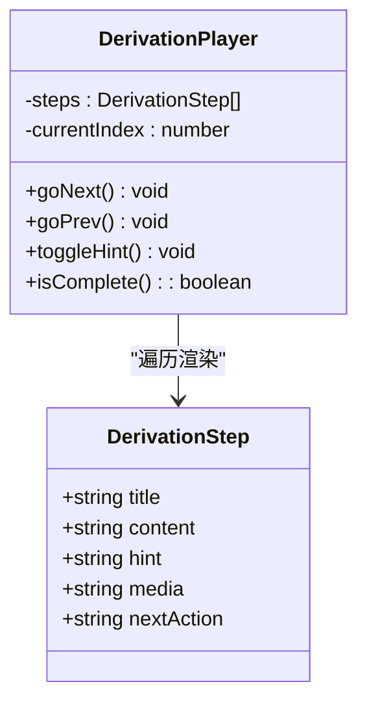
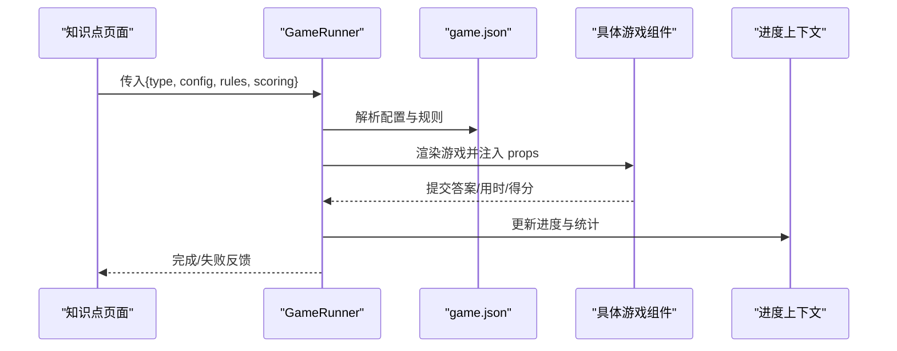
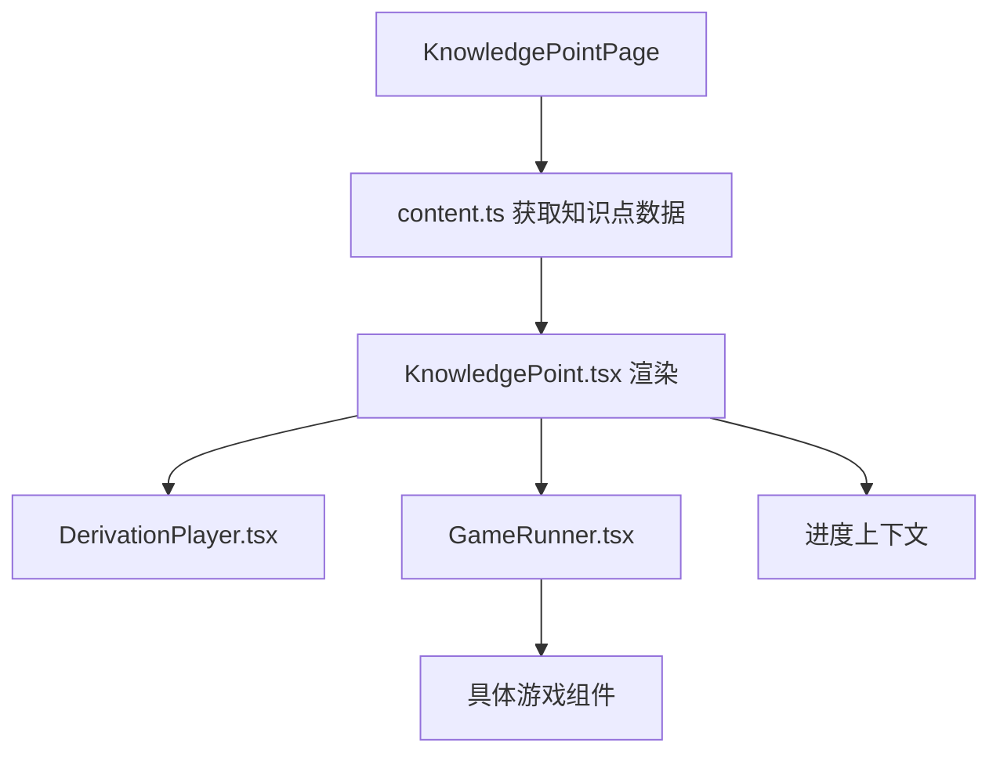
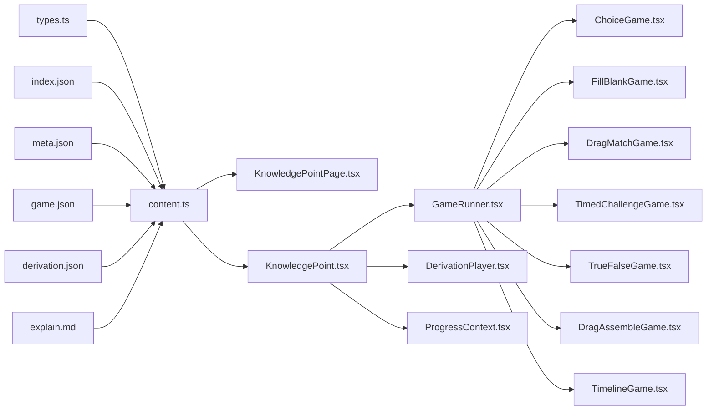

# 内容管理系统

<cite>
**本文档引用的文件**   
- [src/lib/content.ts](file://src/lib/content.ts)
- [src/lib/types.ts](file://src/lib/types.ts)
- [src/lib/progress.ts](file://src/lib/progress.ts)
- [src/context/ProgressContext.tsx](file://src/context/ProgressContext.tsx)
- [src/components/KnowledgePoint.tsx](file://src/components/KnowledgePoint.tsx)
- [src/components/GameRunner.tsx](file://src/components/GameRunner.tsx)
- [src/components/DerivationPlayer.tsx](file://src/components/DerivationPlayer.tsx)
- [src/pages/KnowledgePointPage.tsx](file://src/pages/KnowledgePointPage.tsx)
- [src/pages/HomePage.tsx](file://src/pages/HomePage.tsx)
- [src/pages/GradePage.tsx](file://src/pages/GradePage.tsx)
- [src/content/index.json](file://src/content/index.json)
- [src/content/knowledge-points/g3-fraction-intro/meta.json](file://src/content/knowledge-points/g3-fraction-intro/meta.json)
- [src/content/knowledge-points/g3-fraction-intro/game.json](file://src/content/knowledge-points/g3-fraction-intro/game.json)
- [src/content/knowledge-points/g3-fraction-intro/explain.md](file://src/content/knowledge-points/g3-fraction-intro/explain.md)
- [src/content/knowledge-points/g3-fraction-add-sub/meta.json](file://src/content/knowledge-points/g3-fraction-add-sub/meta.json)
- [src/content/knowledge-points/g3-fraction-add-sub/game.json](file://src/content/knowledge-points/g3-fraction-add-sub/game.json)
- [src/content/knowledge-points/g3-fraction-add-sub/derivation.json](file://src/content/knowledge-points/g3-fraction-add-sub/derivation.json)
- [src/components/games/ChoiceGame.tsx](file://src/components/games/ChoiceGame.tsx)
- [src/components/games/FillBlankGame.tsx](file://src/components/games/FillBlankGame.tsx)
- [src/components/games/DragMatchGame.tsx](file://src/components/games/DragMatchGame.tsx)
- [src/components/games/TimedChallengeGame.tsx](file://src/components/games/TimedChallengeGame.tsx)
- [src/components/games/TrueFalseGame.tsx](file://src/components/games/TrueFalseGame.tsx)
- [src/components/games/DragAssembleGame.tsx](file://src/components/games/DragAssembleGame.tsx)
- [src/components/games/TimelineGame.tsx](file://src/components/games/TimelineGame.tsx)
- [src/test/content.test.ts](file://src/test/content.test.ts)
- [src/test/gameRunner.test.ts](file://src/test/gameRunner.test.ts)
- [src/test/progress.test.ts](file://src/test/progress.test.ts)
- [package.json](file://package.json)
</cite>

## 目录
1. [简介](#简介)
2. [项目结构](#项目结构)
3. [核心组件](#核心组件)
4. [架构总览](#架构总览)
5. [详细组件分析](#详细组件分析)
6. [依赖关系分析](#依赖关系分析)
7. [性能考虑](#性能考虑)
8. [故障排查指南](#故障排查指南)
9. [结论](#结论)
10. [附录](#附录)

## 简介
本文件系统性地梳理 math-k6 内容管理系统的知识内容与游戏化学习流程。重点涵盖：
- 知识点数据结构与元数据定义
- 内容加载机制（索引、解析、缓存）
- 推导过程配置与渲染
- 游戏配置格式与运行器
- 内容验证规则、错误处理策略与性能优化建议
- 内容与组件的绑定机制和数据同步流程
- 如何创建新知识点、编写游戏配置并进行测试

## 项目结构
系统采用“内容即数据”的设计，知识点以 JSON/Markdown 形式组织在 src/content 下，运行时由 lib 层统一读取、校验并转换为 UI 可用的状态；UI 层通过 components 和 pages 将内容渲染为交互界面。

图表来源
- [src/content/index.json](file://src/content/index.json)
- [src/lib/content.ts](file://src/lib/content.ts)
- [src/lib/types.ts](file://src/lib/types.ts)
- [src/lib/progress.ts](file://src/lib/progress.ts)
- [src/context/ProgressContext.tsx](file://src/context/ProgressContext.tsx)
- [src/pages/HomePage.tsx](file://src/pages/HomePage.tsx)
- [src/pages/GradePage.tsx](file://src/pages/GradePage.tsx)
- [src/pages/KnowledgePointPage.tsx](file://src/pages/KnowledgePointPage.tsx)
- [src/components/KnowledgePoint.tsx](file://src/components/KnowledgePoint.tsx)
- [src/components/GameRunner.tsx](file://src/components/GameRunner.tsx)
- [src/components/DerivationPlayer.tsx](file://src/components/DerivationPlayer.tsx)
- [src/components/games/ChoiceGame.tsx](file://src/components/games/ChoiceGame.tsx)
- [src/components/games/FillBlankGame.tsx](file://src/components/games/FillBlankGame.tsx)
- [src/components/games/DragMatchGame.tsx](file://src/components/games/DragMatchGame.tsx)
- [src/components/games/TimedChallengeGame.tsx](file://src/components/games/TimedChallengeGame.tsx)
- [src/components/games/TrueFalseGame.tsx](file://src/components/games/TrueFalseGame.tsx)
- [src/components/games/DragAssembleGame.tsx](file://src/components/games/DragAssembleGame.tsx)
- [src/components/games/TimelineGame.tsx](file://src/components/games/TimelineGame.tsx)

章节来源
- [src/content/index.json](file://src/content/index.json)
- [src/lib/content.ts](file://src/lib/content.ts)
- [src/lib/types.ts](file://src/lib/types.ts)
- [src/lib/progress.ts](file://src/lib/progress.ts)
- [src/context/ProgressContext.tsx](file://src/context/ProgressContext.tsx)
- [src/pages/HomePage.tsx](file://src/pages/HomePage.tsx)
- [src/pages/GradePage.tsx](file://src/pages/GradePage.tsx)
- [src/pages/KnowledgePointPage.tsx](file://src/pages/KnowledgePointPage.tsx)
- [src/components/KnowledgePoint.tsx](file://src/components/KnowledgePoint.tsx)
- [src/components/GameRunner.tsx](file://src/components/GameRunner.tsx)
- [src/components/DerivationPlayer.tsx](file://src/components/DerivationPlayer.tsx)

## 核心组件
- 内容加载与类型定义
  - types.ts：定义知识点、元数据、游戏配置、推导步骤等核心类型，确保 JSON 结构与运行时对象一致。
  - content.ts：负责读取 index.json、聚合各知识点目录下的 meta.json、game.json、derivation.json、explain.md，进行基础校验与转换，提供统一的查询接口。
- 进度与上下文
  - progress.ts：封装学习进度读写（本地存储或内存），提供获取/更新进度、统计等方法。
  - ProgressContext.tsx：将进度能力注入 React 上下文，供页面与组件消费。
- 渲染与交互
  - KnowledgePoint.tsx：根据知识点元数据与内容，组合解释文本、推导播放器与游戏运行器。
  - GameRunner.tsx：按 game.json 动态选择并渲染具体游戏组件，驱动答题、计时、反馈与结果上报。
  - DerivationPlayer.tsx：按 derivation.json 逐步展示推导过程，支持前进/后退与高亮当前步骤。
- 页面路由
  - HomePage.tsx：年级入口与概览。
  - GradePage.tsx：列出某年级的知识点卡片。
  - KnowledgePointPage.tsx：进入具体知识点，加载并渲染内容。

章节来源
- [src/lib/types.ts](file://src/lib/types.ts)
- [src/lib/content.ts](file://src/lib/content.ts)
- [src/lib/progress.ts](file://src/lib/progress.ts)
- [src/context/ProgressContext.tsx](file://src/context/ProgressContext.tsx)
- [src/components/KnowledgePoint.tsx](file://src/components/KnowledgePoint.tsx)
- [src/components/GameRunner.tsx](file://src/components/GameRunner.tsx)
- [src/components/DerivationPlayer.tsx](file://src/components/DerivationPlayer.tsx)
- [src/pages/HomePage.tsx](file://src/pages/HomePage.tsx)
- [src/pages/GradePage.tsx](file://src/pages/GradePage.tsx)
- [src/pages/KnowledgePointPage.tsx](file://src/pages/KnowledgePointPage.tsx)

## 架构总览
整体采用“数据驱动 + 组件渲染”的分层架构：
- 数据层：JSON/Markdown 描述知识点、游戏与推导过程。
- 库层：统一解析、校验、转换并提供查询 API。
- 上下文层：全局学习进度状态。
- 表现层：页面与组件按需渲染，驱动用户交互。

图表来源
- [src/pages/KnowledgePointPage.tsx](file://src/pages/KnowledgePointPage.tsx)
- [src/lib/content.ts](file://src/lib/content.ts)
- [src/lib/types.ts](file://src/lib/types.ts)
- [src/components/GameRunner.tsx](file://src/components/GameRunner.tsx)
- [src/components/games/ChoiceGame.tsx](file://src/components/games/ChoiceGame.tsx)
- [src/components/DerivationPlayer.tsx](file://src/components/DerivationPlayer.tsx)
- [src/context/ProgressContext.tsx](file://src/context/ProgressContext.tsx)

## 详细组件分析

### 知识点数据结构与元数据
- 目录约定
  - 每个知识点一个目录，命名如 gX-topic-slug。
  - 必备文件：meta.json、game.json；可选文件：derivation.json、explain.md。
- meta.json
  - 字段通常包含：id、title、grade、subject、tags、difficulty、description、prerequisites、order 等。
  - 用于列表展示、筛选与排序。
- game.json
  - 字段通常包含：type、config、params、rules、scoring、feedback、timeLimit、attempts 等。
  - type 决定由哪个游戏组件渲染；config 为游戏实例参数；rules/scoring 定义评分与反馈策略。
- derivation.json
  - 字段通常包含：steps[]，每步含 title、content、hint、media、nextAction 等。
  - 用于逐步推导讲解。
- explain.md
  - Markdown 正文，用于概念讲解与示例。

章节来源
- [src/content/knowledge-points/g3-fraction-intro/meta.json](file://src/content/knowledge-points/g3-fraction-intro/meta.json)
- [src/content/knowledge-points/g3-fraction-intro/game.json](file://src/content/knowledge-points/g3-fraction-intro/game.json)
- [src/content/knowledge-points/g3-fraction-intro/explain.md](file://src/content/knowledge-points/g3-fraction-intro/explain.md)
- [src/content/knowledge-points/g3-fraction-add-sub/meta.json](file://src/content/knowledge-points/g3-fraction-add-sub/meta.json)
- [src/content/knowledge-points/g3-fraction-add-sub/game.json](file://src/content/knowledge-points/g3-fraction-add-sub/game.json)
- [src/content/knowledge-points/g3-fraction-add-sub/derivation.json](file://src/content/knowledge-points/g3-fraction-add-sub/derivation.json)

### 内容加载机制
- 索引文件 index.json 维护知识点清单与层级关系（年级→知识点）。
- content.ts 负责：
  - 读取 index.json 构建导航树。
  - 按 id 定位目录，并行读取 meta.json、game.json、derivation.json、explain.md。
  - 基于 types.ts 进行字段校验与默认值填充。
  - 提供 getKnowledgePoint(id)、listByGrade(grade)、search(tags) 等查询方法。
  - 对缺失/非法字段进行错误收集与降级处理。

图表来源
- [src/lib/content.ts](file://src/lib/content.ts)
- [src/lib/types.ts](file://src/lib/types.ts)
- [src/content/index.json](file://src/content/index.json)

章节来源
- [src/lib/content.ts](file://src/lib/content.ts)
- [src/lib/types.ts](file://src/lib/types.ts)
- [src/content/index.json](file://src/content/index.json)

### 推导过程配置与渲染
- derivation.json 定义步骤序列，每步可包含标题、说明、提示、媒体资源与下一步动作。
- DerivationPlayer.tsx：
  - 接收 steps 数组，维护当前步骤索引。
  - 支持前进/后退、自动播放、步骤高亮与提示展开。
  - 与进度上下文联动，标记“已学完”。

图表来源
- [src/components/DerivationPlayer.tsx](file://src/components/DerivationPlayer.tsx)
- [src/content/knowledge-points/g3-fraction-add-sub/derivation.json](file://src/content/knowledge-points/g3-fraction-add-sub/derivation.json)

章节来源
- [src/components/DerivationPlayer.tsx](file://src/components/DerivationPlayer.tsx)
- [src/content/knowledge-points/g3-fraction-add-sub/derivation.json](file://src/content/knowledge-points/g3-fraction-add-sub/derivation.json)

### 游戏配置与运行器
- game.json 的 type 字段映射到具体游戏组件（如 ChoiceGame、FillBlankGame、DragMatchGame、TimedChallengeGame、TrueFalseGame、DragAssembleGame、TimelineGame）。
- GameRunner.tsx：
  - 根据 type 动态 import/渲染对应组件。
  - 将 config 透传给游戏组件，统一管理答题、计时、重试、评分与反馈。
  - 将结果写入进度上下文，触发成就/徽章逻辑（如有）。

图表来源
- [src/components/GameRunner.tsx](file://src/components/GameRunner.tsx)
- [src/components/games/ChoiceGame.tsx](file://src/components/games/ChoiceGame.tsx)
- [src/components/games/FillBlankGame.tsx](file://src/components/games/FillBlankGame.tsx)
- [src/components/games/DragMatchGame.tsx](file://src/components/games/DragMatchGame.tsx)
- [src/components/games/TimedChallengeGame.tsx](file://src/components/games/TimedChallengeGame.tsx)
- [src/components/games/TrueFalseGame.tsx](file://src/components/games/TrueFalseGame.tsx)
- [src/components/games/DragAssembleGame.tsx](file://src/components/games/DragAssembleGame.tsx)
- [src/components/games/TimelineGame.tsx](file://src/components/games/TimelineGame.tsx)
- [src/content/knowledge-points/g3-fraction-intro/game.json](file://src/content/knowledge-points/g3-fraction-intro/game.json)

章节来源
- [src/components/GameRunner.tsx](file://src/components/GameRunner.tsx)
- [src/components/games/ChoiceGame.tsx](file://src/components/games/ChoiceGame.tsx)
- [src/components/games/FillBlankGame.tsx](file://src/components/games/FillBlankGame.tsx)
- [src/components/games/DragMatchGame.tsx](file://src/components/games/DragMatchGame.tsx)
- [src/components/games/TimedChallengeGame.tsx](file://src/components/games/TimedChallengeGame.tsx)
- [src/components/games/TrueFalseGame.tsx](file://src/components/games/TrueFalseGame.tsx)
- [src/components/games/DragAssembleGame.tsx](file://src/components/games/DragAssembleGame.tsx)
- [src/components/games/TimelineGame.tsx](file://src/components/games/TimelineGame.tsx)
- [src/content/knowledge-points/g3-fraction-intro/game.json](file://src/content/knowledge-points/g3-fraction-intro/game.json)

### 知识点渲染与数据流
- KnowledgePoint.tsx：
  - 接收知识点数据，拆分渲染 explain.md、derivation.json、game.json。
  - 将进度上下文注入，实现“已完成”状态显示与解锁后续内容。
- KnowledgePointPage.tsx：
  - 从路由参数获取 id，调用 content.ts 加载数据，再交给 KnowledgePoint.tsx 渲染。

图表来源
- [src/pages/KnowledgePointPage.tsx](file://src/pages/KnowledgePointPage.tsx)
- [src/components/KnowledgePoint.tsx](file://src/components/KnowledgePoint.tsx)
- [src/lib/content.ts](file://src/lib/content.ts)
- [src/context/ProgressContext.tsx](file://src/context/ProgressContext.tsx)

章节来源
- [src/pages/KnowledgePointPage.tsx](file://src/pages/KnowledgePointPage.tsx)
- [src/components/KnowledgePoint.tsx](file://src/components/KnowledgePoint.tsx)
- [src/lib/content.ts](file://src/lib/content.ts)
- [src/context/ProgressContext.tsx](file://src/context/ProgressContext.tsx)

### 内容扩展指南（新增知识点与游戏）
- 新增知识点
  - 在 src/content/knowledge-points 下新建目录，命名遵循 gX-topic-slug。
  - 创建 meta.json（必填）、game.json（必填）、可选 derivation.json 与 explain.md。
  - 在 index.json 中注册该知识点（若未自动发现）。
- 新增游戏类型
  - 在 src/components/games 下新建组件，实现统一 props 接口（config、onSubmit、onScore、onTimeUp 等）。
  - 在 GameRunner.tsx 中增加 type 到组件的映射。
  - 在 types.ts 中补充游戏配置类型定义。
- 测试
  - 使用 src/test 下的用例模板，覆盖内容解析、游戏运行与进度更新路径。

章节来源
- [src/content/knowledge-points/g3-fraction-intro/meta.json](file://src/content/knowledge-points/g3-fraction-intro/meta.json)
- [src/content/knowledge-points/g3-fraction-intro/game.json](file://src/content/knowledge-points/g3-fraction-intro/game.json)
- [src/components/GameRunner.tsx](file://src/components/GameRunner.tsx)
- [src/lib/types.ts](file://src/lib/types.ts)
- [src/test/content.test.ts](file://src/test/content.test.ts)
- [src/test/gameRunner.test.ts](file://src/test/gameRunner.test.ts)

## 依赖关系分析
- 模块耦合
  - content.ts 强依赖 types.ts 的结构定义，保证 JSON 与运行时一致。
  - GameRunner.tsx 依赖 games/* 的具体实现，通过 type 解耦。
  - ProgressContext.tsx 被多个页面与组件共享，避免重复状态管理。
- 外部依赖
  - 包管理与构建由 package.json 与 vite.config.ts 管理。
  - 测试框架与工具链由 package.json scripts 与依赖声明。

图表来源
- [src/lib/types.ts](file://src/lib/types.ts)
- [src/lib/content.ts](file://src/lib/content.ts)
- [src/content/index.json](file://src/content/index.json)
- [src/pages/KnowledgePointPage.tsx](file://src/pages/KnowledgePointPage.tsx)
- [src/components/KnowledgePoint.tsx](file://src/components/KnowledgePoint.tsx)
- [src/components/GameRunner.tsx](file://src/components/GameRunner.tsx)
- [src/components/DerivationPlayer.tsx](file://src/components/DerivationPlayer.tsx)
- [src/components/games/ChoiceGame.tsx](file://src/components/games/ChoiceGame.tsx)
- [src/components/games/FillBlankGame.tsx](file://src/components/games/FillBlankGame.tsx)
- [src/components/games/DragMatchGame.tsx](file://src/components/games/DragMatchGame.tsx)
- [src/components/games/TimedChallengeGame.tsx](file://src/components/games/TimedChallengeGame.tsx)
- [src/components/games/TrueFalseGame.tsx](file://src/components/games/TrueFalseGame.tsx)
- [src/components/games/DragAssembleGame.tsx](file://src/components/games/DragAssembleGame.tsx)
- [src/components/games/TimelineGame.tsx](file://src/components/games/TimelineGame.tsx)
- [src/context/ProgressContext.tsx](file://src/context/ProgressContext.tsx)

章节来源
- [src/lib/types.ts](file://src/lib/types.ts)
- [src/lib/content.ts](file://src/lib/content.ts)
- [src/content/index.json](file://src/content/index.json)
- [src/pages/KnowledgePointPage.tsx](file://src/pages/KnowledgePointPage.tsx)
- [src/components/KnowledgePoint.tsx](file://src/components/KnowledgePoint.tsx)
- [src/components/GameRunner.tsx](file://src/components/GameRunner.tsx)
- [src/components/DerivationPlayer.tsx](file://src/components/DerivationPlayer.tsx)
- [src/context/ProgressContext.tsx](file://src/context/ProgressContext.tsx)

## 性能考虑
- 内容加载
  - 并行读取 meta/game/derivation/explain，减少首屏延迟。
  - 对热点知识点做内存缓存，避免重复 IO。
- 渲染优化
  - 游戏组件按需懒加载，仅在需要时挂载。
  - 长列表（年级/知识点）使用虚拟滚动或分页。
- 状态管理
  - 进度上下文仅暴露必要方法与最小状态，避免不必要重渲染。
- 构建与打包
  - 合理拆分 chunk，静态资源 CDN 加速。
  - 图片/媒体资源压缩与懒加载。

[本节为通用指导，不直接分析具体文件]

## 故障排查指南
- 常见错误
  - 缺少必需字段（如 meta.id、game.type）：检查 types.ts 定义与 JSON 完整性。
  - 游戏类型不存在：确认 GameRunner.tsx 中的映射是否包含该 type。
  - 推导步骤为空或顺序异常：检查 derivation.json 的 steps 数组与 nextAction。
  - 进度未更新：检查 GameRunner 是否正确调用进度上下文的方法。
- 调试建议
  - 使用单元测试覆盖 content 解析与游戏运行路径。
  - 在浏览器控制台打印关键中间态（如 parsedConfig、currentStep）。
  - 利用 vite 热重载快速迭代配置。

章节来源
- [src/lib/types.ts](file://src/lib/types.ts)
- [src/components/GameRunner.tsx](file://src/components/GameRunner.tsx)
- [src/components/DerivationPlayer.tsx](file://src/components/DerivationPlayer.tsx)
- [src/context/ProgressContext.tsx](file://src/context/ProgressContext.tsx)
- [src/test/content.test.ts](file://src/test/content.test.ts)
- [src/test/gameRunner.test.ts](file://src/test/gameRunner.test.ts)
- [src/test/progress.test.ts](file://src/test/progress.test.ts)

## 结论
math-k6 的内容管理系统以“数据驱动 + 组件渲染”为核心，通过标准化的 JSON/Markdown 结构描述知识点、游戏与推导过程，配合统一的解析与校验层，实现了可扩展、可测试、易维护的学习内容生产与交付。遵循本文档的规范与最佳实践，可以快速扩展新的知识点与游戏类型，保障质量与性能。

[本节为总结性内容，不直接分析具体文件]

## 附录
- 环境准备与脚本
  - 安装依赖与启动开发服务器请参考 package.json 的 scripts。
- 参考样例
  - 知识点样例：g3-fraction-intro（含 explain.md、game.json、meta.json）
  - 推导样例：g3-fraction-add-sub（含 derivation.json）

章节来源
- [package.json](file://package.json)
- [src/content/knowledge-points/g3-fraction-intro/meta.json](file://src/content/knowledge-points/g3-fraction-intro/meta.json)
- [src/content/knowledge-points/g3-fraction-intro/game.json](file://src/content/knowledge-points/g3-fraction-intro/game.json)
- [src/content/knowledge-points/g3-fraction-intro/explain.md](file://src/content/knowledge-points/g3-fraction-intro/explain.md)
- [src/content/knowledge-points/g3-fraction-add-sub/derivation.json](file://src/content/knowledge-points/g3-fraction-add-sub/derivation.json)