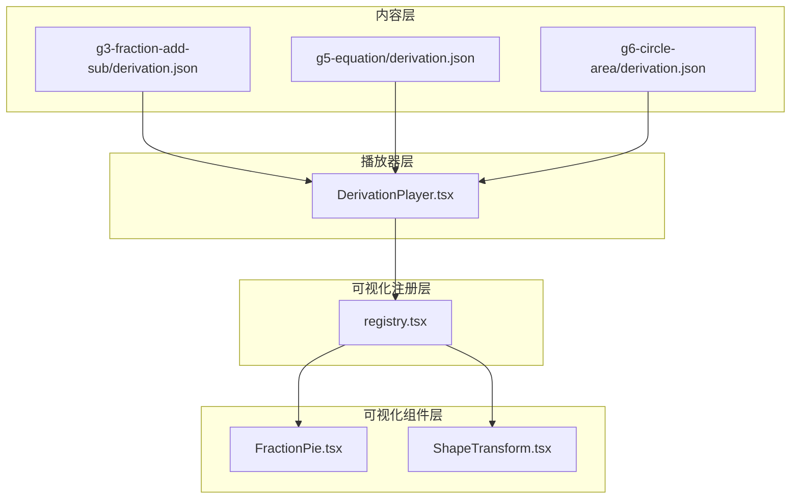
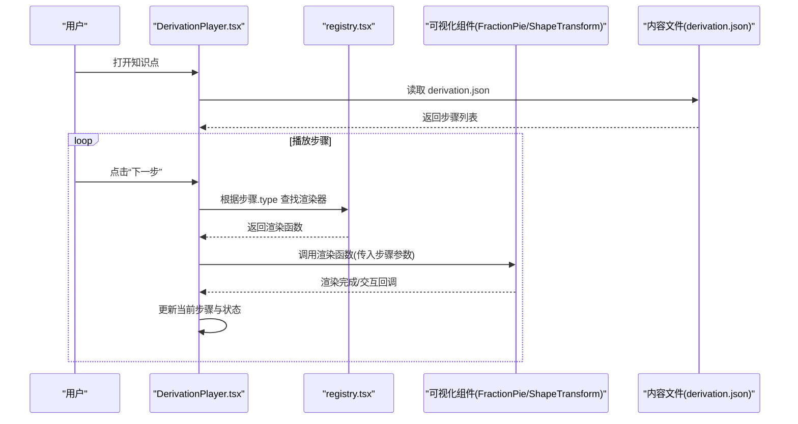
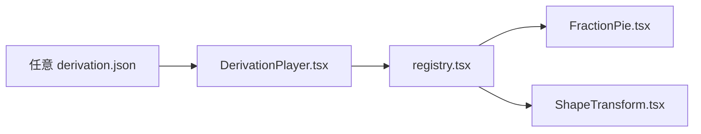

# 推导过程配置

<cite>
**本文档引用的文件**   
- [DerivationPlayer.tsx](file://src/components/DerivationPlayer.tsx)
- [registry.tsx](file://src/visualizations/registry.tsx)
- [FractionPie.tsx](file://src/visualizations/FractionPie.tsx)
- [ShapeTransform.tsx](file://src/visualizations/ShapeTransform.tsx)
- [g3-fraction-add-sub/derivation.json](file://src/content/knowledge-points/g3-fraction-add-sub/derivation.json)
- [g3-mult-1digit/derivation.json](file://src/content/knowledge-points/g3-mult-1digit/derivation.json)
- [g3-rect-area/derivation.json](file://src/content/knowledge-points/g3-rect-area/derivation.json)
- [g4-arith-laws/derivation.json](file://src/content/knowledge-points/g4-arith-laws/derivation.json)
- [g4-triangle/derivation.json](file://src/content/knowledge-points/g4-triangle/derivation.json)
- [g5-equation/derivation.json](file://src/content/knowledge-points/g5-equation/derivation.json)
- [g5-fraction-add-sub/derivation.json](file://src/content/knowledge-points/g5-fraction-add-sub/derivation.json)
- [g5-parallelogram-area/derivation.json](file://src/content/knowledge-points/g5-parallelogram-area/derivation.json)
- [g5-triangle-area/derivation.json](file://src/content/knowledge-points/g5-triangle-area/derivation.json)
- [g6-circle-area/derivation.json](file://src/content/knowledge-points/g6-circle-area/derivation.json)
- [g6-cone-volume/derivation.json](file://src/content/knowledge-points/g6-cone-volume/derivation.json)
- [g6-cylinder-surface/derivation.json](file://src/content/knowledge-points/g6-cylinder-surface/derivation.json)
- [g6-cylinder-volume/derivation.json](file://src/content/knowledge-points/g6-cylinder-volume/derivation.json)
- [g6-fraction-div/derivation.json](file://src/content/knowledge-points/g6-fraction-div/derivation.json)
- [g6-fraction-mult/derivation.json](file://src/content/knowledge-points/g6-fraction-mult/derivation.json)
</cite>

## 目录
1. [简介](#简介)
2. [项目结构](#项目结构)
3. [核心组件](#核心组件)
4. [架构总览](#架构总览)
5. [详细组件分析](#详细组件分析)
6. [依赖关系分析](#依赖关系分析)
7. [性能考虑](#性能考虑)
8. [故障排查指南](#故障排查指南)
9. [结论](#结论)
10. [附录](#附录)

## 简介
本文件面向 math-k6 的“推导过程配置”体系，系统性说明 derivation.json 的结构、数学推导步骤的定义方式、动画与交互配置、公式渲染与图形变换设置，以及状态保存与恢复机制。文档同时提供分数运算、方程求解等复杂推导过程的配置示例路径，并给出自定义推导步骤的开发指南与数学表达式语法说明，帮助内容创作者快速构建高质量的可交互推导内容。

## 项目结构
math-k6 将每个知识点的推导过程以独立的 derivation.json 文件组织在对应知识点目录下，由 DerivationPlayer 统一加载与播放；可视化能力通过 registry.tsx 集中注册，具体图形组件（如 FractionPie、ShapeTransform）按需渲染。

图表来源 
- [DerivationPlayer.tsx](file://src/components/DerivationPlayer.tsx)
- [registry.tsx](file://src/visualizations/registry.tsx)
- [FractionPie.tsx](file://src/visualizations/FractionPie.tsx)
- [ShapeTransform.tsx](file://src/visualizations/ShapeTransform.tsx)
- [g3-fraction-add-sub/derivation.json](file://src/content/knowledge-points/g3-fraction-add-sub/derivation.json)
- [g5-equation/derivation.json](file://src/content/knowledge-points/g5-equation/derivation.json)
- [g6-circle-area/derivation.json](file://src/content/knowledge-points/g6-circle-area/derivation.json)

章节来源
- [DerivationPlayer.tsx](file://src/components/DerivationPlayer.tsx)
- [registry.tsx](file://src/visualizations/registry.tsx)
- [FractionPie.tsx](file://src/visualizations/FractionPie.tsx)
- [ShapeTransform.tsx](file://src/visualizations/ShapeTransform.tsx)

## 核心组件
- DerivationPlayer：负责加载指定知识点的 derivation.json，解析步骤序列，驱动渲染与播放控制（前进、后退、暂停、跳转），并维护当前步骤索引与播放状态。
- registry.tsx：集中注册所有可视化组件类型与其渲染器，根据步骤中的 type 字段动态选择渲染器。
- 可视化组件：如 FractionPie（分数饼图）、ShapeTransform（图形变换）等，接收步骤参数并输出对应的数学可视化。

章节来源
- [DerivationPlayer.tsx](file://src/components/DerivationPlayer.tsx)
- [registry.tsx](file://src/visualizations/registry.tsx)
- [FractionPie.tsx](file://src/visualizations/FractionPie.tsx)
- [ShapeTransform.tsx](file://src/visualizations/ShapeTransform.tsx)

## 架构总览
推导过程的整体数据流如下：内容层提供 derivation.json，播放器层解析并驱动渲染，注册层按步骤类型分发到具体可视化组件，组件完成渲染后回传交互事件，播放器更新状态并推进流程。

图表来源 
- [DerivationPlayer.tsx](file://src/components/DerivationPlayer.tsx)
- [registry.tsx](file://src/visualizations/registry.tsx)
- [FractionPie.tsx](file://src/visualizations/FractionPie.tsx)
- [ShapeTransform.tsx](file://src/visualizations/ShapeTransform.tsx)
- [g3-fraction-add-sub/derivation.json](file://src/content/knowledge-points/g3-fraction-add-sub/derivation.json)

## 详细组件分析

### 推导步骤定义规范（基于现有 derivation.json）
- 顶层结构
  - title：标题
  - steps：步骤数组，每项为一个推导步骤
- 步骤通用字段
  - id：唯一标识
  - type：步骤类型（决定使用哪个可视化渲染器）
  - content：文本或提示语（可选）
  - params：传递给可视化组件的参数对象
  - animation：动画配置（过渡时长、缓动等）
  - interaction：交互配置（点击、拖拽、输入等）
  - state：状态快照（用于保存/恢复）
- 常见步骤类型与参数要点
  - fraction_pie：分数饼图
    - params 包含分子、分母、高亮区域、颜色等
  - shape_transform：图形变换
    - params 包含形状类型、尺寸、平移/旋转/缩放矩阵、目标位置等
  - equation_step：方程求解步骤
    - params 包含原方程、变形规则、中间结果、最终解
  - text_hint：文本提示
    - params 包含显示文本、强调样式等
- 动画与交互
  - animation.duration：毫秒
  - animation.easing：缓动函数名
  - interaction.type：交互类型
  - interaction.handler：处理逻辑（内置或自定义）
- 状态保存与恢复
  - state.snapshot：序列化后的步骤状态
  - state.version：状态版本
  - 播放器支持从 snapshot 恢复到指定步骤

章节来源
- [g3-fraction-add-sub/derivation.json](file://src/content/knowledge-points/g3-fraction-add-sub/derivation.json)
- [g3-mult-1digit/derivation.json](file://src/content/knowledge-points/g3-mult-1digit/derivation.json)
- [g3-rect-area/derivation.json](file://src/content/knowledge-points/g3-rect-area/derivation.json)
- [g4-arith-laws/derivation.json](file://src/content/knowledge-points/g4-arith-laws/derivation.json)
- [g4-triangle/derivation.json](file://src/content/knowledge-points/g4-triangle/derivation.json)
- [g5-equation/derivation.json](file://src/content/knowledge-points/g5-equation/derivation.json)
- [g5-fraction-add-sub/derivation.json](file://src/content/knowledge-points/g5-fraction-add-sub/derivation.json)
- [g5-parallelogram-area/derivation.json](file://src/content/knowledge-points/g5-parallelogram-area/derivation.json)
- [g5-triangle-area/derivation.json](file://src/content/knowledge-points/g5-triangle-area/derivation.json)
- [g6-circle-area/derivation.json](file://src/content/knowledge-points/g6-circle-area/derivation.json)
- [g6-cone-volume/derivation.json](file://src/content/knowledge-points/g6-cone-volume/derivation.json)
- [g6-cylinder-surface/derivation.json](file://src/content/knowledge-points/g6-cylinder-surface/derivation.json)
- [g6-cylinder-volume/derivation.json](file://src/content/knowledge-points/g6-cylinder-volume/derivation.json)
- [g6-fraction-div/derivation.json](file://src/content/knowledge-points/g6-fraction-div/derivation.json)
- [g6-fraction-mult/derivation.json](file://src/content/knowledge-points/g6-fraction-mult/derivation.json)

### 分数运算推导（以 g3-fraction-add-sub 为例）
- 目标：展示同分母/异分母分数加减法的逐步推导
- 关键步骤
  - 初始分数表示（fraction_pie）
  - 通分过程（shape_transform 或 fraction_pie 重绘）
  - 分子相加/相减（高亮变化）
  - 约分与结果呈现
- 动画与交互
  - 使用淡入/滑动过渡突出变化区域
  - 允许点击切换不同分数表示
- 状态管理
  - 记录当前分子、分母、是否已通分、是否已约分

章节来源
- [g3-fraction-add-sub/derivation.json](file://src/content/knowledge-points/g3-fraction-add-sub/derivation.json)
- [FractionPie.tsx](file://src/visualizations/FractionPie.tsx)

### 图形面积推导（以 g3-rect-area 为例）
- 目标：矩形面积=长×宽的直观推导
- 关键步骤
  - 绘制网格（shape_transform）
  - 标注长与宽
  - 逐行累加面积单元
  - 导出公式
- 动画与交互
  - 单元格逐个点亮
  - 鼠标悬停显示面积值

章节来源
- [g3-rect-area/derivation.json](file://src/content/knowledge-points/g3-rect-area/derivation.json)
- [ShapeTransform.tsx](file://src/visualizations/ShapeTransform.tsx)

### 方程求解推导（以 g5-equation 为例）
- 目标：一元一次方程的逐步求解
- 关键步骤
  - 写出原方程
  - 移项与合并同类项
  - 系数化为1
  - 验证解
- 动画与交互
  - 每步高亮操作依据
  - 可点击查看规则说明

章节来源
- [g5-equation/derivation.json](file://src/content/knowledge-points/g5-equation/derivation.json)

### 圆面积推导（以 g6-circle-area 为例）
- 目标：圆面积公式的几何推导
- 关键步骤
  - 分割扇形
  - 拼接成近似矩形
  - 极限思想导出公式
- 动画与交互
  - 扇形展开动画
  - 拖动调整分割数量

章节来源
- [g6-circle-area/derivation.json](file://src/content/knowledge-points/g6-circle-area/derivation.json)

### 圆柱体积推导（以 g6-cylinder-volume 为例）
- 目标：圆柱体积=底面积×高
- 关键步骤
  - 底面圆面积推导
  - 高度拉伸为柱体
  - 体积积分思想简化
- 动画与交互
  - 切面展开
  - 高度滑块调节

章节来源
- [g6-cylinder-volume/derivation.json](file://src/content/knowledge-points/g6-cylinder-volume/derivation.json)

### 圆锥体积推导（以 g6-cone-volume 为例）
- 目标：圆锥体积=1/3×底面积×高
- 关键步骤
  - 与圆柱对比
  - 切割与重组
  - 比例关系推导
- 动画与交互
  - 三维模型旋转观察

章节来源
- [g6-cone-volume/derivation.json](file://src/content/knowledge-points/g6-cone-volume/derivation.json)

### 圆柱表面积推导（以 g6-cylinder-surface 为例）
- 目标：圆柱表面积=侧面积+2×底面积
- 关键步骤
  - 侧面展开为矩形
  - 底面圆面积计算
  - 组合求和
- 动画与交互
  - 展开/折叠切换

章节来源
- [g6-cylinder-surface/derivation.json](file://src/content/knowledge-points/g6-cylinder-surface/derivation.json)

### 分数乘除法推导（以 g6-fraction-mult/div 为例）
- 目标：分数乘法与除法的几何意义
- 关键步骤
  - 乘法：部分的部分
  - 除法：分配与逆运算
- 动画与交互
  - 重叠区域高亮
  - 单位块拆分

章节来源
- [g6-fraction-mult/derivation.json](file://src/content/knowledge-points/g6-fraction-mult/derivation.json)
- [g6-fraction-div/derivation.json](file://src/content/knowledge-points/g6-fraction-div/derivation.json)

### 三角形面积推导（以 g5-triangle-area 为例）
- 目标：三角形面积=1/2×底×高
- 关键步骤
  - 复制并拼成平行四边形
  - 面积折半
- 动画与交互
  - 翻转与拼接动画

章节来源
- [g5-triangle-area/derivation.json](file://src/content/knowledge-points/g5-triangle-area/derivation.json)

### 平行四边形面积推导（以 g5-parallelogram-area 为例）
- 目标：平行四边形面积=底×高
- 关键步骤
  - 割补法转化为矩形
- 动画与交互
  - 剪切与平移

章节来源
- [g5-parallelogram-area/derivation.json](file://src/content/knowledge-points/g5-parallelogram-area/derivation.json)

### 算术定律推导（以 g4-arith-laws 为例）
- 目标：加法交换律、结合律等的直观理解
- 关键步骤
  - 数轴移动演示
  - 分组与重新组合
- 动画与交互
  - 数轴上点移动轨迹

章节来源
- [g4-arith-laws/derivation.json](file://src/content/knowledge-points/g4-arith-laws/derivation.json)

### 三角形内角和推导（以 g4-triangle 为例）
- 目标：三角形内角和=180°
- 关键步骤
  - 外角与平行线性质
  - 角度转移与拼接
- 动画与交互
  - 角度拖拽对齐

章节来源
- [g4-triangle/derivation.json](file://src/content/knowledge-points/g4-triangle/derivation.json)

### 多位数乘法推导（以 g3-mult-1digit 为例）
- 目标：一位数乘多位数的竖式原理
- 关键步骤
  - 位值分解
  - 逐位相乘与进位
- 动画与交互
  - 位值高亮与进位动画

章节来源
- [g3-mult-1digit/derivation.json](file://src/content/knowledge-points/g3-mult-1digit/derivation.json)

## 依赖关系分析
- DerivationPlayer 依赖 registry 进行步骤类型的渲染器查找
- 各 derivation.json 仅作为数据源，不直接耦合组件实现
- 新增步骤类型需在 registry 中注册对应渲染器，并在 DerivationPlayer 中确保参数校验

图表来源 
- [DerivationPlayer.tsx](file://src/components/DerivationPlayer.tsx)
- [registry.tsx](file://src/visualizations/registry.tsx)
- [FractionPie.tsx](file://src/visualizations/FractionPie.tsx)
- [ShapeTransform.tsx](file://src/visualizations/ShapeTransform.tsx)

章节来源
- [DerivationPlayer.tsx](file://src/components/DerivationPlayer.tsx)
- [registry.tsx](file://src/visualizations/registry.tsx)

## 性能考虑
- 步骤懒加载：仅在进入可视范围时加载步骤参数
- 渲染缓存：对静态图形（如网格、坐标轴）进行缓存
- 动画节流：避免频繁重排，批量更新 DOM
- 大数据集优化：对复杂图形（如高分辨率网格）采用分片渲染

## 故障排查指南
- 步骤无法渲染
  - 检查步骤 type 是否在 registry 中注册
  - 确认 params 字段与组件期望一致
- 动画异常
  - 检查 animation.duration 与 easing 配置
  - 确认浏览器是否支持相应 CSS/JS 动画特性
- 交互无响应
  - 检查 interaction.type 与 handler 绑定
  - 确认事件冒泡未被阻止
- 状态恢复失败
  - 校验 state.snapshot 的版本兼容性
  - 确保步骤 ID 与顺序未变更

## 结论
math-k6 的推导过程配置以 derivation.json 为核心，配合 DerivationPlayer 与 registry 实现了可扩展、可交互的数学推导系统。通过统一的步骤定义与渲染分发机制，内容创作者可以高效地构建分数运算、方程求解、几何推导等多种教学场景。建议遵循本文档的步骤规范与最佳实践，确保内容质量与用户体验。

## 附录

### 数学表达式语法说明
- 数字与运算符：支持整数、小数、分数表示；运算符包括 +、-、×、÷、=、≈
- 括号与优先级：使用 () 控制优先级
- 变量与常量：支持 a、b、c 等字母变量；π、e 等常用常数
- 函数与符号：sqrt、abs、sin、cos、tan、log、exp 等；上下标用 ^、_ 表示
- 集合与区间：[a,b]、(a,b)、{a,b} 等
- 单位与量纲：m、cm、kg、s 等，可与数值组合

### 自定义推导步骤开发指南
- 步骤类型命名
  - 使用小写英文单词，避免与内置类型冲突
- 参数设计
  - 明确必填与可选字段，提供默认值
  - 对数值范围进行校验与边界处理
- 渲染器实现
  - 在 registry.tsx 中注册新类型与渲染函数
  - 组件内部处理交互事件并回调播放器
- 动画与交互
  - 使用统一的 animation 与 interaction 配置
  - 保证跨设备一致性
- 测试与验收
  - 覆盖正常流程与异常分支
  - 验证状态保存与恢复的正确性