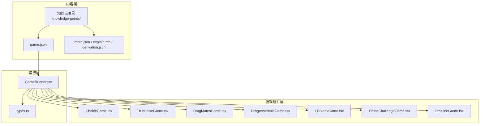
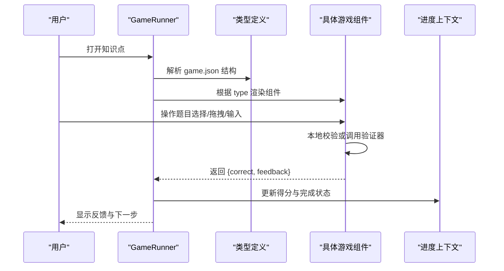
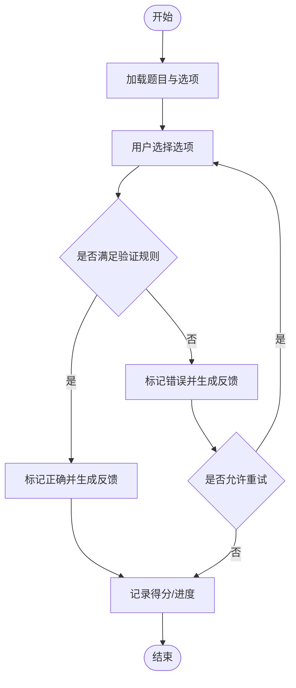
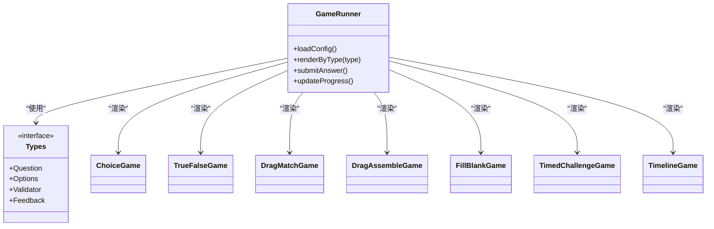

# 游戏配置格式

<cite>
**本文引用的文件**
- [src/components/games/ChoiceGame.tsx](file://src/components/games/ChoiceGame.tsx)
- [src/components/games/DragAssembleGame.tsx](file://src/components/games/DragAssembleGame.tsx)
- [src/components/games/DragMatchGame.tsx](file://src/components/games/DragMatchGame.tsx)
- [src/components/games/FillBlankGame.tsx](file://src/components/games/FillBlankGame.tsx)
- [src/components/games/TimedChallengeGame.tsx](file://src/components/games/TimedChallengeGame.tsx)
- [src/components/games/TimelineGame.tsx](file://src/components/games/TimelineGame.tsx)
- [src/components/games/TrueFalseGame.tsx](file://src/components/games/TrueFalseGame.tsx)
- [src/components/GameRunner.tsx](file://src/components/GameRunner.tsx)
- [src/lib/types.ts](file://src/lib/types.ts)
- [src/content/knowledge-points/g3-add-sub-10000/game.json](file://src/content/knowledge-points/g3-add-sub-10000/game.json)
- [src/content/knowledge-points/g3-fraction-intro/game.json](file://src/content/knowledge-points/g3-fraction-intro/game.json)
- [src/content/knowledge-points/g4-decimal-meaning/game.json](file://src/content/knowledge-points/g4-decimal-meaning/game.json)
- [src/content/knowledge-points/g5-equation/game.json](file://src/content/knowledge-points/g5-equation/game.json)
- [src/content/knowledge-points/g6-circle-area/game.json](file://src/content/knowledge-points/g6-circle-area/game.json)
</cite>

## 目录
1. [简介](#简介)
2. [项目结构](#项目结构)
3. [核心组件](#核心组件)
4. [架构总览](#架构总览)
5. [详细组件分析](#详细组件分析)
6. [依赖关系分析](#依赖关系分析)
7. [性能考量](#性能考量)
8. [故障排查指南](#故障排查指南)
9. [结论](#结论)
10. [附录](#附录)

## 简介
本文件为 math-k6 项目的“游戏配置格式”提供权威文档，聚焦于每个知识点目录下 game.json 的配置规范。内容涵盖：
- 通用字段与题目数据结构
- 各游戏类型（选择题、判断题、拖拽匹配、拖拽组装、填空、时间挑战、时间线）的差异与共同属性
- 选项设置、答案验证规则、反馈消息配置
- 完整配置示例与复杂题目实践
- 游戏状态管理、计分规则与完成条件
- 自定义游戏类型的扩展指南与最佳实践

## 项目结构
math-k6 将“知识点内容”与“游戏配置”分离存放：
- 知识点目录位于 src/content/knowledge-points/<id>/，包含 explain.md、derivation.json、meta.json 以及一个或多个 game.json
- 运行时由 GameRunner 加载并渲染对应游戏组件
- 每种游戏类型在 src/components/games/ 下以独立组件实现，读取 game.json 中的配置进行渲染与交互

图表来源
- [src/components/GameRunner.tsx](file://src/components/GameRunner.tsx)
- [src/lib/types.ts](file://src/lib/types.ts)
- [src/content/knowledge-points/g3-add-sub-10000/game.json](file://src/content/knowledge-points/g3-add-sub-10000/game.json)

章节来源
- [src/components/GameRunner.tsx](file://src/components/GameRunner.tsx)
- [src/lib/types.ts](file://src/lib/types.ts)

## 核心组件
- GameRunner：负责加载 game.json、解析类型、选择并挂载对应游戏组件，统一处理提交、校验、反馈与进度更新
- types.ts：定义 game.json 的 TypeScript 类型契约，包括题目、选项、验证器、反馈等结构
- 各游戏组件：根据 game.json 渲染交互界面，执行本地校验或调用内置验证器，返回结果给 GameRunner

章节来源
- [src/components/GameRunner.tsx](file://src/components/GameRunner.tsx)
- [src/lib/types.ts](file://src/lib/types.ts)
- [src/components/games/ChoiceGame.tsx](file://src/components/games/ChoiceGame.tsx)
- [src/components/games/TrueFalseGame.tsx](file://src/components/games/TrueFalseGame.tsx)
- [src/components/games/DragMatchGame.tsx](file://src/components/games/DragMatchGame.tsx)
- [src/components/games/DragAssembleGame.tsx](file://src/components/games/DragAssembleGame.tsx)
- [src/components/games/FillBlankGame.tsx](file://src/components/games/FillBlankGame.tsx)
- [src/components/games/TimedChallengeGame.tsx](file://src/components/games/TimedChallengeGame.tsx)
- [src/components/games/TimelineGame.tsx](file://src/components/games/TimelineGame.tsx)

## 架构总览
下图展示从配置文件到渲染与校验的整体流程：

图表来源
- [src/components/GameRunner.tsx](file://src/components/GameRunner.tsx)
- [src/lib/types.ts](file://src/lib/types.ts)

## 详细组件分析

### 通用配置字段（适用于所有游戏类型）
- 元信息
  - id：唯一标识（通常与知识点目录名一致）
  - title：标题
  - description：简要说明
  - difficulty：难度等级（如 easy/medium/hard）
  - tags：标签数组，用于检索与分类
- 题目集合
  - questions：题目数组，每项包含题干、选项、正确答案、提示与反馈
- 行为与评分
  - scoring：计分策略（如 per-question、cumulative、time-bonus）
  - completion：完成条件（如 all-correct、partial-pass、attempts-limit）
  - attempts：最大尝试次数
  - timeLimit：全局限时（秒）
- 反馈与提示
  - feedback：默认反馈模板（成功/失败/重试）
  - hints：提示开关与层级

章节来源
- [src/lib/types.ts](file://src/lib/types.ts)
- [src/components/GameRunner.tsx](file://src/components/GameRunner.tsx)

### 选择题（ChoiceGame）
- 适用场景：单选或多选
- 关键字段
  - type：choice
  - question：题干
  - options：选项数组，含 text、value、isCorrect
  - allowMultiple：是否允许多选
  - validator：可选自定义验证函数（字符串标识或内联）
  - feedback：按正确/错误/部分正确的反馈模板
- 数据流
  - 用户选择 -> 组件校验 -> 返回结果 -> GameRunner 汇总

图表来源
- [src/components/games/ChoiceGame.tsx](file://src/components/games/ChoiceGame.tsx)
- [src/lib/types.ts](file://src/lib/types.ts)

章节来源
- [src/components/games/ChoiceGame.tsx](file://src/components/games/ChoiceGame.tsx)
- [src/content/knowledge-points/g3-add-sub-10000/game.json](file://src/content/knowledge-points/g3-add-sub-10000/game.json)

### 判断题（TrueFalseGame）
- 适用场景：判断陈述是否正确
- 关键字段
  - type：true-false
  - question：陈述句
  - answer：布尔值（true/false）
  - explanation：解释文本
  - feedback：成功/失败反馈模板
- 数据流
  - 用户点击“对/错” -> 直接比对 -> 反馈与计分

章节来源
- [src/components/games/TrueFalseGame.tsx](file://src/components/games/TrueFalseGame.tsx)

### 拖拽匹配（DragMatchGame）
- 适用场景：将左侧项与右侧项配对
- 关键字段
  - type：drag-match
  - pairs：配对数组，含 left、right、matchId
  - shuffle：是否打乱顺序
  - validator：可自定义匹配规则
  - feedback：每对匹配的即时反馈
- 数据流
  - 拖拽建立连接 -> 实时校验 -> 累计正确率

章节来源
- [src/components/games/DragMatchGame.tsx](file://src/components/games/DragMatchGame.tsx)

### 拖拽组装（DragAssembleGame）
- 适用场景：将部件按正确顺序或位置组装
- 关键字段
  - type：drag-assemble
  - items：待组装项，含 id、label、targetIndex/targetSlot
  - slots：目标槽位描述
  - validator：顺序/位置校验
  - feedback：逐步提示与最终总结
- 数据流
  - 拖放定位 -> 校验顺序/位置 -> 反馈与计分

章节来源
- [src/components/games/DragAssembleGame.tsx](file://src/components/games/DragAssembleGame.tsx)

### 填空题（FillBlankGame）
- 适用场景：填写数字、表达式或文本
- 关键字段
  - type：fill-blank
  - blanks：空白数组，含 placeholder、answer、validator、tolerance（数值容差）
  - hint：提示逻辑
  - feedback：错误时给出针对性提示
- 数据流
  - 输入 -> 逐空校验 -> 汇总结果

章节来源
- [src/components/games/FillBlankGame.tsx](file://src/components/games/FillBlankGame.tsx)

### 时间挑战（TimedChallengeGame）
- 适用场景：限时答题，强调速度与准确率
- 关键字段
  - type：timed-challenge
  - timeLimit：倒计时秒数
  - scoring：时间奖励系数
  - questions：题目集
  - feedback：超时/完成/错误的反馈
- 数据流
  - 启动计时 -> 答题 -> 截止判定 -> 结算

章节来源
- [src/components/games/TimedChallengeGame.tsx](file://src/components/games/TimedChallengeGame.tsx)

### 时间线（TimelineGame）
- 适用场景：事件排序或时间轴构建
- 关键字段
  - type：timeline
  - events：事件数组，含 label、timestamp/orderKey
  - validator：顺序校验
  - feedback：错位提示与纠正建议
- 数据流
  - 拖动排序 -> 校验顺序 -> 反馈

章节来源
- [src/components/games/TimelineGame.tsx](file://src/components/games/TimelineGame.tsx)

### 配置示例与复杂题目实践
- 基础示例
  - 选择题：参考 g3-add-sub-10000 的 game.json，包含多道单选题与反馈模板
  - 分数概念：参考 g3-fraction-intro 的 game.json，结合可视化与选项
  - 小数意义：参考 g4-decimal-meaning 的 game.json，混合题型与提示
  - 方程求解：参考 g5-equation 的 game.json，使用数值容差与步骤提示
  - 圆面积：参考 g6-circle-area 的 game.json，结合公式与单位换算
- 复杂题目技巧
  - 使用 validator 字段实现自定义校验（如正则、数值范围、表达式等价）
  - 通过 feedback 模板变量注入题干、用户答案与期望答案，提升可读性
  - 组合多种题型在一个 game.json 中，形成学习路径
  - 使用 attempts 与 completion 控制重试与通关门槛

章节来源
- [src/content/knowledge-points/g3-add-sub-10000/game.json](file://src/content/knowledge-points/g3-add-sub-10000/game.json)
- [src/content/knowledge-points/g3-fraction-intro/game.json](file://src/content/knowledge-points/g3-fraction-intro/game.json)
- [src/content/knowledge-points/g4-decimal-meaning/game.json](file://src/content/knowledge-points/g4-decimal-meaning/game.json)
- [src/content/knowledge-points/g5-equation/game.json](file://src/content/knowledge-points/g5-equation/game.json)
- [src/content/knowledge-points/g6-circle-area/game.json](file://src/content/knowledge-points/g6-circle-area/game.json)

## 依赖关系分析
- GameRunner 依赖 types.ts 的类型定义，确保 game.json 的结构一致性
- 各游戏组件仅依赖自身 props 与 types.ts 中的联合类型，保持低耦合
- 进度与得分由外部上下文（ProgressContext）管理，GameRunner 作为协调者

图表来源
- [src/components/GameRunner.tsx](file://src/components/GameRunner.tsx)
- [src/lib/types.ts](file://src/lib/types.ts)

章节来源
- [src/components/GameRunner.tsx](file://src/components/GameRunner.tsx)
- [src/lib/types.ts](file://src/lib/types.ts)

## 性能考量
- 懒加载与按需渲染：仅在需要时渲染当前题目，避免一次性渲染大量 DOM
- 校验优化：优先使用轻量级本地校验；复杂计算可缓存中间结果
- 反馈渲染：最小化重绘，批量更新 UI
- 内存管理：及时释放临时对象与事件监听器

[本节为通用指导，不直接分析具体文件]

## 故障排查指南
- 常见错误
  - game.json 结构不符合类型定义：检查必填字段与数据类型
  - 验证器未返回预期结果：确认 validator 返回值与比较逻辑
  - 反馈模板变量缺失：确保模板占位符与实际数据一致
  - 计时异常：检查 timeLimit 与定时器清理逻辑
- 调试建议
  - 在 GameRunner 中打印解析后的配置对象
  - 在各组件内输出用户输入与校验中间态
  - 使用浏览器开发者工具断点验证关键分支

章节来源
- [src/components/GameRunner.tsx](file://src/components/GameRunner.tsx)
- [src/lib/types.ts](file://src/lib/types.ts)

## 结论
通过统一的 game.json 配置与类型契约，math-k6 实现了可扩展、可维护的游戏化学习体验。遵循本文档的字段规范与实践建议，可以快速构建高质量题目，并确保一致的交互与反馈。

[本节为总结性内容，不直接分析具体文件]

## 附录

### 自定义游戏类型扩展指南
- 新增组件
  - 在 src/components/games/ 下创建新组件，实现与现有组件一致的 props 接口
  - 在 GameRunner 中注册新的 type 映射
- 类型扩展
  - 在 types.ts 中扩展联合类型与字段定义
  - 为 validator 与 feedback 增加新规则
- 配置示例
  - 在某个知识点目录下添加 game.json，使用新 type 与字段
- 最佳实践
  - 保持字段命名一致，便于解析与校验
  - 提供清晰的错误信息与回退策略
  - 编写单元测试覆盖边界情况

章节来源
- [src/components/GameRunner.tsx](file://src/components/GameRunner.tsx)
- [src/lib/types.ts](file://src/lib/types.ts)