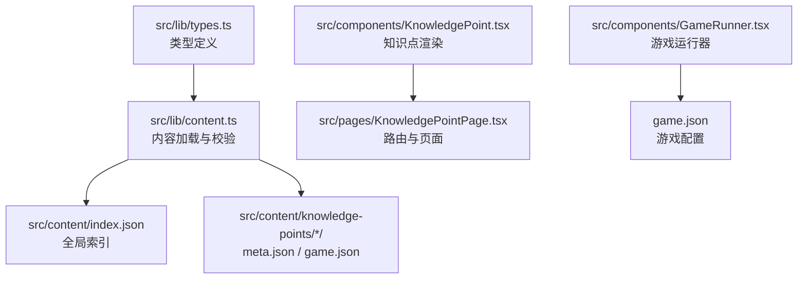
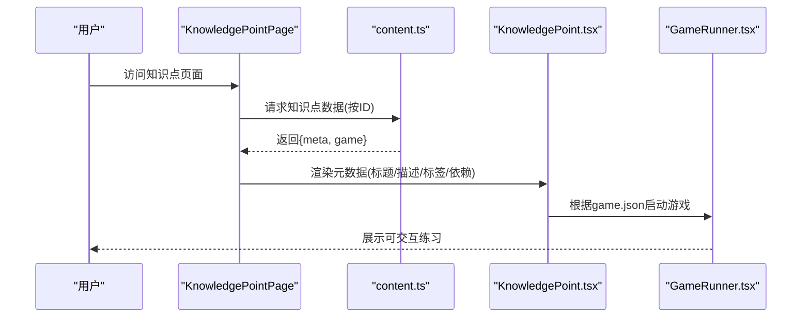
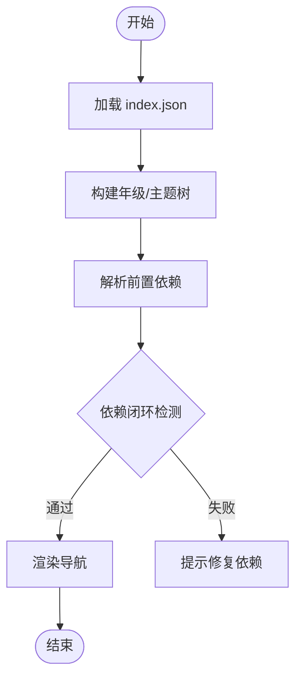
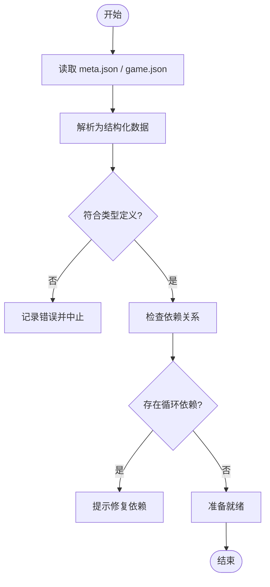
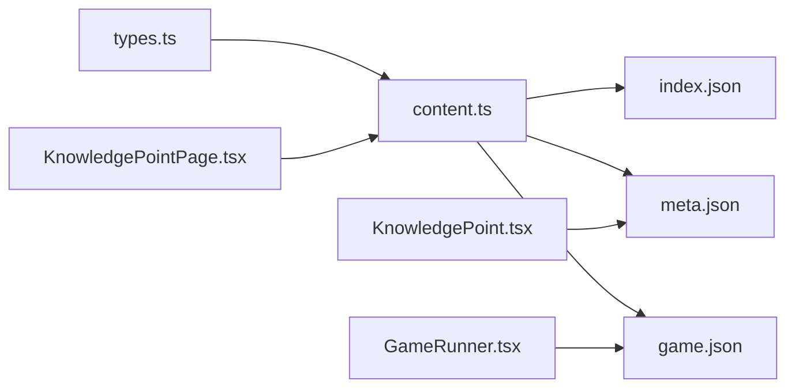

# 知识点数据结构

<cite>
**本文引用的文件**   
- [src/lib/types.ts](file://src/lib/types.ts)
- [src/lib/content.ts](file://src/lib/content.ts)
- [src/components/KnowledgePoint.tsx](file://src/components/KnowledgePoint.tsx)
- [src/components/GameRunner.tsx](file://src/components/GameRunner.tsx)
- [src/pages/KnowledgePointPage.tsx](file://src/pages/KnowledgePointPage.tsx)
- [src/content/index.json](file://src/content/index.json)
- [src/content/knowledge-points/g3-add-sub-10000/meta.json](file://src/content/knowledge-points/g3-add-sub-10000/meta.json)
- [src/content/knowledge-points/g3-add-sub-10000/game.json](file://src/content/knowledge-points/g3-add-sub-10000/game.json)
- [src/content/knowledge-points/g3-fraction-intro/meta.json](file://src/content/knowledge-points/g3-fraction-intro/meta.json)
- [src/content/knowledge-points/g3-fraction-intro/game.json](file://src/content/knowledge-points/g3-fraction-intro/game.json)
- [src/content/knowledge-points/g4-decimal-meaning/meta.json](file://src/content/knowledge-points/g4-decimal-meaning/meta.json)
- [src/content/knowledge-points/g4-decimal-meaning/game.json](file://src/content/knowledge-points/g4-decimal-meaning/game.json)
- [src/content/knowledge-points/g5-equation/meta.json](file://src/content/knowledge-points/g5-equation/meta.json)
- [src/content/knowledge-points/g5-equation/game.json](file://src/content/knowledge-points/g5-equation/game.json)
- [src/content/knowledge-points/g6-circle-area/meta.json](file://src/content/knowledge-points/g6-circle-area/meta.json)
- [src/content/knowledge-points/g6-circle-area/game.json](file://src/content/knowledge-points/g6-circle-area/game.json)
</cite>

## 目录
1. [简介](#简介)
2. [项目结构](#项目结构)
3. [核心组件](#核心组件)
4. [架构总览](#架构总览)
5. [详细组件分析](#详细组件分析)
6. [依赖关系分析](#依赖关系分析)
7. [性能考虑](#性能考虑)
8. [故障排查指南](#故障排查指南)
9. [结论](#结论)
10. [附录](#附录)

## 简介
本文件面向 math-k6 项目的“知识点数据结构”，系统性阐述 KnowledgePoint、Meta、GameConfig 等核心数据类型的定义与字段含义，覆盖元数据的标题、描述、年级、难度等级、标签等属性；说明知识点的层级关系、依赖关系与导航配置；提供不同知识点类型的 JSON 示例路径，解释数据验证规则（必填/可选字段）与处理逻辑；并给出数据类型扩展指南与向后兼容性建议。

## 项目结构
本项目采用“内容驱动”的组织方式：
- 类型定义集中于 src/lib/types.ts，统一约束知识点、元数据、游戏配置等数据结构。
- 内容资源位于 src/content，其中 index.json 为全局索引，knowledge-points 下按知识点分目录，每个目录包含 meta.json（元数据）、game.json（游戏配置），以及可选的 explain.md、derivation.json 等扩展内容。
- 运行时通过 src/lib/content.ts 加载并解析内容，结合页面与组件渲染。

图表来源
- [src/lib/types.ts](file://src/lib/types.ts)
- [src/lib/content.ts](file://src/lib/content.ts)
- [src/content/index.json](file://src/content/index.json)
- [src/components/KnowledgePoint.tsx](file://src/components/KnowledgePoint.tsx)
- [src/components/GameRunner.tsx](file://src/components/GameRunner.tsx)
- [src/pages/KnowledgePointPage.tsx](file://src/pages/KnowledgePointPage.tsx)

章节来源
- [src/lib/types.ts](file://src/lib/types.ts)
- [src/lib/content.ts](file://src/lib/content.ts)
- [src/content/index.json](file://src/content/index.json)

## 核心组件
- KnowledgePoint：表示一个知识点的完整数据模型，通常由 Meta（元数据）与 GameConfig（游戏配置）组合而成，可能还包含推导或讲解等扩展内容。
- Meta：知识点的元数据，包括标题、描述、年级、难度等级、标签、前置依赖、导航信息等。
- GameConfig：游戏化练习的配置，包括题型、关卡、交互元素、可视化组件引用、评分策略等。

这些类型在运行时被 content.ts 加载与校验，再由页面与组件消费，用于渲染知识点详情与启动对应游戏。

章节来源
- [src/lib/types.ts](file://src/lib/types.ts)
- [src/lib/content.ts](file://src/lib/content.ts)

## 架构总览
知识点数据从静态资源到 UI 的流转如下：
- 入口：index.json 提供知识点清单与分组信息。
- 加载：content.ts 读取指定知识点的 meta.json 与 game.json，进行结构化与校验。
- 渲染：KnowledgePoint 组件根据元数据渲染标题、描述、标签、依赖等；GameRunner 根据游戏配置启动相应游戏。
- 路由：KnowledgePointPage 负责根据 URL 参数定位知识点并加载内容。

图表来源
- [src/pages/KnowledgePointPage.tsx](file://src/pages/KnowledgePointPage.tsx)
- [src/lib/content.ts](file://src/lib/content.ts)
- [src/components/KnowledgePoint.tsx](file://src/components/KnowledgePoint.tsx)
- [src/components/GameRunner.tsx](file://src/components/GameRunner.tsx)

## 详细组件分析

### 类型定义与字段说明（KnowledgePoint、Meta、GameConfig）
- KnowledgePoint
  - 作用：聚合元数据与游戏配置，作为知识点的最小可用单元。
  - 典型字段：标识符、版本、语言、创建/更新时间等通用字段；元数据对象；游戏配置对象；可选的扩展内容（如推导步骤、讲解文本）。
- Meta
  - 作用：描述知识点的静态信息与学习导航。
  - 关键字段：标题、描述、年级、难度等级、标签集合、前置依赖列表、导航顺序、可见性控制、国际化键等。
- GameConfig
  - 作用：驱动具体游戏行为与界面。
  - 关键字段：游戏类型、关卡序列、题目模板、交互控件、可视化组件引用、评分与反馈策略、计时与重试策略等。

章节来源
- [src/lib/types.ts](file://src/lib/types.ts)

### 元数据结构详解（标题、描述、年级、难度、标签、依赖、导航）
- 标题与描述：用于展示与检索，支持多语言键值。
- 年级：字符串或枚举，限定适用学段。
- 难度等级：数值或分级枚举，影响推荐与排序。
- 标签：数组，用于分类与筛选。
- 前置依赖：数组，指向其他知识点 ID，构建学习路径。
- 导航配置：顺序、分组、是否默认展开等。

章节来源
- [src/lib/types.ts](file://src/lib/types.ts)
- [src/lib/content.ts](file://src/lib/content.ts)

### 知识点层级关系、依赖关系与导航配置
- 层级关系：通过年级与分组字段组织，形成“年级-主题-知识点”的树状结构。
- 依赖关系：基于前置依赖字段，形成有向无环图（DAG），用于解锁与推荐。
- 导航配置：决定知识点在目录中的显示顺序与折叠状态。

图表来源
- [src/content/index.json](file://src/content/index.json)
- [src/lib/content.ts](file://src/lib/content.ts)

章节来源
- [src/content/index.json](file://src/content/index.json)
- [src/lib/content.ts](file://src/lib/content.ts)

### 不同类型知识点的 JSON 示例与差异
- 基础运算类（如 g3-add-sub-10000）
  - 特点：强调计算流程与即时反馈，游戏配置相对简单。
  - 参考路径：[g3-add-sub-10000/meta.json](file://src/content/knowledge-points/g3-add-sub-10000/meta.json)、[g3-add-sub-10000/game.json](file://src/content/knowledge-points/g3-add-sub-10000/game.json)
- 概念引入类（如 g3-fraction-intro）
  - 特点：侧重可视化与演示，游戏配置包含更多可视化组件引用。
  - 参考路径：[g3-fraction-intro/meta.json](file://src/content/knowledge-points/g3-fraction-intro/meta.json)、[g3-fraction-intro/game.json](file://src/content/knowledge-points/g3-fraction-intro/game.json)
- 小数意义类（如 g4-decimal-meaning）
  - 特点：强调位值与数感，可能需要进度追踪与错误诊断。
  - 参考路径：[g4-decimal-meaning/meta.json](file://src/content/knowledge-points/g4-decimal-meaning/meta.json)、[g4-decimal-meaning/game.json](file://src/content/knowledge-points/g4-decimal-meaning/game.json)
- 方程求解类（如 g5-equation）
  - 特点：步骤化推导与多步验证，游戏配置包含步骤检查与提示。
  - 参考路径：[g5-equation/meta.json](file://src/content/knowledge-points/g5-equation/meta.json)、[g5-equation/game.json](file://src/content/knowledge-points/g5-equation/game.json)
- 几何面积类（如 g6-circle-area）
  - 特点：公式应用与图形变换，游戏配置包含几何可视化与测量工具。
  - 参考路径：[g6-circle-area/meta.json](file://src/content/knowledge-points/g6-circle-area/meta.json)、[g6-circle-area/game.json](file://src/content/knowledge-points/g6-circle-area/game.json)

章节来源
- [src/content/knowledge-points/g3-add-sub-10000/meta.json](file://src/content/knowledge-points/g3-add-sub-10000/meta.json)
- [src/content/knowledge-points/g3-add-sub-10000/game.json](file://src/content/knowledge-points/g3-add-sub-10000/game.json)
- [src/content/knowledge-points/g3-fraction-intro/meta.json](file://src/content/knowledge-points/g3-fraction-intro/meta.json)
- [src/content/knowledge-points/g3-fraction-intro/game.json](file://src/content/knowledge-points/g3-fraction-intro/game.json)
- [src/content/knowledge-points/g4-decimal-meaning/meta.json](file://src/content/knowledge-points/g4-decimal-meaning/meta.json)
- [src/content/knowledge-points/g4-decimal-meaning/game.json](file://src/content/knowledge-points/g4-decimal-meaning/game.json)
- [src/content/knowledge-points/g5-equation/meta.json](file://src/content/knowledge-points/g5-equation/meta.json)
- [src/content/knowledge-points/g5-equation/game.json](file://src/content/knowledge-points/g5-equation/game.json)
- [src/content/knowledge-points/g6-circle-area/meta.json](file://src/content/knowledge-points/g6-circle-area/meta.json)
- [src/content/knowledge-points/g6-circle-area/game.json](file://src/content/knowledge-points/g6-circle-area/game.json)

### 数据验证规则、必填字段与可选字段处理
- 必填字段
  - 元数据：标识符、标题、年级、难度等级、标签、游戏配置引用等。
  - 游戏配置：游戏类型、关卡/题目结构、交互元素、评分策略等。
- 可选字段
  - 元数据：描述、前置依赖、导航顺序、国际化键、可见性控制等。
  - 游戏配置：计时、重试、提示、可视化组件、扩展反馈等。
- 校验流程
  - 加载时进行结构校验与类型断言。
  - 对依赖关系进行闭环检测与拓扑排序。
  - 缺失必填字段时抛出明确错误，便于快速定位问题。

图表来源
- [src/lib/content.ts](file://src/lib/content.ts)

章节来源
- [src/lib/content.ts](file://src/lib/content.ts)

### 数据扩展指南与向后兼容性
- 扩展建议
  - 新增字段优先使用可选字段，避免破坏现有实例。
  - 为新增字段设置默认值与降级策略。
  - 在类型定义中增加联合类型或判别字段以区分不同变体。
- 向后兼容
  - 保持旧字段名不变，废弃字段标记 deprecated 并提供迁移指引。
  - 在加载层做字段映射与兼容转换。
  - 对游戏配置进行能力探测，缺失功能时回退到基础模式。

章节来源
- [src/lib/types.ts](file://src/lib/types.ts)
- [src/lib/content.ts](file://src/lib/content.ts)

## 依赖关系分析
- 模块耦合
  - types.ts 为所有内容的契约，content.ts 依赖其进行解析与校验。
  - 页面与组件仅消费已校验的数据，降低运行时错误风险。
- 外部依赖
  - 内容资源（JSON/Markdown）为静态输入，不引入运行时库。
  - 可视化组件通过 registry 注册，按需加载。

图表来源
- [src/lib/types.ts](file://src/lib/types.ts)
- [src/lib/content.ts](file://src/lib/content.ts)
- [src/content/index.json](file://src/content/index.json)
- [src/pages/KnowledgePointPage.tsx](file://src/pages/KnowledgePointPage.tsx)
- [src/components/KnowledgePoint.tsx](file://src/components/KnowledgePoint.tsx)
- [src/components/GameRunner.tsx](file://src/components/GameRunner.tsx)

章节来源
- [src/lib/types.ts](file://src/lib/types.ts)
- [src/lib/content.ts](file://src/lib/content.ts)
- [src/content/index.json](file://src/content/index.json)

## 性能考虑
- 内容预取与缓存：对 index.json 与常用知识点数据进行缓存，减少重复请求。
- 增量加载：仅在进入知识点页面时加载对应 meta 与 game 配置。
- 可视化按需加载：根据游戏配置动态导入可视化组件，避免首屏过大。
- 依赖解析优化：对依赖图进行一次性拓扑排序，避免重复计算。

## 故障排查指南
- 常见问题
  - 缺少必填字段：检查 meta.json 与 game.json 的结构是否符合类型定义。
  - 依赖循环：确认前置依赖未形成闭环，必要时调整顺序。
  - 游戏配置不匹配：核对游戏类型与支持的组件/能力。
- 调试建议
  - 启用详细日志输出，定位解析失败位置。
  - 使用最小复现案例逐步添加字段，缩小问题范围。
  - 对依赖关系进行可视化检查，辅助发现异常。

章节来源
- [src/lib/content.ts](file://src/lib/content.ts)

## 结论
math-k6 的知识点数据结构以 types.ts 为核心契约，通过 content.ts 实现稳健的内容加载与校验，配合页面与组件完成渲染与交互。Meta 与 GameConfig 清晰分离关注点，既保证可扩展性，又维持向后兼容。遵循本文的规范与建议，可高效扩展新的知识点类型并保持系统稳定。

## 附录
- 术语表
  - 知识点：一个独立的学习单元，包含元数据与游戏配置。
  - 元数据：描述知识点的静态信息与导航属性。
  - 游戏配置：驱动互动练习的具体参数与行为。
- 参考路径
  - 类型定义：[src/lib/types.ts](file://src/lib/types.ts)
  - 内容加载与校验：[src/lib/content.ts](file://src/lib/content.ts)
  - 页面与组件：[src/pages/KnowledgePointPage.tsx](file://src/pages/KnowledgePointPage.tsx)、[src/components/KnowledgePoint.tsx](file://src/components/KnowledgePoint.tsx)、[src/components/GameRunner.tsx](file://src/components/GameRunner.tsx)
  - 示例内容：见各知识点目录下的 meta.json 与 game.json