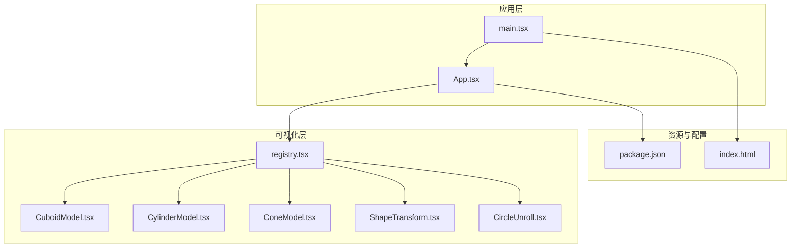
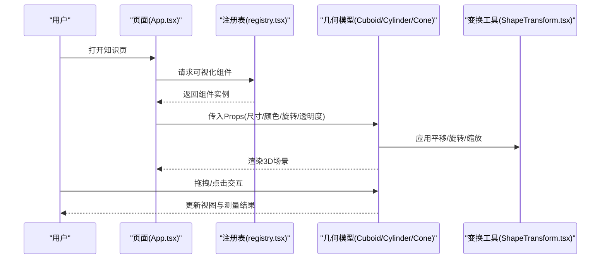
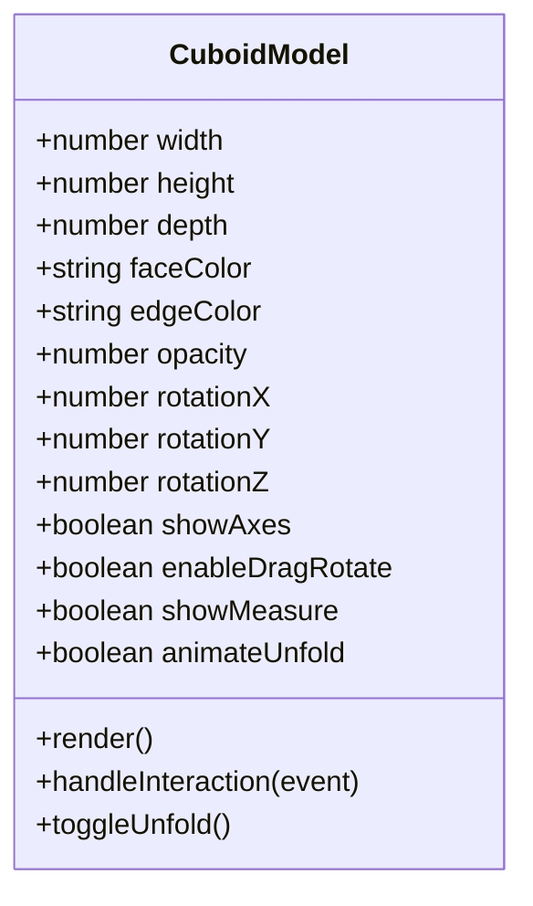
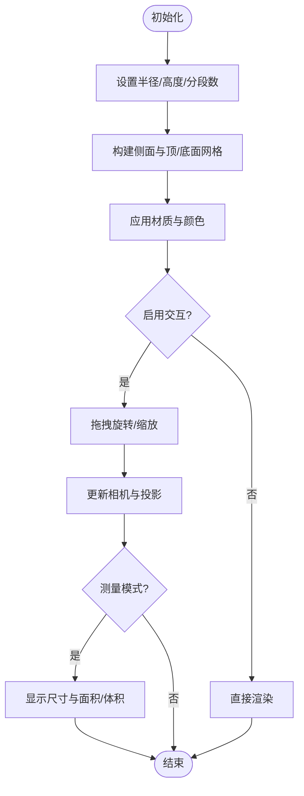
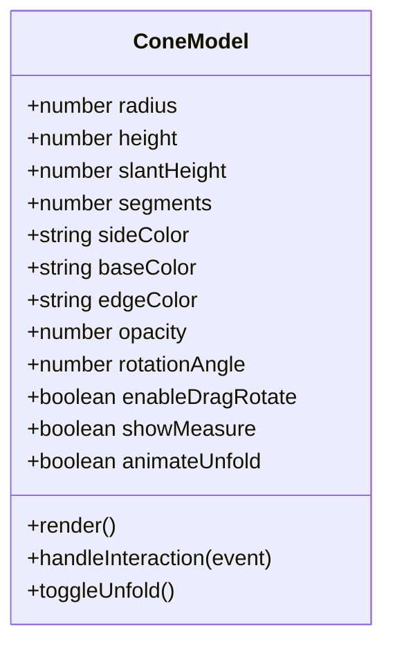
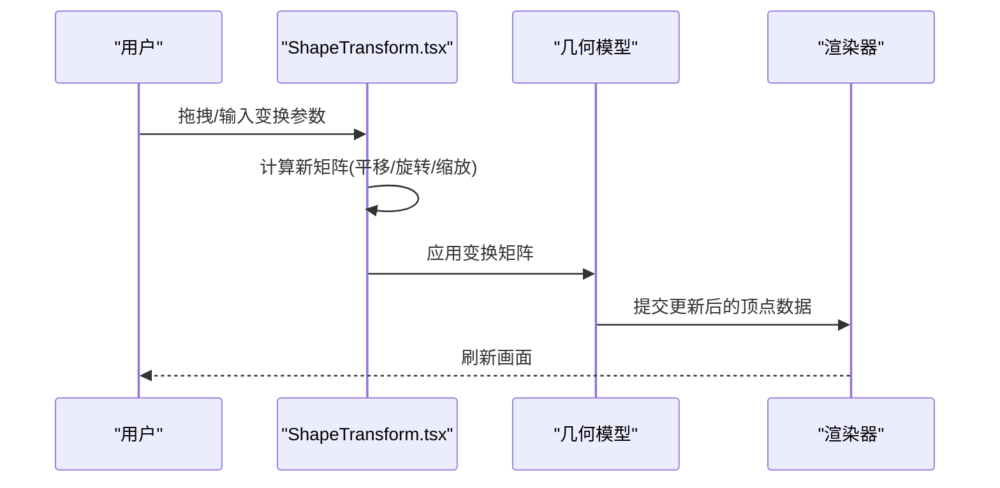
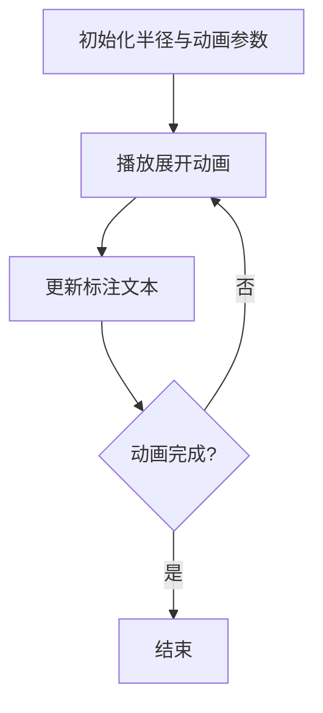
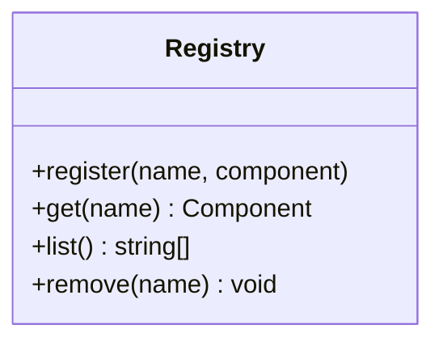
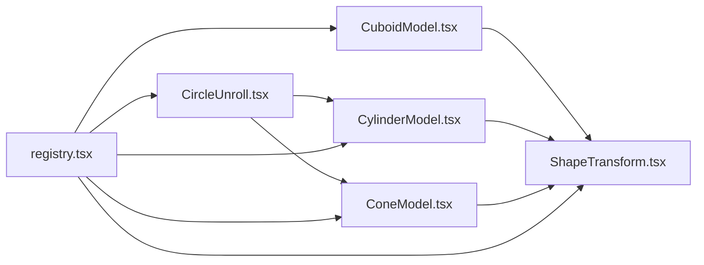

# 几何模型工具

<cite>
**本文引用的文件**   
- [CuboidModel.tsx](file://src/visualizations/CuboidModel.tsx)
- [CylinderModel.tsx](file://src/visualizations/CylinderModel.tsx)
- [ConeModel.tsx](file://src/visualizations/ConeModel.tsx)
- [ShapeTransform.tsx](file://src/visualizations/ShapeTransform.tsx)
- [CircleUnroll.tsx](file://src/visualizations/CircleUnroll.tsx)
- [registry.tsx](file://src/visualizations/registry.tsx)
- [App.tsx](file://src/App.tsx)
- [main.tsx](file://src/main.tsx)
- [package.json](file://package.json)
</cite>

## 目录
1. [简介](#简介)
2. [项目结构](#项目结构)
3. [核心组件](#核心组件)
4. [架构总览](#架构总览)
5. [详细组件分析](#详细组件分析)
6. [依赖关系分析](#依赖关系分析)
7. [性能考虑](#性能考虑)
8. [故障排查指南](#故障排查指南)
9. [结论](#结论)
10. [附录](#附录)

## 简介
本技术文档围绕 math-k6 的三维几何模型工具展开，重点说明立方体、圆柱体、圆锥体的 3D 渲染与交互实现，涵盖 Props 接口（尺寸、颜色、旋转、透明度等）、形状变换工具（平移、旋转、缩放）、用户交互（拖拽旋转、视角切换、测量）、动画效果（展开、折叠、变形）以及性能优化与浏览器兼容性建议。文档面向开发者与教育内容创作者，力求在保持技术深度的同时提供易于理解的说明。

## 项目结构
本项目采用 React + TypeScript 的前端工程化结构，可视化能力集中在 src/visualizations 目录下，通过注册表统一暴露给上层页面使用。关键目录与职责：
- src/visualizations：各类可视化组件，包括三维几何模型与二维辅助图形
- src/pages：知识页与年级页等页面入口
- src/components：通用 UI 组件与布局
- src/lib：内容与进度管理逻辑
- public/index.html：应用入口 HTML
- package.json：依赖与脚本配置

图表来源
- [App.tsx](file://src/App.tsx)
- [main.tsx](file://src/main.tsx)
- [registry.tsx](file://src/visualizations/registry.tsx)
- [CuboidModel.tsx](file://src/visualizations/CuboidModel.tsx)
- [CylinderModel.tsx](file://src/visualizations/CylinderModel.tsx)
- [ConeModel.tsx](file://src/visualizations/ConeModel.tsx)
- [ShapeTransform.tsx](file://src/visualizations/ShapeTransform.tsx)
- [CircleUnroll.tsx](file://src/visualizations/CircleUnroll.tsx)
- [package.json](file://package.json)

章节来源
- [App.tsx](file://src/App.tsx)
- [main.tsx](file://src/main.tsx)
- [package.json](file://package.json)

## 核心组件
- 立方体模型 CuboidModel：用于展示可交互的立方体，支持尺寸、颜色、旋转与透明度控制，常用于表面积与体积教学。
- 圆柱体模型 CylinderModel：用于展示圆柱体及其展开图，支持半径、高度、材质与着色选项。
- 圆锥体模型 ConeModel：用于展示圆锥体及其展开图，支持底面半径、高、母线长度与着色选项。
- 形状变换 ShapeTransform：统一的几何变换工具，提供平移、旋转、缩放的交互与参数化控制。
- 圆展开 CircleUnroll：用于演示圆的展开过程，配合动画讲解周长与面积概念。
- 可视化注册表 registry：集中注册与导出可视化组件，供页面按需加载与组合。

章节来源
- [CuboidModel.tsx](file://src/visualizations/CuboidModel.tsx)
- [CylinderModel.tsx](file://src/visualizations/CylinderModel.tsx)
- [ConeModel.tsx](file://src/visualizations/ConeModel.tsx)
- [ShapeTransform.tsx](file://src/visualizations/ShapeTransform.tsx)
- [CircleUnroll.tsx](file://src/visualizations/CircleUnroll.tsx)
- [registry.tsx](file://src/visualizations/registry.tsx)

## 架构总览
整体架构遵循“页面 -> 注册表 -> 具体可视化组件”的分层模式。页面通过注册表获取并渲染所需的可视化组件；各组件内部封装了 3D 渲染、交互与动画逻辑，并通过统一的 Props 接口进行配置。

图表来源
- [App.tsx](file://src/App.tsx)
- [registry.tsx](file://src/visualizations/registry.tsx)
- [CuboidModel.tsx](file://src/visualizations/CuboidModel.tsx)
- [CylinderModel.tsx](file://src/visualizations/CylinderModel.tsx)
- [ConeModel.tsx](file://src/visualizations/ConeModel.tsx)
- [ShapeTransform.tsx](file://src/visualizations/ShapeTransform.tsx)

## 详细组件分析

### 立方体模型 CuboidModel
- 功能概述：渲染可交互的立方体，支持尺寸调整、颜色与透明度设置、旋转角度控制，并提供测量与展开视图切换。
- Props 接口要点：
  - 尺寸：长、宽、高（单位通常为像素或相对单位）
  - 颜色：面颜色、边线颜色、高光强度
  - 旋转：绕 X/Y/Z 轴的旋转角度（度或弧度）
  - 透明度：整体不透明度与半透明面开关
  - 交互：是否启用拖拽旋转、是否显示网格与坐标轴
  - 动画：是否启用展开/折叠动画及持续时间
- 渲染与交互：
  - 基于 WebGL/Canvas 的 3D 管线，按面与边绘制
  - 鼠标/触摸事件驱动旋转与缩放
  - 可选测量模式，显示棱长、面对角线与体对角线
- 动画：
  - 展开为平面展开图，便于理解表面积构成
  - 折叠回立体形态，支持缓动曲线

图表来源
- [CuboidModel.tsx](file://src/visualizations/CuboidModel.tsx)

章节来源
- [CuboidModel.tsx](file://src/visualizations/CuboidModel.tsx)

### 圆柱体模型 CylinderModel
- 功能概述：渲染圆柱体，支持半径与高度调节、材质与着色、侧面展开与顶/底面可见性控制。
- Props 接口要点：
  - 尺寸：半径 r、高度 h、分段数（影响曲面平滑度）
  - 颜色：侧面颜色、顶/底面颜色、边线颜色
  - 透明度：整体与分面透明度
  - 旋转：绕轴旋转角度与自由旋转开关
  - 交互：拖拽旋转、滚轮缩放、点击选择面
  - 动画：展开侧面为矩形、顶/底面展开为圆形
- 渲染与交互：
  - 侧面由多边形逼近，分段数越高越平滑但性能开销越大
  - 展开动画将曲面映射到平面，便于讲解侧面积公式
- 测量：
  - 显示半径、高、母线、侧面积、表面积与体积（可选）

图表来源
- [CylinderModel.tsx](file://src/visualizations/CylinderModel.tsx)

章节来源
- [CylinderModel.tsx](file://src/visualizations/CylinderModel.tsx)

### 圆锥体模型 ConeModel
- 功能概述：渲染圆锥体，支持底面半径、高与母线长度调节，提供侧面展开为扇形的动画演示。
- Props 接口要点：
  - 尺寸：底面半径 r、高 h、母线 l、分段数
  - 颜色：侧面与底面颜色、边线颜色
  - 透明度：整体与分面透明度
  - 旋转：绕轴旋转角度与自由旋转开关
  - 交互：拖拽旋转、滚轮缩放、点击选择面
  - 动画：侧面展开为扇形，底面展开为圆形
- 渲染与交互：
  - 侧面由三角面片拼接，分段数影响平滑度
  - 展开动画直观展示侧面积与弧长的关系
- 测量：
  - 显示半径、高、母线、侧面积、表面积与体积（可选）

图表来源
- [ConeModel.tsx](file://src/visualizations/ConeModel.tsx)

章节来源
- [ConeModel.tsx](file://src/visualizations/ConeModel.tsx)

### 形状变换 ShapeTransform
- 功能概述：统一的几何变换工具，提供平移、旋转、缩放的参数化控制与交互操作，适用于所有几何模型。
- 主要能力：
  - 平移：沿 X/Y/Z 轴移动指定距离
  - 旋转：绕任意轴旋转指定角度，支持欧拉角与四元数（内部实现）
  - 缩放：在各轴上按比例放大或缩小
  - 交互：拖拽手柄进行实时变换，键盘快捷键微调
  - 状态管理：记录变换历史，支持撤销/重做
- 与模型集成：
  - 作为包装器或中间层，对模型的顶点矩阵进行变换
  - 与渲染循环同步更新，保证帧率稳定

图表来源
- [ShapeTransform.tsx](file://src/visualizations/ShapeTransform.tsx)

章节来源
- [ShapeTransform.tsx](file://src/visualizations/ShapeTransform.tsx)

### 圆展开 CircleUnroll
- 功能概述：演示圆的展开过程，用于讲解周长与面积的关系，常与圆柱/圆锥展开结合使用。
- 主要能力：
  - 动态展开：从圆形逐步展开为扇形或矩形
  - 参数控制：半径、展开比例、动画时长
  - 标注：显示半径、直径、周长与面积
- 适用场景：
  - 圆柱侧面展开为矩形时，底面圆展开为圆形
  - 圆锥侧面展开为扇形时，底面圆展开为圆形

图表来源
- [CircleUnroll.tsx](file://src/visualizations/CircleUnroll.tsx)

章节来源
- [CircleUnroll.tsx](file://src/visualizations/CircleUnroll.tsx)

### 可视化注册表 registry
- 功能概述：集中注册与导出可视化组件，供页面按需加载与组合，降低耦合度。
- 主要能力：
  - 组件注册：按名称映射到具体组件类/函数
  - 动态加载：根据页面配置动态引入所需组件
  - 版本兼容：支持组件版本管理与降级策略

图表来源
- [registry.tsx](file://src/visualizations/registry.tsx)

章节来源
- [registry.tsx](file://src/visualizations/registry.tsx)

## 依赖关系分析
- 组件间依赖：
  - CuboidModel、CylinderModel、ConeModel 均依赖 ShapeTransform 进行几何变换
  - CircleUnroll 可与 CylinderModel/ConeModel 联动，展示展开动画
  - registry 统一管理上述组件，供页面按需调用
- 外部依赖：
  - React/TypeScript：UI 框架与类型系统
  - 可能的 3D 库：如 Three.js 或自研 WebGL 管线（取决于实现）
  - 动画库：如 requestAnimationFrame 或第三方动画库

图表来源
- [CuboidModel.tsx](file://src/visualizations/CuboidModel.tsx)
- [CylinderModel.tsx](file://src/visualizations/CylinderModel.tsx)
- [ConeModel.tsx](file://src/visualizations/ConeModel.tsx)
- [ShapeTransform.tsx](file://src/visualizations/ShapeTransform.tsx)
- [CircleUnroll.tsx](file://src/visualizations/CircleUnroll.tsx)
- [registry.tsx](file://src/visualizations/registry.tsx)

章节来源
- [registry.tsx](file://src/visualizations/registry.tsx)

## 性能考虑
- 几何细分控制：
  - 圆柱/圆锥的分段数直接影响面片数量，建议在移动端降低分段数以提升帧率
  - 立方体默认低细分即可满足教学需求
- 渲染优化：
  - 使用批处理绘制减少 draw call
  - 合理设置阴影与抗锯齿，避免过度消耗 GPU
- 动画优化：
  - 使用 requestAnimationFrame 确保动画流畅
  - 对复杂动画使用节流与去抖策略
- 内存管理：
  - 及时释放不再使用的纹理与缓冲区
  - 避免频繁创建/销毁对象，采用对象池复用
- 浏览器兼容性：
  - 检测 WebGL 支持，提供降级方案（如 2D Canvas）
  - 针对 Safari/Chrome/Firefox 的差异进行适配

[本节为通用指导，无需特定文件来源]

## 故障排查指南
- 常见问题：
  - 3D 渲染黑屏：检查 WebGL 上下文初始化与着色器编译日志
  - 动画卡顿：确认分段数与特效设置，必要时降低复杂度
  - 交互无响应：验证事件监听器绑定与坐标系转换
  - 展开动画异常：检查展开映射算法与边界条件
- 调试建议：
  - 使用浏览器开发者工具的 Performance 面板分析帧率
  - 添加日志输出关键状态与错误信息
  - 单元测试覆盖核心算法（如展开映射、矩阵变换）

[本节为通用指导，无需特定文件来源]

## 结论
math-k6 的几何模型工具通过模块化设计与统一注册机制，实现了立方体、圆柱体、圆锥体的 3D 渲染与交互，结合形状变换工具与展开动画，为数学教学提供了直观且高效的可视化手段。通过合理的性能优化与兼容性处理，可在多种设备上提供稳定的用户体验。

[本节为总结，无需特定文件来源]

## 附录
- 安装与运行：
  - 使用 npm/yarn 安装依赖后启动开发服务器
  - 访问 index.html 查看应用
- 扩展建议：
  - 新增几何模型时，遵循现有 Props 接口规范
  - 在 registry 中注册新组件，确保页面可动态加载
  - 完善测试用例，覆盖交互与动画路径

[本节为补充信息，无需特定文件来源]