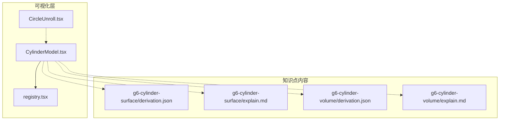
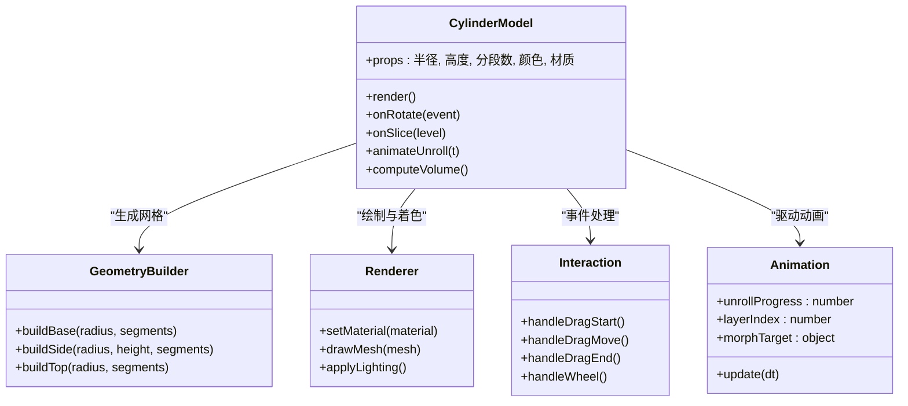
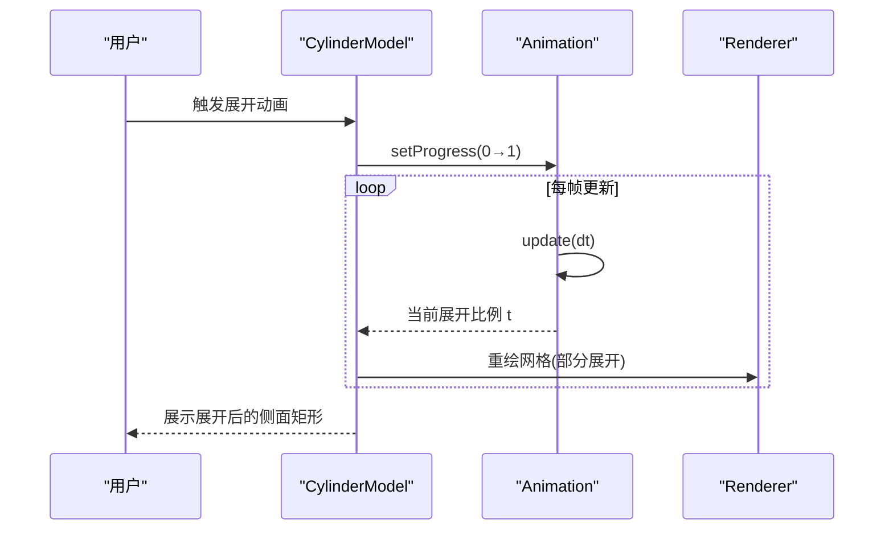
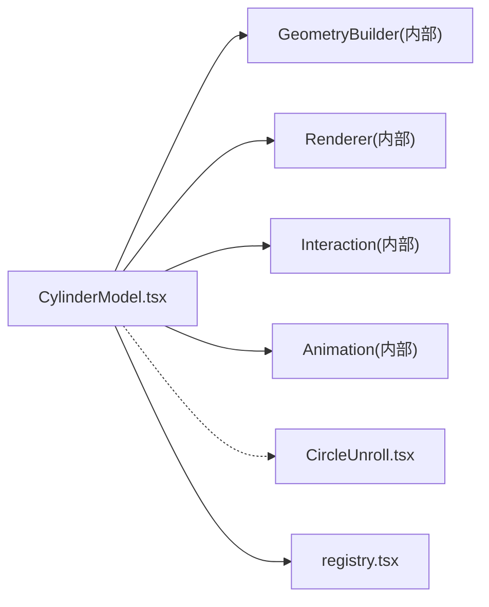

# 圆柱体模型

<cite>
**本文引用的文件**   
- [CylinderModel.tsx](file://src/visualizations/CylinderModel.tsx)
- [g6-cylinder-surface/derivation.json](file://src/content/knowledge-points/g6-cylinder-surface/derivation.json)
- [g6-cylinder-surface/explain.md](file://src/content/knowledge-points/g6-cylinder-surface/explain.md)
- [g6-cylinder-volume/derivation.json](file://src/content/knowledge-points/g6-cylinder-volume/derivation.json)
- [g6-cylinder-volume/explain.md](file://src/content/knowledge-points/g6-cylinder-volume/explain.md)
- [CircleUnroll.tsx](file://src/visualizations/CircleUnroll.tsx)
- [registry.tsx](file://src/visualizations/registry.tsx)
</cite>

## 目录
1. [简介](#简介)
2. [项目结构](#项目结构)
3. [核心组件](#核心组件)
4. [架构总览](#架构总览)
5. [详细组件分析](#详细组件分析)
6. [依赖关系分析](#依赖关系分析)
7. [性能与渲染质量](#性能与渲染质量)
8. [故障排查指南](#故障排查指南)
9. [结论](#结论)
10. [附录：数学公式可视化方法](#附录数学公式可视化方法)

## 简介
本技术文档围绕 CylinderModel 圆柱体模型组件，系统阐述三维圆柱体的数学建模与渲染原理，包括圆形底面的参数方程、侧面曲面生成、顶部/底部椭圆投影，以及 Props 接口（半径、高度、分段数、颜色配置、材质设置）的详细说明。同时记录用户交互（旋转查看、截面分析、体积计算）、动画效果（展开侧面、分层显示、动态变形），并提供圆周率演示与面积推导过程的可视化方案，最后给出性能优化与渲染质量控制建议。

## 项目结构
CylinderModel 位于可视化模块中，通过注册表被上层内容消费；相关数学推导与讲解内容以知识点的 JSON/Markdown 形式组织在 content/knowledge-points 下。

图表来源
- [CylinderModel.tsx](file://src/visualizations/CylinderModel.tsx)
- [registry.tsx](file://src/visualizations/registry.tsx)
- [g6-cylinder-surface/derivation.json](file://src/content/knowledge-points/g6-cylinder-surface/derivation.json)
- [g6-cylinder-surface/explain.md](file://src/content/knowledge-points/g6-cylinder-surface/explain.md)
- [g6-cylinder-volume/derivation.json](file://src/content/knowledge-points/g6-cylinder-volume/derivation.json)
- [g6-cylinder-volume/explain.md](file://src/content/knowledge-points/g6-cylinder-volume/explain.md)

章节来源
- [CylinderModel.tsx](file://src/visualizations/CylinderModel.tsx)
- [registry.tsx](file://src/visualizations/registry.tsx)
- [g6-cylinder-surface/derivation.json](file://src/content/knowledge-points/g6-cylinder-surface/derivation.json)
- [g6-cylinder-surface/explain.md](file://src/content/knowledge-points/g6-cylinder-surface/explain.md)
- [g6-cylinder-volume/derivation.json](file://src/content/knowledge-points/g6-cylinder-volume/derivation.json)
- [g6-cylinder-volume/explain.md](file://src/content/knowledge-points/g6-cylinder-volume/explain.md)

## 核心组件
- 组件职责
  - 提供可配置的圆柱体三维可视化，支持半径、高度、分段数、颜色与材质等属性。
  - 实现侧表面展开动画、分层显示、截面分析与体积计算展示。
  - 与知识点内容联动，辅助圆周率演示与面积/体积推导过程。

- 关键能力
  - 几何建模：基于参数方程生成圆面与柱面网格。
  - 渲染管线：根据分段数控制三角面片数量，结合材质与光照进行着色。
  - 交互：鼠标拖拽旋转、滚轮缩放、点击触发截面或展开动画。
  - 动画：侧面展开为矩形、按高度分层显示、动态变形（如半径/高度变化）。

章节来源
- [CylinderModel.tsx](file://src/visualizations/CylinderModel.tsx)

## 架构总览
CylinderModel 作为独立可视化组件，通过注册表暴露给页面使用；其内部将“几何生成”“渲染控制”“交互处理”“动画状态”解耦，便于扩展与维护。

图表来源
- [CylinderModel.tsx](file://src/visualizations/CylinderModel.tsx)

## 详细组件分析

### 数学建模与渲染原理
- 圆形底面参数方程
  - 以圆心为原点，半径 r，角度 θ ∈ [0, 2π]，点坐标 (r·cosθ, r·sinθ)。
  - 离散化时按分段数 N 均匀采样 θ_i = 2π·i/N，i=0..N。
- 侧面曲面生成
  - 将底面圆周沿高度方向拉伸 h，得到柱面网格：(r·cosθ, z, r·sinθ)，z∈[0,h]。
  - 三角化策略：将每个扇形条带划分为两个三角形，保证法线一致性与 UV 映射连续。
- 顶部/底部椭圆投影
  - 正交投影下顶/底仍为圆；透视投影下呈现椭圆，需根据相机矩阵与视锥体计算投影变换。
- 表面积与体积
  - 侧面积 S_side = 2πrh；底面积 S_base = πr²；总表面积 S_total = 2πr(r+h)。
  - 体积 V = πr²h。

章节来源
- [CylinderModel.tsx](file://src/visualizations/CylinderModel.tsx)
- [g6-cylinder-surface/derivation.json](file://src/content/knowledge-points/g6-cylinder-surface/derivation.json)
- [g6-cylinder-surface/explain.md](file://src/content/knowledge-points/g6-cylinder-surface/explain.md)
- [g6-cylinder-volume/derivation.json](file://src/content/knowledge-points/g6-cylinder-volume/derivation.json)
- [g6-cylinder-volume/explain.md](file://src/content/knowledge-points/g6-cylinder-volume/explain.md)

### Props 接口说明
- 半径 radius：数值，单位与场景一致，默认值由组件定义。
- 高度 height：数值，控制柱体纵向尺寸。
- 分段数 segments：整数，控制圆周与高度的离散精度，影响面片数量与平滑度。
- 颜色配置 color：对象或字符串，包含顶面、底面、侧面颜色，支持透明通道。
- 材质 material：对象，包含漫反射、镜面反射、粗糙度、金属度等物理渲染参数。
- 可选交互开关：enableRotation、enableSlice、enableUnroll、enableMorph。

章节来源
- [CylinderModel.tsx](file://src/visualizations/CylinderModel.tsx)

### 用户交互功能
- 旋转查看
  - 鼠标拖拽改变视角，滚轮缩放；支持惯性滚动与阻尼回弹。
- 截面分析
  - 选择高度层级 level，显示水平截面圆，并标注半径与周长。
- 体积计算
  - 实时读取 radius、height，输出体积 V = πr²h，并在 UI 上展示推导步骤。

章节来源
- [CylinderModel.tsx](file://src/visualizations/CylinderModel.tsx)

### 动画效果实现
- 展开侧面
  - 将柱面沿母线剪开并展平为矩形，宽度为 2πr，高度为 h；动画进度 t∈[0,1] 控制展开程度。
- 分层显示
  - 按高度等分多层，逐层淡入/高亮，用于教学演示横截面与体积切片。
- 动态变形
  - 对 radius、height 进行插值过渡，实现平滑的形状变化；支持目标形状 morphTarget。

图表来源
- [CylinderModel.tsx](file://src/visualizations/CylinderModel.tsx)

章节来源
- [CylinderModel.tsx](file://src/visualizations/CylinderModel.tsx)

### 与知识点内容的联动
- 圆柱表面积推导
  - 通过展开动画直观展示侧面积等于矩形面积（宽=周长，高=柱高）。
- 圆柱体积推导
  - 通过分层切片与积分思想，展示体积等于底面积乘以高。

章节来源
- [g6-cylinder-surface/derivation.json](file://src/content/knowledge-points/g6-cylinder-surface/derivation.json)
- [g6-cylinder-surface/explain.md](file://src/content/knowledge-points/g6-cylinder-surface/explain.md)
- [g6-cylinder-volume/derivation.json](file://src/content/knowledge-points/g6-cylinder-volume/derivation.json)
- [g6-cylinder-volume/explain.md](file://src/content/knowledge-points/g6-cylinder-volume/explain.md)

## 依赖关系分析
CylinderModel 依赖几何构建、渲染器、交互与动画子系统；同时引用 CircleUnroll 辅助展示圆的展开过程，并通过 registry 对外暴露。

图表来源
- [CylinderModel.tsx](file://src/visualizations/CylinderModel.tsx)
- [CircleUnroll.tsx](file://src/visualizations/CircleUnroll.tsx)
- [registry.tsx](file://src/visualizations/registry.tsx)

章节来源
- [CylinderModel.tsx](file://src/visualizations/CylinderModel.tsx)
- [CircleUnroll.tsx](file://src/visualizations/CircleUnroll.tsx)
- [registry.tsx](file://src/visualizations/registry.tsx)

## 性能与渲染质量
- 分段数与面片数量
  - 增加 segments 提升平滑度但线性增长面片数；建议在移动端限制最大分段数。
- 材质与光照
  - 合理设置粗糙度与金属度，避免过度采样导致掉帧；启用按需阴影。
- 动画帧率
  - 使用 requestAnimationFrame 与时间步长 dt，避免阻塞主线程；必要时降级动画复杂度。
- 内存与缓存
  - 复用几何缓冲与纹理；避免重复创建 Mesh。
- 渲染质量控制
  - 开启抗锯齿、深度测试、剔除背面；调整近远裁剪面减少过绘制。

[本节为通用指导，不直接分析具体文件]

## 故障排查指南
- 常见问题
  - 展开动画卡顿：检查 segments 是否过大，或动画循环未释放资源。
  - 截面显示异常：确认层级索引与高度范围边界条件。
  - 体积计算结果异常：核对单位与输入合法性（半径/高度非负）。
- 调试建议
  - 打印关键变量（segments、radius、height、t 进度）。
  - 使用浏览器开发者工具观察帧率与 GPU 占用。
  - 逐步关闭材质特性（如高光、阴影）定位瓶颈。

章节来源
- [CylinderModel.tsx](file://src/visualizations/CylinderModel.tsx)

## 结论
CylinderModel 将圆柱体的数学建模、渲染与交互有机整合，既满足教学演示需求，又具备良好的可扩展性。通过合理的分段控制、材质配置与动画设计，可在不同设备上实现流畅且高质量的可视化体验。

[本节为总结性内容，不直接分析具体文件]

## 附录：数学公式可视化方法
- 圆周率演示
  - 利用圆周长与直径比值，通过展开动画对比弧长与直线长度，直观体现 π 的几何意义。
- 面积推导过程
  - 侧面积：将柱面展开为矩形，面积=周长×高。
  - 底面积：圆面积 πr²，可通过分割扇形拼成近似矩形推导。
  - 体积：底面积×高，或通过微元法（切片积分）解释。

章节来源
- [g6-cylinder-surface/derivation.json](file://src/content/knowledge-points/g6-cylinder-surface/derivation.json)
- [g6-cylinder-surface/explain.md](file://src/content/knowledge-points/g6-cylinder-surface/explain.md)
- [g6-cylinder-volume/derivation.json](file://src/content/knowledge-points/g6-cylinder-volume/derivation.json)
- [g6-cylinder-volume/explain.md](file://src/content/knowledge-points/g6-cylinder-volume/explain.md)
- [CircleUnroll.tsx](file://src/visualizations/CircleUnroll.tsx)