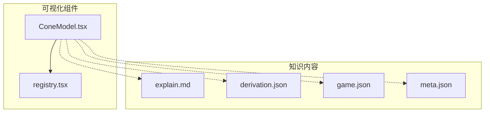
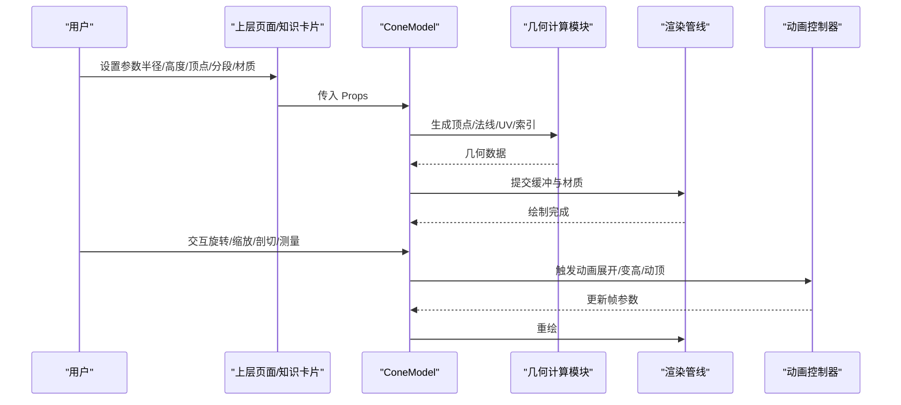
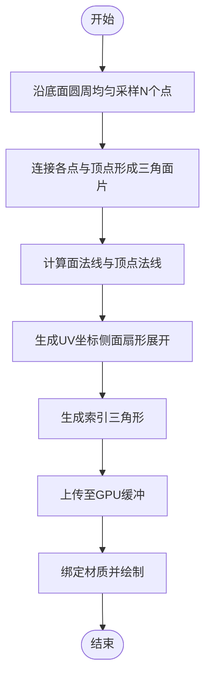
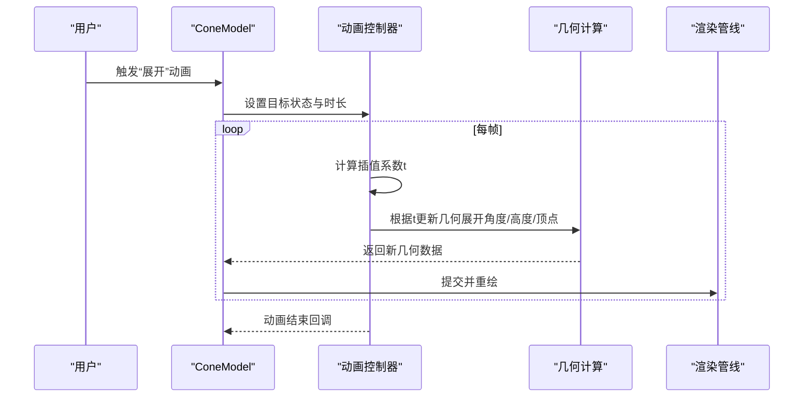
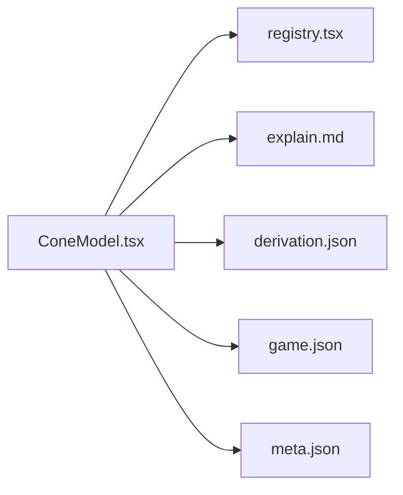

# 圆锥体模型

<cite>
**本文引用的文件**   
- [ConeModel.tsx](file://src/visualizations/ConeModel.tsx)
- [registry.tsx](file://src/visualizations/registry.tsx)
- [g6-cone-volume/explain.md](file://src/content/knowledge-points/g6-cone-volume/explain.md)
- [g6-cone-volume/derivation.json](file://src/content/knowledge-points/g6-cone-volume/derivation.json)
- [g6-cone-volume/game.json](file://src/content/knowledge-points/g6-cone-volume/game.json)
- [g6-cone-volume/meta.json](file://src/content/knowledge-points/g6-cone-volume/meta.json)
</cite>

## 目录
1. [简介](#简介)
2. [项目结构](#项目结构)
3. [核心组件](#核心组件)
4. [架构总览](#架构总览)
5. [详细组件分析](#详细组件分析)
6. [依赖关系分析](#依赖关系分析)
7. [性能考虑](#性能考虑)
8. [故障排查指南](#故障排查指南)
9. [结论](#结论)
10. [附录](#附录)

## 简介
本技术文档围绕 ConeModel 圆锥体模型组件，系统阐述三维圆锥体的几何建模与渲染实现，包括顶点锥化算法、侧面扇形展开与底面椭圆处理；详细说明 Props 接口参数（如底面半径、高度、顶点位置、分段精度与材质属性）；记录用户交互能力（多视角观察、内部结构展示、几何测量）；给出动画效果方案（侧面展开成扇形、高度变化、顶点移动）；并提供数学概念可视化（体积公式推导与表面积计算方法）。同时涵盖渲染优化与跨平台兼容性处理建议。

## 项目结构
ConeModel 位于可视化组件目录中，并通过注册表统一暴露给上层页面使用。知识内容与练习通过 content 目录下的 g6-cone-volume 资源进行组织。

图表来源
- [ConeModel.tsx](file://src/visualizations/ConeModel.tsx)
- [registry.tsx](file://src/visualizations/registry.tsx)
- [g6-cone-volume/explain.md](file://src/content/knowledge-points/g6-cone-volume/explain.md)
- [g6-cone-volume/derivation.json](file://src/content/knowledge-points/g6-cone-volume/derivation.json)
- [g6-cone-volume/game.json](file://src/content/knowledge-points/g6-cone-volume/game.json)
- [g6-cone-volume/meta.json](file://src/content/knowledge-points/g6-cone-volume/meta.json)

章节来源
- [ConeModel.tsx](file://src/visualizations/ConeModel.tsx)
- [registry.tsx](file://src/visualizations/registry.tsx)
- [g6-cone-volume/explain.md](file://src/content/knowledge-points/g6-cone-volume/explain.md)
- [g6-cone-volume/derivation.json](file://src/content/knowledge-points/g6-cone-volume/derivation.json)
- [g6-cone-volume/game.json](file://src/content/knowledge-points/g6-cone-volume/game.json)
- [g6-cone-volume/meta.json](file://src/content/knowledge-points/g6-cone-volume/meta.json)

## 核心组件
- ConeModel：负责圆锥体的几何生成、渲染、交互与动画控制。对外暴露统一的 Props 接口，供上层页面或知识卡片调用。
- registry：将 ConeModel 等可视化组件注册为可复用单元，便于按知识点动态加载与渲染。

章节来源
- [ConeModel.tsx](file://src/visualizations/ConeModel.tsx)
- [registry.tsx](file://src/visualizations/registry.tsx)

## 架构总览
ConeModel 的运行时流程大致如下：接收 Props → 计算几何数据（顶点、法线、UV、索引）→ 构建图形缓冲 → 绑定材质与着色器 → 响应交互事件（旋转、缩放、剖切）→ 驱动动画（展开、变高、动顶）→ 输出到画布。

图表来源
- [ConeModel.tsx](file://src/visualizations/ConeModel.tsx)

## 详细组件分析

### 几何建模与渲染
- 顶点锥化算法
  - 以底面中心为基准，沿径向均匀采样 N 个方向角，得到底面圆周点集。
  - 将各底面点与顶点连接形成三角面片，确保法线朝向一致。
  - 可选：对侧边进行细分，提升曲面平滑度。
- 侧面扇形展开
  - 将侧面三角带按角度顺序展开为平面扇形，扇形半径等于母线长，弧长等于底面周长。
  - 通过 UV 映射将展开后的扇形纹理坐标与三维顶点一一对应。
- 底面椭圆处理
  - 当投影或相机倾斜时，底面在屏幕空间呈现椭圆；几何上仍保持圆形截面，仅在视图变换后显示为椭圆。
  - 若需“斜圆锥”，可通过改变顶点位置或引入非对称拉伸矩阵实现。

图表来源
- [ConeModel.tsx](file://src/visualizations/ConeModel.tsx)

章节来源
- [ConeModel.tsx](file://src/visualizations/ConeModel.tsx)

### Props 接口参数说明
- 几何参数
  - 底面半径：定义底面圆半径大小。
  - 高度：顶点到底面的垂直距离。
  - 顶点位置：允许偏移中心轴，形成斜圆锥。
  - 分段精度：控制圆周与高度的细分数量，影响平滑度与性能。
- 材质与外观
  - 颜色/纹理：支持纯色或贴图。
  - 透明度：用于内部结构展示与叠加对比。
  - 线框模式：便于观察拓扑结构。
- 交互与动画
  - 是否可旋转/缩放：开启相机交互。
  - 是否可剖切：启用平面切割以展示内部。
  - 动画开关：侧面展开、高度变化、顶点移动等。

章节来源
- [ConeModel.tsx](file://src/visualizations/ConeModel.tsx)

### 用户交互功能
- 多视角观察
  - 支持鼠标拖拽旋转、滚轮缩放、右键平移，提供第一人称/轨道相机切换。
- 内部结构展示
  - 通过半透明材质与剖切平面，展示轴线、高、母线、底面圆心与半径标注。
- 几何测量
  - 实时显示半径、高度、母线长、侧面积、表面积、体积等数值，支持单位切换。

章节来源
- [ConeModel.tsx](file://src/visualizations/ConeModel.tsx)

### 动画效果实现
- 侧面展开成扇形
  - 以时间 t ∈ [0,1] 插值展开角度，从闭合圆锥逐步过渡到平面扇形。
- 高度变化
  - 线性或缓动函数驱动高度参数，配合法线重算保证视觉稳定。
- 顶点移动
  - 平滑移动顶点位置，演示斜圆锥的形成过程。

图表来源
- [ConeModel.tsx](file://src/visualizations/ConeModel.tsx)

章节来源
- [ConeModel.tsx](file://src/visualizations/ConeModel.tsx)

### 数学概念可视化
- 体积公式推导
  - 通过积分思想或等积变换，展示 V = (1/3)πr²h 的直观来源。
- 表面积计算
  - 侧面积 S_s = πrl（l 为母线），总表面积 S = πr² + πrl。
- 可视化手段
  - 用扇形展开图对应侧面积，用圆柱切片类比体积比例。

章节来源
- [g6-cone-volume/explain.md](file://src/content/knowledge-points/g6-cone-volume/explain.md)
- [g6-cone-volume/derivation.json](file://src/content/knowledge-points/g6-cone-volume/derivation.json)

## 依赖关系分析
ConeModel 作为可视化组件，依赖注册表进行挂载，并与知识内容资源联动。

图表来源
- [ConeModel.tsx](file://src/visualizations/ConeModel.tsx)
- [registry.tsx](file://src/visualizations/registry.tsx)
- [g6-cone-volume/explain.md](file://src/content/knowledge-points/g6-cone-volume/explain.md)
- [g6-cone-volume/derivation.json](file://src/content/knowledge-points/g6-cone-volume/derivation.json)
- [g6-cone-volume/game.json](file://src/content/knowledge-points/g6-cone-volume/game.json)
- [g6-cone-volume/meta.json](file://src/content/knowledge-points/g6-cone-volume/meta.json)

章节来源
- [registry.tsx](file://src/visualizations/registry.tsx)
- [ConeModel.tsx](file://src/visualizations/ConeModel.tsx)

## 性能考虑
- 几何细分控制
  - 合理设置分段精度，避免过高的三角面数导致卡顿。
- 批渲染与实例化
  - 合并相同材质的绘制批次，减少状态切换。
- 法线与UV预计算
  - 在非动画状态下缓存法线与UV，降低每帧开销。
- 裁剪与视锥剔除
  - 启用视锥剔除，仅渲染可见区域。
- 移动端适配
  - 降低分辨率与细节等级，优化触控交互灵敏度。

[本节为通用指导，不直接分析具体文件]

## 故障排查指南
- 模型变形或法线错误
  - 检查顶点顺序与法线方向，确认三角面索引未反转。
- 展开动画异常
  - 校验扇形半径与弧长一致性，确保 UV 映射连续无撕裂。
- 性能抖动
  - 降低分段精度，关闭不必要的线框与阴影。
- 跨平台差异
  - 统一坐标系与深度精度，避免不同设备上的显示偏差。

章节来源
- [ConeModel.tsx](file://src/visualizations/ConeModel.tsx)

## 结论
ConeModel 提供了完整的圆锥体几何建模与渲染能力，覆盖从基础几何生成到高级交互与动画的全链路实现。通过合理的分段策略、材质配置与动画控制，可在教学与可视化场景中高效展示圆锥体的结构与性质。结合知识内容资源，可实现从直观感知到数学推导的闭环学习体验。

[本节为总结性内容，不直接分析具体文件]

## 附录
- 关键术语
  - 母线：顶点到底面圆周的距离。
  - 扇形展开：将侧面三角带展开为平面扇形的过程。
  - 斜圆锥：顶点不在底面中心正上方的圆锥。
- 参考资源
  - 知识点解释与推导：见 g6-cone-volume 目录下的 explain.md 与 derivation.json。
  - 互动练习：见 game.json。
  - 元信息：见 meta.json。

章节来源
- [g6-cone-volume/explain.md](file://src/content/knowledge-points/g6-cone-volume/explain.md)
- [g6-cone-volume/derivation.json](file://src/content/knowledge-points/g6-cone-volume/derivation.json)
- [g6-cone-volume/game.json](file://src/content/knowledge-points/g6-cone-volume/game.json)
- [g6-cone-volume/meta.json](file://src/content/knowledge-points/g6-cone-volume/meta.json)