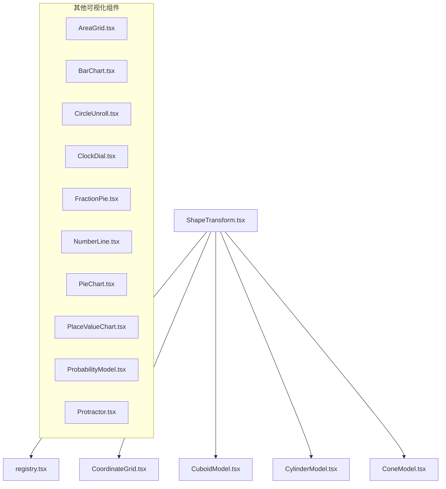
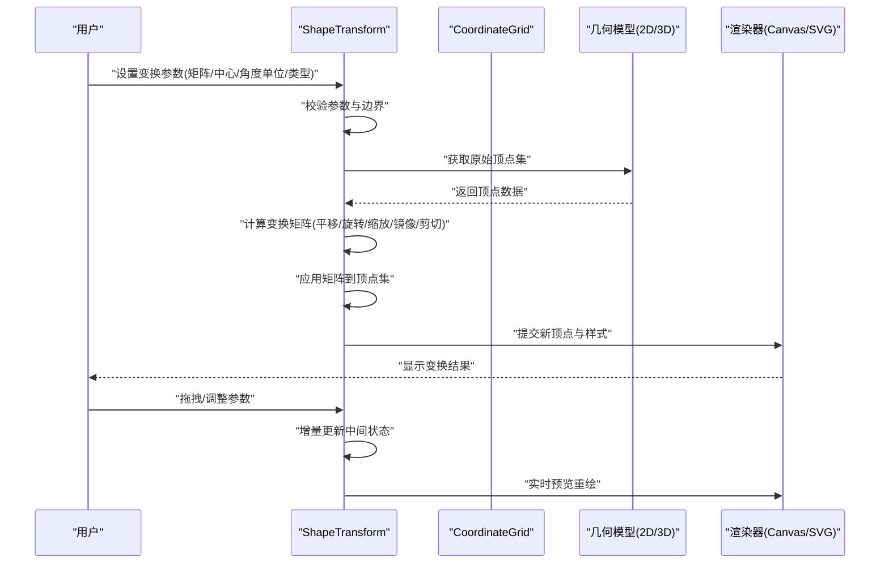
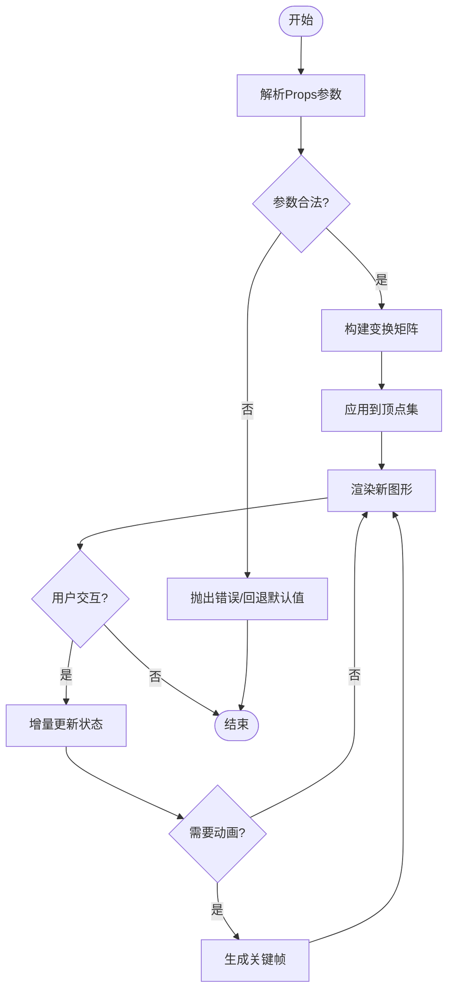
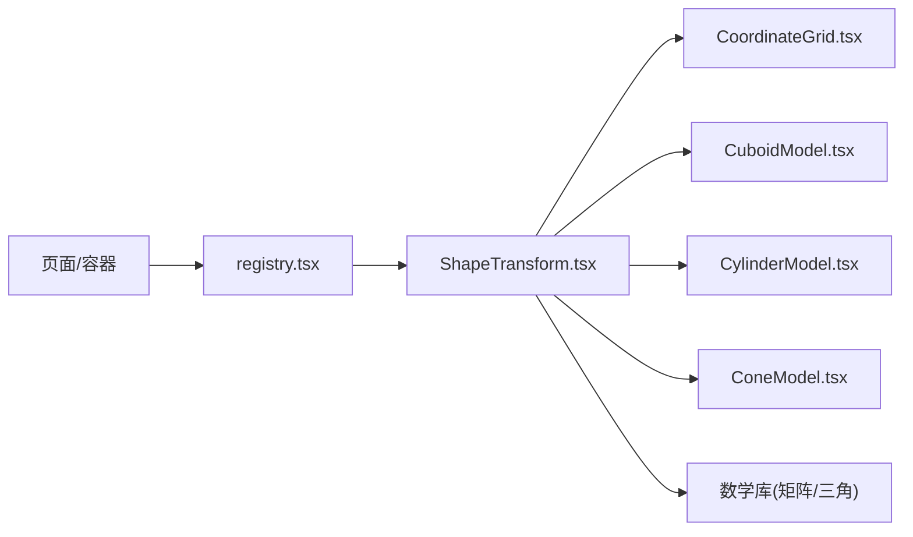

# 形状变换工具

<cite>
**本文引用的文件**   
- [ShapeTransform.tsx](file://src/visualizations/ShapeTransform.tsx)
- [registry.tsx](file://src/visualizations/registry.tsx)
- [CoordinateGrid.tsx](file://src/visualizations/CoordinateGrid.tsx)
- [CuboidModel.tsx](file://src/visualizations/CuboidModel.tsx)
- [CylinderModel.tsx](file://src/visualizations/CylinderModel.tsx)
- [ConeModel.tsx](file://src/visualizations/ConeModel.tsx)
- [AreaGrid.tsx](file://src/visualizations/AreaGrid.tsx)
- [BarChart.tsx](file://src/visualizations/BarChart.tsx)
- [CircleUnroll.tsx](file://src/visualizations/CircleUnroll.tsx)
- [ClockDial.tsx](file://src/visualizations/ClockDial.tsx)
- [FractionPie.tsx](file://src/visualizations/FractionPie.tsx)
- [NumberLine.tsx](file://src/visualizations/NumberLine.tsx)
- [PieChart.tsx](file://src/visualizations/PieChart.tsx)
- [PlaceValueChart.tsx](file://src/visualizations/PlaceValueChart.tsx)
- [ProbabilityModel.tsx](file://src/visualizations/ProbabilityModel.tsx)
- [Protractor.tsx](file://src/visualizations/Protractor.tsx)
</cite>

## 目录
1. [简介](#简介)
2. [项目结构](#项目结构)
3. [核心组件](#核心组件)
4. [架构总览](#架构总览)
5. [详细组件分析](#详细组件分析)
6. [依赖关系分析](#依赖关系分析)
7. [性能考虑](#性能考虑)
8. [故障排查指南](#故障排查指南)
9. [结论](#结论)
10. [附录](#附录)

## 简介
本技术文档围绕 ShapeTransform 形状变换工具组件，系统阐述二维与三维形状的几何变换算法、交互能力、动画效果与教学功能，并给出性能优化策略。该组件位于可视化模块中，用于对平面或立体图形进行平移、旋转、缩放、镜像与剪切等变换操作，支持用户拖拽、实时预览、历史管理与关键帧动画，并提供步骤分解与数学公式展示以辅助教学。

## 项目结构
ShapeTransform 属于 src/visualizations 下的可视化组件之一，通过 registry.tsx 统一注册并在页面中按需渲染。其依赖坐标网格与基础绘图能力，并与立方体、圆柱、圆锥等三维模型组件协同工作，形成从二维到三维的完整变换演示体系。

图表来源
- [ShapeTransform.tsx](file://src/visualizations/ShapeTransform.tsx)
- [registry.tsx](file://src/visualizations/registry.tsx)
- [CoordinateGrid.tsx](file://src/visualizations/CoordinateGrid.tsx)
- [CuboidModel.tsx](file://src/visualizations/CuboidModel.tsx)
- [CylinderModel.tsx](file://src/visualizations/CylinderModel.tsx)
- [ConeModel.tsx](file://src/visualizations/ConeModel.tsx)

章节来源
- [ShapeTransform.tsx](file://src/visualizations/ShapeTransform.tsx)
- [registry.tsx](file://src/visualizations/registry.tsx)

## 核心组件
- ShapeTransform：负责接收变换参数（矩阵、中心点、角度单位、类型），计算并绘制变换后的二维/三维图形，提供拖拽、预览、历史与动画控制。
- CoordinateGrid：提供坐标系与网格背景，作为变换可视化的基准画布。
- CuboidModel / CylinderModel / ConeModel：三维模型渲染器，配合 ShapeTransform 实现空间变换演示。
- registry.tsx：统一注册与导出可视化组件，供上层页面按需加载。

章节来源
- [ShapeTransform.tsx](file://src/visualizations/ShapeTransform.tsx)
- [CoordinateGrid.tsx](file://src/visualizations/CoordinateGrid.tsx)
- [CuboidModel.tsx](file://src/visualizations/CuboidModel.tsx)
- [CylinderModel.tsx](file://src/visualizations/CylinderModel.tsx)
- [ConeModel.tsx](file://src/visualizations/ConeModel.tsx)
- [registry.tsx](file://src/visualizations/registry.tsx)

## 架构总览
ShapeTransform 采用“参数驱动 + 渲染管线”的架构：外部传入变换参数后，内部按顺序执行平移、旋转、缩放、镜像、剪切等变换合成，得到最终变换矩阵；随后将原始顶点序列应用矩阵，输出新的顶点集交由 Canvas/SVG 渲染。交互层监听鼠标/触摸事件，更新中间状态并触发增量重绘；动画层基于时间函数插值生成关键帧，平滑过渡至目标变换。

图表来源
- [ShapeTransform.tsx](file://src/visualizations/ShapeTransform.tsx)
- [CoordinateGrid.tsx](file://src/visualizations/CoordinateGrid.tsx)

## 详细组件分析

### ShapeTransform 组件
- 职责
  - 解析 Props：变换矩阵、变换中心点、角度单位、变换类型、是否启用动画、历史记录开关等。
  - 几何计算：根据类型选择对应变换组合，生成复合变换矩阵。
  - 交互处理：拖拽移动、滚轮缩放、右键镜像、快捷键切换角度单位等。
  - 动画控制：平滑过渡、轨迹回放、关键帧录制与播放。
  - 教学展示：步骤分解、公式提示、结果验证（如面积/体积不变性检查）。
- 数据结构
  - 顶点集：二维为 (x, y)，三维为 (x, y, z)。
  - 变换矩阵：2D 使用 3x3 齐次矩阵，3D 使用 4x4 矩阵。
  - 历史栈：记录每次有效变换的参数快照，支持撤销/重做。
- 算法要点
  - 平移：T = [[1,0,tx],[0,1,ty],[0,0,1]]（2D）或 4x4 扩展。
  - 旋转：R = [[cosθ,-sinθ,0],[sinθ,cosθ,0],[0,0,1]]（2D），绕中心点先平移再旋转再逆平移。
  - 缩放：S = [[sx,0,0],[0,sy,0],[0,0,1]]（2D），相对中心点缩放需结合平移。
  - 镜像：关于 x/y 轴或任意直线对称，等价于特定旋转+反射矩阵。
  - 剪切：Sh = [[1,k,0],[k',1,0],[0,0,1]]（2D），保持面积但改变形状。
  - 复合矩阵：M = T_center * R * S * Sh * M_prev，注意乘法顺序。
- 交互流程
  - 拖拽：按下时记录起始位置，移动时计算位移向量，更新平移分量并重绘。
  - 滚轮：以光标为中心进行局部缩放，避免全局偏移。
  - 右键菜单：快速切换镜像轴或重置变换。
  - 键盘：方向键微调，空格暂停/播放动画。
- 动画机制
  - 时间函数：ease-in-out、linear、cubic-bezier 等。
  - 关键帧：记录起点与终点矩阵，逐帧插值得到中间矩阵。
  - 轨迹：保存每帧中心点与角度，回放时绘制路径。
- 教学功能
  - 步骤面板：逐步展示每个子变换的作用与结果。
  - 公式面板：显示当前使用的矩阵与角度单位（度/弧度）。
  - 验证：对比变换前后面积/体积误差阈值，提示数值稳定性。

图表来源
- [ShapeTransform.tsx](file://src/visualizations/ShapeTransform.tsx)

章节来源
- [ShapeTransform.tsx](file://src/visualizations/ShapeTransform.tsx)

### CoordinateGrid 组件
- 作用：提供坐标轴、刻度、网格线与原点标记，作为所有变换的参考系。
- 特性：可配置比例尺、网格密度、颜色主题；支持缩放与平移以保持对齐。
- 与 ShapeTransform 协作：在变换过程中动态更新网格标注，确保视觉一致性。

章节来源
- [CoordinateGrid.tsx](file://src/visualizations/CoordinateGrid.tsx)

### 三维模型组件（CuboidModel / CylinderModel / ConeModel）
- 作用：分别渲染立方体、圆柱、圆锥的线框与面片，支持在三维空间中应用变换矩阵。
- 与 ShapeTransform 协作：接收由 ShapeTransform 生成的 4x4 矩阵，对顶点进行变换后提交给 WebGL/Canvas 渲染。
- 教学价值：直观展示平移、旋转、缩放、镜像与剪切在三维中的效果差异。

章节来源
- [CuboidModel.tsx](file://src/visualizations/CuboidModel.tsx)
- [CylinderModel.tsx](file://src/visualizations/CylinderModel.tsx)
- [ConeModel.tsx](file://src/visualizations/ConeModel.tsx)

### 注册表（registry.tsx）
- 作用：集中管理可视化组件的元数据与渲染入口，便于页面按需加载与路由跳转。
- 与 ShapeTransform 协作：通过键名映射实例化 ShapeTransform，并注入默认 Props。

章节来源
- [registry.tsx](file://src/visualizations/registry.tsx)

## 依赖关系分析
ShapeTransform 依赖坐标网格与几何模型，并通过注册表被上层页面引用。其内部又依赖数学库进行矩阵运算与三角函数计算。

图表来源
- [registry.tsx](file://src/visualizations/registry.tsx)
- [ShapeTransform.tsx](file://src/visualizations/ShapeTransform.tsx)
- [CoordinateGrid.tsx](file://src/visualizations/CoordinateGrid.tsx)
- [CuboidModel.tsx](file://src/visualizations/CuboidModel.tsx)
- [CylinderModel.tsx](file://src/visualizations/CylinderModel.tsx)
- [ConeModel.tsx](file://src/visualizations/ConeModel.tsx)

章节来源
- [registry.tsx](file://src/visualizations/registry.tsx)
- [ShapeTransform.tsx](file://src/visualizations/ShapeTransform.tsx)

## 性能考虑
- 变换缓存：对相同输入参数缓存变换矩阵，避免重复计算。
- 增量更新：仅重绘受影响的顶点区域，减少全量渲染开销。
- 批处理：合并多次小变换为一次复合矩阵，降低调用次数。
- 动画节流：限制帧率或使用 requestAnimationFrame，避免主线程阻塞。
- 内存管理：及时释放历史栈中过期的快照，防止内存泄漏。
- 精度控制：使用双精度浮点数存储矩阵元素，必要时进行归一化。

[本节为通用指导，不直接分析具体文件]

## 故障排查指南
- 常见问题
  - 角度单位不一致：确认 Props 中角度单位与三角函数库一致（度/弧度）。
  - 变换中心点错误：确保中心点坐标与坐标系一致，避免偏移异常。
  - 矩阵奇异：缩放因子为零或负数导致退化，需校验并提示。
  - 动画卡顿：检查是否未启用节流或存在大量同步计算。
  - 历史栈溢出：限制最大长度，超出时丢弃最早条目。
- 调试建议
  - 打印中间矩阵与顶点变化，定位异常步骤。
  - 使用浏览器开发者工具的 Performance 面板分析帧耗时。
  - 开启网格与辅助线，观察对齐与比例是否正确。

章节来源
- [ShapeTransform.tsx](file://src/visualizations/ShapeTransform.tsx)

## 结论
ShapeTransform 组件通过清晰的参数接口与稳健的几何算法，实现了二维与三维形状的多种变换能力。结合交互、动画与教学功能，既满足工程需求，又具备良好的教育价值。通过缓存、增量更新与批处理等优化策略，可在复杂场景下保持流畅体验。

[本节为总结性内容，不直接分析具体文件]

## 附录
- 相关可视化组件列表（同目录下）
  - AreaGrid.tsx
  - BarChart.tsx
  - CircleUnroll.tsx
  - ClockDial.tsx
  - FractionPie.tsx
  - NumberLine.tsx
  - PieChart.tsx
  - PlaceValueChart.tsx
  - ProbabilityModel.tsx
  - Protractor.tsx

[本节为概览性内容，不直接分析具体文件]