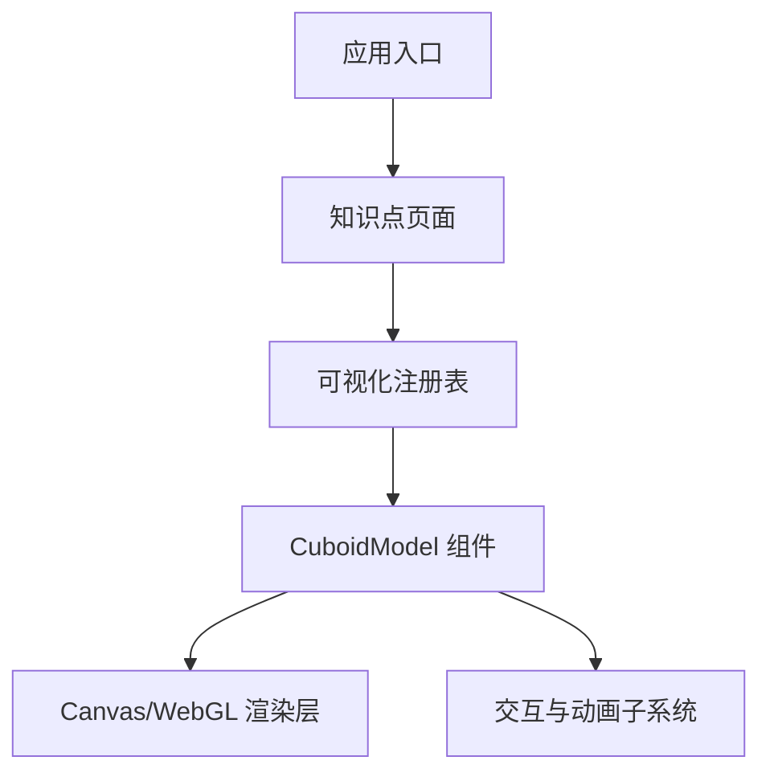
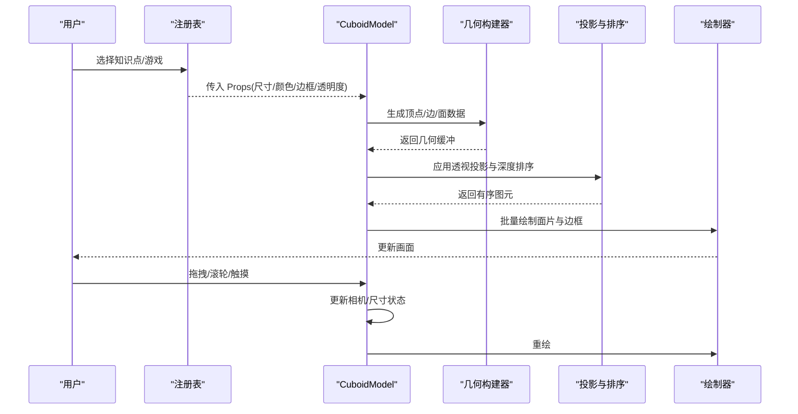
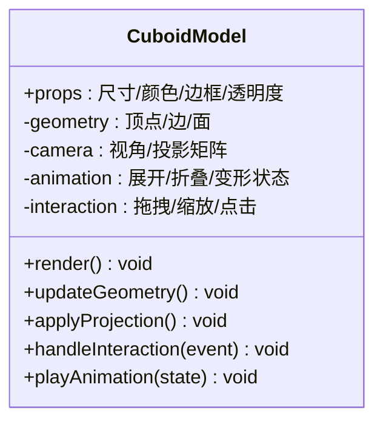
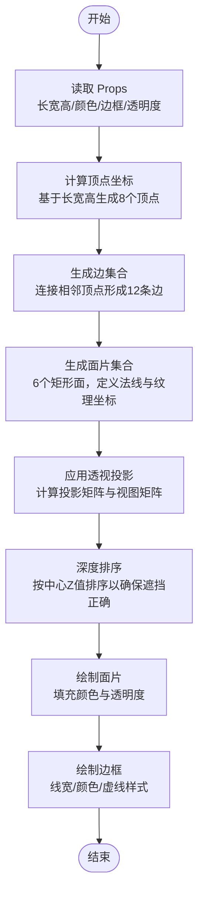
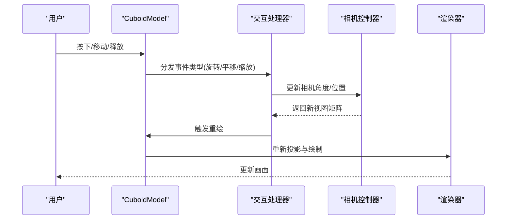
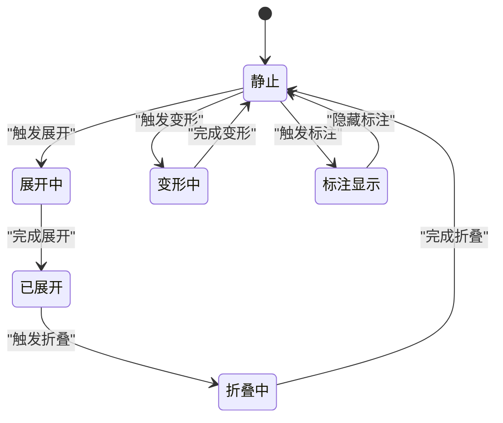
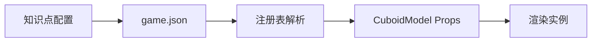
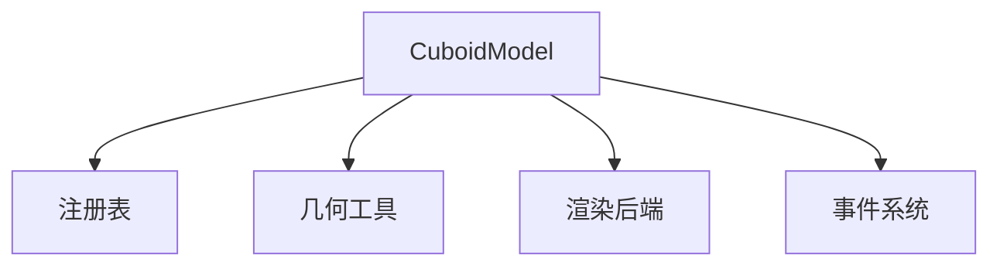

# 立方体模型

<cite>
**本文引用的文件**   
- [CuboidModel.tsx](file://src/visualizations/CuboidModel.tsx)
- [registry.tsx](file://src/visualizations/registry.tsx)
- [g5-cuboid-surface/game.json](file://src/content/knowledge-points/g5-cuboid-surface/game.json)
- [g5-cuboid-volume/game.json](file://src/content/knowledge-points/g5-cuboid-volume/game.json)
</cite>

## 目录
1. [简介](#简介)
2. [项目结构](#项目结构)
3. [核心组件](#核心组件)
4. [架构总览](#架构总览)
5. [详细组件分析](#详细组件分析)
6. [依赖分析](#依赖分析)
7. [性能考虑](#性能考虑)
8. [故障排查指南](#故障排查指南)
9. [结论](#结论)
10. [附录](#附录)

## 简介
本技术文档围绕 CuboidModel 立方体模型组件，系统阐述其在三维场景中的渲染实现与交互能力。内容涵盖：
- 三维几何构建：顶点坐标计算、面片绘制、透视投影与深度排序
- Props 接口：尺寸（长宽高）、颜色配置、边框样式、透明度等参数说明
- 用户交互：拖拽旋转、视角切换、尺寸调整
- 动画效果：展开折叠、变形变换、测量标注
- 性能优化：几何缓存、渲染优化策略
- 兼容性与移动端适配：浏览器差异处理与触摸事件支持

## 项目结构
CuboidModel 位于可视化组件目录中，并通过注册表对外暴露，供知识点的游戏或演示页面使用。其调用路径通常由知识点配置驱动，在运行时动态加载并渲染。

图表来源 
- [registry.tsx:1-200](file://src/visualizations/registry.tsx#L1-L200)
- [CuboidModel.tsx:1-200](file://src/visualizations/CuboidModel.tsx#L1-L200)

章节来源
- [registry.tsx:1-200](file://src/visualizations/registry.tsx#L1-L200)
- [CuboidModel.tsx:1-200](file://src/visualizations/CuboidModel.tsx#L1-L200)

## 核心组件
CuboidModel 负责将三维立方体以可交互的方式渲染到画布上，并提供丰富的外观与行为控制能力。其核心职责包括：
- 接收 Props 并生成几何数据（顶点、边、面）
- 执行透视投影与深度排序，确保正确遮挡关系
- 响应鼠标/触摸事件以实现旋转、缩放与尺寸调整
- 驱动动画序列（展开/折叠、变形、标注显示）
- 输出渲染结果至 Canvas/WebGL

章节来源
- [CuboidModel.tsx:1-200](file://src/visualizations/CuboidModel.tsx#L1-L200)

## 架构总览
下图展示了 CuboidModel 的渲染管线与交互流程，从输入参数到最终像素输出的关键步骤。

图表来源 
- [CuboidModel.tsx:1-200](file://src/visualizations/CuboidModel.tsx#L1-L200)
- [registry.tsx:1-200](file://src/visualizations/registry.tsx#L1-L200)

## 详细组件分析

### 组件类与方法概览
CuboidModel 作为 React 组件，通过 props 驱动渲染状态，内部维护几何、相机、动画与交互状态。

图表来源 
- [CuboidModel.tsx:1-200](file://src/visualizations/CuboidModel.tsx#L1-L200)

章节来源
- [CuboidModel.tsx:1-200](file://src/visualizations/CuboidModel.tsx#L1-L200)

### 三维几何构建与渲染流程
该流程描述了从尺寸参数到最终绘制的关键步骤，包括顶点坐标计算、面片生成、透视投影与深度排序。

图表来源 
- [CuboidModel.tsx:1-200](file://src/visualizations/CuboidModel.tsx#L1-L200)

章节来源
- [CuboidModel.tsx:1-200](file://src/visualizations/CuboidModel.tsx#L1-L200)

### 用户交互：拖拽旋转、视角切换与尺寸调整
交互逻辑通过监听鼠标与触摸事件，更新相机角度与立方体尺寸，保持渲染一致性。

图表来源 
- [CuboidModel.tsx:1-200](file://src/visualizations/CuboidModel.tsx#L1-L200)

章节来源
- [CuboidModel.tsx:1-200](file://src/visualizations/CuboidModel.tsx#L1-L200)

### 动画效果：展开折叠、变形变换与测量标注
动画模块管理状态机与时间插值，驱动几何与视觉属性的平滑过渡。

图表来源 
- [CuboidModel.tsx:1-200](file://src/visualizations/CuboidModel.tsx#L1-L200)

章节来源
- [CuboidModel.tsx:1-200](file://src/visualizations/CuboidModel.tsx#L1-L200)

### Props 接口详解
CuboidModel 的 Props 用于控制立方体的外观与行为，常见字段如下：
- 尺寸：长、宽、高（数值型，单位通常为像素或相对单位）
- 颜色：面片填充色、边框颜色、选中高亮色
- 边框：线宽、线型（实线/虚线）、端点样式
- 透明度：整体不透明度、面片半透明效果
- 交互：是否允许旋转、缩放、拖拽开关
- 动画：展开/折叠速度、变形曲线、标注延迟
- 材质：纹理映射开关、光照模式（若启用）

章节来源
- [CuboidModel.tsx:1-200](file://src/visualizations/CuboidModel.tsx#L1-L200)

### 与知识点配置的集成
CuboidModel 通过注册表被知识点页面引用，配置文件指定初始尺寸、颜色主题与交互行为。

图表来源 
- [g5-cuboid-surface/game.json:1-200](file://src/content/knowledge-points/g5-cuboid-surface/game.json#L1-L200)
- [g5-cuboid-volume/game.json:1-200](file://src/content/knowledge-points/g5-cuboid-volume/game.json#L1-L200)
- [registry.tsx:1-200](file://src/visualizations/registry.tsx#L1-L200)

章节来源
- [g5-cuboid-surface/game.json:1-200](file://src/content/knowledge-points/g5-cuboid-surface/game.json#L1-L200)
- [g5-cuboid-volume/game.json:1-200](file://src/content/knowledge-points/g5-cuboid-volume/game.json#L1-L200)
- [registry.tsx:1-200](file://src/visualizations/registry.tsx#L1-L200)

## 依赖分析
CuboidModel 的依赖关系主要包括：
- 注册表：提供组件发现与实例化
- 几何库：用于向量运算与矩阵变换（如存在）
- 渲染后端：Canvas 2D 或 WebGL
- 事件系统：鼠标与触摸事件捕获与分发

图表来源 
- [registry.tsx:1-200](file://src/visualizations/registry.tsx#L1-L200)
- [CuboidModel.tsx:1-200](file://src/visualizations/CuboidModel.tsx#L1-L200)

章节来源
- [registry.tsx:1-200](file://src/visualizations/registry.tsx#L1-L200)
- [CuboidModel.tsx:1-200](file://src/visualizations/CuboidModel.tsx#L1-L200)

## 性能考虑
为提升 CuboidModel 的渲染效率与交互流畅度，建议采用以下优化策略：
- 几何缓存：将顶点、边、面数据缓存在内存中，避免重复计算
- 增量更新：仅重绘受交互影响的区域或对象
- 批处理绘制：合并相同材质的绘制调用，减少状态切换
- 视锥剔除：忽略不在视野内的面片
- 低精度模式：在移动端降低采样率或简化几何
- 动画节流：限制动画帧率或使用 requestAnimationFrame 优化

[本节为通用性能建议，无需特定文件来源]

## 故障排查指南
常见问题与解决方法：
- 渲染错位：检查透视投影矩阵与视图矩阵是否正确初始化
- 遮挡错误：确认深度排序算法是否按 Z 值降序排列
- 交互失效：验证事件监听器绑定与触摸兼容性
- 动画卡顿：检查动画循环是否阻塞主线程，考虑分帧更新
- 颜色异常：确认颜色空间与透明度混合模式设置

章节来源
- [CuboidModel.tsx:1-200](file://src/visualizations/CuboidModel.tsx#L1-L200)

## 结论
CuboidModel 是一个功能完整的三维立方体渲染组件，支持丰富的外观定制与交互操作。通过合理的几何构建、投影与排序机制，以及高效的动画与事件处理，能够在多种设备上提供流畅的用户体验。结合性能优化与兼容性处理，可进一步提升其在教育可视化场景中的适用性。

[本节为总结性内容，无需特定文件来源]

## 附录
- 相关知识点示例：长方体表面积、体积计算
- 扩展方向：多立方体组合、纹理贴图、光照模型

[本节为补充信息，无需特定文件来源]