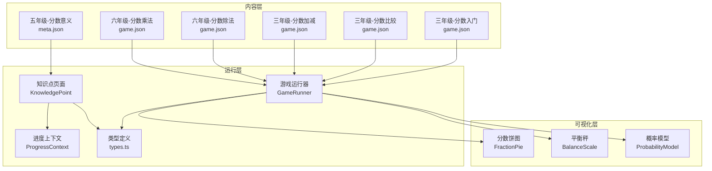
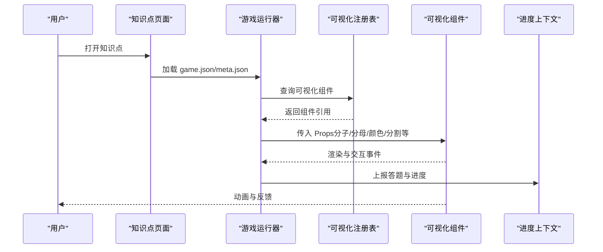
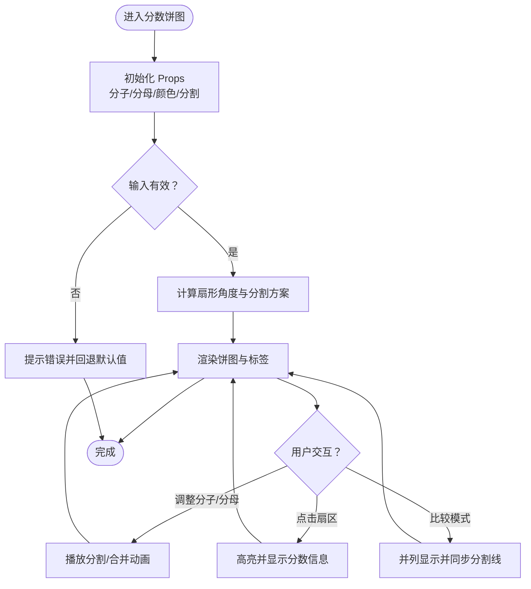
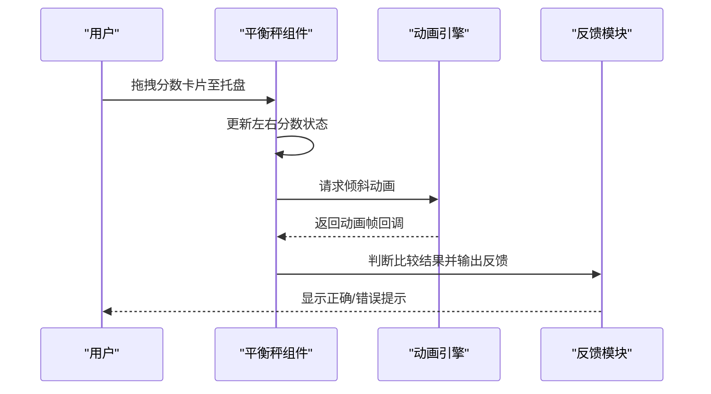
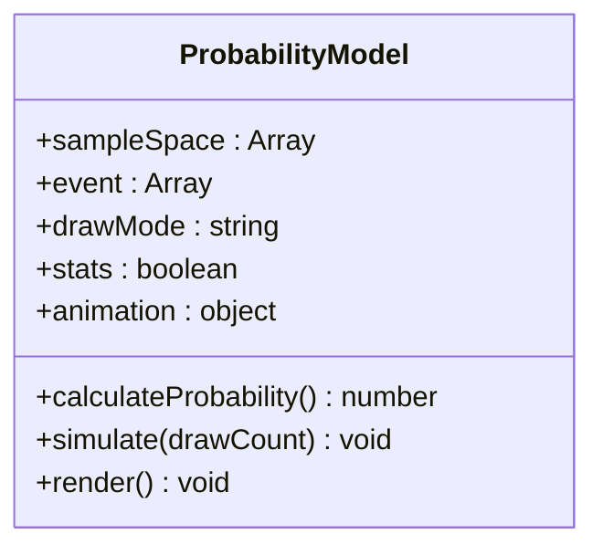
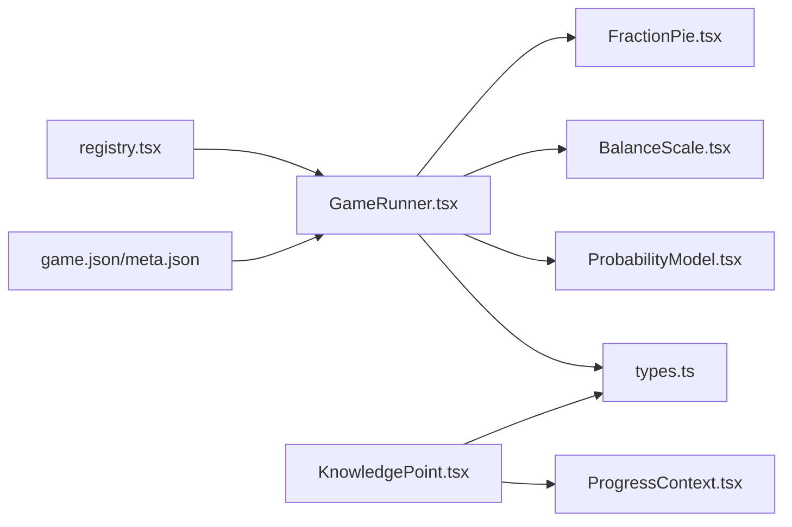

# 分数可视化工具

<cite>
**本文档引用的文件**   
- [FractionPie.tsx](file://src/visualizations/FractionPie.tsx)
- [BalanceScale.tsx](file://src/visualizations/BalanceScale.tsx)
- [ProbabilityModel.tsx](file://src/visualizations/ProbabilityModel.tsx)
- [registry.tsx](file://src/visualizations/registry.tsx)
- [g3-fraction-intro/game.json](file://src/content/knowledge-points/g3-fraction-intro/game.json)
- [g3-fraction-compare/game.json](file://src/content/knowledge-points/g3-fraction-compare/game.json)
- [g3-fraction-add-sub/game.json](file://src/content/knowledge-points/g3-fraction-add-sub/game.json)
- [g5-fraction-meaning/meta.json](file://src/content/knowledge-points/g5-fraction-meaning/meta.json)
- [g6-fraction-div/game.json](file://src/content/knowledge-points/g6-fraction-div/game.json)
- [g6-fraction-mult/game.json](file://src/content/knowledge-points/g6-fraction-mult/game.json)
- [GameRunner.tsx](file://src/components/GameRunner.tsx)
- [KnowledgePoint.tsx](file://src/components/KnowledgePoint.tsx)
- [ProgressContext.tsx](file://src/context/ProgressContext.tsx)
- [types.ts](file://src/lib/types.ts)
</cite>

## 目录
1. [简介](#简介)
2. [项目结构](#项目结构)
3. [核心组件](#核心组件)
4. [架构总览](#架构总览)
5. [详细组件分析](#详细组件分析)
6. [依赖关系分析](#依赖关系分析)
7. [性能考量](#性能考量)
8. [故障排查指南](#故障排查指南)
9. [结论](#结论)
10. [附录](#附录)

## 简介
本技术文档围绕 math-k6 的“分数可视化工具”展开，聚焦三大教学可视化：分数饼图、平衡秤与概率模型。文档从系统架构、组件接口（Props）、数据流、交互流程、动画实现、教学辅助（步骤引导、错误分析、学习反馈）以及数学正确性与教育有效性等方面进行全面说明，帮助开发者快速理解并扩展分数可视化能力。

## 项目结构
- 可视化组件位于 src/visualizations，包含 FractionPie、BalanceScale、ProbabilityModel 等。
- 知识内容与游戏配置位于 src/content/knowledge-points，按年级与知识点组织，如 g3-fraction-intro、g3-fraction-compare、g3-fraction-add-sub、g5-fraction-meaning、g6-fraction-div、g6-fraction-mult。
- 运行时通过 GameRunner 与 KnowledgePoint 加载并渲染对应可视化与游戏。
- 进度与学习状态由 ProgressContext 管理。
- 类型定义集中在 lib/types.ts。

**图表来源** 
- [FractionPie.tsx](file://src/visualizations/FractionPie.tsx)
- [BalanceScale.tsx](file://src/visualizations/BalanceScale.tsx)
- [ProbabilityModel.tsx](file://src/visualizations/ProbabilityModel.tsx)
- [g3-fraction-intro/game.json](file://src/content/knowledge-points/g3-fraction-intro/game.json)
- [g3-fraction-compare/game.json](file://src/content/knowledge-points/g3-fraction-compare/game.json)
- [g3-fraction-add-sub/game.json](file://src/content/knowledge-points/g3-fraction-add-sub/game.json)
- [g5-fraction-meaning/meta.json](file://src/content/knowledge-points/g5-fraction-meaning/meta.json)
- [g6-fraction-div/game.json](file://src/content/knowledge-points/g6-fraction-div/game.json)
- [g6-fraction-mult/game.json](file://src/content/knowledge-points/g6-fraction-mult/game.json)
- [GameRunner.tsx](file://src/components/GameRunner.tsx)
- [KnowledgePoint.tsx](file://src/components/KnowledgePoint.tsx)
- [ProgressContext.tsx](file://src/context/ProgressContext.tsx)
- [types.ts](file://src/lib/types.ts)

**章节来源**
- [GameRunner.tsx](file://src/components/GameRunner.tsx)
- [KnowledgePoint.tsx](file://src/components/KnowledgePoint.tsx)
- [ProgressContext.tsx](file://src/context/ProgressContext.tsx)
- [types.ts](file://src/lib/types.ts)

## 核心组件
- 分数饼图（FractionPie）：以圆形分割展示分子/分母关系，支持颜色编码、比例标注、动态分割与合并动画。
- 平衡秤（BalanceScale）：以左右托盘重量对比直观呈现分数大小比较与等价关系，支持拖拽与动画倾斜。
- 概率模型（ProbabilityModel）：以样本空间与事件集合演示概率与分数的联系，支持事件选择、计数统计与结果可视化。

上述组件通过 registry.tsx 注册，供 GameRunner 与知识点页面按需加载。

**章节来源**
- [FractionPie.tsx](file://src/visualizations/FractionPie.tsx)
- [BalanceScale.tsx](file://src/visualizations/BalanceScale.tsx)
- [ProbabilityModel.tsx](file://src/visualizations/ProbabilityModel.tsx)
- [registry.tsx](file://src/visualizations/registry.tsx)

## 架构总览
整体采用“内容驱动 + 可视化渲染 + 运行控制”的分层架构：
- 内容层：各知识点的 game.json/meta.json 描述题目、参数、校验规则与教学提示。
- 运行层：GameRunner 解析配置，实例化对应可视化组件；KnowledgePoint 负责页面级编排与进度上报。
- 可视化层：FractionPie、BalanceScale、ProbabilityModel 提供可复用的教学图形与交互。
- 状态与类型：ProgressContext 维护学习进度；types.ts 统一数据结构。

**图表来源** 
- [GameRunner.tsx](file://src/components/GameRunner.tsx)
- [KnowledgePoint.tsx](file://src/components/KnowledgePoint.tsx)
- [registry.tsx](file://src/visualizations/registry.tsx)
- [ProgressContext.tsx](file://src/context/ProgressContext.tsx)

## 详细组件分析

### 分数饼图（FractionPie）
- 教学目标：用圆形面积直观表达分数，支持分割、着色、比例标注与动画过渡。
- 关键 Props（建议）：
  - numerator/denominator：分子与分母，用于计算扇形角度与分割数量。
  - segments：自定义分割段数或分段区间，覆盖默认均分逻辑。
  - colors：每段颜色映射，支持主题切换与无障碍对比度。
  - showLabels：是否显示数值标签与百分比。
  - animation：分割/合并/转换动画时长与缓动函数。
  - accessibility：ARIA 标签与键盘导航支持。
- 交互功能：
  - 点击扇区高亮并显示分数值。
  - 拖拽调整分子/分母，实时重绘与动画。
  - 比较模式：并列两个饼图，自动对齐分割线，便于比较大小。
- 动画效果：
  - 分割动画：将整圆逐步切分为 n 等份。
  - 合并动画：多块扇区平滑合并为更大扇区。
  - 转换动画：在等价分数之间进行形态变换（如 1/2 ↔ 2/4）。
- 教学辅助：
  - 步骤引导：分步展示“分母决定分割数 → 分子决定着色块数”。
  - 错误分析：当输入无效（如分母为 0、分子大于分母）时给出提示。
  - 学习反馈：根据操作路径生成鼓励性提示与概念巩固建议。
- 数学正确性验证：
  - 角度计算基于 360° × (分子/分母)。
  - 等价分数判定使用最大公约数简化后比较。
- 性能考虑：
  - 使用 requestAnimationFrame 保证动画流畅。
  - 对大量扇区进行批处理绘制，避免频繁重排。

**图表来源** 
- [FractionPie.tsx](file://src/visualizations/FractionPie.tsx)

**章节来源**
- [FractionPie.tsx](file://src/visualizations/FractionPie.tsx)
- [g3-fraction-intro/game.json](file://src/content/knowledge-points/g3-fraction-intro/game.json)
- [g3-fraction-compare/game.json](file://src/content/knowledge-points/g3-fraction-compare/game.json)

### 平衡秤（BalanceScale）
- 教学目标：通过左右托盘的重量对比，帮助学生理解分数大小比较与等价关系。
- 关键 Props（建议）：
  - left/right：左右侧的分数对象（含分子/分母与可选权重值）。
  - draggable：是否允许拖拽砝码或分数卡片。
  - tiltAnimation：倾斜动画参数（幅度、时长、阻尼）。
  - labels：托盘标签与单位说明。
  - feedback：正确/错误反馈文案与音效开关。
- 交互功能：
  - 拖拽分数卡片到托盘，实时更新平衡状态。
  - 点击“比较”按钮触发动画倾斜，显示比较结果。
  - 支持等价分数识别：当两侧数值相等时保持水平。
- 动画效果：
  - 倾斜动画：根据差值计算角度，模拟物理平衡。
  - 落点动画：拖拽释放时的吸附与弹性效果。
- 教学辅助：
  - 步骤引导：先放置左侧，再放置右侧，最后进行比较。
  - 错误分析：若学生误判大小，给出“通分/小数化”策略提示。
  - 学习反馈：记录尝试次数与正确率，生成个性化建议。
- 数学正确性验证：
  - 比较逻辑基于通分后的分子比较或浮点数近似比较（带容差）。
  - 等价判定使用简化分数或误差阈值。
- 性能考虑：
  - 使用 CSS transform 与 GPU 加速提升动画性能。
  - 防抖拖拽事件，减少不必要的重绘。

**图表来源** 
- [BalanceScale.tsx](file://src/visualizations/BalanceScale.tsx)

**章节来源**
- [BalanceScale.tsx](file://src/visualizations/BalanceScale.tsx)
- [g3-fraction-compare/game.json](file://src/content/knowledge-points/g3-fraction-compare/game.json)

### 概率模型（ProbabilityModel）
- 教学目标：将概率与分数建立联系，通过样本空间与事件集合演示概率计算。
- 关键 Props（建议）：
  - sampleSpace：样本空间元素列表（如球的颜色、数字等）。
  - event：目标事件集合（子集），用于计算概率。
  - drawMode：抽取模式（有放回/无放回）。
  - stats：是否显示计数、频率与理论概率。
  - animation：抽取与统计动画。
- 交互功能：
  - 点击选择事件元素，实时计算概率并可视化。
  - 模拟多次抽取，观察频率收敛趋势。
  - 支持条件概率与独立事件的简单演示。
- 动画效果：
  - 抽取动画：元素随机移动与高亮。
  - 统计动画：柱状图或饼图随抽取次数更新。
- 教学辅助：
  - 步骤引导：明确样本空间 → 定义事件 → 计算概率 → 验证频率。
  - 错误分析：当学生混淆“事件数/总数”时给出纠正提示。
  - 学习反馈：根据抽取次数与偏差生成学习建议。
- 数学正确性验证：
  - 概率 = 事件数 / 样本空间大小（离散均匀分布）。
  - 非均匀分布需加权计算。
- 性能考虑：
  - 抽样过程使用惰性计算与缓存。
  - 统计更新采用增量计算，避免全量重算。

**图表来源** 
- [ProbabilityModel.tsx](file://src/visualizations/ProbabilityModel.tsx)

**章节来源**
- [ProbabilityModel.tsx](file://src/visualizations/ProbabilityModel.tsx)
- [g5-fraction-meaning/meta.json](file://src/content/knowledge-points/g5-fraction-meaning/meta.json)

## 依赖关系分析
- 组件注册：registry.tsx 集中管理可视化组件的键名与引用，供 GameRunner 动态加载。
- 内容驱动：各知识点的 game.json/meta.json 定义题目、参数、校验与提示，驱动可视化行为。
- 运行控制：GameRunner 解析配置，组装 Props，调用组件渲染与交互。
- 状态管理：ProgressContext 统一维护学习进度与成就，供页面与组件读取。
- 类型约束：types.ts 定义分数对象、游戏配置、进度结构等，确保类型安全。

**图表来源** 
- [registry.tsx](file://src/visualizations/registry.tsx)
- [GameRunner.tsx](file://src/components/GameRunner.tsx)
- [KnowledgePoint.tsx](file://src/components/KnowledgePoint.tsx)
- [ProgressContext.tsx](file://src/context/ProgressContext.tsx)
- [types.ts](file://src/lib/types.ts)

**章节来源**
- [registry.tsx](file://src/visualizations/registry.tsx)
- [GameRunner.tsx](file://src/components/GameRunner.tsx)
- [KnowledgePoint.tsx](file://src/components/KnowledgePoint.tsx)
- [ProgressContext.tsx](file://src/context/ProgressContext.tsx)
- [types.ts](file://src/lib/types.ts)

## 性能考量
- 动画优化：优先使用 CSS transform 与 requestAnimationFrame，避免阻塞主线程。
- 渲染优化：对复杂图形进行离屏渲染与缓存，减少重绘范围。
- 事件节流：拖拽与高频交互使用节流/防抖，降低事件处理开销。
- 内存管理：及时清理定时器与监听器，避免内存泄漏。
- 可访问性：确保颜色对比度与键盘导航，提升包容性体验。

[本节为通用指导，不直接分析具体文件]

## 故障排查指南
- 常见问题：
  - 分母为 0 或分子大于分母：检查输入校验逻辑，提供友好提示与回退值。
  - 动画卡顿：确认是否频繁触发重排，改用 transform 与批量更新。
  - 颜色不可见：检查对比度与色盲友好配色。
  - 概率计算异常：确认样本空间与事件集合定义是否正确，检查抽取模式。
- 调试建议：
  - 启用日志输出，记录关键状态变化。
  - 使用浏览器开发者工具的性能面板定位瓶颈。
  - 编写单元测试覆盖边界情况（如等价分数、极端概率）。

**章节来源**
- [types.ts](file://src/lib/types.ts)
- [ProgressContext.tsx](file://src/context/ProgressContext.tsx)

## 结论
分数可视化工具通过分数饼图、平衡秤与概率模型三大组件，将抽象的分数概念转化为直观的视觉与交互体验。其内容驱动架构、清晰的 Props 接口、丰富的动画与教学辅助功能，既保证了数学正确性，也提升了教育有效性。建议在后续迭代中继续完善无障碍支持、性能优化与更多题型覆盖，以满足更广泛的教学场景。

[本节为总结性内容，不直接分析具体文件]

## 附录
- 相关知识点配置示例：
  - 三年级-分数入门：g3-fraction-intro/game.json
  - 三年级-分数比较：g3-fraction-compare/game.json
  - 三年级-分数加减：g3-fraction-add-sub/game.json
  - 五年级-分数意义：g5-fraction-meaning/meta.json
  - 六年级-分数除法：g6-fraction-div/game.json
  - 六年级-分数乘法：g6-fraction-mult/game.json

[本节为参考信息，不直接分析具体文件]