# 可视化工具库

<cite>
**本文引用的文件**   
- [registry.tsx](file://src/visualizations/registry.tsx)
- [CuboidModel.tsx](file://src/visualizations/CuboidModel.tsx)
- [CylinderModel.tsx](file://src/visualizations/CylinderModel.tsx)
- [ConeModel.tsx](file://src/visualizations/ConeModel.tsx)
- [BarChart.tsx](file://src/visualizations/BarChart.tsx)
- [PieChart.tsx](file://src/visualizations/PieChart.tsx)
- [Protractor.tsx](file://src/visualizations/Protractor.tsx)
- [ClockDial.tsx](file://src/visualizations/ClockDial.tsx)
- [NumberLine.tsx](file://src/visualizations/NumberLine.tsx)
- [FractionPie.tsx](file://src/visualizations/FractionPie.tsx)
- [AreaGrid.tsx](file://src/visualizations/AreaGrid.tsx)
- [BalanceScale.tsx](file://src/visualizations/BalanceScale.tsx)
- [CircleUnroll.tsx](file://src/visualizations/CircleUnroll.tsx)
- [CoordinateGrid.tsx](file://src/visualizations/CoordinateGrid.tsx)
- [PlaceValueChart.tsx](file://src/visualizations/PlaceValueChart.tsx)
- [ProbabilityModel.tsx](file://src/visualizations/ProbabilityModel.tsx)
- [ShapeTransform.tsx](file://src/visualizations/ShapeTransform.tsx)
- [App.tsx](file://src/App.tsx)
- [main.tsx](file://src/main.tsx)
- [index.css](file://src/index.css)
- [package.json](file://package.json)
</cite>

## 目录
1. [简介](#简介)
2. [项目结构](#项目结构)
3. [核心组件](#核心组件)
4. [架构总览](#架构总览)
5. [详细组件分析](#详细组件分析)
6. [依赖关系分析](#依赖关系分析)
7. [性能考量](#性能考量)
8. [故障排查指南](#故障排查指南)
9. [结论](#结论)
10. [附录](#附录)

## 简介
本技术文档面向 math-k6 可视化工具库，系统性阐述其架构设计、工具注册机制与动态创建流程，并深入解析几何模型（立方体、圆柱体、圆锥体）、图表工具（柱状图、饼图）、数学工具（量角器、时钟、数轴）和分数表示器的实现细节。文档同时提供自定义可视化工具的开发指南，涵盖从组件开发到注册的完整流程，并给出动画实现、用户交互处理与响应式设计的实践示例。

## 项目结构
仓库采用基于功能模块的组织方式：
- src/visualizations：所有可视化工具组件与注册中心
- src/components：业务组件（如游戏运行器、知识点展示等）
- src/pages：页面路由与内容组织
- src/lib：通用工具与类型定义
- src/context：全局状态上下文
- public、index.html、package.json、vite.config.ts：构建与资源管理

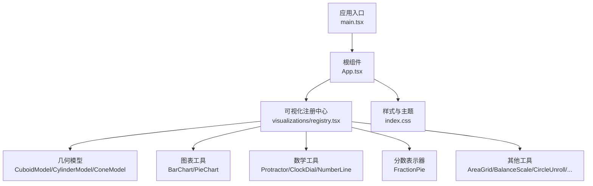

**图示来源**
- [main.tsx](file://src/main.tsx)
- [App.tsx](file://src/App.tsx)
- [registry.tsx](file://src/visualizations/registry.tsx)
- [CuboidModel.tsx](file://src/visualizations/CuboidModel.tsx)
- [CylinderModel.tsx](file://src/visualizations/CylinderModel.tsx)
- [ConeModel.tsx](file://src/visualizations/ConeModel.tsx)
- [BarChart.tsx](file://src/visualizations/BarChart.tsx)
- [PieChart.tsx](file://src/visualizations/PieChart.tsx)
- [Protractor.tsx](file://src/visualizations/Protractor.tsx)
- [ClockDial.tsx](file://src/visualizations/ClockDial.tsx)
- [NumberLine.tsx](file://src/visualizations/NumberLine.tsx)
- [FractionPie.tsx](file://src/visualizations/FractionPie.tsx)
- [AreaGrid.tsx](file://src/visualizations/AreaGrid.tsx)
- [BalanceScale.tsx](file://src/visualizations/BalanceScale.tsx)
- [CircleUnroll.tsx](file://src/visualizations/CircleUnroll.tsx)
- [CoordinateGrid.tsx](file://src/visualizations/CoordinateGrid.tsx)
- [PlaceValueChart.tsx](file://src/visualizations/PlaceValueChart.tsx)
- [ProbabilityModel.tsx](file://src/visualizations/ProbabilityModel.tsx)
- [ShapeTransform.tsx](file://src/visualizations/ShapeTransform.tsx)
- [index.css](file://src/index.css)

**章节来源**
- [package.json](file://package.json)
- [index.css](file://src/index.css)

## 核心组件
- 注册中心（registry.tsx）
  - 职责：维护可视化工具的命名空间与工厂函数，提供按名称动态创建实例的能力；集中导出工具元数据与渲染入口。
  - 关键能力：
    - 工具注册：以键值对形式注册组件与配置描述
    - 动态创建：根据名称解析并返回可渲染元素或组件实例
    - 统一接口：对外暴露一致的初始化与更新方法，便于上层调用
- 基础样式与主题（index.css）
  - 职责：为各工具提供统一的尺寸、颜色、排版与响应式断点
  - 关键点：容器宽度自适应、网格布局、深色/浅色模式变量

**章节来源**
- [registry.tsx](file://src/visualizations/registry.tsx)
- [index.css](file://src/index.css)

## 架构总览
整体架构遵循“注册中心 + 工具组件”的模式：
- 应用层通过注册中心获取工具实例，传入 Props 进行渲染
- 工具组件内部封装各自的数据结构与交互逻辑
- 样式由全局 CSS 统一管理，确保一致性与可维护性

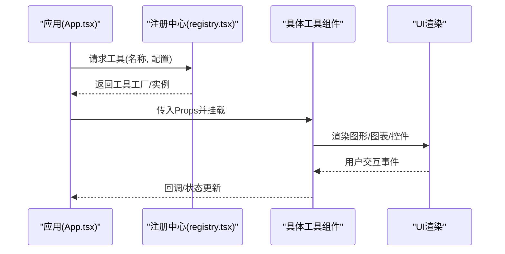

**图示来源**
- [App.tsx](file://src/App.tsx)
- [registry.tsx](file://src/visualizations/registry.tsx)
- [BarChart.tsx](file://src/visualizations/BarChart.tsx)
- [PieChart.tsx](file://src/visualizations/PieChart.tsx)
- [CuboidModel.tsx](file://src/visualizations/CuboidModel.tsx)

## 详细组件分析

### 几何模型：立方体（CuboidModel）
- 用途：三维立方体的可视化与交互，支持旋转、缩放、标注边长与体积计算提示
- Props 要点：
  - 尺寸参数：长、宽、高
  - 视图控制：初始角度、是否允许拖拽旋转
  - 样式：填充色、边框粗细、透明度
  - 交互：点击面高亮、悬停提示
- 动画与交互：
  - 使用过渡动画平滑切换视角
  - 鼠标/触摸事件驱动旋转与缩放
- 响应式：
  - 容器宽高自适应，保持比例不变

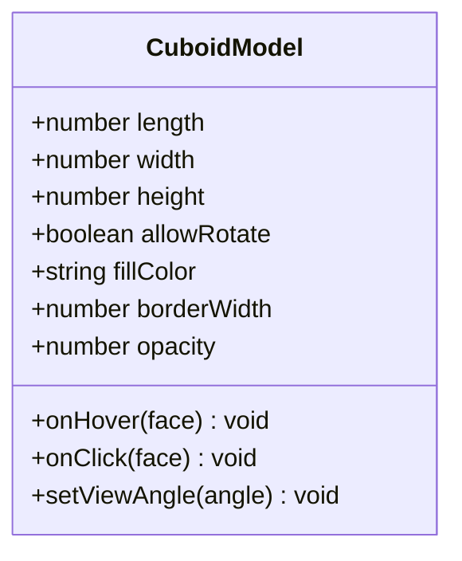

**图示来源**
- [CuboidModel.tsx](file://src/visualizations/CuboidModel.tsx)

**章节来源**
- [CuboidModel.tsx](file://src/visualizations/CuboidModel.tsx)

### 几何模型：圆柱体（CylinderModel）
- 用途：展示圆柱体的展开与立体视图，支持侧面积与体积演示
- Props 要点：
  - 半径、高度
  - 是否显示展开图
  - 颜色与线条样式
- 动画与交互：
  - 展开/收起动画
  - 拖动改变半径或高度实时重绘
- 响应式：
  - 自动适配不同屏幕尺寸，保持图形比例

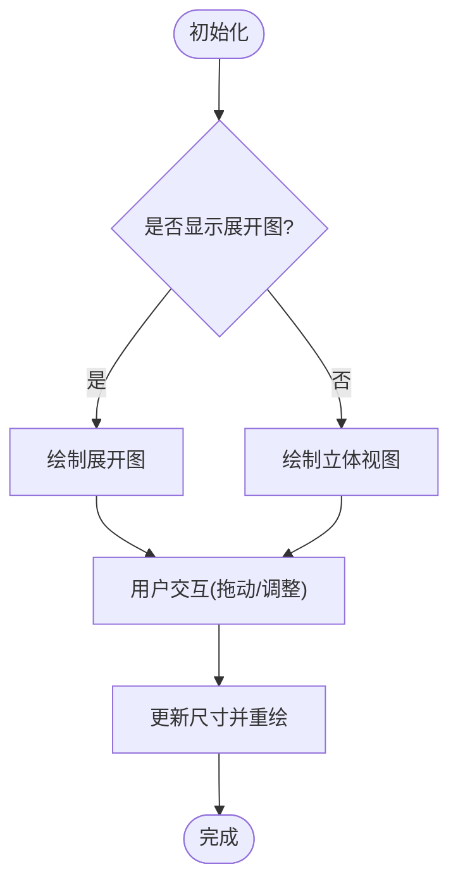

**图示来源**
- [CylinderModel.tsx](file://src/visualizations/CylinderModel.tsx)

**章节来源**
- [CylinderModel.tsx](file://src/visualizations/CylinderModel.tsx)

### 几何模型：圆锥体（ConeModel）
- 用途：圆锥体的立体与展开图展示，辅助理解表面积与体积
- Props 要点：
  - 底面半径、母线长度
  - 是否显示展开扇形
  - 颜色与线型
- 动画与交互：
  - 展开扇形的角度动画
  - 鼠标滚轮缩放
- 响应式：
  - 按比例缩放，保证清晰度

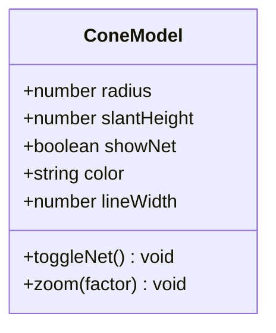

**图示来源**
- [ConeModel.tsx](file://src/visualizations/ConeModel.tsx)

**章节来源**
- [ConeModel.tsx](file://src/visualizations/ConeModel.tsx)

### 图表工具：柱状图（BarChart）
- 用途：数据对比与趋势展示，支持多系列、分组与排序
- Props 要点：
  - 数据数组：标签、数值、颜色
  - 坐标轴：刻度、单位、范围
  - 交互：悬停提示、点击筛选
  - 动画：入场动画时长与缓动
- 响应式：
  - 横轴标签自适应换行，柱宽随容器变化

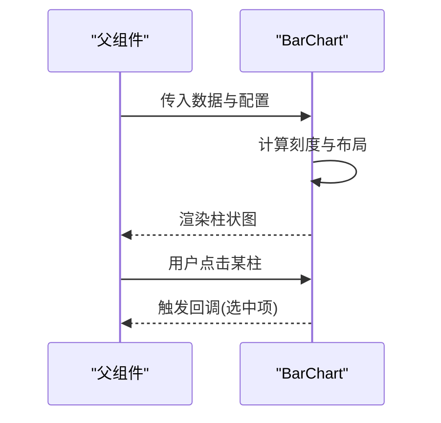

**图示来源**
- [BarChart.tsx](file://src/visualizations/BarChart.tsx)

**章节来源**
- [BarChart.tsx](file://src/visualizations/BarChart.tsx)

### 图表工具：饼图（PieChart）
- 用途：占比分析与分类统计，支持环形图与百分比标注
- Props 要点：
  - 数据项：名称、数值、颜色
  - 显示选项：是否显示百分比、内环半径
  - 交互：悬停放大、点击选中
- 动画与交互：
  - 扇形入场动画
  - 拖拽旋转视角
- 响应式：
  - 自动调整半径与字体大小

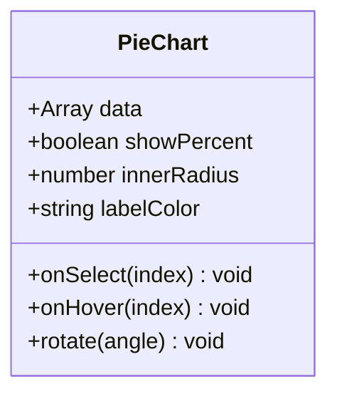

**图示来源**
- [PieChart.tsx](file://src/visualizations/PieChart.tsx)

**章节来源**
- [PieChart.tsx](file://src/visualizations/PieChart.tsx)

### 数学工具：量角器（Protractor）
- 用途：角度测量与绘制，支持度数输入与圆弧选择
- Props 要点：
  - 当前角度、最小/最大范围
  - 刻度精度、颜色主题
  - 是否允许自由绘制
- 交互行为：
  - 拖拽端点调整角度
  - 键盘输入精确度数
- 动画：
  - 角度变化时的弧线动画

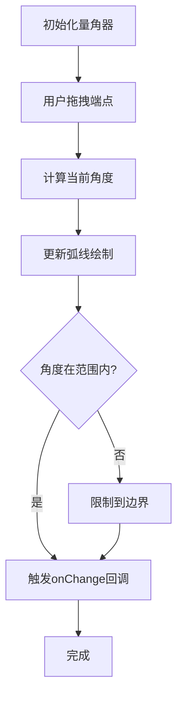

**图示来源**
- [Protractor.tsx](file://src/visualizations/Protractor.tsx)

**章节来源**
- [Protractor.tsx](file://src/visualizations/Protractor.tsx)

### 数学工具：时钟（ClockDial）
- 用途：时间可视化，支持时针、分针、秒针动画与数字显示
- Props 要点：
  - 时间对象：时、分、秒
  - 是否显示秒针、数字刻度
  - 主题颜色与指针样式
- 动画与交互：
  - 指针平滑转动
  - 点击设置时间
- 响应式：
  - 表盘半径自适应

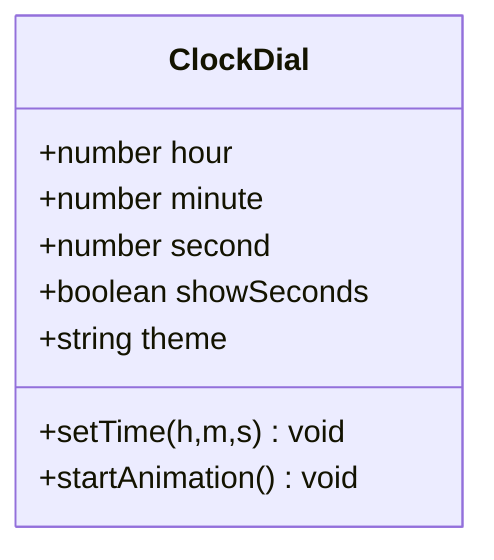

**图示来源**
- [ClockDial.tsx](file://src/visualizations/ClockDial.tsx)

**章节来源**
- [ClockDial.tsx](file://src/visualizations/ClockDial.tsx)

### 数学工具：数轴（NumberLine）
- 用途：整数与小数在数轴上的定位与区间表示
- Props 要点：
  - 范围：最小值、最大值、步长
  - 标记点：位置、标签、颜色
  - 交互：点击定位、拖拽区间
- 动画与交互：
  - 标记点移动动画
  - 区间选择高亮
- 响应式：
  - 刻度密度随宽度调整

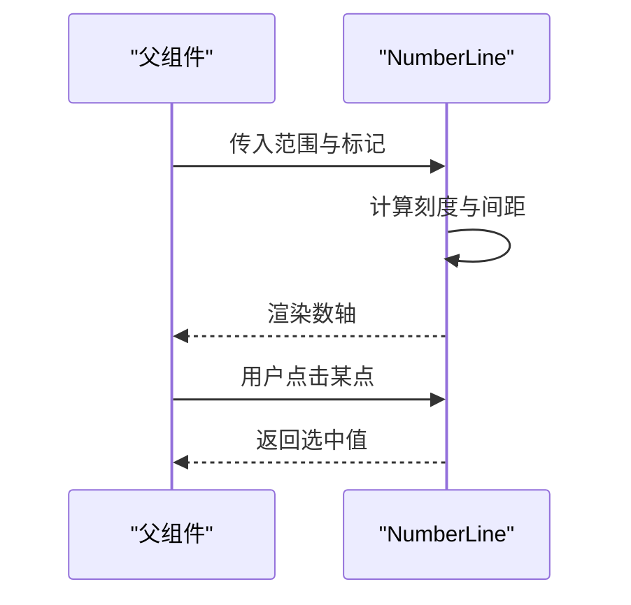

**图示来源**
- [NumberLine.tsx](file://src/visualizations/NumberLine.tsx)

**章节来源**
- [NumberLine.tsx](file://src/visualizations/NumberLine.tsx)

### 分数表示器（FractionPie）
- 用途：直观展示分数概念，支持分子分母编辑与图形化分割
- Props 要点：
  - 分子、分母
  - 颜色方案、是否显示百分比
  - 交互：滑块调整分子/分母
- 动画与交互：
  - 扇形数量变化动画
  - 悬停显示分数值
- 响应式：
  - 自动调整扇形大小与字体

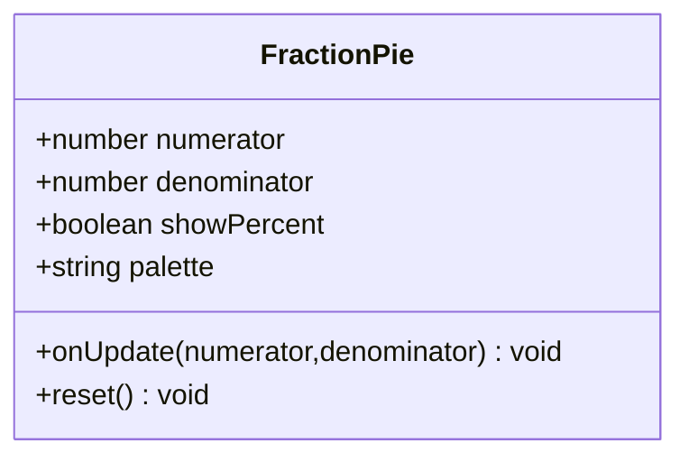

**图示来源**
- [FractionPie.tsx](file://src/visualizations/FractionPie.tsx)

**章节来源**
- [FractionPie.tsx](file://src/visualizations/FractionPie.tsx)

### 其他工具概览
- AreaGrid：面积网格，用于面积概念教学
- BalanceScale：天平模型，用于等量关系与方程直观演示
- CircleUnroll：圆展开，辅助理解周长与面积推导
- CoordinateGrid：坐标系网格，支持点、线、区域绘制
- PlaceValueChart：位值表，帮助理解十进制位值
- ProbabilityModel：概率模型，模拟随机事件与频率分布
- ShapeTransform：形状变换，演示平移、旋转、缩放

这些工具均遵循统一的注册与渲染接口，具备一致的交互与动画风格。

**章节来源**
- [AreaGrid.tsx](file://src/visualizations/AreaGrid.tsx)
- [BalanceScale.tsx](file://src/visualizations/BalanceScale.tsx)
- [CircleUnroll.tsx](file://src/visualizations/CircleUnroll.tsx)
- [CoordinateGrid.tsx](file://src/visualizations/CoordinateGrid.tsx)
- [PlaceValueChart.tsx](file://src/visualizations/PlaceValueChart.tsx)
- [ProbabilityModel.tsx](file://src/visualizations/ProbabilityModel.tsx)
- [ShapeTransform.tsx](file://src/visualizations/ShapeTransform.tsx)

## 依赖关系分析
- 组件耦合度低：每个工具组件独立封装数据与交互，仅通过注册中心与父组件通信
- 外部依赖：主要依赖 React 生态与样式系统，无重型第三方库
- 循环依赖：未发现循环导入，注册中心作为唯一聚合点

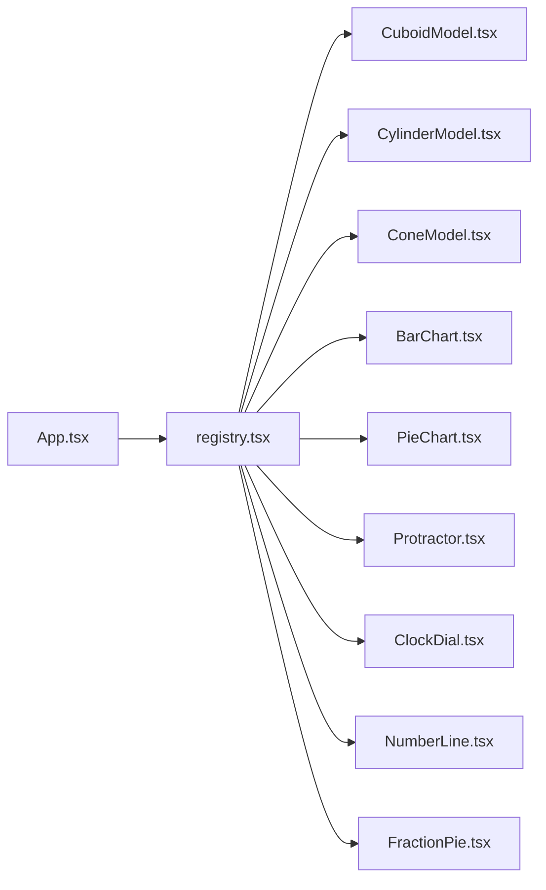

**图示来源**
- [registry.tsx](file://src/visualizations/registry.tsx)
- [App.tsx](file://src/App.tsx)
- [CuboidModel.tsx](file://src/visualizations/CuboidModel.tsx)
- [CylinderModel.tsx](file://src/visualizations/CylinderModel.tsx)
- [ConeModel.tsx](file://src/visualizations/ConeModel.tsx)
- [BarChart.tsx](file://src/visualizations/BarChart.tsx)
- [PieChart.tsx](file://src/visualizations/PieChart.tsx)
- [Protractor.tsx](file://src/visualizations/Protractor.tsx)
- [ClockDial.tsx](file://src/visualizations/ClockDial.tsx)
- [NumberLine.tsx](file://src/visualizations/NumberLine.tsx)
- [FractionPie.tsx](file://src/visualizations/FractionPie.tsx)

**章节来源**
- [registry.tsx](file://src/visualizations/registry.tsx)
- [App.tsx](file://src/App.tsx)

## 性能考量
- 渲染优化：
  - 按需加载：仅在需要时挂载对应工具组件
  - 增量更新：Props 变化时仅重绘必要部分
- 动画性能：
  - 使用 requestAnimationFrame 或 CSS 过渡减少重排
  - 避免频繁创建销毁动画对象
- 内存管理：
  - 及时清理事件监听与定时器
  - 大数据集分页或虚拟化渲染（适用于大量标记点）
- 响应式：
  - 使用 CSS 媒体查询与弹性布局，避免 JS 计算过多尺寸

[本节为通用指导，不直接分析具体文件]

## 故障排查指南
- 工具未渲染：
  - 检查注册中心是否正确注册该工具名称
  - 确认传入 Props 是否符合接口定义
- 动画卡顿：
  - 降低动画帧率或简化路径计算
  - 避免在主线程执行复杂运算
- 交互失效：
  - 验证事件绑定是否被覆盖或阻止冒泡
  - 检查容器尺寸是否为 0 导致事件无法触发
- 样式异常：
  - 确认 index.css 已正确引入
  - 检查主题变量是否被覆盖

[本节为通用指导，不直接分析具体文件]

## 结论
math-k6 可视化工具库通过清晰的注册中心与模块化组件设计，实现了高扩展性与一致性体验。几何模型、图表工具与数学工具均提供丰富的 Props 与交互能力，满足教学场景的多样化需求。开发者可依据本文档快速集成与扩展新工具，并通过统一的动画与响应式策略保障用户体验。

[本节为总结性内容，不直接分析具体文件]

## 附录

### 自定义可视化工具开发指南
- 步骤一：创建组件文件
  - 在 src/visualizations 下新建组件文件，定义 Props 接口与渲染逻辑
- 步骤二：实现交互与动画
  - 使用事件处理器捕获用户操作
  - 通过状态更新驱动视图变化，必要时加入过渡动画
- 步骤三：注册工具
  - 在 registry.tsx 中新增工具条目，包含名称、工厂函数与默认配置
- 步骤四：在应用中动态创建
  - 通过注册中心的 API 按名称获取工具实例并传入 Props
- 最佳实践：
  - 保持 Props 简洁明确，避免过度耦合
  - 使用 CSS 变量管理主题，便于切换与扩展
  - 编写单元测试覆盖关键交互路径

[本节为通用指导，不直接分析具体文件]

### 动画实现示例
- 使用 CSS 过渡实现平滑变化
- 使用 requestAnimationFrame 实现高精度动画
- 避免在渲染循环中进行 DOM 操作

[本节为通用指导，不直接分析具体文件]

### 用户交互处理示例
- 统一事件封装：将鼠标与触摸事件抽象为统一接口
- 防抖与节流：对高频事件进行优化
- 无障碍支持：提供键盘导航与屏幕阅读器兼容

[本节为通用指导，不直接分析具体文件]

### 响应式设计示例
- 使用 flexbox/grid 布局适应不同屏幕
- 媒体查询调整字体与间距
- 动态计算尺寸时考虑 DPR 与设备像素比

[本节为通用指导，不直接分析具体文件]