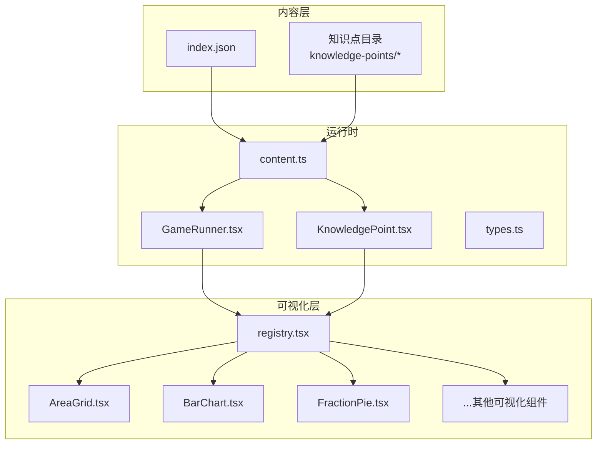
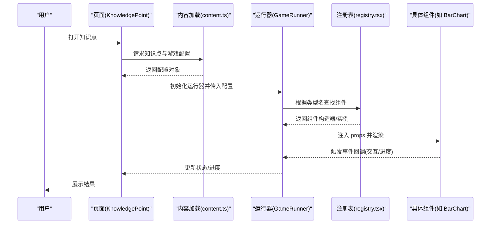
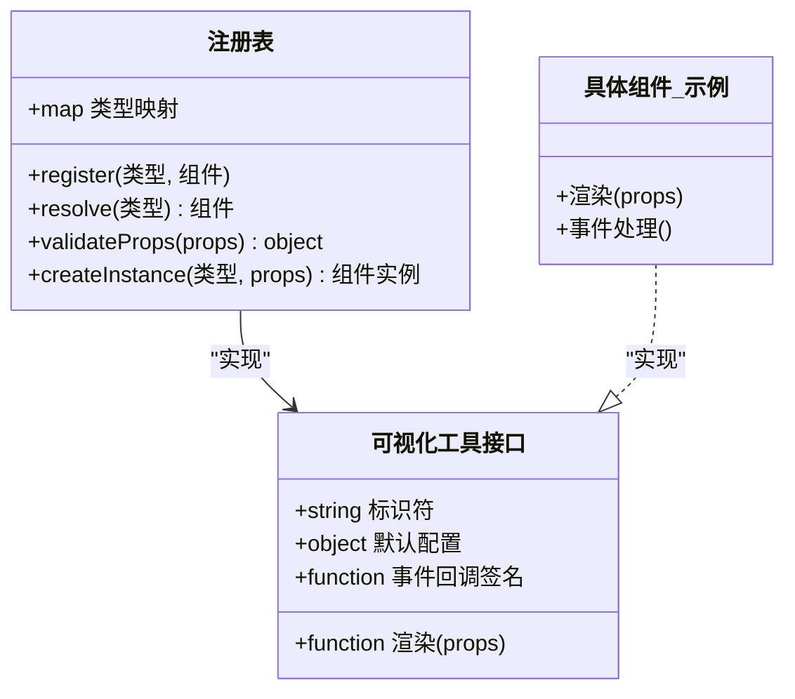
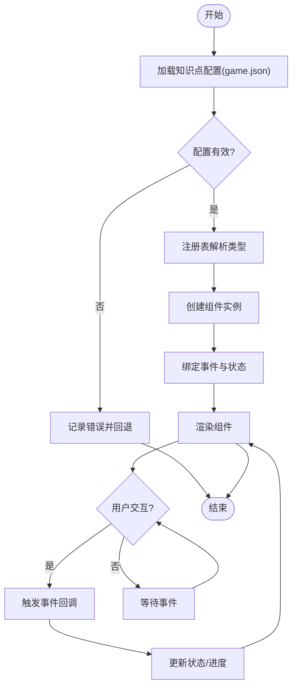
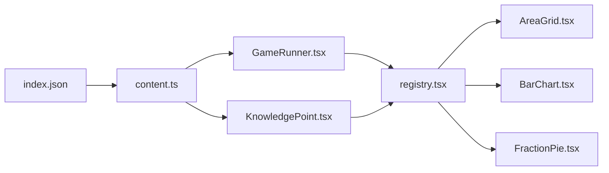

# 可视化工具架构设计

<cite>
**本文引用的文件**   
- [registry.tsx](file://src/visualizations/registry.tsx)
- [AreaGrid.tsx](file://src/visualizations/AreaGrid.tsx)
- [BalanceScale.tsx](file://src/visualizations/BalanceScale.tsx)
- [BarChart.tsx](file://src/visualizations/BarChart.tsx)
- [CircleUnroll.tsx](file://src/visualizations/CircleUnroll.tsx)
- [ClockDial.tsx](file://src/visualizations/ClockDial.tsx)
- [ConeModel.tsx](file://src/visualizations/ConeModel.tsx)
- [CoordinateGrid.tsx](file://src/visualizations/CoordinateGrid.tsx)
- [CuboidModel.tsx](file://src/visualizations/CuboidModel.tsx)
- [CylinderModel.tsx](file://src/visualizations/CylinderModel.tsx)
- [FractionPie.tsx](file://src/visualizations/FractionPie.tsx)
- [NumberLine.tsx](file://src/visualizations/NumberLine.tsx)
- [PieChart.tsx](file://src/visualizations/PieChart.tsx)
- [PlaceValueChart.tsx](file://src/visualizations/PlaceValueChart.tsx)
- [ProbabilityModel.tsx](file://src/visualizations/ProbabilityModel.tsx)
- [Protractor.tsx](file://src/visualizations/Protractor.tsx)
- [ShapeTransform.tsx](file://src/visualizations/ShapeTransform.tsx)
- [GameRunner.tsx](file://src/components/GameRunner.tsx)
- [KnowledgePoint.tsx](file://src/components/KnowledgePoint.tsx)
- [content.ts](file://src/lib/content.ts)
- [types.ts](file://src/lib/types.ts)
- [index.json](file://src/content/index.json)
</cite>

## 目录
1. [简介](#简介)
2. [项目结构](#项目结构)
3. [核心组件](#核心组件)
4. [架构总览](#架构总览)
5. [详细组件分析](#详细组件分析)
6. [依赖关系分析](#依赖关系分析)
7. [性能考量](#性能考量)
8. [故障排查指南](#故障排查指南)
9. [结论](#结论)
10. [附录：扩展新工具类型指南](#附录扩展新工具类型指南)

## 简介
本技术文档围绕 math-k6 的可视化工具架构展开，重点阐述工具注册机制、动态创建流程与组件生命周期管理。文档将深入解析 registry.tsx 中的统一接口定义、配置与参数传递模式，并给出从“注册到渲染”的完整数据流图与架构图。同时提供扩展新工具类型的最佳实践，帮助开发者快速接入新的可视化能力。

## 项目结构
- 可视化组件位于 src/visualizations，每个组件实现统一的可视化工具接口，并通过 registry.tsx 进行集中注册。
- 运行时通过 GameRunner.tsx 和 KnowledgePoint.tsx 根据知识点内容加载对应的 game.json 配置，动态实例化并渲染相应可视化工具。
- 内容与类型定义集中在 src/lib/content.ts 与 src/lib/types.ts，index.json 作为内容索引入口。



**图表来源** 
- [index.json](file://src/content/index.json)
- [content.ts](file://src/lib/content.ts)
- [types.ts](file://src/lib/types.ts)
- [GameRunner.tsx](file://src/components/GameRunner.tsx)
- [KnowledgePoint.tsx](file://src/components/KnowledgePoint.tsx)
- [registry.tsx](file://src/visualizations/registry.tsx)
- [AreaGrid.tsx](file://src/visualizations/AreaGrid.tsx)
- [BarChart.tsx](file://src/visualizations/BarChart.tsx)
- [FractionPie.tsx](file://src/visualizations/FractionPie.tsx)

**章节来源**
- [index.json](file://src/content/index.json)
- [content.ts](file://src/lib/content.ts)
- [types.ts](file://src/lib/types.ts)
- [GameRunner.tsx](file://src/components/GameRunner.tsx)
- [KnowledgePoint.tsx](file://src/components/KnowledgePoint.tsx)
- [registry.tsx](file://src/visualizations/registry.tsx)

## 核心组件
- 统一接口与注册表（registry.tsx）
  - 定义可视化工具的统一接口，包括标识符、渲染函数、默认配置、事件回调等。
  - 维护一个注册表映射，支持按名称或类型动态查找并实例化具体组件。
  - 提供参数校验与默认值合并逻辑，确保外部传入的配置安全可用。
- 运行时容器（GameRunner.tsx / KnowledgePoint.tsx）
  - 负责读取知识点配置（game.json），解析所需可视化工具类型与参数。
  - 调用注册表获取对应组件，完成状态绑定、事件监听与渲染。
- 内容加载器（content.ts / types.ts）
  - 提供内容索引与类型定义，保证配置结构与运行时类型一致。
  - 暴露统一的加载 API，供页面与组件按需获取知识点与游戏配置。

**章节来源**
- [registry.tsx](file://src/visualizations/registry.tsx)
- [GameRunner.tsx](file://src/components/GameRunner.tsx)
- [KnowledgePoint.tsx](file://src/components/KnowledgePoint.tsx)
- [content.ts](file://src/lib/content.ts)
- [types.ts](file://src/lib/types.ts)

## 架构总览
整体架构遵循“配置驱动 + 注册表分发 + 组件渲染”的模式：
- 配置驱动：知识点目录下的 game.json 描述可视化工具类型与参数。
- 注册表分发：registry.tsx 维护工具类型到组件实现的映射，并提供工厂方法。
- 组件渲染：运行时根据配置动态创建组件实例，挂载事件与状态更新。



**图表来源**
- [KnowledgePoint.tsx](file://src/components/KnowledgePoint.tsx)
- [content.ts](file://src/lib/content.ts)
- [GameRunner.tsx](file://src/components/GameRunner.tsx)
- [registry.tsx](file://src/visualizations/registry.tsx)
- [BarChart.tsx](file://src/visualizations/BarChart.tsx)

## 详细组件分析

### 注册表与统一接口（registry.tsx）
- 统一接口要点
  - 标识字段：用于在注册表中唯一识别工具类型。
  - 渲染函数：接收标准化后的 props，返回可渲染元素。
  - 默认配置：为可选参数提供默认值，降低外部配置复杂度。
  - 事件回调：定义交互事件的签名，便于上层统一处理。
- 注册机制
  - 提供注册 API，将“类型名 -> 组件实现”建立映射。
  - 支持覆盖与版本控制，避免重复注册冲突。
- 参数传递与校验
  - 对输入参数进行必要校验（类型、范围、必填项）。
  - 合并默认配置与用户配置，生成最终 props。
- 错误处理
  - 未找到类型时抛出明确错误信息。
  - 参数不合法时回退到默认配置或拒绝渲染。



**图表来源**
- [registry.tsx](file://src/visualizations/registry.tsx)

**章节来源**
- [registry.tsx](file://src/visualizations/registry.tsx)

### 运行时容器（GameRunner.tsx / KnowledgePoint.tsx）
- 职责分工
  - KnowledgePoint.tsx：负责知识点页面的布局与上下文，协调内容加载与运行器。
  - GameRunner.tsx：负责根据配置动态创建可视化工具，管理状态与事件。
- 动态创建流程
  - 解析 game.json 中的 type 与 params。
  - 调用注册表 resolve/create 获取组件实例。
  - 注入 props（包含主题、尺寸、语言等上下文）。
  - 绑定事件回调，将交互结果上报给上层。
- 生命周期管理
  - 初始化阶段：校验配置、合并默认值、准备资源。
  - 渲染阶段：根据 props 渲染 UI，响应状态变化。
  - 销毁阶段：清理事件监听、释放资源。



**图表来源**
- [GameRunner.tsx](file://src/components/GameRunner.tsx)
- [KnowledgePoint.tsx](file://src/components/KnowledgePoint.tsx)
- [content.ts](file://src/lib/content.ts)

**章节来源**
- [GameRunner.tsx](file://src/components/GameRunner.tsx)
- [KnowledgePoint.tsx](file://src/components/KnowledgePoint.tsx)
- [content.ts](file://src/lib/content.ts)

### 典型可视化组件（以 BarChart.tsx 为例）
- 组件职责
  - 接收标准化后的 props（数据、样式、交互开关）。
  - 根据数据计算布局与绘制图形。
  - 处理用户交互（点击、悬停）并触发回调。
- 状态与事件
  - 内部状态：选中项、高亮项、动画状态。
  - 事件：onSelect、onHover、onReset 等，由运行器统一处理。
- 性能优化
  - 使用 memoization 避免不必要的重渲染。
  - 大数据集采用分页或虚拟滚动策略。

```mermaid
classDiagram
class BarChart {
+props : { data, style, interactions }
+state : { selected, hovered, animating }
+render()
+handleSelect(item)
+handleHover(item)
+reset()
}
class 运行器 {
+bindEvents(component)
+updateState(newState)
}
BarChart --> 运行器 : "触发事件"
```

**图表来源**
- [BarChart.tsx](file://src/visualizations/BarChart.tsx)
- [GameRunner.tsx](file://src/components/GameRunner.tsx)

**章节来源**
- [BarChart.tsx](file://src/visualizations/BarChart.tsx)
- [GameRunner.tsx](file://src/components/GameRunner.tsx)

### 其他可视化组件概览
- AreaGrid.tsx：面积网格模型，适合分数与比例教学。
- BalanceScale.tsx：天平模型，用于等式与平衡概念演示。
- CircleUnroll.tsx：圆展开模型，辅助理解周长与面积。
- ClockDial.tsx：时钟表盘，时间概念可视化。
- ConeModel.tsx / CuboidModel.tsx / CylinderModel.tsx：立体几何模型。
- CoordinateGrid.tsx：坐标网格，函数与点线面关系演示。
- FractionPie.tsx：分数饼图，直观展示分数组成。
- NumberLine.tsx：数轴模型，整数与小数位置关系。
- PieChart.tsx：饼图，占比与分布展示。
- PlaceValueChart.tsx：位值表，数位概念可视化。
- ProbabilityModel.tsx：概率模型，随机事件模拟。
- Protractor.tsx：量角器，角度测量演示。
- ShapeTransform.tsx：图形变换，平移旋转缩放。

这些组件均遵循统一接口并通过注册表动态实例化，确保一致的扩展与维护体验。

**章节来源**
- [AreaGrid.tsx](file://src/visualizations/AreaGrid.tsx)
- [BalanceScale.tsx](file://src/visualizations/BalanceScale.tsx)
- [CircleUnroll.tsx](file://src/visualizations/CircleUnroll.tsx)
- [ClockDial.tsx](file://src/visualizations/ClockDial.tsx)
- [ConeModel.tsx](file://src/visualizations/ConeModel.tsx)
- [CoordinateGrid.tsx](file://src/visualizations/CoordinateGrid.tsx)
- [CuboidModel.tsx](file://src/visualizations/CuboidModel.tsx)
- [CylinderModel.tsx](file://src/visualizations/CylinderModel.tsx)
- [FractionPie.tsx](file://src/visualizations/FractionPie.tsx)
- [NumberLine.tsx](file://src/visualizations/NumberLine.tsx)
- [PieChart.tsx](file://src/visualizations/PieChart.tsx)
- [PlaceValueChart.tsx](file://src/visualizations/PlaceValueChart.tsx)
- [ProbabilityModel.tsx](file://src/visualizations/ProbabilityModel.tsx)
- [Protractor.tsx](file://src/visualizations/Protractor.tsx)
- [ShapeTransform.tsx](file://src/visualizations/ShapeTransform.tsx)

## 依赖关系分析
- 内容层依赖
  - index.json 提供知识点索引，content.ts 负责解析与缓存。
  - types.ts 定义配置与运行时类型，确保一致性。
- 运行时依赖
  - GameRunner.tsx 与 KnowledgePoint.tsx 依赖 content.ts 提供的加载 API。
  - 两者共同依赖 registry.tsx 进行组件动态解析与实例化。
- 组件层依赖
  - 各可视化组件仅依赖统一接口与通用工具函数，保持低耦合。



**图表来源**
- [index.json](file://src/content/index.json)
- [content.ts](file://src/lib/content.ts)
- [GameRunner.tsx](file://src/components/GameRunner.tsx)
- [KnowledgePoint.tsx](file://src/components/KnowledgePoint.tsx)
- [registry.tsx](file://src/visualizations/registry.tsx)
- [AreaGrid.tsx](file://src/visualizations/AreaGrid.tsx)
- [BarChart.tsx](file://src/visualizations/BarChart.tsx)
- [FractionPie.tsx](file://src/visualizations/FractionPie.tsx)

**章节来源**
- [index.json](file://src/content/index.json)
- [content.ts](file://src/lib/content.ts)
- [GameRunner.tsx](file://src/components/GameRunner.tsx)
- [KnowledgePoint.tsx](file://src/components/KnowledgePoint.tsx)
- [registry.tsx](file://src/visualizations/registry.tsx)

## 性能考量
- 懒加载与按需渲染
  - 仅在需要时加载与实例化可视化工具，减少初始包体积。
- 状态更新最小化
  - 使用细粒度状态与 memoization，避免全量重渲染。
- 大数据集优化
  - 对大量数据采用分页、虚拟化或采样策略。
- 资源管理
  - 组件销毁时清理事件监听与定时器，防止内存泄漏。

[本节为通用指导，无需特定文件引用]

## 故障排查指南
- 常见问题定位
  - 类型未注册：检查 registry.tsx 是否正确注册该类型。
  - 配置无效：核对 game.json 的结构与必填字段。
  - 事件未触发：确认运行器是否正确绑定事件回调。
- 调试建议
  - 在注册表与运行器中增加日志输出，追踪解析与创建过程。
  - 使用浏览器开发者工具检查组件 props 与状态变化。
- 错误恢复
  - 对非法配置提供默认值或降级渲染，保障用户体验。

**章节来源**
- [registry.tsx](file://src/visualizations/registry.tsx)
- [GameRunner.tsx](file://src/components/GameRunner.tsx)
- [content.ts](file://src/lib/content.ts)

## 结论
math-k6 的可视化工具架构通过统一接口与注册表实现了高度解耦与可扩展性。配置驱动的动态创建流程使得新增工具类型变得简单且规范。运行时容器负责生命周期管理与事件处理，确保组件稳定可靠。遵循本文档的最佳实践，开发者可以快速扩展新的可视化能力，提升教学内容的表现力与互动性。

[本节为总结性内容，无需特定文件引用]

## 附录：扩展新工具类型指南
- 步骤概览
  - 新建组件：在 src/visualizations 下创建新组件，实现统一接口。
  - 注册组件：在 registry.tsx 中注册新类型，提供默认配置与事件签名。
  - 配置内容：在对应知识点的 game.json 中添加 type 与 params。
  - 测试验证：通过页面加载与交互测试，确保事件与状态正确。
- 最佳实践
  - 保持 props 结构清晰，避免过度嵌套。
  - 事件回调命名规范，便于上层统一处理。
  - 提供完善的默认配置，降低外部配置复杂度。
  - 编写单元测试，覆盖关键路径与边界条件。

**章节来源**
- [registry.tsx](file://src/visualizations/registry.tsx)
- [GameRunner.tsx](file://src/components/GameRunner.tsx)
- [content.ts](file://src/lib/content.ts)