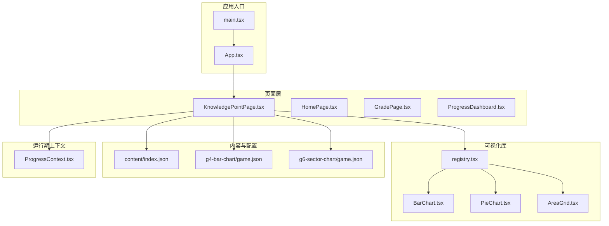
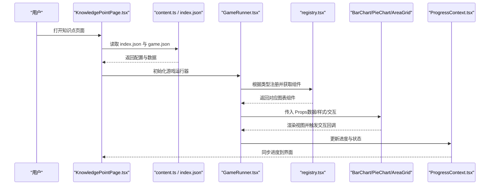
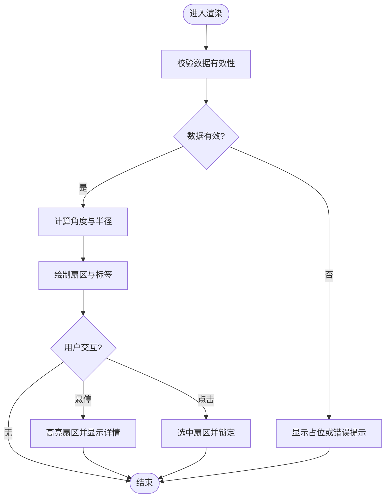
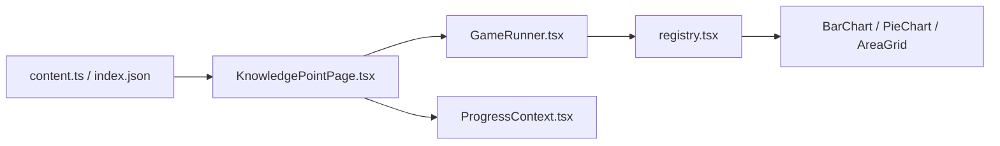

# 图表工具

<cite>
**本文引用的文件**   
- [BarChart.tsx](file://src/visualizations/BarChart.tsx)
- [PieChart.tsx](file://src/visualizations/PieChart.tsx)
- [AreaGrid.tsx](file://src/visualizations/AreaGrid.tsx)
- [registry.tsx](file://src/visualizations/registry.tsx)
- [index.json](file://src/content/index.json)
- [g4-bar-chart/game.json](file://src/content/knowledge-points/g4-bar-chart/game.json)
- [g6-sector-chart/game.json](file://src/content/knowledge-points/g6-sector-chart/game.json)
- [GameRunner.tsx](file://src/components/GameRunner.tsx)
- [KnowledgePointPage.tsx](file://src/pages/KnowledgePointPage.tsx)
- [ProgressContext.tsx](file://src/context/ProgressContext.tsx)
- [types.ts](file://src/lib/types.ts)
- [content.ts](file://src/lib/content.ts)
- [package.json](file://package.json)
- [vite.config.ts](file://vite.config.ts)
</cite>

## 目录
1. [简介](#简介)
2. [项目结构](#项目结构)
3. [核心组件](#核心组件)
4. [架构总览](#架构总览)
5. [详细组件分析](#详细组件分析)
6. [依赖关系分析](#依赖关系分析)
7. [性能考量](#性能考量)
8. [故障排查指南](#故障排查指南)
9. [结论](#结论)
10. [附录](#附录)

## 简介
本技术文档聚焦 math-k6 项目的可视化图表能力，重点覆盖柱状图、饼图和面积网格三类图表的实现原理与使用方式。文档从系统架构、组件接口、数据流、交互行为、响应式适配、动画与样式定制、数据校验与错误处理、以及性能优化等方面进行全面说明，帮助开发者快速理解并扩展图表功能。

## 项目结构
math-k6 采用 React + TypeScript 的前端工程化方案，通过 Vite 构建。可视化图表集中在 src/visualizations 目录下，以独立组件形式提供；内容配置与知识点对应关系位于 src/content 下的 JSON 元数据中；运行时由 GameRunner 驱动渲染具体知识点页面，并通过 ProgressContext 管理学习进度。



**图示来源** 
- [KnowledgePointPage.tsx](file://src/pages/KnowledgePointPage.tsx)
- [registry.tsx](file://src/visualizations/registry.tsx)
- [BarChart.tsx](file://src/visualizations/BarChart.tsx)
- [PieChart.tsx](file://src/visualizations/PieChart.tsx)
- [AreaGrid.tsx](file://src/visualizations/AreaGrid.tsx)
- [index.json](file://src/content/index.json)
- [g4-bar-chart/game.json](file://src/content/knowledge-points/g4-bar-chart/game.json)
- [g6-sector-chart/game.json](file://src/content/knowledge-points/g6-sector-chart/game.json)
- [ProgressContext.tsx](file://src/context/ProgressContext.tsx)

**章节来源**
- [package.json](file://package.json)
- [vite.config.ts](file://vite.config.ts)

## 核心组件
- 柱状图（BarChart）：用于展示分类数据的数值对比，支持坐标轴、标签、颜色主题、动画过渡等配置项。
- 饼图（PieChart）：用于展示比例构成，支持扇区颜色、标签位置、百分比显示、悬停高亮等特性。
- 面积网格（AreaGrid）：用于在二维网格上绘制区域或点阵，适合表示集合、概率模型或空间分布。

这些组件遵循统一的 Props 约定：数据源格式、样式配置、坐标轴与标签设置、交互回调等保持一致，便于在注册表中进行统一装配与按需加载。

**章节来源**
- [BarChart.tsx](file://src/visualizations/BarChart.tsx)
- [PieChart.tsx](file://src/visualizations/PieChart.tsx)
- [AreaGrid.tsx](file://src/visualizations/AreaGrid.tsx)

## 架构总览
图表渲染流程从页面层读取知识点配置，解析对应的 game.json，将数据与样式映射到可视化组件的 Props，再由注册表动态选择并渲染具体图表。进度上下文贯穿整个流程，记录用户交互与完成状态。



**图示来源** 
- [KnowledgePointPage.tsx](file://src/pages/KnowledgePointPage.tsx)
- [content.ts](file://src/lib/content.ts)
- [index.json](file://src/content/index.json)
- [GameRunner.tsx](file://src/components/GameRunner.tsx)
- [registry.tsx](file://src/visualizations/registry.tsx)
- [BarChart.tsx](file://src/visualizations/BarChart.tsx)
- [PieChart.tsx](file://src/visualizations/PieChart.tsx)
- [AreaGrid.tsx](file://src/visualizations/AreaGrid.tsx)
- [ProgressContext.tsx](file://src/context/ProgressContext.tsx)

## 详细组件分析

### 柱状图（BarChart）
- 数据格式：数组元素包含分类名与数值字段，支持可选的分组与堆叠字段。
- 样式配置：颜色主题、条宽度、间距、边框圆角、阴影效果。
- 坐标轴设置：X/Y 轴刻度范围、单位、网格线、标签格式化。
- 标签显示：数据标签位置（顶部/内部）、字体大小、颜色、是否显示。
- 交互功能：悬停提示（Tooltip）、点击选中、双击重置、键盘可达性。
- 动画过渡：入场动画、数值变化过渡、缓动函数可配置。
- 响应式设计：基于容器尺寸自适应布局，小屏自动隐藏次要标签。
- 错误处理：空数据检测、数值越界、非法类型提示。

```mermaid
classDiagram
class BarChart {
+data : Array<{label, value}>
+style : {colors, barWidth, spacing}
+axes : {xLabel, yLabel, ticks, grid}
+labels : {show, position, format}
+interactions : {onHover, onClick, onReset}
+animation : {duration, easing}
+render() void
+handleResize() void
}
```

**图示来源** 
- [BarChart.tsx](file://src/visualizations/BarChart.tsx)

**章节来源**
- [BarChart.tsx](file://src/visualizations/BarChart.tsx)
- [g4-bar-chart/game.json](file://src/content/knowledge-points/g4-bar-chart/game.json)

### 饼图（PieChart）
- 数据格式：数组元素包含类别与占比字段，支持总和归一化处理。
- 样式配置：扇区颜色、描边、内边距、中心文本显示。
- 标签显示：百分比、类别名、引导线、标签位置（内/外）。
- 交互功能：悬停放大、点击选中、双击恢复默认视图。
- 动画过渡：扇区展开动画、旋转入场、数值平滑过渡。
- 响应式设计：按容器宽高计算半径，避免溢出与重叠。
- 错误处理：负值过滤、零值提示、数据为空回退。



**图示来源** 
- [PieChart.tsx](file://src/visualizations/PieChart.tsx)

**章节来源**
- [PieChart.tsx](file://src/visualizations/PieChart.tsx)
- [g6-sector-chart/game.json](file://src/content/knowledge-points/g6-sector-chart/game.json)

### 面积网格（AreaGrid）
- 数据格式：二维矩阵或点集，支持布尔掩码或数值强度。
- 样式配置：单元格尺寸、填充色、边框、渐变映射。
- 坐标与网格：行列标题、网格线可见性、缩放与平移。
- 标签显示：单元格值、热力图颜色映射、图例。
- 交互功能：单元格悬停提示、框选区域、批量操作。
- 动画过渡：单元格逐个出现、颜色渐变过渡。
- 响应式设计：网格密度随容器尺寸调整，避免过小单元格。
- 错误处理：维度不一致、NaN/Infinity 处理、内存占用控制。

```mermaid
classDiagram
class AreaGrid {
+matrix : number[][] | boolean[][]
+style : {cellSize, colors, gradient}
+grid : {rows, cols, labels, legend}
+interactions : {onCellHover, onBoxSelect}
+animation : {stagger, duration}
+render() void
+resize() void
}
```

**图示来源** 
- [AreaGrid.tsx](file://src/visualizations/AreaGrid.tsx)

**章节来源**
- [AreaGrid.tsx](file://src/visualizations/AreaGrid.tsx)

## 依赖关系分析
- 页面层依赖内容解析模块，读取 index.json 与 game.json，生成可视化的输入数据。
- 注册表集中管理图表组件，按类型分发渲染逻辑，降低耦合度。
- 进度上下文为所有图表提供统一的交互反馈与状态持久化。
- 构建工具链（Vite）负责资源打包与开发体验优化。



**图示来源** 
- [content.ts](file://src/lib/content.ts)
- [index.json](file://src/content/index.json)
- [KnowledgePointPage.tsx](file://src/pages/KnowledgePointPage.tsx)
- [GameRunner.tsx](file://src/components/GameRunner.tsx)
- [registry.tsx](file://src/visualizations/registry.tsx)
- [BarChart.tsx](file://src/visualizations/BarChart.tsx)
- [PieChart.tsx](file://src/visualizations/PieChart.tsx)
- [AreaGrid.tsx](file://src/visualizations/AreaGrid.tsx)
- [ProgressContext.tsx](file://src/context/ProgressContext.tsx)

**章节来源**
- [types.ts](file://src/lib/types.ts)
- [content.ts](file://src/lib/content.ts)
- [registry.tsx](file://src/visualizations/registry.tsx)

## 性能考量
- 数据量控制：对大数据集进行采样或分页渲染，避免一次性重绘。
- 渲染优化：使用 memoization 减少不必要的重渲染，合理拆分子组件。
- 动画性能：限制同时动画数量，使用 requestAnimationFrame 与 GPU 加速。
- 内存管理：及时释放事件监听与定时器，避免泄漏。
- 响应式策略：防抖窗口尺寸变化事件，延迟非关键计算。

[本节为通用指导，不直接分析具体文件]

## 故障排查指南
- 数据为空或格式错误：检查 game.json 的数据结构与字段命名，确保与组件 Props 一致。
- 渲染异常或空白：确认容器尺寸与 CSS 样式，检查是否有未捕获的异常。
- 交互无响应：验证事件绑定是否正确，检查是否在移动端存在触摸兼容问题。
- 进度不同步：确认 ProgressContext 的状态更新路径，检查异步回调是否被调用。

**章节来源**
- [ProgressContext.tsx](file://src/context/ProgressContext.tsx)
- [GameRunner.tsx](file://src/components/GameRunner.tsx)

## 结论
math-k6 的图表工具通过清晰的组件化设计与统一的 Props 约定，实现了柱状图、饼图与面积网格的高效渲染与交互。结合内容配置与注册表机制，系统具备良好的可扩展性与维护性。建议在生产环境中关注数据校验、性能优化与用户体验细节，以确保在不同设备与场景下的稳定表现。

[本节为总结性内容，不直接分析具体文件]

## 附录
- 常用配置示例路径：
  - 柱状图配置：[g4-bar-chart/game.json](file://src/content/knowledge-points/g4-bar-chart/game.json)
  - 饼图配置：[g6-sector-chart/game.json](file://src/content/knowledge-points/g6-sector-chart/game.json)
- 类型定义参考：[types.ts](file://src/lib/types.ts)
- 内容解析入口：[content.ts](file://src/lib/content.ts)
- 构建配置：[package.json](file://package.json), [vite.config.ts](file://vite.config.ts)

[本节为补充信息，不直接分析具体文件]