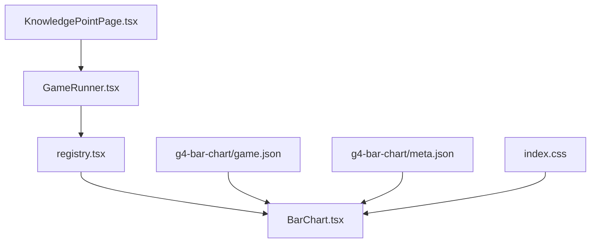
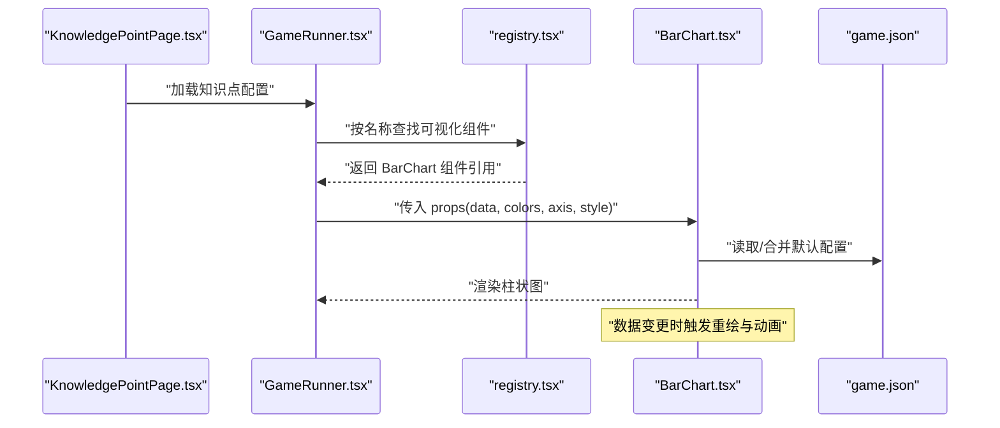
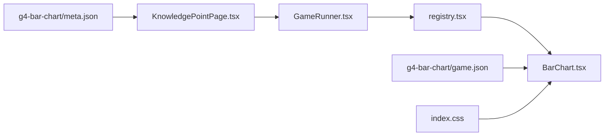

# 柱状图组件

<cite>
**本文引用的文件**   
- [BarChart.tsx](file://src/visualizations/BarChart.tsx)
- [registry.tsx](file://src/visualizations/registry.tsx)
- [g4-bar-chart/game.json](file://src/content/knowledge-points/g4-bar-chart/game.json)
- [g4-bar-chart/meta.json](file://src/content/knowledge-points/g4-bar-chart/meta.json)
- [GameRunner.tsx](file://src/components/GameRunner.tsx)
- [KnowledgePointPage.tsx](file://src/pages/KnowledgePointPage.tsx)
- [index.css](file://src/index.css)
</cite>

## 目录
1. [简介](#简介)
2. [项目结构](#项目结构)
3. [核心组件](#核心组件)
4. [架构总览](#架构总览)
5. [详细组件分析](#详细组件分析)
6. [依赖关系分析](#依赖关系分析)
7. [性能考虑](#性能考虑)
8. [故障排查指南](#故障排查指南)
9. [结论](#结论)
10. [附录](#附录)

## 简介
本技术文档围绕 math-k6 项目的柱状图组件 BarChart 展开，系统性阐述其实现原理与使用方式。内容涵盖数据绑定、坐标轴渲染、柱子绘制、标签显示、交互（悬停、点击）、动态更新、响应式适配、动画过渡、样式定制、数据校验与错误处理、以及性能优化建议。读者可据此快速集成并扩展该组件以满足教学可视化需求。

## 项目结构
- 可视化组件位于 src/visualizations 目录，其中 BarChart.tsx 为柱状图实现。
- 可视化组件通过 registry.tsx 进行统一注册，供上层容器按需加载。
- g4-bar-chart 知识点的游戏配置 game.json 和元信息 meta.json 定义了该知识点的数据与展示参数。
- GameRunner.tsx 负责运行具体知识点游戏，KnowledgePointPage.tsx 作为页面入口加载知识点内容与可视化。
- index.css 提供全局样式基础，便于组件主题与布局控制。

图表来源
- [GameRunner.tsx](file://src/components/GameRunner.tsx)
- [registry.tsx](file://src/visualizations/registry.tsx)
- [BarChart.tsx](file://src/visualizations/BarChart.tsx)
- [g4-bar-chart/game.json](file://src/content/knowledge-points/g4-bar-chart/game.json)
- [g4-bar-chart/meta.json](file://src/content/knowledge-points/g4-bar-chart/meta.json)
- [index.css](file://src/index.css)

章节来源
- [BarChart.tsx](file://src/visualizations/BarChart.tsx)
- [registry.tsx](file://src/visualizations/registry.tsx)
- [g4-bar-chart/game.json](file://src/content/knowledge-points/g4-bar-chart/game.json)
- [g4-bar-chart/meta.json](file://src/content/knowledge-points/g4-bar-chart/meta.json)
- [GameRunner.tsx](file://src/components/GameRunner.tsx)
- [KnowledgePointPage.tsx](file://src/pages/KnowledgePointPage.tsx)
- [index.css](file://src/index.css)

## 核心组件
- BarChart.tsx：柱状图可视化组件，负责数据解析、坐标轴计算、柱子绘制、标签与提示、交互事件与动画过渡。
- registry.tsx：可视化组件注册表，将 BarChart 以键名暴露给上层运行时。
- g4-bar-chart/game.json：定义该知识点的柱状图数据、颜色、尺寸、坐标轴与样式等配置项。
- g4-bar-chart/meta.json：描述知识点元信息，辅助页面渲染与导航。
- GameRunner.tsx：根据知识点配置选择并运行对应可视化组件。
- KnowledgePointPage.tsx：加载知识点元信息与配置，驱动 GameRunner 渲染。
- index.css：全局样式，影响组件布局与主题。

章节来源
- [BarChart.tsx](file://src/visualizations/BarChart.tsx)
- [registry.tsx](file://src/visualizations/registry.tsx)
- [g4-bar-chart/game.json](file://src/content/knowledge-points/g4-bar-chart/game.json)
- [g4-bar-chart/meta.json](file://src/content/knowledge-points/g4-bar-chart/meta.json)
- [GameRunner.tsx](file://src/components/GameRunner.tsx)
- [KnowledgePointPage.tsx](file://src/pages/KnowledgePointPage.tsx)
- [index.css](file://src/index.css)

## 架构总览
BarChart 组件遵循“配置驱动 + 声明式渲染”的架构模式：
- 数据层：从 game.json 读取 data、colors、axis、style 等配置，并在组件内部进行校验与归一化。
- 渲染层：基于 SVG/Canvas（由实现决定）绘制坐标轴、刻度、网格线、柱子与标签。
- 交互层：监听鼠标悬停、点击等事件，触发高亮、提示框或回调。
- 动画层：在数据变化时执行过渡动画，提升视觉连贯性。
- 响应式层：根据容器尺寸自适应计算比例与布局。

图表来源
- [KnowledgePointPage.tsx](file://src/pages/KnowledgePointPage.tsx)
- [GameRunner.tsx](file://src/components/GameRunner.tsx)
- [registry.tsx](file://src/visualizations/registry.tsx)
- [BarChart.tsx](file://src/visualizations/BarChart.tsx)
- [g4-bar-chart/game.json](file://src/content/knowledge-points/g4-bar-chart/game.json)

## 详细组件分析

### 数据模型与 Props 接口
- data：数组类型，每项包含类别标签与数值字段；支持可选的分组/堆叠字段（若实现支持）。
- colors：颜色配置，可为单色字符串或颜色数组，用于柱子填充与悬停高亮。
- width/height：画布尺寸，支持像素值或百分比；组件内部会结合容器尺寸做响应式换算。
- axis：坐标轴配置，包括 x/y 轴标题、刻度范围、刻度间隔、网格线开关、标签旋转角度等。
- style：样式选项，如背景、边框、圆角、阴影、字体大小与颜色等。
- 交互回调：onHover、onClick、onUpdate 等，用于外部状态同步与业务逻辑。

章节来源
- [BarChart.tsx](file://src/visualizations/BarChart.tsx)
- [g4-bar-chart/game.json](file://src/content/knowledge-points/g4-bar-chart/game.json)

### 数据绑定与校验
- 输入校验：检查 data 是否为非空数组，数值字段是否有效（数字、非负），颜色数组长度是否与数据项匹配。
- 归一化：对缺失字段设置默认值，确保后续渲染稳定。
- 映射：将原始数据映射到绘图坐标系，计算最大值、最小值与刻度步长。

章节来源
- [BarChart.tsx](file://src/visualizations/BarChart.tsx)

### 坐标轴渲染
- X 轴：根据数据项数量与宽度计算间距，绘制刻度线与标签，支持旋转与换行。
- Y 轴：根据数值范围生成等距刻度，绘制网格线，支持对数或线性刻度（若实现支持）。
- 标题与单位：支持轴标题与单位文本，位置与字号可通过 style 控制。

章节来源
- [BarChart.tsx](file://src/visualizations/BarChart.tsx)

### 柱子绘制与标签显示
- 柱子：根据数值映射高度，按 colors 填充；支持圆角、描边与阴影。
- 标签：柱子顶部显示数值标签，支持格式化（千分位、小数位数）。
- 分组/堆叠：若数据包含多列，按分组或堆叠规则排列柱子。

章节来源
- [BarChart.tsx](file://src/visualizations/BarChart.tsx)

### 用户交互
- 悬停效果：鼠标进入柱子区域时高亮、放大或显示提示框（类别、数值、占比等）。
- 点击事件：点击柱子触发 onClick 回调，可用于跳转详情或更新外部状态。
- 动态更新：当 data/colors/axis/style 变化时，组件自动重绘并执行过渡动画。

章节来源
- [BarChart.tsx](file://src/visualizations/BarChart.tsx)

### 响应式设计
- 容器自适应：监听父容器尺寸变化，重新计算比例与布局。
- 断点策略：在小屏设备上减少刻度密度、隐藏次要标签、调整字体大小。
- 缩放与滚动：支持横向滚动或缩放以适应大量数据。

章节来源
- [BarChart.tsx](file://src/visualizations/BarChart.tsx)
- [index.css](file://src/index.css)

### 动画过渡
- 入场动画：柱子从底部渐显或增长，时长与缓动函数可配置。
- 数据更新动画：数值变化时平滑过渡到新高度，避免闪烁。
- 交互反馈：悬停与点击时微动画增强体验。

章节来源
- [BarChart.tsx](file://src/visualizations/BarChart.tsx)

### 自定义样式
- 主题变量：通过 CSS 变量或 style 对象覆盖颜色、字体、间距等。
- 组件内样式：支持 className、inline styles 与样式优先级控制。
- 无障碍：确保对比度与键盘可达性。

章节来源
- [BarChart.tsx](file://src/visualizations/BarChart.tsx)
- [index.css](file://src/index.css)

### 数据验证与错误处理
- 输入校验失败：抛出明确错误信息，回退到默认配置或空视图。
- 渲染异常：捕获绘制过程中的异常，降级为静态视图并记录日志。
- 边界情况：空数据、NaN、Infinity、超长标签等场景的处理策略。

章节来源
- [BarChart.tsx](file://src/visualizations/BarChart.tsx)

### 性能优化建议
- 增量更新：仅重绘变化的柱子，避免全量重绘。
- 防抖与节流：对频繁的尺寸变化与数据更新进行节流。
- 虚拟列表：大数据集下采用虚拟化渲染。
- 内存管理：及时移除事件监听器与定时器。

章节来源
- [BarChart.tsx](file://src/visualizations/BarChart.tsx)

## 依赖关系分析
- BarChart 依赖 registry.tsx 的注册机制，以便被 GameRunner 动态加载。
- 数据来源于 g4-bar-chart/game.json，样式受 index.css 影响。
- GameRunner 与 KnowledgePointPage 构成上层编排，协调数据与渲染流程。

图表来源
- [registry.tsx](file://src/visualizations/registry.tsx)
- [BarChart.tsx](file://src/visualizations/BarChart.tsx)
- [GameRunner.tsx](file://src/components/GameRunner.tsx)
- [KnowledgePointPage.tsx](file://src/pages/KnowledgePointPage.tsx)
- [g4-bar-chart/game.json](file://src/content/knowledge-points/g4-bar-chart/game.json)
- [g4-bar-chart/meta.json](file://src/content/knowledge-points/g4-bar-chart/meta.json)
- [index.css](file://src/index.css)

章节来源
- [registry.tsx](file://src/visualizations/registry.tsx)
- [BarChart.tsx](file://src/visualizations/BarChart.tsx)
- [GameRunner.tsx](file://src/components/GameRunner.tsx)
- [KnowledgePointPage.tsx](file://src/pages/KnowledgePointPage.tsx)
- [g4-bar-chart/game.json](file://src/content/knowledge-points/g4-bar-chart/game.json)
- [g4-bar-chart/meta.json](file://src/content/knowledge-points/g4-bar-chart/meta.json)
- [index.css](file://src/index.css)

## 性能考虑
- 渲染路径优化：优先使用 Canvas 或 SVG 批量绘制，减少 DOM 操作。
- 计算复杂度：坐标轴与刻度计算应控制在 O(n) 以内，避免重复计算。
- 动画帧率：使用 requestAnimationFrame 保证流畅动画。
- 资源加载：延迟加载大图片与字体，避免阻塞首屏。

[本节为通用指导，不直接分析具体文件]

## 故障排查指南
- 数据为空或格式错误：检查 game.json 中 data 字段结构与类型，确保必填字段齐全。
- 颜色不生效：确认 colors 数组长度与数据项一致，或提供默认单色。
- 坐标轴错位：检查 width/height 与 axis.range/step 配置是否合理。
- 交互无响应：确认事件监听是否正确绑定，是否存在遮挡元素。
- 动画卡顿：减少同时更新的柱子数量，启用增量更新与节流。

章节来源
- [BarChart.tsx](file://src/visualizations/BarChart.tsx)
- [g4-bar-chart/game.json](file://src/content/knowledge-points/g4-bar-chart/game.json)

## 结论
BarChart 组件以配置驱动为核心，结合数据校验、坐标轴计算、柱子绘制、交互与动画，提供了完整且可扩展的柱状图能力。通过合理的响应式设计与性能优化，可在不同设备与数据规模下保持良好体验。建议在集成时严格遵循数据格式与样式约定，充分利用注册表与运行时编排，以获得最佳的可维护性与扩展性。

[本节为总结，不直接分析具体文件]

## 附录
- 常用配置示例（参考路径）
  - 数据与颜色：[g4-bar-chart/game.json](file://src/content/knowledge-points/g4-bar-chart/game.json)
  - 元信息：[g4-bar-chart/meta.json](file://src/content/knowledge-points/g4-bar-chart/meta.json)
- 集成要点
  - 在 registry.tsx 中注册 BarChart 组件键名。
  - 在 GameRunner.tsx 中按知识点名称加载对应可视化。
  - 在 KnowledgePointPage.tsx 中加载知识点元信息与配置，驱动渲染。
  - 通过 index.css 统一主题与布局。

章节来源
- [registry.tsx](file://src/visualizations/registry.tsx)
- [GameRunner.tsx](file://src/components/GameRunner.tsx)
- [KnowledgePointPage.tsx](file://src/pages/KnowledgePointPage.tsx)
- [g4-bar-chart/game.json](file://src/content/knowledge-points/g4-bar-chart/game.json)
- [g4-bar-chart/meta.json](file://src/content/knowledge-points/g4-bar-chart/meta.json)
- [index.css](file://src/index.css)