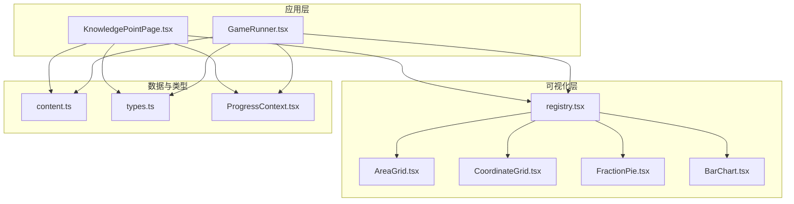
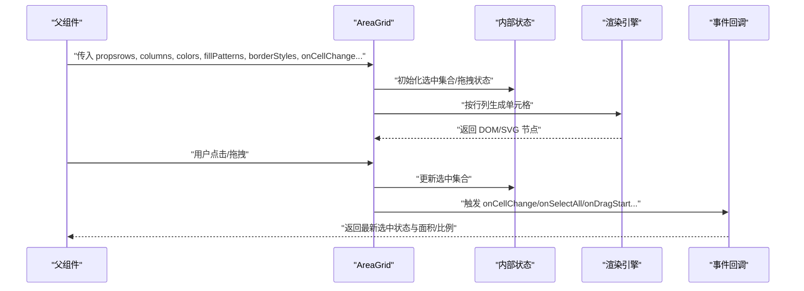
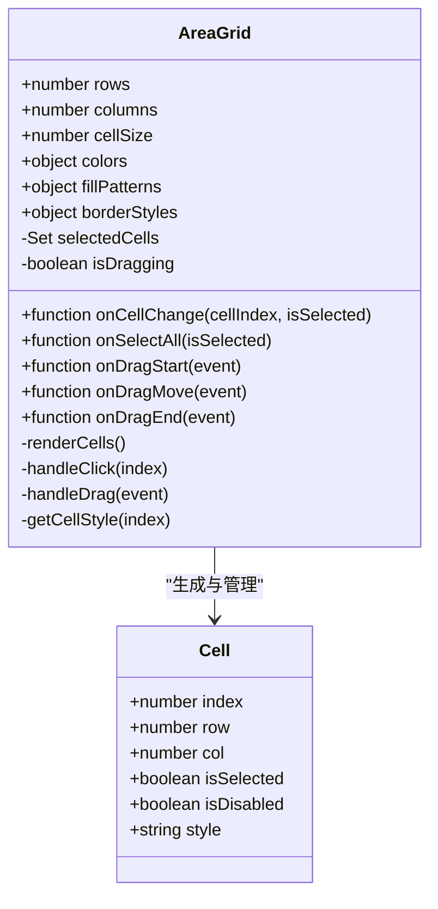
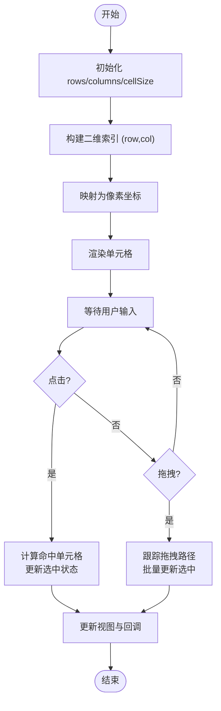
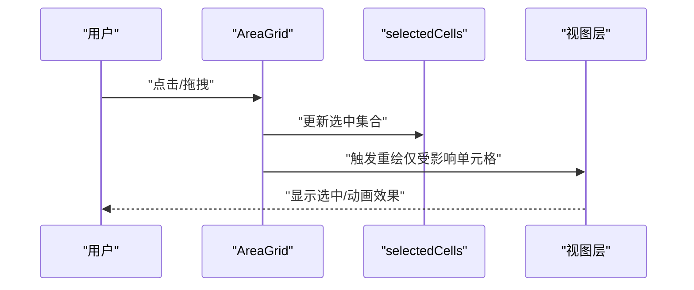
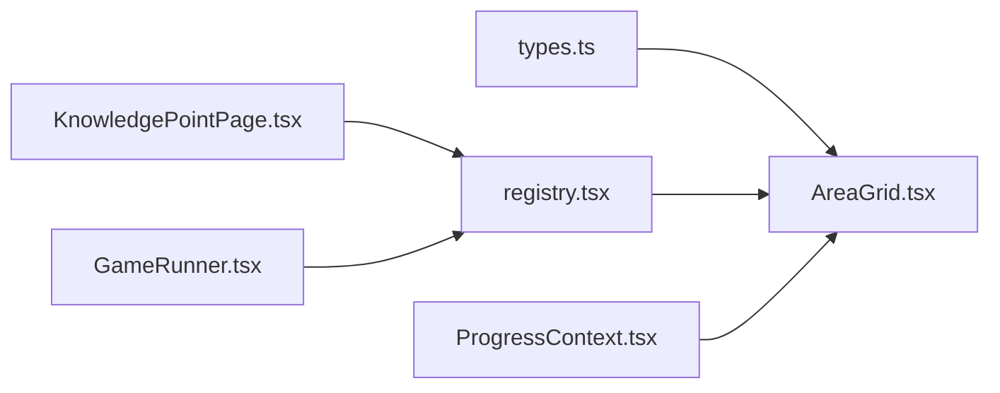

# 面积网格组件

<cite>
**本文档引用的文件**   
- [AreaGrid.tsx](file://src/visualizations/AreaGrid.tsx)
- [registry.tsx](file://src/visualizations/registry.tsx)
- [CoordinateGrid.tsx](file://src/visualizations/CoordinateGrid.tsx)
- [FractionPie.tsx](file://src/visualizations/FractionPie.tsx)
- [BarChart.tsx](file://src/visualizations/BarChart.tsx)
- [ProgressContext.tsx](file://src/context/ProgressContext.tsx)
- [types.ts](file://src/lib/types.ts)
- [content.ts](file://src/lib/content.ts)
- [KnowledgePointPage.tsx](file://src/pages/KnowledgePointPage.tsx)
- [GameRunner.tsx](file://src/components/GameRunner.tsx)
</cite>

## 目录
1. [简介](#简介)
2. [项目结构](#项目结构)
3. [核心组件](#核心组件)
4. [架构总览](#架构总览)
5. [详细组件分析](#详细组件分析)
6. [依赖关系分析](#依赖关系分析)
7. [性能考虑](#性能考虑)
8. [故障排查指南](#故障排查指南)
9. [结论](#结论)
10. [附录](#附录)

## 简介
本技术文档围绕 math-k6 项目的“面积网格”可视化组件 AreaGrid 展开，系统阐述其实现原理与使用方式。内容涵盖：
- 网格生成与坐标系统
- 单元格绘制与填充状态管理
- Props 接口规范（网格尺寸、单元格大小、颜色方案、填充模式、边框样式）
- 用户交互（点击切换、批量选择、拖拽）
- 数学概念可视化（分数表示、面积计算、比例关系）
- 动画过渡配置与自定义样式技巧
- 数据验证、错误处理与性能优化建议

该组件适用于小学高年级到初中阶段的面积与分数教学场景，通过直观的网格化视觉表达帮助学生建立数形结合的理解。

## 项目结构
AreaGrid 位于可视化模块中，并通过注册表被上层页面或游戏运行器按需加载。相关关键路径如下：
- 可视化组件：src/visualizations/AreaGrid.tsx
- 可视化注册表：src/visualizations/registry.tsx
- 坐标网格参考：src/visualizations/CoordinateGrid.tsx
- 其他可视化参考：src/visualizations/FractionPie.tsx, src/visualizations/BarChart.tsx
- 进度上下文：src/context/ProgressContext.tsx
- 类型定义：src/lib/types.ts
- 内容加载：src/lib/content.ts
- 知识页与游戏运行器：src/pages/KnowledgePointPage.tsx, src/components/GameRunner.tsx

图表来源
- [AreaGrid.tsx](file://src/visualizations/AreaGrid.tsx)
- [registry.tsx](file://src/visualizations/registry.tsx)
- [CoordinateGrid.tsx](file://src/visualizations/CoordinateGrid.tsx)
- [FractionPie.tsx](file://src/visualizations/FractionPie.tsx)
- [BarChart.tsx](file://src/visualizations/BarChart.tsx)
- [ProgressContext.tsx](file://src/context/ProgressContext.tsx)
- [types.ts](file://src/lib/types.ts)
- [content.ts](file://src/lib/content.ts)
- [KnowledgePointPage.tsx](file://src/pages/KnowledgePointPage.tsx)
- [GameRunner.tsx](file://src/components/GameRunner.tsx)

章节来源
- [AreaGrid.tsx](file://src/visualizations/AreaGrid.tsx)
- [registry.tsx](file://src/visualizations/registry.tsx)
- [types.ts](file://src/lib/types.ts)

## 核心组件
AreaGrid 作为面积可视化的核心，负责：
- 根据 rows/columns 生成网格布局
- 基于 cell size 计算每个单元格的几何位置
- 管理单元格的填充状态（选中/未选中/禁用等）
- 提供点击、拖拽等交互能力
- 支持多种颜色方案与边框样式
- 输出当前选中的面积与比例信息，便于教学反馈

典型使用场景包括：
- 分数可视化：将整体划分为若干等份，用选中格子数量表示分子
- 面积计算：以单位面积为基准，统计选中格子总数得到面积
- 比例关系：比较不同矩形的格子占比，直观展示比例差异

章节来源
- [AreaGrid.tsx](file://src/visualizations/AreaGrid.tsx)
- [types.ts](file://src/lib/types.ts)

## 架构总览
AreaGrid 的渲染与交互流程大致如下：
- 父组件（如 KnowledgePointPage 或 GameRunner）传入 props（网格尺寸、颜色、填充模式、事件回调等）
- AreaGrid 内部维护状态（选中集合、拖拽状态、动画状态）
- 渲染阶段按行列遍历生成单元格，并根据状态决定填充与样式
- 交互阶段响应点击、拖拽事件，更新选中集合并触发回调
- 可选地通过 ProgressContext 上报学习进度或结果

图表来源
- [AreaGrid.tsx](file://src/visualizations/AreaGrid.tsx)
- [ProgressContext.tsx](file://src/context/ProgressContext.tsx)

## 详细组件分析

### AreaGrid 组件分析
AreaGrid 的核心职责是“网格生成 + 单元格绘制 + 状态管理 + 交互处理”。其关键特性包括：
- 网格生成：依据 rows/columns 构建二维索引空间，映射为线性单元格列表
- 坐标系统：采用行列坐标系 (row, col)，转换为像素坐标时乘以 cell size
- 填充状态：维护一个 Set 或布尔矩阵记录选中状态，支持批量操作
- 颜色与边框：colors 支持主题色与语义色；borderStyles 控制线宽、虚线等
- 填充模式：fillPatterns 支持纯色、斜线、点阵等纹理
- 交互：点击切换单个单元格；按住 Shift/Ctrl 进行多选；拖拽实现区域填充
- 动画：支持选中/取消时的过渡效果（缩放、透明度变化）
- 无障碍：为每个单元格提供 aria-label 与键盘可达性

图表来源
- [AreaGrid.tsx](file://src/visualizations/AreaGrid.tsx)

章节来源
- [AreaGrid.tsx](file://src/visualizations/AreaGrid.tsx)

### 坐标系统与网格生成
- 坐标系统：以左上角为原点，行向下递增，列向右递增
- 单元格定位：cellX = col * cellSize, cellY = row * cellSize
- 边界检测：鼠标坐标落入某单元格范围即判定命中
- 批量选择：Shift 扩展选择区间，Ctrl/Toggle 切换选择状态

图表来源
- [AreaGrid.tsx](file://src/visualizations/AreaGrid.tsx)

章节来源
- [AreaGrid.tsx](file://src/visualizations/AreaGrid.tsx)

### 填充状态管理与动画
- 状态存储：使用 Set<number> 存储选中单元格索引，避免重复与 O(1) 查询
- 批量操作：onSelectAll 统一设置全部选中/未选中
- 动画过渡：在状态变更时添加 CSS transition 或 requestAnimationFrame 动画
- 性能优化：对大量单元格使用虚拟滚动或增量更新

图表来源
- [AreaGrid.tsx](file://src/visualizations/AreaGrid.tsx)

章节来源
- [AreaGrid.tsx](file://src/visualizations/AreaGrid.tsx)

### 颜色方案与边框样式
- colors：支持主色、选中色、禁用色、背景色等
- fillPatterns：支持纯色、斜线、点阵、网格纹理等
- borderStyles：支持线宽、颜色、虚线样式、圆角等
- 主题切换：通过外部 props 动态替换颜色与图案

章节来源
- [AreaGrid.tsx](file://src/visualizations/AreaGrid.tsx)

### 用户交互功能
- 点击切换：单击单元格切换选中状态
- 批量选择：Shift 扩展选择区间，Ctrl/Toggle 切换选择状态
- 拖拽操作：按下鼠标并移动，沿路径填充单元格
- 键盘可达：Tab 导航，空格键切换，方向键移动焦点
- 事件回调：onCellChange、onSelectAll、onDragStart/Move/End

章节来源
- [AreaGrid.tsx](file://src/visualizations/AreaGrid.tsx)

### 数学概念可视化
- 分数表示：分母=总格子数，分子=选中格子数
- 面积计算：单位面积=cellSize*cellSize，总面积=选中数*单位面积
- 比例关系：比较不同网格的选中比例，直观展示分数等价与大小比较

章节来源
- [AreaGrid.tsx](file://src/visualizations/AreaGrid.tsx)

### 动画过渡与自定义样式
- 过渡配置：通过 CSS transition 或动画库实现淡入淡出、缩放等
- 自定义样式：覆盖默认 colors/borderStyles/fillPatterns
- 性能提示：避免频繁重排，使用 transform 与 opacity 提升性能

章节来源
- [AreaGrid.tsx](file://src/visualizations/AreaGrid.tsx)

### 数据验证与错误处理
- 输入校验：rows/columns 必须为正整数，cellSize 必须大于 0
- 边界保护：防止越界访问与非法索引
- 异常捕获：包裹事件处理逻辑，避免崩溃
- 降级策略：在低性能设备上减少动画复杂度

章节来源
- [AreaGrid.tsx](file://src/visualizations/AreaGrid.tsx)

## 依赖关系分析
AreaGrid 依赖类型定义、注册表与上下文，形成清晰的层次结构：
- 类型定义：types.ts 提供统一的接口与枚举
- 注册表：registry.tsx 将 AreaGrid 暴露给上层组件
- 上下文：ProgressContext.tsx 用于共享进度与状态

图表来源
- [types.ts](file://src/lib/types.ts)
- [registry.tsx](file://src/visualizations/registry.tsx)
- [ProgressContext.tsx](file://src/context/ProgressContext.tsx)
- [KnowledgePointPage.tsx](file://src/pages/KnowledgePointPage.tsx)
- [GameRunner.tsx](file://src/components/GameRunner.tsx)

章节来源
- [types.ts](file://src/lib/types.ts)
- [registry.tsx](file://src/visualizations/registry.tsx)
- [ProgressContext.tsx](file://src/context/ProgressContext.tsx)

## 性能考虑
- 渲染优化：使用 React.memo 或 useMemo 缓存单元格样式
- 事件节流：对拖拽事件进行节流或防抖
- 增量更新：仅重绘受影响的单元格
- 内存管理：及时清理事件监听器与定时器
- 低端设备：降低动画帧率或关闭复杂特效

[本节为通用指导，不直接分析具体文件]

## 故障排查指南
常见问题与解决思路：
- 网格不显示：检查 rows/columns 是否为正数，cellSize 是否合理
- 点击无效：确认事件绑定是否正确，z-index 是否遮挡
- 动画卡顿：减少同时动画的单元格数量，使用 GPU 加速属性
- 状态不同步：确保 selectedCells 与视图一致，避免脏数据
- 拖拽异常：检查鼠标坐标转换与边界判断逻辑

章节来源
- [AreaGrid.tsx](file://src/visualizations/AreaGrid.tsx)

## 结论
AreaGrid 通过清晰的网格生成、灵活的样式配置与丰富的交互能力，为面积与分数教学提供了直观的可视化工具。结合类型定义、注册表与上下文机制，组件具备良好的可复用性与扩展性。在实际使用中，建议关注输入校验、性能优化与无障碍支持，以提升用户体验与教学效果。

[本节为总结性内容，不直接分析具体文件]

## 附录

### Props 接口参考
- rows: number — 行数
- columns: number — 列数
- cellSize: number — 单元格像素大小
- colors: object — 颜色方案（主色、选中色、禁用色、背景色）
- fillPatterns: object — 填充模式（纯色、斜线、点阵等）
- borderStyles: object — 边框样式（线宽、颜色、虚线、圆角）
- onCellChange: function — 单元格状态变化回调
- onSelectAll: function — 全选/全不选回调
- onDragStart/Move/End: function — 拖拽生命周期回调
- disabled: boolean — 是否禁用交互
- animationEnabled: boolean — 是否启用动画

章节来源
- [AreaGrid.tsx](file://src/visualizations/AreaGrid.tsx)
- [types.ts](file://src/lib/types.ts)

### 与其他可视化组件的关系
- CoordinateGrid：提供基础坐标网格能力，可作为 AreaGrid 的底层支撑
- FractionPie：用于分数圆形表示，与 AreaGrid 互补
- BarChart：用于数值对比，可与 AreaGrid 联合展示面积与比例

章节来源
- [CoordinateGrid.tsx](file://src/visualizations/CoordinateGrid.tsx)
- [FractionPie.tsx](file://src/visualizations/FractionPie.tsx)
- [BarChart.tsx](file://src/visualizations/BarChart.tsx)