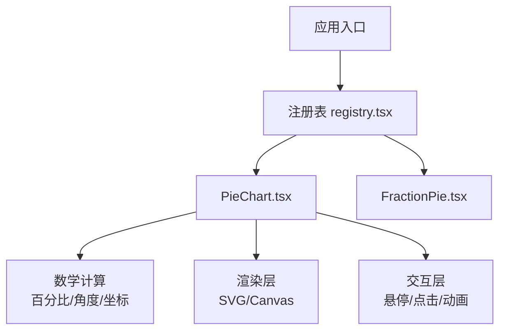
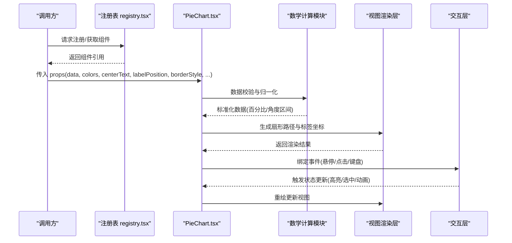
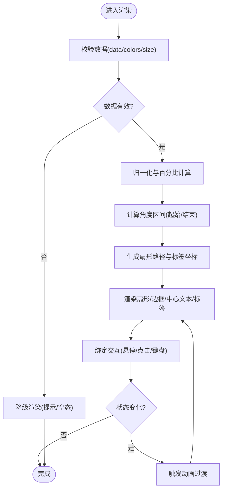
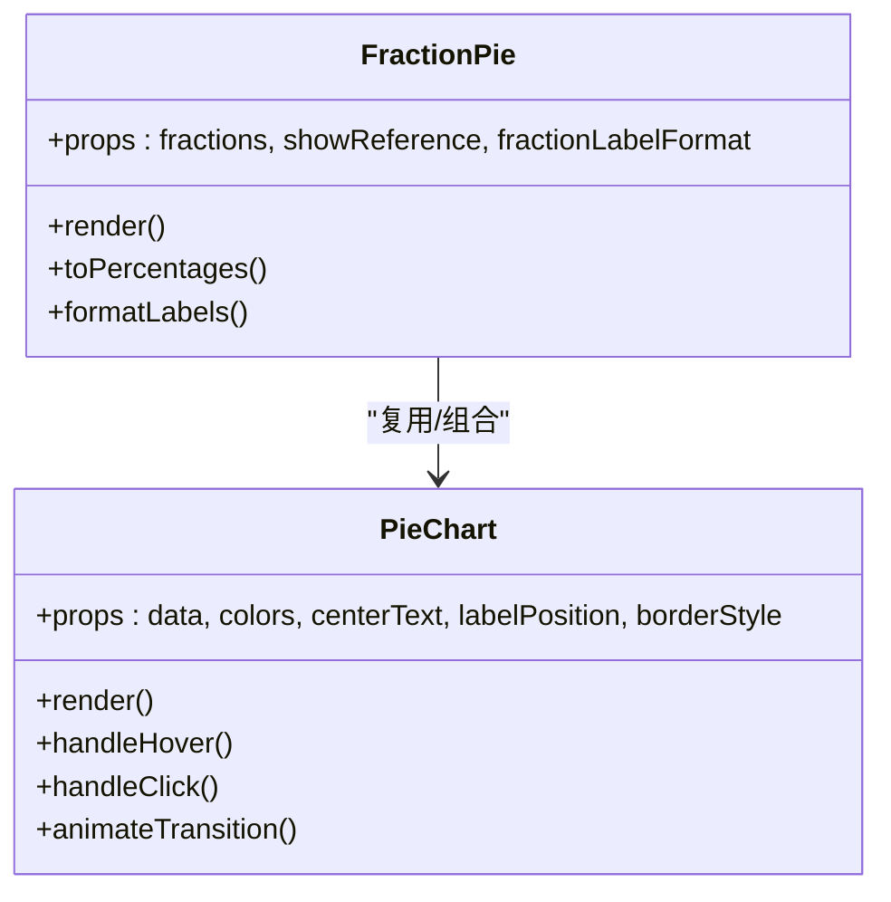
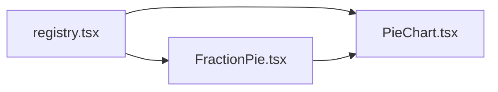

# 饼图组件

<cite>
**本文引用的文件**   
- [PieChart.tsx](file://src/visualizations/PieChart.tsx)
- [FractionPie.tsx](file://src/visualizations/FractionPie.tsx)
- [registry.tsx](file://src/visualizations/registry.tsx)
</cite>

## 目录
1. [简介](#简介)
2. [项目结构](#项目结构)
3. [核心组件](#核心组件)
4. [架构总览](#架构总览)
5. [详细组件分析](#详细组件分析)
6. [依赖关系分析](#依赖关系分析)
7. [性能考量](#性能考量)
8. [故障排查指南](#故障排查指南)
9. [结论](#结论)
10. [附录](#附录) 

## 简介
本技术文档围绕 math-k6 中的饼图组件（PieChart）展开，系统阐述其实现原理与使用方式。内容涵盖扇形几何计算、角度分配策略、颜色填充机制、标签定位算法、用户交互（悬停高亮、点击选择、动态数据更新）、动画过渡配置、样式定制技巧，以及数据校验、错误处理与性能优化建议。读者可据此快速理解并扩展该组件能力，满足教学可视化场景中对“扇形图/百分比/比例”的直观表达需求。

## 项目结构
- 可视化组件位于 src/visualizations 目录，其中：
  - PieChart.tsx：饼图主组件，负责数据解析、扇形绘制、交互与动画。
  - FractionPie.tsx：分数视角的饼图变体，侧重分数语义与标注。
  - registry.tsx：可视化组件注册表，用于统一挂载与按需加载。
- 其他目录如 pages、components、content 等与本组件无直接耦合，主要通过 props 或上下文进行数据驱动渲染。

**图表来源** 
- [registry.tsx](file://src/visualizations/registry.tsx)
- [PieChart.tsx](file://src/visualizations/PieChart.tsx)
- [FractionPie.tsx](file://src/visualizations/FractionPie.tsx)

**章节来源**
- [registry.tsx](file://src/visualizations/registry.tsx)
- [PieChart.tsx](file://src/visualizations/PieChart.tsx)
- [FractionPie.tsx](file://src/visualizations/FractionPie.tsx)

## 核心组件
- PieChart：核心饼图组件，提供数据驱动的扇形绘制、交互与动画能力。
- FractionPie：在 PieChart 基础上封装分数语义，便于教学讲解分数的组成与比较。
- 注册表 registry.tsx：集中管理可视化组件，便于页面按需引入与复用。

关键职责划分：
- 数据层：接收 data array with values，执行归一化与校验。
- 计算层：计算百分比、角度区间、扇形路径与标签坐标。
- 渲染层：基于 SVG/Canvas 绘制扇形、边框、中心文本与标签。
- 交互层：处理鼠标悬停高亮、点击选中、键盘可达性与焦点管理。
- 动画层：支持入场动画、数据变化过渡与状态切换。

**章节来源**
- [PieChart.tsx](file://src/visualizations/PieChart.tsx)
- [FractionPie.tsx](file://src/visualizations/FractionPie.tsx)
- [registry.tsx](file://src/visualizations/registry.tsx)

## 架构总览
下图展示从数据到渲染的整体流程，包括输入校验、角度分配、扇形生成、标签定位与交互反馈。

**图表来源** 
- [registry.tsx](file://src/visualizations/registry.tsx)
- [PieChart.tsx](file://src/visualizations/PieChart.tsx)

## 详细组件分析

### PieChart 组件
- 功能要点
  - 数据格式：data 为数组，每项包含名称与数值；支持空值过滤与负数拦截。
  - 颜色配置：colors 可为固定色板或函数映射；未指定时自动分配。
  - 中心文本：centerText 支持字符串或回调函数，按当前选中项动态显示。
  - 标签位置：labelPosition 支持内/外/自动三种模式，自动模式下根据扇形面积自适应。
  - 边框样式：borderStyle 支持线宽、颜色、虚线等属性，默认启用以增强可读性。
  - 交互行为：hover 高亮、click 选中、键盘 Tab/Enter 可达；支持多选/单选模式。
  - 动画效果：入场渐显、数据变更过渡、选中态缩放与阴影。
- 数学计算逻辑
  - 百分比：value / sum(values) × 100%，对零值与无效数据进行容错。
  - 角度分配：累计角度 = 百分比 × 360°，起始角与结束角用于扇形路径。
  - 坐标定位：基于极坐标转直角坐标计算扇形弧端点与标签锚点，考虑内外偏移。
  - 路径生成：使用 SVG path 或 Canvas arc 绘制扇形，支持圆角与间隙。
- 性能优化
  - 增量更新：仅重绘变化扇形与标签，避免全量重算。
  - 防抖节流：resize 与高频交互事件采用节流，降低重绘频率。
  - 内存管理：及时解绑事件监听，释放中间计算对象。
- 错误处理
  - 数据为空或全部为零时降级为提示文本。
  - 非法颜色或尺寸参数回退到默认值并记录警告。
  - 异常捕获包裹渲染与交互回调，防止崩溃。

**图表来源** 
- [PieChart.tsx](file://src/visualizations/PieChart.tsx)

**章节来源**
- [PieChart.tsx](file://src/visualizations/PieChart.tsx)

### FractionPie 组件
- 设计目标：面向分数教学，强调分子/分母与整体占比的关系。
- 特性
  - 数据源：支持分数形式或等价数值数组，内部转换为标准百分比。
  - 标签语义：标签显示分数形式与百分比双信息。
  - 辅助线：可选显示参考圆环与刻度，帮助理解分数大小。
- 与 PieChart 的关系：继承或组合 PieChart 的核心能力，扩展分数语义与标注。

**图表来源** 
- [PieChart.tsx](file://src/visualizations/PieChart.tsx)
- [FractionPie.tsx](file://src/visualizations/FractionPie.tsx)

**章节来源**
- [FractionPie.tsx](file://src/visualizations/FractionPie.tsx)
- [PieChart.tsx](file://src/visualizations/PieChart.tsx)

### 注册表 registry.tsx
- 作用：集中注册可视化组件，提供统一的获取与挂载接口。
- 优势：便于按需加载、版本管理与测试替换。
- 使用方式：通过 key 获取组件实例，传入 props 后渲染。

**章节来源**
- [registry.tsx](file://src/visualizations/registry.tsx)

## 依赖关系分析
- 组件间依赖
  - FractionPie 依赖 PieChart 的计算与渲染能力。
  - 注册表 registry.tsx 依赖各组件导出，形成松耦合的插件式架构。
- 外部依赖
  - 渲染层可能依赖 SVG/Canvas API 或第三方图形库（若存在）。
  - 动画层可能依赖 requestAnimationFrame 或 CSS transitions。
- 潜在循环依赖
  - 通过注册表解耦，避免直接相互引用导致的循环依赖。

**图表来源** 
- [registry.tsx](file://src/visualizations/registry.tsx)
- [PieChart.tsx](file://src/visualizations/PieChart.tsx)
- [FractionPie.tsx](file://src/visualizations/FractionPie.tsx)

**章节来源**
- [registry.tsx](file://src/visualizations/registry.tsx)
- [PieChart.tsx](file://src/visualizations/PieChart.tsx)
- [FractionPie.tsx](file://src/visualizations/FractionPie.tsx)

## 性能考量
- 数据规模
  - 大量扇形时建议合并小占比项或启用虚拟化渲染。
- 计算复杂度
  - 角度与坐标计算为 O(n)，应缓存中间结果，避免重复计算。
- 渲染开销
  - 使用增量更新与批处理减少重绘次数。
- 交互响应
  - 对高频事件进行节流/防抖，确保流畅体验。
- 内存占用
  - 及时清理事件监听与定时器，避免泄漏。

[本节为通用指导，不直接分析具体文件]

## 故障排查指南
- 常见问题
  - 数据为空或全部为零：检查 data 有效性，必要时显示空态提示。
  - 颜色越界或无效：回退到默认色板并输出警告日志。
  - 标签重叠：调整 labelPosition 或启用自动避让策略。
  - 动画卡顿：降低帧率或简化动画路径。
- 调试建议
  - 开启控制台日志，打印中间计算结果（百分比、角度、坐标）。
  - 使用浏览器开发者工具检查 DOM/SVG 结构与事件绑定。
  - 逐步注释交互与动画代码，定位问题范围。

**章节来源**
- [PieChart.tsx](file://src/visualizations/PieChart.tsx)

## 结论
PieChart 组件通过清晰的数据—计算—渲染—交互分层，实现了灵活且高性能的饼图可视化。结合 FractionPie 的分数语义扩展，可满足教学场景中多样化的比例表达需求。遵循本文档提供的 Props 规范、数学计算逻辑与性能优化建议，可在保证可用性的同时提升用户体验与可维护性。

[本节为总结性内容，不直接分析具体文件]

## 附录

### Props 接口说明（摘要）
- data：数组，每项包含名称与数值；支持空值过滤与负数拦截。
- colors：颜色数组或映射函数；未指定时自动分配。
- centerText：字符串或回调函数，按选中项动态显示。
- labelPosition：枚举，支持内/外/自动；自动模式根据扇形面积自适应。
- borderStyle：对象，包含线宽、颜色、虚线等；默认启用以提升可读性。
- animation：布尔或配置对象，控制入场与过渡动画。
- mode：单选或多选模式，影响点击行为与状态管理。
- accessibility：键盘可达性与屏幕阅读器支持开关。

[本节为概念性说明，不直接分析具体文件]

### 数学计算要点（摘要）
- 百分比：value / sum(values) × 100%。
- 角度区间：累计角度 = 百分比 × 360°，起始角与结束角用于路径绘制。
- 坐标定位：极坐标转直角坐标，计算扇形弧端点与标签锚点，考虑内外偏移。
- 路径生成：SVG path 或 Canvas arc，支持圆角与间隙。

[本节为概念性说明，不直接分析具体文件]

### 动画与样式定制（摘要）
- 动画配置：入场渐显、数据变更过渡、选中态缩放与阴影。
- 样式定制：覆盖颜色、边框、字体与间距；支持主题变量注入。
- 自定义标签：通过回调函数生成标签内容与定位策略。

[本节为概念性说明，不直接分析具体文件]