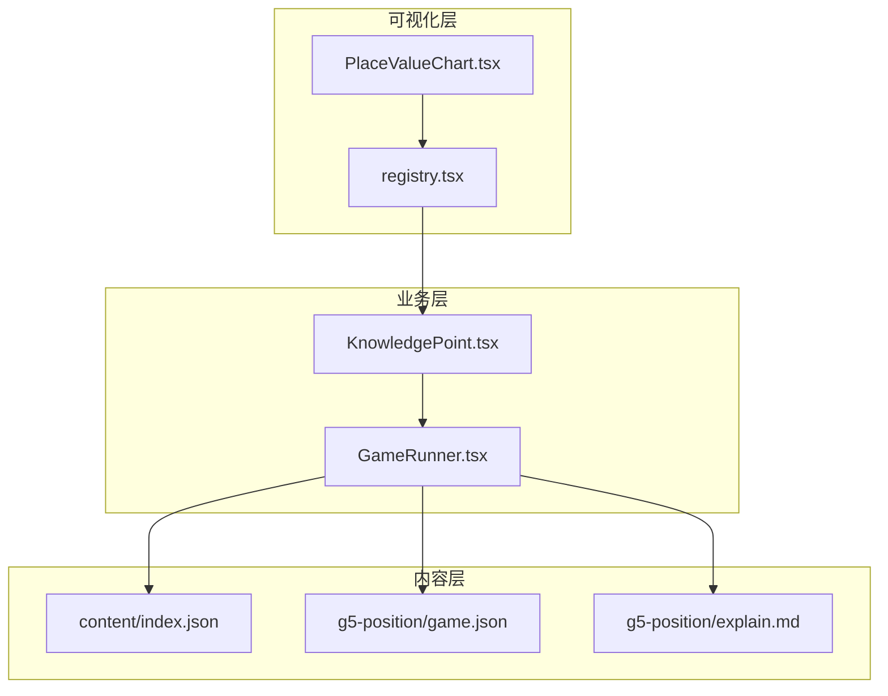
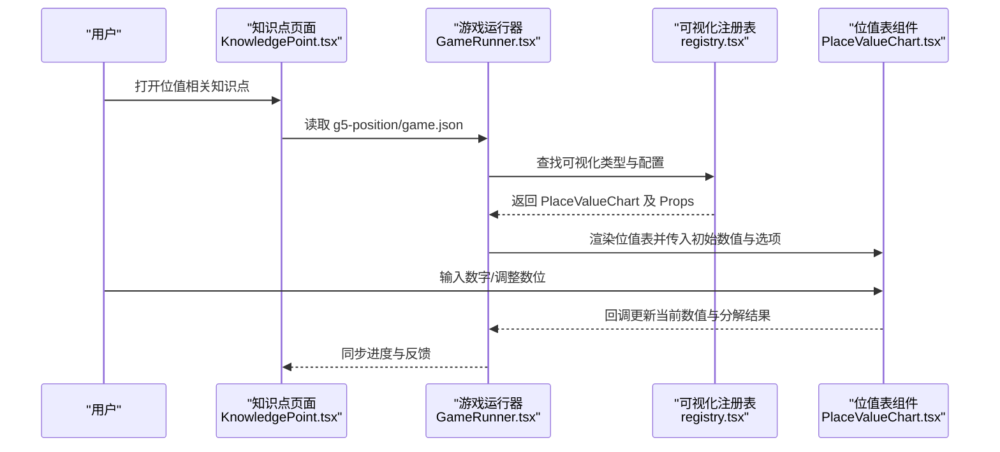
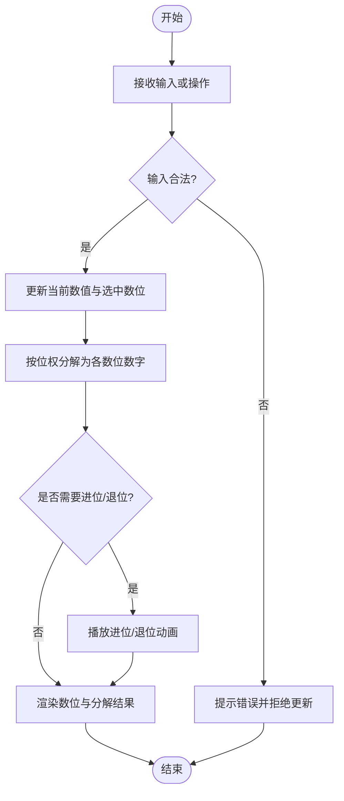
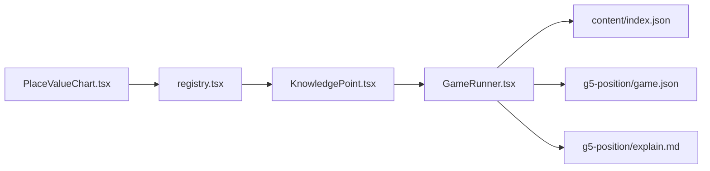

# 位值表工具

<cite>
**本文引用的文件**   
- [PlaceValueChart.tsx](file://src/visualizations/PlaceValueChart.tsx)
- [registry.tsx](file://src/visualizations/registry.tsx)
- [KnowledgePoint.tsx](file://src/components/KnowledgePoint.tsx)
- [GameRunner.tsx](file://src/components/GameRunner.tsx)
- [content/index.json](file://src/content/index.json)
- [g5-position/game.json](file://src/content/knowledge-points/g5-position/game.json)
- [g5-position/explain.md](file://src/content/knowledge-points/g5-position/explain.md)
</cite>

## 目录
1. [简介](#简介)
2. [项目结构](#项目结构)
3. [核心组件](#核心组件)
4. [架构总览](#架构总览)
5. [详细组件分析](#详细组件分析)
6. [依赖关系分析](#依赖关系分析)
7. [性能考量](#性能考量)
8. [故障排查指南](#故障排查指南)
9. [结论](#结论)
10. [附录](#附录)

## 简介
本技术文档围绕 PlaceValueChart 位值表组件，系统阐述其在数学教学中的可视化实现与交互设计。内容涵盖：
- 位值概念的可视化：个位、十位、百位、千位等数位的表示与数值分解
- 交互功能：数字输入、位值操作、进位退位演示、数值分解重组
- Props 配置：位数范围、显示格式、颜色编码、动画效果、语言设置
- 数学概念教学：位值原理、数的组成与分解、大小比较、四舍五入
- 学习辅助：位值概念解释、操作步骤指导、错误分析
- 多进制支持：二进制、八进制、十六进制的转换演示（扩展能力）

## 项目结构
PlaceValueChart 位于可视化模块中，通过注册机制被知识点对应的游戏或讲解页面调用。其关键位置与关联如下：
- 可视化组件：src/visualizations/PlaceValueChart.tsx
- 可视化注册：src/visualizations/registry.tsx
- 知识点集成：src/components/KnowledgePoint.tsx
- 游戏运行器：src/components/GameRunner.tsx
- 内容索引：src/content/index.json
- 位值相关知识点配置与说明：src/content/knowledge-points/g5-position/game.json, explain.md

图表来源
- [PlaceValueChart.tsx](file://src/visualizations/PlaceValueChart.tsx)
- [registry.tsx](file://src/visualizations/registry.tsx)
- [KnowledgePoint.tsx](file://src/components/KnowledgePoint.tsx)
- [GameRunner.tsx](file://src/components/GameRunner.tsx)
- [content/index.json](file://src/content/index.json)
- [g5-position/game.json](file://src/content/knowledge-points/g5-position/game.json)
- [g5-position/explain.md](file://src/content/knowledge-points/g5-position/explain.md)

章节来源
- [PlaceValueChart.tsx](file://src/visualizations/PlaceValueChart.tsx)
- [registry.tsx](file://src/visualizations/registry.tsx)
- [KnowledgePoint.tsx](file://src/components/KnowledgePoint.tsx)
- [GameRunner.tsx](file://src/components/GameRunner.tsx)
- [content/index.json](file://src/content/index.json)
- [g5-position/game.json](file://src/content/knowledge-points/g5-position/game.json)
- [g5-position/explain.md](file://src/content/knowledge-points/g5-position/explain.md)

## 核心组件
PlaceValueChart 是用于展示和交互位值表的可视化组件，主要职责包括：
- 渲染数位列（如个位、十位、百位、千位），并以视觉方式体现每个数位的权重
- 接收外部传入的数值并分解为各数位上的数字
- 提供用户交互：输入数字、增减某一位的值、触发进位/退位演示、展示数值分解与重组
- 根据配置项控制显示格式、颜色编码、动画时长与语言文本

该组件通常以受控模式工作，由上层容器（如 KnowledgePoint 或 GameRunner）管理状态并通过 Props 驱动 UI。

章节来源
- [PlaceValueChart.tsx](file://src/visualizations/PlaceValueChart.tsx)

## 架构总览
从整体架构看，PlaceValueChart 作为可复用可视化组件，被知识点页面和游戏运行器按需加载。内容侧通过 JSON 配置指定使用的可视化类型与参数，运行时解析后注入到组件中。

图表来源
- [KnowledgePoint.tsx](file://src/components/KnowledgePoint.tsx)
- [GameRunner.tsx](file://src/components/GameRunner.tsx)
- [registry.tsx](file://src/visualizations/registry.tsx)
- [PlaceValueChart.tsx](file://src/visualizations/PlaceValueChart.tsx)
- [g5-position/game.json](file://src/content/knowledge-points/g5-position/game.json)

## 详细组件分析

### 数据模型与状态
- 数位数组：按权重从高到低排列（例如千、百、十、个），每个元素包含数位名称、权重、当前数字
- 数值分解：将整数按位权展开为各数位数字之和
- 交互状态：当前输入值、选中数位、是否处于演示模式（进位/退位）、动画进行中标志
- 配置项：最大位数、最小位数、显示格式（是否显示前导零）、颜色映射（不同数位使用不同颜色）、动画时长、语言键值

复杂度分析：
- 数值分解时间复杂度 O(d)，d 为数位个数
- 进位/退位处理在单个数位上为 O(1)，跨位传播最多 O(d)

章节来源
- [PlaceValueChart.tsx](file://src/visualizations/PlaceValueChart.tsx)

### 交互流程与算法
- 数字输入：校验输入合法性（非负整数、不超过最大位数限制），更新状态并重新计算数位分解
- 位值操作：点击某一位进行增减，若超过 9 则触发进位；小于 0 则触发退位
- 进位/退位演示：通过动画逐步展示“满十进一”“借一当十”的过程，帮助理解位值原理
- 数值分解重组：将原数拆分为各数位贡献的和，再允许用户重新组合验证

图表来源
- [PlaceValueChart.tsx](file://src/visualizations/PlaceValueChart.tsx)

章节来源
- [PlaceValueChart.tsx](file://src/visualizations/PlaceValueChart.tsx)

### Props 配置选项
以下为常见配置项及其作用（具体字段名以实际实现为准）：
- maxDigits/minDigits：最大/最小位数，控制数位列数量
- format：显示格式，如是否显示千分位分隔符、是否显示前导零
- colors：数位颜色映射，便于区分不同权重
- animationDuration：动画时长，影响进位/退位演示速度
- locale：语言设置，影响数位名称与提示文本
- initialValue：初始数值，用于首次渲染
- onChange：数值变化回调，供父组件同步状态
- readOnly：只读模式，禁用用户交互
- showDecomposition：是否显示数值分解表达式
- showAnimation：是否启用动画演示

章节来源
- [PlaceValueChart.tsx](file://src/visualizations/PlaceValueChart.tsx)

### 数学概念教学与学习辅助
- 位值原理：通过数位权重直观展示“同一数字在不同位置代表不同值”
- 数的组成与分解：将大数拆解为各数位贡献之和，帮助学生理解加法与乘法分配律
- 大小比较：基于最高位优先原则，逐位比较两数大小
- 四舍五入：演示按指定位数取近似值的规则与过程
- 学习辅助：
  - 概念解释：在界面旁提供位值定义与示例
  - 步骤指导：分步引导用户完成进位/退位操作
  - 错误分析：对非法输入或逻辑错误给出针对性提示

章节来源
- [PlaceValueChart.tsx](file://src/visualizations/PlaceValueChart.tsx)
- [g5-position/explain.md](file://src/content/knowledge-points/g5-position/explain.md)

### 多进制支持（扩展能力）
- 目标：支持二进制、八进制、十六进制的输入与显示，并进行相互转换
- 实现思路：
  - 扩展数位权重体系，适配不同基数（如 2、8、16）
  - 增加进制选择器与转换按钮
  - 在进位/退位演示中切换规则（如二进制逢二进一）
- 教学价值：帮助学生理解不同进制的位值含义与转换规律

章节来源
- [PlaceValueChart.tsx](file://src/visualizations/PlaceValueChart.tsx)

## 依赖关系分析
PlaceValueChart 的依赖主要集中在可视化注册表与上层容器组件。内容侧通过 JSON 配置驱动组件行为。

图表来源
- [PlaceValueChart.tsx](file://src/visualizations/PlaceValueChart.tsx)
- [registry.tsx](file://src/visualizations/registry.tsx)
- [KnowledgePoint.tsx](file://src/components/KnowledgePoint.tsx)
- [GameRunner.tsx](file://src/components/GameRunner.tsx)
- [content/index.json](file://src/content/index.json)
- [g5-position/game.json](file://src/content/knowledge-points/g5-position/game.json)
- [g5-position/explain.md](file://src/content/knowledge-points/g5-position/explain.md)

章节来源
- [registry.tsx](file://src/visualizations/registry.tsx)
- [GameRunner.tsx](file://src/components/GameRunner.tsx)
- [content/index.json](file://src/content/index.json)
- [g5-position/game.json](file://src/content/knowledge-points/g5-position/game.json)

## 性能考量
- 数位分解与渲染：O(d) 复杂度，d 为数位个数，通常较小，性能开销低
- 动画控制：合理设置 animationDuration，避免频繁重绘导致卡顿
- 状态更新：采用受控模式，减少不必要的重渲染；必要时对子组件进行 memoization
- 内存占用：避免在每次渲染时创建大型中间对象，尽量复用数据结构

[本节为通用性能建议，不直接分析具体文件]

## 故障排查指南
常见问题与解决思路：
- 输入非法：确保输入为非负整数且不超过最大位数限制；检查 onChange 回调是否正确更新父组件状态
- 进位/退位异常：核对数位权重与边界条件（如 9+1=10，借位时的借源是否存在）
- 动画不生效：确认 showAnimation 与 animationDuration 配置正确；检查浏览器是否支持相应动画 API
- 语言文本缺失：检查 locale 配置与本地化资源是否完整加载

章节来源
- [PlaceValueChart.tsx](file://src/visualizations/PlaceValueChart.tsx)

## 结论
PlaceValueChart 位值表组件通过直观的数位可视化与丰富的交互，有效支撑位值概念的教学与练习。其模块化设计与可配置性使其易于集成到知识点页面与游戏中，并为多进制扩展提供了良好基础。建议在后续迭代中进一步完善错误分析与自适应布局，以提升用户体验与教学成效。

[本节为总结性内容，不直接分析具体文件]

## 附录
- 推荐学习路径：
  - 先掌握位值原理与数位权重
  - 通过进位/退位演示理解运算规则
  - 尝试数值分解与重组练习
  - 探索多进制转换与应用场景

[本节为补充信息，不直接分析具体文件]