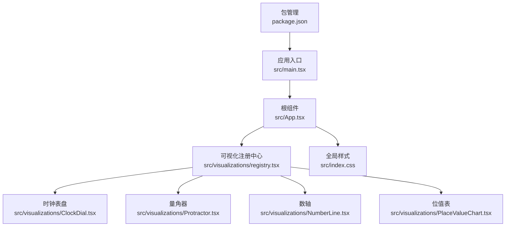
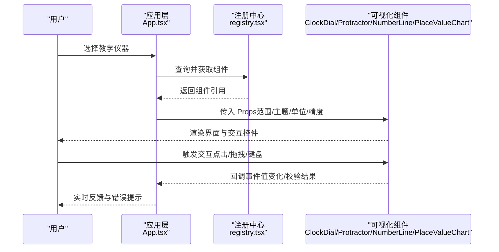
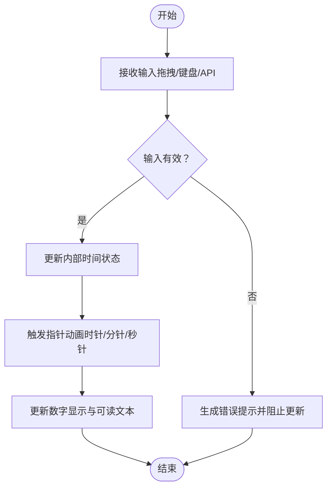
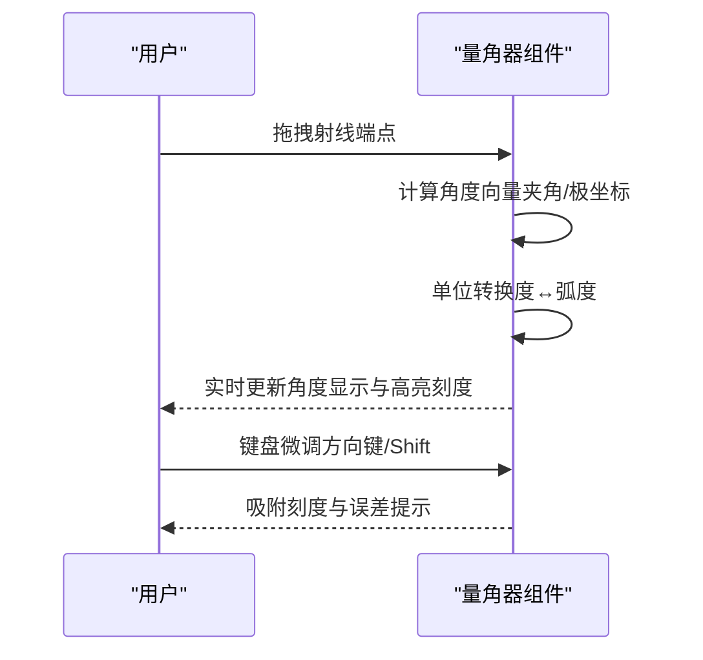
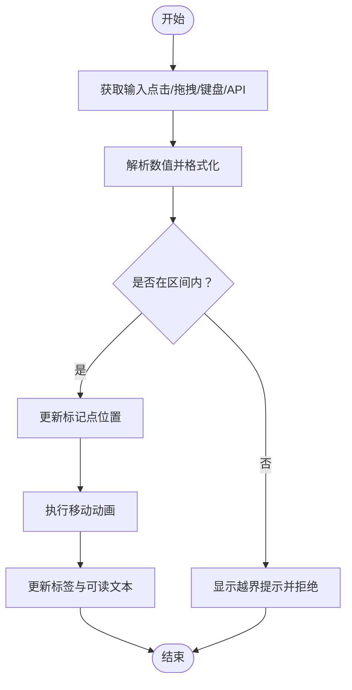
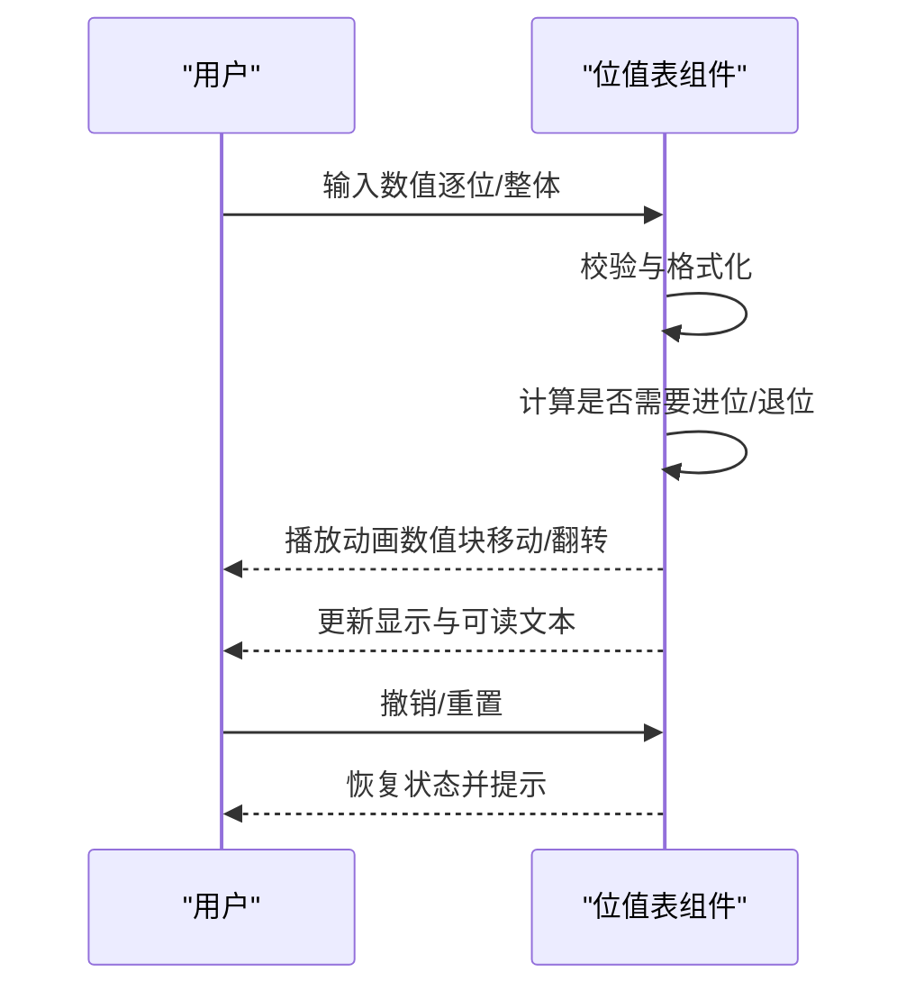
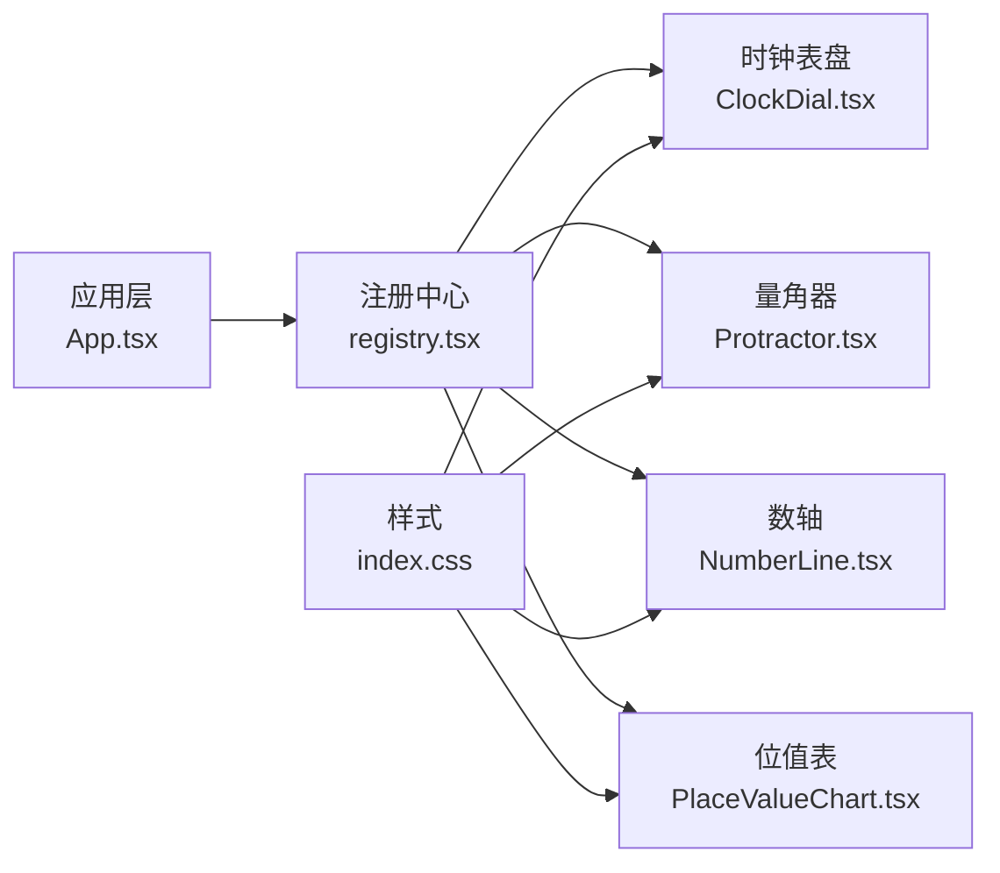

# 数学仪器工具

<cite>
**本文档引用的文件**   
- [ClockDial.tsx](file://src/visualizations/ClockDial.tsx)
- [Protractor.tsx](file://src/visualizations/Protractor.tsx)
- [NumberLine.tsx](file://src/visualizations/NumberLine.tsx)
- [PlaceValueChart.tsx](file://src/visualizations/PlaceValueChart.tsx)
- [registry.tsx](file://src/visualizations/registry.tsx)
- [App.tsx](file://src/App.tsx)
- [main.tsx](file://src/main.tsx)
- [index.css](file://src/index.css)
- [package.json](file://package.json)
</cite>

## 目录
1. [简介](#简介)
2. [项目结构](#项目结构)
3. [核心组件](#核心组件)
4. [架构总览](#架构总览)
5. [详细组件分析](#详细组件分析)
6. [依赖关系分析](#依赖关系分析)
7. [性能考量](#性能考量)
8. [故障排查指南](#故障排查指南)
9. [结论](#结论)
10. [附录](#附录)

## 简介
本技术文档面向 math-k6 项目的“数学仪器工具”模块，聚焦于以下教学仪器的模拟实现与交互设计：时钟表盘、量角器、数轴与位值表。文档从系统架构、组件职责、数据流、交互逻辑、Props 配置、输入验证、实时反馈、错误提示、动画效果以及无障碍访问等方面进行全面说明，帮助开发者快速理解并扩展这些教学可视化组件。

## 项目结构
math-k6 采用基于功能域的模块化组织方式，核心可视化组件集中于 src/visualizations 目录，并通过注册机制对外暴露。应用入口位于 src/main.tsx，顶层路由与页面挂载在 src/App.tsx。样式通过 src/index.css 统一管理。包管理与依赖由 package.json 定义。

图表来源
- [main.tsx](file://src/main.tsx)
- [App.tsx](file://src/App.tsx)
- [registry.tsx](file://src/visualizations/registry.tsx)
- [ClockDial.tsx](file://src/visualizations/ClockDial.tsx)
- [Protractor.tsx](file://src/visualizations/Protractor.tsx)
- [NumberLine.tsx](file://src/visualizations/NumberLine.tsx)
- [PlaceValueChart.tsx](file://src/visualizations/PlaceValueChart.tsx)
- [index.css](file://src/index.css)
- [package.json](file://package.json)

章节来源
- [main.tsx](file://src/main.tsx)
- [App.tsx](file://src/App.tsx)
- [registry.tsx](file://src/visualizations/registry.tsx)
- [index.css](file://src/index.css)
- [package.json](file://package.json)

## 核心组件
本节概述四个核心教学仪器的职责与能力边界：
- 时钟表盘：用于时间认知与读写训练，支持时针、分针、秒针的旋转动画与刻度高亮。
- 量角器：用于角度测量练习，支持拖拽射线、角度显示与单位切换（度/弧度）。
- 数轴：用于数值定位与运算可视化，支持区间设置、步进精度、动态标记与动画过渡。
- 位值表：用于位值概念与整十百千万操作，支持数位输入、进位/退位演示与即时反馈。

章节来源
- [ClockDial.tsx](file://src/visualizations/ClockDial.tsx)
- [Protractor.tsx](file://src/visualizations/Protractor.tsx)
- [NumberLine.tsx](file://src/visualizations/NumberLine.tsx)
- [PlaceValueChart.tsx](file://src/visualizations/PlaceValueChart.tsx)

## 架构总览
可视化组件通过 registry.tsx 统一注册，供上层页面按需加载渲染。每个组件遵循一致的 Props 契约，便于主题化与参数化配置。状态更新与用户交互在各组件内部处理，必要时通过回调向父级上报结果。

图表来源
- [App.tsx](file://src/App.tsx)
- [registry.tsx](file://src/visualizations/registry.tsx)
- [ClockDial.tsx](file://src/visualizations/ClockDial.tsx)
- [Protractor.tsx](file://src/visualizations/Protractor.tsx)
- [NumberLine.tsx](file://src/visualizations/NumberLine.tsx)
- [PlaceValueChart.tsx](file://src/visualizations/PlaceValueChart.tsx)

## 详细组件分析

### 时钟表盘（ClockDial）
- 功能要点
  - 指针动画：时针、分针、秒针平滑旋转，支持缓动与速度控制。
  - 刻度高亮：整点/半点/分钟刻度可高亮，辅助读时训练。
  - 时间设置：支持小时、分钟、秒的独立或联动设置。
  - 单位与主题：支持 12/24 小时制、颜色主题切换。
- 交互逻辑
  - 鼠标/触摸拖拽指针或刻度区域设置时间。
  - 键盘导航：Tab 聚焦指针，方向键微调时间，Enter 确认。
  - 实时反馈：当前时间数字显示与语音朗读（可选）。
- 输入验证与错误提示
  - 超出范围自动回绕（如 60 分钟归零进位）。
  - 非法输入（非数字）提示并拒绝更新。
- 动画与无障碍
  - 使用 CSS transform 或 requestAnimationFrame 驱动指针动画。
  - aria-label 描述当前时间，role="meter" 或自定义语义。
- Props 配置（示例字段）
  - 范围：hourMode(12|24)、minuteStep、secondStep
  - 主题：colors.primary、colors.secondary、theme.light/dark
  - 精度：showSeconds、precision.secondDigits
  - 行为：animateDuration、snapToTick、readOnly
- 关键流程（时间设置）

图表来源
- [ClockDial.tsx](file://src/visualizations/ClockDial.tsx)

章节来源
- [ClockDial.tsx](file://src/visualizations/ClockDial.tsx)

### 量角器（Protractor）
- 功能要点
  - 角度测量：拖拽射线端点或顶点调整角度，实时显示度数。
  - 单位切换：度与弧度互转，支持小数精度控制。
  - 刻度与网格：半圆刻度、主刻度高亮、参考线辅助对齐。
- 交互逻辑
  - 拖拽射线：鼠标/触摸拖动改变角度；释放后吸附到最近刻度（可选）。
  - 键盘导航：方向键微调角度，Shift 加速，Enter 确认。
  - 实时反馈：角度数值、误差提示、对齐指示。
- 输入验证与错误提示
  - 角度范围限制（0–180° 或 0–360°），越界自动裁剪。
  - 非法输入（NaN/空值）提示并恢复上次有效值。
- 动画与无障碍
  - 射线旋转使用 transform 过渡，避免重排。
  - aria-live 播报角度变化，focusable 射线端点。
- Props 配置（示例字段）
  - 范围：minAngle、maxAngle、unit(deg|rad)
  - 精度：decimalPlaces、snapEnabled、snapStep
  - 主题：colors.scale、colors.ray、theme.light/dark
  - 行为：readOnly、showGrid、showReferenceLines
- 关键流程（角度测量）

图表来源
- [Protractor.tsx](file://src/visualizations/Protractor.tsx)

章节来源
- [Protractor.tsx](file://src/visualizations/Protractor.tsx)

### 数轴（NumberLine）
- 功能要点
  - 数值定位：在指定区间内放置标记点，支持整数/小数步进。
  - 运算可视化：加减乘除过程用箭头与区间表示。
  - 动态更新：数值变化带动画过渡，保持视觉一致性。
- 交互逻辑
  - 点击/拖拽放置标记点；双击编辑数值。
  - 键盘导航：Tab 聚焦标记点，方向键移动，Enter 进入编辑模式。
  - 实时反馈：数值标签、区间高亮、错误提示（越界/格式错误）。
- 输入验证与错误提示
  - 区间边界检查、步进精度校验、非法字符过滤。
  - 提供撤销/重置操作，防止误操作。
- 动画与无障碍
  - 标记点移动使用 CSS transition 或 requestAnimationFrame。
  - aria-describedby 关联数值说明，role="slider" 语义。
- Props 配置（示例字段）
  - 范围：min、max、step、unit
  - 精度：decimalPlaces、formatLocale
  - 主题：colors.axis、colors.tick、colors.marker、theme.light/dark
  - 行为：readOnly、snapToStep、showLabels、animateDuration
- 关键流程（数值输入与定位）

图表来源
- [NumberLine.tsx](file://src/visualizations/NumberLine.tsx)

章节来源
- [NumberLine.tsx](file://src/visualizations/NumberLine.tsx)

### 位值表（PlaceValueChart）
- 功能要点
  - 数位展示：个、十、百、千、万等位值列，支持正负数与小数。
  - 进位/退位演示：通过动画展示借位与进位过程。
  - 数值输入：逐位输入或整体输入，自动对齐与格式化。
- 交互逻辑
  - 点击数位单元格输入数字；拖拽跨位移动数值块。
  - 键盘导航：Tab 聚焦单元格，方向键移动焦点，Enter 确认。
  - 实时反馈：进位/退位提示、错误提示（非法输入）、完成提示。
- 输入验证与错误提示
  - 每位仅允许 0–9，超范围自动修正或提示。
  - 整体数值合法性校验（如前导零处理）。
- 动画与无障碍
  - 数值块移动与翻转动画，强调位值变化。
  - aria-live 播报位值变化，role="grid" 与单元格语义。
- Props 配置（示例字段）
  - 范围：digits、allowNegative、allowDecimal、maxDigits
  - 精度：decimalPlaces、thousandsSeparator
  - 主题：colors.cell、colors.block、colors.highlight、theme.light/dark
  - 行为：readOnly、animateDuration、showCarryBorrow、autoFormat
- 关键流程（进位/退位演示）

图表来源
- [PlaceValueChart.tsx](file://src/visualizations/PlaceValueChart.tsx)

章节来源
- [PlaceValueChart.tsx](file://src/visualizations/PlaceValueChart.tsx)

## 依赖关系分析
各可视化组件通过 registry.tsx 统一注册，供上层按需加载。组件之间无直接耦合，依赖注入通过 Props 完成。样式与主题通过 index.css 与组件内主题对象共同管理。

图表来源
- [registry.tsx](file://src/visualizations/registry.tsx)
- [App.tsx](file://src/App.tsx)
- [ClockDial.tsx](file://src/visualizations/ClockDial.tsx)
- [Protractor.tsx](file://src/visualizations/Protractor.tsx)
- [NumberLine.tsx](file://src/visualizations/NumberLine.tsx)
- [PlaceValueChart.tsx](file://src/visualizations/PlaceValueChart.tsx)
- [index.css](file://src/index.css)

章节来源
- [registry.tsx](file://src/visualizations/registry.tsx)
- [App.tsx](file://src/App.tsx)
- [index.css](file://src/index.css)

## 性能考量
- 渲染优化
  - 使用 React.memo 包裹纯展示部分，减少不必要的重渲染。
  - 将频繁更新的动画状态与 UI 状态分离，避免阻塞主线程。
- 动画性能
  - 优先使用 CSS transform 与 opacity 进行动画，避免布局抖动。
  - 对复杂动画使用 requestAnimationFrame 分批更新。
- 内存与资源
  - 组件卸载时清理事件监听与定时器，防止内存泄漏。
  - 大尺寸 SVG/Canvas 按需绘制，避免一次性构建全部元素。
- 可访问性
  - 确保键盘可达性与屏幕阅读器友好，提供合适的 aria-* 属性。
  - 为动画提供 prefers-reduced-motion 媒体查询降级策略。

[本节为通用指导，不直接分析具体文件]

## 故障排查指南
- 常见问题
  - 指针/射线未响应：检查事件绑定与 pointer events 兼容性。
  - 动画卡顿：确认是否触发了强制同步布局，改用 transform。
  - 数值越界：检查 Props 的范围配置与输入校验逻辑。
  - 主题不生效：确认 CSS 变量与组件主题对象的一致性。
- 调试建议
  - 在组件内部添加日志输出关键状态变化。
  - 使用浏览器开发者工具的 Performance 面板分析帧率。
  - 启用 Accessibility 面板验证语义与焦点顺序。
- 错误提示机制
  - 对用户输入进行即时校验，提供明确且友好的提示信息。
  - 对于不可恢复的错误，提供重置按钮与回滚操作。

章节来源
- [ClockDial.tsx](file://src/visualizations/ClockDial.tsx)
- [Protractor.tsx](file://src/visualizations/Protractor.tsx)
- [NumberLine.tsx](file://src/visualizations/NumberLine.tsx)
- [PlaceValueChart.tsx](file://src/visualizations/PlaceValueChart.tsx)

## 结论
math-k6 的数学仪器工具通过统一的注册机制与清晰的 Props 契约，实现了时钟表盘、量角器、数轴与位值表的模块化与可扩展性。各组件在交互逻辑、输入验证、实时反馈、动画效果与无障碍访问方面均具备完善的实现思路与实践建议。开发者可在此基础上进一步丰富教学内容与用户体验。

[本节为总结性内容，不直接分析具体文件]

## 附录
- 安装与运行
  - 使用包管理器安装依赖并启动开发服务器。
  - 配置文件位于 package.json 与 vite.config.ts。
- 主题与样式
  - 全局样式在 index.css 中定义，组件内可通过主题对象覆盖。
- 扩展新仪器
  - 在 registry.tsx 中注册新组件，遵循 Props 契约与无障碍规范。
  - 在 App.tsx 中添加路由与页面集成。

章节来源
- [package.json](file://package.json)
- [index.css](file://src/index.css)
- [registry.tsx](file://src/visualizations/registry.tsx)
- [App.tsx](file://src/App.tsx)