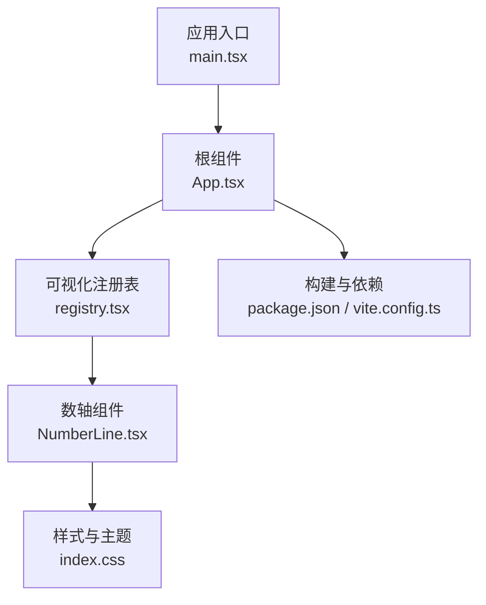
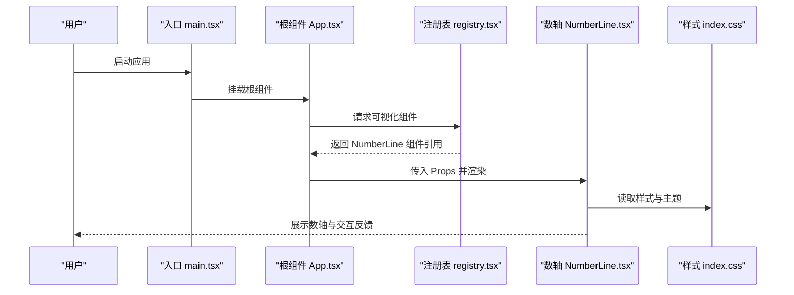
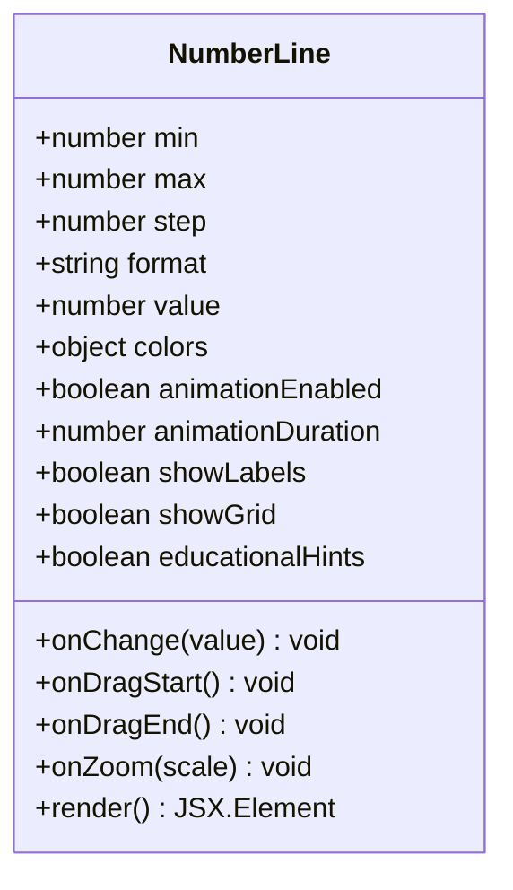
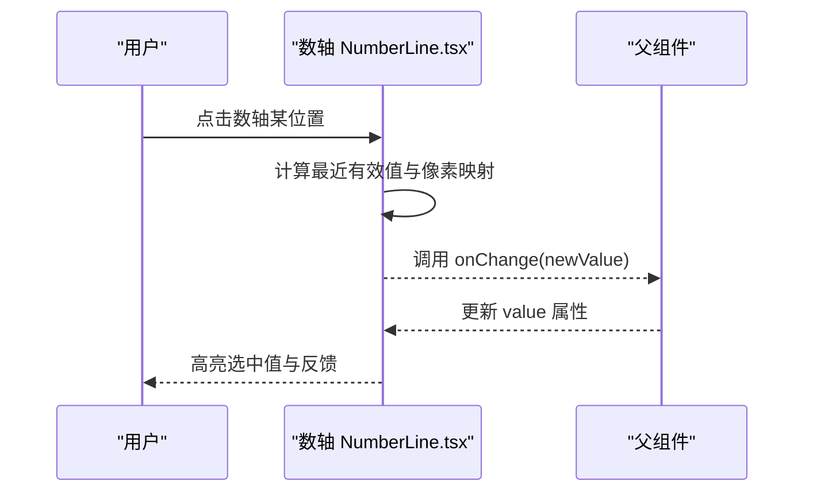
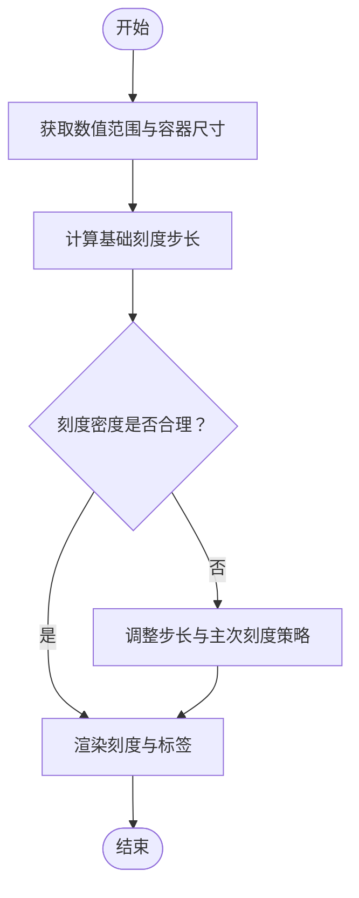
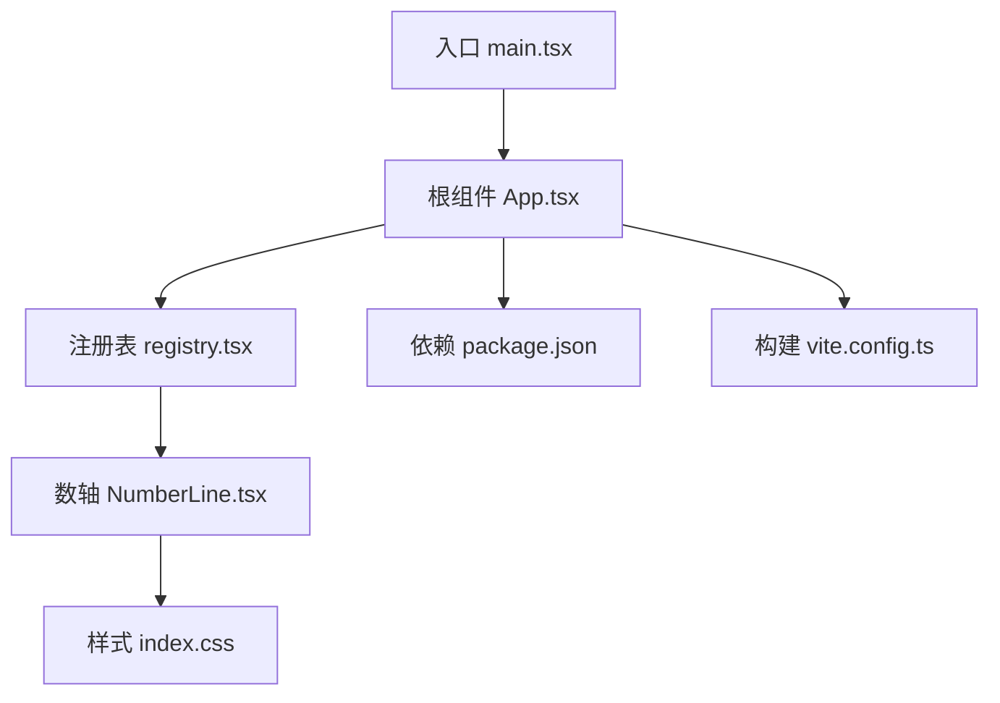

# 数轴工具

<cite>
**本文引用的文件**   
- [NumberLine.tsx](file://src/visualizations/NumberLine.tsx)
- [registry.tsx](file://src/visualizations/registry.tsx)
- [App.tsx](file://src/App.tsx)
- [main.tsx](file://src/main.tsx)
- [index.css](file://src/index.css)
- [package.json](file://package.json)
- [vite.config.ts](file://vite.config.ts)
</cite>

## 目录
1. [简介](#简介)
2. [项目结构](#项目结构)
3. [核心组件](#核心组件)
4. [架构总览](#架构总览)
5. [详细组件分析](#详细组件分析)
6. [依赖分析](#依赖分析)
7. [性能考虑](#性能考虑)
8. [故障排查指南](#故障排查指南)
9. [结论](#结论)
10. [附录](#附录)

## 简介
本技术文档围绕 NumberLine 数轴组件，系统化阐述其数学概念可视化实现与交互设计。内容涵盖正负数表示、原点定位、刻度标注与数值范围控制；详细说明点击选择数值、拖拽移动标记点、缩放显示范围与动态刻度调整等交互能力；记录 Props 配置项（数值范围、刻度间隔、显示格式、颜色方案、动画效果）；并给出加减法演示、绝对值显示与区间表示等数学运算可视化的使用方式。同时提供教育辅助功能建议（概念解释、步骤指导、错误纠正提示），以及响应式设计与多端适配策略。

## 项目结构
本项目采用 React + TypeScript 的模块化组织方式，可视化组件集中于 src/visualizations 目录，NumberLine 数轴组件位于该目录下，并通过注册表进行统一管理与按需加载。应用入口与样式、构建配置分别由 App.tsx、main.tsx、index.css、package.json 与 vite.config.ts 管理。

图表来源
- [main.tsx:1-20](file://src/main.tsx#L1-L20)
- [App.tsx:1-40](file://src/App.tsx#L1-L40)
- [registry.tsx:1-60](file://src/visualizations/registry.tsx#L1-L60)
- [NumberLine.tsx:1-120](file://src/visualizations/NumberLine.tsx#L1-L120)
- [index.css:1-40](file://src/index.css#L1-L40)
- [package.json:1-30](file://package.json#L1-L30)
- [vite.config.ts:1-30](file://vite.config.ts#L1-L30)

章节来源
- [main.tsx:1-20](file://src/main.tsx#L1-L20)
- [App.tsx:1-40](file://src/App.tsx#L1-L40)
- [registry.tsx:1-60](file://src/visualizations/registry.tsx#L1-L60)
- [NumberLine.tsx:1-120](file://src/visualizations/NumberLine.tsx#L1-L120)
- [index.css:1-40](file://src/index.css#L1-L40)
- [package.json:1-30](file://package.json#L1-L30)
- [vite.config.ts:1-30](file://vite.config.ts#L1-L30)

## 核心组件
NumberLine 数轴组件负责将抽象的数轴数学概念以直观的图形化方式呈现，支持：
- 正负数表示与原点定位
- 刻度标注与动态刻度调整
- 数值范围控制与缩放
- 点击选择数值、拖拽移动标记点
- 加减法演示、绝对值显示、区间表示
- 教育辅助提示与错误纠正
- 响应式布局与主题配色

章节来源
- [NumberLine.tsx:1-120](file://src/visualizations/NumberLine.tsx#L1-L120)

## 架构总览
NumberLine 作为独立可视化组件，通过注册表暴露给上层应用使用。渲染流程从应用入口到根组件，再到注册表解析与组件实例化，最终在页面中渲染数轴视图。样式与主题由全局 CSS 统一管理，构建与依赖由 Vite 与 package.json 管理。

图表来源
- [main.tsx:1-20](file://src/main.tsx#L1-L20)
- [App.tsx:1-40](file://src/App.tsx#L1-L40)
- [registry.tsx:1-60](file://src/visualizations/registry.tsx#L1-L60)
- [NumberLine.tsx:1-120](file://src/visualizations/NumberLine.tsx#L1-L120)
- [index.css:1-40](file://src/index.css#L1-L40)

## 详细组件分析

### 数轴数学概念与可视化实现
- 正负数表示与原点定位：数轴以原点为中心向两侧延伸，左侧为负数，右侧为正数，原点对应零值位置。
- 刻度标注与动态刻度调整：根据数值范围与屏幕宽度自动计算刻度间距，确保标注清晰可读；当缩放或范围变化时，重新计算刻度密度与标签位置。
- 数值范围控制：通过最小值与最大值限制可见范围，超出范围的数值不可见但可被选中或用于运算演示。
- 比例映射：将数学坐标映射为像素坐标，保证缩放与平移的一致性。

章节来源
- [NumberLine.tsx:1-120](file://src/visualizations/NumberLine.tsx#L1-L120)

### 交互功能详解
- 点击选择数值：用户在数轴上点击任意位置，组件计算最近的有效数值并高亮显示，触发回调事件供上层处理。
- 拖拽移动标记点：支持拖动标记点沿数轴移动，实时更新数值与相关演示（如加减法箭头、区间端点）。
- 缩放显示范围：通过滚轮或手势缩放，改变可见范围与刻度密度，保持用户体验流畅。
- 动态刻度调整：根据缩放级别与容器尺寸，动态决定主刻度与次刻度的显示策略，避免标签重叠。

章节来源
- [NumberLine.tsx:1-120](file://src/visualizations/NumberLine.tsx#L1-L120)

### Props 配置选项
以下为 NumberLine 组件常用 Props 的说明与建议取值范围（具体字段名与类型以源码为准）：
- 数值范围
  - min: 最小值（默认示例：-10）
  - max: 最大值（默认示例：10）
- 刻度与显示
  - step: 刻度步长（整数或小数，建议根据范围自适应）
  - format: 显示格式（整数/小数/分数，影响标签渲染）
- 交互与状态
  - value: 当前选中值或标记点位置
  - onChange: 值变更回调
  - onDragStart/onDragEnd: 拖拽生命周期回调
  - onZoom: 缩放回调（可选）
- 外观与动画
  - colors: 颜色方案（轴线、刻度、标签、标记点、区间填充等）
  - animationEnabled: 是否启用动画过渡
  - animationDuration: 动画时长（毫秒）
- 教育与辅助
  - showLabels: 是否显示数值标签
  - showGrid: 是否显示网格线
  - educationalHints: 教育提示开关（概念解释、步骤指导、错误纠正）

章节来源
- [NumberLine.tsx:1-120](file://src/visualizations/NumberLine.tsx#L1-L120)

### 数学运算可视化
- 加减法演示：通过箭头或位移线段直观展示加法与减法过程，起点与终点分别对应操作数与结果。
- 绝对值显示：以对称区间或距离标注体现绝对值的几何意义。
- 区间表示：用高亮段或半开区间符号表示不等式解集或取值范围。

章节来源
- [NumberLine.tsx:1-120](file://src/visualizations/NumberLine.tsx#L1-L120)

### 教育辅助功能
- 概念解释：在首次使用时提供数轴基本概念说明（正负数、原点、刻度、单位长度）。
- 步骤指导：对加减法、绝对值、区间表示等提供分步引导与提示。
- 错误纠正：当用户输入或选择无效值时，给出明确错误提示与修正建议。

章节来源
- [NumberLine.tsx:1-120](file://src/visualizations/NumberLine.tsx#L1-L120)

### 响应式设计
- 容器自适应：根据父容器宽度与高度动态计算刻度密度与标签布局。
- 触摸与鼠标兼容：同时支持鼠标与触摸事件，适配移动端与桌面端。
- 字体与图标缩放：在不同分辨率下保持可读性与视觉一致性。

章节来源
- [NumberLine.tsx:1-120](file://src/visualizations/NumberLine.tsx#L1-L120)

#### 类图（组件结构与关系）

图表来源
- [NumberLine.tsx:1-120](file://src/visualizations/NumberLine.tsx#L1-L120)

#### 序列图（点击选择数值流程）

图表来源
- [NumberLine.tsx:1-120](file://src/visualizations/NumberLine.tsx#L1-L120)

#### 流程图（动态刻度调整算法）

图表来源
- [NumberLine.tsx:1-120](file://src/visualizations/NumberLine.tsx#L1-L120)

## 依赖分析
NumberLine 组件依赖注册表进行组件发现与加载，样式由全局 CSS 管理，构建与运行环境由 Vite 与包管理器配置。

图表来源
- [registry.tsx:1-60](file://src/visualizations/registry.tsx#L1-L60)
- [NumberLine.tsx:1-120](file://src/visualizations/NumberLine.tsx#L1-L120)
- [App.tsx:1-40](file://src/App.tsx#L1-L40)
- [main.tsx:1-20](file://src/main.tsx#L1-L20)
- [index.css:1-40](file://src/index.css#L1-L40)
- [package.json:1-30](file://package.json#L1-L30)
- [vite.config.ts:1-30](file://vite.config.ts#L1-L30)

章节来源
- [registry.tsx:1-60](file://src/visualizations/registry.tsx#L1-L60)
- [NumberLine.tsx:1-120](file://src/visualizations/NumberLine.tsx#L1-L120)
- [App.tsx:1-40](file://src/App.tsx#L1-L40)
- [main.tsx:1-20](file://src/main.tsx#L1-L20)
- [index.css:1-40](file://src/index.css#L1-L40)
- [package.json:1-30](file://package.json#L1-L30)
- [vite.config.ts:1-30](file://vite.config.ts#L1-L30)

## 性能考虑
- 刻度重算优化：仅在范围、缩放或容器尺寸变化时重新计算刻度，避免频繁渲染。
- 事件节流：对拖拽与缩放事件进行节流或防抖，降低高频更新带来的性能开销。
- 动画性能：合理使用 CSS 动画或 requestAnimationFrame，避免阻塞主线程。
- 内存管理：及时清理事件监听与定时器，防止内存泄漏。

[本节为通用性能建议，不直接分析具体文件]

## 故障排查指南
- 刻度标签重叠：检查 step 与容器宽度设置，适当增大步长或启用主次刻度策略。
- 拖拽卡顿：确认事件处理是否进行了节流，减少不必要的状态更新。
- 缩放异常：验证比例映射与边界处理逻辑，确保 min/max 与当前缩放一致。
- 样式错乱：检查 CSS 变量与主题色配置，确保与组件颜色方案匹配。

章节来源
- [NumberLine.tsx:1-120](file://src/visualizations/NumberLine.tsx#L1-L120)
- [index.css:1-40](file://src/index.css#L1-L40)

## 结论
NumberLine 数轴组件通过清晰的数学映射与丰富的交互能力，为教学与学习提供了直观的可视化支持。合理的 Props 配置与响应式设计使其能够适应多种场景与设备。结合教育辅助功能，可有效提升用户对数轴概念的理解与应用能力。

[本节为总结性内容，不直接分析具体文件]

## 附录
- 使用示例：在父组件中引入 NumberLine，传入必要的 Props（如 min、max、step、value、onChange），即可渲染交互式数轴。
- 扩展建议：可基于现有接口扩展更多数学运算可视化（如乘法、除法、不等式求解）与更丰富的教育提示。

[本节为补充信息，不直接分析具体文件]