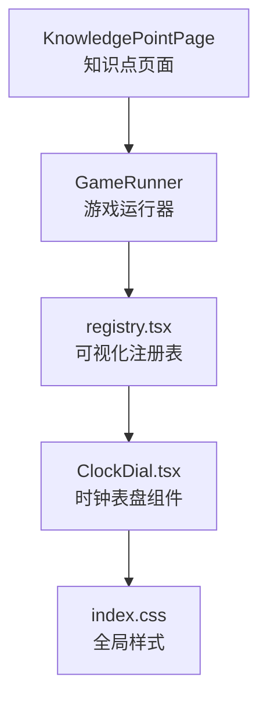
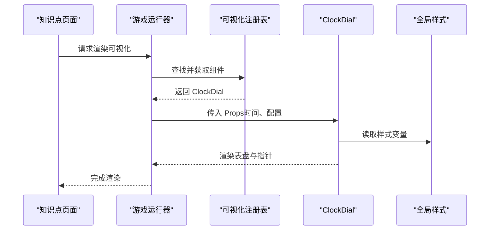
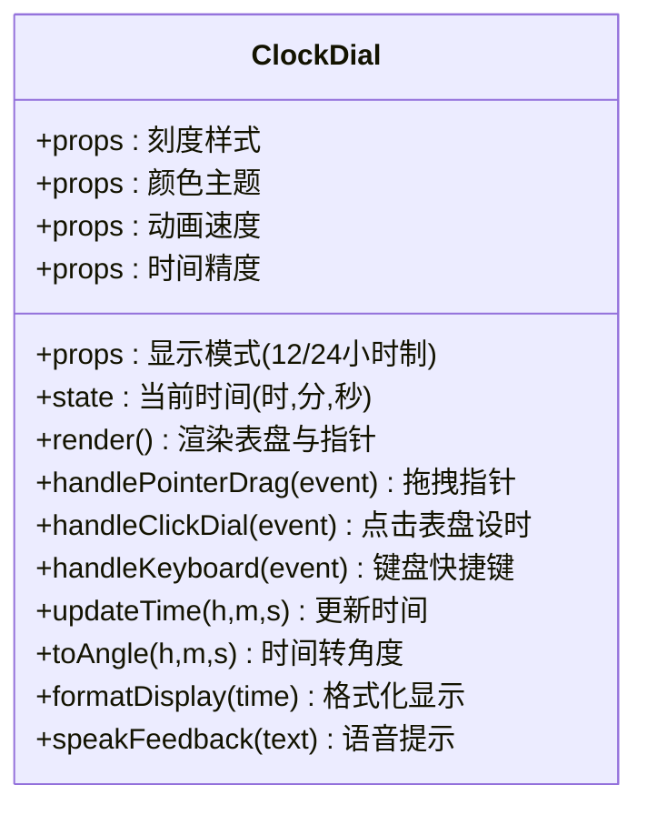
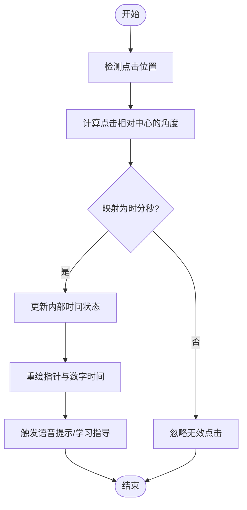
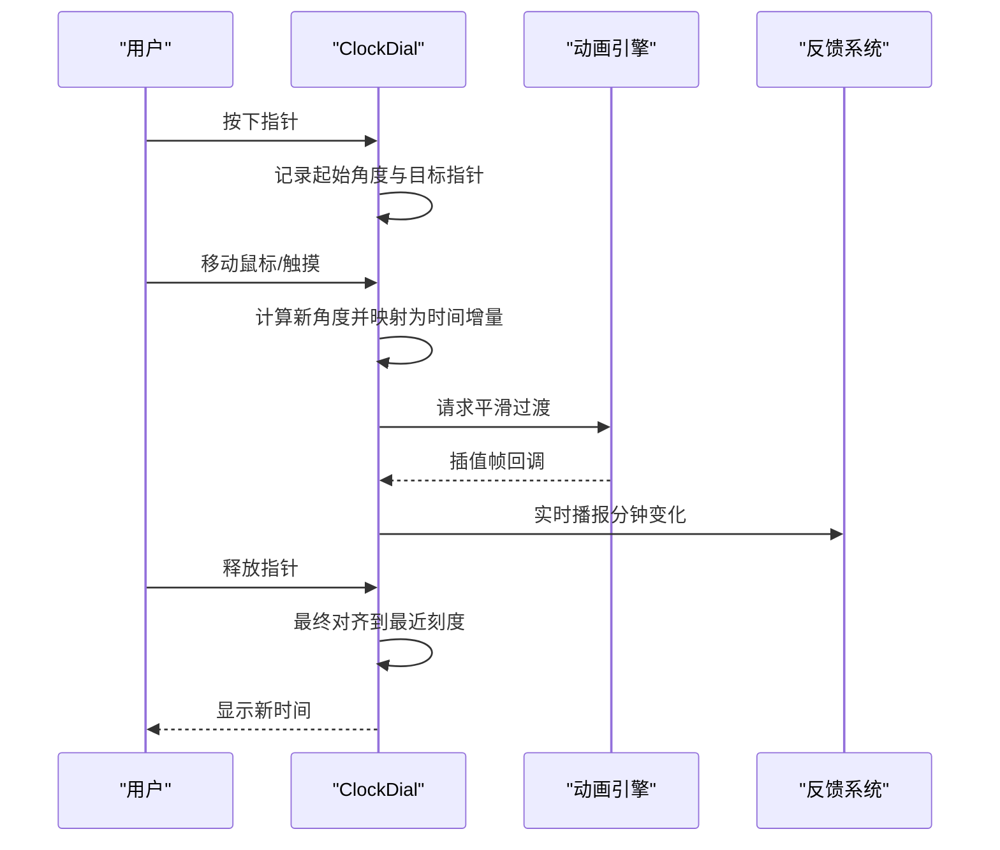
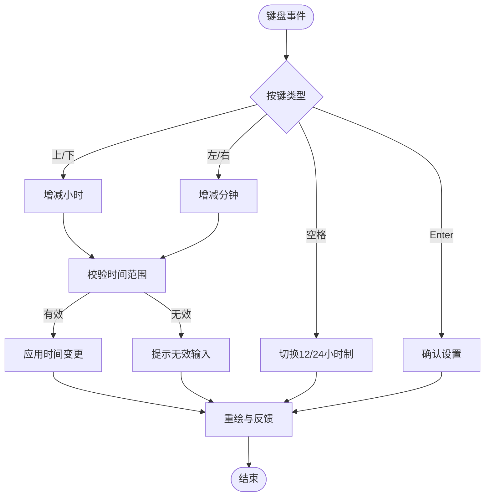
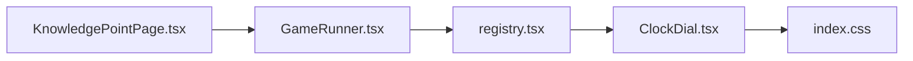

# 时钟表盘工具

<cite>
**本文引用的文件**   
- [ClockDial.tsx](file://src/visualizations/ClockDial.tsx)
- [registry.tsx](file://src/visualizations/registry.tsx)
- [KnowledgePointPage.tsx](file://src/pages/KnowledgePointPage.tsx)
- [GameRunner.tsx](file://src/components/GameRunner.tsx)
- [index.css](file://src/index.css)
</cite>

## 目录
1. [简介](#简介)
2. [项目结构](#项目结构)
3. [核心组件](#核心组件)
4. [架构总览](#架构总览)
5. [详细组件分析](#详细组件分析)
6. [依赖关系分析](#依赖关系分析)
7. [性能考量](#性能考量)
8. [故障排查指南](#故障排查指南)
9. [结论](#结论)
10. [附录](#附录)

## 简介
本技术文档围绕 ClockDial 时钟表盘组件，系统性阐述其模拟实现与交互逻辑。内容涵盖时针、分针、秒针的旋转动画与事件处理；时间设置能力（点击表盘设时、拖拽指针调时、键盘快捷键）；Props 配置项（显示模式、刻度样式、颜色主题、动画速度、时间精度）；输入校验机制；实时反馈（数字时间显示、语音提示、学习指导）；以及无障碍访问支持（屏幕阅读器兼容、键盘导航）。读者可据此理解组件在知识图谱中的定位、使用方式与扩展点。

## 项目结构
ClockDial 位于可视化模块中，并通过注册表被上层页面或游戏运行器按需加载。关键路径如下：
- 可视化组件：src/visualizations/ClockDial.tsx
- 可视化注册表：src/visualizations/registry.tsx
- 知识点页面：src/pages/KnowledgePointPage.tsx
- 游戏运行器：src/components/GameRunner.tsx
- 全局样式：src/index.css

图表来源
- [KnowledgePointPage.tsx](file://src/pages/KnowledgePointPage.tsx)
- [GameRunner.tsx](file://src/components/GameRunner.tsx)
- [registry.tsx](file://src/visualizations/registry.tsx)
- [ClockDial.tsx](file://src/visualizations/ClockDial.tsx)
- [index.css](file://src/index.css)

章节来源
- [ClockDial.tsx](file://src/visualizations/ClockDial.tsx)
- [registry.tsx](file://src/visualizations/registry.tsx)
- [KnowledgePointPage.tsx](file://src/pages/KnowledgePointPage.tsx)
- [GameRunner.tsx](file://src/components/GameRunner.tsx)
- [index.css](file://src/index.css)

## 核心组件
- 组件职责
  - 渲染模拟时钟表盘，绘制刻度、数字、指针（时针、分针、秒针）
  - 处理用户交互：点击表盘设时、拖拽指针调整时间、键盘快捷键操作
  - 维护内部时间状态，驱动指针旋转动画
  - 提供 Props 配置：显示模式、刻度样式、颜色主题、动画速度、时间精度
  - 输出实时反馈：数字时间显示、语音提示、学习指导
  - 无障碍支持：ARIA 属性、键盘可达性、屏幕阅读器友好

- 关键数据流
  - 外部通过 Props 注入初始时间与配置
  - 内部将时间转换为角度并更新指针 transform
  - 交互事件触发时间变更，再同步到 UI 与反馈层

章节来源
- [ClockDial.tsx](file://src/visualizations/ClockDial.tsx)

## 架构总览
ClockDial 作为可视化组件，由注册表统一暴露，供知识点页面或游戏运行器调用。样式由全局 CSS 管理，确保一致的视觉风格。

图表来源
- [KnowledgePointPage.tsx](file://src/pages/KnowledgePointPage.tsx)
- [GameRunner.tsx](file://src/components/GameRunner.tsx)
- [registry.tsx](file://src/visualizations/registry.tsx)
- [ClockDial.tsx](file://src/visualizations/ClockDial.tsx)
- [index.css](file://src/index.css)

## 详细组件分析

### 组件类图（代码级关系）

图表来源
- [ClockDial.tsx](file://src/visualizations/ClockDial.tsx)

章节来源
- [ClockDial.tsx](file://src/visualizations/ClockDial.tsx)

### 交互流程（点击表盘设时）

图表来源
- [ClockDial.tsx](file://src/visualizations/ClockDial.tsx)

章节来源
- [ClockDial.tsx](file://src/visualizations/ClockDial.tsx)

### 拖拽指针调整时间（序列图）

图表来源
- [ClockDial.tsx](file://src/visualizations/ClockDial.tsx)

章节来源
- [ClockDial.tsx](file://src/visualizations/ClockDial.tsx)

### 键盘快捷键操作（流程图）

图表来源
- [ClockDial.tsx](file://src/visualizations/ClockDial.tsx)

章节来源
- [ClockDial.tsx](file://src/visualizations/ClockDial.tsx)

### 时间设置与校验（算法说明）
- 时间到角度转换
  - 秒针：每秒对应固定角度增量
  - 分针：每分钟对应固定角度增量，受秒针影响微调
  - 时针：每小时对应固定角度增量，受分钟影响微调
- 输入校验
  - 小时范围：12小时制 1-12，24小时制 0-23
  - 分钟范围：0-59
  - 秒范围：0-59
  - 边界回绕：超过上限归零，低于下限取最大值
- 精度控制
  - 根据“时间精度”配置决定最小步进（如整分、半分钟、十秒等）
  - 拖拽结束时自动吸附到最近合法刻度

章节来源
- [ClockDial.tsx](file://src/visualizations/ClockDial.tsx)

### Props 配置选项
- 显示模式
  - 12小时制/24小时制切换，影响数字显示与刻度标注
- 刻度样式
  - 主刻度/次刻度可见性、长度、粗细、颜色
- 颜色主题
  - 表盘背景、刻度颜色、指针颜色、高亮色
- 动画速度
  - 指针过渡时长、缓动函数
- 时间精度
  - 最小步进单位（秒/分），影响键盘与拖拽行为
- 其他
  - 是否显示数字时间、是否启用语音提示、是否启用学习指导文本

章节来源
- [ClockDial.tsx](file://src/visualizations/ClockDial.tsx)

### 实时反馈与学习指导
- 数字时间显示
  - 随时间变化实时更新，支持 12/24 小时格式
- 语音提示
  - 时间变更时朗读当前时间，便于听障用户
- 学习指导
  - 针对教学场景给出提示语（如“将时针指向 X，分针指向 Y”）

章节来源
- [ClockDial.tsx](file://src/visualizations/ClockDial.tsx)

### 无障碍访问支持
- 屏幕阅读器兼容
  - 为表盘与指针添加语义化标签与状态描述
- 键盘导航
  - 支持 Tab 聚焦、方向键调整时间、空格切换模式、Enter 确认
- 焦点管理
  - 交互过程中保持合理焦点顺序，避免焦点丢失

章节来源
- [ClockDial.tsx](file://src/visualizations/ClockDial.tsx)

## 依赖关系分析
ClockDial 依赖注册表进行组件发现与加载，样式由全局 CSS 提供，上层页面或游戏运行器负责编排与传递 Props。

图表来源
- [registry.tsx](file://src/visualizations/registry.tsx)
- [ClockDial.tsx](file://src/visualizations/ClockDial.tsx)
- [GameRunner.tsx](file://src/components/GameRunner.tsx)
- [KnowledgePointPage.tsx](file://src/pages/KnowledgePointPage.tsx)
- [index.css](file://src/index.css)

章节来源
- [registry.tsx](file://src/visualizations/registry.tsx)
- [ClockDial.tsx](file://src/visualizations/ClockDial.tsx)
- [GameRunner.tsx](file://src/components/GameRunner.tsx)
- [KnowledgePointPage.tsx](file://src/pages/KnowledgePointPage.tsx)
- [index.css](file://src/index.css)

## 性能考量
- 动画性能
  - 使用 requestAnimationFrame 或 CSS transform 优化指针旋转，减少重排
- 渲染频率
  - 仅在时间变化或交互事件触发时更新 DOM，避免每帧全量重绘
- 内存占用
  - 事件监听器在组件卸载时移除，防止泄漏
- 精度与流畅度平衡
  - 根据设备性能动态调整动画速度与采样间隔

[本节为通用建议，不直接分析具体文件]

## 故障排查指南
- 指针不转动
  - 检查时间状态是否正确更新，角度计算是否生效
- 拖拽无响应
  - 确认指针命中区域与事件绑定是否正确
- 键盘无效
  - 验证焦点是否在组件内，按键映射是否覆盖所需功能
- 时间越界
  - 检查校验逻辑与边界回绕规则
- 语音未播放
  - 确认浏览器语音 API 可用性与权限

章节来源
- [ClockDial.tsx](file://src/visualizations/ClockDial.tsx)

## 结论
ClockDial 组件以清晰的职责划分与稳健的交互设计，实现了模拟时钟的核心功能与教学辅助能力。通过 Props 配置与无障碍支持，组件具备良好的可扩展性与包容性。建议在后续迭代中持续优化动画性能与用户体验，并完善错误提示与测试覆盖。

[本节为总结性内容，不直接分析具体文件]

## 附录
- 使用建议
  - 在教学场景中开启学习指导与语音提示，增强学习效果
  - 在低性能设备上降低动画速度以提升流畅度
- 集成步骤
  - 在注册表中声明组件标识
  - 在页面或游戏运行器中传入必要 Props
  - 根据需要订阅时间变化事件

[本节为补充信息，不直接分析具体文件]