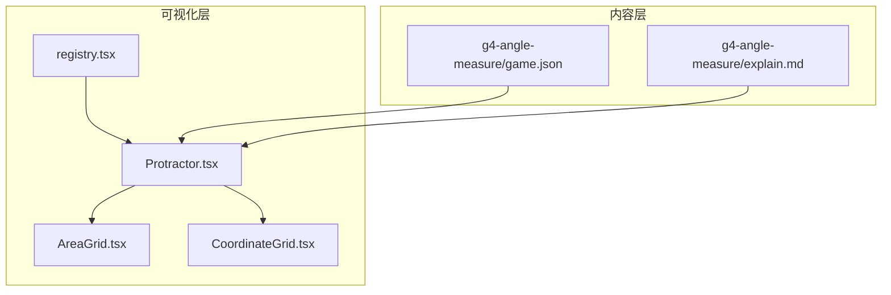
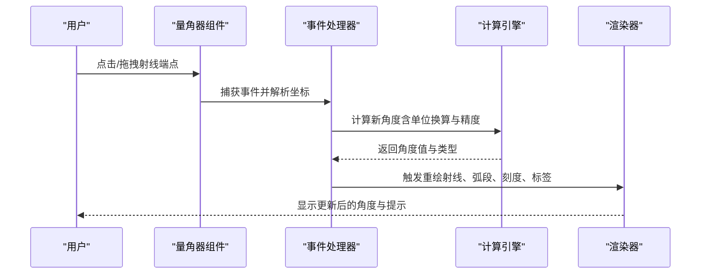
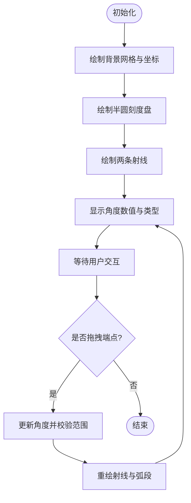
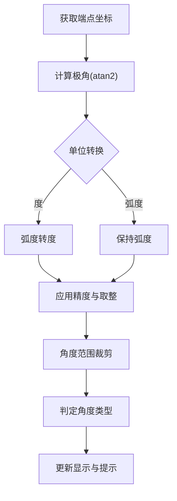
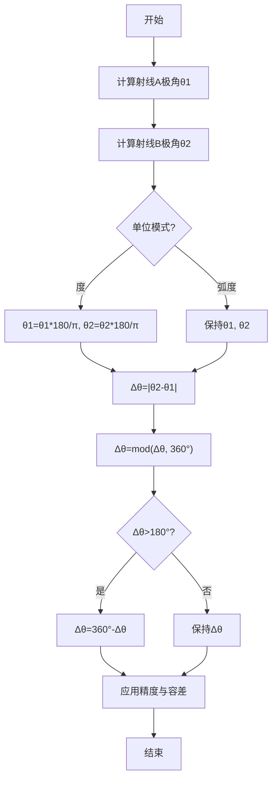
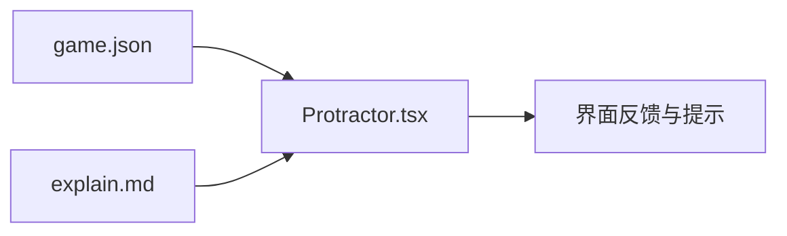
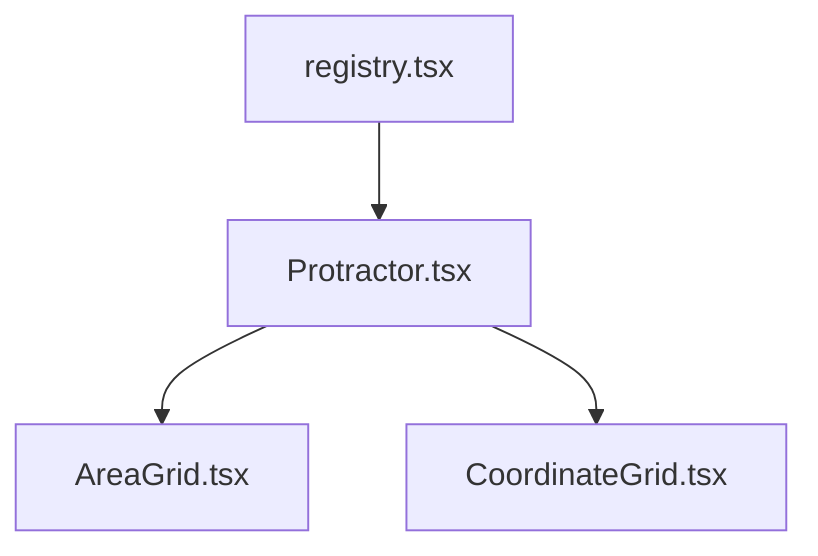

# 量角器工具

<cite>
**本文引用的文件**   
- [Protractor.tsx](file://src/visualizations/Protractor.tsx)
- [registry.tsx](file://src/visualizations/registry.tsx)
- [g4-angle-measure/game.json](file://src/content/knowledge-points/g4-angle-measure/game.json)
- [g4-angle-measure/explain.md](file://src/content/knowledge-points/g4-angle-measure/explain.md)
- [AreaGrid.tsx](file://src/visualizations/AreaGrid.tsx)
- [CoordinateGrid.tsx](file://src/visualizations/CoordinateGrid.tsx)
</cite>

## 目录
1. [简介](#简介)
2. [项目结构](#项目结构)
3. [核心组件](#核心组件)
4. [架构总览](#架构总览)
5. [详细组件分析](#详细组件分析)
6. [依赖关系分析](#依赖关系分析)
7. [性能考量](#性能考量)
8. [故障排查指南](#故障排查指南)
9. [结论](#结论)
10. [附录](#附录)

## 简介
本技术文档围绕 Protractor 量角器组件，系统化阐述其几何模拟实现与交互逻辑。内容涵盖半圆形刻度盘渲染、角度测量算法、射线绘制与拖拽调整、实时角度数值显示、角度类型识别（锐角、直角、钝角、平角），以及 Props 配置项（刻度单位、精度、颜色主题、网格与辅助线）。同时提供学习辅助功能说明（分类提示、特殊角度标记、测量指导）与数学公式展示、角度换算支持。

## 项目结构
量角器组件位于可视化模块中，并通过注册表对外暴露，供知识点对应的游戏或练习页面使用。相关资源包括：
- 可视化组件：Protractor.tsx
- 可视化注册：registry.tsx
- 知识点内容与游戏配置：g4-angle-measure 下的 game.json 与 explain.md
- 可复用的网格与坐标系统：AreaGrid.tsx、CoordinateGrid.tsx（用于背景网格与对齐辅助）

**图表来源** 
- [Protractor.tsx](file://src/visualizations/Protractor.tsx)
- [registry.tsx](file://src/visualizations/registry.tsx)
- [g4-angle-measure/game.json](file://src/content/knowledge-points/g4-angle-measure/game.json)
- [g4-angle-measure/explain.md](file://src/content/knowledge-points/g4-angle-measure/explain.md)
- [AreaGrid.tsx](file://src/visualizations/AreaGrid.tsx)
- [CoordinateGrid.tsx](file://src/visualizations/CoordinateGrid.tsx)

**章节来源**
- [Protractor.tsx](file://src/visualizations/Protractor.tsx)
- [registry.tsx](file://src/visualizations/registry.tsx)
- [g4-angle-measure/game.json](file://src/content/knowledge-points/g4-angle-measure/game.json)
- [g4-angle-measure/explain.md](file://src/content/knowledge-points/g4-angle-measure/explain.md)
- [AreaGrid.tsx](file://src/visualizations/AreaGrid.tsx)
- [CoordinateGrid.tsx](file://src/visualizations/CoordinateGrid.tsx)

## 核心组件
- 量角器组件（Protractor.tsx）
  - 负责半圆刻度盘的绘制、两条射线的生成与拖拽交互、角度计算与显示、角度类型判定、学习提示与辅助线渲染。
  - 通过 Props 控制刻度单位（度/弧度）、精度、颜色主题、网格与辅助线开关等。
- 注册表（registry.tsx）
  - 将量角器组件以统一接口注册到可视化框架，便于在知识点对应页面按需加载。
- 网格与坐标（AreaGrid.tsx、CoordinateGrid.tsx）
  - 提供背景网格与坐标参考，帮助对齐射线与刻度，提升测量准确性与可读性。

**章节来源**
- [Protractor.tsx](file://src/visualizations/Protractor.tsx)
- [registry.tsx](file://src/visualizations/registry.tsx)
- [AreaGrid.tsx](file://src/visualizations/AreaGrid.tsx)
- [CoordinateGrid.tsx](file://src/visualizations/CoordinateGrid.tsx)

## 架构总览
量角器组件采用“数据驱动 + 事件驱动”的架构：
- 数据层：Props 定义配置项；内部状态维护两条射线的角度值与交互状态。
- 渲染层：基于 Canvas/SVG（由组件实现决定）绘制半圆刻度、刻度线、射线、角度弧段、数值标签与辅助线。
- 交互层：鼠标/触摸事件处理射线端点拖拽，实时更新角度并触发类型判定与提示。
- 集成层：通过 registry.tsx 暴露为可视化能力，被上层页面或游戏容器调用。

**图表来源** 
- [Protractor.tsx](file://src/visualizations/Protractor.tsx)
- [registry.tsx](file://src/visualizations/registry.tsx)

## 详细组件分析

### 几何模型与渲染
- 半圆刻度盘
  - 以中心点为原点，半径固定，按配置的刻度单位与精度绘制主刻度与次刻度。
  - 支持切换度/弧度模式，并在刻度旁标注对应数值。
- 射线绘制
  - 两条射线从中心点出发，分别表示角的起始边与终边。
  - 射线长度可配置，端点可拖拽以改变角度。
- 角度弧段与数值
  - 根据两射线夹角绘制扇形弧段，并在合适位置显示角度数值。
  - 数值格式受精度控制，支持四舍五入或截断策略。

**图表来源** 
- [Protractor.tsx](file://src/visualizations/Protractor.tsx)
- [AreaGrid.tsx](file://src/visualizations/AreaGrid.tsx)
- [CoordinateGrid.tsx](file://src/visualizations/CoordinateGrid.tsx)

**章节来源**
- [Protractor.tsx](file://src/visualizations/Protractor.tsx)
- [AreaGrid.tsx](file://src/visualizations/AreaGrid.tsx)
- [CoordinateGrid.tsx](file://src/visualizations/CoordinateGrid.tsx)

### 角度测量与交互
- 拖拽射线端点
  - 监听鼠标/触摸事件，计算端点相对于中心点的极角，映射到当前单位（度/弧度）。
  - 限制角度范围（如 0°~180° 或 0~π），避免越界。
- 实时角度数值显示
  - 每次角度变化立即重算并刷新显示，确保所见即所得。
- 角度类型识别
  - 锐角：大于 0° 且小于 90°
  - 直角：等于 90°
  - 钝角：大于 90° 且小于 180°
  - 平角：等于 180°
  - 当处于边界附近时，依据精度阈值进行容差判断。

**图表来源** 
- [Protractor.tsx](file://src/visualizations/Protractor.tsx)

**章节来源**
- [Protractor.tsx](file://src/visualizations/Protractor.tsx)

### 学习辅助功能
- 角度分类提示
  - 根据角度类型给出简短提示，如“这是一个锐角”“这是直角”等。
- 特殊角度标记
  - 对常见角度（如 30°、45°、60°、90°、120°、135°、150°、180°）进行高亮或标记，便于教学。
- 测量指导
  - 提供操作指引，如“拖动端点调整角度”“注意刻度对齐”等。
- 数学公式展示
  - 展示角度换算公式（度↔弧度）与三角函数基础关系，帮助理解。

**章节来源**
- [Protractor.tsx](file://src/visualizations/Protractor.tsx)
- [g4-angle-measure/explain.md](file://src/content/knowledge-points/g4-angle-measure/explain.md)

### Props 配置选项
以下为量角器组件常用 Props 的定义与行为说明（具体字段以组件实现为准）：
- 刻度单位
  - 描述：选择度或弧度作为刻度单位。
  - 影响：刻度标注、数值显示、输入输出单位。
- 刻度精度
  - 描述：角度数值的显示精度（小数位数或步长）。
  - 影响：数值四舍五入/截断策略与角度类型边界容差。
- 颜色主题
  - 描述：刻度、射线、弧段、文本的颜色配置。
  - 影响：视觉风格与对比度。
- 网格显示
  - 描述：是否显示背景网格与坐标线。
  - 影响：对齐辅助与可读性。
- 辅助线设置
  - 描述：是否显示参考线（如水平/垂直基准线、特殊角度标记线）。
  - 影响：测量准确度与教学引导。
- 射线长度与样式
  - 描述：射线长度、线宽、端点大小与形状。
  - 影响：交互体验与视觉效果。
- 初始角度
  - 描述：两条射线的初始角度值。
  - 影响：组件初始化状态。
- 只读模式
  - 描述：禁止用户拖拽修改角度。
  - 影响：交互能力。

**章节来源**
- [Protractor.tsx](file://src/visualizations/Protractor.tsx)

### 角度计算算法
- 基本思路
  - 使用 atan2(y, x) 计算端点相对中心点的极角，得到 [-π, π] 范围内的弧度值。
  - 根据单位模式转换为度或保持弧度。
- 角度差与方向
  - 计算两条射线的夹角绝对值，必要时考虑方向（顺时针/逆时针）以区分优角与劣角。
- 精度与容差
  - 对角度值进行精度处理（如保留两位小数），并对边界角度（如 90°、180°）引入容差区间，确保类型判定稳定。
- 范围裁剪
  - 将角度限制在有效范围内（如 0°~180°），防止异常输入导致渲染错误。

**图表来源** 
- [Protractor.tsx](file://src/visualizations/Protractor.tsx)

**章节来源**
- [Protractor.tsx](file://src/visualizations/Protractor.tsx)

### 与游戏和内容的集成
- 游戏配置（game.json）
  - 定义量角器的初始状态、目标角度、验证规则与反馈信息。
- 教学内容（explain.md）
  - 提供概念解释、操作步骤与示例，配合量角器进行实践练习。

**图表来源** 
- [g4-angle-measure/game.json](file://src/content/knowledge-points/g4-angle-measure/game.json)
- [g4-angle-measure/explain.md](file://src/content/knowledge-points/g4-angle-measure/explain.md)
- [Protractor.tsx](file://src/visualizations/Protractor.tsx)

**章节来源**
- [g4-angle-measure/game.json](file://src/content/knowledge-points/g4-angle-measure/game.json)
- [g4-angle-measure/explain.md](file://src/content/knowledge-points/g4-angle-measure/explain.md)
- [Protractor.tsx](file://src/visualizations/Protractor.tsx)

## 依赖关系分析
- 组件内依赖
  - Protractor.tsx 依赖 AreaGrid.tsx 与 CoordinateGrid.tsx 提供网格与坐标背景。
  - 通过 registry.tsx 将量角器能力注册到可视化框架。
- 外部依赖
  - 数学库（如三角函数）用于角度计算与单位换算。
  - 渲染后端（Canvas/SVG）用于图形绘制。

**图表来源** 
- [Protractor.tsx](file://src/visualizations/Protractor.tsx)
- [AreaGrid.tsx](file://src/visualizations/AreaGrid.tsx)
- [CoordinateGrid.tsx](file://src/visualizations/CoordinateGrid.tsx)
- [registry.tsx](file://src/visualizations/registry.tsx)

**章节来源**
- [Protractor.tsx](file://src/visualizations/Protractor.tsx)
- [AreaGrid.tsx](file://src/visualizations/AreaGrid.tsx)
- [CoordinateGrid.tsx](file://src/visualizations/CoordinateGrid.tsx)
- [registry.tsx](file://src/visualizations/registry.tsx)

## 性能考量
- 渲染优化
  - 增量重绘：仅在角度变化时重绘受影响区域（射线、弧段、标签）。
  - 防抖节流：对高频拖拽事件进行节流，降低重绘频率。
- 计算优化
  - 缓存中间结果（如极角、单位换算因子），避免重复计算。
  - 使用近似比较与容差减少浮点误差带来的抖动。
- 内存管理
  - 及时释放事件监听与临时对象，避免内存泄漏。

[本节为通用性能建议，不直接分析具体文件]

## 故障排查指南
- 角度显示异常
  - 检查单位模式与精度配置是否正确。
  - 确认角度范围裁剪逻辑是否生效。
- 拖拽不响应
  - 检查事件绑定与坐标转换是否正确。
  - 确认端点命中检测阈值是否合理。
- 类型判定不稳定
  - 调整容差区间与精度设置，避免边界抖动。
- 渲染错位
  - 核对网格与坐标系统参数，确保中心点与半径一致。

**章节来源**
- [Protractor.tsx](file://src/visualizations/Protractor.tsx)
- [AreaGrid.tsx](file://src/visualizations/AreaGrid.tsx)
- [CoordinateGrid.tsx](file://src/visualizations/CoordinateGrid.tsx)

## 结论
量角器组件通过清晰的几何建模与稳健的交互设计，实现了准确的半圆刻度盘与角度测量功能。结合 Props 配置与学习辅助，既满足教学演示需求，也具备良好的可扩展性与用户体验。建议在后续迭代中持续优化渲染性能与容错机制，并丰富教学提示与示例。

[本节为总结性内容，不直接分析具体文件]

## 附录
- 数学公式与换算
  - 弧度与度的换算：度 = 弧度 × 180/π；弧度 = 度 × π/180
  - 极角计算：θ = atan2(y, x)
  - 角度差：Δθ = |θ2 - θ1|，必要时 mod(Δθ, 360°) 并取劣角
- 角度类型判定
  - 锐角：0° < Δθ < 90°
  - 直角：Δθ ≈ 90°（考虑容差）
  - 钝角：90° < Δθ < 180°
  - 平角：Δθ ≈ 180°（考虑容差）

[本节为概念性附录，不直接分析具体文件]