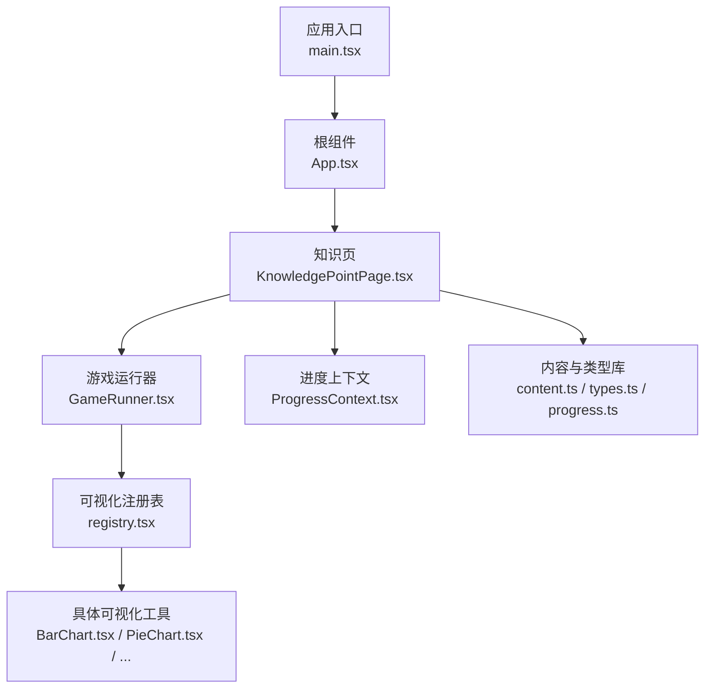
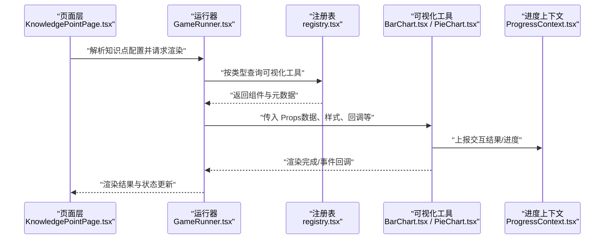
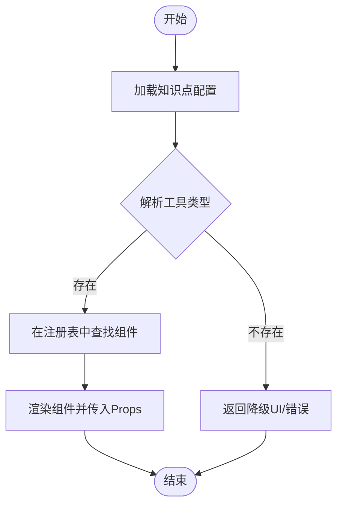
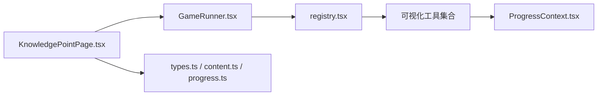

# 自定义可视化工具开发

<cite>
**本文引用的文件**   
- [registry.tsx](file://src/visualizations/registry.tsx)
- [BarChart.tsx](file://src/visualizations/BarChart.tsx)
- [PieChart.tsx](file://src/visualizations/PieChart.tsx)
- [AreaGrid.tsx](file://src/visualizations/AreaGrid.tsx)
- [NumberLine.tsx](file://src/visualizations/NumberLine.tsx)
- [CoordinateGrid.tsx](file://src/visualizations/CoordinateGrid.tsx)
- [FractionPie.tsx](file://src/visualizations/FractionPie.tsx)
- [BalanceScale.tsx](file://src/visualizations/BalanceScale.tsx)
- [ClockDial.tsx](file://src/visualizations/ClockDial.tsx)
- [ConeModel.tsx](file://src/visualizations/ConeModel.tsx)
- [CuboidModel.tsx](file://src/visualizations/CuboidModel.tsx)
- [CylinderModel.tsx](file://src/visualizations/CylinderModel.tsx)
- [CircleUnroll.tsx](file://src/visualizations/CircleUnroll.tsx)
- [PlaceValueChart.tsx](file://src/visualizations/PlaceValueChart.tsx)
- [ProbabilityModel.tsx](file://src/visualizations/ProbabilityModel.tsx)
- [Protractor.tsx](file://src/visualizations/Protractor.tsx)
- [ShapeTransform.tsx](file://src/visualizations/ShapeTransform.tsx)
- [GameRunner.tsx](file://src/components/GameRunner.tsx)
- [ProgressContext.tsx](file://src/context/ProgressContext.tsx)
- [types.ts](file://src/lib/types.ts)
- [content.ts](file://src/lib/content.ts)
- [progress.ts](file://src/lib/progress.ts)
- [KnowledgePointPage.tsx](file://src/pages/KnowledgePointPage.tsx)
- [HomePage.tsx](file://src/pages/HomePage.tsx)
- [GradePage.tsx](file://src/pages/GradePage.tsx)
- [App.tsx](file://src/App.tsx)
- [main.tsx](file://src/main.tsx)
- [package.json](file://package.json)
- [vite.config.ts](file://vite.config.ts)
</cite>

## 目录
1. [简介](#简介)
2. [项目结构](#项目结构)
3. [核心组件](#核心组件)
4. [架构总览](#架构总览)
5. [详细组件分析](#详细组件分析)
6. [依赖关系分析](#依赖关系分析)
7. [性能考虑](#性能考虑)
8. [故障排查指南](#故障排查指南)
9. [结论](#结论)
10. [附录](#附录)

## 简介
本指南面向希望在 math-k6 项目中开发“自定义可视化工具”的开发者。内容涵盖：
- 工具组件结构设计、Props 接口规范与生命周期约定
- 注册机制与在 registry.tsx 中的正确注册流程
- 从简单静态图表到复杂交互式工具的完整开发示例
- 测试策略、调试技巧与性能优化建议
- 代码模板与最佳实践

目标读者包括前端工程师、教育技术开发者以及希望扩展可视化能力的贡献者。

## 项目结构
math-k6 采用 React + TypeScript + Vite 的前端工程化方案，可视化工具集中在 src/visualizations 目录下，通过统一的注册表进行集中管理，并在页面层按需加载渲染。

**图示来源** 
- [main.tsx](file://src/main.tsx)
- [App.tsx](file://src/App.tsx)
- [KnowledgePointPage.tsx](file://src/pages/KnowledgePointPage.tsx)
- [GameRunner.tsx](file://src/components/GameRunner.tsx)
- [registry.tsx](file://src/visualizations/registry.tsx)
- [BarChart.tsx](file://src/visualizations/BarChart.tsx)
- [PieChart.tsx](file://src/visualizations/PieChart.tsx)
- [ProgressContext.tsx](file://src/context/ProgressContext.tsx)
- [content.ts](file://src/lib/content.ts)
- [types.ts](file://src/lib/types.ts)
- [progress.ts](file://src/lib/progress.ts)

**章节来源**
- [main.tsx](file://src/main.tsx)
- [App.tsx](file://src/App.tsx)
- [KnowledgePointPage.tsx](file://src/pages/KnowledgePointPage.tsx)
- [GameRunner.tsx](file://src/components/GameRunner.tsx)
- [registry.tsx](file://src/visualizations/registry.tsx)
- [types.ts](file://src/lib/types.ts)
- [content.ts](file://src/lib/content.ts)
- [progress.ts](file://src/lib/progress.ts)

## 核心组件
- 可视化注册表（registry.tsx）：集中声明所有可用的可视化工具及其元数据，供运行时根据配置动态选择并渲染对应组件。
- 可视化工具组件（如 BarChart.tsx、PieChart.tsx 等）：实现具体的可视化逻辑，遵循统一的 Props 接口与事件回调约定。
- 游戏运行器（GameRunner.tsx）：负责读取知识点配置、解析 game.json，并根据配置渲染对应的可视化工具。
- 进度上下文（ProgressContext.tsx）：提供学习进度状态与回调，便于可视化工具上报交互结果。
- 类型与内容库（types.ts、content.ts、progress.ts）：定义通用类型、内容加载与进度管理逻辑。

**章节来源**
- [registry.tsx](file://src/visualizations/registry.tsx)
- [BarChart.tsx](file://src/visualizations/BarChart.tsx)
- [PieChart.tsx](file://src/visualizations/PieChart.tsx)
- [GameRunner.tsx](file://src/components/GameRunner.tsx)
- [ProgressContext.tsx](file://src/context/ProgressContext.tsx)
- [types.ts](file://src/lib/types.ts)
- [content.ts](file://src/lib/content.ts)
- [progress.ts](file://src/lib/progress.ts)

## 架构总览
可视化工具的调用链通常如下：页面层根据知识点配置选择工具类型，运行器从注册表中查找对应组件并传入 Props，组件内部处理交互并通过上下文上报进度或触发回调。

**图示来源** 
- [KnowledgePointPage.tsx](file://src/pages/KnowledgePointPage.tsx)
- [GameRunner.tsx](file://src/components/GameRunner.tsx)
- [registry.tsx](file://src/visualizations/registry.tsx)
- [BarChart.tsx](file://src/visualizations/BarChart.tsx)
- [PieChart.tsx](file://src/visualizations/PieChart.tsx)
- [ProgressContext.tsx](file://src/context/ProgressContext.tsx)

## 详细组件分析

### 可视化工具标准接口规范
为保持可扩展性与一致性，建议所有可视化工具遵循以下规范：
- 必需属性
  - id：唯一标识，用于注册与定位
  - title：标题文本
  - data：可视化所需的数据结构（由 game.json 或外部输入决定）
  - onStateChange：状态变化回调，用于向父级或上下文上报交互结果
- 可选配置
  - theme：主题配置（颜色、字体、尺寸等）
  - options：工具特定选项（如坐标轴、图例、动画参数）
  - disabled：是否禁用交互
  - readOnly：只读模式，不触发 onStateChange
- 事件回调
  - onStateChange(state): void，统一上报状态变更
  - onReady?(): void，初始化完成后回调
  - onError?(error): void，错误处理回调
- 生命周期方法
  - componentDidMount / useEffect：初始化资源、绑定事件
  - componentDidUpdate：响应 props 变化，避免重复计算
  - componentWillUnmount / useCleanup：清理定时器、事件监听、第三方实例

建议在组件内使用受控与非受控两种模式：
- 受控模式：props.data 驱动渲染，onStateChange 上报变更
- 非受控模式：组件内部维护状态，仅在必要时上报

**章节来源**
- [registry.tsx](file://src/visualizations/registry.tsx)
- [BarChart.tsx](file://src/visualizations/BarChart.tsx)
- [PieChart.tsx](file://src/visualizations/PieChart.tsx)
- [ProgressContext.tsx](file://src/context/ProgressContext.tsx)
- [types.ts](file://src/lib/types.ts)

### 注册机制与流程（registry.tsx）
注册表的核心职责是：
- 维护可视化工具的类型映射（type -> component）
- 暴露统一的查询与获取方法
- 支持元数据（title、description、version 等）

典型流程：
1. 在 registry.tsx 中新增工具条目，包含 type、component、metadata
2. 确保组件导出默认或命名导出，路径正确
3. 在运行器中按 type 查询组件并渲染
4. 若未找到，返回降级 UI 或错误提示

**图示来源** 
- [registry.tsx](file://src/visualizations/registry.tsx)
- [GameRunner.tsx](file://src/components/GameRunner.tsx)

**章节来源**
- [registry.tsx](file://src/visualizations/registry.tsx)
- [GameRunner.tsx](file://src/components/GameRunner.tsx)

### 示例一：简单静态图表（以柱状图为例）
- 设计要点
  - 数据驱动渲染，无交互或仅展示性交互
  - 最小 Props：id、title、data、theme
  - 可选：onReady 回调
- 开发步骤
  1. 新建组件文件（例如 BarChart.tsx），实现渲染逻辑
  2. 在 registry.tsx 中注册，设置 type 为 "bar-chart"
  3. 在 game.json 中使用该 type，并提供必要数据
  4. 在运行器中自动渲染

**章节来源**
- [BarChart.tsx](file://src/visualizations/BarChart.tsx)
- [registry.tsx](file://src/visualizations/registry.tsx)

### 示例二：交互式工具（以分数饼图为例）
- 设计要点
  - 用户操作改变状态（如点击扇区、拖拽滑块）
  - 通过 onStateChange 上报新状态
  - 支持只读与禁用模式
- 开发步骤
  1. 新建组件文件（例如 FractionPie.tsx），实现交互逻辑
  2. 在 registry.tsx 中注册，设置 type 为 "fraction-pie"
  3. 在 game.json 中配置交互选项与初始数据
  4. 在运行器中监听 onStateChange 并同步进度

**章节来源**
- [FractionPie.tsx](file://src/visualizations/FractionPie.tsx)
- [registry.tsx](file://src/visualizations/registry.tsx)
- [ProgressContext.tsx](file://src/context/ProgressContext.tsx)

### 示例三：复杂几何模型（以圆锥模型为例）
- 设计要点
  - 引入三维渲染或复杂二维变换
  - 需要生命周期管理（初始化、销毁）
  - 性能敏感，需避免重绘与内存泄漏
- 开发步骤
  1. 新建组件文件（例如 ConeModel.tsx），封装渲染引擎
  2. 在 registry.tsx 中注册，设置 type 为 "cone-model"
  3. 在 game.json 中配置几何参数与交互行为
  4. 在组件内实现防抖、节流与资源清理

**章节来源**
- [ConeModel.tsx](file://src/visualizations/ConeModel.tsx)
- [registry.tsx](file://src/visualizations/registry.tsx)

### 示例四：坐标网格与数轴（以坐标网格为例）
- 设计要点
  - 大量元素渲染，需虚拟滚动或分片渲染
  - 事件冒泡与命中检测
  - 缩放与平移的数学变换
- 开发步骤
  1. 新建组件文件（例如 CoordinateGrid.tsx），实现网格绘制与交互
  2. 在 registry.tsx 中注册，设置 type 为 "coordinate-grid"
  3. 在 game.json 中配置网格范围、刻度与交互选项
  4. 在组件内实现事件代理与性能优化

**章节来源**
- [CoordinateGrid.tsx](file://src/visualizations/CoordinateGrid.tsx)
- [registry.tsx](file://src/visualizations/registry.tsx)

### 示例五：其他常用工具概览
- 面积网格（AreaGrid.tsx）：适合面积概念演示
- 天平秤（BalanceScale.tsx）：适合方程平衡演示
- 时钟表盘（ClockDial.tsx）：适合时间概念演示
- 圆柱模型（CylinderModel.tsx）、立方体模型（CuboidModel.tsx）：立体几何演示
- 圆展开（CircleUnroll.tsx）：圆周率与面积推导
- 位值表（PlaceValueChart.tsx）：数位与数值表示
- 概率模型（ProbabilityModel.tsx）：概率实验模拟
- 量角器（Protractor.tsx）：角度测量演示
- 图形变换（ShapeTransform.tsx）：平移、旋转、缩放演示

**章节来源**
- [AreaGrid.tsx](file://src/visualizations/AreaGrid.tsx)
- [BalanceScale.tsx](file://src/visualizations/BalanceScale.tsx)
- [ClockDial.tsx](file://src/visualizations/ClockDial.tsx)
- [CylinderModel.tsx](file://src/visualizations/CylinderModel.tsx)
- [CuboidModel.tsx](file://src/visualizations/CuboidModel.tsx)
- [CircleUnroll.tsx](file://src/visualizations/CircleUnroll.tsx)
- [PlaceValueChart.tsx](file://src/visualizations/PlaceValueChart.tsx)
- [ProbabilityModel.tsx](file://src/visualizations/ProbabilityModel.tsx)
- [Protractor.tsx](file://src/visualizations/Protractor.tsx)
- [ShapeTransform.tsx](file://src/visualizations/ShapeTransform.tsx)

## 依赖关系分析
可视化工具与运行器、注册表、上下文之间的依赖关系如下：

**图示来源** 
- [GameRunner.tsx](file://src/components/GameRunner.tsx)
- [registry.tsx](file://src/visualizations/registry.tsx)
- [ProgressContext.tsx](file://src/context/ProgressContext.tsx)
- [KnowledgePointPage.tsx](file://src/pages/KnowledgePointPage.tsx)
- [types.ts](file://src/lib/types.ts)
- [content.ts](file://src/lib/content.ts)
- [progress.ts](file://src/lib/progress.ts)

**章节来源**
- [GameRunner.tsx](file://src/components/GameRunner.tsx)
- [registry.tsx](file://src/visualizations/registry.tsx)
- [ProgressContext.tsx](file://src/context/ProgressContext.tsx)
- [KnowledgePointPage.tsx](file://src/pages/KnowledgePointPage.tsx)
- [types.ts](file://src/lib/types.ts)
- [content.ts](file://src/lib/content.ts)
- [progress.ts](file://src/lib/progress.ts)

## 性能考虑
- 渲染优化
  - 使用 React.memo 包裹纯展示组件
  - 对大数据集采用虚拟列表或分片渲染
  - 避免在 render 中进行昂贵计算，使用 useMemo/useCallback
- 事件处理
  - 使用事件委托减少监听器数量
  - 对高频事件（mousemove、scroll）进行节流/防抖
- 资源管理
  - 在组件卸载时清理定时器、事件监听与第三方实例
  - 避免闭包引用导致内存泄漏
- 网络与数据
  - 对静态资源进行懒加载与缓存
  - 合理拆分 bundle，按需加载可视化工具

[本节为通用指导，无需源码引用]

## 故障排查指南
- 常见问题
  - 工具未渲染：检查 registry.tsx 中是否正确注册，type 是否与配置一致
  - 数据不更新：确认 props 是否受控，onStateChange 是否被调用
  - 交互无效：检查 disabled/readOnly 配置与事件绑定
  - 性能问题：使用浏览器性能面板分析重绘与计算热点
- 调试技巧
  - 在组件内添加日志输出，记录关键状态变化
  - 使用 React DevTools 检查组件树与状态
  - 对复杂交互增加单元测试与集成测试
- 错误处理
  - 在 onStateChange 中捕获异常并上报
  - 提供降级 UI 与用户友好提示

**章节来源**
- [registry.tsx](file://src/visualizations/registry.tsx)
- [GameRunner.tsx](file://src/components/GameRunner.tsx)
- [ProgressContext.tsx](file://src/context/ProgressContext.tsx)

## 结论
通过统一的注册机制与标准化的 Props 接口，math-k6 能够灵活扩展可视化工具。开发者只需遵循规范，即可快速实现从简单图表到复杂交互的工具，并与系统进度、内容配置无缝集成。建议在新工具开发过程中重视性能优化与可测试性，确保用户体验与可维护性。

[本节为总结，无需源码引用]

## 附录

### 代码模板与最佳实践
- 组件模板
  - 定义 Props 接口（id、title、data、onStateChange、options 等）
  - 实现受控与非受控两种模式
  - 在 useEffect 中处理初始化与清理
  - 在 onStateChange 中上报状态变更
- 注册模板
  - 在 registry.tsx 中添加条目（type、component、metadata）
  - 确保导出路径与类型一致
- 最佳实践
  - 单一职责：每个组件专注一种可视化
  - 可配置性：通过 options 控制行为与外观
  - 可测试性：提供纯函数与 mock 数据
  - 可访问性：支持键盘导航与屏幕阅读器

[本节为通用指导，无需源码引用]

### 构建与运行
- 安装依赖：npm install
- 启动开发服务器：npm run dev
- 构建生产版本：npm run build
- 配置文件：vite.config.ts、package.json

**章节来源**
- [package.json](file://package.json)
- [vite.config.ts](file://vite.config.ts)