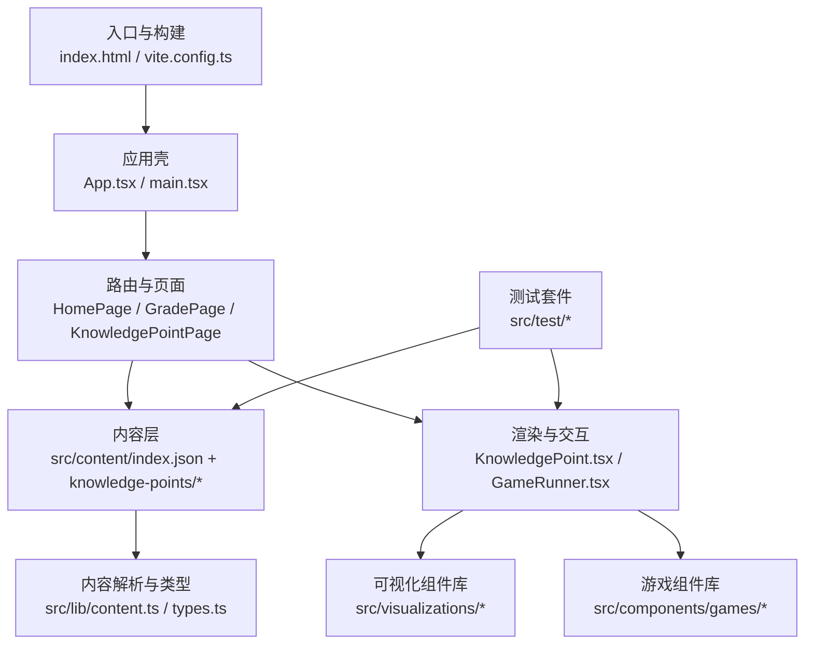
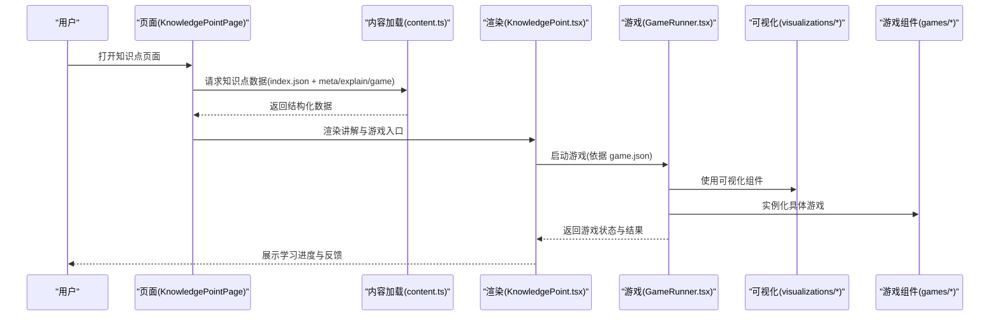
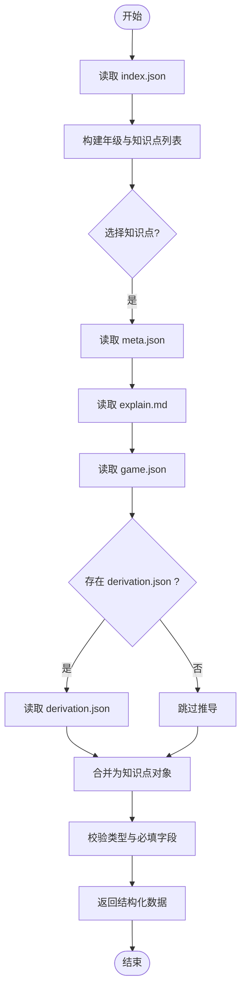
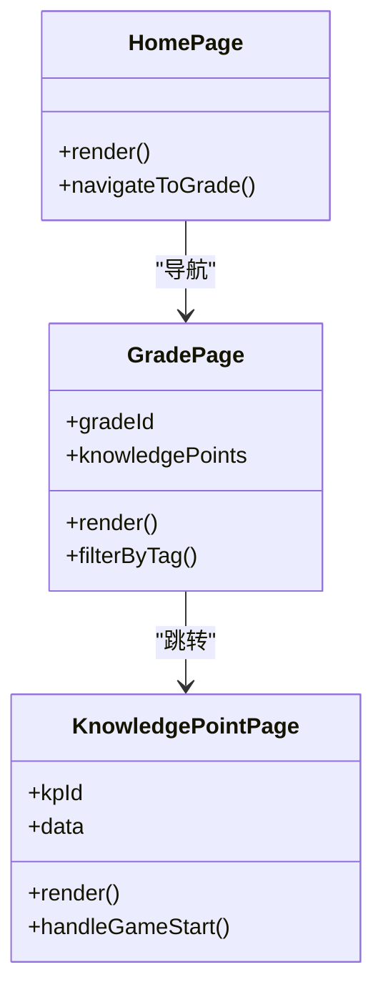
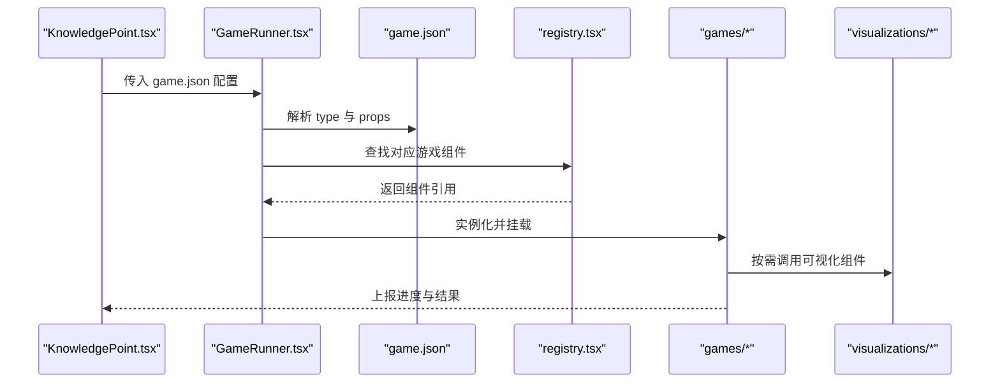
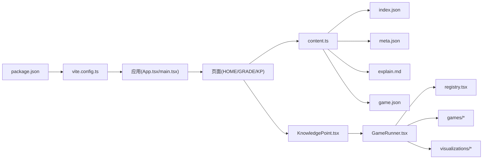

# 内容开发工作流

<cite>
**本文引用的文件**   
- [README.md](file://README.md)
- [package.json](file://package.json)
- [vite.config.ts](file://vite.config.ts)
- [src/content/index.json](file://src/content/index.json)
- [src/lib/content.ts](file://src/lib/content.ts)
- [src/lib/types.ts](file://src/lib/types.ts)
- [src/components/KnowledgePoint.tsx](file://src/components/KnowledgePoint.tsx)
- [src/components/GameRunner.tsx](file://src/components/GameRunner.tsx)
- [src/pages/HomePage.tsx](file://src/pages/HomePage.tsx)
- [src/pages/GradePage.tsx](file://src/pages/GradePage.tsx)
- [src/pages/KnowledgePointPage.tsx](file://src/pages/KnowledgePointPage.tsx)
- [src/test/content.test.ts](file://src/test/content.test.ts)
- [src/test/gameRunner.test.ts](file://src/test/gameRunner.test.ts)
- [src/test/progress.test.ts](file://src/test/progress.test.ts)
- [src/test/setup.ts](file://src/test/setup.ts)
- [src/assets/...](file://src/assets/)
- [src/visualizations/AreaGrid.tsx](file://src/visualizations/AreaGrid.tsx)
- [src/visualizations/BalanceScale.tsx](file://src/visualizations/BalanceScale.tsx)
- [src/visualizations/BarChart.tsx](file://src/visualizations/BarChart.tsx)
- [src/visualizations/CircleUnroll.tsx](file://src/visualizations/CircleUnroll.tsx)
- [src/visualizations/ClockDial.tsx](file://src/visualizations/ClockDial.tsx)
- [src/visualizations/ConeModel.tsx](file://src/visualizations/ConeModel.tsx)
- [src/visualizations/CoordinateGrid.tsx](file://src/visualizations/CoordinateGrid.tsx)
- [src/visualizations/CuboidModel.tsx](file://src/visualizations/CuboidModel.tsx)
- [src/visualizations/CylinderModel.tsx](file://src/visualizations/CylinderModel.tsx)
- [src/visualizations/FractionPie.tsx](file://src/visualizations/FractionPie.tsx)
- [src/visualizations/NumberLine.tsx](file://src/visualizations/NumberLine.tsx)
- [src/visualizations/PieChart.tsx](file://src/visualizations/PieChart.tsx)
- [src/visualizations/PlaceValueChart.tsx](file://src/visualizations/PlaceValueChart.tsx)
- [src/visualizations/ProbabilityModel.tsx](file://src/visualizations/ProbabilityModel.tsx)
- [src/visualizations/Protractor.tsx](file://src/visualizations/Protractor.tsx)
- [src/visualizations/ShapeTransform.tsx](file://src/visualizations/ShapeTransform.tsx)
- [src/visualizations/registry.tsx](file://src/visualizations/registry.tsx)
- [src/components/games/ChoiceGame.tsx](file://src/components/games/ChoiceGame.tsx)
- [src/components/games/DragAssembleGame.tsx](file://src/components/games/DragAssembleGame.tsx)
- [src/components/games/DragMatchGame.tsx](file://src/components/games/DragMatchGame.tsx)
- [src/components/games/FillBlankGame.tsx](file://src/components/games/FillBlankGame.tsx)
- [src/components/games/TimedChallengeGame.tsx](file://src/components/games/TimedChallengeGame.tsx)
- [src/components/games/TimelineGame.tsx](file://src/components/games/TimelineGame.tsx)
- [src/components/games/TrueFalseGame.tsx](file://src/components/games/TrueFalseGame.tsx)
</cite>

## 目录
1. [简介](#简介)
2. [项目结构](#项目结构)
3. [核心组件](#核心组件)
4. [架构总览](#架构总览)
5. [详细组件分析](#详细组件分析)
6. [依赖关系分析](#依赖关系分析)
7. [性能考虑](#性能考虑)
8. [故障排查指南](#故障排查指南)
9. [结论](#结论)
10. [附录](#附录)

## 简介
本指南面向 math-k6 项目的“内容开发者”，提供从创建新知识点到发布内容的完整工作流。文档涵盖：
- 如何新增一个知识点（目录、元数据、讲解与游戏配置）
- 如何使用开发服务器预览效果
- 内容验证工具与测试方法
- 版本管理与更新策略
- 常见问题排查与解决方案
- 内容质量检查与性能优化建议

目标读者包括数学内容编辑、前端开发与教学设计师，帮助团队高效协作并保证内容质量与稳定性。

## 项目结构
math-k6 采用“内容驱动”的前端应用结构：
- 内容资源位于 src/content/knowledge-points，每个知识点一个目录，包含 meta.json、explain.md、game.json、derivation.json 等
- 页面与组件位于 src/pages 与 src/components
- 可视化组件位于 src/visualizations，供内容与游戏复用
- 类型定义与内容加载逻辑位于 src/lib
- 测试用例位于 src/test

图表来源
- [vite.config.ts:1-200](file://vite.config.ts#L1-L200)
- [src/pages/HomePage.tsx:1-200](file://src/pages/HomePage.tsx#L1-L200)
- [src/pages/GradePage.tsx:1-200](file://src/pages/GradePage.tsx#L1-L200)
- [src/pages/KnowledgePointPage.tsx:1-200](file://src/pages/KnowledgePointPage.tsx#L1-L200)
- [src/lib/content.ts:1-200](file://src/lib/content.ts#L1-L200)
- [src/lib/types.ts:1-200](file://src/lib/types.ts#L1-L200)
- [src/components/KnowledgePoint.tsx:1-200](file://src/components/KnowledgePoint.tsx#L1-L200)
- [src/components/GameRunner.tsx:1-200](file://src/components/GameRunner.tsx#L1-L200)

章节来源
- [README.md:1-200](file://README.md#L1-L200)
- [package.json:1-200](file://package.json#L1-L200)
- [vite.config.ts:1-200](file://vite.config.ts#L1-L200)

## 核心组件
- 内容索引与加载
  - index.json：年级与知识点索引，用于导航与列表展示
  - content.ts：读取并解析 index.json 与各知识点的 meta.json、explain.md、game.json、derivation.json，统一为结构化数据
  - types.ts：定义知识点、元数据、游戏配置、推导过程等类型约束
- 页面与渲染
  - HomePage：首页导航，按年级聚合知识点
  - GradePage：年级详情页，列出该年级所有知识点
  - KnowledgePointPage：知识点详情页，加载并渲染 explain.md 与 game.json
- 组件与交互
  - KnowledgePoint.tsx：渲染知识点讲解与游戏入口
  - GameRunner.tsx：根据 game.json 动态运行对应游戏组件
- 可视化与游戏
  - visualizations/*：数学可视化组件（数轴、饼图、立方体模型等）
  - components/games/*：可插拔的游戏实现（选择、拖拽、填空、计时挑战等）

章节来源
- [src/content/index.json:1-200](file://src/content/index.json#L1-L200)
- [src/lib/content.ts:1-200](file://src/lib/content.ts#L1-L200)
- [src/lib/types.ts:1-200](file://src/lib/types.ts#L1-L200)
- [src/pages/HomePage.tsx:1-200](file://src/pages/HomePage.tsx#L1-L200)
- [src/pages/GradePage.tsx:1-200](file://src/pages/GradePagePage.tsx#L1-L200)
- [src/pages/KnowledgePointPage.tsx:1-200](file://src/pages/KnowledgePointPage.tsx#L1-L200)
- [src/components/KnowledgePoint.tsx:1-200](file://src/components/KnowledgePoint.tsx#L1-L200)
- [src/components/GameRunner.tsx:1-200](file://src/components/GameRunner.tsx#L1-L200)

## 架构总览
内容开发的核心流程是“数据驱动渲染”：
- 内容层：index.json 与各知识点的元数据与素材
- 解析层：content.ts 将静态资源转换为运行时数据结构
- 表现层：页面与组件消费数据，渲染讲解与游戏
- 扩展层：可视化与游戏组件通过 registry 或约定路径注册与调用

图表来源
- [src/pages/KnowledgePointPage.tsx:1-200](file://src/pages/KnowledgePointPage.tsx#L1-L200)
- [src/lib/content.ts:1-200](file://src/lib/content.ts#L1-L200)
- [src/components/KnowledgePoint.tsx:1-200](file://src/components/KnowledgePoint.tsx#L1-L200)
- [src/components/GameRunner.tsx:1-200](file://src/components/GameRunner.tsx#L1-L200)
- [src/visualizations/registry.tsx:1-200](file://src/visualizations/registry.tsx#L1-L200)

## 详细组件分析

### 内容索引与解析
- index.json：维护年级与知识点清单，作为导航与搜索的基础
- content.ts：负责读取 index.json 与单个知识点的多源文件，合并为统一对象；处理 Markdown 文本与 JSON 配置
- types.ts：定义知识点的字段、游戏配置项、推导步骤等类型，确保内容一致性

图表来源
- [src/lib/content.ts:1-200](file://src/lib/content.ts#L1-L200)
- [src/lib/types.ts:1-200](file://src/lib/types.ts#L1-L200)

章节来源
- [src/content/index.json:1-200](file://src/content/index.json#L1-L200)
- [src/lib/content.ts:1-200](file://src/lib/content.ts#L1-L200)
- [src/lib/types.ts:1-200](file://src/lib/types.ts#L1-L200)

### 页面与渲染
- HomePage：展示年级入口，点击跳转至年级页
- GradePage：展示年级下知识点列表，支持筛选与排序
- KnowledgePointPage：加载知识点数据，渲染讲解与游戏入口

图表来源
- [src/pages/HomePage.tsx:1-200](file://src/pages/HomePage.tsx#L1-L200)
- [src/pages/GradePage.tsx:1-200](file://src/pages/GradePage.tsx#L1-L200)
- [src/pages/KnowledgePointPage.tsx:1-200](file://src/pages/KnowledgePointPage.tsx#L1-L200)

章节来源
- [src/pages/HomePage.tsx:1-200](file://src/pages/HomePage.tsx#L1-L200)
- [src/pages/GradePage.tsx:1-200](file://src/pages/GradePage.tsx#L1-L200)
- [src/pages/KnowledgePointPage.tsx:1-200](file://src/pages/KnowledgePointPage.tsx#L1-L200)

### 游戏运行器与可视化
- GameRunner.tsx：根据 game.json 的 type 与 props 动态实例化 games/* 中的游戏组件，管理生命周期与状态
- visualizations/*：提供数学可视化能力，如数轴、分数饼图、立体几何模型等，被游戏与讲解复用

图表来源
- [src/components/GameRunner.tsx:1-200](file://src/components/GameRunner.tsx#L1-L200)
- [src/visualizations/registry.tsx:1-200](file://src/visualizations/registry.tsx#L1-L200)
- [src/components/games/ChoiceGame.tsx:1-200](file://src/components/games/ChoiceGame.tsx#L1-L200)
- [src/components/games/DragAssembleGame.tsx:1-200](file://src/components/games/DragAssembleGame.tsx#L1-L200)
- [src/components/games/DragMatchGame.tsx:1-200](file://src/components/games/DragMatchGame.tsx#L1-L200)
- [src/components/games/FillBlankGame.tsx:1-200](file://src/components/games/FillBlankGame.tsx#L1-L200)
- [src/components/games/TimedChallengeGame.tsx:1-200](file://src/components/games/TimedChallengeGame.tsx#L1-L200)
- [src/components/games/TimelineGame.tsx:1-200](file://src/components/games/TimelineGame.tsx#L1-L200)
- [src/components/games/TrueFalseGame.tsx:1-200](file://src/components/games/TrueFalseGame.tsx#L1-L200)

章节来源
- [src/components/GameRunner.tsx:1-200](file://src/components/GameRunner.tsx#L1-L200)
- [src/visualizations/registry.tsx:1-200](file://src/visualizations/registry.tsx#L1-L200)

## 依赖关系分析
- 构建与脚本
  - package.json：定义依赖、脚本命令（开发、构建、测试）
  - vite.config.ts：配置开发服务器、插件、路径别名等
- 内容依赖
  - content.ts 依赖 index.json 与各知识点的元数据与素材
  - 页面依赖 content.ts 提供的数据接口
  - 组件依赖 types.ts 的类型定义
- 可视化与游戏
  - GameRunner.tsx 依赖 registry.tsx 与 games/*
  - 可视化组件独立可复用，无强耦合

图表来源
- [package.json:1-200](file://package.json#L1-L200)
- [vite.config.ts:1-200](file://vite.config.ts#L1-L200)
- [src/lib/content.ts:1-200](file://src/lib/content.ts#L1-L200)
- [src/components/GameRunner.tsx:1-200](file://src/components/GameRunner.tsx#L1-L200)
- [src/visualizations/registry.tsx:1-200](file://src/visualizations/registry.tsx#L1-L200)

章节来源
- [package.json:1-200](file://package.json#L1-L200)
- [vite.config.ts:1-200](file://vite.config.ts#L1-L200)

## 性能考虑
- 内容加载
  - 对 index.json 与知识点数据进行分页或懒加载，避免首屏过大
  - 对 explain.md 进行增量加载与缓存
- 渲染优化
  - 使用 React 的 memo/useMemo/useCallback 减少重渲染
  - 对大型可视化组件进行虚拟滚动或按需渲染
- 资源优化
  - 图片与媒体资源压缩与懒加载
  - 代码分割：按页面与游戏模块拆分 bundle
- 测试与监控
  - 引入单元测试与集成测试覆盖关键路径
  - 使用性能监控定位瓶颈

[本节为通用指导，不直接分析具体文件]

## 故障排查指南
- 开发服务器无法启动
  - 检查端口占用与 Node 版本
  - 查看 vite.config.ts 配置是否正确
- 知识点页面空白或报错
  - 确认 index.json 中是否存在该知识点条目
  - 检查 meta.json、explain.md、game.json 是否存在且格式正确
  - 使用 content.test.ts 验证内容解析是否通过
- 游戏无法运行
  - 检查 game.json 的 type 是否在 registry.tsx 中注册
  - 确认 games/* 组件导出与 props 匹配
  - 使用 gameRunner.test.ts 验证运行流程
- 进度不更新
  - 检查 ProgressContext 与 progress.ts 的状态更新逻辑
  - 使用 progress.test.ts 验证进度计算

章节来源
- [src/test/content.test.ts:1-200](file://src/test/content.test.ts#L1-L200)
- [src/test/gameRunner.test.ts:1-200](file://src/test/gameRunner.test.ts#L1-L200)
- [src/test/progress.test.ts:1-200](file://src/test/progress.test.ts#L1-L200)
- [src/test/setup.ts:1-200](file://src/test/setup.ts#L1-L200)

## 结论
通过“内容驱动+组件化”的架构，math-k6 实现了灵活的内容开发与高效的渲染体验。遵循本文工作流，内容开发者可以：
- 快速新增知识点并确保数据一致性与可测试性
- 利用开发服务器即时预览与调试
- 通过测试与质量检查保障内容稳定性
- 以版本化管理与发布策略推进迭代

[本节为总结，不直接分析具体文件]

## 附录

### 从零创建新知识点的工作流
- 准备目录与文件
  - 在 src/content/knowledge-points 下新建目录，命名规范建议：gX-topic（X 为年级）
  - 创建 meta.json（标题、描述、标签、难度等）
  - 编写 explain.md（讲解内容，Markdown 格式）
  - 设计 game.json（游戏类型、参数、题目集）
  - 可选：derivation.json（推导步骤与动画）
- 更新索引
  - 在 index.json 中添加该知识点的条目，确保年级与分类正确
- 本地预览
  - 启动开发服务器，访问对应页面验证渲染与交互
- 测试与校验
  - 运行内容测试与游戏测试，确保解析与运行无误
- 提交与发布
  - 提交变更，遵循版本管理策略（见下节）

章节来源
- [src/content/index.json:1-200](file://src/content/index.json#L1-L200)
- [src/lib/content.ts:1-200](file://src/lib/content.ts#L1-L200)
- [src/lib/types.ts:1-200](file://src/lib/types.ts#L1-L200)

### 内容验证工具与测试方法
- 内容解析测试
  - content.test.ts：验证 index.json 与知识点文件的结构与字段完整性
- 游戏运行测试
  - gameRunner.test.ts：验证不同 game.json 配置下的游戏初始化与交互
- 进度测试
  - progress.test.ts：验证学习进度计算与持久化
- 测试环境设置
  - setup.ts：配置测试环境与全局桩

章节来源
- [src/test/content.test.ts:1-200](file://src/test/content.test.ts#L1-L200)
- [src/test/gameRunner.test.ts:1-200](file://src/test/gameRunner.test.ts#L1-L200)
- [src/test/progress.test.ts:1-200](file://src/test/progress.test.ts#L1-L200)
- [src/test/setup.ts:1-200](file://src/test/setup.ts#L1-L200)

### 开发服务器与预览
- 启动开发服务器
  - 使用 package.json 中的脚本命令启动
  - 浏览器访问 localhost 查看首页与年级页
- 实时热重载
  - 修改内容或组件后自动刷新页面
- 调试技巧
  - 使用浏览器开发者工具检查网络请求与组件状态
  - 在 content.ts 与 GameRunner.tsx 中加入日志辅助定位问题

章节来源
- [package.json:1-200](file://package.json#L1-L200)
- [vite.config.ts:1-200](file://vite.config.ts#L1-L200)

### 版本管理与更新策略
- 版本号规范
  - 建议使用语义化版本（主版本.次版本.修订号），重大内容变更提升主版本
- 分支策略
  - 主干分支稳定，功能分支开发，合并前通过测试与代码审查
- 变更日志
  - 记录每次发布的内容增删改与修复
- 回滚策略
  - 保留历史版本快照，出现问题时快速回滚

[本节为通用指导，不直接分析具体文件]

### 常见问题的排查方法与解决方案
- 知识点未显示
  - 检查 index.json 条目是否存在与拼写是否正确
  - 确认 meta.json 必填字段齐全
- 讲解内容不渲染
  - 检查 explain.md 语法与编码
  - 确认 content.ts 的 Markdown 解析逻辑
- 游戏崩溃或无响应
  - 检查 game.json 的 type 与 props 是否与游戏组件匹配
  - 使用 gameRunner.test.ts 复现问题并定位
- 进度丢失
  - 检查 ProgressContext 与存储逻辑
  - 使用 progress.test.ts 验证状态流转

章节来源
- [src/lib/content.ts:1-200](file://src/lib/content.ts#L1-L200)
- [src/components/GameRunner.tsx:1-200](file://src/components/GameRunner.tsx#L1-L200)
- [src/test/gameRunner.test.ts:1-200](file://src/test/gameRunner.test.ts#L1-L200)
- [src/test/progress.test.ts:1-200](file://src/test/progress.test.ts#L1-L200)

### 内容质量检查与性能优化建议
- 质量检查
  - 使用类型定义与测试用例确保内容结构一致
  - 人工审校讲解语言与游戏难度
- 性能优化
  - 对大体积可视化组件进行懒加载
  - 使用代码分割与资源压缩
  - 避免不必要的重渲染与重复计算

[本节为通用指导，不直接分析具体文件]