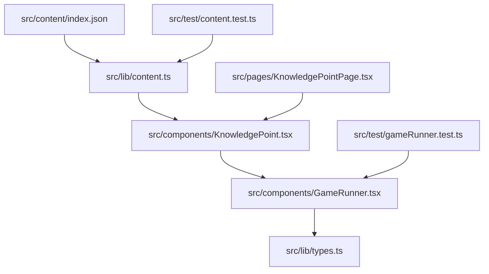
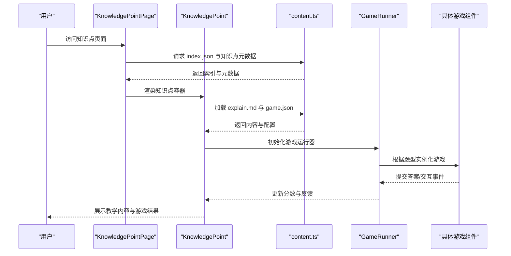
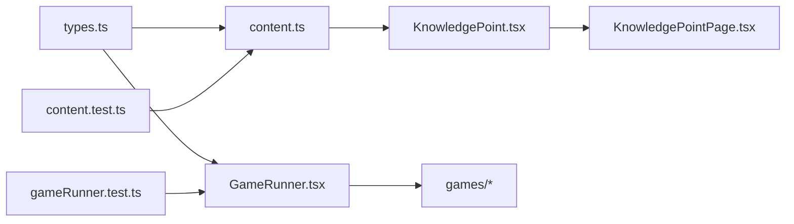

# 内容开发指南

<cite>
**本文档引用的文件**   
- [README.md](file://README.md)
- [package.json](file://package.json)
- [src/content/index.json](file://src/content/index.json)
- [src/lib/content.ts](file://src/lib/content.ts)
- [src/lib/types.ts](file://src/lib/types.ts)
- [src/components/KnowledgePoint.tsx](file://src/components/KnowledgePoint.tsx)
- [src/components/GameRunner.tsx](file://src/components/GameRunner.tsx)
- [src/pages/KnowledgePointPage.tsx](file://src/pages/KnowledgePointPage.tsx)
- [src/test/content.test.ts](file://src/test/content.test.ts)
- [src/test/gameRunner.test.ts](file://src/test/gameRunner.test.ts)
- [src/content/knowledge-points/g3-add-sub-10000/meta.json](file://src/content/knowledge-points/g3-add-sub-10000/meta.json)
- [src/content/knowledge-points/g3-add-sub-10000/game.json](file://src/content/knowledge-points/g3-add-sub-10000/game.json)
- [src/content/knowledge-points/g3-add-sub-10000/explain.md](file://src/content/knowledge-points/g3-add-sub-10000/explain.md)
- [src/content/knowledge-points/g3-fraction-intro/meta.json](file://src/content/knowledge-points/g3-fraction-intro/meta.json)
- [src/content/knowledge-points/g3-fraction-intro/game.json](file://src/content/knowledge-points/g3-fraction-intro/game.json)
- [src/content/knowledge-points/g3-fraction-intro/explain.md](file://src/content/knowledge-points/g3-fraction-intro/explain.md)
- [src/content/knowledge-points/g4-mult-2digit/meta.json](file://src/content/knowledge-points/g4-mult-2digit/meta.json)
- [src/content/knowledge-points/g4-mult-2digit/game.json](file://src/content/knowledge-points/g4-mult-2digit/game.json)
- [src/content/knowledge-points/g4-mult-2digit/explain.md](file://src/content/knowledge-points/g4-mult-2digit/explain.md)
- [src/content/knowledge-points/g6-circle-area/meta.json](file://src/content/knowledge-points/g6-circle-area/meta.json)
- [src/content/knowledge-points/g6-circle-area/game.json](file://src/content/knowledge-points/g6-circle-area/game.json)
- [src/content/knowledge-points/g6-circle-area/explain.md](file://src/content/knowledge-points/g6-circle-area/explain.md)
</cite>

## 目录
1. [简介](#简介)
2. [项目结构](#项目结构)
3. [核心组件](#核心组件)
4. [架构总览](#架构总览)
5. [详细组件分析](#详细组件分析)
6. [依赖分析](#依赖分析)
7. [性能考虑](#性能考虑)
8. [故障排查指南](#故障排查指南)
9. [结论](#结论)
10. [附录](#附录)

## 简介
本指南面向内容创作者与开发者，系统化说明 math-k6 项目的知识点目录结构与文件组织方式，详解 meta.json、game.json、explain.md 的字段定义与编写规范，并提供创建新知识点、添加游戏内容与测试内容的完整流程。同时包含内容验证工具与常见错误排查方法，帮助快速定位并修复问题。

## 项目结构
- 内容根目录：src/content
  - index.json：知识点索引，用于聚合各年级/主题下的知识点清单，供页面渲染与导航使用。
  - knowledge-points：每个知识点一个独立文件夹，命名建议遵循“年级-主题-序号”（如 g3-add-sub-10000）。
    - meta.json：知识点的元数据（标题、描述、年级、标签、难度等）。
    - game.json：游戏配置，声明题型、题目集合、交互规则与评分策略。
    - explain.md：教学内容文档，支持 Markdown 语法，用于讲解概念、示例与步骤。
    - derivation.json（可选）：推导过程或教学推导材料。
- 运行时与组件：
  - src/components/KnowledgePoint.tsx：知识点渲染容器，负责加载并展示 explain.md 与游戏。
  - src/components/GameRunner.tsx：游戏运行器，解析 game.json 并驱动具体游戏组件。
  - src/pages/KnowledgePointPage.tsx：知识点页面路由与数据装配。
- 类型与工具：
  - src/lib/types.ts：内容模型与校验类型定义。
  - src/lib/content.ts：内容读取、缓存与解析逻辑。
- 测试：
  - src/test/content.test.ts：对内容解析与索引的单元测试。
  - src/test/gameRunner.test.ts：对游戏运行器的行为测试。

**图表来源** 
- [src/content/index.json](file://src/content/index.json)
- [src/lib/content.ts](file://src/lib/content.ts)
- [src/components/KnowledgePoint.tsx](file://src/components/KnowledgePoint.tsx)
- [src/components/GameRunner.tsx](file://src/components/GameRunner.tsx)
- [src/lib/types.ts](file://src/lib/types.ts)
- [src/pages/KnowledgePointPage.tsx](file://src/pages/KnowledgePointPage.tsx)
- [src/test/content.test.ts](file://src/test/content.test.ts)
- [src/test/gameRunner.test.ts](file://src/test/gameRunner.test.ts)

**章节来源**
- [README.md](file://README.md)
- [package.json](file://package.json)

## 核心组件
- 知识点渲染容器 KnowledgePoint.tsx
  - 职责：根据知识点标识加载 explain.md 与 game.json，组装并渲染教学内容与游戏。
  - 关键点：处理资源加载失败、错误边界、进度上下文集成。
- 游戏运行器 GameRunner.tsx
  - 职责：解析 game.json，选择对应游戏组件，管理题目状态、交互反馈与评分。
  - 关键点：题型分发、动态生成题目、结果回传与统计。
- 内容库 content.ts
  - 职责：统一读取 index.json 与知识点文件，提供缓存与解析能力。
  - 关键点：路径规范化、JSON/Markdown 解析、错误捕获。
- 类型定义 types.ts
  - 职责：定义 meta.json、game.json、explain.md 的数据模型与校验规则。
  - 关键点：必填字段、枚举值、嵌套结构约束。

**章节来源**
- [src/components/KnowledgePoint.tsx](file://src/components/KnowledgePoint.tsx)
- [src/components/GameRunner.tsx](file://src/components/GameRunner.tsx)
- [src/lib/content.ts](file://src/lib/content.ts)
- [src/lib/types.ts](file://src/lib/types.ts)

## 架构总览
知识点内容从静态资源加载，经内容库解析后由页面与组件渲染；游戏运行器根据配置驱动交互与评分；测试用例保障内容与运行逻辑的正确性。

**图表来源** 
- [src/pages/KnowledgePointPage.tsx](file://src/pages/KnowledgePointPage.tsx)
- [src/components/KnowledgePoint.tsx](file://src/components/KnowledgePoint.tsx)
- [src/lib/content.ts](file://src/lib/content.ts)
- [src/components/GameRunner.tsx](file://src/components/GameRunner.tsx)

## 详细组件分析

### 知识点目录与文件组织规范
- 目录命名
  - 采用“年级-主题-序号”格式，例如 g3-add-sub-10000、g4-mult-2digit、g6-circle-area。
  - 同一知识点下必须包含 meta.json 与 game.json；如需教学内容则添加 explain.md；如需推导材料可添加 derivation.json。
- 文件职责
  - meta.json：知识点元信息（标题、描述、年级、标签、难度、关联资源等）。
  - game.json：游戏配置（题型、题目集、交互规则、评分策略、时间限制等）。
  - explain.md：教学内容文档（Markdown），用于概念讲解、示例演示、步骤说明。
  - derivation.json：推导过程或教学推导材料（可选）。

**章节来源**
- [src/content/knowledge-points/g3-add-sub-10000/meta.json](file://src/content/knowledge-points/g3-add-sub-10000/meta.json)
- [src/content/knowledge-points/g3-add-sub-10000/game.json](file://src/content/knowledge-points/g3-add-sub-10000/game.json)
- [src/content/knowledge-points/g3-add-sub-10000/explain.md](file://src/content/knowledge-points/g3-add-sub-10000/explain.md)
- [src/content/knowledge-points/g4-mult-2digit/meta.json](file://src/content/knowledge-points/g4-mult-2digit/meta.json)
- [src/content/knowledge-points/g4-mult-2digit/game.json](file://src/content/knowledge-points/g4-mult-2digit/game.json)
- [src/content/knowledge-points/g4-mult-2digit/explain.md](file://src/content/knowledge-points/g4-mult-2digit/explain.md)
- [src/content/knowledge-points/g6-circle-area/meta.json](file://src/content/knowledge-points/g6-circle-area/meta.json)
- [src/content/knowledge-points/g6-circle-area/game.json](file://src/content/knowledge-points/g6-circle-area/game.json)
- [src/content/knowledge-points/g6-circle-area/explain.md](file://src/content/knowledge-points/g6-circle-area/explain.md)

### meta.json 字段定义与用途
- 基本字段
  - id：知识点唯一标识，需与目录名一致。
  - title：显示标题。
  - description：简短描述。
  - grade：年级标识（如 g3、g4、g5、g6）。
  - tags：标签数组，便于检索与分类。
  - difficulty：难度等级（如 easy、medium、hard）。
  - resources：附加资源（图片、视频、链接等）。
- 扩展字段
  - prerequisites：前置知识点列表。
  - related：关联知识点列表。
  - author：作者信息。
  - version：版本号。
  - updatedAt：更新时间。
- 校验与约束
  - 必填字段缺失将导致页面无法渲染或导航异常。
  - 枚举值不合法将被类型系统拦截或在运行时抛出错误。

**章节来源**
- [src/lib/types.ts](file://src/lib/types.ts)
- [src/content/knowledge-points/g3-fraction-intro/meta.json](file://src/content/knowledge-points/g3-fraction-intro/meta.json)
- [src/content/knowledge-points/g3-add-sub-10000/meta.json](file://src/content/knowledge-points/g3-add-sub-10000/meta.json)

### game.json 数据模型与格式规范
- 基础结构
  - type：题型标识（如 choice、truefalse、fillblank、dragmatch、dragassemble、timedchallenge、timeline）。
  - title：游戏标题。
  - description：游戏说明。
  - timeLimit：时间限制（秒，可选）。
  - scoring：评分策略（如 correctCount、accuracy、timeBonus）。
- 题目集合
  - questions：题目数组，每项包含题干、选项、正确答案、解析、难度、分值等。
  - 题型相关字段：
    - choice：options、answer、explanation。
    - truefalse：statement、answer、explanation。
    - fillblank：prompt、answer、hints。
    - dragmatch：pairs、shuffle。
    - dragassemble：steps、order。
    - timedchallenge：tasks、deadline。
    - timeline：events、order。
- 交互与反馈
  - feedback：正确/错误提示模板。
  - hints：提示机制与触发条件。
  - retry：是否允许重试与次数限制。
- 扩展字段
  - analytics：埋点与统计字段。
  - accessibility：无障碍支持配置。

**章节来源**
- [src/lib/types.ts](file://src/lib/types.ts)
- [src/components/GameRunner.tsx](file://src/components/GameRunner.tsx)
- [src/content/knowledge-points/g3-fraction-intro/game.json](file://src/content/knowledge-points/g3-fraction-intro/game.json)
- [src/content/knowledge-points/g4-mult-2digit/game.json](file://src/content/knowledge-points/g4-mult-2digit/game.json)
- [src/content/knowledge-points/g6-circle-area/game.json](file://src/content/knowledge-points/g6-circle-area/game.json)

### explain.md 教学内容文档编写规范
- 内容结构
  - 标题层级：使用 #、##、### 组织章节。
  - 正文段落：清晰分段，避免过长段落。
  - 列表与表格：用于步骤、要点与对比。
  - 代码块：仅用于展示公式或伪代码（建议使用行内数学符号或图片）。
  - 图片与媒体：插入必要的示意图、动画或视频链接。
- 语法支持
  - 标准 Markdown 语法（标题、列表、引用、链接、图片、表格、代码块）。
  - 数学公式：推荐使用行内与块级公式语法（若渲染器支持）。
  - 强调与标注：加粗、斜体、高亮等。
- 最佳实践
  - 每节聚焦一个概念，循序渐进。
  - 示例贴近学生认知水平，语言简洁明了。
  - 关键术语首次出现时给出解释。
  - 配图与文字相互印证，避免冗余。

**章节来源**
- [src/content/knowledge-points/g3-add-sub-10000/explain.md](file://src/content/knowledge-points/g3-add-sub-10000/explain.md)
- [src/content/knowledge-points/g3-fraction-intro/explain.md](file://src/content/knowledge-points/g3-fraction-intro/explain.md)
- [src/content/knowledge-points/g4-mult-2digit/explain.md](file://src/content/knowledge-points/g4-mult-2digit/explain.md)
- [src/content/knowledge-points/g6-circle-area/explain.md](file://src/content/knowledge-points/g6-circle-area/explain.md)

### 创建新知识点的完整流程
- 步骤
  1. 在 src/content/knowledge-points 下新建文件夹，命名遵循“年级-主题-序号”。
  2. 创建 meta.json，填写必填字段与扩展字段。
  3. 创建 game.json，定义题型、题目集与评分策略。
  4. 创建 explain.md，编写教学内容文档。
  5. 如有推导材料，添加 derivation.json。
  6. 更新 src/content/index.json，将新知识点加入索引。
  7. 运行测试与构建，确保无报错。
- 注意事项
  - 确保 id 与目录名一致。
  - game.json 的 type 必须在运行器中已实现。
  - explain.md 的语法需符合规范，避免渲染异常。

**章节来源**
- [src/content/index.json](file://src/content/index.json)
- [src/lib/content.ts](file://src/lib/content.ts)
- [src/components/KnowledgePoint.tsx](file://src/components/KnowledgePoint.tsx)
- [src/components/GameRunner.tsx](file://src/components/GameRunner.tsx)

### 添加游戏内容与测试内容的流程
- 新增题型
  1. 在 src/components/games 下实现新游戏组件。
  2. 在 GameRunner.tsx 中注册新题型并映射到组件。
  3. 在 types.ts 中补充题型数据结构与校验规则。
  4. 在 game.json 中使用新题型配置题目与交互。
- 编写测试
  1. 在 src/test 下为内容解析与游戏运行器编写单元测试。
  2. 覆盖边界情况（空题目、非法字段、超时等）。
  3. 使用现有测试脚本运行验证。

**章节来源**
- [src/components/GameRunner.tsx](file://src/components/GameRunner.tsx)
- [src/lib/types.ts](file://src/lib/types.ts)
- [src/test/gameRunner.test.ts](file://src/test/gameRunner.test.ts)
- [src/test/content.test.ts](file://src/test/content.test.ts)

## 依赖分析
- 模块耦合
  - KnowledgePoint.tsx 依赖 content.ts 与 types.ts。
  - GameRunner.tsx 依赖 types.ts 与具体游戏组件。
  - pages/KnowledgePointPage.tsx 依赖 KnowledgePoint.tsx 与 content.ts。
- 外部依赖
  - 包管理器与构建工具由 package.json 管理。
  - 测试框架与断言库由测试脚本引入。

**图表来源** 
- [src/lib/types.ts](file://src/lib/types.ts)
- [src/lib/content.ts](file://src/lib/content.ts)
- [src/components/GameRunner.tsx](file://src/components/GameRunner.tsx)
- [src/components/KnowledgePoint.tsx](file://src/components/KnowledgePoint.tsx)
- [src/pages/KnowledgePointPage.tsx](file://src/pages/KnowledgePointPage.tsx)
- [src/test/content.test.ts](file://src/test/content.test.ts)
- [src/test/gameRunner.test.ts](file://src/test/gameRunner.test.ts)

**章节来源**
- [package.json](file://package.json)

## 性能考虑
- 内容加载
  - 使用 content.ts 进行缓存与懒加载，减少重复请求。
  - 对大型 explain.md 与 game.json 进行分片或按需加载。
- 渲染优化
  - 在 KnowledgePoint.tsx 中使用 React .memo 或 useMemo 避免重渲染。
  - 游戏运行器 GameRunner.tsx 中对题目生成与状态更新进行批处理。
- 内存与体积
  - 图片与媒体资源压缩与延迟加载。
  - 移除未使用的题型与可视化组件。

[本节为通用指导，无需特定文件来源]

## 故障排查指南
- 常见问题
  - meta.json 字段缺失或类型错误：检查 types.ts 定义与必填字段。
  - game.json 题型不支持：确认 GameRunner.tsx 已注册该题型。
  - explain.md 渲染异常：检查 Markdown 语法与特殊字符转义。
  - 索引未更新：确保 index.json 包含新知识点。
- 调试步骤
  1. 运行内容测试：验证 index.json 与知识点解析。
  2. 运行游戏运行器测试：验证题型与交互逻辑。
  3. 查看浏览器控制台错误堆栈，定位资源加载失败或类型错误。
  4. 逐步注释内容，缩小问题范围。
- 工具与命令
  - 使用 npm/yarn 脚本运行测试与构建。
  - 使用 IDE 调试器设置断点于 content.ts 与 GameRunner.tsx。

**章节来源**
- [src/test/content.test.ts](file://src/test/content.test.ts)
- [src/test/gameRunner.test.ts](file://src/test/gameRunner.test.ts)
- [src/lib/content.ts](file://src/lib/content.ts)
- [src/components/GameRunner.tsx](file://src/components/GameRunner.tsx)

## 结论
通过规范的目录结构、清晰的配置文件与文档编写规范，结合完善的类型定义与测试体系，math-k6 项目能够高效地扩展知识点与游戏内容。遵循本指南的流程与最佳实践，可显著降低内容开发与维护成本，提升教学质量与用户体验。

[本节为总结性内容，无需特定文件来源]

## 附录
- 推荐编辑器插件
  - Markdown 语法高亮与校验。
  - JSON Schema 校验（针对 meta.json 与 game.json）。
- 参考示例
  - 已有知识点目录作为模板，复制并修改字段即可快速上手。
- 贡献流程
  - 提交前运行测试与构建，确保无错误与警告。
  - 遵循代码风格与命名约定，保持仓库一致性。

[本节为补充信息，无需特定文件来源]