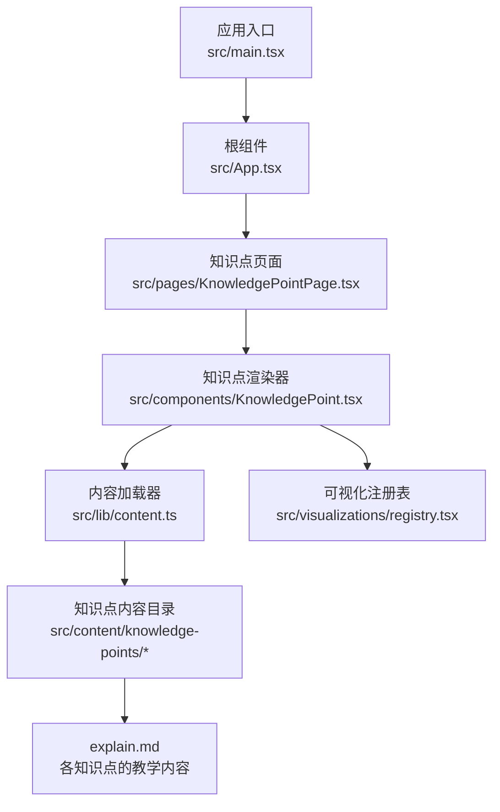
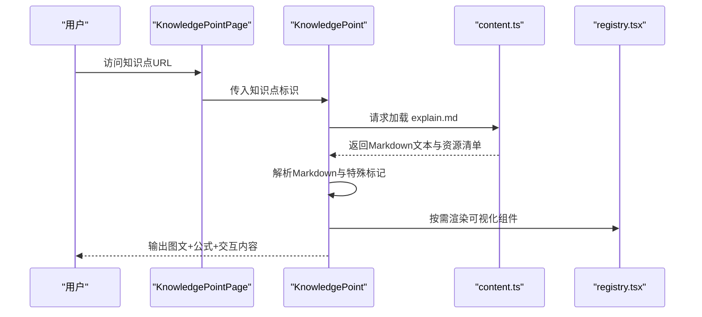
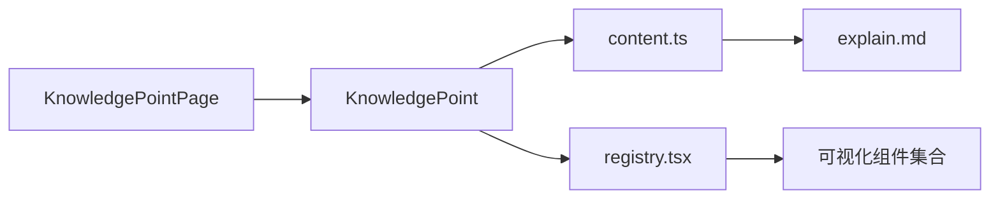

# 教学内容文档编写

<cite>
**本文档引用的文件**   
- [README.md](file://README.md)
- [package.json](file://package.json)
- [vite.config.ts](file://vite.config.ts)
- [src/App.tsx](file://src/App.tsx)
- [src/main.tsx](file://src/main.tsx)
- [src/pages/KnowledgePointPage.tsx](file://src/pages/KnowledgePointPage.tsx)
- [src/components/KnowledgePoint.tsx](file://src/components/KnowledgePoint.tsx)
- [src/lib/content.ts](file://src/lib/content.ts)
- [src/lib/types.ts](file://src/lib/types.ts)
- [src/visualizations/registry.tsx](file://src/visualizations/registry.tsx)
- [src/content/knowledge-points/g3-add-sub-10000/explain.md](file://src/content/knowledge-points/g3-add-sub-10000/explain.md)
- [src/content/knowledge-points/g3-fraction-intro/explain.md](file://src/content/knowledge-points/g3-fraction-intro/explain.md)
- [src/content/knowledge-points/g3-measurement/explain.md](file://src/content/knowledge-points/g3-measurement/explain.md)
- [src/content/knowledge-points/g4-arithmetic-laws/explain.md](file://src/content/knowledge-points/g4-arithmetic-laws/explain.md)
- [src/content/knowledge-points/g5-decimal-mult/explain.md](file://src/content/knowledge-points/g5-decimal-mult/explain.md)
- [src/content/knowledge-points/g6-sector-chart/explain.md](file://src/content/knowledge-points/g6-sector-chart/explain.md)
</cite>

## 目录
1. [简介](#简介)
2. [项目结构](#项目结构)
3. [核心组件](#核心组件)
4. [架构总览](#架构总览)
5. [详细组件分析](#详细组件分析)
6. [依赖分析](#依赖分析)
7. [性能考虑](#性能考虑)
8. [故障排查指南](#故障排查指南)
9. [结论](#结论)
10. [附录](#附录)

## 简介
本指南面向为 math-k6 项目编写教学内容的作者，聚焦 explain.md 文件的 Markdown 语法支持与特殊标记、数学公式的 LaTeX 表示方法、图片与图表插入方式、交互式元素集成，以及内容组织与可读性优化、移动端适配等最佳实践。通过本文档，你可以快速掌握在项目中创建高质量数学教学内容的规范与方法。

## 项目结构
math-k6 采用“内容驱动”的结构：每个知识点以独立目录存放 explain.md（教学内容）、game.json（游戏配置）、meta.json（元数据）等文件；页面与渲染逻辑位于 src 目录下，可视化组件集中在 visualizations 目录中。

图示来源
- [src/main.tsx:1-50](file://src/main.tsx#L1-L50)
- [src/App.tsx:1-80](file://src/App.tsx#L1-L80)
- [src/pages/KnowledgePointPage.tsx:1-120](file://src/pages/KnowledgePointPage.tsx#L1-L120)
- [src/components/KnowledgePoint.tsx:1-150](file://src/components/KnowledgePoint.tsx#L1-L150)
- [src/lib/content.ts:1-120](file://src/lib/content.ts#L1-L120)
- [src/visualizations/registry.tsx:1-120](file://src/visualizations/registry.tsx#L1-L120)

章节来源
- [README.md:1-120](file://README.md#L1-L120)
- [package.json:1-80](file://package.json#L1-L80)
- [vite.config.ts:1-60](file://vite.config.ts#L1-L60)

## 核心组件
- 知识点页面 KnowledgePointPage：负责路由与参数解析，定位具体知识点并触发渲染。
- 知识点渲染器 KnowledgePoint：读取 explain.md 内容，解析 Markdown，渲染文本、公式、图片与交互组件。
- 内容加载器 content.ts：统一加载知识点目录下的 explain.md 与相关资源，提供缓存与错误处理。
- 可视化注册表 registry.tsx：集中管理可插拔的可视化组件，供 explain.md 通过标记引用。

章节来源
- [src/pages/KnowledgePointPage.tsx:1-120](file://src/pages/KnowledgePointPage.tsx#L1-L120)
- [src/components/KnowledgePoint.tsx:1-150](file://src/components/KnowledgePoint.tsx#L1-L150)
- [src/lib/content.ts:1-120](file://src/lib/content.ts#L1-L120)
- [src/visualizations/registry.tsx:1-120](file://src/visualizations/registry.tsx#L1-L120)

## 架构总览
下图展示了从页面到内容渲染的整体流程，包括 Markdown 解析、LaTeX 公式渲染、图片与可视化组件的挂载。

图示来源
- [src/pages/KnowledgePointPage.tsx:1-120](file://src/pages/KnowledgePointPage.tsx#L1-L120)
- [src/components/KnowledgePoint.tsx:1-150](file://src/components/KnowledgePoint.tsx#L1-L150)
- [src/lib/content.ts:1-120](file://src/lib/content.ts#L1-L120)
- [src/visualizations/registry.tsx:1-120](file://src/visualizations/registry.tsx#L1-L120)

## 详细组件分析

### explain.md 的 Markdown 语法支持
- 基础语法：标题、段落、列表、粗体、斜体、代码块、表格、链接等标准 Markdown 均受支持。
- 数学公式：使用 LaTeX 语法，行内公式用 $...$，行间公式用 $$...$$。建议保持公式简洁、语义清晰，避免过长的单行公式影响可读性。
- 图片与图表：推荐使用相对路径或公共目录路径插入图片，确保跨设备加载稳定。图表建议使用 SVG 或轻量 PNG，控制尺寸与分辨率。
- 交互元素：通过自定义标记（如特定标签或占位符）引入可视化组件，由 registry.tsx 进行解析与渲染。

章节来源
- [src/components/KnowledgePoint.tsx:1-150](file://src/components/KnowledgePoint.tsx#L1-L150)
- [src/lib/content.ts:1-120](file://src/lib/content.ts#L1-L120)
- [src/visualizations/registry.tsx:1-120](file://src/visualizations/registry.tsx#L1-L120)

### 数学公式的 LaTeX 表示方法
- 行内公式：适用于简短表达式与符号说明，例如变量名、单位、简单运算式。
- 行间公式：用于重要定理、推导过程与复杂表达式，建议配合编号与注释提升可读性。
- 排版建议：合理使用分式、根号、上下标、矩阵与函数符号；避免在同一行堆叠过多符号；必要时拆分为多步展示。

章节来源
- [src/components/KnowledgePoint.tsx:1-150](file://src/components/KnowledgePoint.tsx#L1-L150)

### 插入图片、图表与交互式元素
- 图片：使用标准 Markdown 图片语法，路径指向 public 或知识点目录下的资源；建议统一命名与尺寸规范。
- 图表：优先使用矢量图（SVG），便于缩放与清晰度；若使用位图，注意压缩与懒加载。
- 交互元素：在 explain.md 中使用约定的标记调用可视化组件（如坐标网格、分数饼图、量角器等），由 registry.tsx 统一管理组件生命周期与事件绑定。

章节来源
- [src/visualizations/registry.tsx:1-120](file://src/visualizations/registry.tsx#L1-L120)
- [src/components/KnowledgePoint.tsx:1-150](file://src/components/KnowledgePoint.tsx#L1-L150)

### 教学内容组织结构建议
- 目录划分：按年级与主题划分知识点目录，每个目录包含 explain.md、game.json、meta.json。
- 内容分层：引言与目标、概念讲解、示例演示、练习与反馈、总结与拓展。
- 一致性：标题层级、术语、符号、单位与颜色风格保持一致，便于学生形成认知框架。

章节来源
- [src/content/knowledge-points/g3-add-sub-10000/explain.md:1-200](file://src/content/knowledge-points/g3-add-sub-10000/explain.md#L1-L200)
- [src/content/knowledge-points/g3-fraction-intro/explain.md:1-200](file://src/content/knowledge-points/g3-fraction-intro/explain.md#L1-L200)
- [src/content/knowledge-points/g3-measurement/explain.md:1-200](file://src/content/knowledge-points/g3-measurement/explain.md#L1-L200)
- [src/content/knowledge-points/g4-arithmetic-laws/explain.md:1-200](file://src/content/knowledge-points/g4-arithmetic-laws/explain.md#L1-L200)
- [src/content/knowledge-points/g5-decimal-mult/explain.md:1-200](file://src/content/knowledge-points/g5-decimal-mult/explain.md#L1-L200)
- [src/content/knowledge-points/g6-sector-chart/explain.md:1-200](file://src/content/knowledge-points/g6-sector-chart/explain.md#L1-L200)

### 内容可读性优化与移动端适配注意事项
- 可读性：段落长度适中，关键概念加粗或高亮；公式前后留白；列表与表格对齐清晰。
- 移动端：避免超长行与横向滚动；图片与图表设置最大宽度；交互控件尺寸适合触控操作。
- 性能：延迟加载大图与复杂可视化；减少不必要的重绘与计算。

章节来源
- [src/components/KnowledgePoint.tsx:1-150](file://src/components/KnowledgePoint.tsx#L1-L150)
- [src/visualizations/registry.tsx:1-120](file://src/visualizations/registry.tsx#L1-L120)

## 依赖分析
- 页面层依赖内容加载器与渲染器，渲染器依赖可视化注册表。
- 内容加载器统一处理 explain.md 的资源清单与缓存策略。
- 可视化组件通过注册表按需加载，降低首屏体积。

图示来源
- [src/pages/KnowledgePointPage.tsx:1-120](file://src/pages/KnowledgePointPage.tsx#L1-L120)
- [src/components/KnowledgePoint.tsx:1-150](file://src/components/KnowledgePoint.tsx#L1-L150)
- [src/lib/content.ts:1-120](file://src/lib/content.ts#L1-L120)
- [src/visualizations/registry.tsx:1-120](file://src/visualizations/registry.tsx#L1-L120)

章节来源
- [src/lib/types.ts:1-120](file://src/lib/types.ts#L1-L120)

## 性能考虑
- 内容加载：对 explain.md 与资源进行缓存，避免重复请求。
- 公式渲染：限制复杂公式数量与嵌套深度，必要时分页或折叠展示。
- 可视化组件：按需加载与销毁，减少内存占用与渲染开销。
- 图片优化：使用合适格式与尺寸，启用懒加载与占位图。

[本节为通用指导，不直接分析具体文件]

## 故障排查指南
- 内容未显示：检查 explain.md 路径与名称是否正确，确认 content.ts 能成功加载。
- 公式渲染异常：核对 LaTeX 语法是否闭合，避免非法字符与未定义命令。
- 图片加载失败：确认路径正确且资源存在，检查网络权限与跨域设置。
- 交互组件不响应：查看 registry.tsx 是否注册对应组件，检查事件绑定与状态更新。

章节来源
- [src/lib/content.ts:1-120](file://src/lib/content.ts#L1-L120)
- [src/visualizations/registry.tsx:1-120](file://src/visualizations/registry.tsx#L1-L120)
- [src/components/KnowledgePoint.tsx:1-150](file://src/components/KnowledgePoint.tsx#L1-L150)

## 结论
通过遵循本指南的 Markdown 语法、LaTeX 公式规范、图片与交互元素使用方法，以及内容组织与性能优化建议，你可以在 math-k6 项目中高效地创建高质量、易读且适配多端的数学教学内容。建议在团队内统一模板与命名规范，持续迭代内容与组件库，以提升整体教学效果与开发效率。

## 附录
- 常用 LaTeX 符号与函数参考：建议建立内部知识库，统一符号与表达习惯。
- 可视化组件清单：在 registry.tsx 中维护组件能力与使用示例，便于作者快速上手。
- 内容模板：提供 explain.md 的标准模板，包含标题、目标、正文、练习与总结等固定结构。

[本节为补充信息，不直接分析具体文件]