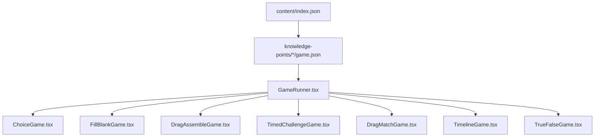
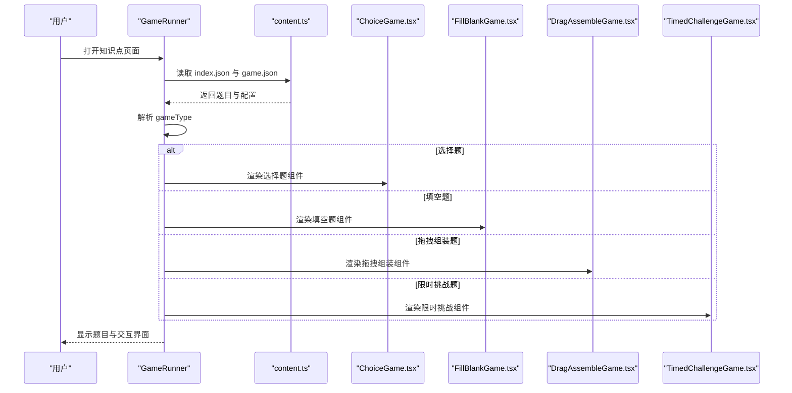
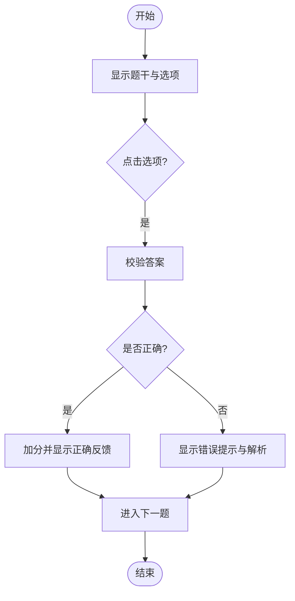
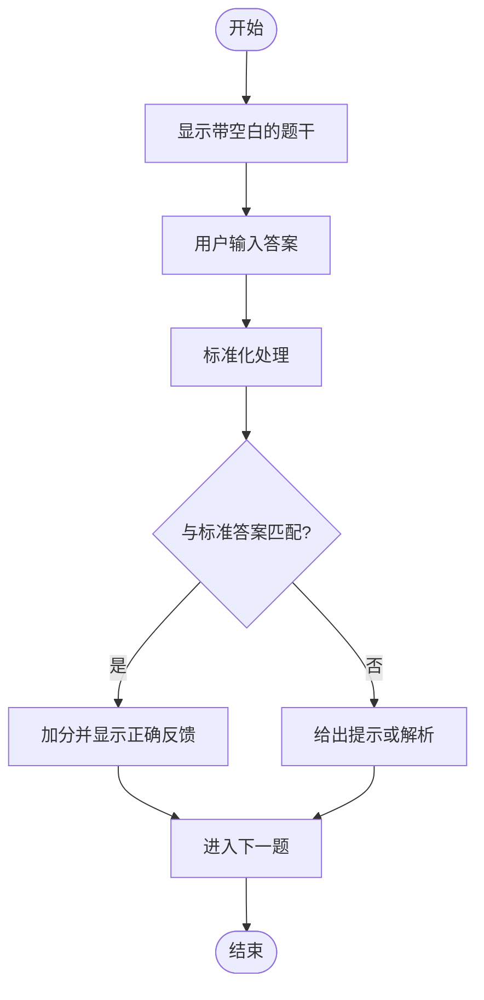
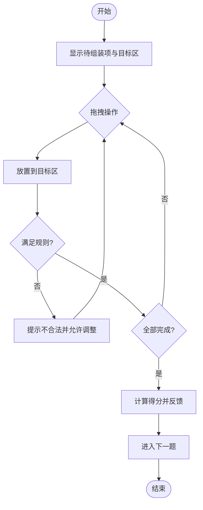
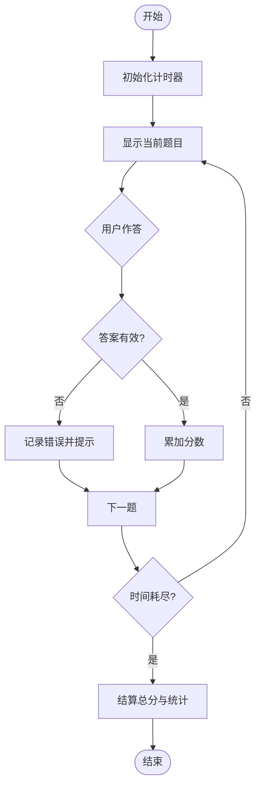
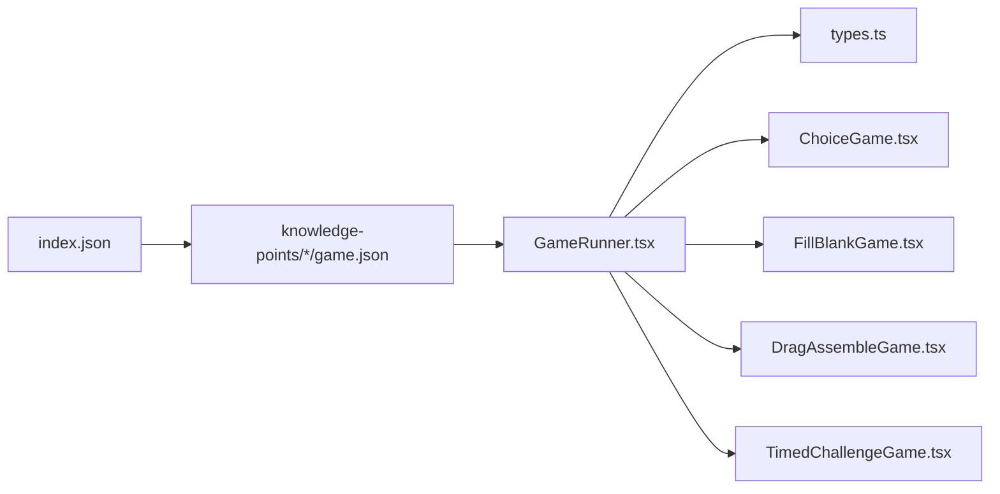

# 游戏类型配置

<cite>
**本文引用的文件**   
- [README.md](file://README.md)
- [package.json](file://package.json)
- [src/components/games/ChoiceGame.tsx](file://src/components/games/ChoiceGame.tsx)
- [src/components/games/DragAssembleGame.tsx](file://src/components/games/DragAssembleGame.tsx)
- [src/components/games/DragMatchGame.tsx](file://src/components/games/DragMatchGame.tsx)
- [src/components/games/FillBlankGame.tsx](file://src/components/games/FillBlankGame.tsx)
- [src/components/games/TimedChallengeGame.tsx](file://src/components/games/TimedChallengeGame.tsx)
- [src/components/games/TimelineGame.tsx](file://src/components/games/TimelineGame.tsx)
- [src/components/games/TrueFalseGame.tsx](file://src/components/games/TrueFalseGame.tsx)
- [src/components/GameRunner.tsx](file://src/components/GameRunner.tsx)
- [src/lib/types.ts](file://src/lib/types.ts)
- [src/lib/content.ts](file://src/lib/content.ts)
- [src/content/knowledge-points/g3-add-sub-10000/game.json](file://src/content/knowledge-points/g3-add-sub-10000/game.json)
- [src/content/knowledge-points/g3-fraction-add-sub/game.json](file://src/content/knowledge-points/g3-fraction-add-sub/game.json)
- [src/content/knowledge-points/g4-decimal-add-sub/game.json](file://src/content/knowledge-points/g4-decimal-add-sub/game.json)
- [src/content/knowledge-points/g5-equation/game.json](file://src/content/knowledge-points/g5-equation/game.json)
- [src/content/knowledge-points/g6-circle-area/game.json](file://src/content/knowledge-points/g6-circle-area/game.json)
</cite>

## 目录
1. [简介](#简介)
2. [项目结构](#项目结构)
3. [核心组件](#核心组件)
4. [架构总览](#架构总览)
5. [详细组件分析](#详细组件分析)
6. [依赖分析](#依赖分析)
7. [性能考虑](#性能考虑)
8. [故障排查指南](#故障排查指南)
9. [结论](#结论)
10. [附录](#附录)

## 简介
本指南面向 math-k6 项目的内容作者与开发者，系统说明如何为不同游戏类型编写题目配置、定义交互方式与评分规则。文档覆盖选择题、拖拽组装题、填空题、限时挑战题等常见题型，并提供完整配置示例路径、选择策略与扩展自定义游戏类型的方法。读者无需深入代码即可上手配置，同时提供进阶的源码级参考以便二次开发。

## 项目结构
math-k6 采用“按知识点组织内容”的结构：每个知识点目录包含 meta.json（元数据）、可选 explain.md（讲解）、derivation.json（推导过程）以及 game.json（游戏配置）。运行时由 GameRunner 统一加载并渲染对应游戏组件。

图表来源
- [src/lib/content.ts](file://src/lib/content.ts)
- [src/components/GameRunner.tsx](file://src/components/GameRunner.tsx)

章节来源
- [README.md](file://README.md)
- [package.json](file://package.json)

## 核心组件
- 游戏运行器：负责根据配置中的 gameType 动态加载并渲染具体游戏组件，统一管理题目列表、进度与结果。
- 各游戏组件：分别实现特定题型的交互逻辑与评分规则，如选择题的选项点击、填空题的输入校验、拖拽组装题的拖放匹配、限时挑战题的倒计时与得分计算等。
- 类型与内容：types.ts 定义统一的题目与配置接口；content.ts 负责读取与解析 content 目录下的 JSON 与 Markdown 资源。

章节来源
- [src/components/GameRunner.tsx](file://src/components/GameRunner.tsx)
- [src/lib/types.ts](file://src/lib/types.ts)
- [src/lib/content.ts](file://src/lib/content.ts)

## 架构总览
下图展示从内容索引到具体游戏渲染的关键流程，以及不同类型之间的解耦关系。

图表来源
- [src/components/GameRunner.tsx](file://src/components/GameRunner.tsx)
- [src/lib/content.ts](file://src/lib/content.ts)
- [src/components/games/ChoiceGame.tsx](file://src/components/games/ChoiceGame.tsx)
- [src/components/games/FillBlankGame.tsx](file://src/components/games/FillBlankGame.tsx)
- [src/components/games/DragAssembleGame.tsx](file://src/components/games/DragAssembleGame.tsx)
- [src/components/games/TimedChallengeGame.tsx](file://src/components/games/TimedChallengeGame.tsx)

## 详细组件分析

### 选择题（ChoiceGame）
- 适用场景：概念辨析、公式识别、单位换算等快速判断类题目。
- 题目格式要点：
  - 题干文本
  - 选项数组（含唯一正确答案或可配置的计分权重）
  - 是否允许随机化选项顺序
  - 反馈提示（正确/错误时的解释）
- 交互方式：点击选项即提交，支持即时反馈与下一题跳转。
- 评分规则：默认单选正确得满分，可配置多答案或部分得分。
- 配置关键字段建议：
  - type: "choice"
  - question: 题干
  - options: 选项列表
  - answer: 正确答案标识或索引
  - feedback: 反馈文案
  - shuffle: 是否打乱选项
  - scoring: 分值与部分得分策略
- 完整配置示例路径：[g3-add-sub-10000/game.json](file://src/content/knowledge-points/g3-add-sub-10000/game.json)

图表来源
- [src/components/games/ChoiceGame.tsx](file://src/components/games/ChoiceGame.tsx)

章节来源
- [src/components/games/ChoiceGame.tsx](file://src/components/games/ChoiceGame.tsx)
- [src/content/knowledge-points/g3-add-sub-10000/game.json](file://src/content/knowledge-points/g3-add-sub-10000/game.json)

### 填空题（FillBlankGame）
- 适用场景：数值填空、单位填写、表达式补全等。
- 题目格式要点：
  - 题干中用占位符标记空白位置
  - 标准答案与容差范围（数值型）
  - 大小写与空格处理策略
  - 提示与纠错信息
- 交互方式：在空白处输入并提交，支持多次尝试与逐步提示。
- 评分规则：完全匹配得满分，可配置容错与部分得分。
- 配置关键字段建议：
  - type: "fillblank"
  - question: 带占位符的题干
  - answers: 标准答案数组（支持多个等价答案）
  - tolerance: 数值容差
  - normalize: 标准化规则（去空格、转小写等）
  - hints: 分步提示
  - scoring: 分值与重试策略
- 完整配置示例路径：[g4-decimal-add-sub/game.json](file://src/content/knowledge-points/g4-decimal-add-sub/game.json)

图表来源
- [src/components/games/FillBlankGame.tsx](file://src/components/games/FillBlankGame.tsx)

章节来源
- [src/components/games/FillBlankGame.tsx](file://src/components/games/FillBlankGame.tsx)
- [src/content/knowledge-points/g4-decimal-add-sub/game.json](file://src/content/knowledge-points/g4-decimal-add-sub/game.json)

### 拖拽组装题（DragAssembleGame）
- 适用场景：排序、分类、配对、拼图式组合等。
- 题目格式要点：
  - 待组装项集合（可分组或分栏）
  - 目标区域与约束（数量限制、顺序要求）
  - 验证规则（整体正确性、局部容错）
- 交互方式：拖拽元素至目标区域，支持撤销与重置。
- 评分规则：按正确率与完成时间综合计分，可配置部分得分。
- 配置关键字段建议：
  - type: "dragassemble"
  - items: 待组装项列表
  - zones: 目标区域定义
  - rules: 组装规则与约束
  - validation: 验证策略
  - scoring: 分值与时间惩罚
- 完整配置示例路径：[g5-equation/game.json](file://src/content/knowledge-points/g5-equation/game.json)

图表来源
- [src/components/games/DragAssembleGame.tsx](file://src/components/games/DragAssembleGame.tsx)

章节来源
- [src/components/games/DragAssembleGame.tsx](file://src/components/games/DragAssembleGame.tsx)
- [src/content/knowledge-points/g5-equation/game.json](file://src/content/knowledge-points/g5-equation/game.json)

### 限时挑战题（TimedChallengeGame）
- 适用场景：速度训练、口算竞赛、闯关模式。
- 题目格式要点：
  - 题目序列与难度梯度
  - 总时长与单题时限
  - 得分函数（基于正确数、用时、连击奖励）
- 交互方式：倒计时内作答，自动推进或手动确认。
- 评分规则：基础分+时间系数+连击加成，超时扣分。
- 配置关键字段建议：
  - type: "timedchallenge"
  - questions: 题目序列
  - duration: 总时长（秒）
  - perQuestionTime: 单题时限
  - scoring: 得分函数参数
  - penalties: 超时与错误惩罚
- 完整配置示例路径：[g6-circle-area/game.json](file://src/content/knowledge-points/g6-circle-area/game.json)

图表来源
- [src/components/games/TimedChallengeGame.tsx](file://src/components/games/TimedChallengeGame.tsx)

章节来源
- [src/components/games/TimedChallengeGame.tsx](file://src/components/games/TimedChallengeGame.tsx)
- [src/content/knowledge-points/g6-circle-area/game.json](file://src/content/knowledge-points/g6-circle-area/game.json)

### 其他题型概览
- 拖拽匹配题（DragMatchGame）：用于左右两列元素的配对匹配，适合概念与术语对照。
- 时间线题（TimelineGame）：用于事件排序与因果链构建，适合历史与流程类知识。
- 判断题（TrueFalseGame）：用于是非判断与概念澄清，适合快速检测理解度。

章节来源
- [src/components/games/DragMatchGame.tsx](file://src/components/games/DragMatchGame.tsx)
- [src/components/games/TimelineGame.tsx](file://src/components/games/TimelineGame.tsx)
- [src/components/games/TrueFalseGame.tsx](file://src/components/games/TrueFalseGame.tsx)

## 依赖分析
- 内容层：content/index.json 汇总知识点目录，各 knowledge-point 下的 game.json 描述具体题目与配置。
- 运行层：GameRunner 根据配置中的 gameType 动态选择组件，避免硬编码分支。
- 类型层：types.ts 定义统一的数据结构与接口，确保内容与组件间契约一致。
- 资源层：content.ts 负责读取与解析 JSON/Markdown，保证跨平台一致性。

图表来源
- [src/lib/content.ts](file://src/lib/content.ts)
- [src/components/GameRunner.tsx](file://src/components/GameRunner.tsx)
- [src/lib/types.ts](file://src/lib/types.ts)

章节来源
- [src/lib/content.ts](file://src/lib/content.ts)
- [src/components/GameRunner.tsx](file://src/components/GameRunner.tsx)
- [src/lib/types.ts](file://src/lib/types.ts)

## 性能考虑
- 懒加载与按需渲染：仅在当前题目可见时渲染对应组件，减少初始包体积与内存占用。
- 数据序列化优化：对大题库进行分页或虚拟滚动，避免一次性加载过多 DOM。
- 计算密集型任务：将耗时计算（如复杂校验、生成大量中间态）放入 Web Worker 或异步队列。
- 动画与交互：控制拖拽与动画帧率，必要时降级为静态展示以提升低端设备体验。
- 缓存策略：对静态题目与解析结果进行本地缓存，减少重复 IO。

## 故障排查指南
- 配置解析失败：检查 game.json 字段命名与类型是否与 types.ts 定义一致，确保必填字段齐全。
- 组件未渲染：确认 gameType 值与组件注册名一致，避免拼写错误或大小写问题。
- 评分异常：核对 scoring 配置与验证逻辑，确保容差、归一化与部分得分策略符合预期。
- 交互卡顿：检查拖拽与动画实现，降低重绘频率，必要时禁用非必要特效。
- 资源加载错误：确认 content/index.json 与子目录结构正确，路径引用无误。

章节来源
- [src/lib/types.ts](file://src/lib/types.ts)
- [src/lib/content.ts](file://src/lib/content.ts)
- [src/components/GameRunner.tsx](file://src/components/GameRunner.tsx)

## 结论
通过统一的配置结构与运行时解析机制，math-k6 能够灵活支撑多种游戏类型。内容作者只需关注题目与评分配置，开发者则可通过扩展 types 与组件注册表快速接入新题型。建议在选题时结合知识点特性与学习目标，优先选择能最大化体现能力点的题型，并在性能敏感场景下做好资源与计算优化。

## 附录

### 题型选择策略
- 概念辨识与记忆：选择题、判断题
- 计算与应用：填空题、限时挑战题
- 逻辑与结构：拖拽组装题、时间线题
- 匹配与关联：拖拽匹配题

### 自定义游戏类型扩展方法
- 新增组件：在 components/games 下创建新组件，实现交互与评分逻辑。
- 更新类型：在 types.ts 中扩展题目与配置接口，保持向后兼容。
- 注册路由：在 GameRunner 中根据新的 gameType 值映射到新组件。
- 提供示例：在某个 knowledge-point 目录下添加 game.json 示例，便于测试与复用。

### 完整配置示例路径
- 选择题示例：[g3-add-sub-10000/game.json](file://src/content/knowledge-points/g3-add-sub-10000/game.json)
- 填空题示例：[g4-decimal-add-sub/game.json](file://src/content/knowledge-points/g4-decimal-add-sub/game.json)
- 拖拽组装题示例：[g5-equation/game.json](file://src/content/knowledge-points/g5-equation/game.json)
- 限时挑战题示例：[g6-circle-area/game.json](file://src/content/knowledge-points/g6-circle-area/game.json)
- 其他题型参考：[g3-fraction-add-sub/game.json](file://src/content/knowledge-points/g3-fraction-add-sub/game.json)