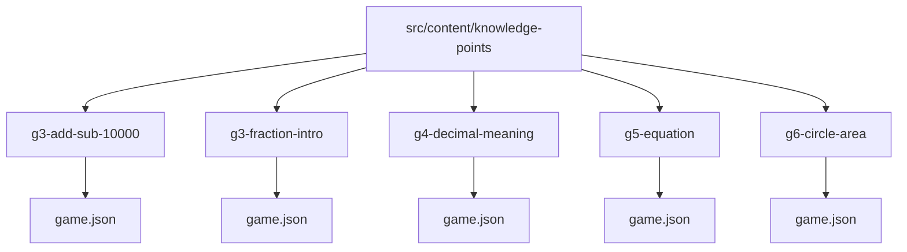
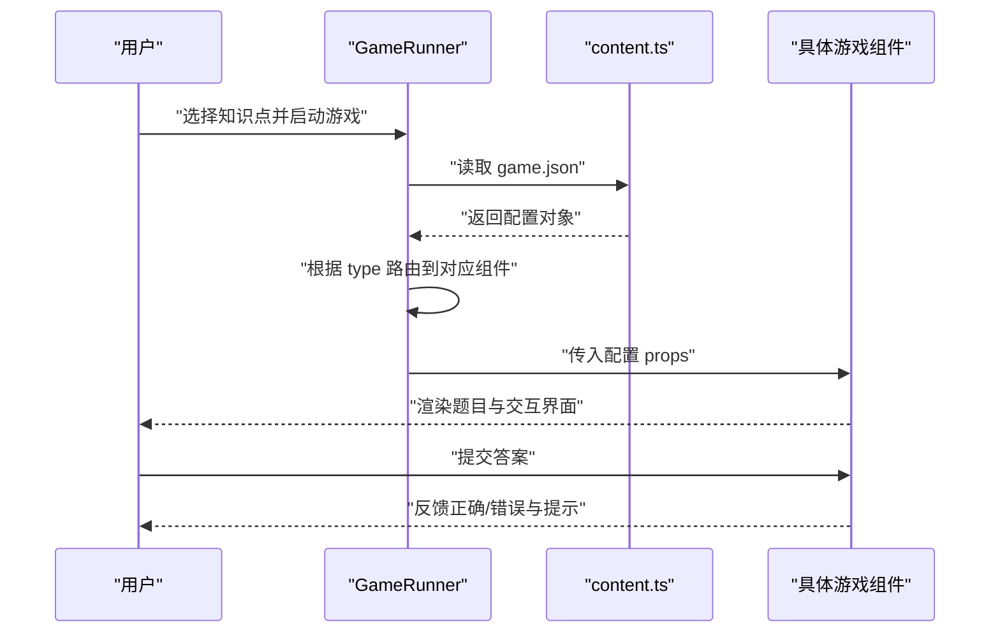
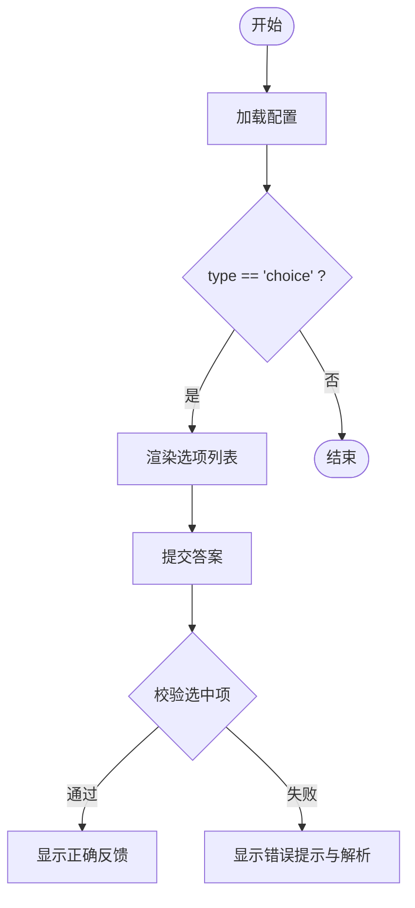
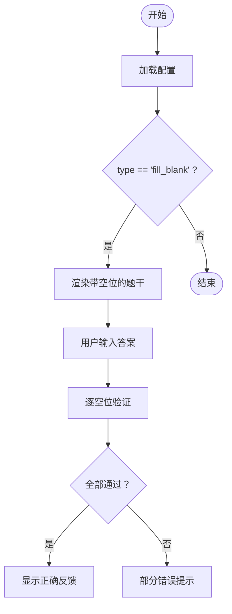
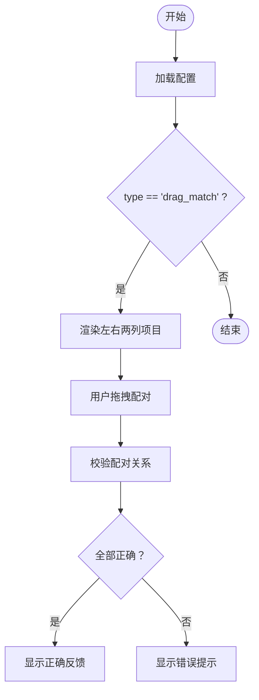
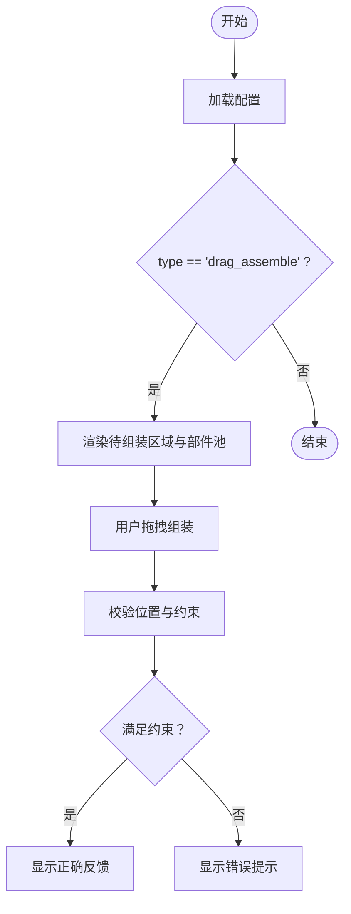
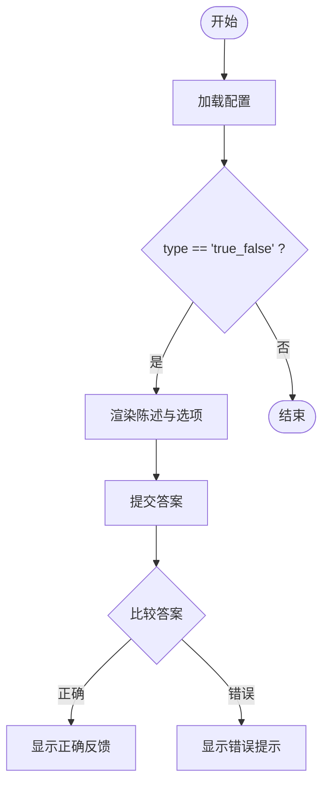
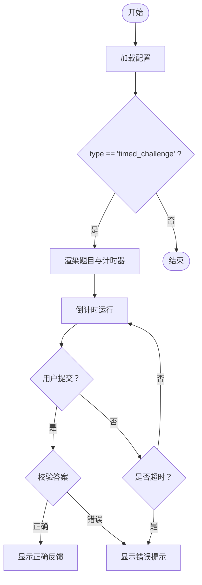
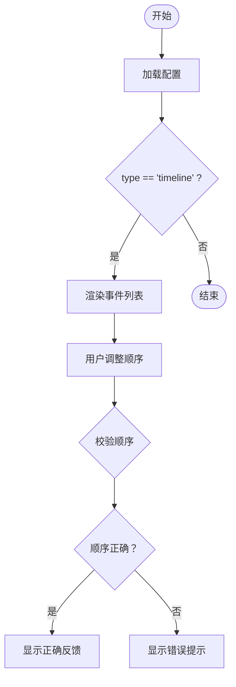
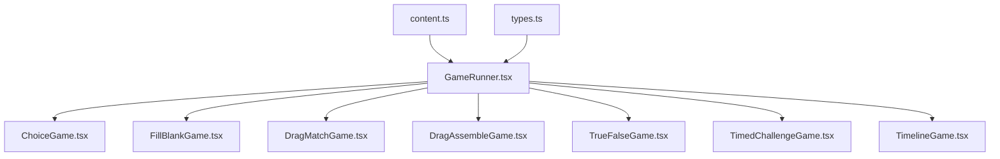

# 游戏配置开发

<cite>
**本文档引用的文件**   
- [README.md](file://README.md)
- [package.json](file://package.json)
- [src/lib/types.ts](file://src/lib/types.ts)
- [src/components/GameRunner.tsx](file://src/components/GameRunner.tsx)
- [src/components/games/ChoiceGame.tsx](file://src/components/games/ChoiceGame.tsx)
- [src/components/games/FillBlankGame.tsx](file://src/components/games/FillBlankGame.tsx)
- [src/components/games/DragMatchGame.tsx](file://src/components/games/DragMatchGame.tsx)
- [src/components/games/DragAssembleGame.tsx](file://src/components/games/DragAssembleGame.tsx)
- [src/components/games/TrueFalseGame.tsx](file://src/components/games/TrueFalseGame.tsx)
- [src/components/games/TimedChallengeGame.tsx](file://src/components/games/TimedChallengeGame.tsx)
- [src/components/games/TimelineGame.tsx](file://src/components/games/TimelineGame.tsx)
- [src/content/knowledge-points/g3-add-sub-10000/game.json](file://src/content/knowledge-points/g3-add-sub-10000/game.json)
- [src/content/knowledge-points/g3-fraction-intro/game.json](file://src/content/knowledge-points/g3-fraction-intro/game.json)
- [src/content/knowledge-points/g4-decimal-meaning/game.json](file://src/content/knowledge-points/g4-decimal-meaning/game.json)
- [src/content/knowledge-points/g5-equation/game.json](file://src/content/knowledge-points/g5-equation/game.json)
- [src/content/knowledge-points/g6-circle-area/game.json](file://src/content/knowledge-points/g6-circle-area/game.json)
- [src/lib/content.ts](file://src/lib/content.ts)
- [src/test/gameRunner.test.ts](file://src/test/gameRunner.test.ts)
</cite>

## 目录
1. [简介](#简介)
2. [项目结构](#项目结构)
3. [核心组件](#核心组件)
4. [架构总览](#架构总览)
5. [详细组件分析](#详细组件分析)
6. [依赖分析](#依赖分析)
7. [性能考虑](#性能考虑)
8. [故障排查指南](#故障排查指南)
9. [结论](#结论)
10. [附录：game.json 字段规范与示例](#附录gamejson-字段规范与示例)

## 简介
本指南面向 math-k6 项目的数学游戏内容开发者，聚焦于 game.json 的配置结构与字段定义，帮助读者快速掌握如何为不同题型（选择题、填空题、判断题、拖拽匹配、拖拽组装、限时挑战、时间线等）编写正确的游戏配置。文档涵盖：
- game.json 的通用字段与各题型特有字段说明
- 答案验证规则与数据格式要求
- 不同游戏类型的配置差异
- 完整的游戏配置示例与字段说明
- 调试与测试方法

## 项目结构
math-k6 采用“知识点目录 + 配置文件”的组织方式。每个知识点目录下包含：
- explain.md：讲解内容
- meta.json：元信息（如标题、年级、难度等）
- game.json：游戏配置
- derivation.json（可选）：推导过程或教学素材

**图表来源** 
- [src/content/knowledge-points/g3-add-sub-10000/game.json](file://src/content/knowledge-points/g3-add-sub-10000/game.json)
- [src/content/knowledge-points/g3-fraction-intro/game.json](file://src/content/knowledge-points/g3-fraction-intro/game.json)
- [src/content/knowledge-points/g4-decimal-meaning/game.json](file://src/content/knowledge-points/g4-decimal-meaning/game.json)
- [src/content/knowledge-points/g5-equation/game.json](file://src/content/knowledge-points/g5-equation/game.json)
- [src/content/knowledge-points/g6-circle-area/game.json](file://src/content/knowledge-points/g6-circle-area/game.json)

**章节来源**
- [README.md](file://README.md)
- [package.json](file://package.json)

## 核心组件
- GameRunner：统一加载并运行各类型游戏的入口，负责解析 game.json 并根据 type 分发到对应游戏组件。
- 各题型组件：ChoiceGame、FillBlankGame、DragMatchGame、DragAssembleGame、TrueFalseGame、TimedChallengeGame、TimelineGame 等，分别渲染对应的交互界面与校验逻辑。
- 类型定义：src/lib/types.ts 中定义了 game.json 的数据模型与约束，确保配置一致性。

**章节来源**
- [src/components/GameRunner.tsx](file://src/components/GameRunner.tsx)
- [src/lib/types.ts](file://src/lib/types.ts)

## 架构总览
下图展示了从知识点目录中的 game.json 到具体游戏组件的运行流程，以及运行时数据流。

**图表来源** 
- [src/components/GameRunner.tsx](file://src/components/GameRunner.tsx)
- [src/lib/content.ts](file://src/lib/content.ts)

## 详细组件分析

### 选择题（ChoiceGame）
- 适用场景：单选或多选题目
- 关键配置字段：
  - type: "choice"
  - question: 题干文本
  - options: 选项数组，每项包含 id、text、isCorrect（布尔）
  - allowMultiple: 是否允许多选（布尔，可选）
  - explanation: 答案解析（可选）
- 答案验证：
  - 单选：比较选中项 id 与 isCorrect 为 true 的选项 id
  - 多选：比较选中集合与所有 isCorrect 为 true 的 id 集合是否一致

**图表来源** 
- [src/components/games/ChoiceGame.tsx](file://src/components/games/ChoiceGame.tsx)

**章节来源**
- [src/components/games/ChoiceGame.tsx](file://src/components/games/ChoiceGame.tsx)

### 填空题（FillBlankGame）
- 适用场景：需要输入数字、表达式或文本的空格题
- 关键配置字段：
  - type: "fill_blank"
  - question: 题干文本，使用占位符标识空位（例如 {{blank_1}}）
  - blanks: 空位数组，每项包含 id、answer（期望值）、hint（提示，可选）、unit（单位，可选）
  - validation: 验证策略（字符串或函数名，可选），支持数值近似、忽略大小写、去空格等
- 答案验证：
  - 按空位逐一比对，支持容差（如数值误差范围）
  - 可配置单位换算与标准化处理

**图表来源** 
- [src/components/games/FillBlankGame.tsx](file://src/components/games/FillBlankGame.tsx)

**章节来源**
- [src/components/games/FillBlankGame.tsx](file://src/components/games/FillBlankGame.tsx)

### 拖拽匹配（DragMatchGame）
- 适用场景：将左侧项目与右侧项目进行配对
- 关键配置字段：
  - type: "drag_match"
  - question: 题干文本（可选）
  - pairs: 配对数组，每项包含 leftId、rightId、labelLeft、labelRight
  - shuffle: 是否打乱顺序（布尔，可选）
- 答案验证：
  - 检查每对拖拽结果是否与配置的 pairs 一致

**图表来源** 
- [src/components/games/DragMatchGame.tsx](file://src/components/games/DragMatchGame.tsx)

**章节来源**
- [src/components/games/DragMatchGame.tsx](file://src/components/games/DragMatchGame.tsx)

### 拖拽组装（DragAssembleGame）
- 适用场景：将多个部件按正确顺序或位置组装
- 关键配置字段：
  - type: "drag_assemble"
  - question: 题干文本（可选）
  - parts: 部件数组，每项包含 id、label、targetIndex（目标位置索引）
  - constraints: 约束条件（可选），如相邻关系、相对顺序
- 答案验证：
  - 检查最终布局是否符合 targetIndex 与约束条件

**图表来源** 
- [src/components/games/DragAssembleGame.tsx](file://src/components/games/DragAssembleGame.tsx)

**章节来源**
- [src/components/games/DragAssembleGame.tsx](file://src/components/games/DragAssembleGame.tsx)

### 判断题（TrueFalseGame）
- 适用场景：判断陈述是否正确
- 关键配置字段：
  - type: "true_false"
  - question: 陈述文本
  - answer: 正确答案（布尔）
  - explanation: 解析（可选）
- 答案验证：
  - 直接比较用户选择与 answer

**图表来源** 
- [src/components/games/TrueFalseGame.tsx](file://src/components/games/TrueFalseGame.tsx)

**章节来源**
- [src/components/games/TrueFalseGame.tsx](file://src/components/games/TrueFalseGame.tsx)

### 限时挑战（TimedChallengeGame）
- 适用场景：在限定时间内完成答题
- 关键配置字段：
  - type: "timed_challenge"
  - question: 题干文本
  - answer: 正确答案（类型依题型而定）
  - timeLimit: 时限（秒）
  - feedback: 超时或错误时的提示（可选）
- 答案验证：
  - 在时限内提交才有效；超时自动判定失败

**图表来源** 
- [src/components/games/TimedChallengeGame.tsx](file://src/components/games/TimedChallengeGame.tsx)

**章节来源**
- [src/components/games/TimedChallengeGame.tsx](file://src/components/games/TimedChallengeGame.tsx)

### 时间线（TimelineGame）
- 适用场景：按时间顺序排列事件或步骤
- 关键配置字段：
  - type: "timeline"
  - question: 题干文本（可选）
  - events: 事件数组，每项包含 id、label、correctOrder（正确顺序索引）
  - hint: 提示（可选）
- 答案验证：
  - 检查用户排序是否与 correctOrder 一致

**图表来源** 
- [src/components/games/TimelineGame.tsx](file://src/components/games/TimelineGame.tsx)

**章节来源**
- [src/components/games/TimelineGame.tsx](file://src/components/games/TimelineGame.tsx)

## 依赖分析
- content.ts：负责读取与缓存知识点目录下的 game.json，提供统一的接口供 GameRunner 调用。
- types.ts：定义 game.json 的类型与约束，确保配置的结构化与一致性。
- GameRunner：根据配置中的 type 字段路由到具体组件，并传递 props。
- 各游戏组件：实现各自的答案校验与交互逻辑。

**图表来源** 
- [src/lib/content.ts](file://src/lib/content.ts)
- [src/lib/types.ts](file://src/lib/types.ts)
- [src/components/GameRunner.tsx](file://src/components/GameRunner.tsx)
- [src/components/games/ChoiceGame.tsx](file://src/components/games/ChoiceGame.tsx)
- [src/components/games/FillBlankGame.tsx](file://src/components/games/FillBlankGame.tsx)
- [src/components/games/DragMatchGame.tsx](file://src/components/games/DragMatchGame.tsx)
- [src/components/games/DragAssembleGame.tsx](file://src/components/games/DragAssembleGame.tsx)
- [src/components/games/TrueFalseGame.tsx](file://src/components/games/TrueFalseGame.tsx)
- [src/components/games/TimedChallengeGame.tsx](file://src/components/games/TimedChallengeGame.tsx)
- [src/components/games/TimelineGame.tsx](file://src/components/games/TimelineGame.tsx)

**章节来源**
- [src/lib/content.ts](file://src/lib/content.ts)
- [src/lib/types.ts](file://src/lib/types.ts)
- [src/components/GameRunner.tsx](file://src/components/GameRunner.tsx)

## 性能考虑
- 配置缓存：content.ts 应缓存已加载的 game.json，避免重复 I/O 开销。
- 组件懒加载：可按需加载特定游戏组件，减少初始包体积。
- 校验优化：对复杂题型（如拖拽组装）的校验逻辑应避免 O(n^2) 复杂度，必要时引入哈希映射。
- 渲染优化：大量动态内容时，使用虚拟滚动或分页加载提升用户体验。

[本节为通用指导，不直接分析具体文件]

## 故障排查指南
- 常见错误：
  - 缺少必填字段（如 type、question、answer/options/blanks 等）
  - 数据类型不符（布尔、字符串、数组、对象）
  - 答案验证失败（数值精度、大小写、空格、单位不一致）
  - 路径错误导致 game.json 无法加载
- 调试建议：
  - 在浏览器控制台查看 content.ts 的加载日志
  - 使用单元测试验证配置与校验逻辑
  - 逐步缩小问题范围，先确认 type 路由是否正常

**章节来源**
- [src/test/gameRunner.test.ts](file://src/test/gameRunner.test.ts)

## 结论
通过遵循本指南的字段规范与验证规则，开发者可以快速构建稳定、易维护的数学游戏配置。建议在开发过程中结合单元测试与可视化调试工具，确保配置的正确性与用户体验。

[本节为总结性内容，不直接分析具体文件]

## 附录：game.json 字段规范与示例

### 通用字段
- type: 游戏类型（必填），取值包括 choice、fill_blank、drag_match、drag_assemble、true_false、timed_challenge、timeline
- question: 题干文本（必填，除个别题型允许省略）
- explanation: 答案解析（可选）
- difficulty: 难度等级（可选，整数或枚举）
- tags: 标签数组（可选）

### 选择题（choice）
- options: 选项数组（必填），每项包含：
  - id: 唯一标识（字符串）
  - text: 选项文本（字符串）
  - isCorrect: 是否为正确答案（布尔）
- allowMultiple: 是否允许多选（布尔，可选）

### 填空题（fill_blank）
- blanks: 空位数组（必填），每项包含：
  - id: 空位标识（字符串）
  - answer: 期望答案（字符串或数值）
  - hint: 提示（字符串，可选）
  - unit: 单位（字符串，可选）
- validation: 验证策略（字符串或对象，可选），支持：
  - 数值容差（如 tolerance）
  - 忽略大小写（ignoreCase）
  - 去除空格（trim）
  - 单位换算（unitConversion）

### 拖拽匹配（drag_match）
- pairs: 配对数组（必填），每项包含：
  - leftId: 左侧项目 id（字符串）
  - rightId: 右侧项目 id（字符串）
  - labelLeft: 左侧标签（字符串）
  - labelRight: 右侧标签（字符串）
- shuffle: 是否打乱顺序（布尔，可选）

### 拖拽组装（drag_assemble）
- parts: 部件数组（必填），每项包含：
  - id: 部件 id（字符串）
  - label: 部件标签（字符串）
  - targetIndex: 目标位置索引（整数）
- constraints: 约束条件（对象，可选），如相邻关系、相对顺序

### 判断题（true_false）
- answer: 正确答案（布尔）

### 限时挑战（timed_challenge）
- answer: 正确答案（类型依题型而定）
- timeLimit: 时限（秒，整数）
- feedback: 超时或错误提示（字符串，可选）

### 时间线（timeline）
- events: 事件数组（必填），每项包含：
  - id: 事件 id（字符串）
  - label: 事件标签（字符串）
  - correctOrder: 正确顺序索引（整数）
- hint: 提示（字符串，可选）

### 示例与参考
以下为项目中已有的 game.json 示例路径，可用于对照字段结构与取值：
- [src/content/knowledge-points/g3-add-sub-10000/game.json](file://src/content/knowledge-points/g3-add-sub-10000/game.json)
- [src/content/knowledge-points/g3-fraction-intro/game.json](file://src/content/knowledge-points/g3-fraction-intro/game.json)
- [src/content/knowledge-points/g4-decimal-meaning/game.json](file://src/content/knowledge-points/g4-decimal-meaning/game.json)
- [src/content/knowledge-points/g5-equation/game.json](file://src/content/knowledge-points/g5-equation/game.json)
- [src/content/knowledge-points/g6-circle-area/game.json](file://src/content/knowledge-points/g6-circle-area/game.json)

**章节来源**
- [src/content/knowledge-points/g3-add-sub-10000/game.json](file://src/content/knowledge-points/g3-add-sub-10000/game.json)
- [src/content/knowledge-points/g3-fraction-intro/game.json](file://src/content/knowledge-points/g3-fraction-intro/game.json)
- [src/content/knowledge-points/g4-decimal-meaning/game.json](file://src/content/knowledge-points/g4-decimal-meaning/game.json)
- [src/content/knowledge-points/g5-equation/game.json](file://src/content/knowledge-points/g5-equation/game.json)
- [src/content/knowledge-points/g6-circle-area/game.json](file://src/content/knowledge-points/g6-circle-area/game.json)