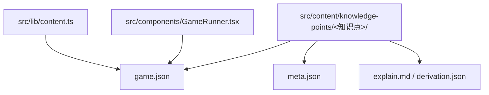
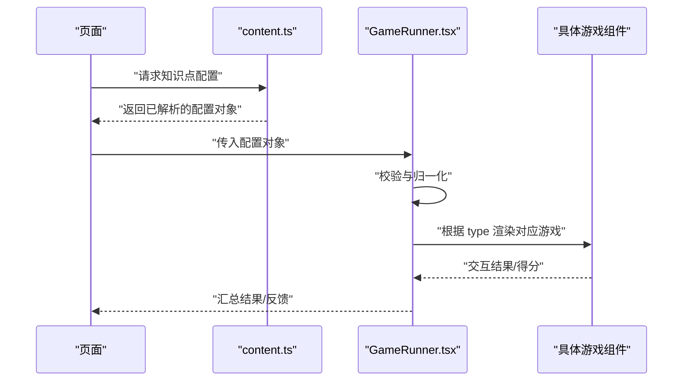
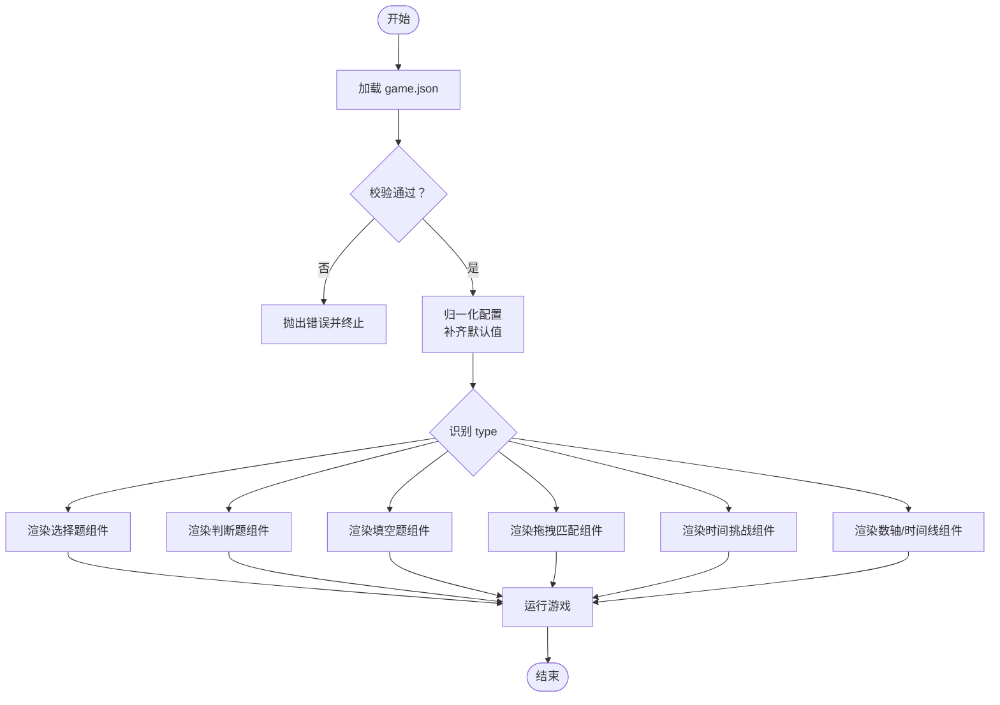
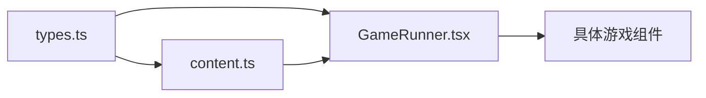

# 游戏配置结构

<cite>
**本文档引用的文件**
- [src/content/knowledge-points/g3-add-sub-10000/game.json](file://src/content/knowledge-points/g3-add-sub-10000/game.json)
- [src/content/knowledge-points/g3-division-remainder/game.json](file://src/content/knowledge-points/g3-division-remainder/game.json)
- [src/content/knowledge-points/g3-fraction-add-sub/game.json](file://src/content/knowledge-points/g3-fraction-add-sub/game.json)
- [src/content/knowledge-points/g4-bar-chart/game.json](file://src/content/knowledge-points/g4-bar-chart/game.json)
- [src/content/knowledge-points/g5-equation/game.json](file://src/content/knowledge-points/g5-equation/game.json)
- [src/content/knowledge-points/g6-circle-area/game.json](file://src/content/knowledge-points/g6-circle-area/game.json)
- [src/lib/types.ts](file://src/lib/types.ts)
- [src/components/GameRunner.tsx](file://src/components/GameRunner.tsx)
- [src/lib/content.ts](file://src/lib/content.ts)
</cite>

## 目录
1. [简介](#简介)
2. [项目结构](#项目结构)
3. [核心组件](#核心组件)
4. [架构总览](#架构总览)
5. [详细组件分析](#详细组件分析)
6. [依赖关系分析](#依赖关系分析)
7. [性能考虑](#性能考虑)
8. [故障排查指南](#故障排查指南)
9. [结论](#结论)
10. [附录](#附录)

## 简介
本文件为 math-k6 项目的“游戏配置结构”提供权威说明，聚焦于每个知识点目录下的 game.json 配置文件。文档将：
- 解释 game.json 的基础结构与必需字段（如 type、questions、options 等）
- 描述配置文件的层次结构与数据关系
- 给出完整的配置示例与字段类型定义
- 说明配置验证规则与错误处理机制
- 总结最佳实践与常见陷阱

## 项目结构
math-k6 采用“按知识点分目录”的组织方式，每个知识点目录包含：
- game.json：游戏运行时所需的配置
- meta.json：元信息（名称、年级、难度等）
- explain.md/derivation.json：讲解或推导内容（可选）

图表来源
- [src/lib/content.ts](file://src/lib/content.ts)
- [src/components/GameRunner.tsx](file://src/components/GameRunner.tsx)

章节来源
- [src/lib/content.ts](file://src/lib/content.ts)
- [src/components/GameRunner.tsx](file://src/components/GameRunner.tsx)

## 核心组件
- 配置加载器：负责读取并解析各知识点的 game.json，将其转换为运行时可用的数据结构。
- 游戏运行器：根据解析后的配置渲染对应题型的游戏界面，驱动交互与评分。
- 类型定义：集中声明配置项的类型约束，确保配置校验与 IDE 提示的一致性。

章节来源
- [src/lib/content.ts](file://src/lib/content.ts)
- [src/components/GameRunner.tsx](file://src/components/GameRunner.tsx)
- [src/lib/types.ts](file://src/lib/types.ts)

## 架构总览
下图展示了从配置到运行的关键路径：content.ts 读取 game.json，GameRunner 消费配置并渲染具体游戏。

图表来源
- [src/lib/content.ts](file://src/lib/content.ts)
- [src/components/GameRunner.tsx](file://src/components/GameRunner.tsx)

## 详细组件分析

### game.json 基础结构与字段定义
- 顶层字段
  - type：字符串，表示游戏类型（如选择题、判断题、填空题、拖拽匹配、时间挑战、数轴/时间线等）。该字段决定渲染的具体游戏组件。
  - questions：数组，题目集合。每项代表一道题，包含题干、选项、答案、解析等。
  - options：对象，全局游戏级选项，如是否计时、是否随机打乱、是否显示解析、是否允许重试等。
- 题目项字段（questions[i]）
  - id：唯一标识（建议字符串或数字）
  - title：题干文本
  - type：题目级别类型（可省略，默认继承顶层 type）
  - options：题目级选项（覆盖全局 options）
  - answer：正确答案（类型随题型变化）
  - explanation：解析说明（可选）
  - difficulty：难度等级（可选）
- 全局选项字段（options）
  - timeLimit：秒，限制答题时长（可选）
  - shuffle：布尔，是否随机打乱题目顺序（可选）
  - showExplanation：布尔，是否展示解析（可选）
  - retryAllowed：布尔，是否允许重试（可选）
  - scoring：计分策略对象（可选），如每题分值、总分上限等

章节来源
- [src/lib/types.ts](file://src/lib/types.ts)

### 配置示例与字段类型
以下为典型 game.json 的字段组合示例（以文字描述为主，避免直接粘贴代码）：
- 选择题示例要点
  - type 设为“选择题”
  - questions 中每个题目的 answer 为选中项索引或键名
  - options.shuffle 常设为 true，提升重复练习体验
- 判断题示例要点
  - type 设为“判断题”
  - questions.answer 为布尔值
- 填空题示例要点
  - type 设为“填空题”
  - questions.answer 为字符串或数值，支持多答案时可用数组
- 拖拽匹配示例要点
  - type 设为“拖拽匹配”
  - questions 可能包含 pairs 列表，answer 为配对映射
- 时间挑战示例要点
  - type 设为“时间挑战”
  - options.timeLimit 必填，用于倒计时与超时判定
- 数轴/时间线示例要点
  - type 设为“数轴/时间线”
  - questions 可能包含坐标或时间点，answer 为数值或时间戳

章节来源
- [src/content/knowledge-points/g3-add-sub-10000/game.json](file://src/content/knowledge-points/g3-add-sub-10000/game.json)
- [src/content/knowledge-points/g3-division-remainder/game.json](file://src/content/knowledge-points/g3-division-remainder/game.json)
- [src/content/knowledge-points/g3-fraction-add-sub/game.json](file://src/content/knowledge-points/g3-fraction-add-sub/game.json)
- [src/content/knowledge-points/g4-bar-chart/game.json](file://src/content/knowledge-points/g4-bar-chart/game.json)
- [src/content/knowledge-points/g5-equation/game.json](file://src/content/knowledge-points/g5-equation/game.json)
- [src/content/knowledge-points/g6-circle-area/game.json](file://src/content/knowledge-points/g6-circle-area/game.json)

### 配置验证规则与错误处理
- 必填校验
  - type 必须存在且为已知枚举值之一
  - questions 必须为非空数组
  - 每道题至少包含 id、title、answer
- 类型校验
  - options 为对象；timeLimit 为正整数；shuffle 为布尔
  - answer 类型与题型一致（如判断题为布尔，选择题为索引或键名）
- 业务校验
  - 若启用 shuffle，需保证题目数量大于 1
  - 若启用 timeLimit，需确保 timeLimit > 0
- 错误处理
  - 校验失败时抛出明确错误信息，包含字段名与期望类型
  - 对未知 type 进行拦截并回退到默认错误页或提示
  - 记录日志以便定位问题

章节来源
- [src/lib/types.ts](file://src/lib/types.ts)
- [src/lib/content.ts](file://src/lib/content.ts)
- [src/components/GameRunner.tsx](file://src/components/GameRunner.tsx)

### 配置驱动的渲染流程

图表来源
- [src/components/GameRunner.tsx](file://src/components/GameRunner.tsx)
- [src/lib/content.ts](file://src/lib/content.ts)

## 依赖关系分析
- content.ts 依赖文件系统读取各知识点的 game.json，并进行解析与缓存
- GameRunner.tsx 依赖 types.ts 中的类型定义，执行校验与渲染决策
- 具体游戏组件（如 ChoiceGame、TrueFalseGame 等）依赖归一化后的配置数据

图表来源
- [src/lib/types.ts](file://src/lib/types.ts)
- [src/lib/content.ts](file://src/lib/content.ts)
- [src/components/GameRunner.tsx](file://src/components/GameRunner.tsx)

章节来源
- [src/lib/types.ts](file://src/lib/types.ts)
- [src/lib/content.ts](file://src/lib/content.ts)
- [src/components/GameRunner.tsx](file://src/components/GameRunner.tsx)

## 性能考虑
- 配置缓存：对已加载的 game.json 进行内存缓存，避免重复 I/O
- 懒加载：仅在进入知识点页面时加载对应 game.json
- 轻量校验：在构建期或首次加载时做一次性校验，运行时只做必要检查
- 渲染优化：根据配置动态选择最小化的游戏组件，减少无关逻辑加载

[本节为通用指导，不直接分析具体文件]

## 故障排查指南
- 常见问题
  - type 未识别：检查拼写与枚举值范围
  - questions 为空：确保至少有一道有效题目
  - answer 类型不匹配：对照题型修正答案格式
  - options.timeLimit 非正数：调整为大于 0 的整数
- 定位方法
  - 查看控制台错误堆栈，确认字段位置
  - 使用类型定义文件辅助 IDE 提示与静态检查
  - 逐步注释配置项，缩小问题范围

章节来源
- [src/lib/types.ts](file://src/lib/types.ts)
- [src/lib/content.ts](file://src/lib/content.ts)
- [src/components/GameRunner.tsx](file://src/components/GameRunner.tsx)

## 结论
game.json 是 math-k6 的核心数据契约，通过清晰的字段定义与严格的校验规则，确保不同题型游戏的稳定运行。遵循本文档的结构规范与最佳实践，可显著提升配置的可维护性与扩展性。

[本节为总结性内容，不直接分析具体文件]

## 附录
- 字段速查表
  - type：字符串，游戏类型
  - questions：数组，题目集合
  - options：对象，全局选项
  - questions[i].id：唯一标识
  - questions[i].title：题干
  - questions[i].answer：答案（类型依题型而定）
  - questions[i].explanation：解析（可选）
  - questions[i].difficulty：难度（可选）
  - options.timeLimit：秒（可选）
  - options.shuffle：布尔（可选）
  - options.showExplanation：布尔（可选）
  - options.retryAllowed：布尔（可选）
  - options.scoring：对象（可选）

[本节为补充说明，不直接分析具体文件]