# 答案验证与评分

<cite>
**本文引用的文件**   
- [GameRunner.tsx](file://src/components/GameRunner.tsx)
- [ChoiceGame.tsx](file://src/components/games/ChoiceGame.tsx)
- [TrueFalseGame.tsx](file://src/components/games/TrueFalseGame.tsx)
- [FillBlankGame.tsx](file://src/components/games/FillBlankGame.tsx)
- [DragMatchGame.tsx](file://src/components/games/DragMatchGame.tsx)
- [DragAssembleGame.tsx](file://src/components/games/DragAssembleGame.tsx)
- [TimedChallengeGame.tsx](file://src/components/games/TimedChallengeGame.tsx)
- [TimelineGame.tsx](file://src/components/games/TimelineGame.tsx)
- [ProgressContext.tsx](file://src/context/ProgressContext.tsx)
- [progress.ts](file://src/lib/progress.ts)
- [types.ts](file://src/lib/types.ts)
- [content.ts](file://src/lib/content.ts)
- [gameRunner.test.ts](file://src/test/gameRunner.test.ts)
- [progress.test.ts](file://src/test/progress.test.ts)
</cite>

## 目录
1. [简介](#简介)
2. [项目结构](#项目结构)
3. [核心组件](#核心组件)
4. [架构总览](#架构总览)
5. [详细组件分析](#详细组件分析)
6. [依赖关系分析](#依赖关系分析)
7. [性能考量](#性能考量)
8. [故障排查指南](#故障排查指南)
9. [结论](#结论)
10. [附录](#附录)

## 简介
本文件面向 math-k6 项目的“答案验证与评分系统”，聚焦以下目标：
- 说明答案匹配算法与验证规则（精确匹配、模糊匹配、数学表达式验证）
- 解释评分机制与分数计算逻辑
- 规范错误提示与反馈信息的生成规则
- 提供自定义验证函数的开发指南
- 说明防作弊机制与答题时间记录
- 明确进度跟踪与成绩统计的数据结构

本说明以代码库中的游戏组件、运行器、类型定义与进度模块为依据，帮助开发者快速理解并扩展验证与评分能力。

## 项目结构
与答案验证与评分相关的核心位置如下：
- 游戏组件：各题型实现具体交互与答案校验入口
- 运行器：统一调度题目生命周期、计时与结果汇总
- 类型定义：题目、选项、验证函数签名、进度与成绩数据结构
- 进度模块：持久化与统计聚合
- 内容加载：题目元数据与配置读取

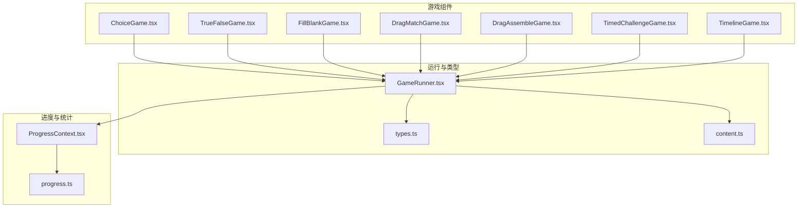

图表来源
- [GameRunner.tsx](file://src/components/GameRunner.tsx)
- [ChoiceGame.tsx](file://src/components/games/ChoiceGame.tsx)
- [TrueFalseGame.tsx](file://src/components/games/TrueFalseGame.tsx)
- [FillBlankGame.tsx](file://src/components/games/FillBlankGame.tsx)
- [DragMatchGame.tsx](file://src/components/games/DragMatchGame.tsx)
- [DragAssembleGame.tsx](file://src/components/games/DragAssembleGame.tsx)
- [TimedChallengeGame.tsx](file://src/components/games/TimedChallengeGame.tsx)
- [TimelineGame.tsx](file://src/components/games/TimelineGame.tsx)
- [ProgressContext.tsx](file://src/context/ProgressContext.tsx)
- [progress.ts](file://src/lib/progress.ts)
- [types.ts](file://src/lib/types.ts)
- [content.ts](file://src/lib/content.ts)

章节来源
- [GameRunner.tsx](file://src/components/GameRunner.tsx)
- [types.ts](file://src/lib/types.ts)
- [content.ts](file://src/lib/content.ts)
- [ProgressContext.tsx](file://src/context/ProgressContext.tsx)
- [progress.ts](file://src/lib/progress.ts)

## 核心组件
- 运行器（GameRunner）
  - 负责题目加载、状态管理、计时控制、提交与结果汇总
  - 协调各题型组件的验证回调与得分上报
- 题型组件（Choice/TrueFalse/FillBlank/DragMatch/DragAssemble/TimedChallenge/Timeline）
  - 各自实现用户输入收集与调用验证函数
  - 将验证结果（正确/错误、耗时、提示信息）回传给运行器
- 类型与内容（types.ts, content.ts）
  - 定义题目、选项、验证函数签名、进度与成绩模型
  - 提供题目元数据与配置读取
- 进度与统计（ProgressContext.tsx, progress.ts）
  - 维护全局进度上下文，聚合每道题的得分、用时、尝试次数等
  - 提供持久化与统计接口

章节来源
- [GameRunner.tsx](file://src/components/GameRunner.tsx)
- [ChoiceGame.tsx](file://src/components/games/ChoiceGame.tsx)
- [TrueFalseGame.tsx](file://src/components/games/TrueFalseGame.tsx)
- [FillBlankGame.tsx](file://src/components/games/FillBlankGame.tsx)
- [DragMatchGame.tsx](file://src/components/games/DragMatchGame.tsx)
- [DragAssembleGame.tsx](file://src/components/games/DragAssembleGame.tsx)
- [TimedChallengeGame.tsx](file://src/components/games/TimedChallengeGame.tsx)
- [TimelineGame.tsx](file://src/components/games/TimelineGame.tsx)
- [types.ts](file://src/lib/types.ts)
- [content.ts](file://src/lib/content.ts)
- [ProgressContext.tsx](file://src/context/ProgressContext.tsx)
- [progress.ts](file://src/lib/progress.ts)

## 架构总览
答案验证与评分的整体流程如下：
- 运行器加载题目配置与元数据
- 渲染对应题型组件，开始计时
- 用户作答后，组件调用验证函数（内置或自定义）
- 运行器汇总得分、用时与反馈信息，更新进度上下文
- 进度模块持久化并生成统计指标

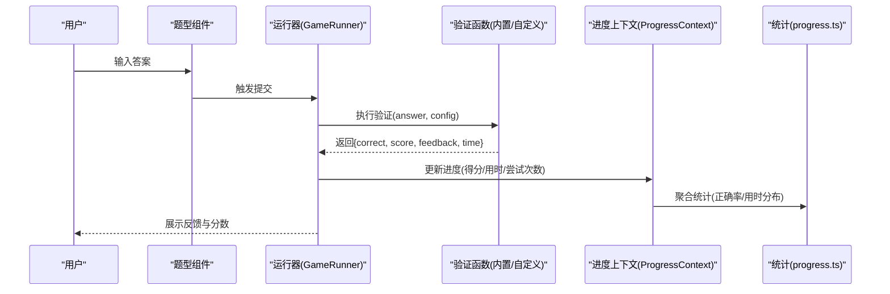

图表来源
- [GameRunner.tsx](file://src/components/GameRunner.tsx)
- [ProgressContext.tsx](file://src/context/ProgressContext.tsx)
- [progress.ts](file://src/lib/progress.ts)
- [types.ts](file://src/lib/types.ts)

## 详细组件分析

### 选择题（ChoiceGame）
- 功能要点
  - 单选/多选模式下的答案收集
  - 支持精确匹配与容错（如大小写、空白处理）
  - 可配置权重与部分得分策略
- 验证建议
  - 对选项文本进行规范化后再比较
  - 多选场景使用集合比较，避免顺序差异影响结果
- 评分建议
  - 全对得满分；部分正确按权重比例计分
  - 记录首次正确时间与尝试次数

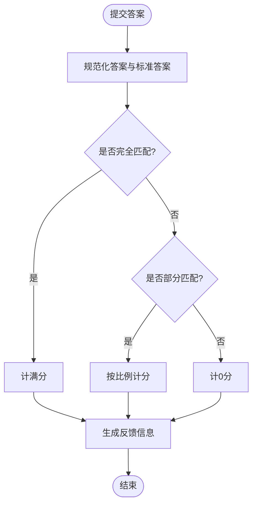

图表来源
- [ChoiceGame.tsx](file://src/components/games/ChoiceGame.tsx)
- [types.ts](file://src/lib/types.ts)

章节来源
- [ChoiceGame.tsx](file://src/components/games/ChoiceGame.tsx)
- [types.ts](file://src/lib/types.ts)

### 判断题（TrueFalseGame）
- 功能要点
  - 二值判断，严格匹配布尔或字符串表示
  - 支持常见等价表达（如“是/否”、“T/F”）
- 验证建议
  - 标准化输入后与标准答案比对
- 评分建议
  - 正确即满分，错误为0分；可结合用时加分

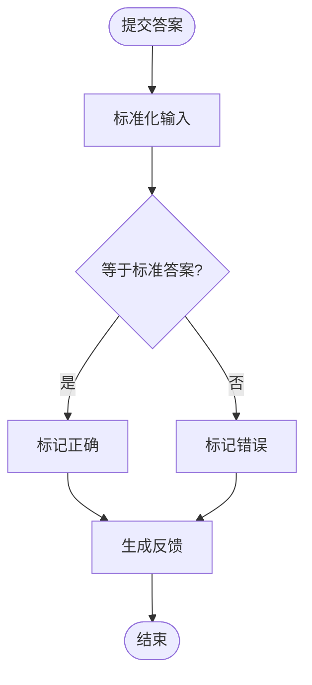

图表来源
- [TrueFalseGame.tsx](file://src/components/games/TrueFalseGame.tsx)
- [types.ts](file://src/lib/types.ts)

章节来源
- [TrueFalseGame.tsx](file://src/components/games/TrueFalseGame.tsx)
- [types.ts](file://src/lib/types.ts)

### 填空题（FillBlankGame）
- 功能要点
  - 文本填空，支持多空格、单位、符号容错
  - 可选数学表达式解析与数值近似比较
- 验证建议
  - 去除多余空白与标点，统一大小写
  - 数值类答案允许误差阈值（如±0.01）
- 评分建议
  - 完全匹配满分；近似匹配按比例扣分

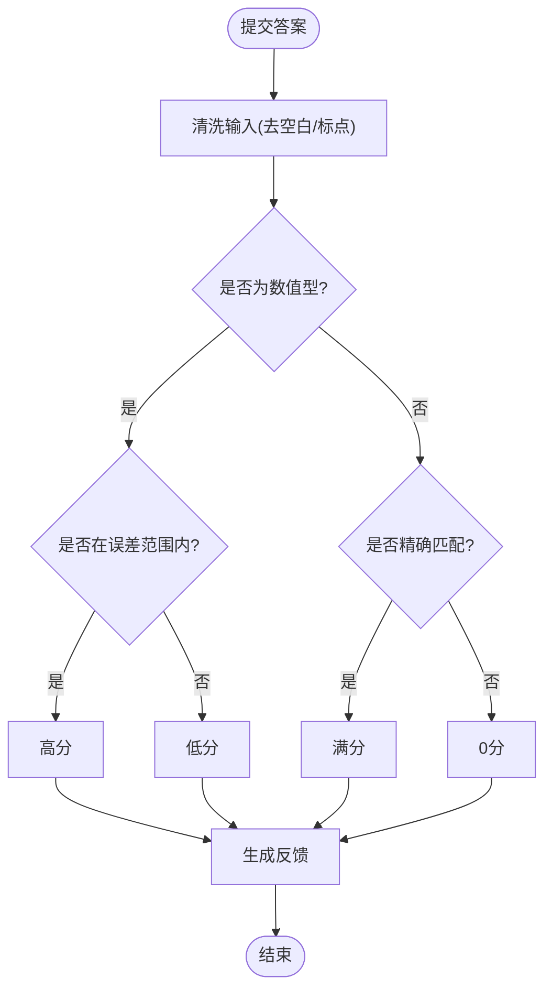

图表来源
- [FillBlankGame.tsx](file://src/components/games/FillBlankGame.tsx)
- [types.ts](file://src/lib/types.ts)

章节来源
- [FillBlankGame.tsx](file://src/components/games/FillBlankGame.tsx)
- [types.ts](file://src/lib/types.ts)

### 拖拽匹配（DragMatchGame）
- 功能要点
  - 左右项配对，支持多组匹配
  - 匹配顺序无关，仅关注配对关系
- 验证建议
  - 将用户配对转换为集合后与标准集合比较
- 评分建议
  - 每对正确加分，错误不扣分或按比例扣分

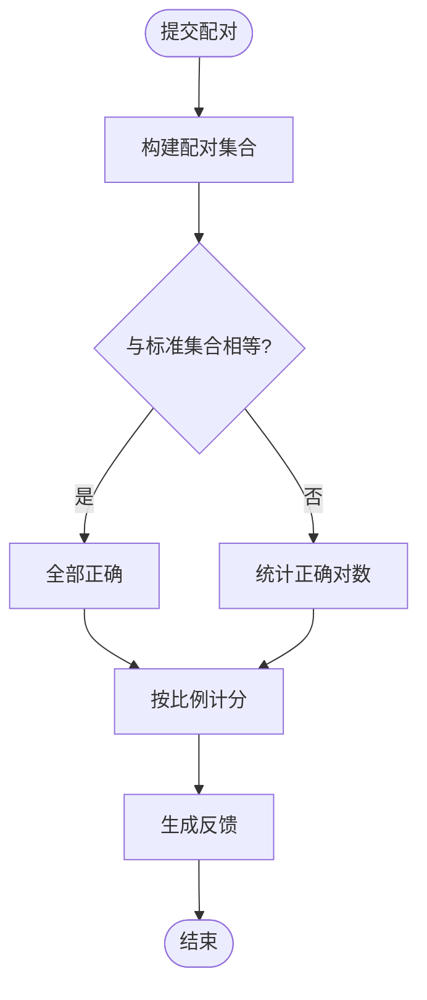

图表来源
- [DragMatchGame.tsx](file://src/components/games/DragMatchGame.tsx)
- [types.ts](file://src/lib/types.ts)

章节来源
- [DragMatchGame.tsx](file://src/components/games/DragMatchGame.tsx)
- [types.ts](file://src/lib/types.ts)

### 拖拽组装（DragAssembleGame）
- 功能要点
  - 多片段拼接成完整序列（如算式步骤、句子顺序）
  - 顺序敏感，需严格匹配
- 验证建议
  - 将用户序列与标准序列逐项比较
- 评分建议
  - 完全一致满分；可按正确片段数量给部分分

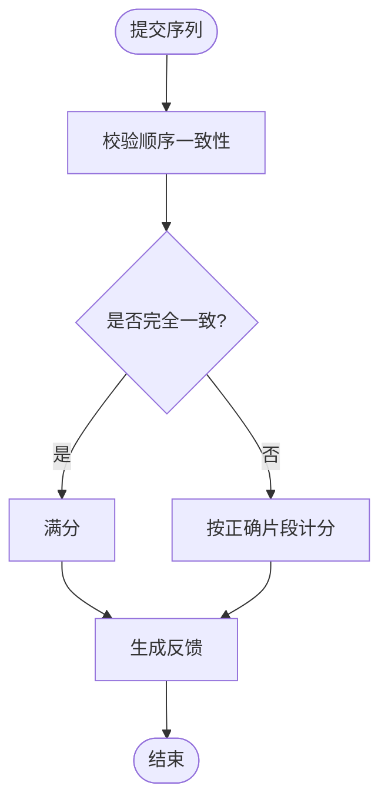

图表来源
- [DragAssembleGame.tsx](file://src/components/games/DragAssembleGame.tsx)
- [types.ts](file://src/lib/types.ts)

章节来源
- [DragAssembleGame.tsx](file://src/components/games/DragAssembleGame.tsx)
- [types.ts](file://src/lib/types.ts)

### 限时挑战（TimedChallengeGame）
- 功能要点
  - 限制答题时长，超时自动提交或判错
  - 记录用时并据此调整得分（用时越短得分越高）
- 验证建议
  - 在提交前校验输入合法性，防止无效提交
- 评分建议
  - 基础分+用时奖励分；超时则不得分或大幅扣分

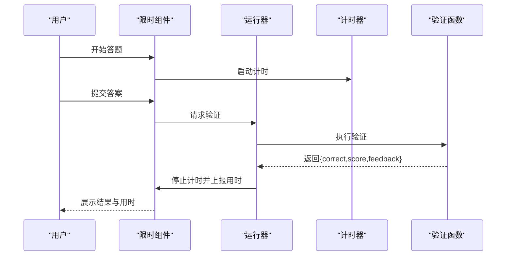

图表来源
- [TimedChallengeGame.tsx](file://src/components/games/TimedChallengeGame.tsx)
- [GameRunner.tsx](file://src/components/GameRunner.tsx)
- [types.ts](file://src/lib/types.ts)

章节来源
- [TimedChallengeGame.tsx](file://src/components/games/TimedChallengeGame.tsx)
- [GameRunner.tsx](file://src/components/GameRunner.tsx)
- [types.ts](file://src/lib/types.ts)

### 时间线排序（TimelineGame）
- 功能要点
  - 事件按时间顺序排列，顺序敏感
- 验证建议
  - 比较用户序列与标准序列的时间戳或序号
- 评分建议
  - 完全一致满分；按相邻正确对数或部分正确比例计分

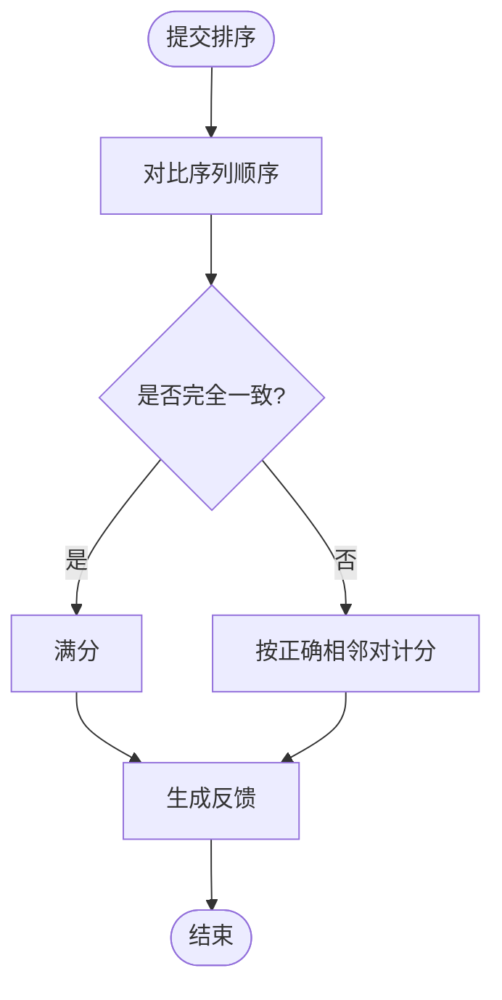

图表来源
- [TimelineGame.tsx](file://src/components/games/TimelineGame.tsx)
- [types.ts](file://src/lib/types.ts)

章节来源
- [TimelineGame.tsx](file://src/components/games/TimelineGame.tsx)
- [types.ts](file://src/lib/types.ts)

### 运行器（GameRunner）
- 职责
  - 统一调度题目生命周期（开始、提交、结算）
  - 管理计时、重试、提交上限与防作弊策略
  - 汇总每题得分、用时与反馈，更新进度上下文
- 关键流程
  - 初始化：加载题目配置与元数据
  - 提交：调用验证函数，获取结果并计分
  - 结算：累计总分、平均用时、正确率等

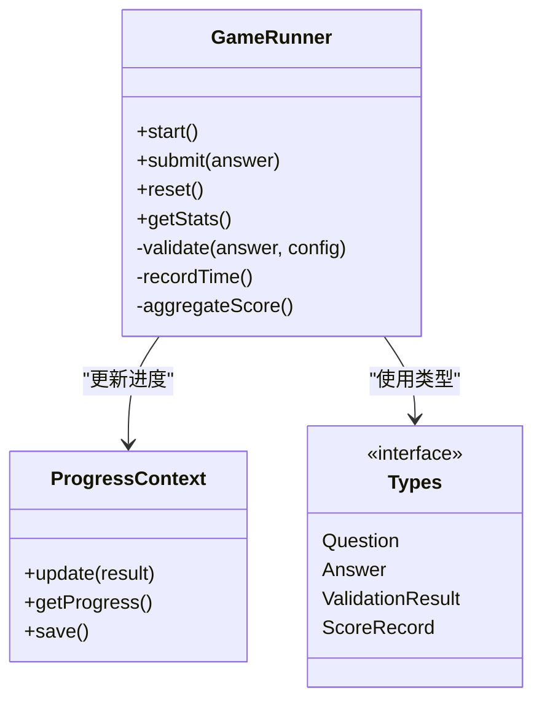

图表来源
- [GameRunner.tsx](file://src/components/GameRunner.tsx)
- [ProgressContext.tsx](file://src/context/ProgressContext.tsx)
- [types.ts](file://src/lib/types.ts)

章节来源
- [GameRunner.tsx](file://src/components/GameRunner.tsx)
- [ProgressContext.tsx](file://src/context/ProgressContext.tsx)
- [types.ts](file://src/lib/types.ts)

## 依赖关系分析
- 组件耦合
  - 题型组件依赖运行器进行提交与计时
  - 运行器依赖类型定义与进度上下文
  - 进度上下文依赖统计模块进行持久化与聚合
- 外部依赖
  - 内容加载模块用于读取题目配置与元数据
  - 测试用例覆盖运行器与进度模块的关键路径

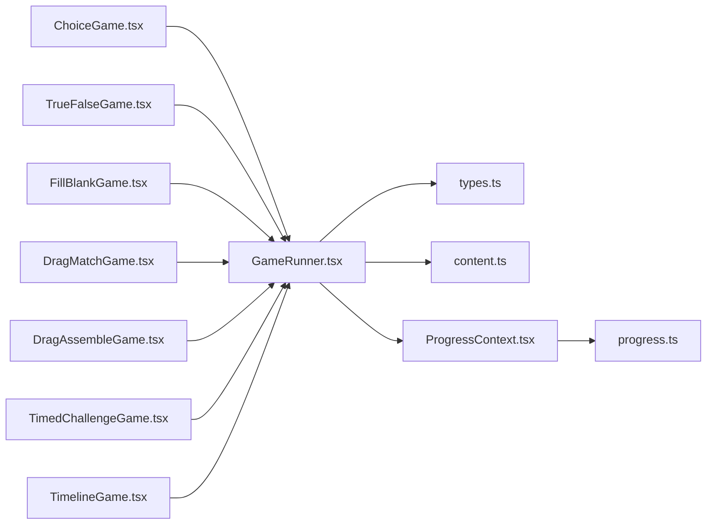

图表来源
- [GameRunner.tsx](file://src/components/GameRunner.tsx)
- [types.ts](file://src/lib/types.ts)
- [content.ts](file://src/lib/content.ts)
- [ProgressContext.tsx](file://src/context/ProgressContext.tsx)
- [progress.ts](file://src/lib/progress.ts)

章节来源
- [GameRunner.tsx](file://src/components/GameRunner.tsx)
- [types.ts](file://src/lib/types.ts)
- [content.ts](file://src/lib/content.ts)
- [ProgressContext.tsx](file://src/context/ProgressContext.tsx)
- [progress.ts](file://src/lib/progress.ts)

## 性能考量
- 验证函数复杂度
  - 文本比较应尽量避免深层递归与正则回溯
  - 数值比较使用固定精度与阈值，减少浮点误差
- 批量处理
  - 多题提交时采用批处理与增量更新，降低重渲染开销
- 计时精度
  - 使用高精度时间源，避免频繁刷新导致的性能抖动
- 内存占用
  - 及时释放中间结果，避免大对象常驻内存

[本节为通用指导，无需特定文件来源]

## 故障排查指南
- 常见问题
  - 答案规范化不一致导致误判（空白、大小写、单位）
  - 数值近似阈值设置不当导致边界情况误判
  - 计时异常（浏览器节流、页面切换）导致用时不准确
  - 进度未持久化或统计聚合错误
- 排查步骤
  - 检查验证函数的输入规范化与输出结构
  - 打印中间结果与用时，定位问题阶段
  - 查看进度上下文更新日志与持久化结果
  - 使用单元测试复现问题路径

章节来源
- [gameRunner.test.ts](file://src/test/gameRunner.test.ts)
- [progress.test.ts](file://src/test/progress.test.ts)

## 结论
math-k6 的答案验证与评分系统通过运行器统一调度、题型组件差异化实现、类型与进度模块支撑，形成可扩展、可测试、可统计的闭环。建议在新增题型时遵循统一的验证函数签名与反馈格式，确保评分与进度统计的一致性。

[本节为总结性内容，无需特定文件来源]

## 附录

### 答案匹配算法与验证规则
- 精确匹配
  - 文本：规范化后逐字符比较（去空白、统一大小写、标准化标点）
  - 数值：严格相等或在规定误差范围内（如±0.01）
  - 集合：忽略顺序，比较元素集合
- 模糊匹配
  - 编辑距离（Levenshtein）阈值判定
  - 同义词替换与单位换算（如“米/公尺”）
  - 数学表达式等价（通分、约分、括号展开）
- 数学表达式验证
  - 解析为标准形式后比较（多项式、分数、根号、三角函数）
  - 数值代入验证（在多个随机点上评估表达式差值）

章节来源
- [types.ts](file://src/lib/types.ts)
- [FillBlankGame.tsx](file://src/components/games/FillBlankGame.tsx)
- [ChoiceGame.tsx](file://src/components/games/ChoiceGame.tsx)

### 评分机制与分数计算逻辑
- 单题得分
  - 基础分：根据正确与否与部分匹配比例计算
  - 用时奖励：在限时模式下，用时越短奖励越高
  - 尝试惩罚：多次尝试可能按比例扣分
- 总分与统计
  - 总分：各题得分之和
  - 正确率：正确题数/总题数
  - 平均用时：所有题用时均值
  - 用时分布：各区间题数占比

章节来源
- [GameRunner.tsx](file://src/components/GameRunner.tsx)
- [ProgressContext.tsx](file://src/context/ProgressContext.tsx)
- [progress.ts](file://src/lib/progress.ts)

### 错误提示与反馈信息生成规则
- 反馈结构
  - 正确性：正确/错误/部分正确
  - 分数：本题得分
  - 用时：本次提交用时
  - 提示：针对错误的引导信息（如“注意单位换算”）
- 生成策略
  - 基于验证失败原因选择模板
  - 动态插入关键信息（期望值、用户值、误差范围）
  - 多语言与本地化支持

章节来源
- [types.ts](file://src/lib/types.ts)
- [GameRunner.tsx](file://src/components/GameRunner.tsx)

### 自定义验证函数开发指南
- 函数签名
  - 输入：用户答案、题目配置（含标准答案、容错参数）
  - 输出：验证结果（正确性、分数、反馈、用时）
- 实现要点
  - 输入规范化与类型推断
  - 边界条件处理（空输入、非法字符）
  - 数值近似与表达式等价比较
  - 反馈信息清晰且可操作
- 集成方式
  - 在题型组件中调用验证函数
  - 运行器统一处理结果并计分

章节来源
- [types.ts](file://src/lib/types.ts)
- [GameRunner.tsx](file://src/components/GameRunner.tsx)

### 防作弊机制与答题时间记录
- 防作弊
  - 提交频率限制（防刷）
  - 剪贴板与复制粘贴检测（可选）
  - 页面切换与焦点丢失记录
  - 异常行为检测（极短用时、重复提交）
- 时间记录
  - 开始/结束时间戳
  - 前台/后台切换累计暂停
  - 高精度计时与容错补偿

章节来源
- [TimedChallengeGame.tsx](file://src/components/games/TimedChallengeGame.tsx)
- [GameRunner.tsx](file://src/components/GameRunner.tsx)

### 进度跟踪与成绩统计数据结构
- 进度上下文
  - 当前题目索引、已答题列表、总分、用时累计
  - 每次提交更新：正确性、分数、用时、尝试次数
- 统计指标
  - 正确率、平均分、用时分布、知识点掌握度
  - 历史趋势与对比（跨会话）

章节来源
- [ProgressContext.tsx](file://src/context/ProgressContext.tsx)
- [progress.ts](file://src/lib/progress.ts)
- [types.ts](file://src/lib/types.ts)