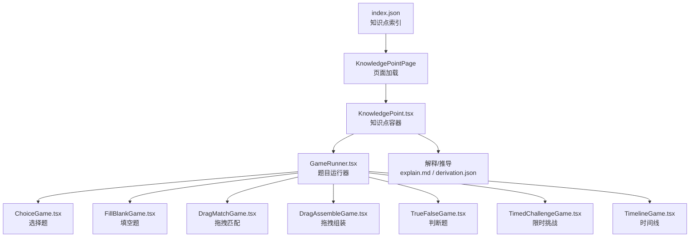
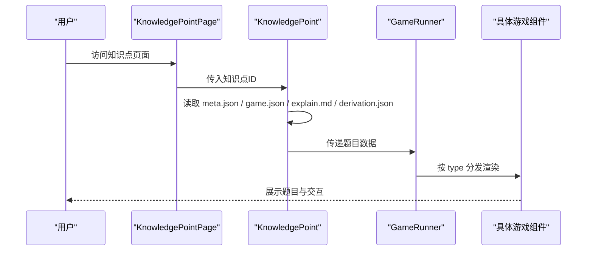
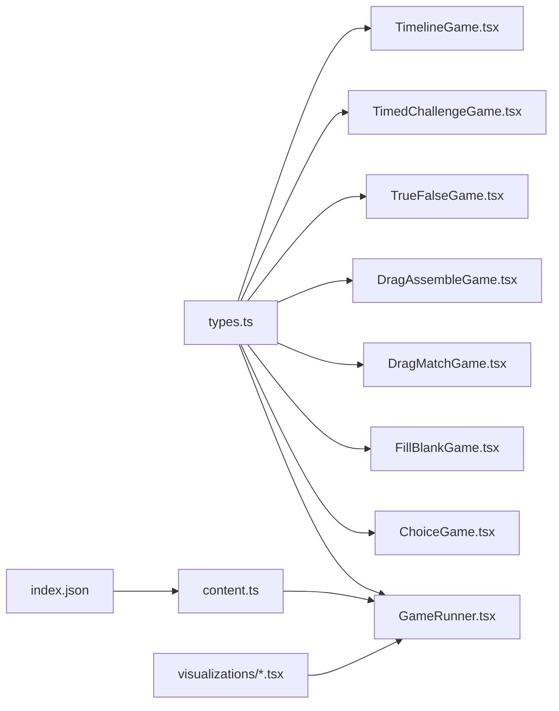

# 题目格式规范

<cite>
**本文引用的文件**   
- [src/lib/types.ts](file://src/lib/types.ts)
- [src/content/index.json](file://src/content/index.json)
- [src/components/GameRunner.tsx](file://src/components/GameRunner.tsx)
- [src/components/games/ChoiceGame.tsx](file://src/components/games/ChoiceGame.tsx)
- [src/components/games/FillBlankGame.tsx](file://src/components/games/FillBlankGame.tsx)
- [src/components/games/DragMatchGame.tsx](file://src/components/games/DragMatchGame.tsx)
- [src/components/games/DragAssembleGame.tsx](file://src/components/games/DragAssembleGame.tsx)
- [src/components/games/TrueFalseGame.tsx](file://src/components/games/TrueFalseGame.tsx)
- [src/components/games/TimedChallengeGame.tsx](file://src/components/games/TimedChallengeGame.tsx)
- [src/components/games/TimelineGame.tsx](file://src/components/games/TimelineGame.tsx)
- [src/components/KnowledgePoint.tsx](file://src/components/KnowledgePoint.tsx)
- [src/pages/KnowledgePointPage.tsx](file://src/pages/KnowledgePointPage.tsx)
- [src/lib/content.ts](file://src/lib/content.ts)
- [src/assets/...（可视化组件目录）](file://src/visualizations/AreaGrid.tsx)
</cite>

## 目录
1. [简介](#简介)
2. [项目结构](#项目结构)
3. [核心组件](#核心组件)
4. [架构总览](#架构总览)
5. [详细组件分析](#详细组件分析)
6. [依赖关系分析](#依赖关系分析)
7. [性能考虑](#性能考虑)
8. [故障排查指南](#故障排查指南)
9. [结论](#结论)
10. [附录](#附录)

## 简介
本规范面向 math-k6 项目的“题目”数据与渲染流程，目标是统一不同题型的数据结构、字段命名、数学公式表示、特殊字符处理、难度与分类标签、以及国际化支持。文档覆盖：
- 文本内容、选项数组、正确答案、解析信息等字段的定义与约束
- 数学公式与特殊字符的表示方法
- 复杂题目的配置示例（多步骤计算、图形题、应用题等）
- 题目难度标记与分类标签的使用方式
- 题目内容的国际化支持方案

## 项目结构
math-k6 采用“知识点目录 + 题目资源”的组织方式：
- 每个知识点位于 src/content/knowledge-points/<id>/ 下，包含 meta.json、game.json、explain.md、derivation.json 等
- 题目运行时由 GameRunner 驱动，根据 game.json 中的 type 分发到具体游戏组件
- 类型定义集中在 src/lib/types.ts，确保前后端一致
- 内容索引在 src/content/index.json，用于导航与聚合

图表来源
- [src/content/index.json:1-200](file://src/content/index.json#L1-L200)
- [src/pages/KnowledgePointPage.tsx:1-200](file://src/pages/KnowledgePointPage.tsx#L1-L200)
- [src/components/KnowledgePoint.tsx:1-200](file://src/components/KnowledgePoint.tsx#L1-L200)
- [src/components/GameRunner.tsx:1-200](file://src/components/GameRunner.tsx#L1-L200)

章节来源
- [src/content/index.json:1-200](file://src/content/index.json#L1-L200)
- [src/pages/KnowledgePointPage.tsx:1-200](file://src/pages/KnowledgePointPage.tsx#L1-L200)
- [src/components/KnowledgePoint.tsx:1-200](file://src/components/KnowledgePoint.tsx#L1-L200)
- [src/components/GameRunner.tsx:1-200](file://src/components/GameRunner.tsx#L1-L200)

## 核心组件
- 类型定义：src/lib/types.ts 集中定义了题目、选项、答案、解析、元数据等核心类型，是题目格式的权威来源
- 内容加载：src/lib/content.ts 负责读取 index.json 与知识点目录下的 game.json/meta.json/explain.md/derivation.json
- 运行器：src/components/GameRunner.tsx 根据题目类型分发到对应游戏组件
- 各题型组件：src/components/games/* 实现具体交互逻辑与渲染

章节来源
- [src/lib/types.ts:1-200](file://src/lib/types.ts#L1-L200)
- [src/lib/content.ts:1-200](file://src/lib/content.ts#L1-L200)
- [src/components/GameRunner.tsx:1-200](file://src/components/GameRunner.tsx#L1-L200)

## 架构总览
题目从静态资源到渲染的关键路径如下：
- 页面层通过 KnowledgePointPage 获取知识点 ID
- KnowledgePoint 组件加载 meta.json、game.json、explain.md、derivation.json
- GameRunner 解析 game.json 的 type，选择并渲染对应游戏组件
- 各游戏组件依据统一的题目数据结构进行渲染与交互

图表来源
- [src/pages/KnowledgePointPage.tsx:1-200](file://src/pages/KnowledgePointPage.tsx#L1-L200)
- [src/components/KnowledgePoint.tsx:1-200](file://src/components/KnowledgePoint.tsx#L1-L200)
- [src/components/GameRunner.tsx:1-200](file://src/components/GameRunner.tsx#L1-L200)

## 详细组件分析

### 数据类型与字段规范（types.ts）
- 题目对象
  - id: string，唯一标识
  - type: string，题型枚举（如 choice/fill_blank/drag_match/drag_assemble/true_false/timed_challenge/timeline）
  - difficulty: number|string，难度等级或级别
  - tags: string[]，分类标签（如“分数运算”“几何面积”）
  - content: object|string，题干内容；字符串为纯文本，对象可含富文本片段
  - options: array，选项数组（选择题/判断题使用）
  - answer: any，正确答案（类型随题型变化）
  - explanation: string|object，解析说明；支持多语言键值
  - metadata: object，扩展元数据（如单位、图示引用、步骤提示）
- 选项对象
  - id: string，选项唯一标识
  - text: string，选项文本（支持公式与特殊字符）
  - isCorrect: boolean，是否为正确选项（部分题型可选）
  - hint: string，提示语（可选）
- 解析信息
  - text: string，解析正文
  - steps: array，分步解析（可选）
  - references: array，参考链接或素材（可选）
- 国际化
  - content.explanation/i18n: object，键为语言代码（如 zh-CN/en-US），值为对应文本

章节来源
- [src/lib/types.ts:1-200](file://src/lib/types.ts#L1-L200)

### 内容加载与索引（content.ts, index.json）
- index.json 提供知识点列表与导航信息
- content.ts 负责：
  - 读取 index.json 构建导航树
  - 按知识点目录加载 meta.json、game.json、explain.md、derivation.json
  - 将 Markdown/JSON 转换为运行时可用的结构化数据

章节来源
- [src/content/index.json:1-200](file://src/content/index.json#L1-L200)
- [src/lib/content.ts:1-200](file://src/lib/content.ts#L1-L200)

### 运行器与分发（GameRunner.tsx）
- 接收题目数据后，根据 type 字段选择对应游戏组件
- 对不同类型题目进行参数校验与默认值填充
- 将题目数据透传给具体组件，并处理结果回调

章节来源
- [src/components/GameRunner.tsx:1-200](file://src/components/GameRunner.tsx#L1-L200)

### 选择题（ChoiceGame.tsx）
- 适用题型：choice
- 关键字段：
  - content.text：题干文本
  - options：选项数组，至少包含一个 isCorrect=true 的选项
  - answer：可为空（由 options.isCorrect 决定）或显式指定正确选项 id
  - explanation：解析说明，支持 i18n
- 交互：单选或多选（由 metadata.multiSelect 控制）

章节来源
- [src/components/games/ChoiceGame.tsx:1-200](file://src/components/games/ChoiceGame.tsx#L1-L200)

### 填空题（FillBlankGame.tsx）
- 适用题型：fill_blank
- 关键字段：
  - content.blanks：填空位置数组，每个元素包含占位符与期望答案
  - answer：与 blanks 对应的答案数组
  - explanation：解析说明
- 输入：文本框或下拉选择（由 metadata.inputType 控制）

章节来源
- [src/components/games/FillBlankGame.tsx:1-200](file://src/components/games/FillBlankGame.tsx#L1-L200)

### 拖拽匹配（DragMatchGame.tsx）
- 适用题型：drag_match
- 关键字段：
  - content.items：待匹配项数组
  - pairs：配对规则（左项 id -> 右项 id）
  - answer：用户匹配结果
  - explanation：解析说明
- 交互：拖拽左右列项进行配对

章节来源
- [src/components/games/DragMatchGame.tsx:1-200](file://src/components/games/DragMatchGame.tsx#L1-L200)

### 拖拽组装（DragAssembleGame.tsx）
- 适用题型：drag_assemble
- 关键字段：
  - content.pieces：可移动片段数组
  - target：目标布局或顺序
  - answer：用户组装结果
  - explanation：解析说明
- 交互：拖拽片段到目标区域完成组装

章节来源
- [src/components/games/DragAssembleGame.tsx:1-200](file://src/components/games/DragAssembleGame.tsx#L1-L200)

### 判断题（TrueFalseGame.tsx）
- 适用题型：true_false
- 关键字段：
  - content.statement：陈述句
  - answer：布尔值（true/false）
  - explanation：解析说明

章节来源
- [src/components/games/TrueFalseGame.tsx:1-200](file://src/components/games/TrueFalseGame.tsx#L1-L200)

### 限时挑战（TimedChallengeGame.tsx）
- 适用题型：timed_challenge
- 关键字段：
  - content.questions：题目集合（可复用其他题型结构）
  - timeLimit：秒数
  - scoring：评分策略（如按正确率、用时）
  - explanation：总体解析

章节来源
- [src/components/games/TimedChallengeGame.tsx:1-200](file://src/components/games/TimedChallengeGame.tsx#L1-L200)

### 时间线（TimelineGame.tsx）
- 适用题型：timeline
- 关键字段：
  - content.events：事件数组（时间戳、标题、描述）
  - answer：排序或选择结果
  - explanation：解析说明

章节来源
- [src/components/games/TimelineGame.tsx:1-200](file://src/components/games/TimelineGame.tsx#L1-L200)

### 知识点容器（KnowledgePoint.tsx）
- 负责加载并聚合 meta.json、game.json、explain.md、derivation.json
- 将结构化数据传递给 GameRunner 与可视化组件

章节来源
- [src/components/KnowledgePoint.tsx:1-200](file://src/components/KnowledgePoint.tsx#L1-L200)

## 依赖关系分析
- types.ts 被所有游戏组件与运行器引用，保证数据结构一致性
- content.ts 依赖 index.json 与各知识点目录资源
- GameRunner.tsx 依赖各游戏组件，按 type 动态加载
- 可视化组件（如 AreaGrid、BarChart、CircleUnroll 等）通过 metadata 引用，用于图形题渲染

图表来源
- [src/lib/types.ts:1-200](file://src/lib/types.ts#L1-L200)
- [src/components/GameRunner.tsx:1-200](file://src/components/GameRunner.tsx#L1-L200)
- [src/lib/content.ts:1-200](file://src/lib/content.ts#L1-L200)
- [src/content/index.json:1-200](file://src/content/index.json#L1-L200)
- [src/visualizations/AreaGrid.tsx:1-200](file://src/visualizations/AreaGrid.tsx#L1-L200)

章节来源
- [src/lib/types.ts:1-200](file://src/lib/types.ts#L1-L200)
- [src/components/GameRunner.tsx:1-200](file://src/components/GameRunner.tsx#L1-L200)
- [src/lib/content.ts:1-200](file://src/lib/content.ts#L1-L200)
- [src/content/index.json:1-200](file://src/content/index.json#L1-L200)

## 性能考虑
- 按需加载：GameRunner 按题型动态导入组件，减少首屏体积
- 资源缓存：content.ts 可对 JSON/Markdown 做内存缓存，避免重复请求
- 渲染优化：大型题目（如 timed_challenge）建议分页或懒加载子题
- 可视化组件：按需引入，避免全量加载导致卡顿

[本节为通用指导，不直接分析具体文件]

## 故障排查指南
- 题型不识别：检查 game.json 中 type 是否在运行器支持列表中
- 选项缺失：选择题需确保至少一个选项 isCorrect=true，或显式指定 answer
- 答案校验失败：确认 answer 结构与题型要求一致（如 fill_blank 的 blanks 数量）
- 解析未显示：检查 explanation 字段是否存在且非空
- 国际化无效：确认 i18n 键值存在且语言代码正确（如 zh-CN）

章节来源
- [src/components/GameRunner.tsx:1-200](file://src/components/GameRunner.tsx#L1-L200)
- [src/components/games/ChoiceGame.tsx:1-200](file://src/components/games/ChoiceGame.tsx#L1-L200)
- [src/components/games/FillBlankGame.tsx:1-200](file://src/components/games/FillBlankGame.tsx#L1-L200)

## 结论
本规范明确了 math-k6 题目的数据结构、字段语义、公式与特殊字符处理、难度与标签、以及国际化支持。通过统一类型定义与运行器分发机制，项目能够稳定地承载多种题型与复杂场景。建议在新增题型时优先扩展 types.ts，并在 GameRunner 中补充分发逻辑，以保持系统的一致性与可扩展性。

[本节为总结，不直接分析具体文件]

## 附录

### 数学公式与特殊字符表示
- 公式推荐：使用 LaTeX 语法（如 \frac{a}{b}、\sqrt{x}、\sum_{i=1}^{n}）
- 特殊字符：使用 HTML 实体或 Unicode（如 &deg;、&times;、∞、π）
- 富文本：content 对象可包含富文本片段，但需确保渲染器支持

[本节为概念性说明，不直接分析具体文件]

### 难度与分类标签
- 难度：建议使用数字等级（1-5）或字符串级别（初级/中级/高级）
- 标签：使用短横线分隔的英文或拼音标签（如 fraction-add-sub、geometry-area）

[本节为概念性说明，不直接分析具体文件]

### 国际化支持
- explanation.i18n：以语言代码为键，值为对应文本
- content.text/options[i].text：同样支持 i18n 键值
- 默认语言：当缺少目标语言时回退到默认语言

[本节为概念性说明，不直接分析具体文件]

### 复杂题目配置示例（结构示意）
- 多步骤计算：使用 timed_challenge 包裹多个子题，每子题可复用 choice/fill_blank 结构
- 图形题：metadata 引用 visualization 组件（如 CircleUnroll、AreaGrid），content 提供图形参数
- 应用题：content 使用富文本段落，options 包含情境选项，answer 指向最佳选项

[本节为概念性说明，不直接分析具体文件]