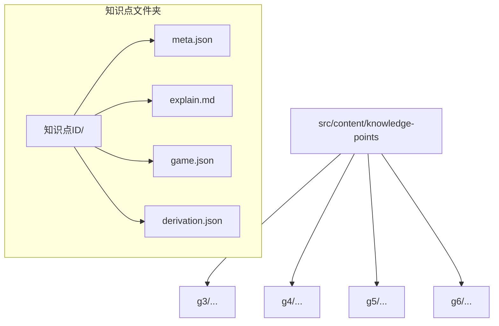
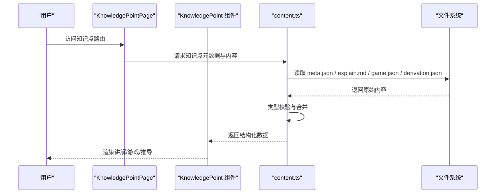
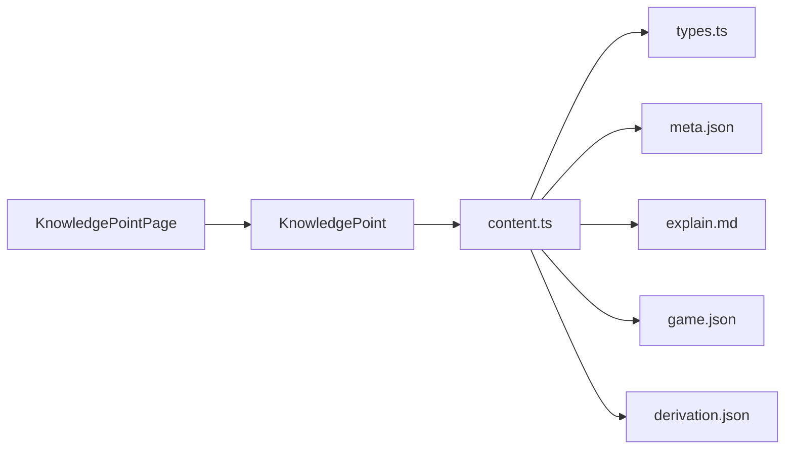

# 知识点结构规范

<cite>
**本文档引用的文件**   
- [src/content/knowledge-points/g3-add-sub-10000/meta.json](file://src/content/knowledge-points/g3-add-sub-10000/meta.json)
- [src/content/knowledge-points/g3-fraction-intro/meta.json](file://src/content/knowledge-points/g3-fraction-intro/meta.json)
- [src/content/knowledge-points/g4-decimal-meaning/meta.json](file://src/content/knowledge-points/g4-decimal-meaning/meta.json)
- [src/content/knowledge-points/g5-equation/meta.json](file://src/content/knowledge-points/g5-equation/meta.json)
- [src/content/knowledge-points/g6-circle-area/meta.json](file://src/content/knowledge-points/g6-circle-area/meta.json)
- [src/content/knowledge-points/g3-add-sub-10000/game.json](file://src/content/knowledge-points/g3-add-sub-10000/game.json)
- [src/content/knowledge-points/g3-fraction-intro/explain.md](file://src/content/knowledge-points/g3-fraction-intro/explain.md)
- [src/content/knowledge-points/g3-mult-1digit/derivation.json](file://src/content/knowledge-points/g3-mult-1digit/derivation.json)
- [src/content/index.json](file://src/content/index.json)
- [src/lib/types.ts](file://src/lib/types.ts)
- [src/lib/content.ts](file://src/lib/content.ts)
- [src/components/KnowledgePoint.tsx](file://src/components/KnowledgePoint.tsx)
- [src/pages/KnowledgePointPage.tsx](file://src/pages/KnowledgePointPage.tsx)
</cite>

## 目录
1. [简介](#简介)
2. [项目结构](#项目结构)
3. [核心组件](#核心组件)
4. [架构总览](#架构总览)
5. [详细组件分析](#详细组件分析)
6. [依赖分析](#依赖分析)
7. [性能考虑](#性能考虑)
8. [故障排查指南](#故障排查指南)
9. [结论](#结论)
10. [附录](#附录)

## 简介
本规范面向 math-k6 项目的“知识点”内容体系，明确知识点的目录组织、命名约定、元数据字段定义（meta.json）、内容文件组织方式与最佳实践，并提供创建模板、示例与验证规则。目标是让教师与内容作者能够以统一标准快速创建、维护与扩展知识点资源，确保前端渲染稳定、可测试且可扩展。

## 项目结构
知识点内容位于 src/content/knowledge-points 下，按年级分目录：g3、g4、g5、g6。每个知识点为一个独立文件夹，包含 meta.json（元数据）、可选的 explain.md（讲解文本）、game.json（游戏配置）、derivation.json（推导过程）等。

章节来源
- [src/content/index.json](file://src/content/index.json)

## 核心组件
- 元数据文件 meta.json：描述知识点的标题、年级、学科、描述、标签、难度、是否必修、预览图、排序等。
- 讲解文件 explain.md：Markdown 格式的知识点讲解内容。
- 游戏配置 game.json：定义题型、题目集合、交互逻辑、评分策略等。
- 推导过程 derivation.json：用于可视化或步骤化展示数学推导。
- 索引文件 index.json：汇总各年级知识点清单，便于导航与构建时聚合。

章节来源
- [src/content/knowledge-points/g3-add-sub-10000/meta.json](file://src/content/knowledge-points/g3-add-sub-10000/meta.json)
- [src/content/knowledge-points/g3-fraction-intro/meta.json](file://src/content/knowledge-points/g3-fraction-intro/meta.json)
- [src/content/knowledge-points/g4-decimal-meaning/meta.json](file://src/content/knowledge-points/g4-decimal-meaning/meta.json)
- [src/content/knowledge-points/g5-equation/meta.json](file://src/content/knowledge-points/g5-equation/meta.json)
- [src/content/knowledge-points/g6-circle-area/meta.json](file://src/content/knowledge-points/g6-circle-area/meta.json)
- [src/content/knowledge-points/g3-add-sub-10000/game.json](file://src/content/knowledge-points/g3-add-sub-10000/game.json)
- [src/content/knowledge-points/g3-fraction-intro/explain.md](file://src/content/knowledge-points/g3-fraction-intro/explain.md)
- [src/content/knowledge-points/g3-mult-1digit/derivation.json](file://src/content/knowledge-points/g3-mult-1digit/derivation.json)
- [src/content/index.json](file://src/content/index.json)

## 架构总览
知识点从文件系统加载，经类型校验与内容解析后，由页面组件渲染。关键流程如下：

图表来源
- [src/pages/KnowledgePointPage.tsx](file://src/pages/KnowledgePointPage.tsx)
- [src/components/KnowledgePoint.tsx](file://src/components/KnowledgePoint.tsx)
- [src/lib/content.ts](file://src/lib/content.ts)

章节来源
- [src/pages/KnowledgePointPage.tsx](file://src/pages/KnowledgePointPage.tsx)
- [src/components/KnowledgePoint.tsx](file://src/components/KnowledgePoint.tsx)
- [src/lib/content.ts](file://src/lib/content.ts)

## 详细组件分析

### 元数据字段定义（meta.json）
建议字段与含义（结合现有实例归纳）：
- title：知识点标题（必填）
- grade：年级标识，如 g3、g4、g5、g6（必填）
- subject：学科，如“数学”（必填）
- description：简短描述（必填）
- tags：标签数组，用于检索与筛选（可选）
- difficulty：难度等级（可选）
- required：是否必修（可选）
- thumbnail：缩略图路径（可选）
- order：排序权重（可选）

字段校验要点：
- 必填字段缺失将导致构建或运行时错误。
- 枚举值需符合约定（grade 仅允许 g3-g6；subject 为“数学”）。
- 字符串长度限制与格式校验（如 title 非空、description 可读性检查）。

章节来源
- [src/content/knowledge-points/g3-add-sub-10000/meta.json](file://src/content/knowledge-points/g3-add-sub-10000/meta.json)
- [src/content/knowledge-points/g3-fraction-intro/meta.json](file://src/content/knowledge-points/g3-fraction-intro/meta.json)
- [src/content/knowledge-points/g4-decimal-meaning/meta.json](file://src/content/knowledge-points/g4-decimal-meaning/meta.json)
- [src/content/knowledge-points/g5-equation/meta.json](file://src/content/knowledge-points/g5-equation/meta.json)
- [src/content/knowledge-points/g6-circle-area/meta.json](file://src/content/knowledge-points/g6-circle-area/meta.json)
- [src/lib/types.ts](file://src/lib/types.ts)

### 内容文件组织与命名规范
- 目录命名：使用小写英文字母与短横线，前缀为年级标识，如 g3-add-sub-10000。
- 文件命名：
  - meta.json：固定名称，不可更改。
  - explain.md：讲解内容，Markdown 格式，可选但推荐提供。
  - game.json：游戏配置，可选。
  - derivation.json：推导过程，可选。
- 文件关系：
  - 一个知识点至少包含 meta.json。
  - 若包含 explain.md，则应在 meta.description 中简要说明该知识点的讲解重点。
  - 若包含 game.json，应保证题型与题目数量合理，避免过大文件影响加载。
  - 若包含 derivation.json，应与讲解内容保持一致的逻辑顺序。

章节来源
- [src/content/knowledge-points/g3-add-sub-10000/game.json](file://src/content/knowledge-points/g3-add-sub-10000/game.json)
- [src/content/knowledge-points/g3-fraction-intro/explain.md](file://src/content/knowledge-points/g3-fraction-intro/explain.md)
- [src/content/knowledge-points/g3-mult-1digit/derivation.json](file://src/content/knowledge-points/g3-mult-1digit/derivation.json)

### 知识点创建模板与示例
- 最小可用模板：
  - 新建文件夹：src/content/knowledge-points/gX-<topic-id>/
  - 添加 meta.json（必填字段齐全）
  - 可选添加 explain.md、game.json、derivation.json
- 示例参考：
  - 三年级加法减法：g3-add-sub-10000
  - 分数入门：g3-fraction-intro
  - 小数意义：g4-decimal-meaning
  - 方程：g5-equation
  - 圆面积：g6-circle-area

章节来源
- [src/content/knowledge-points/g3-add-sub-10000/meta.json](file://src/content/knowledge-points/g3-add-sub-10000/meta.json)
- [src/content/knowledge-points/g3-fraction-intro/meta.json](file://src/content/knowledge-points/g3-fraction-intro/meta.json)
- [src/content/knowledge-points/g4-decimal-meaning/meta.json](file://src/content/knowledge-points/g4-decimal-meaning/meta.json)
- [src/content/knowledge-points/g5-equation/meta.json](file://src/content/knowledge-points/g5-equation/meta.json)
- [src/content/knowledge-points/g6-circle-area/meta.json](file://src/content/knowledge-points/g6-circle-area/meta.json)

### 内容验证规则与错误处理机制
- 构建期验证：
  - 扫描 knowledge-points 目录下所有 meta.json，校验必填字段与类型。
  - 对 explain.md、game.json、derivation.json 的存在性与基本格式进行校验。
- 运行期验证：
  - 在加载知识点时，若缺少必要文件或字段非法，给出友好错误提示并回退到默认视图。
- 错误处理建议：
  - 记录错误日志（含知识点 ID、缺失字段、错误类型）。
  - 提供重试或降级策略（如跳过损坏的知识点，继续加载其他内容）。
  - 在开发环境输出详细诊断信息，生产环境隐藏敏感细节。

章节来源
- [src/lib/content.ts](file://src/lib/content.ts)
- [src/components/KnowledgePoint.tsx](file://src/components/KnowledgePoint.tsx)
- [src/pages/KnowledgePointPage.tsx](file://src/pages/KnowledgePointPage.tsx)

## 依赖分析
知识点内容的依赖关系如下：
- 页面层：KnowledgePointPage 负责路由与数据获取。
- 组件层：KnowledgePoint 组件负责渲染讲解、游戏与推导。
- 数据层：content.ts 负责读取与解析内容文件，并进行类型校验。
- 类型定义：types.ts 定义元数据与内容结构的 TypeScript 类型。

图表来源
- [src/pages/KnowledgePointPage.tsx](file://src/pages/KnowledgePointPage.tsx)
- [src/components/KnowledgePoint.tsx](file://src/components/KnowledgePoint.tsx)
- [src/lib/content.ts](file://src/lib/content.ts)
- [src/lib/types.ts](file://src/lib/types.ts)

章节来源
- [src/pages/KnowledgePointPage.tsx](file://src/pages/KnowledgePointPage.tsx)
- [src/components/KnowledgePoint.tsx](file://src/components/KnowledgePoint.tsx)
- [src/lib/content.ts](file://src/lib/content.ts)
- [src/lib/types.ts](file://src/lib/types.ts)

## 性能考虑
- 按需加载：仅在访问具体知识点时加载对应文件，避免一次性加载全部资源。
- 缓存策略：对 meta.json 与静态内容进行浏览器缓存，减少重复请求。
- 文件大小控制：game.json 与 explain.md 应保持适中大小，必要时拆分或懒加载。
- 构建优化：在构建阶段预校验与压缩内容，减少运行时开销。

[本节为通用指导，不直接分析具体文件]

## 故障排查指南
常见问题与解决步骤：
- 页面无法显示知识点：
  - 检查 meta.json 是否存在且字段完整。
  - 查看 content.ts 的错误日志，确认解析失败原因。
- 游戏无法加载：
  - 校验 game.json 结构与题型定义是否符合预期。
  - 检查组件渲染逻辑是否正确绑定数据。
- 讲解内容不显示：
  - 确认 explain.md 存在且 Markdown 语法正确。
  - 检查组件是否按路径正确读取文件。
- 推导过程异常：
  - 核对 derivation.json 的步骤顺序与数据一致性。
  - 查看渲染组件是否有边界条件处理。

章节来源
- [src/lib/content.ts](file://src/lib/content.ts)
- [src/components/KnowledgePoint.tsx](file://src/components/KnowledgePoint.tsx)
- [src/pages/KnowledgePointPage.tsx](file://src/pages/KnowledgePointPage.tsx)

## 结论
通过统一的目录组织、严格的元数据规范与完善的验证机制，math-k6 的知识点体系可实现高质量的内容生产与稳定的前端渲染。建议内容作者遵循本规范，并在新增知识点时进行自检与测试，以确保整体体验一致性与可维护性。

[本节为总结性内容，不直接分析具体文件]

## 附录
- 快速检查清单：
  - 目录命名是否符合 gX-<topic-id> 规范？
  - meta.json 必填字段是否齐全且类型正确？
  - explain.md、game.json、derivation.json 是否存在且格式正确？
  - 是否在 index.json 中更新知识点清单（如需）？
- 参考实现：
  - 三年级加法减法：g3-add-sub-10000
  - 分数入门：g3-fraction-intro
  - 小数意义：g4-decimal-meaning
  - 方程：g5-equation
  - 圆面积：g6-circle-area

章节来源
- [src/content/index.json](file://src/content/index.json)
- [src/content/knowledge-points/g3-add-sub-10000/meta.json](file://src/content/knowledge-points/g3-add-sub-10000/meta.json)
- [src/content/knowledge-points/g3-fraction-intro/meta.json](file://src/content/knowledge-points/g3-fraction-intro/meta.json)
- [src/content/knowledge-points/g4-decimal-meaning/meta.json](file://src/content/knowledge-points/g4-decimal-meaning/meta.json)
- [src/content/knowledge-points/g5-equation/meta.json](file://src/content/knowledge-points/g5-equation/meta.json)
- [src/content/knowledge-points/g6-circle-area/meta.json](file://src/content/knowledge-points/g6-circle-area/meta.json)