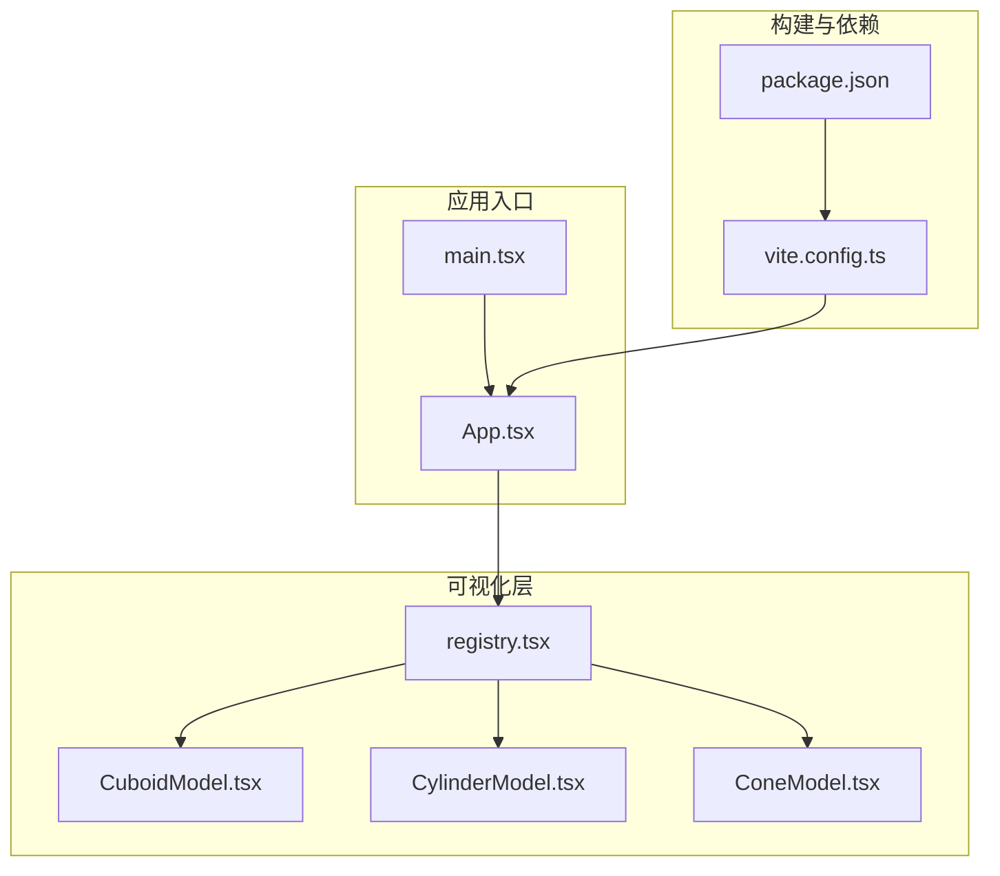
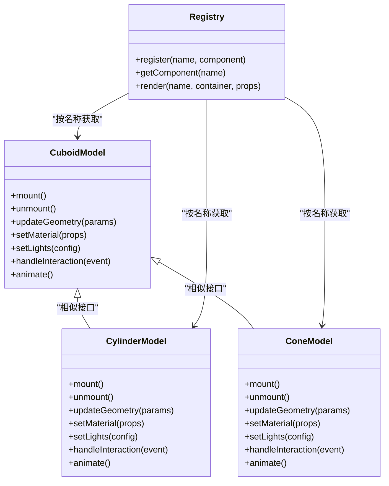
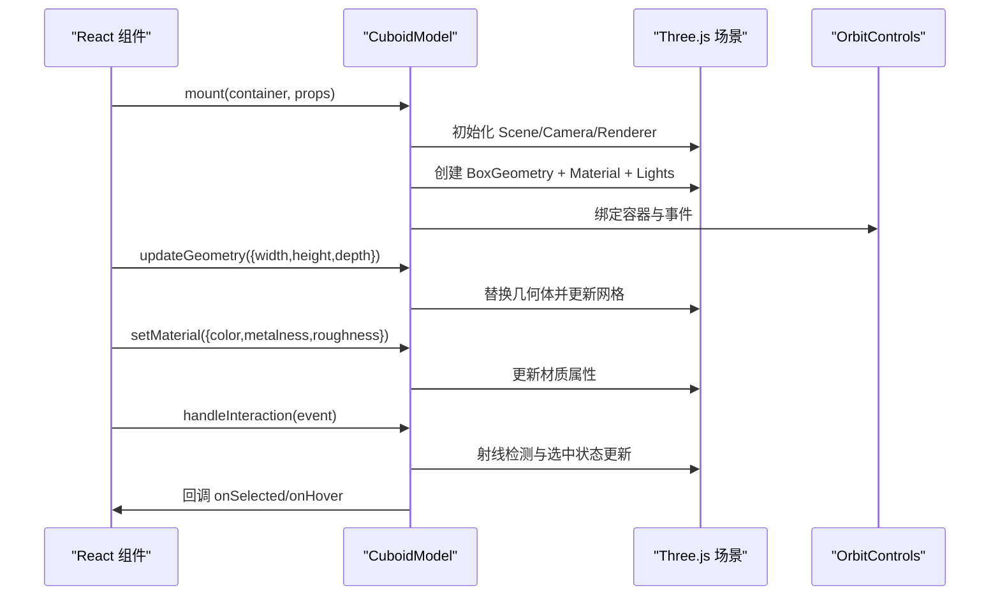
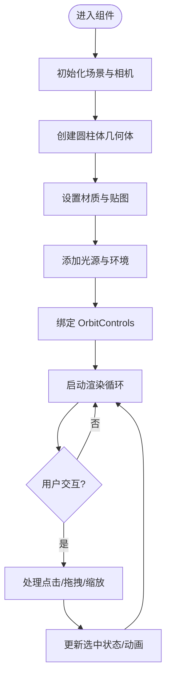
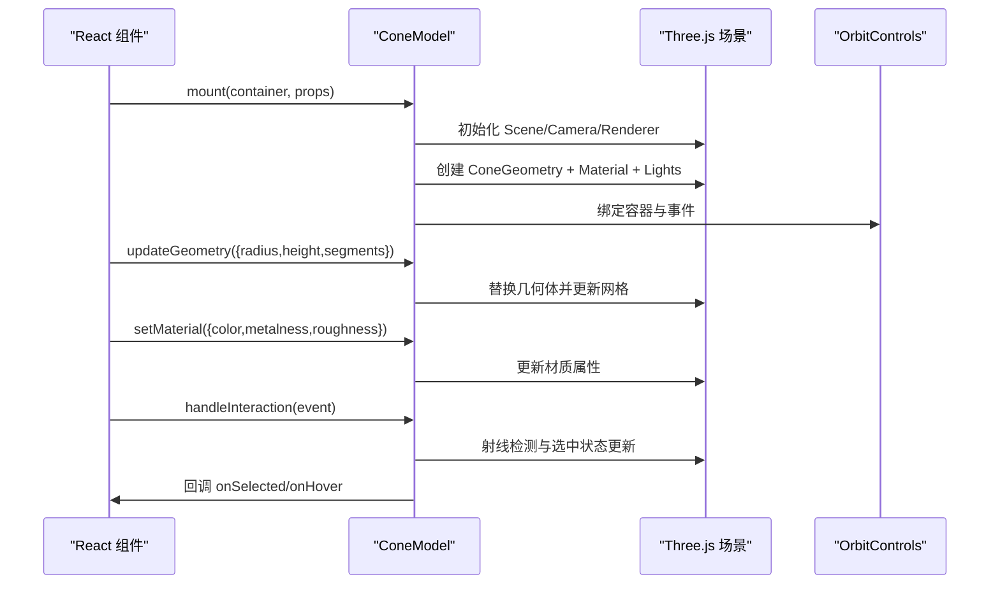
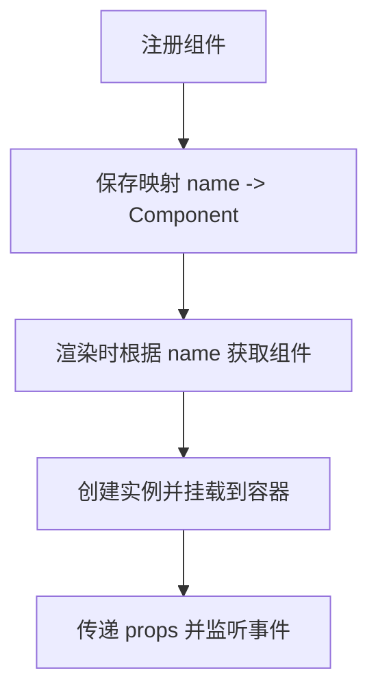
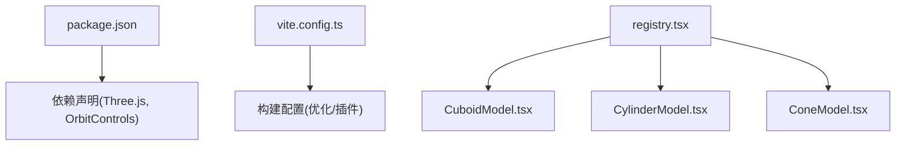

# 3D 模型实现

<cite>
**本文档引用的文件**
- [CuboidModel.tsx](file://src/visualizations/CuboidModel.tsx)
- [CylinderModel.tsx](file://src/visualizations/CylinderModel.tsx)
- [ConeModel.tsx](file://src/visualizations/ConeModel.tsx)
- [registry.tsx](file://src/visualizations/registry.tsx)
- [package.json](file://package.json)
- [vite.config.ts](file://vite.config.ts)
</cite>

## 目录
1. [简介](#简介)
2. [项目结构](#项目结构)
3. [核心组件](#核心组件)
4. [架构总览](#架构总览)
5. [详细组件分析](#详细组件分析)
6. [依赖关系分析](#依赖关系分析)
7. [性能考虑](#性能考虑)
8. [故障排查指南](#故障排查指南)
9. [结论](#结论)
10. [附录](#附录)

## 简介
本文件面向 math-k6 项目的 3D 数学模型实现，聚焦立方体、圆柱体与圆锥体的 3D 建模技术，涵盖 WebGL/Three.js 集成、对象创建、材质与光照配置、相机控制（旋转、缩放、平移）、渲染优化（对象池与批次优化）、交互（拖拽旋转、点击选择、视图切换）、移动端适配与性能调优，以及复杂几何体的组合与布尔运算方案。文档以仓库中的可视化组件为核心，提供从架构到细节的系统化说明，帮助开发者快速理解并扩展 3D 教学场景。

## 项目结构
本项目采用 React + Vite 的前端工程结构，3D 相关能力集中在 src/visualizations 目录下的可视化组件中：
- CuboidModel.tsx：立方体 3D 模型组件
- CylinderModel.tsx：圆柱体 3D 模型组件
- ConeModel.tsx：圆锥体 3D 模型组件
- registry.tsx：可视化组件注册表，统一暴露与按需加载

图表来源
- [registry.tsx](file://src/visualizations/registry.tsx)
- [CuboidModel.tsx](file://src/visualizations/CuboidModel.tsx)
- [CylinderModel.tsx](file://src/visualizations/CylinderModel.tsx)
- [ConeModel.tsx](file://src/visualizations/ConeModel.tsx)
- [vite.config.ts](file://vite.config.ts)
- [package.json](file://package.json)

章节来源
- [registry.tsx](file://src/visualizations/registry.tsx)
- [CuboidModel.tsx](file://src/visualizations/CuboidModel.tsx)
- [CylinderModel.tsx](file://src/visualizations/CylinderModel.tsx)
- [ConeModel.tsx](file://src/visualizations/ConeModel.tsx)
- [vite.config.ts](file://vite.config.ts)
- [package.json](file://package.json)

## 核心组件
- 立方体模型组件（CuboidModel）：负责创建立方体网格、设置材质与光照、绑定交互事件、管理相机视角与动画循环。
- 圆柱体模型组件（CylinderModel）：负责创建圆柱体网格、材质与光照、交互与相机控制、渲染优化。
- 圆锥体模型组件（ConeModel）：负责创建圆锥体网格、材质与光照、交互与相机控制、渲染优化。
- 可视化注册表（registry）：集中注册上述 3D 组件，供上层页面或游戏模块按需调用。

章节来源
- [CuboidModel.tsx](file://src/visualizations/CuboidModel.tsx)
- [CylinderModel.tsx](file://src/visualizations/CylinderModel.tsx)
- [ConeModel.tsx](file://src/visualizations/ConeModel.tsx)
- [registry.tsx](file://src/visualizations/registry.tsx)

## 架构总览
整体架构遵循“组件即场景”的模式：每个 3D 模型组件封装了 Three.js 的 Scene、Camera、Renderer、Mesh、Material、Light 与交互控制器，并通过 React 生命周期进行挂载与销毁。注册表提供统一的访问入口，便于在知识页或游戏中动态加载对应模型。

图表来源
- [CuboidModel.tsx](file://src/visualizations/CuboidModel.tsx)
- [CylinderModel.tsx](file://src/visualizations/CylinderModel.tsx)
- [ConeModel.tsx](file://src/visualizations/ConeModel.tsx)
- [registry.tsx](file://src/visualizations/registry.tsx)

## 详细组件分析

### 立方体模型（CuboidModel）
- 几何创建：使用 BoxGeometry 或自定义 BufferGeometry 构建面片与边线，支持尺寸参数化。
- 材质与光照：PBR 材质（如 MeshStandardMaterial），环境光 + 方向光 + 点光源组合，支持贴图与法线贴图。
- 相机控制：OrbitControls 实现旋转、缩放、平移；支持触摸手势与键盘快捷键。
- 交互：射线检测实现点击选择、悬停高亮；事件冒泡至 React 层处理业务逻辑。
- 渲染优化：合并几何体、启用深度测试与阴影贴图、按需更新帧率。

图表来源
- [CuboidModel.tsx](file://src/visualizations/CuboidModel.tsx)

章节来源
- [CuboidModel.tsx](file://src/visualizations/CuboidModel.tsx)

### 圆柱体模型（CylinderModel）
- 几何创建：使用 CylinderGeometry，支持半径、高度、分段数等参数，可生成开盖或闭盖形态。
- 材质与光照：同立方体，支持纹理映射（如木纹、金属）。
- 相机控制：与立方体一致，确保多模型间一致的交互体验。
- 交互：点击选择、拖拽旋转、双击重置视角。
- 渲染优化：减少分段数以提升低端设备性能；启用实例化渲染（InstancedMesh）批量绘制。

图表来源
- [CylinderModel.tsx](file://src/visualizations/CylinderModel.tsx)

章节来源
- [CylinderModel.tsx](file://src/visualizations/CylinderModel.tsx)

### 圆锥体模型（ConeModel）
- 几何创建：使用 ConeGeometry，支持底面半径、高度、分段数，可生成尖顶或截头圆锥。
- 材质与光照：支持高光与反射，适合展示体积感。
- 相机控制：与其他模型保持一致的交互模式。
- 交互：支持点击选择、拖拽旋转、滚轮缩放。
- 渲染优化：低分段优先，必要时开启抗锯齿与后处理效果。

图表来源
- [ConeModel.tsx](file://src/visualizations/ConeModel.tsx)

章节来源
- [ConeModel.tsx](file://src/visualizations/ConeModel.tsx)

### 可视化注册表（registry）
- 功能：集中注册与获取 3D 组件，支持命名空间与版本管理。
- 使用方式：上层通过名称获取组件并传入容器与属性进行渲染。
- 扩展性：新增模型只需在注册表中声明即可被全局使用。

图表来源
- [registry.tsx](file://src/visualizations/registry.tsx)

章节来源
- [registry.tsx](file://src/visualizations/registry.tsx)

## 依赖关系分析
- 构建工具：Vite 用于开发与打包，优化资源加载与代码分割。
- 运行时依赖：Three.js 及其生态（OrbitControls、材质与几何体库）。
- 组件耦合：各模型组件接口相似，便于统一管理与复用；注册表降低耦合度。

图表来源
- [package.json](file://package.json)
- [vite.config.ts](file://vite.config.ts)
- [registry.tsx](file://src/visualizations/registry.tsx)
- [CuboidModel.tsx](file://src/visualizations/CuboidModel.tsx)
- [CylinderModel.tsx](file://src/visualizations/CylinderModel.tsx)
- [ConeModel.tsx](file://src/visualizations/ConeModel.tsx)

章节来源
- [package.json](file://package.json)
- [vite.config.ts](file://vite.config.ts)
- [registry.tsx](file://src/visualizations/registry.tsx)

## 性能考虑
- 几何体优化：合理设置分段数，避免过高细分导致三角面过多；对重复对象使用 InstancedMesh。
- 材质与纹理：使用合适的贴图分辨率，启用压缩格式（如 KTX2/ASTC），减少内存占用。
- 光照与阴影：限制阴影贴图大小与数量，关闭不必要的实时阴影。
- 渲染管线：启用深度测试、剔除背面、按需更新帧率（requestAnimationFrame 节流）。
- 对象池：对频繁创建销毁的临时对象（如粒子、标注）使用对象池复用。
- 移动端适配：降低分辨率与像素比，禁用昂贵后处理，增加触控手势支持。

[本节为通用指导，不直接分析具体文件]

## 故障排查指南
- 模型不显示：检查容器尺寸与 Renderer.setSize，确认相机位置与视锥体范围。
- 材质异常：确认材质类型与光照匹配，检查纹理路径与跨域策略。
- 交互失效：验证 OrbitControls 绑定容器与事件冲突，检查射线检测命中区域。
- 性能卡顿：监控 FPS 与 Draw Calls，减少几何复杂度与材质数量，启用批渲染。
- 内存泄漏：确保组件卸载时释放 Three.js 资源（geometry、material、texture、renderer）。

章节来源
- [CuboidModel.tsx](file://src/visualizations/CuboidModel.tsx)
- [CylinderModel.tsx](file://src/visualizations/CylinderModel.tsx)
- [ConeModel.tsx](file://src/visualizations/ConeModel.tsx)

## 结论
math-k6 的 3D 模型实现以组件化为核心，将 Three.js 的能力封装在独立的可视化组件中，并通过注册表统一管理。立方体、圆柱体与圆锥体具备一致的接口与交互模式，便于在教学场景中灵活组合与扩展。通过合理的几何与材质优化、相机控制与交互设计，可在多端设备上提供流畅的 3D 学习体验。后续可进一步引入实例化渲染、对象池与更丰富的几何布尔运算，提升复杂场景的表现力与性能。

[本节为总结性内容，不直接分析具体文件]

## 附录
- 交互式 3D 体验建议：
  - 拖拽旋转：基于 OrbitControls 的指针事件，区分单指旋转与双指缩放。
  - 点击选择：使用 Raycaster 进行命中检测，结合选中态高亮与提示框。
  - 视图切换：预设相机位置与目标点，平滑过渡到不同视角（俯视、侧视、透视）。
- 复杂几何体组合与布尔运算：
  - 组合：通过 Group 或 Object3D 层级组织多个 Mesh，统一变换与动画。
  - 布尔运算：使用 CSG 库（如 three-csg-ts）实现加减交操作，注意性能与精度权衡。
- 移动端适配策略：
  - 降低像素比与分辨率，禁用不必要的光照与阴影。
  - 优化触控手势，增加滑动灵敏度与阻尼系数。
  - 使用懒加载与按需渲染，减少首屏压力。

[本节为概念性内容，不直接分析具体文件]