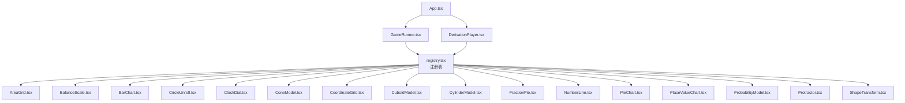
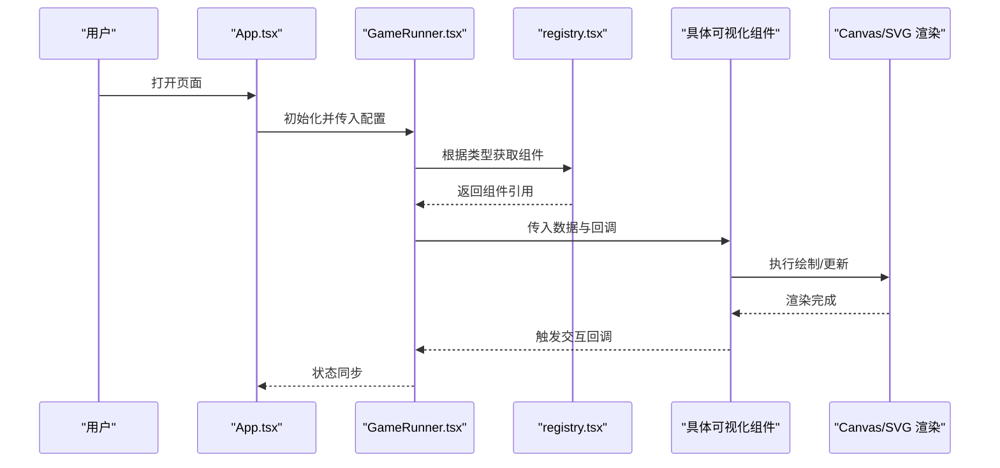
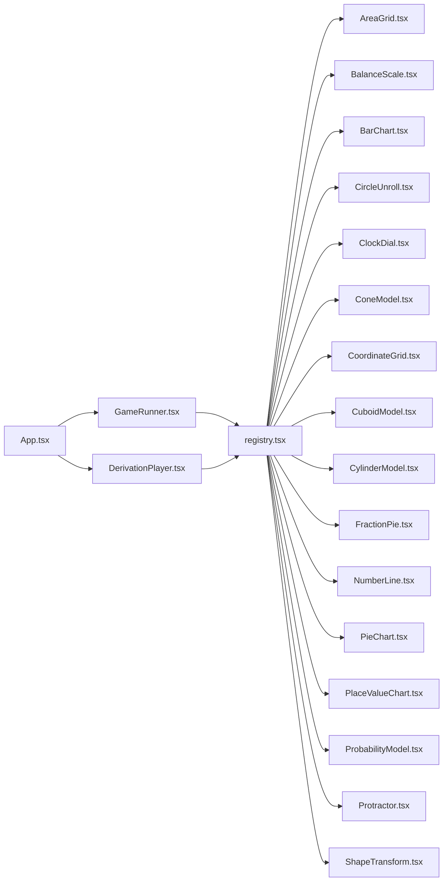

# Canvas/SVG 绘制技术

<cite>
**本文引用的文件**   
- [src/visualizations/AreaGrid.tsx](file://src/visualizations/AreaGrid.tsx)
- [src/visualizations/BalanceScale.tsx](file://src/visualizations/BalanceScale.tsx)
- [src/visualizations/BarChart.tsx](file://src/visualizations/BarChart.tsx)
- [src/visualizations/CircleUnroll.tsx](file://src/visualizations/CircleUnroll.tsx)
- [src/visualizations/ClockDial.tsx](file://src/visualizations/ClockDial.tsx)
- [src/visualizations/ConeModel.tsx](file://src/visualizations/ConeModel.tsx)
- [src/visualizations/CoordinateGrid.tsx](file://src/visualizations/CoordinateGrid.tsx)
- [src/visualizations/CuboidModel.tsx](file://src/visualizations/CuboidModel.tsx)
- [src/visualizations/CylinderModel.tsx](file://src/visualizations/CylinderModel.tsx)
- [src/visualizations/FractionPie.tsx](file://src/visualizations/FractionPie.tsx)
- [src/visualizations/NumberLine.tsx](file://src/visualizations/NumberLine.tsx)
- [src/visualizations/PieChart.tsx](file://src/visualizations/PieChart.tsx)
- [src/visualizations/PlaceValueChart.tsx](file://src/visualizations/PlaceValueChart.tsx)
- [src/visualizations/ProbabilityModel.tsx](file://src/visualizations/ProbabilityModel.tsx)
- [src/visualizations/Protractor.tsx](file://src/visualizations/Protractor.tsx)
- [src/visualizations/ShapeTransform.tsx](file://src/visualizations/ShapeTransform.tsx)
- [src/visualizations/registry.tsx](file://src/visualizations/registry.tsx)
- [src/components/DerivationPlayer.tsx](file://src/components/DerivationPlayer.tsx)
- [src/components/GameRunner.tsx](file://src/components/GameRunner.tsx)
- [src/App.tsx](file://src/App.tsx)
- [src/main.tsx](file://src/main.tsx)
- [package.json](file://package.json)
</cite>

## 目录
1. [简介](#简介)
2. [项目结构](#项目结构)
3. [核心组件](#核心组件)
4. [架构总览](#架构总览)
5. [详细组件分析](#详细组件分析)
6. [依赖关系分析](#依赖关系分析)
7. [性能考量](#性能考量)
8. [故障排查指南](#故障排查指南)
9. [结论](#结论)
10. [附录](#附录)

## 简介
本指南面向 math-k6 项目的数学可视化与交互开发，聚焦于 Canvas 与 SVG 两种绘制技术在几何图形、坐标系统、动画与响应式布局、以及触摸事件处理等方面的实践。通过梳理项目中现有可视化组件的实现模式，总结不同场景下的选型建议（Canvas vs SVG），并给出可复用的实现范式与优化策略，帮助开发者快速构建高性能、可维护的数学教学可视化内容。

## 项目结构
math-k6 采用 React + TypeScript 的前端工程化结构，可视化能力集中在 src/visualizations 目录下，每个知识点或题型对应一个或多个可视化组件；运行时由 App 与 GameRunner/DerivationPlayer 等容器组件编排渲染。

图表来源
- [src/App.tsx](file://src/App.tsx)
- [src/components/GameRunner.tsx](file://src/components/GameRunner.tsx)
- [src/components/DerivationPlayer.tsx](file://src/components/DerivationPlayer.tsx)
- [src/visualizations/registry.tsx](file://src/visualizations/registry.tsx)

章节来源
- [src/App.tsx](file://src/App.tsx)
- [src/components/GameRunner.tsx](file://src/components/GameRunner.tsx)
- [src/components/DerivationPlayer.tsx](file://src/components/DerivationPlayer.tsx)
- [src/visualizations/registry.tsx](file://src/visualizations/registry.tsx)

## 核心组件
- 注册表 registry.tsx：集中管理可视化组件的注册与查找，便于按知识点或题型动态加载。
- 游戏运行器 GameRunner.tsx：负责加载题目配置、驱动可视化组件生命周期与交互状态。
- 推导播放器 DerivationPlayer.tsx：用于步骤化推导演示，常配合动画与过渡效果。
- 各可视化组件：以函数式组件为主，内部使用 SVG 或 Canvas 进行绘制，封装数据到图形的映射逻辑。

章节来源
- [src/visualizations/registry.tsx](file://src/visualizations/registry.tsx)
- [src/components/GameRunner.tsx](file://src/components/GameRunner.tsx)
- [src/components/DerivationPlayer.tsx](file://src/components/DerivationPlayer.tsx)

## 架构总览
整体采用“容器组件 + 可视化组件”的分层架构：
- 容器组件负责数据装配、状态管理与事件转发。
- 可视化组件专注渲染与交互细节，对外暴露最小接口（如 props）。
- 注册表提供统一入口，支持按需加载与扩展。

图表来源
- [src/App.tsx](file://src/App.tsx)
- [src/components/GameRunner.tsx](file://src/components/GameRunner.tsx)
- [src/visualizations/registry.tsx](file://src/visualizations/registry.tsx)

## 详细组件分析
以下从“绘制方式、坐标系统、动画与交互、响应式适配”四个维度对关键组件进行分析，并给出选型建议与优化要点。

### 坐标网格 CoordinateGrid
- 绘制方式：适合使用 SVG 或 Canvas。若强调元素级交互（如点击格子高亮），SVG 更直观；若大量网格频繁刷新，Canvas 更高效。
- 坐标系统：通常定义视口宽高与网格间距，将数学坐标映射为像素坐标；可使用变换矩阵统一处理缩放与平移。
- 动画与交互：鼠标悬停/点击反馈可用 CSS 或 JS 驱动；高频重绘建议使用 requestAnimationFrame 节流。
- 响应式：监听窗口尺寸变化，重新计算网格行列数与单元格尺寸。

章节来源
- [src/visualizations/CoordinateGrid.tsx](file://src/visualizations/CoordinateGrid.tsx)

### 分数饼图 FractionPie
- 绘制方式：推荐使用 SVG path 绘制扇形，便于单独着色与动画过渡。
- 坐标系统：以圆心为原点，角度转弧度计算起点与终点，注意起始角与方向。
- 动画与交互：可通过逐步增大角度实现“展开”动画；点击扇区可高亮或弹出说明。
- 响应式：根据容器宽度自适应半径与字体大小。

章节来源
- [src/visualizations/FractionPie.tsx](file://src/visualizations/FractionPie.tsx)

### 条形图 BarChart
- 绘制方式：SVG rect 或 Canvas fillRect。数据量较大时优先 Canvas。
- 坐标系统：X/Y 轴刻度与数据值映射到像素位置；需处理留白与边距。
- 动画与交互：入场动画（高度增长）、hover 提示、排序/筛选。
- 响应式：横纵比例随容器变化自动重排。

章节来源
- [src/visualizations/BarChart.tsx](file://src/visualizations/BarChart.tsx)

### 圆形展开 CircleUnroll
- 绘制方式：SVG path 绘制圆弧与切线，适合展示圆周长展开过程。
- 坐标系统：极坐标到直角坐标转换，控制弧长与切点位置。
- 动画与交互：逐步展开动画，拖拽控制展开进度。
- 响应式：半径与文本字号随容器缩放。

章节来源
- [src/visualizations/CircleUnroll.tsx](file://src/visualizations/CircleUnroll.tsx)

### 时钟表盘 ClockDial
- 绘制方式：SVG 绘制刻度与指针，Canvas 也可但交互复杂度高。
- 坐标系统：以中心为原点，角度映射到分钟/小时刻度。
- 动画与交互：指针平滑转动，支持拖动设置时间。
- 响应式：表盘半径与刻度密度自适应。

章节来源
- [src/visualizations/ClockDial.tsx](file://src/visualizations/ClockDial.tsx)

### 圆锥模型 ConeModel / 圆柱模型 CylinderModel / 长方体模型 CuboidModel
- 绘制方式：3D 投影到 2D 屏幕，常用 SVG 路径组合或 Canvas 线段填充。
- 坐标系统：三维坐标经旋转矩阵投影至二维平面，再映射到像素坐标。
- 动画与交互：旋转视角、展开/折叠面、点击面高亮。
- 响应式：根据容器尺寸调整投影参数与透视距离。

章节来源
- [src/visualizations/ConeModel.tsx](file://src/visualizations/ConeModel.tsx)
- [src/visualizations/CylinderModel.tsx](file://src/visualizations/CylinderModel.tsx)
- [src/visualizations/CuboidModel.tsx](file://src/visualizations/CuboidModel.tsx)

### 面积网格 AreaGrid
- 绘制方式：Canvas 批量绘制矩形效率高；SVG 便于逐格交互。
- 坐标系统：行列索引到像素坐标的线性映射。
- 动画与交互：逐格填充动画，点击切换状态。
- 响应式：单元格数量与尺寸随容器变化。

章节来源
- [src/visualizations/AreaGrid.tsx](file://src/visualizations/AreaGrid.tsx)

### 天平 BalanceScale
- 绘制方式：SVG 更适合表达杠杆、托盘等矢量图形。
- 坐标系统：支点为中心，左右力矩平衡计算倾斜角度。
- 动画与交互：拖拽砝码，实时计算平衡状态。
- 响应式：容器宽度影响臂长与刻度显示。

章节来源
- [src/visualizations/BalanceScale.tsx](file://src/visualizations/BalanceScale.tsx)

### 数轴 NumberLine
- 绘制方式：SVG line + text 标注刻度与数值。
- 坐标系统：数值到像素的一一映射，支持缩放与平移。
- 动画与交互：滑动选择区间，高亮范围。
- 响应式：刻度密度与标签间距自适应。

章节来源
- [src/visualizations/NumberLine.tsx](file://src/visualizations/NumberLine.tsx)

### 饼图 PieChart
- 绘制方式：SVG path 绘制多段圆弧，适合分类占比展示。
- 坐标系统：角度累加确定每段起止弧。
- 动画与交互：入场动画、点击放大、图例联动。
- 响应式：半径与文字大小随容器变化。

章节来源
- [src/visualizations/PieChart.tsx](file://src/visualizations/PieChart.tsx)

### 位值表 PlaceValueChart
- 绘制方式：表格+数字卡片，SVG 或 HTML 均可。
- 坐标系统：列对齐与行高固定，便于排版。
- 动画与交互：卡片拖拽入位，进位/借位演示。
- 响应式：列宽与字号自适应。

章节来源
- [src/visualizations/PlaceValueChart.tsx](file://src/visualizations/PlaceValueChart.tsx)

### 概率模型 ProbabilityModel
- 绘制方式：树状图或直方图，SVG 路径或 Canvas 矩形。
- 坐标系统：节点层级与分支概率映射到位置与长度。
- 动画与交互：逐步展开概率树，点击节点查看条件概率。
- 响应式：树深度与分支数自适应布局。

章节来源
- [src/visualizations/ProbabilityModel.tsx](file://src/visualizations/ProbabilityModel.tsx)

### 量角器 Protractor
- 绘制方式：SVG arc 与刻度线，精确角度标注。
- 坐标系统：以顶点为原点，角度映射到刻度位置。
- 动画与交互：拖拽射线改变角度，实时显示度数。
- 响应式：半径与刻度密度自适应。

章节来源
- [src/visualizations/Protractor.tsx](file://src/visualizations/Protractor.tsx)

### 图形变换 ShapeTransform
- 绘制方式：SVG transform 或 Canvas 变换矩阵，支持平移、旋转、缩放。
- 坐标系统：局部坐标系与全局坐标系通过矩阵变换关联。
- 动画与交互：滑块控制变换参数，实时预览。
- 响应式：画布尺寸变化后重新应用变换。

章节来源
- [src/visualizations/ShapeTransform.tsx](file://src/visualizations/ShapeTransform.tsx)

### 注册表 registry.tsx
- 职责：集中注册可视化组件，提供按名称查找的能力，便于运行时动态加载。
- 设计要点：键值映射、类型约束、懒加载可选。

章节来源
- [src/visualizations/registry.tsx](file://src/visualizations/registry.tsx)

## 依赖关系分析
- App.tsx 作为根组件，挂载 GameRunner 与 DerivationPlayer。
- GameRunner 与 DerivationPlayer 通过 registry.tsx 获取具体可视化组件。
- 各可视化组件之间无直接耦合，依赖通过 props 传递数据与回调。

图表来源
- [src/App.tsx](file://src/App.tsx)
- [src/components/GameRunner.tsx](file://src/components/GameRunner.tsx)
- [src/components/DerivationPlayer.tsx](file://src/components/DerivationPlayer.tsx)
- [src/visualizations/registry.tsx](file://src/visualizations/registry.tsx)

章节来源
- [src/App.tsx](file://src/App.tsx)
- [src/components/GameRunner.tsx](file://src/components/GameRunner.tsx)
- [src/components/DerivationPlayer.tsx](file://src/components/DerivationPlayer.tsx)
- [src/visualizations/registry.tsx](file://src/visualizations/registry.tsx)

## 性能考量
- 绘制技术选型
  - SVG：元素级操作友好，适合少量图形、强交互与可访问性要求高的场景。
  - Canvas：像素级绘制，适合大量图形、频繁重绘与复杂动画场景。
- 动画与帧率
  - 使用 requestAnimationFrame 驱动动画，避免阻塞主线程。
  - 合并多次状态更新，减少不必要的重绘。
- 内存与重绘
  - 大数组或复杂路径缓存结果，避免重复计算。
  - 使用离屏 Canvas 或 SVG 片段复用提升性能。
- 响应式与 DPR
  - 根据设备像素比调整分辨率，保证清晰度同时控制开销。
  - 监听 resize 事件，延迟重算布局，避免抖动。

[本节为通用指导，不直接分析具体文件]

## 故障排查指南
- 渲染错位
  - 检查坐标映射与边距设置是否正确。
  - 确认容器尺寸变化后是否触发了重绘。
- 动画卡顿
  - 检查是否在主线程执行了耗时计算。
  - 降低每帧绘制对象数量或使用离屏渲染。
- 交互失效
  - 确认事件绑定在正确的 DOM 节点上。
  - 移动端注意 touch 事件与 pointer 事件的兼容。
- 缩放失真
  - 检查 viewBox 或 DPR 设置是否匹配。
  - 确保文本与线条在缩放后仍清晰可读。

[本节为通用指导，不直接分析具体文件]

## 结论
math-k6 的可视化体系以组件化为核心，通过注册表统一管理，容器组件负责编排与状态流转。对于数学教学可视化，SVG 在元素级交互与可访问性方面更具优势，而 Canvas 在大规模图形与高频动画场景中表现更佳。结合合理的坐标系统与变换矩阵、requestAnimationFrame 驱动的动画、响应式适配与触摸事件处理，可以构建出既美观又高效的数学可视化体验。

[本节为总结性内容，不直接分析具体文件]

## 附录
- 常见绘制方法速查
  - 线条：SVG line/path 或 Canvas moveTo/lineTo。
  - 圆形：SVG circle 或 Canvas arc。
  - 多边形：SVG polygon/path 或 Canvas beginPath/lineTo/closePath。
  - 曲线：SVG path 贝塞尔曲线或 Canvas bezierCurveTo/quadraticCurveTo。
- 坐标系统要点
  - 绝对坐标：基于画布原点的固定位置。
  - 相对坐标：基于父元素或局部坐标系的位置。
  - 变换矩阵：统一处理平移、旋转、缩放与斜切。
- 动画最佳实践
  - 使用 requestAnimationFrame 循环更新。
  - 增量更新而非全量重绘。
  - 合理设置帧间隔与插值算法。
- 响应式方案
  - 使用 ResizeObserver 监听容器尺寸。
  - 按比例缩放与重算布局。
- 触摸与交互
  - 统一 pointer 事件处理，兼容鼠标与触摸。
  - 防抖与节流避免频繁触发。
  - 多点触控与手势识别。

[本节为通用指导，不直接分析具体文件]