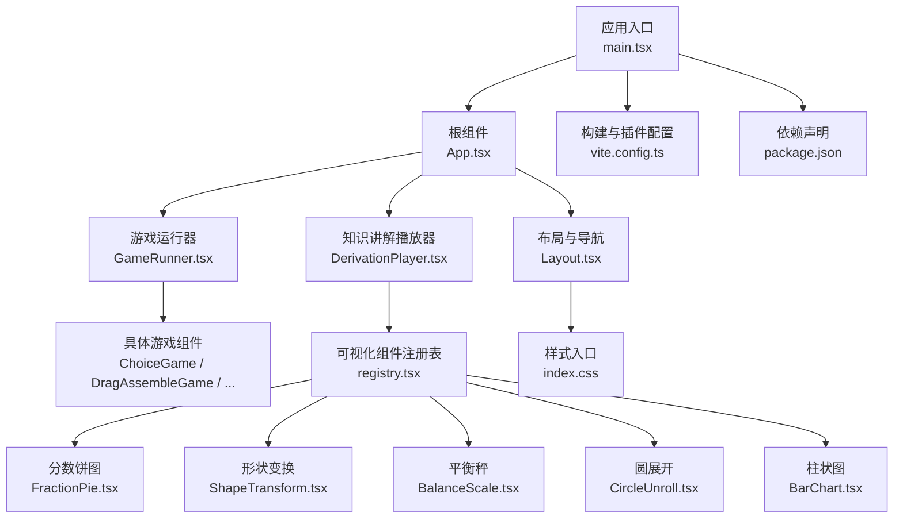
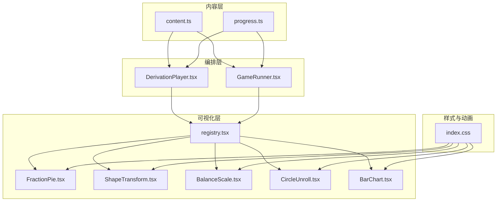
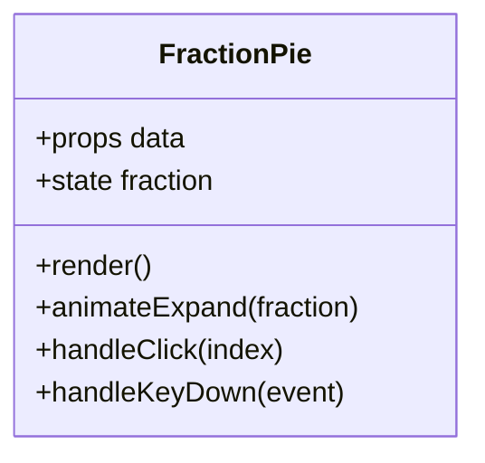
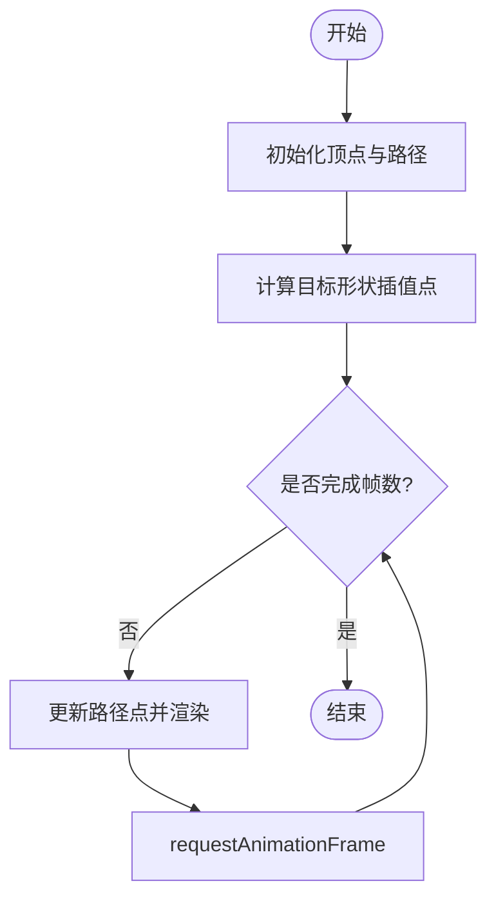
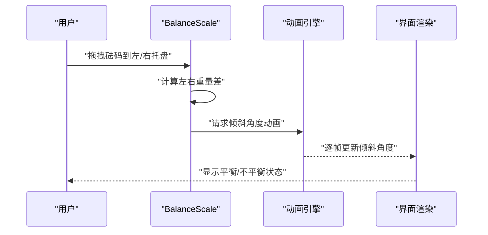
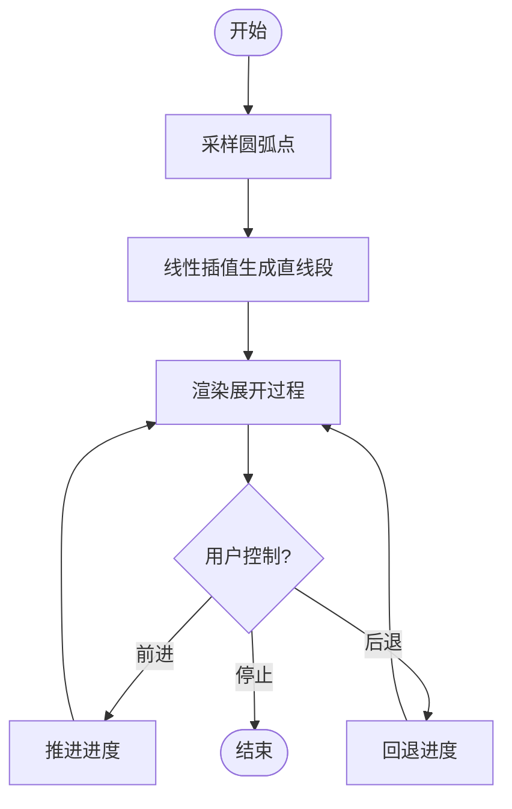
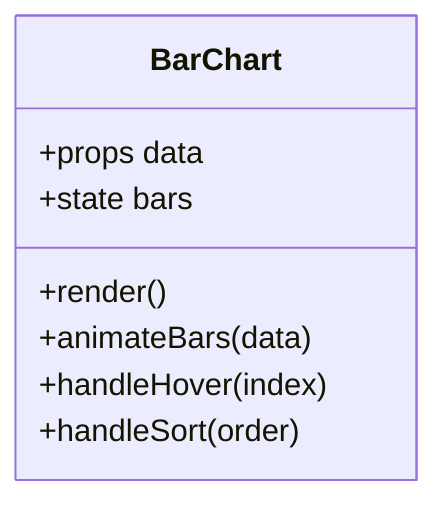
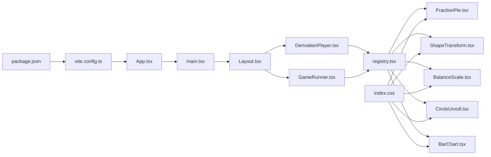

# 动画与交互实现

<cite>
**本文引用的文件**   
- [package.json](file://package.json)
- [vite.config.ts](file://vite.config.ts)
- [App.tsx](file://src/App.tsx)
- [main.tsx](file://src/main.tsx)
- [index.css](file://src/index.css)
- [GameRunner.tsx](file://src/components/GameRunner.tsx)
- [Layout.tsx](file://src/components/Layout.tsx)
- [DerivationPlayer.tsx](file://src/components/DerivationPlayer.tsx)
- [FractionPie.tsx](file://src/visualizations/FractionPie.tsx)
- [ShapeTransform.tsx](file://src/visualizations/ShapeTransform.tsx)
- [BalanceScale.tsx](file://src/visualizations/BalanceScale.tsx)
- [CircleUnroll.tsx](file://src/visualizations/CircleUnroll.tsx)
- [BarChart.tsx](file://src/visualizations/BarChart.tsx)
- [registry.tsx](file://src/visualizations/registry.tsx)
- [ChoiceGame.tsx](file://src/components/games/ChoiceGame.tsx)
- [DragAssembleGame.tsx](file://src/components/games/DragAssembleGame.tsx)
- [DragMatchGame.tsx](file://src/components/games/DragMatchGame.tsx)
- [FillBlankGame.tsx](file://src/components/games/FillBlankGame.tsx)
- [TimedChallengeGame.tsx](file://src/components/games/TimedChallengeGame.tsx)
- [TimelineGame.tsx](file://src/components/games/TimelineGame.tsx)
- [TrueFalseGame.tsx](file://src/components/games/TrueFalseGame.tsx)
- [ProgressContext.tsx](file://src/context/ProgressContext.tsx)
- [content.ts](file://src/lib/content.ts)
- [progress.ts](file://src/lib/progress.ts)
- [types.ts](file://src/lib/types.ts)
</cite>

## 目录
1. [引言](#引言)
2. [项目结构](#项目结构)
3. [核心组件](#核心组件)
4. [架构总览](#架构总览)
5. [详细组件分析](#详细组件分析)
6. [依赖关系分析](#依赖关系分析)
7. [性能考虑](#性能考虑)
8. [故障排查指南](#故障排查指南)
9. [结论](#结论)
10. [附录](#附录)

## 引言
本指南聚焦 math-k6 项目的动画与交互实现，覆盖 React 生态下的 CSS transitions/animations、第三方动画库集成策略，以及数学可视化场景（分数饼图展开、形状变换过渡、平衡秤动态平衡）的动画设计。文档同时提供用户交互的统一处理方案（鼠标、触摸、键盘），并给出流畅动画的性能优化技巧（请求帧管理、内存泄漏防护）和无障碍访问支持建议。最后通过复杂交互案例串联上述能力，帮助读者快速落地高质量的教学动画体验。

## 项目结构
本项目采用按功能域划分的目录组织：
- src/components：游戏与页面级组件（如 GameRunner、Layout、DerivationPlayer）
- src/visualizations：数学可视化组件（如 FractionPie、ShapeTransform、BalanceScale、CircleUnroll、BarChart）
- src/pages：页面路由与数据加载
- src/context：全局状态上下文（进度等）
- src/lib：内容加载、进度管理与类型定义
- public：静态资源
- 根配置：package.json、vite.config.ts、index.html、CSS 入口

图表来源
- [main.tsx:1-200](file://src/main.tsx#L1-L200)
- [App.tsx:1-200](file://src/App.tsx#L1-L200)
- [Layout.tsx:1-200](file://src/components/Layout.tsx#L1-L200)
- [DerivationPlayer.tsx:1-200](file://src/components/DerivationPlayer.tsx#L1-L200)
- [GameRunner.tsx:1-200](file://src/components/GameRunner.tsx#L1-L200)
- [registry.tsx:1-200](file://src/visualizations/registry.tsx#L1-L200)
- [FractionPie.tsx:1-200](file://src/visualizations/FractionPie.tsx#L1-L200)
- [ShapeTransform.tsx:1-200](file://src/visualizations/ShapeTransform.tsx#L1-L200)
- [BalanceScale.tsx:1-200](file://src/visualizations/BalanceScale.tsx#L1-L200)
- [CircleUnroll.tsx:1-200](file://src/visualizations/CircleUnroll.tsx#L1-L200)
- [BarChart.tsx:1-200](file://src/visualizations/BarChart.tsx#L1-L200)
- [index.css:1-200](file://src/index.css#L1-L200)
- [vite.config.ts:1-200](file://vite.config.ts#L1-L200)
- [package.json:1-200](file://package.json#L1-L200)

章节来源
- [main.tsx:1-200](file://src/main.tsx#L1-L200)
- [App.tsx:1-200](file://src/App.tsx#L1-L200)
- [package.json:1-200](file://package.json#L1-L200)
- [vite.config.ts:1-200](file://vite.config.ts#L1-L200)

## 核心组件
- 应用入口与根组件：负责初始化 React 应用、挂载路由与全局上下文，统一引入样式与基础配置。
- 布局组件：提供页面骨架、导航与内容区域，承载动画容器与无障碍属性。
- 知识讲解播放器：驱动 derivation 流程，调用可视化组件进行分步演示，适合教学动画序列。
- 游戏运行器：根据 game.json 配置渲染对应游戏组件，集中处理交互与反馈动画。
- 可视化组件注册表：集中注册各数学可视化组件，便于按需加载与统一管理。
- 进度上下文：维护学习进度与状态，为动画触发与回放提供数据支撑。

章节来源
- [main.tsx:1-200](file://src/main.tsx#L1-L200)
- [App.tsx:1-200](file://src/App.tsx#L1-L200)
- [Layout.tsx:1-200](file://src/components/Layout.tsx#L1-L200)
- [DerivationPlayer.tsx:1-200](file://src/components/DerivationPlayer.tsx#L1-L200)
- [GameRunner.tsx:1-200](file://src/components/GameRunner.tsx#L1-L200)
- [registry.tsx:1-200](file://src/visualizations/registry.tsx#L1-L200)
- [ProgressContext.tsx:1-200](file://src/context/ProgressContext.tsx#L1-L200)

## 架构总览
整体架构围绕“内容驱动 + 可视化组件 + 交互层”的模式：
- 内容层：content.ts 与 progress.ts 提供知识点与进度数据
- 表现层：DerivationPlayer 与 GameRunner 编排动画与交互流程
- 可视化层：registry.tsx 统一注册 FractionPie、ShapeTransform、BalanceScale、CircleUnroll、BarChart 等
- 样式与动画：index.css 提供基础过渡与关键帧；可在组件内使用 CSS transitions/animations 或集成第三方库

图表来源
- [content.ts:1-200](file://src/lib/content.ts#L1-L200)
- [progress.ts:1-200](file://src/lib/progress.ts#L1-L200)
- [DerivationPlayer.tsx:1-200](file://src/components/DerivationPlayer.tsx#L1-L200)
- [GameRunner.tsx:1-200](file://src/components/GameRunner.tsx#L1-L200)
- [registry.tsx:1-200](file://src/visualizations/registry.tsx#L1-L200)
- [FractionPie.tsx:1-200](file://src/visualizations/FractionPie.tsx#L1-L200)
- [ShapeTransform.tsx:1-200](file://src/visualizations/ShapeTransform.tsx#L1-L200)
- [BalanceScale.tsx:1-200](file://src/visualizations/BalanceScale.tsx#L1-L200)
- [CircleUnroll.tsx:1-200](file://src/visualizations/CircleUnroll.tsx#L1-L200)
- [BarChart.tsx:1-200](file://src/visualizations/BarChart.tsx#L1-L200)
- [index.css:1-200](file://src/index.css#L1-L200)

## 详细组件分析

### 分数饼图（FractionPie）
- 动画需求：展示分数的“展开”过程，强调部分与整体的关系，适合教学演示。
- 实现要点：
  - 使用 SVG path 或 canvas 绘制扇形，基于状态控制角度变化
  - 通过 CSS transition 或 requestAnimationFrame 平滑过渡角度
  - 在状态切换时避免频繁重绘，合并更新批次
- 交互要点：
  - 支持点击扇区高亮、拖拽调整比例（可选）
  - 键盘可达性：方向键选择扇区，回车确认
- 无障碍：
  - 为图形添加 aria-label 与 role="img"
  - 提供文本描述替代视觉信息

图表来源
- [FractionPie.tsx:1-200](file://src/visualizations/FractionPie.tsx#L1-L200)

章节来源
- [FractionPie.tsx:1-200](file://src/visualizations/FractionPie.tsx#L1-L200)

### 形状变换（ShapeTransform）
- 动画需求：多边形之间的形态过渡，体现几何概念的变化与等价性。
- 实现要点：
  - 将形状顶点映射到路径点，计算插值点集
  - 使用 requestAnimationFrame 逐帧更新路径，确保 60fps 流畅度
  - 对复杂形状做简化与容错，避免抖动与重叠
- 交互要点：
  - 鼠标滚轮缩放、拖拽平移
  - 键盘快捷键切换形状
- 无障碍：
  - 提供可朗读的形状名称与变化说明
  - 支持暂停/播放动画的控制按钮

图表来源
- [ShapeTransform.tsx:1-200](file://src/visualizations/ShapeTransform.tsx#L1-L200)

章节来源
- [ShapeTransform.tsx:1-200](file://src/visualizations/ShapeTransform.tsx#L1-L200)

### 平衡秤（BalanceScale）
- 动画需求：动态展示左右重量对比与平衡状态，直观表达等式与不等式。
- 实现要点：
  - 以枢轴为中心，根据左右重量差计算倾斜角度
  - 使用 CSS transform 或 JS 动画实现平滑倾斜
  - 加入阻尼与回弹效果增强真实感
- 交互要点：
  - 拖拽砝码到左右托盘
  - 键盘增减重量，实时反馈平衡状态
- 无障碍：
  - 语音播报当前平衡状态与数值
  - 提供焦点顺序与操作提示

图表来源
- [BalanceScale.tsx:1-200](file://src/visualizations/BalanceScale.tsx#L1-L200)

章节来源
- [BalanceScale.tsx:1-200](file://src/visualizations/BalanceScale.tsx#L1-L200)

### 圆展开（CircleUnroll）
- 动画需求：将圆形展开为矩形，辅助理解周长与面积的关系。
- 实现要点：
  - 将圆弧离散化为线段集合，逐步拉直
  - 使用插值算法保证展开过程的连续性
  - 结合标注文字与箭头指示展开方向
- 交互要点：
  - 滑块控制展开进度
  - 点击自动播放/暂停
- 无障碍：
  - 提供进度读条与数值说明
  - 键盘控制进度与播放

图表来源
- [CircleUnroll.tsx:1-200](file://src/visualizations/CircleUnroll.tsx#L1-L200)

章节来源
- [CircleUnroll.tsx:1-200](file://src/visualizations/CircleUnroll.tsx#L1-L200)

### 柱状图（BarChart）
- 动画需求：数据驱动的条形增长与排序动画，用于统计与比较。
- 实现要点：
  - 基于数据长度计算 bar 高度与位置
  - 使用 CSS transition 或 JS 动画实现入场与排序
  - 对大数据量做虚拟化或分批渲染
- 交互要点：
  - 悬停显示详情
  - 点击筛选或排序
- 无障碍：
  - 为每个 bar 提供标题与数值
  - 键盘导航与操作

图表来源
- [BarChart.tsx:1-200](file://src/visualizations/BarChart.tsx#L1-L200)

章节来源
- [BarChart.tsx:1-200](file://src/visualizations/BarChart.tsx#L1-L200)

### 可视化组件注册表（registry）
- 作用：集中注册所有可视化组件，供 DerivationPlayer 与 GameRunner 按需加载与渲染。
- 优势：解耦内容与表现，便于扩展与维护。

章节来源
- [registry.tsx:1-200](file://src/visualizations/registry.tsx#L1-L200)

### 游戏组件（示例）
- ChoiceGame：选择题交互，包含选项动画与即时反馈
- DragAssembleGame：拖拽拼装，强调拖拽轨迹与落点吸附
- DragMatchGame：配对匹配，支持多选与撤销
- FillBlankGame：填空输入，包含输入校验与动画提示
- TimedChallengeGame：限时挑战，倒计时与进度条动画
- TimelineGame：时间线操作，节点移动与连线动画
- TrueFalseGame：判断对错，结果反馈动画

章节来源
- [ChoiceGame.tsx:1-200](file://src/components/games/ChoiceGame.tsx#L1-L200)
- [DragAssembleGame.tsx:1-200](file://src/components/games/DragAssembleGame.tsx#L1-L200)
- [DragMatchGame.tsx:1-200](file://src/components/games/DragMatchGame.tsx#L1-L200)
- [FillBlankGame.tsx:1-200](file://src/components/games/FillBlankGame.tsx#L1-L200)
- [TimedChallengeGame.tsx:1-200](file://src/components/games/TimedChallengeGame.tsx#L1-L200)
- [TimelineGame.tsx:1-200](file://src/components/games/TimelineGame.tsx#L1-L200)
- [TrueFalseGame.tsx:1-200](file://src/components/games/TrueFalseGame.tsx#L1-L200)

## 依赖关系分析
- 构建与依赖：package.json 声明运行时与开发依赖，vite.config.ts 配置构建与插件
- 样式与动画：index.css 提供全局过渡与关键帧，组件内可叠加自定义动画
- 内容驱动：content.ts 与 types.ts 定义数据结构，progress.ts 管理学习进度
- 组件耦合：DerivationPlayer 与 GameRunner 依赖 registry 获取可视化组件；可视化组件之间低耦合，通过 props 通信

图表来源
- [package.json:1-200](file://package.json#L1-L200)
- [vite.config.ts:1-200](file://vite.config.ts#L1-L200)
- [App.tsx:1-200](file://src/App.tsx#L1-L200)
- [main.tsx:1-200](file://src/main.tsx#L1-L200)
- [Layout.tsx:1-200](file://src/components/Layout.tsx#L1-L200)
- [DerivationPlayer.tsx:1-200](file://src/components/DerivationPlayer.tsx#L1-L200)
- [GameRunner.tsx:1-200](file://src/components/GameRunner.tsx#L1-L200)
- [registry.tsx:1-200](file://src/visualizations/registry.tsx#L1-L200)
- [FractionPie.tsx:1-200](file://src/visualizations/FractionPie.tsx#L1-L200)
- [ShapeTransform.tsx:1-200](file://src/visualizations/ShapeTransform.tsx#L1-L200)
- [BalanceScale.tsx:1-200](file://src/visualizations/BalanceScale.tsx#L1-L200)
- [CircleUnroll.tsx:1-200](file://src/visualizations/CircleUnroll.tsx#L1-L200)
- [BarChart.tsx:1-200](file://src/visualizations/BarChart.tsx#L1-L200)
- [index.css:1-200](file://src/index.css#L1-L200)

章节来源
- [package.json:1-200](file://package.json#L1-L200)
- [vite.config.ts:1-200](file://vite.config.ts#L1-L200)
- [content.ts:1-200](file://src/lib/content.ts#L1-L200)
- [progress.ts:1-200](file://src/lib/progress.ts#L1-L200)
- [types.ts:1-200](file://src/lib/types.ts#L1-L200)

## 性能考虑
- 请求帧管理：
  - 使用 requestAnimationFrame 进行高频更新（如 ShapeTransform、BalanceScale）
  - 合并多次状态更新，避免不必要的重排与重绘
  - 在组件卸载时取消未完成的动画帧，防止内存泄漏
- 样式与动画：
  - 优先使用 CSS transitions 与 transforms，减少 JS 计算开销
  - 合理使用 will-change 与 GPU 加速属性
  - 避免在动画中修改布局属性（如 width/height），改用 transform
- 渲染优化：
  - 大数据列表使用虚拟滚动或分页加载
  - 对复杂图形进行分层渲染与离屏缓存
- 内存管理：
  - 清理事件监听器、定时器与订阅
  - 避免闭包持有大对象引用

[本节为通用指导，不直接分析具体文件]

## 故障排查指南
- 动画卡顿：
  - 检查是否存在大量同步 DOM 操作
  - 确认是否正确使用 requestAnimationFrame 与 CSS 动画
  - 查看浏览器性能面板定位瓶颈
- 内存泄漏：
  - 检查 useEffect 清理函数是否完整
  - 确认事件监听与定时器已正确移除
- 无障碍问题：
  - 验证 aria-* 属性与语义标签是否正确
  - 测试键盘导航与屏幕阅读器兼容性
- 交互冲突：
  - 区分鼠标与触摸事件，避免重复触发
  - 合理设置事件冒泡与阻止默认行为

章节来源
- [DerivationPlayer.tsx:1-200](file://src/components/DerivationPlayer.tsx#L1-L200)
- [GameRunner.tsx:1-200](file://src/components/GameRunner.tsx#L1-L200)
- [index.css:1-200](file://src/index.css#L1-L200)

## 结论
math-k6 的动画与交互体系以内容驱动为核心，通过 DerivationPlayer 与 GameRunner 编排教学与游戏流程，借助 registry 统一管理可视化组件。分数饼图、形状变换、平衡秤与圆展开等数学可视化组件在 CSS 与 JS 动画的配合下，实现了流畅且富有教育意义的交互体验。遵循性能优化与无障碍最佳实践，可进一步提升用户体验与可访问性。

[本节为总结性内容，不直接分析具体文件]

## 附录
- 推荐实践清单：
  - 使用 CSS transitions 处理简单状态切换
  - 使用 requestAnimationFrame 处理复杂连续动画
  - 为所有可交互元素提供键盘可达性与屏幕阅读器支持
  - 在组件卸载时清理动画与事件监听
  - 对大数据与复杂图形进行虚拟化与缓存
- 常见陷阱：
  - 在动画中频繁读写布局属性导致重排
  - 忘记清理定时器与订阅造成内存泄漏
  - 忽略移动端触摸事件与手势冲突

[本节为补充信息，不直接分析具体文件]