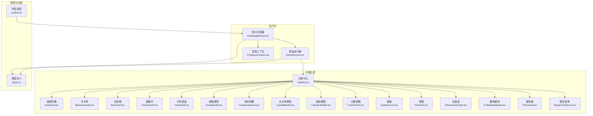
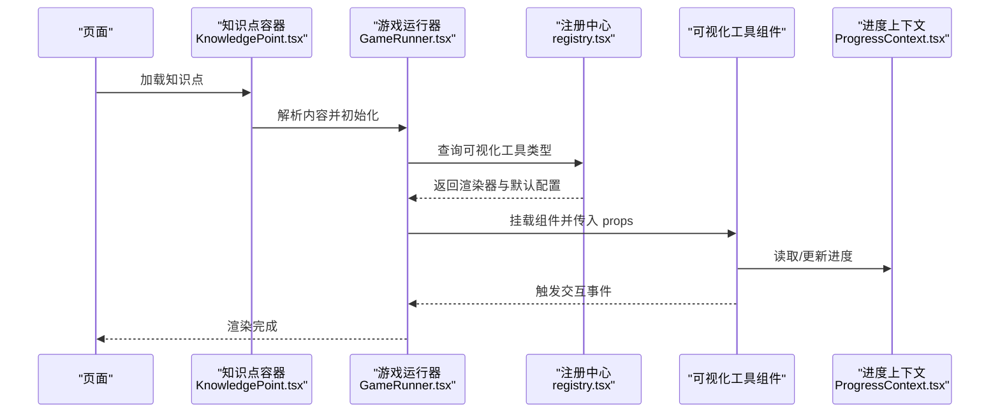
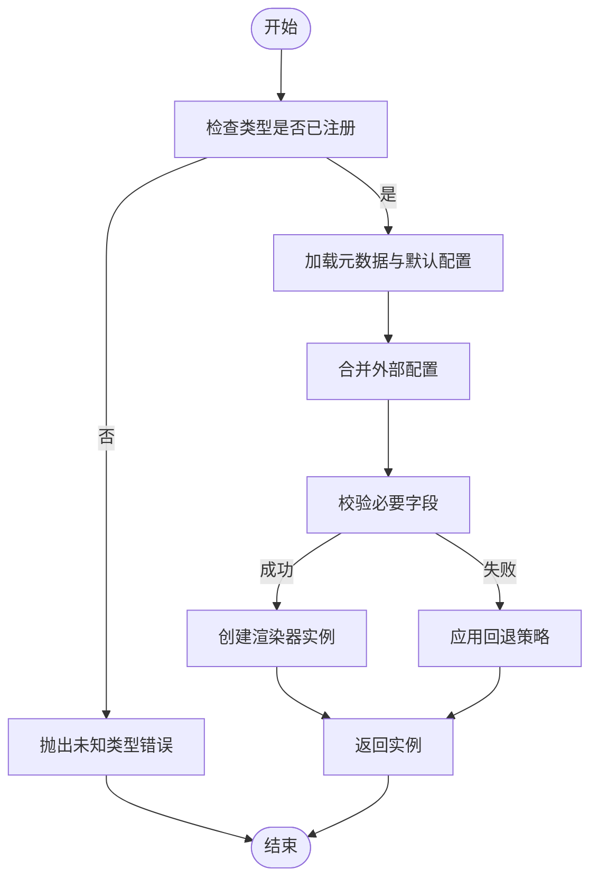
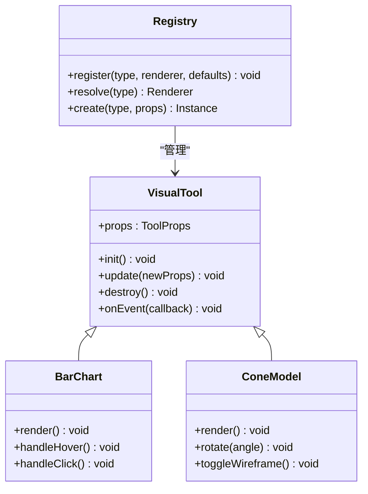
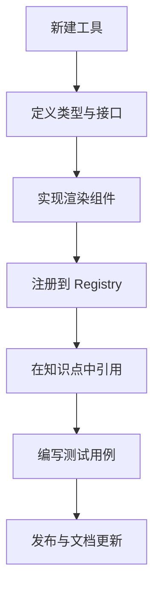
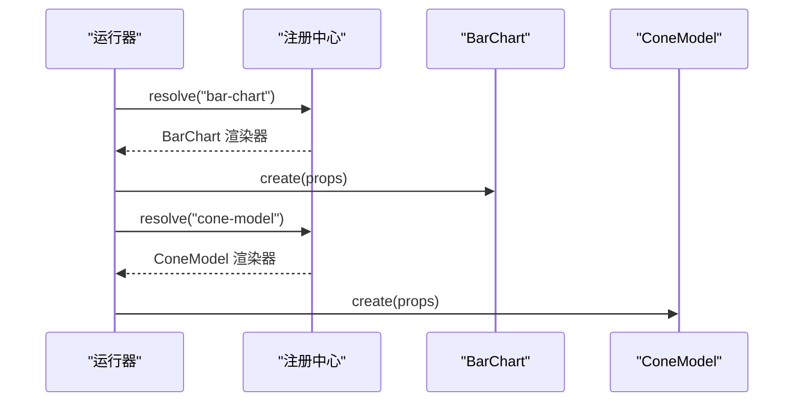
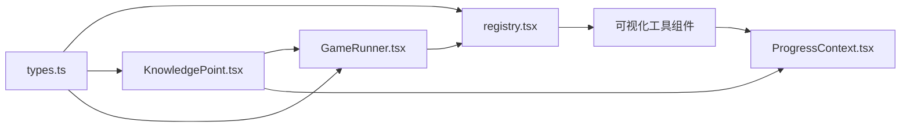

# 可视化工具开发

<cite>
**本文档引用的文件**
- [registry.tsx](file://src/visualizations/registry.tsx)
- [AreaGrid.tsx](file://src/visualizations/AreaGrid.tsx)
- [BalanceScale.tsx](file://src/visualizations/BalanceScale.tsx)
- [BarChart.tsx](file://src/visualizations/BarChart.tsx)
- [CircleUnroll.tsx](file://src/visualizations/CircleUnroll.tsx)
- [ClockDial.tsx](file://src/visualizations/ClockDial.tsx)
- [ConeModel.tsx](file://src/visualizations/ConeModel.tsx)
- [CoordinateGrid.tsx](file://src/visualizations/CoordinateGrid.tsx)
- [CuboidModel.tsx](file://src/visualizations/CuboidModel.tsx)
- [CylinderModel.tsx](file://src/visualizations/CylinderModel.tsx)
- [FractionPie.tsx](file://src/visualizations/FractionPie.tsx)
- [NumberLine.tsx](file://src/visualizations/NumberLine.tsx)
- [PieChart.tsx](file://src/visualizations/PieChart.tsx)
- [PlaceValueChart.tsx](file://src/visualizations/PlaceValueChart.tsx)
- [ProbabilityModel.tsx](file://src/visualizations/ProbabilityModel.tsx)
- [Protractor.tsx](file://src/visualizations/Protractor.tsx)
- [ShapeTransform.tsx](file://src/visualizations/ShapeTransform.tsx)
- [GameRunner.tsx](file://src/components/GameRunner.tsx)
- [KnowledgePoint.tsx](file://src/components/KnowledgePoint.tsx)
- [ProgressContext.tsx](file://src/context/ProgressContext.tsx)
- [types.ts](file://src/lib/types.ts)
- [content.ts](file://src/lib/content.ts)
- [package.json](file://package.json)
- [vite.config.ts](file://vite.config.ts)
</cite>

## 目录
1. [简介](#简介)
2. [项目结构](#项目结构)
3. [核心组件](#核心组件)
4. [架构总览](#架构总览)
5. [详细组件分析](#详细组件分析)
6. [依赖关系分析](#依赖关系分析)
7. [性能考虑](#性能考虑)
8. [故障排查指南](#故障排查指南)
9. [结论](#结论)
10. [附录](#附录)

## 简介
本指南面向 math-k6 项目的可视化工具开发者，系统阐述可视化工具的注册机制与 registry 系统、工具接口规范与生命周期管理，以及如何创建新的数学可视化工具（Canvas/SVG 绘制、动画效果、用户交互）。同时提供现有可视化工具的实现分析与最佳实践，包含性能优化技巧、跨浏览器兼容性注意事项，以及工具配置选项与样式定制方法。

## 项目结构
math-k6 采用“内容驱动 + 可视化插件化”的组织方式：
- 可视化实现位于 src/visualizations，每个知识点对应一个或多个可视化组件。
- 注册中心 registry.tsx 集中维护可视化工具的类型、渲染器与元信息。
- 游戏与知识点的运行由 components 下的 GameRunner 与 KnowledgePoint 等编排。
- 类型定义集中在 lib/types.ts，内容与进度在 lib/content.ts、context/ProgressContext.tsx 中管理。
- 构建与打包通过 Vite 配置。

图表来源
- [registry.tsx:1-200](file://src/visualizations/registry.tsx#L1-L200)
- [GameRunner.tsx:1-200](file://src/components/GameRunner.tsx#L1-L200)
- [KnowledgePoint.tsx:1-200](file://src/components/KnowledgePoint.tsx#L1-L200)
- [ProgressContext.tsx:1-200](file://src/context/ProgressContext.tsx#L1-L200)
- [types.ts:1-200](file://src/lib/types.ts#L1-L200)
- [content.ts:1-200](file://src/lib/content.ts#L1-L200)

章节来源
- [registry.tsx:1-200](file://src/visualizations/registry.tsx#L1-L200)
- [GameRunner.tsx:1-200](file://src/components/GameRunner.tsx#L1-L200)
- [KnowledgePoint.tsx:1-200](file://src/components/KnowledgePoint.tsx#L1-L200)
- [ProgressContext.tsx:1-200](file://src/context/ProgressContext.tsx#L1-L200)
- [types.ts:1-200](file://src/lib/types.ts#L1-L200)
- [content.ts:1-200](file://src/lib/content.ts#L1-L200)

## 核心组件
- 注册中心（Registry）
  - 职责：统一维护可视化工具的类型标识、渲染器组件、默认配置与元数据；提供按类型查找与实例化的能力。
  - 关键点：类型安全、可扩展性、默认回退策略、错误上报。
- 游戏运行器（GameRunner）
  - 职责：根据当前知识点与题目状态，选择并挂载对应的可视化工具；协调生命周期事件（初始化、更新、销毁）。
- 知识点容器（KnowledgePoint）
  - 职责：聚合知识点元数据、题目序列与可视化资源；负责将数据注入到可视化工具。
- 进度上下文（ProgressContext）
  - 职责：全局记录学习进度、得分与状态，供可视化工具读取或上报。
- 类型定义（types.ts）
  - 职责：定义可视化工具接口、配置项、事件回调与数据结构契约。

章节来源
- [registry.tsx:1-200](file://src/visualizations/registry.tsx#L1-L200)
- [GameRunner.tsx:1-200](file://src/components/GameRunner.tsx#L1-L200)
- [KnowledgePoint.tsx:1-200](file://src/components/KnowledgePoint.tsx#L1-L200)
- [ProgressContext.tsx:1-200](file://src/context/ProgressContext.tsx#L1-L200)
- [types.ts:1-200](file://src/lib/types.ts#L1-L200)

## 架构总览
可视化工具的调用链从页面进入知识点后，由 KnowledgePoint 解析内容，GameRunner 根据题型与知识点选择可视化工具类型，并通过 Registry 获取渲染器进行挂载。可视化工具内部基于 React 组件封装 Canvas/SVG 绘制逻辑，配合动画库与事件处理实现交互。

图表来源
- [KnowledgePoint.tsx:1-200](file://src/components/KnowledgePoint.tsx#L1-L200)
- [GameRunner.tsx:1-200](file://src/components/GameRunner.tsx#L1-L200)
- [registry.tsx:1-200](file://src/visualizations/registry.tsx#L1-L200)
- [ProgressContext.tsx:1-200](file://src/context/ProgressContext.tsx#L1-L200)

## 详细组件分析

### 注册中心（Registry）工作原理
- 设计要点
  - 以“类型键 -> 渲染器映射”为核心，支持动态扩展。
  - 提供默认配置合并、校验与回退机制。
  - 暴露统一的实例化 API，便于运行器按需创建。
- 关键流程
  - 注册：新增可视化工具时，向注册中心登记类型、组件与默认配置。
  - 查找：运行器根据类型键查找渲染器，若不存在则抛出明确错误。
  - 实例化：合并默认配置与外部 props，生成可渲染组件实例。
- 错误处理
  - 未注册类型：抛出“未知可视化工具类型”错误。
  - 配置缺失：使用默认值并记录警告。
  - 渲染异常：捕获并上报，避免影响主流程。

图表来源
- [registry.tsx:1-200](file://src/visualizations/registry.tsx#L1-L200)

章节来源
- [registry.tsx:1-200](file://src/visualizations/registry.tsx#L1-L200)

### 可视化工具接口规范与生命周期
- 接口规范
  - 输入 props：数据源、尺寸、主题、交互开关、回调函数等。
  - 输出事件：点击、拖拽、数值变化、完成状态等。
  - 生命周期：初始化（mount）、更新（update）、销毁（unmount）。
- 生命周期管理
  - 初始化：准备画布/SVG 元素、绑定事件、计算布局。
  - 更新：响应 props 变更，增量重绘，避免全量刷新。
  - 销毁：清理定时器、事件监听、释放内存。
- 示例工具族
  - 几何类：ConeModel、CuboidModel、CylinderModel、ShapeTransform、Protractor、CoordinateGrid
  - 统计类：BarChart、PieChart、FractionPie、ProbabilityModel、PlaceValueChart
  - 算术类：AreaGrid、BalanceScale、NumberLine、ClockDial、CircleUnroll

图表来源
- [types.ts:1-200](file://src/lib/types.ts#L1-L200)
- [BarChart.tsx:1-200](file://src/visualizations/BarChart.tsx#L1-L200)
- [ConeModel.tsx:1-200](file://src/visualizations/ConeModel.tsx#L1-L200)
- [registry.tsx:1-200](file://src/visualizations/registry.tsx#L1-L200)

章节来源
- [types.ts:1-200](file://src/lib/types.ts#L1-L200)
- [BarChart.tsx:1-200](file://src/visualizations/BarChart.tsx#L1-L200)
- [ConeModel.tsx:1-200](file://src/visualizations/ConeModel.tsx#L1-L200)
- [registry.tsx:1-200](file://src/visualizations/registry.tsx#L1-L200)

### 创建新的数学可视化工具（步骤与最佳实践）
- 步骤概览
  1. 定义工具类型与 props 接口（在 types.ts 中扩展）。
  2. 实现渲染组件（建议基于 SVG 或 Canvas），封装绘制与交互逻辑。
  3. 在 registry.tsx 中注册新工具，提供默认配置与元数据。
  4. 在知识点内容中引用该工具类型，确保数据格式匹配。
  5. 编写单元测试验证渲染结果与交互行为。
- 绘制与动画
  - SVG：适合矢量图形与简单动画，易于样式定制与无障碍访问。
  - Canvas：适合大量节点与高性能场景，需自行管理事件与重绘。
  - 动画：使用 requestAnimationFrame 或过渡库，避免阻塞 UI。
- 用户交互
  - 统一事件冒泡与阻止默认行为。
  - 提供可访问性标签与键盘导航支持。
  - 对触摸设备做适配（缩放、手势）。
- 配置与样式
  - 通过 props 传递主题色、字体、尺寸等。
  - 提供默认样式覆盖点，保证一致性。

章节来源
- [types.ts:1-200](file://src/lib/types.ts#L1-L200)
- [registry.tsx:1-200](file://src/visualizations/registry.tsx#L1-L200)
- [BarChart.tsx:1-200](file://src/visualizations/BarChart.tsx#L1-L200)
- [ConeModel.tsx:1-200](file://src/visualizations/ConeModel.tsx#L1-L200)

### 现有可视化工具实现分析（精选）
- 柱状图（BarChart）
  - 特点：数据驱动、支持悬停提示与点击反馈。
  - 优化：批量绘制、防抖事件、懒加载数据。
- 圆锥模型（ConeModel）
  - 特点：3D 投影展示、线框切换、旋转控制。
  - 优化：减少重算、缓存中间结果、按需更新。
- 分数饼图（FractionPie）
  - 特点：直观展示分数比例、动画过渡。
  - 优化：路径复用、颜色对比度校验。

图表来源
- [GameRunner.tsx:1-200](file://src/components/GameRunner.tsx#L1-L200)
- [registry.tsx:1-200](file://src/visualizations/registry.tsx#L1-L200)
- [BarChart.tsx:1-200](file://src/visualizations/BarChart.tsx#L1-L200)
- [ConeModel.tsx:1-200](file://src/visualizations/ConeModel.tsx#L1-L200)

章节来源
- [BarChart.tsx:1-200](file://src/visualizations/BarChart.tsx#L1-L200)
- [ConeModel.tsx:1-200](file://src/visualizations/ConeModel.tsx#L1-L200)

## 依赖关系分析
- 模块耦合
  - 运行器依赖注册中心与类型定义。
  - 可视化工具依赖类型定义与进度上下文。
  - 知识点容器依赖内容加载与运行器。
- 外部依赖
  - 构建工具：Vite。
  - 运行时：React、可能的动画/绘图库（如 d3、three.js 等，视具体实现而定）。

图表来源
- [types.ts:1-200](file://src/lib/types.ts#L1-L200)
- [registry.tsx:1-200](file://src/visualizations/registry.tsx#L1-L200)
- [GameRunner.tsx:1-200](file://src/components/GameRunner.tsx#L1-L200)
- [KnowledgePoint.tsx:1-200](file://src/components/KnowledgePoint.tsx#L1-L200)
- [ProgressContext.tsx:1-200](file://src/context/ProgressContext.tsx#L1-L200)

章节来源
- [types.ts:1-200](file://src/lib/types.ts#L1-L200)
- [registry.tsx:1-200](file://src/visualizations/registry.tsx#L1-L200)
- [GameRunner.tsx:1-200](file://src/components/GameRunner.tsx#L1-L200)
- [KnowledgePoint.tsx:1-200](file://src/components/KnowledgePoint.tsx#L1-L200)
- [ProgressContext.tsx:1-200](file://src/context/ProgressContext.tsx#L1-L200)

## 性能考虑
- 渲染优化
  - 使用 memoization 避免不必要的重渲染。
  - 对大数据集进行分页或抽样渲染。
  - 优先使用 SVG 的批量操作或 Canvas 的离屏渲染。
- 动画优化
  - 使用 requestAnimationFrame 与时间片分片。
  - 避免在主线程执行耗时计算。
- 内存管理
  - 及时移除事件监听与定时器。
  - 释放大对象引用，避免泄漏。
- 跨浏览器兼容
  - 检测特性支持（如 WebGL、Pointer Events）。
  - 提供降级方案（如 Canvas 回退到 SVG）。
  - 注意移动端触摸事件与缩放行为。

[本节为通用指导，不直接分析具体文件]

## 故障排查指南
- 常见问题
  - 未知可视化工具类型：检查注册是否正确、类型键是否一致。
  - 渲染空白：确认数据格式与 props 必填字段。
  - 交互无响应：检查事件绑定与阻止默认行为。
  - 动画卡顿：定位重绘热点，优化计算与渲染路径。
- 调试建议
  - 启用日志与错误上报。
  - 使用浏览器开发者工具的性能面板分析帧率。
  - 编写最小复现用例隔离问题。

章节来源
- [registry.tsx:1-200](file://src/visualizations/registry.tsx#L1-L200)
- [GameRunner.tsx:1-200](file://src/components/GameRunner.tsx#L1-L200)
- [types.ts:1-200](file://src/lib/types.ts#L1-L200)

## 结论
通过统一的注册中心与清晰的接口规范，math-k6 的可视化工具具备良好的扩展性与可维护性。遵循本文档的最佳实践，开发者可以快速创建高质量的数学可视化工具，并在性能与兼容性方面达到生产级标准。

[本节为总结性内容，不直接分析具体文件]

## 附录
- 工具配置选项
  - 基础：类型、标题、描述、版本。
  - 渲染：尺寸、主题色、字体、边距。
  - 交互：启用拖拽、点击、悬停提示。
  - 数据：数据源格式、字段映射、校验规则。
- 样式定制
  - 通过 CSS 变量或主题对象覆盖默认样式。
  - 提供深色模式与高对比度模式。
- 构建与部署
  - Vite 配置优化（代码分割、压缩、缓存）。
  - 静态资源管理与 CDN 加速。

章节来源
- [types.ts:1-200](file://src/lib/types.ts#L1-L200)
- [vite.config.ts:1-200](file://vite.config.ts#L1-L200)
- [package.json:1-200](file://package.json#L1-L200)