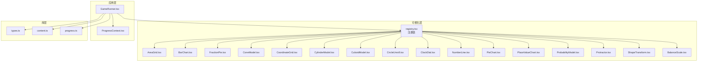
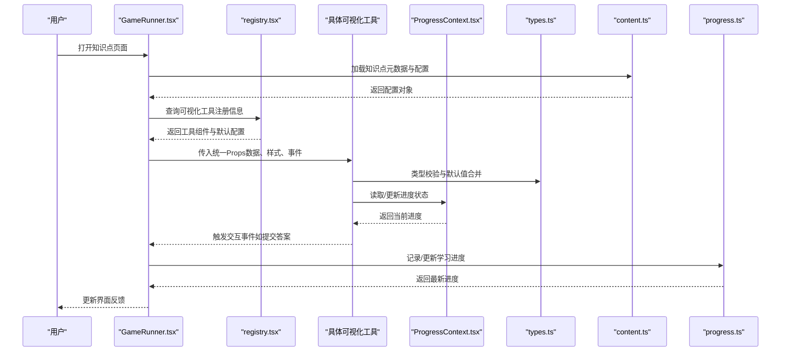
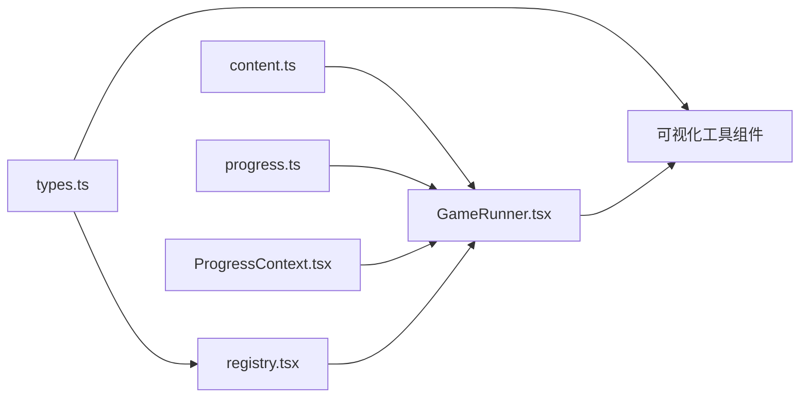

# 可视化工具接口规范

<cite>
**本文档引用的文件**   
- [registry.tsx](file://src/visualizations/registry.tsx)
- [AreaGrid.tsx](file://src/visualizations/AreaGrid.tsx)
- [BalanceScale.tsx](file://src/visualizations/BalanceScale.tsx)
- [BarChart.tsx](file://src/visualizations/BarChart.tsx)
- [CircleUnroll.tsx](file://src/visualizations/CircleUnroll.tsx)
- [ClockDial.tsx](file://src/visualizations/ClockDial.tsx)
- [ConeModel.tsx](file://src/visualizations/ConeModel.tsx)
- [CoordinateGrid.tsx](file://src/visualizations/CoordinateGrid.tsx)
- [CuboidModel.tsx](file://src/visualizations/CuboidModel.tsx)
- [CylinderModel.tsx](file://src/visualizations/CylinderModel.tsx)
- [FractionPie.tsx](file://src/visualizations/FractionPie.tsx)
- [NumberLine.tsx](file://src/visualizations/NumberLine.tsx)
- [PieChart.tsx](file://src/visualizations/PieChart.tsx)
- [PlaceValueChart.tsx](file://src/visualizations/PlaceValueChart.tsx)
- [ProbabilityModel.tsx](file://src/visualizations/ProbabilityModel.tsx)
- [Protractor.tsx](file://src/visualizations/Protractor.tsx)
- [ShapeTransform.tsx](file://src/visualizations/ShapeTransform.tsx)
- [GameRunner.tsx](file://src/components/GameRunner.tsx)
- [ProgressContext.tsx](file://src/context/ProgressContext.tsx)
- [types.ts](file://src/lib/types.ts)
- [content.ts](file://src/lib/content.ts)
- [progress.ts](file://src/lib/progress.ts)
</cite>

## 目录
1. [简介](#简介)
2. [项目结构](#项目结构)
3. [核心组件](#核心组件)
4. [架构总览](#架构总览)
5. [详细组件分析](#详细组件分析)
6. [依赖关系分析](#依赖关系分析)
7. [性能考虑](#性能考虑)
8. [故障排查指南](#故障排查指南)
9. [结论](#结论)
10. [附录](#附录)

## 简介
本规范为 math-k6 项目的“可视化工具”提供统一的接口标准，覆盖以下方面：
- 组件 Props 接口：定义所有可视化工具的输入属性、类型与默认值。
- 状态管理接口：统一的状态模型、同步策略与数据验证规则。
- 事件处理接口：交互事件的标准化回调契约。
- 生命周期方法：在可视化工具中的挂载、更新与卸载阶段的特殊处理约定。
- 数据绑定机制：props 传递、状态同步和数据校验流程。
- TypeScript 类型定义与接口继承关系：确保类型安全与可扩展性。
- 工具配置选项的标准格式与默认值处理：便于外部通过 JSON 或 API 动态装配。
- 不同复杂度工具的接口实现示例：从简单到复杂，逐步展示如何遵循统一接口。

目标读者包括可视化开发者、内容作者与平台集成人员，帮助快速构建可复用、可维护且类型安全的数学可视化工具。

## 项目结构
本项目采用按功能域组织的方式：
- visualizations：可视化工具集合，每个工具一个组件文件，并通过 registry 进行注册与导出。
- components：业务组件（如游戏运行器、布局等）。
- context：全局上下文（如进度上下文）。
- lib：通用库（类型定义、内容加载、进度管理等）。
- pages：页面级组件。
- content：知识点内容与元数据（game.json、meta.json、explain.md、derivation.json）。

图表来源
- [registry.tsx](file://src/visualizations/registry.tsx)
- [GameRunner.tsx](file://src/components/GameRunner.tsx)
- [ProgressContext.tsx](file://src/context/ProgressContext.tsx)
- [types.ts](file://src/lib/types.ts)
- [content.ts](file://src/lib/content.ts)
- [progress.ts](file://src/lib/progress.ts)

章节来源
- [registry.tsx](file://src/visualizations/registry.tsx)
- [GameRunner.tsx](file://src/components/GameRunner.tsx)
- [types.ts](file://src/lib/types.ts)

## 核心组件
- 可视化工具基类/契约：所有可视化工具应遵循统一的 Props 接口与事件回调契约，确保一致的数据绑定与交互行为。
- 注册表：集中管理可视化工具的命名、版本、默认配置与渲染入口，供上层按需加载。
- 运行器：负责根据知识点配置选择并渲染对应可视化工具，同时桥接进度上下文与数据源。

关键职责
- 统一 Props 接口：包含数据、样式、交互、国际化、无障碍等维度。
- 统一事件接口：标准化用户交互事件（点击、拖拽、输入变更等）的回调签名。
- 生命周期约定：在挂载时初始化资源、订阅事件；在更新时响应 props 变化；在卸载时清理资源。
- 数据绑定与验证：对 props 进行必要校验，保证渲染稳定性与安全性。

章节来源
- [registry.tsx](file://src/visualizations/registry.tsx)
- [GameRunner.tsx](file://src/components/GameRunner.tsx)
- [types.ts](file://src/lib/types.ts)

## 架构总览
整体架构分为三层：
- 可视化层：各可视化工具组件，遵循统一接口，由注册表管理。
- 应用层：运行器协调数据、上下文与工具实例，驱动渲染与交互。
- 库层：类型定义、内容加载与进度管理，为上层提供稳定能力。

图表来源
- [GameRunner.tsx](file://src/components/GameRunner.tsx)
- [registry.tsx](file://src/visualizations/registry.tsx)
- [ProgressContext.tsx](file://src/context/ProgressContext.tsx)
- [types.ts](file://src/lib/types.ts)
- [content.ts](file://src/lib/content.ts)
- [progress.ts](file://src/lib/progress.ts)

## 详细组件分析

### 可视化工具统一接口规范
- Props 接口建议字段
  - 数据相关：题目数据、选项、初始状态、正确答案、提示文本等。
  - 样式相关：主题、尺寸、颜色、动画开关等。
  - 交互相关：是否可编辑、禁用状态、键盘导航、无障碍标签等。
  - 国际化相关：语言代码、本地化文案映射。
  - 回调事件：onChange、onSubmit、onError、onComplete 等。
- 事件处理接口
  - 统一事件对象结构：包含时间戳、来源组件、事件类型、载荷数据。
  - 错误事件：包含错误码、错误消息、堆栈片段（开发环境）。
- 生命周期约定
  - 挂载阶段：初始化计算缓存、订阅外部事件、读取上下文状态。
  - 更新阶段：比较 props 差异，增量更新视图，避免重排重绘。
  - 卸载阶段：取消订阅、释放资源、清理定时器。
- 数据绑定与验证
  - 使用类型守卫与运行时校验，确保输入数据的合法性。
  - 对可选字段提供默认值，避免空引用异常。
  - 对数值范围、枚举值进行边界检查。

章节来源
- [types.ts](file://src/lib/types.ts)
- [registry.tsx](file://src/visualizations/registry.tsx)

### 注册表（Registry）
- 职责
  - 维护可视化工具的注册表：名称、组件、版本、默认配置、兼容性说明。
  - 提供查找与获取默认配置的 API。
  - 支持插件式扩展，允许新增工具无需修改核心逻辑。
- 设计要点
  - 使用强类型映射，确保工具名与组件类型的匹配。
  - 默认配置与运行时配置分离，便于覆盖与合并。
  - 错误处理：未找到工具时抛出明确错误，便于调试。

章节来源
- [registry.tsx](file://src/visualizations/registry.tsx)

### 运行器（GameRunner）
- 职责
  - 根据知识点配置选择可视化工具。
  - 组装统一 Props，注入上下文与数据源。
  - 监听工具事件，更新进度与界面状态。
- 设计要点
  - 懒加载工具组件，减少首屏体积。
  - 错误边界包裹，防止单个工具崩溃影响整体。
  - 与进度上下文解耦，便于测试与替换。

章节来源
- [GameRunner.tsx](file://src/components/GameRunner.tsx)
- [ProgressContext.tsx](file://src/context/ProgressContext.tsx)

### 典型可视化工具示例
- 简单工具（如 NumberLine）
  - Props：最小值、最大值、步长、选中值、只读模式。
  - 事件：选中值变更回调。
  - 生命周期：挂载时计算刻度，更新时仅重绘选中项。
- 中等工具（如 BarChart）
  - Props：数据集、坐标轴配置、颜色主题、动画开关。
  - 事件：点击柱体、悬停提示。
  - 生命周期：挂载时创建比例尺，更新时增量更新数据。
- 复杂工具（如 ConeModel / CylinderModel / CuboidModel）
  - Props：几何参数（半径、高、边长）、材质、视角、交互模式。
  - 事件：旋转、缩放、测量结果提交。
  - 生命周期：挂载时初始化渲染器与事件监听，更新时重新计算投影，卸载时销毁渲染器。

章节来源
- [NumberLine.tsx](file://src/visualizations/NumberLine.tsx)
- [BarChart.tsx](file://src/visualizations/BarChart.tsx)
- [ConeModel.tsx](file://src/visualizations/ConeModel.tsx)
- [CylinderModel.tsx](file://src/visualizations/CylinderModel.tsx)
- [CuboidModel.tsx](file://src/visualizations/CuboidModel.tsx)

### 类型定义与接口继承关系
- 基础类型
  - 可视化工具 Props 基类型：包含通用字段（id、key、className、style、ariaLabel 等）。
  - 事件回调类型：统一的事件对象结构与回调签名。
- 继承关系
  - 简单工具 Props 继承自基类型，添加领域特定字段。
  - 复杂工具 Props 进一步扩展几何参数与渲染配置。
- 默认值策略
  - 使用默认工厂函数生成默认 Props，避免重复逻辑。
  - 运行时合并用户配置与默认配置，确保一致性。

章节来源
- [types.ts](file://src/lib/types.ts)

### 数据绑定机制
- Props 传递
  - 运行器将知识点数据转换为统一 Props，传递给可视化工具。
  - 支持嵌套对象与数组，需进行深拷贝以避免副作用。
- 状态同步
  - 工具内部状态与外部 props 保持单向数据流，必要时通过回调上报变更。
  - 与进度上下文同步，确保跨组件状态一致。
- 数据验证
  - 在工具入口处进行类型与范围校验，失败时回退到安全默认值。
  - 开发环境下输出详细警告，生产环境静默降级。

章节来源
- [content.ts](file://src/lib/content.ts)
- [progress.ts](file://src/lib/progress.ts)
- [types.ts](file://src/lib/types.ts)

### 生命周期方法在可视化工具中的特殊处理
- componentDidMount（挂载）
  - 初始化计算缓存、创建第三方库实例、订阅事件。
  - 读取上下文状态，恢复上次会话进度。
- componentDidUpdate（更新）
  - 比较 props 差异，仅更新必要部分。
  - 处理主题切换、语言切换、数据刷新。
- componentWillUnmount（卸载）
  - 取消事件订阅、销毁渲染器、清理定时器。
  - 释放内存，避免泄漏。

章节来源
- [GameRunner.tsx](file://src/components/GameRunner.tsx)
- [ProgressContext.tsx](file://src/context/ProgressContext.tsx)

### 工具配置选项的标准格式与默认值处理
- 配置结构
  - 基础配置：工具名称、版本、描述、图标。
  - 渲染配置：尺寸、主题、动画、语言。
  - 数据配置：数据集、字段映射、校验规则。
  - 交互配置：事件映射、快捷键、无障碍设置。
- 默认值处理
  - 提供默认配置文件，运行时合并用户配置。
  - 支持环境变量与运行时参数覆盖。
  - 对缺失字段进行回退与警告。

章节来源
- [registry.tsx](file://src/visualizations/registry.tsx)
- [types.ts](file://src/lib/types.ts)

## 依赖关系分析
- 组件耦合
  - 可视化工具仅依赖 types 与 registry，保持低耦合。
  - 运行器依赖 registry、content、progress 与上下文，承担编排职责。
- 外部依赖
  - 第三方渲染库（如 Canvas/SVG/WebGL）应在工具内部封装，不泄露到上层。
  - 进度存储与内容加载通过 lib 层抽象，便于替换实现。
- 循环依赖
  - 避免工具之间直接相互引用，通过 registry 与事件总线通信。

图表来源
- [types.ts](file://src/lib/types.ts)
- [registry.tsx](file://src/visualizations/registry.tsx)
- [content.ts](file://src/lib/content.ts)
- [progress.ts](file://src/lib/progress.ts)
- [ProgressContext.tsx](file://src/context/ProgressContext.tsx)
- [GameRunner.tsx](file://src/components/GameRunner.tsx)

章节来源
- [types.ts](file://src/lib/types.ts)
- [registry.tsx](file://src/visualizations/registry.tsx)
- [content.ts](file://src/lib/content.ts)
- [progress.ts](file://src/lib/progress.ts)
- [ProgressContext.tsx](file://src/context/ProgressContext.tsx)
- [GameRunner.tsx](file://src/components/GameRunner.tsx)

## 性能考虑
- 渲染优化
  - 使用 React.memo 与 useMemo/useCallback 减少不必要的重渲染。
  - 大数据集采用虚拟滚动与分片渲染。
- 内存管理
  - 及时释放第三方库实例与事件订阅。
  - 避免闭包持有大对象引用。
- 网络与加载
  - 懒加载工具组件，按需引入。
  - 预取常用知识点配置，提升首屏速度。
- 可访问性与国际化
  - 提供 aria 属性与键盘导航，确保无障碍体验。
  - 延迟加载语言包，减少初始体积。

[本节为通用指导，不直接分析具体文件]

## 故障排查指南
- 常见问题
  - 工具未注册：检查 registry 中是否正确注册工具名称与组件。
  - Props 类型错误：确认 types 定义与实际传入数据一致。
  - 事件未触发：检查事件绑定与冒泡路径。
  - 状态不同步：确认单向数据流与回调上报是否正确。
- 调试技巧
  - 启用开发模式日志，查看警告与错误堆栈。
  - 使用浏览器开发者工具断点调试生命周期方法。
  - 隔离问题工具，逐步缩小范围。
- 错误处理
  - 捕获渲染异常，显示友好错误界面。
  - 记录错误上下文，便于远程诊断。

章节来源
- [registry.tsx](file://src/visualizations/registry.tsx)
- [types.ts](file://src/lib/types.ts)
- [GameRunner.tsx](file://src/components/GameRunner.tsx)

## 结论
本规范为 math-k6 的可视化工具提供了统一的接口标准，涵盖 Props、状态、事件、生命周期、数据绑定、类型定义与配置管理。通过注册表与运行器的协作，实现了工具的可插拔与可维护性。遵循本规范，开发者可以快速构建高质量、类型安全且易于扩展的数学可视化工具。

[本节为总结性内容，不直接分析具体文件]

## 附录
- 术语表
  - 可视化工具：用于以图形方式展示数学概念与数据的组件。
  - 注册表：集中管理可视化工具元数据与默认配置的模块。
  - 运行器：编排数据、上下文与工具实例，驱动渲染与交互。
- 参考实现
  - 简单工具：NumberLine、BarChart、FractionPie。
  - 复杂工具：ConeModel、CylinderModel、CuboidModel。
- 最佳实践
  - 始终进行数据验证与默认值处理。
  - 保持单向数据流，避免副作用。
  - 使用类型定义确保接口一致性。

[本节为补充信息，不直接分析具体文件]