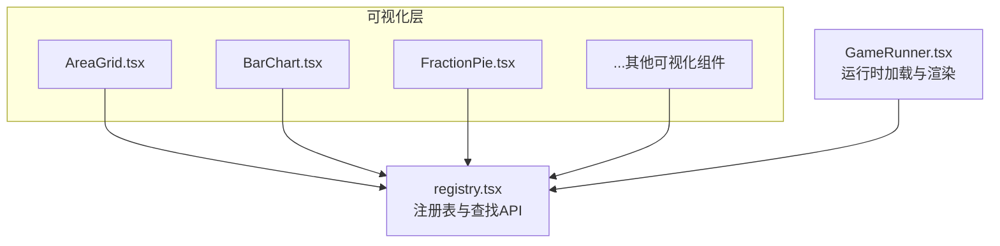
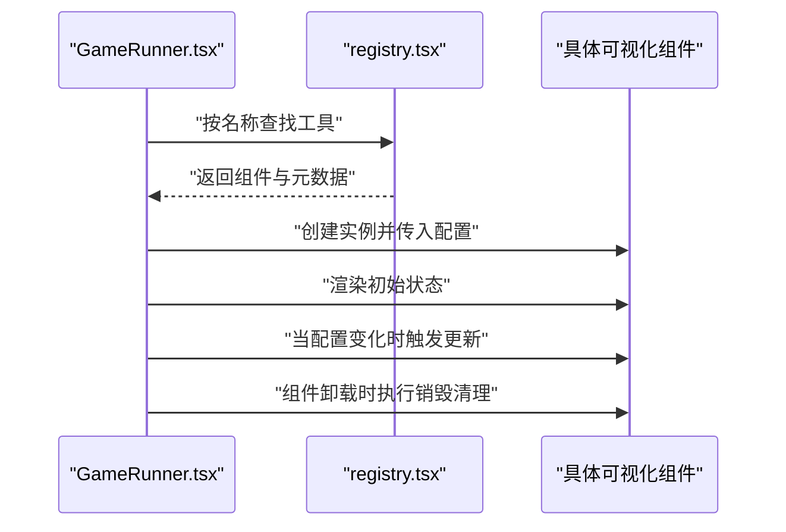
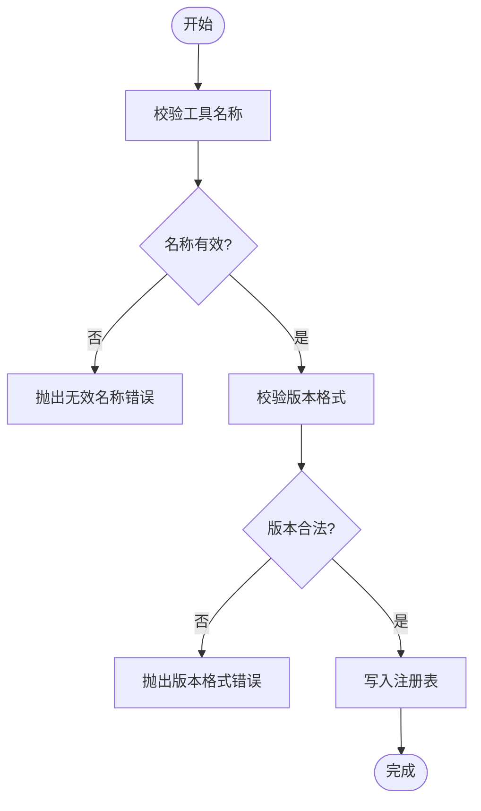
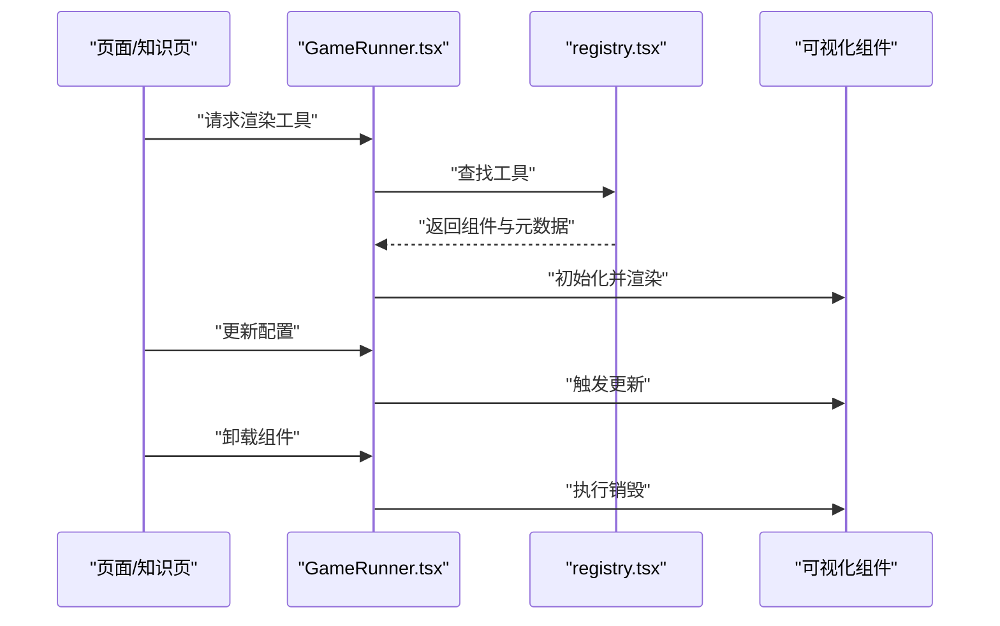
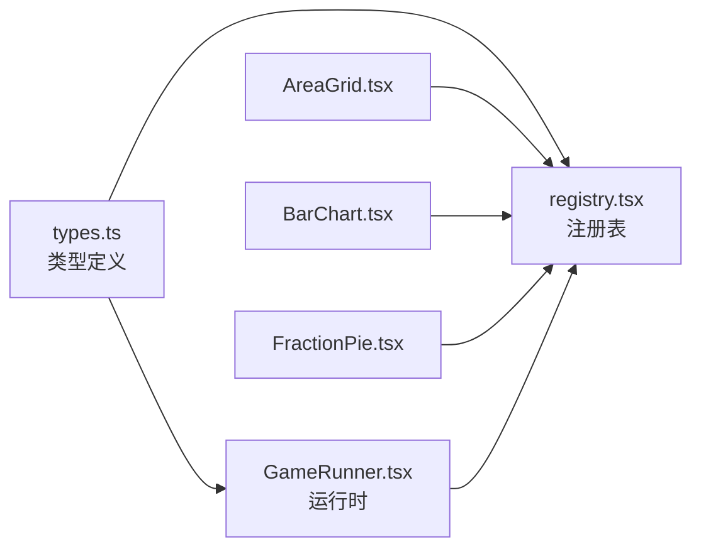

# 可视化工具注册系统

<cite>
**本文档引用的文件**   
- [registry.tsx](file://src/visualizations/registry.tsx)
- [AreaGrid.tsx](file://src/visualizations/AreaGrid.tsx)
- [BalanceScale.tsx](file://src/visualizations/BalanceScale.tsx)
- [BarChart.tsx](file://src/visualizations/BarChart.tsx)
- [CircleUnroll.tsx](file://src/visualizations/CircleUnroll.tsx)
- [ClockDial.tsx](file://src/visualizations/ClockDial.tsx)
- [ConeModel.tsx](file://src/visualizations/ConeModel.tsx)
- [CoordinateGrid.tsx](file://src/visualizations/CoordinateGrid.tsx)
- [CuboidModel.tsx](file://src/visualizations/CuboidModel.tsx)
- [CylinderModel.tsx](file://src/visualizations/CylinderModel.tsx)
- [FractionPie.tsx](file://src/visualizations/FractionPie.tsx)
- [NumberLine.tsx](file://src/visualizations/NumberLine.tsx)
- [PieChart.tsx](file://src/visualizations/PieChart.tsx)
- [PlaceValueChart.tsx](file://src/visualizations/PlaceValueChart.tsx)
- [ProbabilityModel.tsx](file://src/visualizations/ProbabilityModel.tsx)
- [Protractor.tsx](file://src/visualizations/Protractor.tsx)
- [ShapeTransform.tsx](file://src/visualizations/ShapeTransform.tsx)
- [GameRunner.tsx](file://src/components/GameRunner.tsx)
- [types.ts](file://src/lib/types.ts)
</cite>

## 目录
1. [简介](#简介)
2. [项目结构](#项目结构)
3. [核心组件](#核心组件)
4. [架构总览](#架构总览)
5. [详细组件分析](#详细组件分析)
6. [依赖关系分析](#依赖关系分析)
7. [性能考虑](#性能考虑)
8. [故障排查指南](#故障排查指南)
9. [结论](#结论)
10. [附录](#附录)

## 简介
本文件面向 math-k6 项目的“可视化工具注册系统”，聚焦于 src/visualizations/registry.tsx 中的工具注册机制。文档将系统性阐述：
- 工具注册表的数据结构设计
- 注册函数的实现逻辑与工具查找算法
- 如何正确注册新的可视化工具（名称约定、配置参数格式、版本管理）
- 工具生命周期管理（初始化、渲染、更新、销毁）
- 最佳实践与完整示例路径
- 错误处理机制与调试技巧

该注册系统为各可视化组件提供统一的发现与实例化能力，使游戏运行器与内容层能够以声明式方式加载并驱动可视化组件。

## 项目结构
- 可视化组件位于 src/visualizations，每个组件是一个独立的 React 组件，负责特定数学概念的可视化呈现。
- registry.tsx 集中维护可视化工具的注册表，并提供注册与查找接口。
- GameRunner.tsx 作为运行时入口，通过注册表按需获取并渲染对应可视化组件。
- types.ts 定义共享类型，确保注册表与组件间的数据契约一致。

图表来源
- [registry.tsx](file://src/visualizations/registry.tsx)
- [AreaGrid.tsx](file://src/visualizations/AreaGrid.tsx)
- [BarChart.tsx](file://src/visualizations/BarChart.tsx)
- [FractionPie.tsx](file://src/visualizations/FractionPie.tsx)
- [GameRunner.tsx](file://src/components/GameRunner.tsx)

章节来源
- [registry.tsx](file://src/visualizations/registry.tsx)
- [GameRunner.tsx](file://src/components/GameRunner.tsx)
- [types.ts](file://src/lib/types.ts)

## 核心组件
- 注册表（Registry）
  - 职责：维护可视化工具的名称到组件映射；提供注册与查找方法；支持版本管理与兼容性校验。
  - 数据结构：键为工具名称（字符串），值为包含组件引用、元数据（如版本、描述、作者）和可选配置模式的对象。
  - 查找算法：按名称精确匹配；若存在多个版本，优先选择满足当前环境约束的最高兼容版本。

- 运行时（GameRunner）
  - 职责：根据内容配置请求指定可视化工具；调用注册表进行查找与实例化；管理组件生命周期（挂载、更新、卸载）。
  - 交互流程：解析配置 -> 查询注册表 -> 创建实例 -> 渲染 -> 监听状态变化 -> 触发更新或销毁。

章节来源
- [registry.tsx](file://src/visualizations/registry.tsx)
- [GameRunner.tsx](file://src/components/GameRunner.tsx)
- [types.ts](file://src/lib/types.ts)

## 架构总览
注册系统与运行时的协作关系如下：

图表来源
- [GameRunner.tsx](file://src/components/GameRunner.tsx)
- [registry.tsx](file://src/visualizations/registry.tsx)

## 详细组件分析

### 注册表（registry.tsx）分析
- 数据结构
  - 工具条目：包含组件引用、版本、描述、作者、配置模式等字段。
  - 注册表容器：以名称为键的对象集合，便于 O(1) 查找。
- 注册函数
  - 输入：工具名称、组件、元数据、可选配置模式。
  - 行为：校验名称唯一性与版本合法性；写入注册表；记录日志以便调试。
- 查找算法
  - 精确匹配名称；若存在多版本，依据语义化版本比较选择最高兼容版本。
  - 失败时抛出明确错误信息，便于上层捕获与降级。

图表来源
- [registry.tsx](file://src/visualizations/registry.tsx)

章节来源
- [registry.tsx](file://src/visualizations/registry.tsx)

### 可视化组件（示例）
以下组件均遵循统一的生命周期约定，供注册表与运行时管理：
- AreaGrid.tsx
- BalanceScale.tsx
- BarChart.tsx
- CircleUnroll.tsx
- ClockDial.tsx
- ConeModel.tsx
- CoordinateGrid.tsx
- CuboidModel.tsx
- CylinderModel.tsx
- FractionPie.tsx
- NumberLine.tsx
- PieChart.tsx
- PlaceValueChart.tsx
- ProbabilityModel.tsx
- Protractor.tsx
- ShapeTransform.tsx

组件生命周期约定
- 初始化：接收 props 配置，建立内部状态与资源。
- 渲染：根据配置生成可视化 DOM/SVG/Canvas。
- 更新：当 props 或外部状态变化时，增量更新视图。
- 销毁：释放定时器、事件监听、缓存等资源。

章节来源
- [AreaGrid.tsx](file://src/visualizations/AreaGrid.tsx)
- [BalanceScale.tsx](file://src/visualizations/BalanceScale.tsx)
- [BarChart.tsx](file://src/visualizations/BarChart.tsx)
- [CircleUnroll.tsx](file://src/visualizations/CircleUnroll.tsx)
- [ClockDial.tsx](file://src/visualizations/ClockDial.tsx)
- [ConeModel.tsx](file://src/visualizations/ConeModel.tsx)
- [CoordinateGrid.tsx](file://src/visualizations/CoordinateGrid.tsx)
- [CuboidModel.tsx](file://src/visualizations/CuboidModel.tsx)
- [CylinderModel.tsx](file://src/visualizations/CylinderModel.tsx)
- [FractionPie.tsx](file://src/visualizations/FractionPie.tsx)
- [NumberLine.tsx](file://src/visualizations/NumberLine.tsx)
- [PieChart.tsx](file://src/visualizations/PieChart.tsx)
- [PlaceValueChart.tsx](file://src/visualizations/PlaceValueChart.tsx)
- [ProbabilityModel.tsx](file://src/visualizations/ProbabilityModel.tsx)
- [Protractor.tsx](file://src/visualizations/Protractor.tsx)
- [ShapeTransform.tsx](file://src/visualizations/ShapeTransform.tsx)

### 运行时（GameRunner.tsx）分析
- 工具加载流程
  - 解析内容配置，提取目标工具名称与参数。
  - 调用注册表查找工具，失败则回退或报错。
  - 创建组件实例并挂载到容器节点。
- 生命周期管理
  - 初始化阶段：设置默认配置、绑定事件、预计算布局。
  - 渲染阶段：根据配置绘制图形或动画。
  - 更新阶段：响应 props 变化，最小化重绘。
  - 销毁阶段：清理副作用，避免内存泄漏。

图表来源
- [GameRunner.tsx](file://src/components/GameRunner.tsx)
- [registry.tsx](file://src/visualizations/registry.tsx)

章节来源
- [GameRunner.tsx](file://src/components/GameRunner.tsx)

## 依赖关系分析
- 组件对注册表的依赖：所有可视化组件在模块加载时向注册表注册自身。
- 运行时对注册表的依赖：GameRunner 仅通过注册表获取组件，不直接耦合具体组件实现。
- 类型契约：types.ts 定义了工具元数据与配置的通用结构，保证一致性。

图表来源
- [types.ts](file://src/lib/types.ts)
- [registry.tsx](file://src/visualizations/registry.tsx)
- [GameRunner.tsx](file://src/components/GameRunner.tsx)
- [AreaGrid.tsx](file://src/visualizations/AreaGrid.tsx)
- [BarChart.tsx](file://src/visualizations/BarChart.tsx)
- [FractionPie.tsx](file://src/visualizations/FractionPie.tsx)

章节来源
- [types.ts](file://src/lib/types.ts)
- [registry.tsx](file://src/visualizations/registry.tsx)
- [GameRunner.tsx](file://src/components/GameRunner.tsx)

## 性能考虑
- 注册表查找复杂度：O(1)，基于哈希映射。
- 组件实例化成本：避免重复创建，必要时使用单例或缓存策略。
- 渲染优化：仅在必要属性变化时更新；批量更新减少重排重绘。
- 资源管理：及时释放定时器、事件监听、WebGL/Canvas 上下文，防止内存泄漏。

[本节为通用指导，无需代码来源]

## 故障排查指南
- 常见问题
  - 工具未找到：检查名称是否拼写正确、是否已注册、版本是否兼容。
  - 配置错误：校验配置模式，确保必填字段齐全且类型正确。
  - 渲染异常：查看浏览器控制台错误堆栈，定位组件初始化或更新阶段的异常。
- 调试技巧
  - 在注册表中添加日志输出，记录注册与查找过程。
  - 在组件生命周期钩子中打印关键状态变化。
  - 使用浏览器开发者工具的“断点”与“网络面板”验证资源加载。
- 错误处理建议
  - 注册阶段：对非法名称与版本抛出明确错误，阻止污染注册表。
  - 查找阶段：找不到工具时返回可恢复的错误码，允许上层降级。
  - 运行阶段：捕获组件渲染异常，提供用户友好提示并记录诊断信息。

章节来源
- [registry.tsx](file://src/visualizations/registry.tsx)
- [GameRunner.tsx](file://src/components/GameRunner.tsx)

## 结论
注册系统将可视化工具的发现、实例化与生命周期管理解耦，提升了系统的可扩展性与可维护性。通过统一的名称约定、配置模式与版本管理，新增工具可以低门槛接入现有生态。运行时通过注册表按需加载组件，保障性能与稳定性。建议在开发新工具时严格遵循生命周期约定与错误处理规范，确保整体系统健壮。

[本节为总结性内容，无需代码来源]

## 附录

### 工具注册最佳实践清单
- 名称约定
  - 使用小写字母与连字符，避免冲突（例如：area-grid、bar-chart）。
  - 保持语义清晰，便于检索与维护。
- 配置参数格式
  - 定义清晰的配置模式，区分必填与可选字段。
  - 提供默认值与校验规则，提升鲁棒性。
- 版本管理
  - 采用语义化版本（主版本.次版本.修订号）。
  - 向后兼容变更应在次版本或修订版本中进行。
- 生命周期实现
  - 初始化：准备状态与资源。
  - 渲染：根据配置生成视图。
  - 更新：增量更新，避免全量重绘。
  - 销毁：释放所有副作用。
- 错误处理与调试
  - 注册与查找阶段抛出明确错误。
  - 组件内捕获异常并上报诊断信息。
  - 提供调试开关与日志级别控制。

章节来源
- [registry.tsx](file://src/visualizations/registry.tsx)
- [GameRunner.tsx](file://src/components/GameRunner.tsx)
- [types.ts](file://src/lib/types.ts)