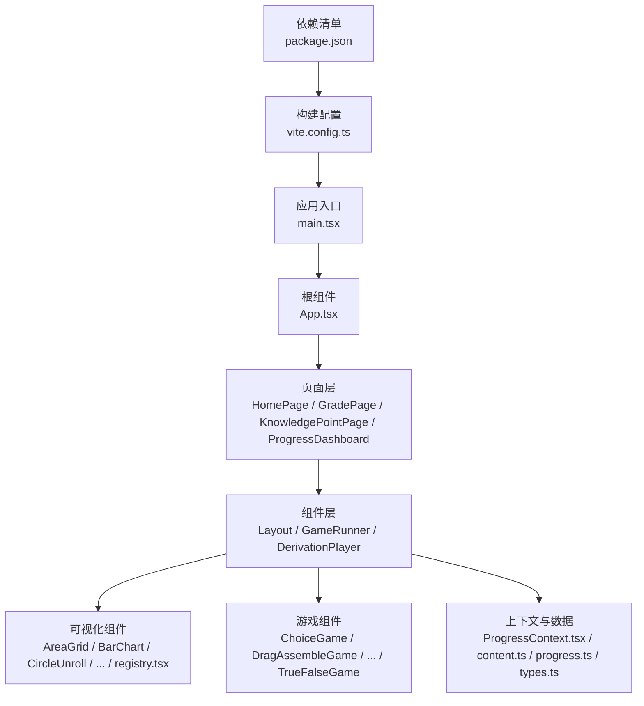
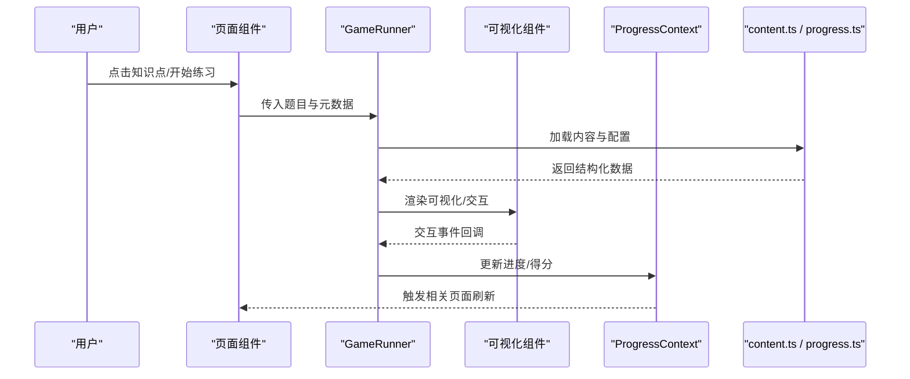
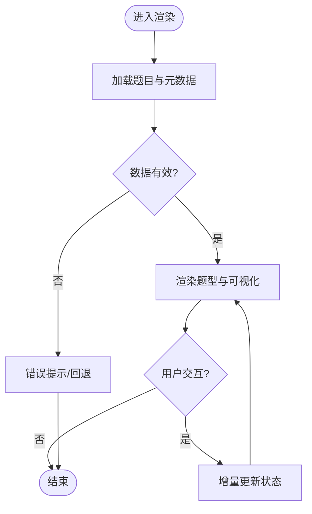
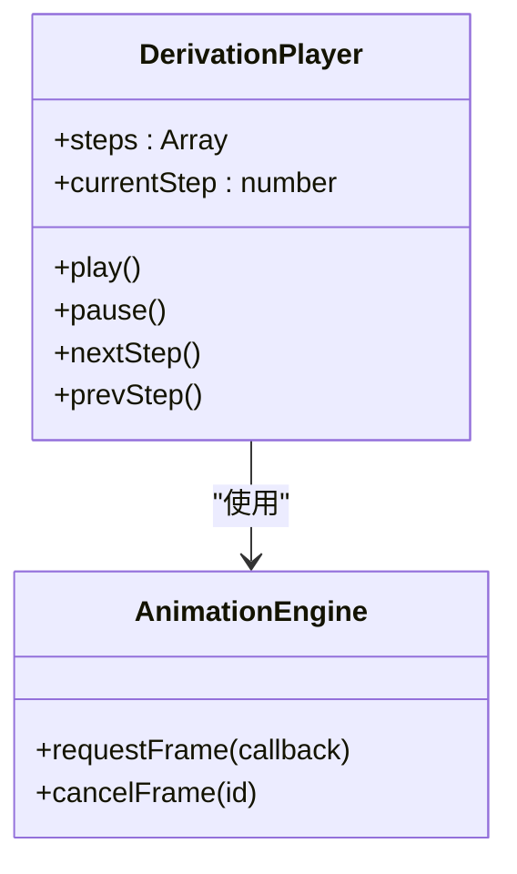
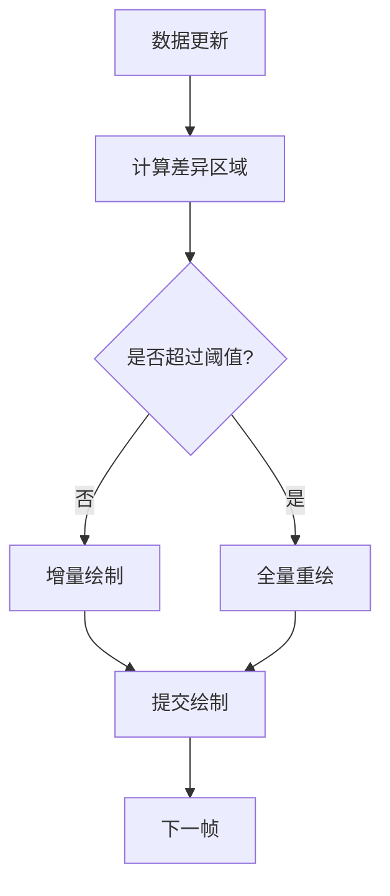
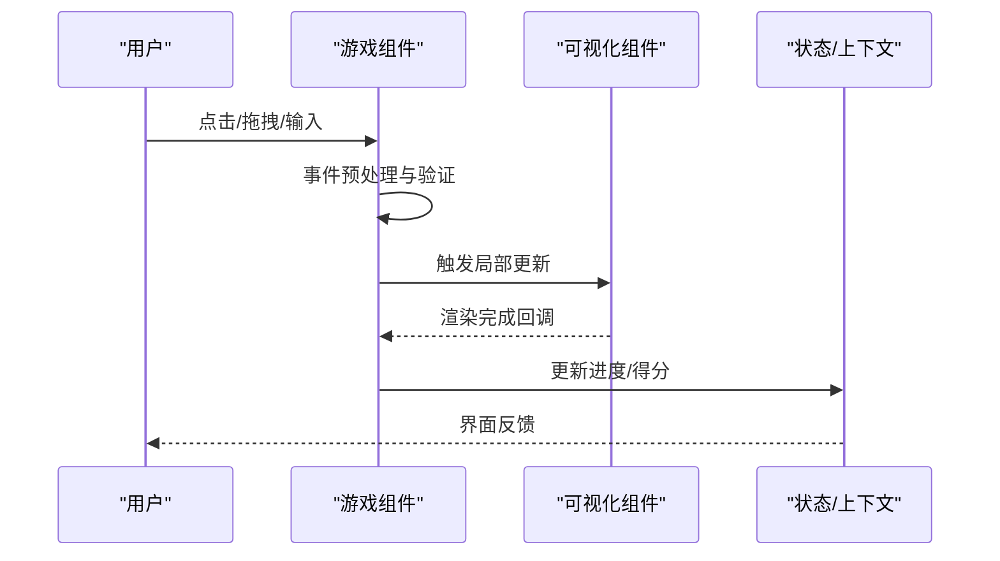
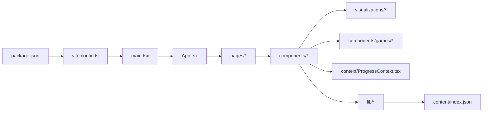

# 性能优化最佳实践

<cite>
**本文引用的文件**   
- [App.tsx](file://src/App.tsx)
- [main.tsx](file://src/main.tsx)
- [GameRunner.tsx](file://src/components/GameRunner.tsx)
- [DerivationPlayer.tsx](file://src/components/DerivationPlayer.tsx)
- [Layout.tsx](file://src/components/Layout.tsx)
- [ProgressContext.tsx](file://src/context/ProgressContext.tsx)
- [content.ts](file://src/lib/content.ts)
- [progress.ts](file://src/lib/progress.ts)
- [types.ts](file://src/lib/types.ts)
- [AreaGrid.tsx](file://src/visualizations/AreaGrid.tsx)
- [BalanceScale.tsx](file://src/visualizations/BalanceScale.tsx)
- [BarChart.tsx](file://src/visualizations/BarChart.tsx)
- [CircleUnroll.tsx](file://src/visualizations/CircleUnroll.tsx)
- [ClockDial.tsx](file://src/visualizations/ClockDial.tsx)
- [ConeModel.tsx](file://src/visualizations/ConeModel.tsx)
- [CoordinateGrid.tsx](file://src/visualizations/CoordinateGrid.tsx)
- [CuboidModel.tsx](file://src/visualizations/CuboidModel.tsx)
- [CylinderModel.tsx](file://src/visualizations/CylinderModel.tsx)
- [FractionPie.tsx](file://src/visualizations/FractionPie.tsx)
- [NumberLine.tsx](file://src/visualizations/NumberLine.tsx)
- [PieChart.tsx](file://src/visualizations/PieChart.tsx)
- [PlaceValueChart.tsx](file://src/visualizations/PlaceValueChart.tsx)
- [ProbabilityModel.tsx](file://src/visualizations/ProbabilityModel.tsx)
- [Protractor.tsx](file://src/visualizations/Protractor.tsx)
- [ShapeTransform.tsx](file://src/visualizations/ShapeTransform.tsx)
- [registry.tsx](file://src/visualizations/registry.tsx)
- [ChoiceGame.tsx](file://src/components/games/ChoiceGame.tsx)
- [DragAssembleGame.tsx](file://src/components/games/DragAssembleGame.tsx)
- [DragMatchGame.tsx](file://src/components/games/DragMatchGame.tsx)
- [FillBlankGame.tsx](file://src/components/games/FillBlankGame.tsx)
- [TimedChallengeGame.tsx](file://src/components/games/TimedChallengeGame.tsx)
- [TimelineGame.tsx](file://src/components/games/TimelineGame.tsx)
- [TrueFalseGame.tsx](file://src/components/games/TrueFalseGame.tsx)
- [HomePage.tsx](file://src/pages/HomePage.tsx)
- [GradePage.tsx](file://src/pages/GradePage.tsx)
- [KnowledgePointPage.tsx](file://src/pages/KnowledgePointPage.tsx)
- [ProgressDashboard.tsx](file://src/pages/ProgressDashboard.tsx)
- [index.json](file://src/content/index.json)
- [package.json](file://package.json)
- [vite.config.ts](file://vite.config.ts)
</cite>

## 目录
1. [简介](#简介)
2. [项目结构](#项目结构)
3. [核心组件](#核心组件)
4. [架构总览](#架构总览)
5. [详细组件分析](#详细组件分析)
6. [依赖关系分析](#依赖关系分析)
7. [性能考量](#性能考量)
8. [故障排查指南](#故障排查指南)
9. [结论](#结论)
10. [附录](#附录)

## 简介
本指南面向 math-k6 项目的可视化与交互性能优化，聚焦 React 渲染优化、Canvas/SVG 渲染策略、内存管理、动画监控与优化、移动端优化以及性能测试与分析方法。文档基于仓库现有代码结构与模块职责，提供可落地的优化建议与实践路径，帮助在保持教学体验的同时提升帧率、降低卡顿与内存占用。

## 项目结构
项目采用按功能域划分的组织方式：
- src/components：游戏运行器、推导播放器、布局等通用 UI 组件
- src/visualizations：数学可视化组件（图表、几何模型、数轴、分数饼图等）
- src/components/games：具体题型实现（选择、拖拽、填空、计时挑战等）
- src/pages：页面路由与聚合视图
- src/context：全局状态上下文（学习进度）
- src/lib：内容加载、进度存储、类型定义等工具库
- public/index.html：入口 HTML
- vite.config.ts：构建与开发配置
- package.json：依赖与脚本

**图示来源** 
- [main.tsx](file://src/main.tsx)
- [App.tsx](file://src/App.tsx)
- [vite.config.ts](file://vite.config.ts)
- [package.json](file://package.json)

**章节来源**
- [main.tsx](file://src/main.tsx)
- [App.tsx](file://src/App.tsx)
- [vite.config.ts](file://vite.config.ts)
- [package.json](file://package.json)

## 核心组件
- GameRunner：负责加载并运行具体题型，协调数据源与可视化渲染，是性能优化的关键编排点
- DerivationPlayer：推导过程播放与步进控制，涉及动画与状态更新频率
- Layout：页面骨架与响应式布局，影响重排与重绘范围
- ProgressContext：学习进度上下文，频繁读写会影响渲染传播
- 可视化组件族：大量 SVG/Canvas 组件，需关注增量更新与批量绘制
- 游戏组件族：交互密集，事件处理与状态同步对帧率敏感

**章节来源**
- [GameRunner.tsx](file://src/components/GameRunner.tsx)
- [DerivationPlayer.tsx](file://src/components/DerivationPlayer.tsx)
- [Layout.tsx](file://src/components/Layout.tsx)
- [ProgressContext.tsx](file://src/context/ProgressContext.tsx)
- [registry.tsx](file://src/visualizations/registry.tsx)

## 架构总览
整体为“页面 → 组件 → 可视化/游戏”的单向数据流，结合上下文共享进度状态。构建层使用 Vite，运行时由 React 驱动渲染。

**图示来源** 
- [GameRunner.tsx](file://src/components/GameRunner.tsx)
- [ProgressContext.tsx](file://src/context/ProgressContext.tsx)
- [content.ts](file://src/lib/content.ts)
- [progress.ts](file://src/lib/progress.ts)

## 详细组件分析

### GameRunner 组件分析
- 职责：根据知识点元数据动态加载题型，管理生命周期与渲染调度
- 性能要点：
  - 避免在每次渲染时创建新对象或函数引用，必要时使用 useMemo/useCallback
  - 将重型计算（如题目生成、答案校验）移出渲染路径，使用 Web Worker 或 requestIdleCallback
  - 对子组件进行选择性渲染，减少无关重渲染
  - 对大数组/对象做不可变更新，避免深层拷贝

**图示来源** 
- [GameRunner.tsx](file://src/components/GameRunner.tsx)

**章节来源**
- [GameRunner.tsx](file://src/components/GameRunner.tsx)

### DerivationPlayer 组件分析
- 职责：播放推导步骤，控制时间轴与动画节奏
- 性能要点：
  - 使用 requestAnimationFrame 控制动画帧，避免阻塞主线程
  - 将每步推导结果缓存，避免重复计算
  - 通过 memo 包裹静态步骤节点，减少重渲染
  - 对高频状态变更进行节流/防抖

**图示来源** 
- [DerivationPlayer.tsx](file://src/components/DerivationPlayer.tsx)

**章节来源**
- [DerivationPlayer.tsx](file://src/components/DerivationPlayer.tsx)

### 可视化组件族（SVG/Canvas）
- 共同特征：大量图形绘制、频繁状态变化、需要精细控制重绘区域
- 优化策略：
  - 离屏渲染：将复杂场景先在离屏 Canvas/SVG 上合成，再一次性绘制到可视区域
  - 增量更新：仅重绘发生变化的图元，避免整图重绘
  - 批量重绘：合并多次绘制调用，减少浏览器合成开销
  - 分层绘制：背景、网格、标注分层，按需刷新
  - 矢量与栅格取舍：静态大图用位图缓存，动态小图用矢量

**图示来源** 
- [AreaGrid.tsx](file://src/visualizations/AreaGrid.tsx)
- [BarChart.tsx](file://src/visualizations/BarChart.tsx)
- [CircleUnroll.tsx](file://src/visualizations/CircleUnroll.tsx)
- [ClockDial.tsx](file://src/visualizations/ClockDial.tsx)
- [ConeModel.tsx](file://src/visualizations/ConeModel.tsx)
- [CoordinateGrid.tsx](file://src/visualizations/CoordinateGrid.tsx)
- [CuboidModel.tsx](file://src/visualizations/CuboidModel.tsx)
- [CylinderModel.tsx](file://src/visualizations/CylinderModel.tsx)
- [FractionPie.tsx](file://src/visualizations/FractionPie.tsx)
- [NumberLine.tsx](file://src/visualizations/NumberLine.tsx)
- [PieChart.tsx](file://src/visualizations/PieChart.tsx)
- [PlaceValueChart.tsx](file://src/visualizations/PlaceValueChart.tsx)
- [ProbabilityModel.tsx](file://src/visualizations/ProbabilityModel.tsx)
- [Protractor.tsx](file://src/visualizations/Protractor.tsx)
- [ShapeTransform.tsx](file://src/visualizations/ShapeTransform.tsx)

**章节来源**
- [registry.tsx](file://src/visualizations/registry.tsx)

### 游戏组件族（交互密集型）
- ChoiceGame、TrueFalseGame：选项切换与反馈，注意避免不必要的列表重渲染
- DragAssembleGame、DragMatchGame：拖拽交互，需优化事件监听与命中检测
- FillBlankGame：输入框组合，应使用受控与非受控混合策略，减少输入抖动
- TimedChallengeGame、TimelineGame：计时与时间线推进，需稳定帧率与延迟控制

**图示来源** 
- [ChoiceGame.tsx](file://src/components/games/ChoiceGame.tsx)
- [DragAssembleGame.tsx](file://src/components/games/DragAssembleGame.tsx)
- [DragMatchGame.tsx](file://src/components/games/DragMatchGame.tsx)
- [FillBlankGame.tsx](file://src/components/games/FillBlankGame.tsx)
- [TimedChallengeGame.tsx](file://src/components/games/TimedChallengeGame.tsx)
- [TimelineGame.tsx](file://src/components/games/TimelineGame.tsx)
- [TrueFalseGame.tsx](file://src/components/games/TrueFalseGame.tsx)

**章节来源**
- [ChoiceGame.tsx](file://src/components/games/ChoiceGame.tsx)
- [DragAssembleGame.tsx](file://src/components/games/DragAssembleGame.tsx)
- [DragMatchGame.tsx](file://src/components/games/DragMatchGame.tsx)
- [FillBlankGame.tsx](file://src/components/games/FillBlankGame.tsx)
- [TimedChallengeGame.tsx](file://src/components/games/TimedChallengeGame.tsx)
- [TimelineGame.tsx](file://src/components/games/TimelineGame.tsx)
- [TrueFalseGame.tsx](file://src/components/games/TrueFalseGame.tsx)

### 页面与上下文
- HomePage/GradePage/KnowledgePointPage/ProgressDashboard：聚合展示与导航，应避免在渲染中执行重型逻辑
- ProgressContext：集中管理学习进度，注意拆分状态、减少订阅范围，避免大范围重渲染

**章节来源**
- [HomePage.tsx](file://src/pages/HomePage.tsx)
- [GradePage.tsx](file://src/pages/GradePage.tsx)
- [KnowledgePointPage.tsx](file://src/pages/KnowledgePointPage.tsx)
- [ProgressDashboard.tsx](file://src/pages/ProgressDashboard.tsx)
- [ProgressContext.tsx](file://src/context/ProgressContext.tsx)

## 依赖关系分析
- 构建与依赖：Vite 作为构建工具，package.json 声明运行时与开发依赖
- 内容加载：content.ts 统一读取 index.json 与知识点资源
- 进度存储：progress.ts 封装本地持久化与查询接口
- 类型定义：types.ts 为各模块提供统一类型约束

**图示来源** 
- [package.json](file://package.json)
- [vite.config.ts](file://vite.config.ts)
- [main.tsx](file://src/main.tsx)
- [App.tsx](file://src/App.tsx)
- [content/index.json](file://src/content/index.json)

**章节来源**
- [package.json](file://package.json)
- [vite.config.ts](file://vite.config.ts)
- [content/index.json](file://src/content/index.json)

## 性能考量

### React 组件性能优化
- 合理使用 memo/useMemo/useCallback：
  - 对昂贵计算结果使用 useMemo 缓存
  - 对传递给子组件的函数使用 useCallback 稳定引用
  - 对纯展示组件使用 memo 避免不必要重渲染
- 拆分状态与组件边界：
  - 将频繁更新的状态下沉到最小作用域
  - 使用 Context 时配合 selector 模式，减少订阅范围
- 列表渲染优化：
  - 为列表项设置稳定的 key
  - 虚拟滚动适用于长列表（如题库预览）

**章节来源**
- [ProgressContext.tsx](file://src/context/ProgressContext.tsx)
- [GameRunner.tsx](file://src/components/GameRunner.tsx)
- [DerivationPlayer.tsx](file://src/components/DerivationPlayer.tsx)

### Canvas/SVG 渲染优化
- 离屏渲染：
  - 在离屏 Canvas/SVG 上完成复杂场景合成，再一次性绘制到可视区
- 增量更新：
  - 记录脏矩形或图元索引，仅重绘受影响区域
- 批量重绘：
  - 合并多步绘制，减少浏览器合成次数
- 分层绘制：
  - 背景、网格、标注分层，按需刷新
- 矢量与栅格取舍：
  - 静态大图缓存为位图，动态小图使用矢量

**章节来源**
- [registry.tsx](file://src/visualizations/registry.tsx)
- [BarChart.tsx](file://src/visualizations/BarChart.tsx)
- [CircleUnroll.tsx](file://src/visualizations/CircleUnroll.tsx)
- [CoordinateGrid.tsx](file://src/visualizations/CoordinateGrid.tsx)
- [CuboidModel.tsx](file://src/visualizations/CuboidModel.tsx)
- [CylinderModel.tsx](file://src/visualizations/CylinderModel.tsx)
- [FractionPie.tsx](file://src/visualizations/FractionPie.tsx)
- [NumberLine.tsx](file://src/visualizations/NumberLine.tsx)
- [PieChart.tsx](file://src/visualizations/PieChart.tsx)
- [PlaceValueChart.tsx](file://src/visualizations/PlaceValueChart.tsx)
- [ProbabilityModel.tsx](file://src/visualizations/ProbabilityModel.tsx)
- [Protractor.tsx](file://src/visualizations/Protractor.tsx)
- [ShapeTransform.tsx](file://src/visualizations/ShapeTransform.tsx)

### 内存管理最佳实践
- 事件监听器清理：
  - 在 useEffect 中注册监听，在清理函数中移除，防止泄漏
- 大对象缓存：
  - 使用 WeakMap/WeakRef 缓存大对象，避免强引用导致 GC 不回收
- 垃圾回收优化：
  - 及时释放不再使用的 DOM 引用与定时器
  - 避免闭包持有大对象引用

**章节来源**
- [ProgressContext.tsx](file://src/context/ProgressContext.tsx)
- [GameRunner.tsx](file://src/components/GameRunner.tsx)
- [DerivationPlayer.tsx](file://src/components/DerivationPlayer.tsx)

### 动画性能监控与优化
- 帧率控制：
  - 使用 requestAnimationFrame 驱动动画，避免 setInterval
  - 限制最大帧率，降低设备负载
- 资源预加载：
  - 提前加载常用图片与字体，减少首帧卡顿
- 动画节流：
  - 对高频事件（如拖拽）进行节流/防抖，降低更新频率

**章节来源**
- [DerivationPlayer.tsx](file://src/components/DerivationPlayer.tsx)
- [TimedChallengeGame.tsx](file://src/components/games/TimedChallengeGame.tsx)
- [TimelineGame.tsx](file://src/components/games/TimelineGame.tsx)

### 移动端性能优化
- 触摸事件优化：
  - 使用 passive 事件监听提升滚动性能
  - 合并多点触控事件，减少计算量
- 电池消耗控制：
  - 在非活跃标签页暂停动画与定时任务
  - 降低高刷动画频率，优先保证流畅度

**章节来源**
- [DragAssembleGame.tsx](file://src/components/games/DragAssembleGame.tsx)
- [DragMatchGame.tsx](file://src/components/games/DragMatchGame.tsx)
- [FillBlankGame.tsx](file://src/components/games/FillBlankGame.tsx)

### 性能测试与分析工具
- Chrome DevTools：
  - Performance 面板录制帧轨迹，识别长任务与掉帧
  - Memory 面板检查堆快照与分配趋势
- Lighthouse：
  - 评估性能指标（FCP、LCP、CLS、TBT）
- 自定义基准：
  - 针对关键路径编写微基准，对比优化前后耗时
- 埋点与监控：
  - 上报关键交互耗时与错误信息，辅助定位问题

[本节为通用指导，不直接分析具体文件]

## 故障排查指南
- 常见卡顿原因：
  - 渲染路径中存在重型计算
  - 事件监听未清理导致内存泄漏
  - 频繁的全量重绘
- 排查步骤：
  - 使用 Performance 面板定位长任务
  - 检查 useEffect 清理函数是否完整
  - 对可疑组件添加日志与计时
- 修复建议：
  - 拆分重型计算至 Web Worker
  - 使用增量更新与离屏渲染
  - 优化状态更新粒度与频率

**章节来源**
- [GameRunner.tsx](file://src/components/GameRunner.tsx)
- [DerivationPlayer.tsx](file://src/components/DerivationPlayer.tsx)
- [ProgressContext.tsx](file://src/context/ProgressContext.tsx)

## 结论
通过对 React 渲染路径、Canvas/SVG 绘制策略、内存管理与动画控制的系统性优化，math-k6 可在复杂可视化与高频交互场景下保持稳定帧率与低内存占用。建议以性能基线为起点，持续使用工具链监控与回归测试，确保优化效果长期有效。

## 附录
- 构建与依赖：参考 vite.config.ts 与 package.json，合理启用代码分割与压缩
- 内容加载：content.ts 与 index.json 的结构决定加载顺序与缓存策略
- 进度存储：progress.ts 的读写频率与数据结构影响序列化成本

**章节来源**
- [vite.config.ts](file://vite.config.ts)
- [package.json](file://package.json)
- [content.ts](file://src/lib/content.ts)
- [progress.ts](file://src/lib/progress.ts)
- [index.json](file://src/content/index.json)