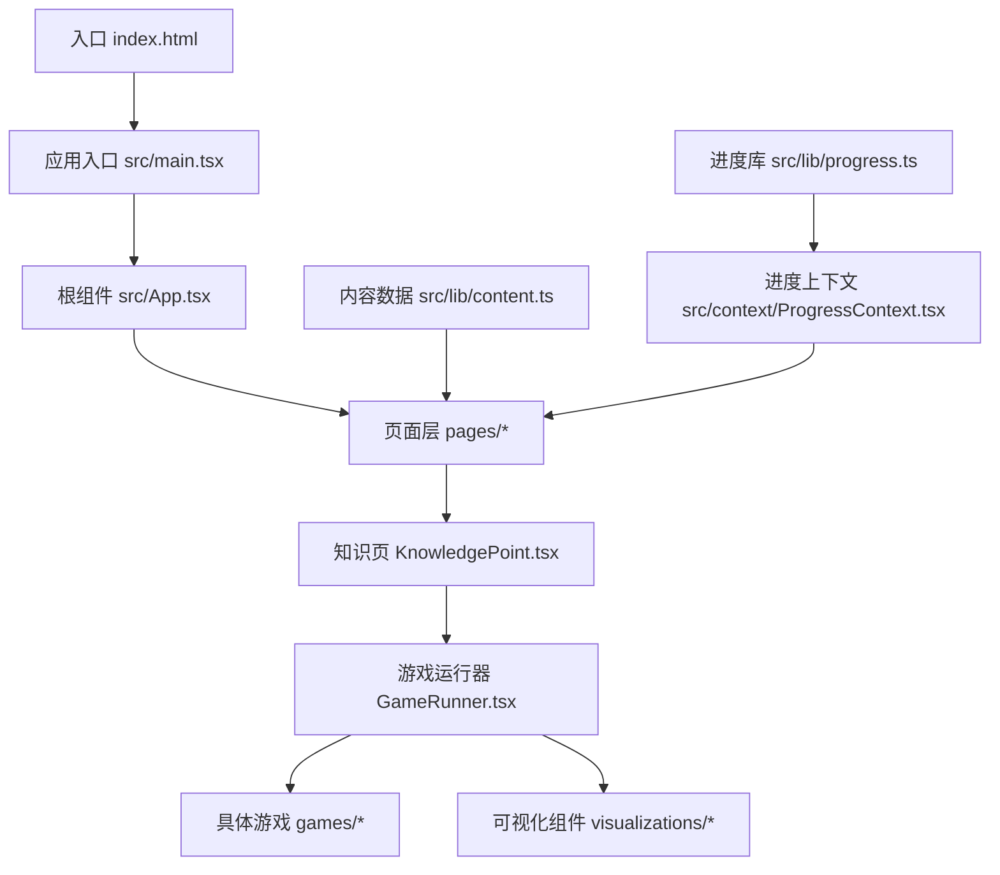
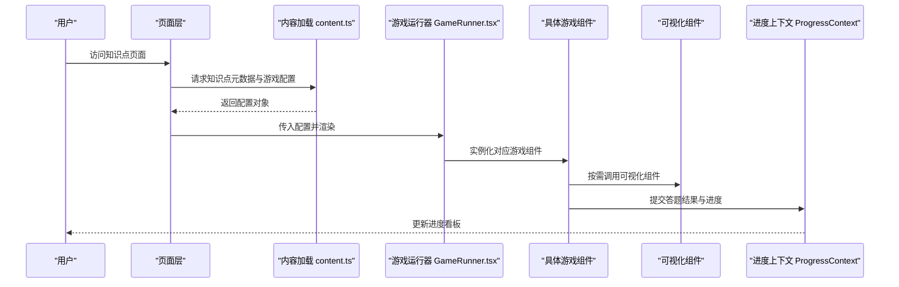
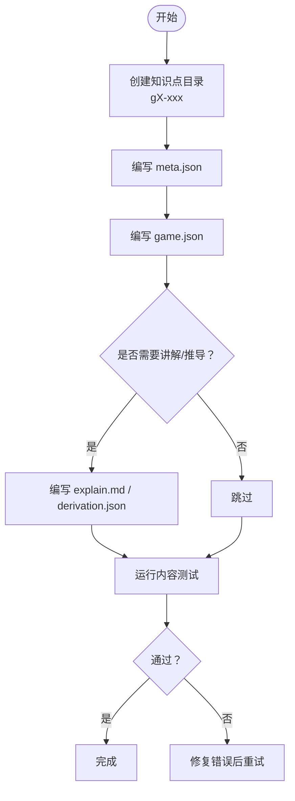
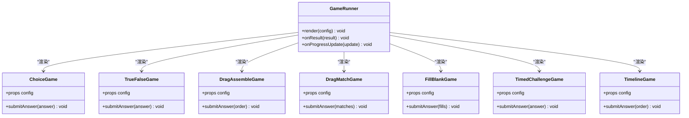
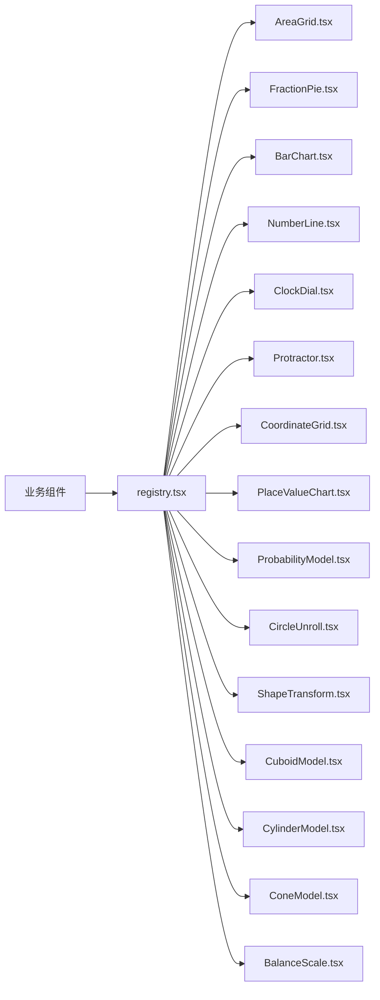
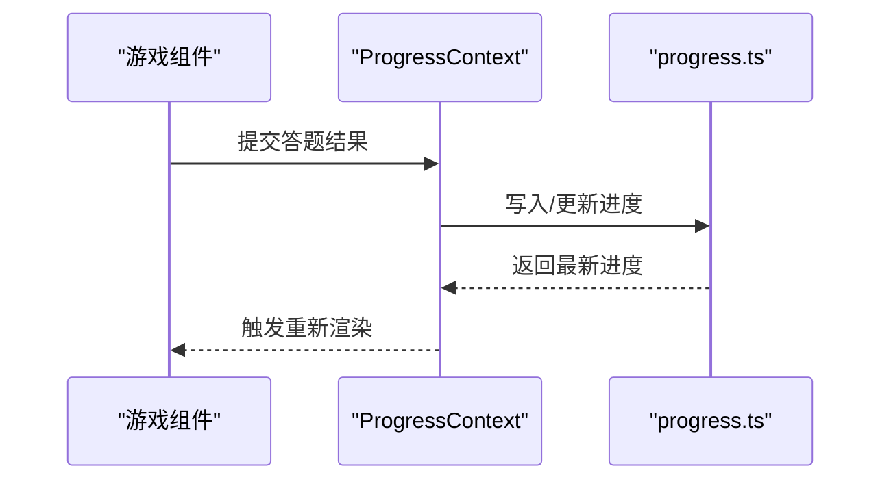
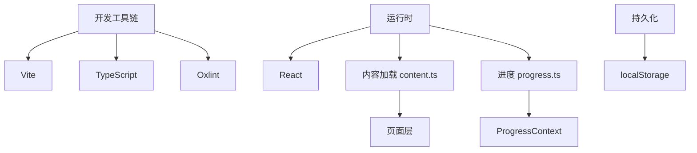

# 开发指南

<cite>
**本文档引用的文件**
- [package.json](file://package.json)
- [vite.config.ts](file://vite.config.ts)
- [tsconfig.json](file://tsconfig.json)
- [tsconfig.app.json](file://tsconfig.app.json)
- [tsconfig.node.json](file://tsconfig.node.json)
- [.oxlintrc.json](file://.oxlintrc.json)
- [README.md](file://README.md)
- [index.html](file://index.html)
- [src/main.tsx](file://src/main.tsx)
- [src/App.tsx](file://src/App.tsx)
- [src/lib/content.ts](file://src/lib/content.ts)
- [src/lib/progress.ts](file://src/lib/progress.ts)
- [src/lib/types.ts](file://src/lib/types.ts)
- [src/context/ProgressContext.tsx](file://src/context/ProgressContext.tsx)
- [src/components/GameRunner.tsx](file://src/components/GameRunner.tsx)
- [src/components/KnowledgePoint.tsx](file://src/components/KnowledgePoint.tsx)
- [src/components/Layout.tsx](file://src/components/Layout.tsx)
- [src/pages/HomePage.tsx](file://src/pages/HomePage.tsx)
- [src/pages/GradePage.tsx](file://src/pages/GradePage.tsx)
- [src/pages/KnowledgePointPage.tsx](file://src/pages/KnowledgePointPage.tsx)
- [src/pages/ProgressDashboard.tsx](file://src/pages/ProgressDashboard.tsx)
- [src/visualizations/AreaGrid.tsx](file://src/visualizations/AreaGrid.tsx)
- [src/visualizations/BalanceScale.tsx](file://src/visualizations/BalanceScale.tsx)
- [src/visualizations/BarChart.tsx](file://src/visualizations/BarChart.tsx)
- [src/visualizations/CircleUnroll.tsx](file://src/visualizations/CircleUnroll.tsx)
- [src/visualizations/ClockDial.tsx](file://src/visualizations/ClockDial.tsx)
- [src/visualizations/ConeModel.tsx](file://src/visualizations/ConeModel.tsx)
- [src/visualizations/CoordinateGrid.tsx](file://src/visualizations/CoordinateGrid.tsx)
- [src/visualizations/CuboidModel.tsx](file://src/visualizations/CuboidModel.tsx)
- [src/visualizations/CylinderModel.tsx](file://src/visualizations/CylinderModel.tsx)
- [src/visualizations/FractionPie.tsx](file://src/visualizations/FractionPie.tsx)
- [src/visualizations/NumberLine.tsx](file://src/visualizations/NumberLine.tsx)
- [src/visualizations/PieChart.tsx](file://src/visualizations/PieChart.tsx)
- [src/visualizations/PlaceValueChart.tsx](file://src/visualizations/PlaceValueChart.tsx)
- [src/visualizations/ProbabilityModel.tsx](file://src/visualizations/ProbabilityModel.tsx)
- [src/visualizations/Protractor.tsx](file://src/visualizations/Protractor.tsx)
- [src/visualizations/ShapeTransform.tsx](file://src/visualizations/ShapeTransform.tsx)
- [src/visualizations/registry.tsx](file://src/visualizations/registry.tsx)
- [src/components/games/ChoiceGame.tsx](file://src/components/games/ChoiceGame.tsx)
- [src/components/games/DragAssembleGame.tsx](file://src/components/games/DragAssembleGame.tsx)
- [src/components/games/DragMatchGame.tsx](file://src/components/games/DragMatchGame.tsx)
- [src/components/games/FillBlankGame.tsx](file://src/components/games/FillBlankGame.tsx)
- [src/components/games/TimedChallengeGame.tsx](file://src/components/games/TimedChallengeGame.tsx)
- [src/components/games/TimelineGame.tsx](file://src/components/games/TimelineGame.tsx)
- [src/components/games/TrueFalseGame.tsx](file://src/components/games/TrueFalseGame.tsx)
- [src/test/setup.ts](file://src/test/setup.ts)
- [src/test/content.test.ts](file://src/test/content.test.ts)
- [src/test/gameRunner.test.ts](file://src/test/gameRunner.test.ts)
- [src/test/progress.test.ts](file://src/test/progress.test.ts)
</cite>

## 目录
1. [简介](#简介)
2. [项目结构](#项目结构)
3. [核心组件](#核心组件)
4. [架构总览](#架构总览)
5. [详细组件分析](#详细组件分析)
6. [依赖分析](#依赖分析)
7. [性能考虑](#性能考虑)
8. [故障排查指南](#故障排查指南)
9. [结论](#结论)
10. [附录](#附录)

## 简介
本指南面向 math-k6 项目的开发者，覆盖从环境搭建、依赖安装、启动与构建，到 TypeScript 配置、代码质量检查、内容开发与测试、游戏与可视化组件开发规范、调试与性能优化、以及贡献与 Pull Request 流程的完整工作流。目标是帮助新手快速上手，同时为资深开发者提供最佳实践与排障参考。

## 项目结构
项目采用 Vite + React + TypeScript 的前端工程化方案，内容驱动（content-driven）架构：知识点通过 JSON 与 Markdown 描述，运行时由 GameRunner 统一加载并渲染对应游戏；可视化组件集中管理在 visualizations 目录，并通过注册表按需使用。

图表来源
- [index.html:1-20](file://index.html#L1-L20)
- [src/main.tsx:1-40](file://src/main.tsx#L1-L40)
- [src/App.tsx:1-60](file://src/App.tsx#L1-L60)
- [src/pages/HomePage.tsx:1-80](file://src/pages/HomePage.tsx#L1-L80)
- [src/pages/GradePage.tsx:1-80](file://src/pages/GradePage.tsx#L1-L80)
- [src/pages/KnowledgePointPage.tsx:1-100](file://src/pages/KnowledgePointPage.tsx#L1-L100)
- [src/components/KnowledgePoint.tsx:1-120](file://src/components/KnowledgePoint.tsx#L1-L120)
- [src/components/GameRunner.tsx:1-150](file://src/components/GameRunner.tsx#L1-L150)
- [src/lib/content.ts:1-120](file://src/lib/content.ts#L1-L120)
- [src/context/ProgressContext.tsx:1-120](file://src/context/ProgressContext.tsx#L1-L120)
- [src/lib/progress.ts:1-120](file://src/lib/progress.ts#L1-L120)

章节来源
- [README.md:1-100](file://README.md#L1-L100)
- [package.json:1-120](file://package.json#L1-L120)
- [vite.config.ts:1-80](file://vite.config.ts#L1-L80)
- [index.html:1-40](file://index.html#L1-L40)

## 核心组件
- 应用入口与路由
  - main.tsx：挂载 React 应用到 DOM，初始化全局上下文。
  - App.tsx：顶层布局与路由组织，集成进度上下文。
- 页面层
  - HomePage.tsx：首页导航与年级入口。
  - GradePage.tsx：按年级聚合知识点列表。
  - KnowledgePointPage.tsx：知识点详情与游戏入口。
  - ProgressDashboard.tsx：学习进度看板。
- 内容与进度
  - content.ts：加载与解析知识点元数据与游戏配置。
  - progress.ts：进度读写与持久化策略。
  - ProgressContext.tsx：全局进度状态与更新 API。
- 游戏与可视化
  - GameRunner.tsx：根据 game.json 动态加载并渲染游戏。
  - games/*：各题型实现（选择、判断、拖拽、填空、时间挑战、时间线等）。
  - visualizations/*：数学可视化组件（数轴、饼图、面积网格、量角器等），registry.tsx 负责注册与查找。

章节来源
- [src/main.tsx:1-40](file://src/main.tsx#L1-L40)
- [src/App.tsx:1-60](file://src/App.tsx#L1-L60)
- [src/pages/HomePage.tsx:1-80](file://src/pages/HomePage.tsx#L1-L80)
- [src/pages/GradePage.tsx:1-80](file://src/pages/GradePage.tsx#L1-L80)
- [src/pages/KnowledgePointPage.tsx:1-100](file://src/pages/KnowledgePointPage.tsx#L1-L100)
- [src/pages/ProgressDashboard.tsx:1-100](file://src/pages/ProgressDashboard.tsx#L1-L100)
- [src/lib/content.ts:1-120](file://src/lib/content.ts#L1-L120)
- [src/lib/progress.ts:1-120](file://src/lib/progress.ts#L1-L120)
- [src/context/ProgressContext.tsx:1-120](file://src/context/ProgressContext.tsx#L1-L120)
- [src/components/GameRunner.tsx:1-150](file://src/components/GameRunner.tsx#L1-L150)
- [src/components/KnowledgePoint.tsx:1-120](file://src/components/KnowledgePoint.tsx#L1-L120)
- [src/visualizations/registry.tsx:1-120](file://src/visualizations/registry.tsx#L1-L120)

## 架构总览
系统以“内容即配置”为核心：每个知识点目录包含 meta.json、game.json 与可选 explain.md/derivation.json。运行时由 content.ts 读取元数据，KnowledgePointPage 展示说明，GameRunner 根据配置渲染对应游戏组件；进度通过 ProgressContext 统一管理并持久化。

图表来源
- [src/pages/KnowledgePointPage.tsx:1-100](file://src/pages/KnowledgePointPage.tsx#L1-L100)
- [src/lib/content.ts:1-120](file://src/lib/content.ts#L1-L120)
- [src/components/GameRunner.tsx:1-150](file://src/components/GameRunner.tsx#L1-L150)
- [src/context/ProgressContext.tsx:1-120](file://src/context/ProgressContext.tsx#L1-L120)

## 详细组件分析

### 内容系统与知识点开发
- 知识点目录约定
  - meta.json：标题、年级、难度、标签等元信息。
  - game.json：游戏类型、参数、题目集、校验规则等。
  - explain.md / derivation.json：讲解文本或推导过程。
- 内容加载流程
  - content.ts 负责读取 index.json 与子目录元数据，合并成可用数据结构。
  - 页面层通过 content.ts 获取知识点列表与详情。
- 新增知识点步骤
  - 在 content/knowledge-points 下新建目录，命名遵循 gX-xxx。
  - 编写 meta.json、game.json，必要时补充 explain.md 或 derivation.json。
  - 确保 game.json 中 type 与 games/* 中的实现一致。
  - 运行内容测试验证结构与字段合法性。

图表来源
- [src/lib/content.ts:1-120](file://src/lib/content.ts#L1-L120)
- [src/test/content.test.ts:1-120](file://src/test/content.test.ts#L1-L120)

章节来源
- [src/lib/content.ts:1-120](file://src/lib/content.ts#L1-L120)
- [src/test/content.test.ts:1-120](file://src/test/content.test.ts#L1-L120)

### 游戏运行器与题型组件
- GameRunner.tsx
  - 根据 game.json.type 动态选择并渲染对应游戏组件。
  - 处理生命周期、状态同步与结果上报至进度上下文。
- 题型组件
  - ChoiceGame.tsx：选择题交互与答案校验。
  - TrueFalseGame.tsx：判断题逻辑。
  - DragAssembleGame.tsx / DragMatchGame.tsx：拖拽组装与匹配。
  - FillBlankGame.tsx：填空题输入与校验。
  - TimedChallengeGame.tsx：限时挑战计时与评分。
  - TimelineGame.tsx：时间线排序与顺序校验。
- 开发新题型建议
  - 在 games/* 新增组件，遵循统一的 props 接口与事件回调。
  - 在 GameRunner.tsx 中注册类型映射。
  - 编写单元测试覆盖关键路径。

图表来源
- [src/components/GameRunner.tsx:1-150](file://src/components/GameRunner.tsx#L1-L150)
- [src/components/games/ChoiceGame.tsx:1-120](file://src/components/games/ChoiceGame.tsx#L1-L120)
- [src/components/games/TrueFalseGame.tsx:1-120](file://src/components/games/TrueFalseGame.tsx#L1-L120)
- [src/components/games/DragAssembleGame.tsx:1-120](file://src/components/games/DragAssembleGame.tsx#L1-L120)
- [src/components/games/DragMatchGame.tsx:1-120](file://src/components/games/DragMatchGame.tsx#L1-L120)
- [src/components/games/FillBlankGame.tsx:1-120](file://src/components/games/FillBlankGame.tsx#L1-L120)
- [src/components/games/TimedChallengeGame.tsx:1-120](file://src/components/games/TimedChallengeGame.tsx#L1-L120)
- [src/components/games/TimelineGame.tsx:1-120](file://src/components/games/TimelineGame.tsx#L1-L120)

章节来源
- [src/components/GameRunner.tsx:1-150](file://src/components/GameRunner.tsx#L1-L150)
- [src/components/games/ChoiceGame.tsx:1-120](file://src/components/games/ChoiceGame.tsx#L1-L120)
- [src/components/games/TrueFalseGame.tsx:1-120](file://src/components/games/TrueFalseGame.tsx#L1-L120)
- [src/components/games/DragAssembleGame.tsx:1-120](file://src/components/games/DragAssembleGame.tsx#L1-L120)
- [src/components/games/DragMatchGame.tsx:1-120](file://src/components/games/DragMatchGame.tsx#L1-L120)
- [src/components/games/FillBlankGame.tsx:1-120](file://src/components/games/FillBlankGame.tsx#L1-L120)
- [src/components/games/TimedChallengeGame.tsx:1-120](file://src/components/games/TimedChallengeGame.tsx#L1-L120)
- [src/components/games/TimelineGame.tsx:1-120](file://src/components/games/TimelineGame.tsx#L1-L120)

### 可视化组件与注册表
- registry.tsx
  - 维护可视化组件名称到实现的映射，供 GameRunner 或业务组件按需查找。
- 常用组件
  - AreaGrid.tsx、FractionPie.tsx、BarChart.tsx、PieChart.tsx、NumberLine.tsx、ClockDial.tsx、Protractor.tsx、CoordinateGrid.tsx、PlaceValueChart.tsx、ProbabilityModel.tsx、CircleUnroll.tsx、ShapeTransform.tsx、CuboidModel.tsx、CylinderModel.tsx、ConeModel.tsx、BalanceScale.tsx。
- 开发规范
  - 组件需暴露稳定的 props 接口与必要的回调。
  - 复杂图形优先使用 SVG/Canvas，注意尺寸自适应与无障碍支持。
  - 在 registry.tsx 中注册新组件，避免硬编码依赖。

图表来源
- [src/visualizations/registry.tsx:1-120](file://src/visualizations/registry.tsx#L1-L120)
- [src/visualizations/AreaGrid.tsx:1-120](file://src/visualizations/AreaGrid.tsx#L1-L120)
- [src/visualizations/FractionPie.tsx:1-120](file://src/visualizations/FractionPie.tsx#L1-L120)
- [src/visualizations/BarChart.tsx:1-120](file://src/visualizations/BarChart.tsx#L1-L120)
- [src/visualizations/NumberLine.tsx:1-120](file://src/visualizations/NumberLine.tsx#L1-L120)
- [src/visualizations/ClockDial.tsx:1-120](file://src/visualizations/ClockDial.tsx#L1-L120)
- [src/visualizations/Protractor.tsx:1-120](file://src/visualizations/Protractor.tsx#L1-L120)
- [src/visualizations/CoordinateGrid.tsx:1-120](file://src/visualizations/CoordinateGrid.tsx#L1-L120)
- [src/visualizations/PlaceValueChart.tsx:1-120](file://src/visualizations/PlaceValueChart.tsx#L1-L120)
- [src/visualizations/ProbabilityModel.tsx:1-120](file://src/visualizations/ProbabilityModel.tsx#L1-L120)
- [src/visualizations/CircleUnroll.tsx:1-120](file://src/visualizations/CircleUnroll.tsx#L1-L120)
- [src/visualizations/ShapeTransform.tsx:1-120](file://src/visualizations/ShapeTransform.tsx#L1-L120)
- [src/visualizations/CuboidModel.tsx:1-120](file://src/visualizations/CuboidModel.tsx#L1-L120)
- [src/visualizations/CylinderModel.tsx:1-120](file://src/visualizations/CylinderModel.tsx#L1-L120)
- [src/visualizations/ConeModel.tsx:1-120](file://src/visualizations/ConeModel.tsx#L1-L120)
- [src/visualizations/BalanceScale.tsx:1-120](file://src/visualizations/BalanceScale.tsx#L1-L120)

章节来源
- [src/visualizations/registry.tsx:1-120](file://src/visualizations/registry.tsx#L1-L120)

### 进度管理与持久化
- ProgressContext.tsx
  - 提供全局进度状态与更新方法，供页面与游戏组件订阅与触发。
- progress.ts
  - 封装进度数据的读写、合并与持久化策略（如 localStorage）。
- 使用建议
  - 在游戏组件中仅提交原子化的结果变更，由上下文统一合并。
  - 避免在高频渲染路径中进行重计算或 IO。

图表来源
- [src/context/ProgressContext.tsx:1-120](file://src/context/ProgressContext.tsx#L1-L120)
- [src/lib/progress.ts:1-120](file://src/lib/progress.ts#L1-L120)

章节来源
- [src/context/ProgressContext.tsx:1-120](file://src/context/ProgressContext.tsx#L1-L120)
- [src/lib/progress.ts:1-120](file://src/lib/progress.ts#L1-L120)

## 依赖分析
- 构建与开发工具
  - Vite：快速开发与热重载。
  - TypeScript：类型安全与编译时检查。
  - Oxlint：代码质量检查。
- 运行时依赖
  - React 生态：组件化 UI 与状态管理。
  - 内容驱动：JSON/Markdown 作为配置源。
- 外部集成点
  - 浏览器存储（localStorage）用于进度持久化。
  - 可能的第三方可视化库（若引入需在 vite.config.ts 中配置）。

图表来源
- [package.json:1-120](file://package.json#L1-L120)
- [vite.config.ts:1-80](file://vite.config.ts#L1-L80)
- [tsconfig.json:1-60](file://tsconfig.json#L1-L60)
- [tsconfig.app.json:1-60](file://tsconfig.app.json#L1-L60)
- [tsconfig.node.json:1-60](file://tsconfig.node.json#L1-L60)
- [.oxlintrc.json:1-60](file://.oxlintrc.json#L1-L60)

章节来源
- [package.json:1-120](file://package.json#L1-L120)
- [vite.config.ts:1-80](file://vite.config.ts#L1-L80)
- [tsconfig.json:1-60](file://tsconfig.json#L1-L60)
- [tsconfig.app.json:1-60](file://tsconfig.app.json#L1-L60)
- [tsconfig.node.json:1-60](file://tsconfig.node.json#L1-L60)
- [.oxlintrc.json:1-60](file://.oxlintrc.json#L1-L60)

## 性能考虑
- 组件渲染优化
  - 使用 React.memo 包裹纯展示组件，减少不必要的重渲染。
  - 将稳定 props 提升或使用 useMemo/useCallback 避免重复计算。
- 内容加载优化
  - 对大体积内容进行懒加载与分页，避免首屏阻塞。
  - 缓存已加载的知识点元数据，减少重复请求。
- 可视化渲染优化
  - 大量元素场景优先使用 Canvas，避免过多 DOM 节点。
  - 按需渲染可视化组件，仅在需要时挂载。
- 进度更新优化
  - 批量合并进度更新，降低频繁 IO 开销。
  - 防抖/节流高频事件（如拖拽、计时器）。

[本节为通用指导，不直接分析具体文件]

## 故障排查指南
- 常见问题
  - 知识点未显示：检查 meta.json 与 index.json 结构是否一致，确认 content.ts 能正确解析。
  - 游戏无法渲染：核对 game.json.type 与 games/* 组件名映射，确保 GameRunner.tsx 中存在对应分支。
  - 进度不更新：检查 ProgressContext 是否正确订阅与派发，progress.ts 的持久化是否被拦截。
  - 构建失败：查看 tsconfig 与 vite.config.ts 的路径别名与插件配置是否冲突。
- 调试技巧
  - 使用浏览器开发者工具断点调试组件状态与事件流。
  - 在 content.ts 与 GameRunner.tsx 中添加日志输出，追踪数据流转。
  - 运行单元测试定位边界条件与异常路径。
- 测试命令
  - 运行测试套件：npm test
  - 监听模式：npm test -- --watch
  - 覆盖率报告：npm test -- --coverage

章节来源
- [src/test/setup.ts:1-60](file://src/test/setup.ts#L1-L60)
- [src/test/content.test.ts:1-120](file://src/test/content.test.ts#L1-L120)
- [src/test/gameRunner.test.ts:1-120](file://src/test/gameRunner.test.ts#L1-L120)
- [src/test/progress.test.ts:1-120](file://src/test/progress.test.ts#L1-L120)

## 结论
math-k6 以内容驱动与模块化组件为核心，结合 Vite 与 TypeScript 提供了高效的开发与构建体验。遵循本指南的内容开发规范、游戏与可视化组件最佳实践，以及调试与性能优化建议，可显著提升开发效率与产品质量。建议在贡献代码前完善测试与文档，确保变更的可维护性与可追溯性。

## 附录

### 开发环境搭建与依赖安装
- 前置要求
  - Node.js 版本满足 package.json 要求。
  - 包管理器：npm（或等效工具）。
- 安装依赖
  - 在项目根目录执行安装命令。
- 启动开发服务器
  - 执行开发脚本，启用热重载与调试。
- 构建生产版本
  - 执行构建脚本，生成静态资源。

章节来源
- [package.json:1-120](file://package.json#L1-L120)
- [vite.config.ts:1-80](file://vite.config.ts#L1-L80)

### TypeScript 配置与代码质量检查
- tsconfig.* 系列
  - tsconfig.json：项目级配置与路径别名。
  - tsconfig.app.json：应用编译选项。
  - tsconfig.node.json：Node 侧工具链配置。
- Oxlint 配置
  - .oxlintrc.json：定义规则与排除项。
- 运行检查
  - 执行 lint 命令，修复问题后再提交。

章节来源
- [tsconfig.json:1-60](file://tsconfig.json#L1-L60)
- [tsconfig.app.json:1-60](file://tsconfig.app.json#L1-L60)
- [tsconfig.node.json:1-60](file://tsconfig.node.json#L1-L60)
- [.oxlintrc.json:1-60](file://.oxlintrc.json#L1-L60)

### 内容开发流程与测试方法
- 新增知识点
  - 创建目录与元数据文件，编写游戏配置与讲解内容。
  - 确保字段与类型符合 lib/types.ts 的定义。
- 内容测试
  - 使用 content.test.ts 验证结构与字段合法性。
  - 针对边界情况补充用例，确保鲁棒性。

章节来源
- [src/lib/types.ts:1-120](file://src/lib/types.ts#L1-L120)
- [src/test/content.test.ts:1-120](file://src/test/content.test.ts#L1-L120)

### 游戏开发规范与组件最佳实践
- 统一接口
  - 所有游戏组件应接受一致的 props，并暴露 submitAnswer 等方法。
- 状态与副作用
  - 避免在渲染过程中进行副作用操作，使用 useEffect 管理副作用。
- 可访问性
  - 提供键盘导航与屏幕阅读器支持。
- 测试
  - 为关键交互路径编写单元测试，模拟用户行为与边界输入。

章节来源
- [src/components/GameRunner.tsx:1-150](file://src/components/GameRunner.tsx#L1-L150)
- [src/components/games/ChoiceGame.tsx:1-120](file://src/components/games/ChoiceGame.tsx#L1-L120)
- [src/components/games/DragAssembleGame.tsx:1-120](file://src/components/games/DragAssembleGame.tsx#L1-L120)
- [src/components/games/DragMatchGame.tsx:1-120](file://src/components/games/DragMatchGame.tsx#L1-L120)
- [src/components/games/FillBlankGame.tsx:1-120](file://src/components/games/FillBlankGame.tsx#L1-L120)
- [src/components/games/TimedChallengeGame.tsx:1-120](file://src/components/games/TimedChallengeGame.tsx#L1-L120)
- [src/components/games/TimelineGame.tsx:1-120](file://src/components/games/TimelineGame.tsx#L1-L120)
- [src/components/games/TrueFalseGame.tsx:1-120](file://src/components/games/TrueFalseGame.tsx#L1-L120)

### 可视化工具开发流程
- 组件设计
  - 明确输入输出，保持无状态或最小状态。
  - 使用 SVG/Canvas 绘制，注意缩放与响应式。
- 注册与查找
  - 在 registry.tsx 中注册组件，避免硬编码。
- 测试与示例
  - 为可视化组件编写单元测试与演示用例，确保在不同数据下的正确性。

章节来源
- [src/visualizations/registry.tsx:1-120](file://src/visualizations/registry.tsx#L1-L120)
- [src/visualizations/BarChart.tsx:1-120](file://src/visualizations/BarChart.tsx#L1-L120)
- [src/visualizations/FractionPie.tsx:1-120](file://src/visualizations/FractionPie.tsx#L1-L120)
- [src/visualizations/NumberLine.tsx:1-120](file://src/visualizations/NumberLine.tsx#L1-L120)

### 调试技巧与性能优化建议
- 调试
  - 使用浏览器控制台与 React DevTools 检查组件树与状态。
  - 在关键函数添加日志，追踪数据流与事件触发。
- 性能
  - 减少重渲染，使用 memoization 与惰性加载。
  - 优化大列表与复杂图形渲染，避免主线程阻塞。

[本节为通用指导，不直接分析具体文件]

### 贡献代码与 Pull Request 流程
- 分支策略
  - 基于主干创建功能分支，提交前保持分支整洁。
- 提交规范
  - 使用清晰的提交信息，描述变更目的与影响范围。
- 代码审查
  - 提交 PR 前运行测试与 lint，确保通过。
  - 邀请团队成员审查，解决反馈后合并。
- 发布
  - 合并后执行构建与部署脚本，验证产物可用性。

[本节为通用指导，不直接分析具体文件]