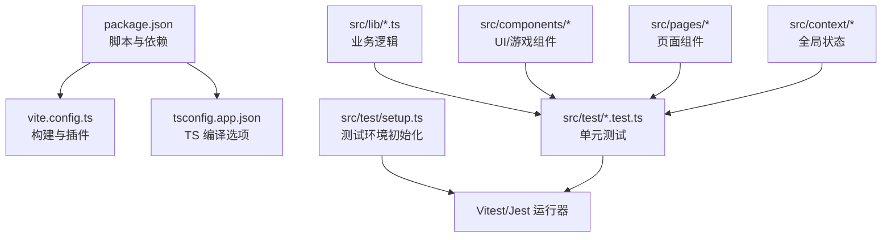
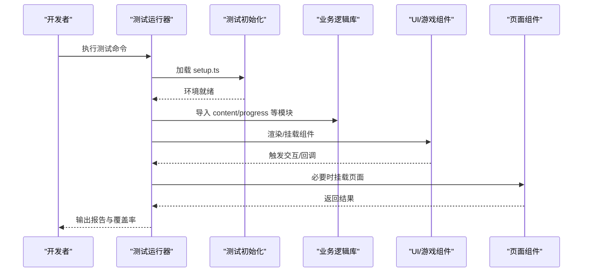
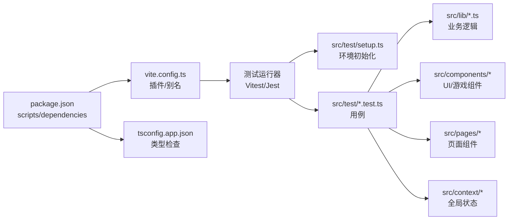

# 测试指南

<cite>
**本文引用的文件**   
- [package.json](file://package.json)
- [vite.config.ts](file://vite.config.ts)
- [tsconfig.app.json](file://tsconfig.app.json)
- [src/test/setup.ts](file://src/test/setup.ts)
- [src/test/content.test.ts](file://src/test/content.test.ts)
- [src/test/gameRunner.test.ts](file://src/test/gameRunner.test.ts)
- [src/test/progress.test.ts](file://src/test/progress.test.ts)
- [src/lib/content.ts](file://src/lib/content.ts)
- [src/lib/progress.ts](file://src/lib/progress.ts)
- [src/components/GameRunner.tsx](file://src/components/GameRunner.tsx)
- [src/components/games/ChoiceGame.tsx](file://src/components/games/ChoiceGame.tsx)
- [src/components/games/DragMatchGame.tsx](file://src/components/games/DragMatchGame.tsx)
- [src/components/games/FillBlankGame.tsx](file://src/components/games/FillBlankGame.tsx)
- [src/components/games/TimedChallengeGame.tsx](file://src/components/games/TimedChallengeGame.tsx)
- [src/components/games/TimelineGame.tsx](file://src/components/games/TimelineGame.tsx)
- [src/components/games/TrueFalseGame.tsx](file://src/components/games/TrueFalseGame.tsx)
- [src/components/games/DragAssembleGame.tsx](file://src/components/games/DragAssembleGame.tsx)
- [src/pages/KnowledgePointPage.tsx](file://src/pages/KnowledgePointPage.tsx)
- [src/context/ProgressContext.tsx](file://src/context/ProgressContext.tsx)
- [src/lib/types.ts](file://src/lib/types.ts)
</cite>

## 目录
1. [简介](#简介)
2. [项目结构](#项目结构)
3. [核心组件](#核心组件)
4. [架构总览](#架构总览)
5. [详细组件分析](#详细组件分析)
6. [依赖分析](#依赖分析)
7. [性能考虑](#性能考虑)
8. [故障排查指南](#故障排查指南)
9. [结论](#结论)
10. [附录](#附录)

## 简介
本指南面向 math-k6 项目的测试实践，覆盖测试框架配置、测试环境设置、单元测试编写规范、组件与游戏逻辑测试策略、内容加载测试方法、测试数据准备与 Mock 技巧、覆盖率要求与持续集成建议，以及调试与性能分析方法。目标是帮助开发者快速建立稳定、可维护的测试体系，保障数学知识点的游戏化学习体验质量。

## 项目结构
本项目采用 Vite + React + TypeScript 的前端工程结构，测试代码位于 src/test 目录，包含测试初始化与若干核心模块的测试用例。关键目录说明：
- src/lib：业务逻辑库（内容加载、进度管理等）
- src/components：UI 组件与游戏组件
- src/pages：页面级组件
- src/context：全局上下文（如进度状态）
- src/test：测试相关（setup、用例）

图表来源
- [package.json](file://package.json)
- [vite.config.ts](file://vite.config.ts)
- [tsconfig.app.json](file://tsconfig.app.json)
- [src/test/setup.ts](file://src/test/setup.ts)

章节来源
- [package.json](file://package.json)
- [vite.config.ts](file://vite.config.ts)
- [tsconfig.app.json](file://tsconfig.app.json)
- [src/test/setup.ts](file://src/test/setup.ts)

## 核心组件
- 内容加载模块（src/lib/content.ts）：负责知识点元数据与游戏配置的读取与解析，是内容加载测试的重点。
- 进度管理模块（src/lib/progress.ts）：负责用户学习进度的持久化与查询，适合用纯函数式测试验证边界条件与状态转换。
- 游戏运行器（src/components/GameRunner.tsx）：协调不同游戏类型渲染与交互流程，适合进行组件集成测试与交互模拟。
- 各游戏组件（src/components/games/*）：具体题型实现，适合单元与交互测试，关注输入输出与状态更新。

章节来源
- [src/lib/content.ts](file://src/lib/content.ts)
- [src/lib/progress.ts](file://src/lib/progress.ts)
- [src/components/GameRunner.tsx](file://src/components/GameRunner.tsx)
- [src/components/games/ChoiceGame.tsx](file://src/components/games/ChoiceGame.tsx)
- [src/components/games/DragMatchGame.tsx](file://src/components/games/DragMatchGame.tsx)
- [src/components/games/FillBlankGame.tsx](file://src/components/games/FillBlankGame.tsx)
- [src/components/games/TimedChallengeGame.tsx](file://src/components/games/TimedChallengeGame.tsx)
- [src/components/games/TimelineGame.tsx](file://src/components/games/TimelineGame.tsx)
- [src/components/games/TrueFalseGame.tsx](file://src/components/games/TrueFalseGame.tsx)
- [src/components/games/DragAssembleGame.tsx](file://src/components/games/DragAssembleGame.tsx)

## 架构总览
下图展示测试在构建与运行时的关键路径：测试初始化 → 加载业务逻辑 → 执行断言；同时体现 UI 组件与页面层如何被测试驱动。

图表来源
- [src/test/setup.ts](file://src/test/setup.ts)
- [src/lib/content.ts](file://src/lib/content.ts)
- [src/lib/progress.ts](file://src/lib/progress.ts)
- [src/components/GameRunner.tsx](file://src/components/GameRunner.tsx)
- [src/pages/KnowledgePointPage.tsx](file://src/pages/KnowledgePointPage.tsx)

## 详细组件分析

### 内容加载测试（content.ts）
- 目标：验证知识点索引、元数据与游戏配置的正确性、缺失字段处理、缓存行为（如有）。
- 策略：
  - 使用固定测试数据或本地 fixture，避免网络请求。
  - 对解析函数进行边界值测试（空对象、非法类型、缺失必填字段）。
  - 若存在缓存，需验证命中与失效场景。
- 参考用例位置：[src/test/content.test.ts](file://src/test/content.test.ts)

章节来源
- [src/lib/content.ts](file://src/lib/content.ts)
- [src/test/content.test.ts](file://src/test/content.test.ts)

### 进度管理测试（progress.ts）
- 目标：验证进度计算、持久化接口调用、默认值与回退逻辑。
- 策略：
  - 将持久化存储替换为内存 Mock，确保无副作用。
  - 覆盖增量更新、重置、合并策略等分支。
- 参考用例位置：[src/test/progress.test.ts](file://src/test/progress.test.ts)

章节来源
- [src/lib/progress.ts](file://src/lib/progress.ts)
- [src/test/progress.test.ts](file://src/test/progress.test.ts)

### 游戏运行器与组件测试（GameRunner.tsx 与 games/*）
- 目标：验证不同题型的渲染、交互流程与状态流转。
- 策略：
  - 使用轻量级渲染工具（如 React Testing Library）挂载组件。
  - 模拟用户操作（点击、拖拽、输入），断言 UI 变化与回调。
  - 针对计时类题型（TimedChallengeGame）使用时间推进 API 控制时序。
- 参考用例位置：[src/test/gameRunner.test.ts](file://src/test/gameRunner.test.ts)

章节来源
- [src/components/GameRunner.tsx](file://src/components/GameRunner.tsx)
- [src/components/games/ChoiceGame.tsx](file://src/components/games/ChoiceGame.tsx)
- [src/components/games/DragMatchGame.tsx](file://src/components/games/DragMatchGame.tsx)
- [src/components/games/FillBlankGame.tsx](file://src/components/games/FillBlankGame.tsx)
- [src/components/games/TimedChallengeGame.tsx](file://src/components/games/TimedChallengeGame.tsx)
- [src/components/games/TimelineGame.tsx](file://src/components/games/TimelineGame.tsx)
- [src/components/games/TrueFalseGame.tsx](file://src/components/games/TrueFalseGame.tsx)
- [src/components/games/DragAssembleGame.tsx](file://src/components/games/DragAssembleGame.tsx)
- [src/test/gameRunner.test.ts](file://src/test/gameRunner.test.ts)

### 页面级集成测试（KnowledgePointPage.tsx）
- 目标：验证知识点页面与内容加载、进度上报的协作。
- 策略：
  - 通过路由或手动挂载页面组件，注入 Mock 的内容与进度服务。
  - 断言页面渲染结果与副作用（如进度更新）。
- 参考位置：[src/pages/KnowledgePointPage.tsx](file://src/pages/KnowledgePointPage.tsx)

章节来源
- [src/pages/KnowledgePointPage.tsx](file://src/pages/KnowledgePointPage.tsx)

### 上下文与状态（ProgressContext.tsx）
- 目标：验证全局进度上下文的状态管理与消费。
- 策略：
  - 提供自定义 Provider 包裹被测组件。
  - 断言状态变更后的消费者响应。
- 参考位置：[src/context/ProgressContext.tsx](file://src/context/ProgressContext.tsx)

章节来源
- [src/context/ProgressContext.tsx](file://src/context/ProgressContext.tsx)

### 类型与契约（types.ts）
- 目标：确保数据结构与接口契约一致性。
- 策略：
  - 对关键类型进行约束校验（如必填字段、枚举值）。
  - 结合运行时校验（如 zod/yup）进行额外保护。
- 参考位置：[src/lib/types.ts](file://src/lib/types.ts)

章节来源
- [src/lib/types.ts](file://src/lib/types.ts)

## 依赖分析
测试依赖与构建配置关系如下：

图表来源
- [package.json](file://package.json)
- [vite.config.ts](file://vite.config.ts)
- [tsconfig.app.json](file://tsconfig.app.json)
- [src/test/setup.ts](file://src/test/setup.ts)

章节来源
- [package.json](file://package.json)
- [vite.config.ts](file://vite.config.ts)
- [tsconfig.app.json](file://tsconfig.app.json)
- [src/test/setup.ts](file://src/test/setup.ts)

## 性能考虑
- 组件渲染性能：
  - 对复杂游戏组件使用渲染快照与重渲染次数监控，避免不必要的重绘。
  - 对拖拽、动画等交互，尽量使用 requestAnimationFrame 节流与批处理。
- 异步与计时：
  - 使用虚拟时钟或时间推进 API 加速计时类测试，避免真实等待。
- 数据加载：
  - 对内容加载进行缓存与懒加载测试，确保首次与后续访问的性能差异符合预期。
- 覆盖率与基准：
  - 设定合理的覆盖率阈值，避免追求 100% 而牺牲可读性与稳定性。
  - 对热点路径添加性能回归测试（如渲染耗时、内存占用）。

## 故障排查指南
- 环境问题：
  - 确认测试初始化文件正确加载（如 DOM、Polyfill、全局变量）。
  - 检查 tsconfig 与 vite 插件是否影响测试解析。
- 异步问题：
  - 对 Promise、定时器、网络请求使用合适的等待与 Mock。
  - 避免竞态条件导致的偶发失败。
- 组件交互：
  - 使用事件冒泡与合成事件模型进行模拟，确保断言时机正确。
- 日志与调试：
  - 在关键路径添加结构化日志，便于定位失败原因。
  - 使用单测聚焦模式逐步缩小问题范围。

章节来源
- [src/test/setup.ts](file://src/test/setup.ts)
- [src/test/content.test.ts](file://src/test/content.test.ts)
- [src/test/gameRunner.test.ts](file://src/test/gameRunner.test.ts)
- [src/test/progress.test.ts](file://src/test/progress.test.ts)

## 结论
通过分层测试策略（单元、组件、集成）、严格的测试数据与 Mock 管理、合理的覆盖率与 CI 集成，math-k6 项目能够持续提升质量与交付效率。建议在迭代中不断完善测试用例，保持测试的可读性与稳定性，并定期评估性能指标。

## 附录

### 测试框架与环境设置
- 运行器选择：推荐使用 Vitest 或 Jest，结合 Vite 生态以获得更快的构建与热更新。
- 环境初始化：在 src/test/setup.ts 中统一配置 DOM、全局 Mock、控制台拦截等。
- TS 支持：确保 tsconfig.app.json 与测试运行器兼容，启用必要的类型检查。

章节来源
- [src/test/setup.ts](file://src/test/setup.ts)
- [tsconfig.app.json](file://tsconfig.app.json)

### 单元测试编写规范
- 命名：以“功能_场景”命名，清晰表达意图。
- 结构：Arrange-Act-Assert 三段式组织。
- 数据：使用固定 fixture，避免随机性。
- 断言：精确断言状态、UI 文本、回调参数。
- 隔离：避免共享状态，保证用例独立可重复。

章节来源
- [src/test/content.test.ts](file://src/test/content.test.ts)
- [src/test/gameRunner.test.ts](file://src/test/gameRunner.test.ts)
- [src/test/progress.test.ts](file://src/test/progress.test.ts)

### 组件测试策略
- 渲染：仅挂载必要子树，减少无关渲染。
- 交互：模拟用户输入与事件，断言 UI 与状态变化。
- 异步：使用等待与重试机制处理异步渲染。
- 快照：谨慎使用快照，配合语义化断言。

章节来源
- [src/components/GameRunner.tsx](file://src/components/GameRunner.tsx)
- [src/components/games/ChoiceGame.tsx](file://src/components/games/ChoiceGame.tsx)
- [src/components/games/DragMatchGame.tsx](file://src/components/games/DragMatchGame.tsx)
- [src/components/games/FillBlankGame.tsx](file://src/components/games/FillBlankGame.tsx)
- [src/components/games/TimedChallengeGame.tsx](file://src/components/games/TimedChallengeGame.tsx)
- [src/components/games/TimelineGame.tsx](file://src/components/games/TimelineGame.tsx)
- [src/components/games/TrueFalseGame.tsx](file://src/components/games/TrueFalseGame.tsx)
- [src/components/games/DragAssembleGame.tsx](file://src/components/games/DragAssembleGame.tsx)

### 游戏逻辑测试要点
- 规则验证：输入合法性的边界值与异常路径。
- 状态机：状态转换的正确性与不可达状态。
- 计时与并发：时间推进、中断与恢复。
- 分数与评价：计分算法与等级判定。

章节来源
- [src/components/games/TimedChallengeGame.tsx](file://src/components/games/TimedChallengeGame.tsx)
- [src/components/games/ChoiceGame.tsx](file://src/components/games/ChoiceGame.tsx)
- [src/components/games/DragMatchGame.tsx](file://src/components/games/DragMatchGame.tsx)

### 内容加载测试方法
- 数据源：使用本地 fixture 或内存映射替代真实文件/网络。
- 解析：验证字段完整性、类型转换、默认值。
- 缓存：命中与失效场景覆盖。
- 错误：缺失资源、格式错误的降级处理。

章节来源
- [src/lib/content.ts](file://src/lib/content.ts)
- [src/test/content.test.ts](file://src/test/content.test.ts)

### 测试数据与 Mock 使用
- 数据准备：集中存放 fixture，按模块划分。
- Mock 策略：
  - 外部依赖：网络、存储、第三方库。
  - 内部依赖：上下文、服务、工具函数。
- 清理：每个用例后重置状态，避免污染。

章节来源
- [src/test/setup.ts](file://src/test/setup.ts)
- [src/context/ProgressContext.tsx](file://src/context/ProgressContext.tsx)
- [src/lib/progress.ts](file://src/lib/progress.ts)

### 覆盖率要求与持续集成
- 覆盖率目标：语句、分支、函数、行覆盖率分别设定阈值（例如 ≥80%）。
- 报告：生成 HTML 与 JSON 报告，便于审查与归档。
- CI 流程：
  - 安装依赖 → 类型检查 → 单元测试 → 覆盖率收集 → 上传报告。
  - 失败即阻断合并，确保质量门禁。

章节来源
- [package.json](file://package.json)
- [vite.config.ts](file://vite.config.ts)

### 调试与性能分析
- 调试：
  - 使用单测聚焦模式（只跑一个文件/用例）。
  - 打印关键中间状态，定位失败点。
- 性能：
  - 记录渲染耗时与内存峰值。
  - 对比优化前后指标，确保回归不出现。

章节来源
- [src/test/setup.ts](file://src/test/setup.ts)
- [src/test/gameRunner.test.ts](file://src/test/gameRunner.test.ts)