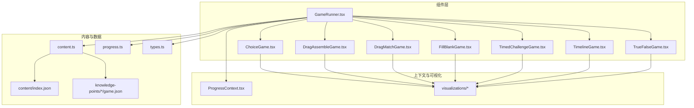
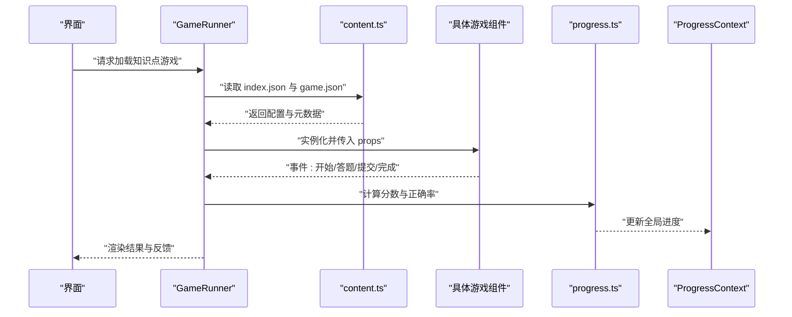
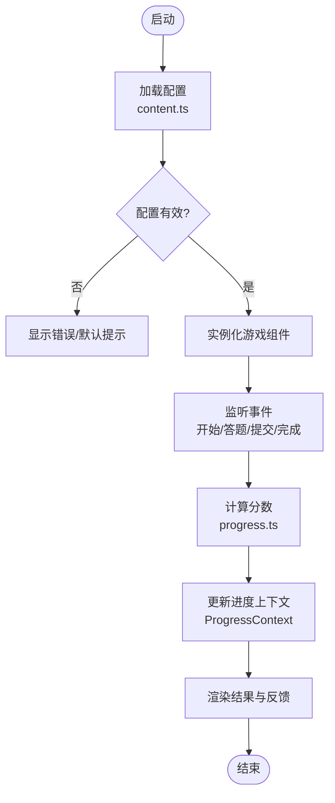
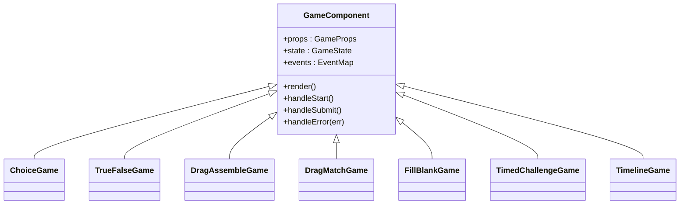
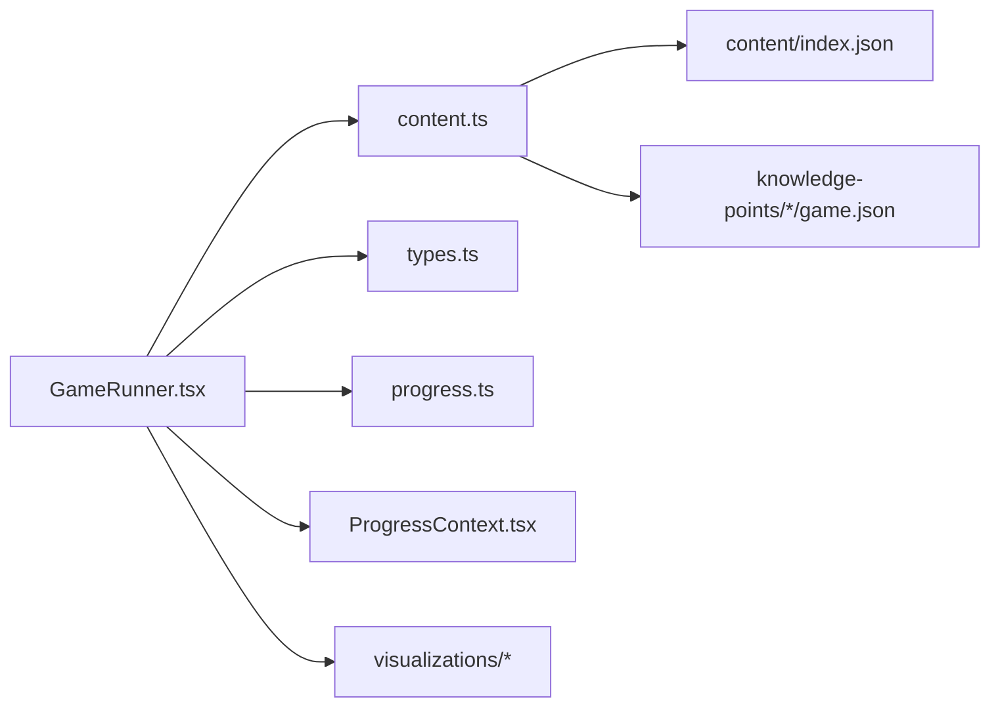

# 游戏开发指南

<cite>
**本文档引用的文件**   
- [GameRunner.tsx](file://src/components/GameRunner.tsx)
- [ChoiceGame.tsx](file://src/components/games/ChoiceGame.tsx)
- [DragAssembleGame.tsx](file://src/components/games/DragAssembleGame.tsx)
- [DragMatchGame.tsx](file://src/components/games/DragMatchGame.tsx)
- [FillBlankGame.tsx](file://src/components/games/FillBlankGame.tsx)
- [TimedChallengeGame.tsx](file://src/components/games/TimedChallengeGame.tsx)
- [TimelineGame.tsx](file://src/components/games/TimelineGame.tsx)
- [TrueFalseGame.tsx](file://src/components/games/TrueFalseGame.tsx)
- [ProgressContext.tsx](file://src/context/ProgressContext.tsx)
- [content.ts](file://src/lib/content.ts)
- [progress.ts](file://src/lib/progress.ts)
- [types.ts](file://src/lib/types.ts)
- [gameRunner.test.ts](file://src/test/gameRunner.test.ts)
- [setup.ts](file://src/test/setup.ts)
- [index.json](file://src/content/index.json)
- [g3-add-sub-10000/game.json](file://src/content/knowledge-points/g3-add-sub-10000/game.json)
- [g3-fraction-add-sub/game.json](file://src/content/knowledge-points/g3-fraction-add-sub/game.json)
</cite>

## 目录
1. [简介](#简介)
2. [项目结构](#项目结构)
3. [核心组件](#核心组件)
4. [架构总览](#架构总览)
5. [详细组件分析](#详细组件分析)
6. [依赖关系分析](#依赖关系分析)
7. [性能考虑](#性能考虑)
8. [故障排查指南](#故障排查指南)
9. [结论](#结论)
10. [附录](#附录)

## 简介
本指南面向 math-k6 项目的游戏开发者，系统阐述 GameRunner 运行器的架构设计与扩展机制，总结现有游戏组件的实现模式与接口规范，并提供创建自定义游戏类型的完整流程。内容覆盖：
- 游戏状态管理与生命周期
- 用户交互处理与事件机制
- 评分逻辑与进度记录
- 游戏配置最佳实践
- 性能优化建议
- 测试策略与调试技巧

## 项目结构
项目采用“组件 + 内容数据 + 可视化”的分层组织方式：
- components/games：具体游戏类型实现（选择题、拖拽匹配、填空、限时挑战等）
- components：运行器与页面容器（GameRunner、DerivationPlayer、Layout）
- content/knowledge-points：按知识点组织的游戏配置与元信息
- lib：内容加载、进度管理、类型定义
- context：全局上下文（如进度）
- test：单元测试与测试环境配置
- visualizations：数学可视化组件库

图表来源
- [GameRunner.tsx](file://src/components/GameRunner.tsx)
- [content.ts](file://src/lib/content.ts)
- [progress.ts](file://src/lib/progress.ts)
- [types.ts](file://src/lib/types.ts)
- [ProgressContext.tsx](file://src/context/ProgressContext.tsx)
- [index.json](file://src/content/index.json)
- [g3-add-sub-10000/game.json](file://src/content/knowledge-points/g3-add-sub-10000/game.json)
- [g3-fraction-add-sub/game.json](file://src/content/knowledge-points/g3-fraction-add-sub/game.json)

章节来源
- [GameRunner.tsx](file://src/components/GameRunner.tsx)
- [content.ts](file://src/lib/content.ts)
- [progress.ts](file://src/lib/progress.ts)
- [types.ts](file://src/lib/types.ts)
- [ProgressContext.tsx](file://src/context/ProgressContext.tsx)
- [index.json](file://src/content/index.json)

## 核心组件
- GameRunner 运行器
  - 职责：根据配置动态渲染对应游戏组件；统一初始化、销毁、事件转发与结果上报；协调进度上下文与可视化资源。
  - 关键能力：
    - 基于 game.json 的运行时装配
    - 生命周期钩子（挂载、更新、卸载）
    - 事件总线（开始、答题、提交、完成、错误）
    - 评分与反馈聚合
- 游戏组件族
  - ChoiceGame、TrueFalseGame：选择类题型，输入为选项集合与正确答案判定
  - DragAssembleGame、DragMatchGame：拖拽类题型，输入为可拖拽项与目标区域映射
  - FillBlankGame：填空类题型，输入为题目文本与答案校验规则
  - TimedChallengeGame：限时挑战，输入为时间参数与计时回调
  - TimelineGame：时间线排序，输入为待排序条目与顺序约束
- 上下文与数据
  - ProgressContext：全局学习进度与成就状态
  - content.ts：按知识点加载 game.json 与元数据
  - progress.ts：进度持久化与增量更新
  - types.ts：统一的类型契约（GameConfig、GameState、ScoreResult 等）

章节来源
- [GameRunner.tsx](file://src/components/GameRunner.tsx)
- [ChoiceGame.tsx](file://src/components/games/ChoiceGame.tsx)
- [TrueFalseGame.tsx](file://src/components/games/TrueFalseGame.tsx)
- [DragAssembleGame.tsx](file://src/components/games/DragAssembleGame.tsx)
- [DragMatchGame.tsx](file://src/components/games/DragMatchGame.tsx)
- [FillBlankGame.tsx](file://src/components/games/FillBlankGame.tsx)
- [TimedChallengeGame.tsx](file://src/components/games/TimedChallengeGame.tsx)
- [TimelineGame.tsx](file://src/components/games/TimelineGame.tsx)
- [ProgressContext.tsx](file://src/context/ProgressContext.tsx)
- [content.ts](file://src/lib/content.ts)
- [progress.ts](file://src/lib/progress.ts)
- [types.ts](file://src/lib/types.ts)

## 架构总览
GameRunner 作为编排中心，通过“配置驱动 + 组件注册”的方式解耦游戏实现与运行期控制流。数据流向如下：
- 配置加载：content.ts 读取 index.json 与各知识点的 game.json
- 运行时装配：GameRunner 解析配置并实例化对应游戏组件
- 交互与状态：游戏组件内部维护局部状态，通过事件向上汇报
- 评分与进度：GameRunner 汇总结果，调用 progress.ts 更新进度上下文
- 可视化：按需挂载 visualization 组件以增强体验

图表来源
- [GameRunner.tsx](file://src/components/GameRunner.tsx)
- [content.ts](file://src/lib/content.ts)
- [progress.ts](file://src/lib/progress.ts)
- [ProgressContext.tsx](file://src/context/ProgressContext.tsx)

## 详细组件分析

### GameRunner 运行器
- 设计要点
  - 配置驱动：依据 game.json 中的 type、props、rules 等字段决定渲染与行为
  - 生命周期：onMount/onUpdate/onUnmount 钩子用于资源准备与清理
  - 事件模型：标准化事件名与载荷，便于扩展新题型
  - 评分策略：支持按题数、权重、时间惩罚等维度计算得分
- 扩展机制
  - 新增游戏类型需在运行器中注册映射表，并在渲染分支中处理
  - 事件处理器可扩展拦截与审计（如埋点、日志）
- 错误处理
  - 配置校验失败时回退到默认提示
  - 组件渲染异常捕获并上报

图表来源
- [GameRunner.tsx](file://src/components/GameRunner.tsx)
- [content.ts](file://src/lib/content.ts)
- [progress.ts](file://src/lib/progress.ts)
- [ProgressContext.tsx](file://src/context/ProgressContext.tsx)

章节来源
- [GameRunner.tsx](file://src/components/GameRunner.tsx)

### 游戏组件族与接口规范
- 通用接口约定（概念性说明）
  - 输入属性：包含题目数据、交互规则、验证函数、回调事件
  - 输出事件：start、answer、submit、complete、error
  - 状态管理：内部状态变更需触发重渲染，避免副作用泄漏
  - 可访问性：键盘导航、屏幕阅读器友好
- 典型组件
  - ChoiceGame/TrueFalseGame：选项渲染、选中态、即时反馈
  - DragAssembleGame/DragMatchGame：拖拽源与目标绑定、放置校验
  - FillBlankGame：输入框聚焦、自动补全、正则校验
  - TimedChallengeGame：倒计时、暂停/恢复、超时处理
  - TimelineGame：排序算法、冲突检测、撤销/重做

图表来源
- [ChoiceGame.tsx](file://src/components/games/ChoiceGame.tsx)
- [TrueFalseGame.tsx](file://src/components/games/TrueFalseGame.tsx)
- [DragAssembleGame.tsx](file://src/components/games/DragAssembleGame.tsx)
- [DragMatchGame.tsx](file://src/components/games/DragMatchGame.tsx)
- [FillBlankGame.tsx](file://src/components/games/FillBlankGame.tsx)
- [TimedChallengeGame.tsx](file://src/components/games/TimedChallengeGame.tsx)
- [TimelineGame.tsx](file://src/components/games/TimelineGame.tsx)

章节来源
- [ChoiceGame.tsx](file://src/components/games/ChoiceGame.tsx)
- [TrueFalseGame.tsx](file://src/components/games/TrueFalseGame.tsx)
- [DragAssembleGame.tsx](file://src/components/games/DragAssembleGame.tsx)
- [DragMatchGame.tsx](file://src/components/games/DragMatchGame.tsx)
- [FillBlankGame.tsx](file://src/components/games/FillBlankGame.tsx)
- [TimedChallengeGame.tsx](file://src/components/games/TimedChallengeGame.tsx)
- [TimelineGame.tsx](file://src/components/games/TimelineGame.tsx)

### 自定义游戏类型创建流程
- 步骤概览
  1. 定义游戏配置：在 knowledge-points/*/game.json 中添加 type、props、rules
  2. 实现组件：继承通用接口，实现渲染与交互逻辑
  3. 注册运行器：在 GameRunner 中增加类型映射与渲染分支
  4. 集成进度：通过 progress.ts 上报得分与完成状态
  5. 编写测试：覆盖正常路径与边界条件
- 关键点
  - 配置校验：确保必填字段存在且类型正确
  - 事件命名：遵循统一事件协议，避免歧义
  - 性能：大列表虚拟化、防抖节流、惰性加载可视化

章节来源
- [g3-add-sub-10000/game.json](file://src/content/knowledge-points/g3-add-sub-10000/game.json)
- [g3-fraction-add-sub/game.json](file://src/content/knowledge-points/g3-fraction-add-sub/game.json)
- [GameRunner.tsx](file://src/components/GameRunner.tsx)
- [progress.ts](file://src/lib/progress.ts)

### 游戏状态管理与事件处理
- 状态分层
  - 组件级状态：输入、选中、拖拽位置、计时器等
  - 会话级状态：当前题目索引、累计得分、已用时间
  - 全局状态：学习进度、成就解锁、偏好设置
- 事件流
  - 用户操作 -> 组件事件 -> GameRunner 聚合 -> 进度更新 -> UI 刷新
- 最佳实践
  - 使用不可变数据结构更新状态
  - 事件去重与幂等处理
  - 异步操作统一错误边界

章节来源
- [ProgressContext.tsx](file://src/context/ProgressContext.tsx)
- [progress.ts](file://src/lib/progress.ts)
- [GameRunner.tsx](file://src/components/GameRunner.tsx)

### 评分逻辑与反馈
- 评分维度
  - 正确率、用时惩罚、难度系数、连击奖励
- 反馈形式
  - 即时提示（对/错）、阶段性总结、最终报告
- 数据上报
  - 结构化记录每次作答详情，便于分析与回溯

章节来源
- [progress.ts](file://src/lib/progress.ts)
- [GameRunner.tsx](file://src/components/GameRunner.tsx)

## 依赖关系分析
- 模块耦合
  - GameRunner 强依赖 content.ts 与 types.ts，弱依赖具体游戏组件
  - 进度模块独立，通过上下文注入，降低耦合度
- 外部依赖
  - 可视化组件按需加载，避免首屏过大
- 潜在循环
  - 组件间不直接引用，通过事件通信，避免循环依赖

图表来源
- [GameRunner.tsx](file://src/components/GameRunner.tsx)
- [content.ts](file://src/lib/content.ts)
- [types.ts](file://src/lib/types.ts)
- [progress.ts](file://src/lib/progress.ts)
- [ProgressContext.tsx](file://src/context/ProgressContext.tsx)
- [index.json](file://src/content/index.json)

章节来源
- [GameRunner.tsx](file://src/components/GameRunner.tsx)
- [content.ts](file://src/lib/content.ts)
- [types.ts](file://src/lib/types.ts)
- [progress.ts](file://src/lib/progress.ts)
- [ProgressContext.tsx](file://src/context/ProgressContext.tsx)
- [index.json](file://src/content/index.json)

## 性能考虑
- 渲染优化
  - 组件懒加载与代码分割
  - 列表虚拟化与虚拟滚动
  - 防抖/节流高频事件（如拖拽、输入）
- 内存管理
  - 及时清理事件监听与定时器
  - 避免闭包持有大对象引用
- I/O 优化
  - 批量读取配置与缓存
  - 可视化资源按需加载与复用

[本节为通用指导，无需特定文件来源]

## 故障排查指南
- 常见问题
  - 配置缺失或类型错误：检查 game.json 必填字段与 schema
  - 组件未渲染：确认运行器映射与 props 传递
  - 进度未更新：检查事件上报与 progress.ts 调用链
  - 性能卡顿：定位重渲染热点与大型计算
- 调试技巧
  - 启用详细日志与埋点
  - 使用浏览器开发者工具断点与性能面板
  - 编写最小复现用例隔离问题

章节来源
- [gameRunner.test.ts](file://src/test/gameRunner.test.ts)
- [setup.ts](file://src/test/setup.ts)

## 结论
通过配置驱动与组件解耦，math-k6 实现了灵活可扩展的游戏运行体系。遵循本文档的接口规范与实践建议，可快速构建高质量的新题型，并确保性能稳定、易于测试与维护。

[本节为总结性内容，无需特定文件来源]

## 附录
- 术语表
  - 运行器：负责装配与调度游戏组件的核心模块
  - 配置驱动：通过 JSON 配置决定运行时行为
  - 事件总线：统一的事件发布订阅机制
- 参考文件
  - 配置示例：g3-add-sub-10000/game.json、g3-fraction-add-sub/game.json
  - 测试入口：gameRunner.test.ts、setup.ts

[本节为补充信息，无需特定文件来源]