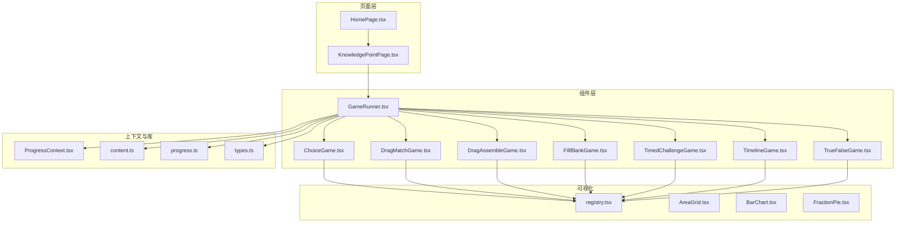
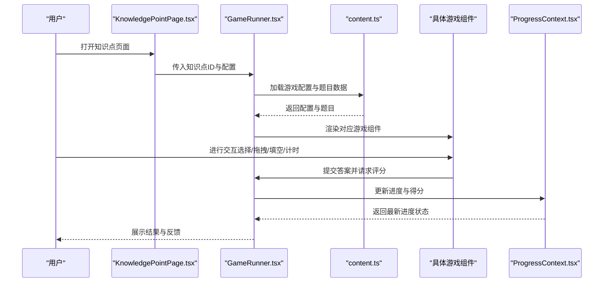
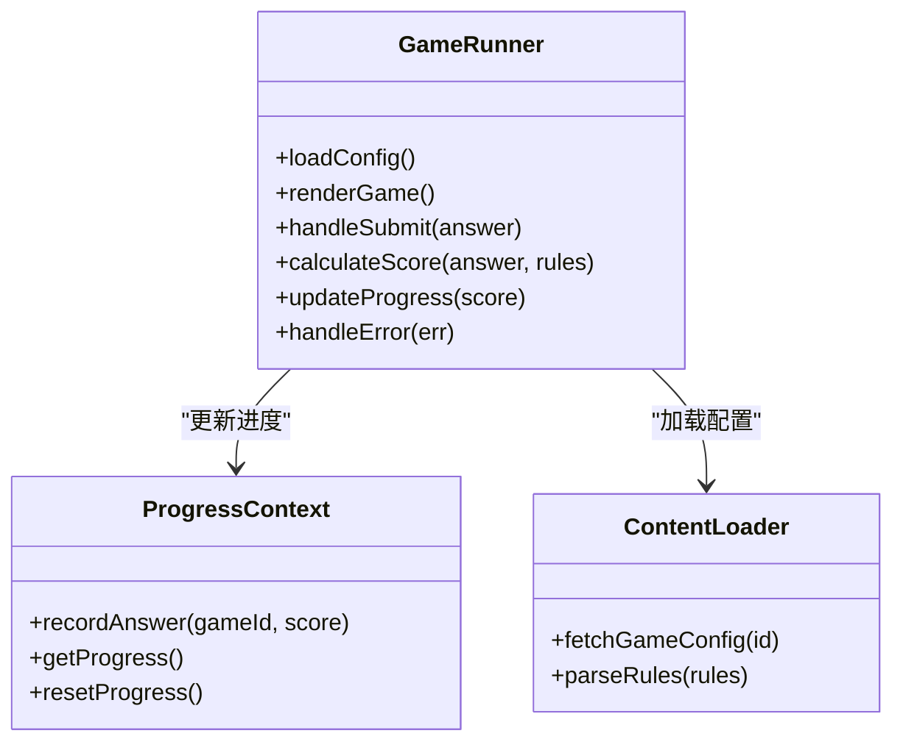
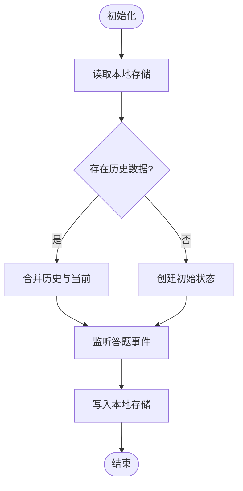
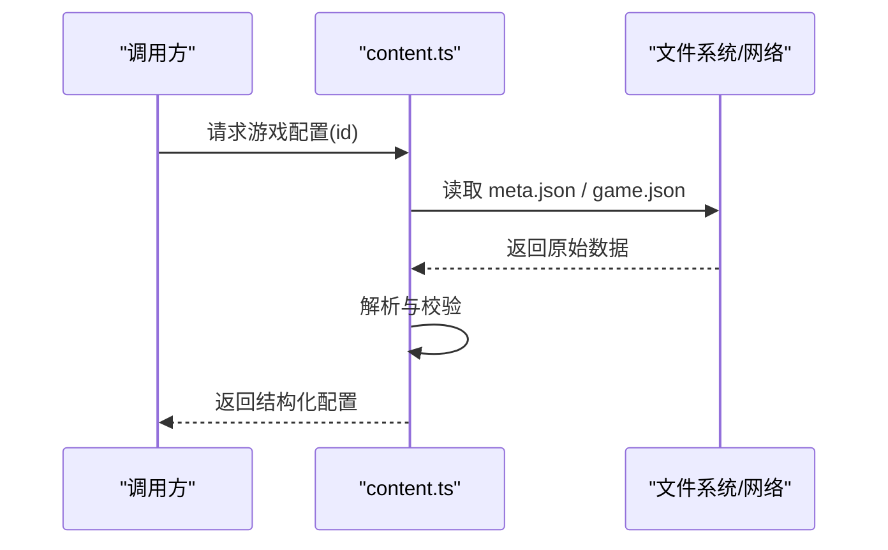
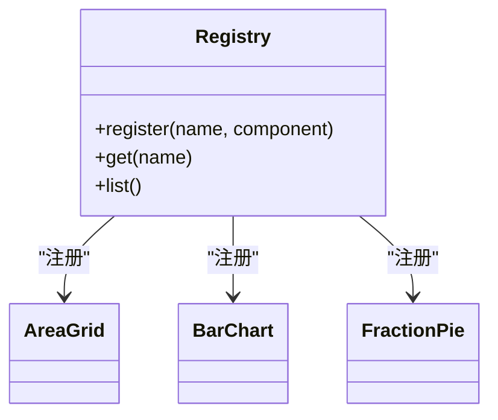
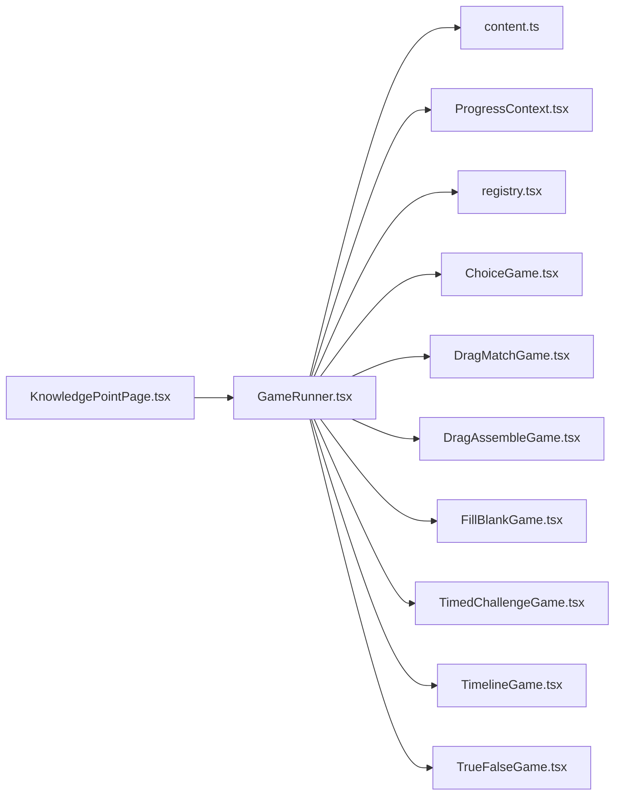

# 游戏测试与调试

<cite>
**本文档引用的文件**   
- [GameRunner.tsx](file://src/components/GameRunner.tsx)
- [ProgressContext.tsx](file://src/context/ProgressContext.tsx)
- [content.ts](file://src/lib/content.ts)
- [progress.ts](file://src/lib/progress.ts)
- [types.ts](file://src/lib/types.ts)
- [gameRunner.test.ts](file://src/test/gameRunner.test.ts)
- [content.test.ts](file://src/test/content.test.ts)
- [progress.test.ts](file://src/test/progress.test.ts)
- [setup.ts](file://src/test/setup.ts)
- [ChoiceGame.tsx](file://src/components/games/ChoiceGame.tsx)
- [DragAssembleGame.tsx](file://src/components/games/DragAssembleGame.tsx)
- [DragMatchGame.tsx](file://src/components/games/DragMatchGame.tsx)
- [FillBlankGame.tsx](file://src/components/games/FillBlankGame.tsx)
- [TimedChallengeGame.tsx](file://src/components/games/TimedChallengeGame.tsx)
- [TimelineGame.tsx](file://src/components/games/TimelineGame.tsx)
- [TrueFalseGame.tsx](file://src/components/games/TrueFalseGame.tsx)
- [AreaGrid.tsx](file://src/visualizations/AreaGrid.tsx)
- [BarChart.tsx](file://src/visualizations/BarChart.tsx)
- [FractionPie.tsx](file://src/visualizations/FractionPie.tsx)
- [registry.tsx](file://src/visualizations/registry.tsx)
- [package.json](file://package.json)
- [vite.config.ts](file://vite.config.ts)
- [KnowledgePointPage.tsx](file://src/pages/KnowledgePointPage.tsx)
- [HomePage.tsx](file://src/pages/HomePage.tsx)
</cite>

## 目录
1. [简介](#简介)
2. [项目结构](#项目结构)
3. [核心组件](#核心组件)
4. [架构总览](#架构总览)
5. [详细组件分析](#详细组件分析)
6. [依赖关系分析](#依赖关系分析)
7. [性能考虑](#性能考虑)
8. [故障排查指南](#故障排查指南)
9. [结论](#结论)
10. [附录](#附录)

## 简介
本指南面向 math-k6 项目的游戏模块，提供系统化的测试与调试方法。内容覆盖单元测试、集成测试与端到端测试策略；围绕游戏状态变化、用户交互响应与评分逻辑的正确性验证；给出 React DevTools、控制台日志与性能分析等调试技巧；总结常见问题的定位与解决方案；并提供可复用的测试模板与最佳实践，以及跨浏览器兼容性测试建议。

## 项目结构
math-k6 采用“按功能分层 + 资源驱动”的组织方式：
- components/games：具体游戏实现（选择、拖拽、填空、计时挑战、时间线、判断等）
- components：游戏运行器与页面布局
- context：进度上下文（全局进度与持久化）
- lib：内容加载、进度管理、类型定义
- pages：页面路由入口（首页、知识点页、进度看板）
- visualizations：可视化组件（图表、模型、数轴等）
- test：测试用例与测试环境配置

**图示来源** 
- [GameRunner.tsx](file://src/components/GameRunner.tsx)
- [ProgressContext.tsx](file://src/context/ProgressContext.tsx)
- [content.ts](file://src/lib/content.ts)
- [progress.ts](file://src/lib/progress.ts)
- [types.ts](file://src/lib/types.ts)
- [ChoiceGame.tsx](file://src/components/games/ChoiceGame.tsx)
- [DragMatchGame.tsx](file://src/components/games/DragMatchGame.tsx)
- [DragAssembleGame.tsx](file://src/components/games/DragAssembleGame.tsx)
- [FillBlankGame.tsx](file://src/components/games/FillBlankGame.tsx)
- [TimedChallengeGame.tsx](file://src/components/games/TimedChallengeGame.tsx)
- [TimelineGame.tsx](file://src/components/games/TimelineGame.tsx)
- [TrueFalseGame.tsx](file://src/components/games/TrueFalseGame.tsx)
- [registry.tsx](file://src/visualizations/registry.tsx)
- [AreaGrid.tsx](file://src/visualizations/AreaGrid.tsx)
- [BarChart.tsx](file://src/visualizations/BarChart.tsx)
- [FractionPie.tsx](file://src/visualizations/FractionPie.tsx)

**章节来源**
- [package.json](file://package.json)
- [vite.config.ts](file://vite.config.ts)

## 核心组件
- GameRunner：负责加载题目数据、渲染具体游戏组件、处理提交与评分、更新进度上下文。
- ProgressContext：维护学习进度、答题记录、分数与完成状态，提供增删改查接口供上层消费。
- content.ts：统一加载知识点内容与游戏配置（如 game.json），为运行时提供数据源。
- progress.ts：进度计算、统计与持久化辅助函数。
- types.ts：共享类型定义，确保各组件间数据结构一致。

这些组件共同构成“数据加载 → 渲染 → 交互 → 评分 → 进度更新”的闭环。

**章节来源**
- [GameRunner.tsx](file://src/components/GameRunner.tsx)
- [ProgressContext.tsx](file://src/context/ProgressContext.tsx)
- [content.ts](file://src/lib/content.ts)
- [progress.ts](file://src/lib/progress.ts)
- [types.ts](file://src/lib/types.ts)

## 架构总览
下图展示了从页面到游戏运行器的调用链，以及与进度上下文和数据源的交互。

**图示来源** 
- [KnowledgePointPage.tsx](file://src/pages/KnowledgePointPage.tsx)
- [GameRunner.tsx](file://src/components/GameRunner.tsx)
- [content.ts](file://src/lib/content.ts)
- [ProgressContext.tsx](file://src/context/ProgressContext.tsx)

## 详细组件分析

### GameRunner 组件分析
职责：
- 根据知识点配置动态加载题目与规则
- 渲染具体游戏组件并透传 props
- 收集用户输入、触发评分、更新进度上下文
- 处理错误边界与重试机制

**图示来源** 
- [GameRunner.tsx](file://src/components/GameRunner.tsx)
- [ProgressContext.tsx](file://src/context/ProgressContext.tsx)
- [content.ts](file://src/lib/content.ts)

**章节来源**
- [GameRunner.tsx](file://src/components/GameRunner.tsx)

### 进度上下文 ProgressContext
职责：
- 维护全局进度状态（已答题、得分、完成度）
- 提供统一的读写接口，避免状态分散
- 支持本地持久化与增量更新

**图示来源** 
- [ProgressContext.tsx](file://src/context/ProgressContext.tsx)
- [progress.ts](file://src/lib/progress.ts)

**章节来源**
- [ProgressContext.tsx](file://src/context/ProgressContext.tsx)
- [progress.ts](file://src/lib/progress.ts)

### 内容加载 content.ts
职责：
- 统一获取知识点元数据与游戏配置
- 解析规则与校验字段完整性
- 提供缓存与错误降级

**图示来源** 
- [content.ts](file://src/lib/content.ts)

**章节来源**
- [content.ts](file://src/lib/content.ts)

### 可视化注册表 registry.tsx
职责：
- 集中注册可视化组件（图表、模型等）
- 通过名称映射快速实例化
- 便于扩展与维护

**图示来源** 
- [registry.tsx](file://src/visualizations/registry.tsx)
- [AreaGrid.tsx](file://src/visualizations/AreaGrid.tsx)
- [BarChart.tsx](file://src/visualizations/BarChart.tsx)
- [FractionPie.tsx](file://src/visualizations/FractionPie.tsx)

**章节来源**
- [registry.tsx](file://src/visualizations/registry.tsx)

### 典型游戏组件测试要点
- ChoiceGame：选项渲染、选中态切换、提交后正确答案判定与反馈
- DragMatchGame：拖拽命中区域、配对正确性、重复拖拽处理
- DragAssembleGame：部件组装顺序、最终形态校验、撤销重做
- FillBlankGame：输入校验、自动补全、空值处理
- TimedChallengeGame：倒计时逻辑、超时处理、暂停/恢复
- TimelineGame：时间轴排序、区间重叠检测、边界情况
- TrueFalseGame：判断逻辑、提示语生成、连续答对奖励

针对每个组件，建议编写：
- 单元测试：纯函数评分逻辑、边界条件
- 组件测试：用户交互（点击、拖拽、输入）、状态变化
- 集成测试：GameRunner 与 ProgressContext 协作流程

**章节来源**
- [ChoiceGame.tsx](file://src/components/games/ChoiceGame.tsx)
- [DragMatchGame.tsx](file://src/components/games/DragMatchGame.tsx)
- [DragAssembleGame.tsx](file://src/components/games/DragAssembleGame.tsx)
- [FillBlankGame.tsx](file://src/components/games/FillBlankGame.tsx)
- [TimedChallengeGame.tsx](file://src/components/games/TimedChallengeGame.tsx)
- [TimelineGame.tsx](file://src/components/games/TimelineGame.tsx)
- [TrueFalseGame.tsx](file://src/components/games/TrueFalseGame.tsx)

## 依赖关系分析
- GameRunner 依赖 content.ts 与 ProgressContext.tsx
- 各游戏组件依赖 registry.tsx 以获取可视化能力
- 页面层依赖 GameRunner 与 ProgressContext
- 测试层依赖 setup.ts 提供的测试环境与模拟数据

**图示来源** 
- [KnowledgePointPage.tsx](file://src/pages/KnowledgePointPage.tsx)
- [GameRunner.tsx](file://src/components/GameRunner.tsx)
- [content.ts](file://src/lib/content.ts)
- [ProgressContext.tsx](file://src/context/ProgressContext.tsx)
- [registry.tsx](file://src/visualizations/registry.tsx)
- [ChoiceGame.tsx](file://src/components/games/ChoiceGame.tsx)
- [DragMatchGame.tsx](file://src/components/games/DragMatchGame.tsx)
- [DragAssembleGame.tsx](file://src/components/games/DragAssembleGame.tsx)
- [FillBlankGame.tsx](file://src/components/games/FillBlankGame.tsx)
- [TimedChallengeGame.tsx](file://src/components/games/TimedChallengeGame.tsx)
- [TimelineGame.tsx](file://src/components/games/TimelineGame.tsx)
- [TrueFalseGame.tsx](file://src/components/games/TrueFalseGame.tsx)

**章节来源**
- [package.json](file://package.json)
- [vite.config.ts](file://vite.config.ts)

## 性能考虑
- 组件渲染优化：使用 memo/useMemo/useCallback 减少不必要的重渲染
- 大列表与可视化：虚拟化渲染与按需加载
- 内存管理：清理定时器、事件监听与动画帧
- 网络与IO：缓存配置与批量请求，失败重试与降级
- 评测指标：首屏渲染时间、交互响应延迟、内存峰值与垃圾回收频率

[本节为通用指导，不直接分析具体文件]

## 故障排查指南
常见问题与定位步骤：
- 状态同步问题：检查 ProgressContext 的更新路径与副作用清理，确认无竞态条件
- 内存泄漏：排查未清理的定时器、事件监听、订阅与动画帧
- 性能瓶颈：使用 React DevTools Profiler 定位重渲染热点，结合 Performance 面板分析长任务
- 数据不一致：校验 content.ts 的数据解析与默认值，增加断言与快照对比
- 交互异常：在关键事件处添加日志与断点，回放用户操作序列

调试工具与技巧：
- React DevTools：组件树、Props/State 检查、Profiler 性能分析
- 控制台日志：分级输出（debug/info/warn/error），过滤无关信息
- 单元测试断言：覆盖率与快照测试，确保回归稳定
- 端到端测试：模拟真实用户路径，验证页面级行为

**章节来源**
- [gameRunner.test.ts](file://src/test/gameRunner.test.ts)
- [content.test.ts](file://src/test/content.test.ts)
- [progress.test.ts](file://src/test/progress.test.ts)
- [setup.ts](file://src/test/setup.ts)

## 结论
通过分层测试策略（单元、集成、端到端）与系统化调试手段，可有效保障 math-k6 游戏模块的稳定性与用户体验。建议持续完善测试覆盖率、建立回归基线，并结合性能监控与跨浏览器测试，确保在不同设备与环境下的一致表现。

[本节为总结性内容，不直接分析具体文件]

## 附录

### 测试策略与用例模板
- 单元测试模板
  - 目标：验证纯函数评分逻辑、边界条件与异常分支
  - 步骤：准备输入 → 执行函数 → 断言输出 → 清理
- 组件测试模板
  - 目标：验证用户交互与状态变化
  - 步骤：挂载组件 → 模拟事件（点击/拖拽/输入）→ 断言 UI 与状态
- 集成测试模板
  - 目标：验证 GameRunner 与 ProgressContext 协作
  - 步骤：模拟数据加载 → 触发提交 → 断言进度更新与评分

[本节为模板说明，不直接分析具体文件]

### 调试最佳实践
- 在关键路径添加结构化日志（包含上下文与时间戳）
- 使用条件断点与表达式求值加速定位
- 将易错分支抽取为可测试函数，提高可观测性
- 定期运行性能分析，关注长任务与内存增长

[本节为最佳实践，不直接分析具体文件]

### 兼容性与跨浏览器测试
- 目标浏览器矩阵：Chrome、Firefox、Safari、Edge（含移动端）
- 自动化方案：基于 Vite 构建产物，配合 Playwright/Cypress 进行 E2E 测试
- 特性检测：对拖拽、Canvas、WebGL 等能力进行降级处理
- 回归策略：每次发布前执行全量兼容测试，记录差异并修复

[本节为通用指导，不直接分析具体文件]