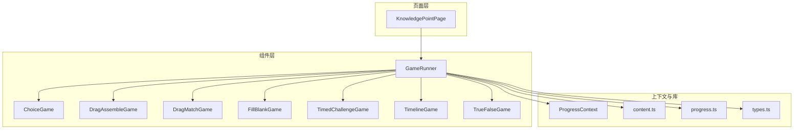
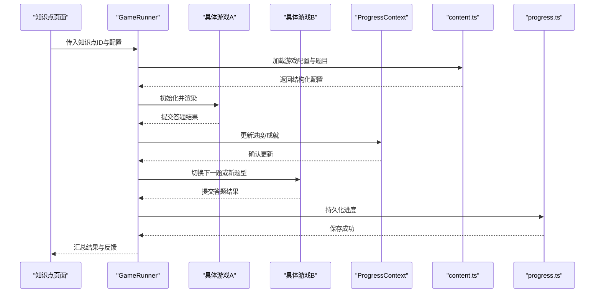
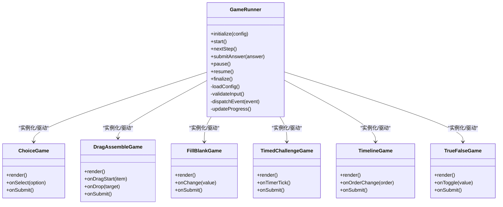
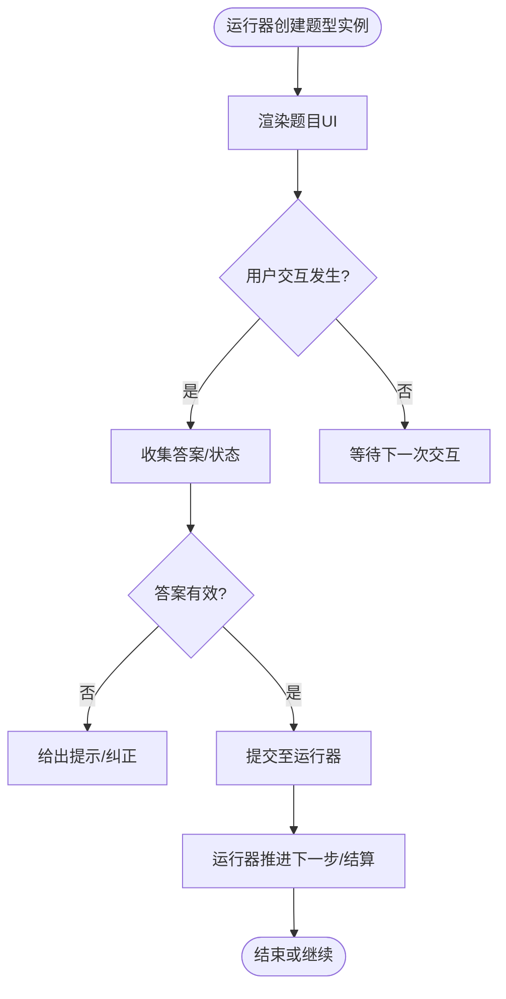
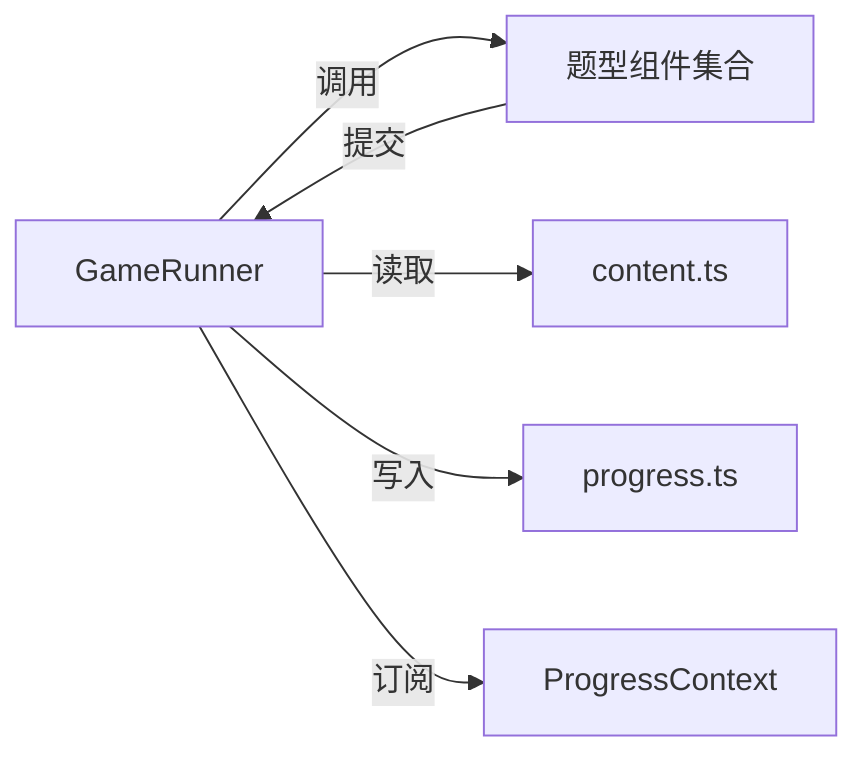
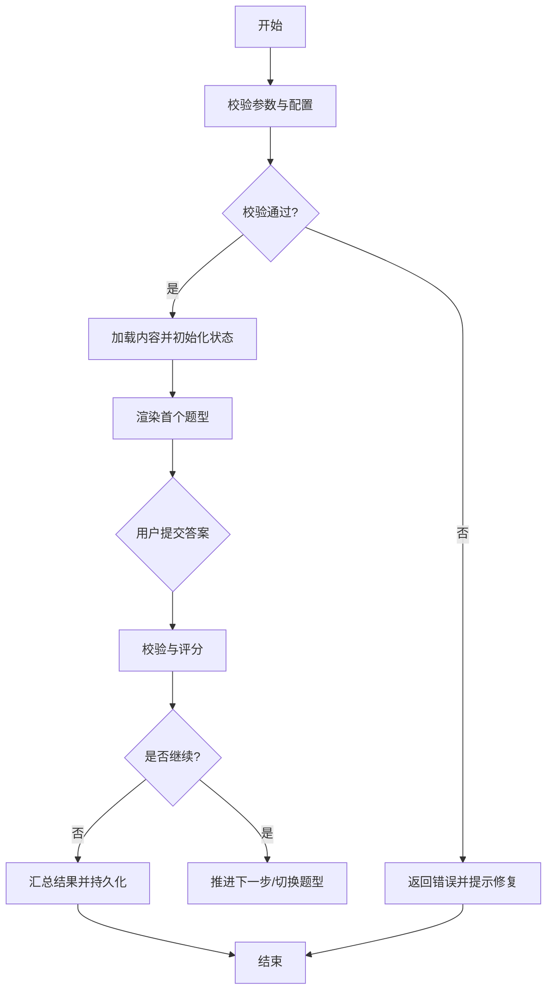

# 游戏运行器架构

<cite>
**本文引用的文件**   
- [GameRunner.tsx](file://src/components/GameRunner.tsx)
- [ChoiceGame.tsx](file://src/components/games/ChoiceGame.tsx)
- [DragAssembleGame.tsx](file://src/components/games/DragAssembleGame.tsx)
- [DragMatchGame.tsx](file://src/components/games/DragMatchGame.tsx)
- [FillBlankGame.tsx](file://src/components/games/FillBlankGame.tsx)
- [TimedChallengeGame.tsx](file://src/components/games/TimedChallengeGame.tsx)
- [TimelineGame.tsx](file://src/components/games/TimelineGame.tsx)
- [TrueFalseGame.tsx](file://src/components/games/TrueFalseGame.tsx)
- [ProgressContext.tsx](file://src/context/ProgressContext.tsx)
- [content.ts](file://src/lib/content.ts)
- [progress.ts](file://src/lib/progress.ts)
- [types.ts](file://src/lib/types.ts)
- [KnowledgePointPage.tsx](file://src/pages/KnowledgePointPage.tsx)
- [gameRunner.test.ts](file://src/test/gameRunner.test.ts)
</cite>

## 目录
1. [简介](#简介)
2. [项目结构](#项目结构)
3. [核心组件](#核心组件)
4. [架构总览](#架构总览)
5. [详细组件分析](#详细组件分析)
6. [依赖关系分析](#依赖关系分析)
7. [性能考虑](#性能考虑)
8. [故障排查指南](#故障排查指南)
9. [结论](#结论)
10. [附录](#附录)

## 简介
本文件为 math-k6 项目的“游戏运行器”提供系统化、可操作的架构文档。重点围绕 GameRunner 组件的设计模式与核心能力，包括：
- 游戏生命周期管理（初始化、执行、结算）
- 状态协调机制（全局进度、局部游戏状态）
- 事件处理系统（用户交互、结果上报、错误恢复）
- 多类型游戏组件的统一编排（选择题、拖拽匹配、填空、限时挑战等）
- 配置接口、参数传递与错误处理策略
- 扩展点与自定义集成指南
- 性能优化建议与调试技巧

## 项目结构
本项目采用“按功能域+分层”的组织方式：
- components/games：具体游戏实现（多种题型）
- components：通用容器与运行器（GameRunner、Layout、DerivationPlayer 等）
- context：跨组件状态上下文（如 ProgressContext）
- lib：内容加载、进度存储、类型定义等基础设施
- pages：页面级入口（知识点页、年级页、进度看板等）
- content/knowledge-points：每个知识点的元数据与题目资源（meta.json、game.json、explain.md、derivation.json）

图表来源
- [GameRunner.tsx](file://src/components/GameRunner.tsx)
- [KnowledgePointPage.tsx](file://src/pages/KnowledgePointPage.tsx)
- [ProgressContext.tsx](file://src/context/ProgressContext.tsx)
- [content.ts](file://src/lib/content.ts)
- [progress.ts](file://src/lib/progress.ts)
- [types.ts](file://src/lib/types.ts)

章节来源
- [GameRunner.tsx](file://src/components/GameRunner.tsx)
- [KnowledgePointPage.tsx](file://src/pages/KnowledgePointPage.tsx)
- [ProgressContext.tsx](file://src/context/ProgressContext.tsx)
- [content.ts](file://src/lib/content.ts)
- [progress.ts](file://src/lib/progress.ts)
- [types.ts](file://src/lib/types.ts)

## 核心组件
- GameRunner：统一编排不同题型的运行流程，负责生命周期、状态同步、事件分发与结果汇总。
- 各题型组件：遵循统一的输入输出契约，由运行器驱动渲染与交互。
- ProgressContext：集中管理学习进度与成就，供运行器在关键节点更新。
- content.ts / progress.ts / types.ts：提供内容解析、持久化与类型约束，确保运行器稳定运行。

章节来源
- [GameRunner.tsx](file://src/components/GameRunner.tsx)
- [ProgressContext.tsx](file://src/context/ProgressContext.tsx)
- [content.ts](file://src/lib/content.ts)
- [progress.ts](file://src/lib/progress.ts)
- [types.ts](file://src/lib/types.ts)

## 架构总览
下图展示了从页面到运行器再到具体游戏组件的调用链路与数据流。

图表来源
- [GameRunner.tsx](file://src/components/GameRunner.tsx)
- [KnowledgePointPage.tsx](file://src/pages/KnowledgePointPage.tsx)
- [ProgressContext.tsx](file://src/context/ProgressContext.tsx)
- [content.ts](file://src/lib/content.ts)
- [progress.ts](file://src/lib/progress.ts)

## 详细组件分析

### GameRunner 组件
- 设计模式
  - 编排器/协调器：统一调度多个游戏组件的生命周期与状态。
  - 观察者/事件总线：通过回调与上下文事件将用户行为与结果传播给上层与持久化层。
  - 工厂/注册表：根据配置动态选择并实例化具体游戏组件。
- 生命周期管理
  - 初始化：校验参数、加载配置、准备初始状态。
  - 执行：依次启动各题型，维护当前步骤、计时、提示与容错。
  - 结算：汇总得分、正确率、用时，触发进度更新与结果展示。
- 状态协调
  - 局部状态：当前题目、选项/答案、计时器、提示与错误信息。
  - 全局状态：通过 ProgressContext 聚合进度、成就、里程碑。
- 事件处理
  - 用户交互：选择、拖拽、填空、提交、撤销等。
  - 业务事件：开始、暂停、继续、完成、失败、重试。
  - 错误事件：网络/资源加载失败、数据校验异常、运行时异常捕获。
- 配置接口与参数传递
  - 入参：知识点标识、难度/数量、时间限制、是否允许提示、是否启用计时等。
  - 出参：结果对象（得分、耗时、每步详情）、状态变更事件。
- 错误处理策略
  - 防御性校验：对配置与输入进行强类型检查与边界校验。
  - 降级与回退：资源缺失时回退默认题库或跳过该题。
  - 可恢复性：记录错误上下文，支持重试与断点续跑。

图表来源
- [GameRunner.tsx](file://src/components/GameRunner.tsx)
- [ChoiceGame.tsx](file://src/components/games/ChoiceGame.tsx)
- [DragAssembleGame.tsx](file://src/components/games/DragAssembleGame.tsx)
- [FillBlankGame.tsx](file://src/components/games/FillBlankGame.tsx)
- [TimedChallengeGame.tsx](file://src/components/games/TimedChallengeGame.tsx)
- [TimelineGame.tsx](file://src/components/games/TimelineGame.tsx)
- [TrueFalseGame.tsx](file://src/components/games/TrueFalseGame.tsx)

章节来源
- [GameRunner.tsx](file://src/components/GameRunner.tsx)
- [ChoiceGame.tsx](file://src/components/games/ChoiceGame.tsx)
- [DragAssembleGame.tsx](file://src/components/games/DragAssembleGame.tsx)
- [FillBlankGame.tsx](file://src/components/games/FillBlankGame.tsx)
- [TimedChallengeGame.tsx](file://src/components/games/TimedChallengeGame.tsx)
- [TimelineGame.tsx](file://src/components/games/TimelineGame.tsx)
- [TrueFalseGame.tsx](file://src/components/games/TrueFalseGame.tsx)

### 题型组件契约与协作
- 统一契约
  - 渲染接口：接收题目数据与交互回调，返回 UI。
  - 提交接口：将用户答案以标准结构返回给运行器。
  - 事件接口：可选地发出开始、暂停、完成、错误等事件。
- 协作流程
  - 运行器根据配置创建对应题型实例。
  - 题型组件仅关注自身交互逻辑，不关心全局状态。
  - 所有结果通过运行器统一汇聚与校验。

图表来源
- [GameRunner.tsx](file://src/components/GameRunner.tsx)
- [ChoiceGame.tsx](file://src/components/games/ChoiceGame.tsx)
- [DragAssembleGame.tsx](file://src/components/games/DragAssembleGame.tsx)
- [FillBlankGame.tsx](file://src/components/games/FillBlankGame.tsx)
- [TimedChallengeGame.tsx](file://src/components/games/TimedChallengeGame.tsx)
- [TimelineGame.tsx](file://src/components/games/TimelineGame.tsx)
- [TrueFalseGame.tsx](file://src/components/games/TrueFalseGame.tsx)

章节来源
- [GameRunner.tsx](file://src/components/GameRunner.tsx)
- [ChoiceGame.tsx](file://src/components/games/ChoiceGame.tsx)
- [DragAssembleGame.tsx](file://src/components/games/DragAssembleGame.tsx)
- [FillBlankGame.tsx](file://src/components/games/FillBlankGame.tsx)
- [TimedChallengeGame.tsx](file://src/components/games/TimedChallengeGame.tsx)
- [TimelineGame.tsx](file://src/components/games/TimelineGame.tsx)
- [TrueFalseGame.tsx](file://src/components/games/TrueFalseGame.tsx)

### 进度与上下文（ProgressContext）
- 职责
  - 集中管理学习进度、成就、里程碑与统计指标。
  - 为运行器提供原子化的更新接口与订阅机制。
- 关键点
  - 增量更新：避免全量重算，提升性能。
  - 幂等写入：防止重复提交导致数据不一致。
  - 版本兼容：历史数据结构演进时的兼容策略。

章节来源
- [ProgressContext.tsx](file://src/context/ProgressContext.tsx)
- [progress.ts](file://src/lib/progress.ts)

### 内容与类型（content.ts / types.ts）
- 内容加载
  - 解析 meta.json、game.json 等，生成运行器可用的标准化配置。
  - 支持懒加载与缓存，减少首屏压力。
- 类型约束
  - 严格定义题目、选项、答案、结果的结构，降低运行时错误。
  - 提供校验工具函数，辅助运行器做前置校验。

章节来源
- [content.ts](file://src/lib/content.ts)
- [types.ts](file://src/lib/types.ts)

## 依赖关系分析
- 组件耦合
  - GameRunner 与题型组件松耦合：通过统一接口通信，便于替换与扩展。
  - GameRunner 与上下文紧耦合：需保证进度更新的原子性与一致性。
- 外部依赖
  - 内容加载模块：决定题库质量与加载性能。
  - 进度持久化：影响数据可靠性与恢复能力。
- 潜在循环依赖
  - 题型组件不应反向依赖运行器内部实现，避免循环引用。

图表来源
- [GameRunner.tsx](file://src/components/GameRunner.tsx)
- [content.ts](file://src/lib/content.ts)
- [progress.ts](file://src/lib/progress.ts)
- [ProgressContext.tsx](file://src/context/ProgressContext.tsx)

章节来源
- [GameRunner.tsx](file://src/components/GameRunner.tsx)
- [content.ts](file://src/lib/content.ts)
- [progress.ts](file://src/lib/progress.ts)
- [ProgressContext.tsx](file://src/context/ProgressContext.tsx)

## 性能考虑
- 渲染优化
  - 题型组件按需渲染，避免不必要的重绘。
  - 使用稳定的 key 与最小化 state 更新范围。
- 计算优化
  - 结果校验与评分尽量离线批处理，减少主线程阻塞。
  - 大题库分页/懒加载，结合内存缓存命中。
- I/O 优化
  - 内容资源预取与缓存，减少二次访问延迟。
  - 进度写入合并与节流，避免频繁持久化。
- 内存与稳定性
  - 及时释放临时对象与定时器。
  - 异常隔离，单个题型崩溃不影响整体流程。

[本节为通用指导，无需特定文件来源]

## 故障排查指南
- 常见问题定位
  - 配置解析失败：检查 game.json/meta.json 结构与字段完整性。
  - 题型渲染异常：核对题型组件输入契约与必填字段。
  - 进度未更新：确认上下文更新接口调用与幂等性。
  - 计时不准确：检查定时器清理与页面可见性变化处理。
- 调试技巧
  - 在运行器中增加事件日志，追踪关键节点与异常堆栈。
  - 使用单元测试覆盖典型路径与边界条件。
  - 对复杂题型添加可视化回放与步骤快照。

章节来源
- [gameRunner.test.ts](file://src/test/gameRunner.test.ts)

## 结论
GameRunner 作为 math-k6 的核心编排器，通过清晰的契约与事件机制，将多样化题型统一到一致的生命周期与状态模型中。借助上下文与内容/类型基础设施，实现了可扩展、可测试、可观测的游戏运行体验。遵循本文的扩展指南与性能建议，可快速迭代新的题型与玩法，同时保持系统的稳定性与可维护性。

[本节为总结性内容，无需特定文件来源]

## 附录

### 配置接口与参数说明
- 运行器入参
  - 知识点标识、难度等级、题目数量、时间限制、是否允许提示、是否启用计时、主题与语言等。
- 运行器出参
  - 总分、正确率、用时、每步详情、错误原因、建议复习点。
- 题型组件契约
  - 渲染接口、提交接口、可选事件接口；答案与选项的数据结构需符合类型定义。

章节来源
- [types.ts](file://src/lib/types.ts)
- [content.ts](file://src/lib/content.ts)
- [GameRunner.tsx](file://src/components/GameRunner.tsx)

### 扩展点与自定义集成指南
- 新增题型
  - 实现统一渲染/提交/事件接口，并在运行器的注册表中声明映射。
  - 编写对应的单元测试与示例配置。
- 自定义事件
  - 在运行器的事件总线中注册新事件类型，确保消费者能安全订阅与处理。
- 进度策略
  - 在 ProgressContext 中扩展指标维度，保证向后兼容与迁移脚本。

章节来源
- [GameRunner.tsx](file://src/components/GameRunner.tsx)
- [ProgressContext.tsx](file://src/context/ProgressContext.tsx)
- [types.ts](file://src/lib/types.ts)

### 关键流程图（运行器执行流程）

图表来源
- [GameRunner.tsx](file://src/components/GameRunner.tsx)
- [content.ts](file://src/lib/content.ts)
- [progress.ts](file://src/lib/progress.ts)