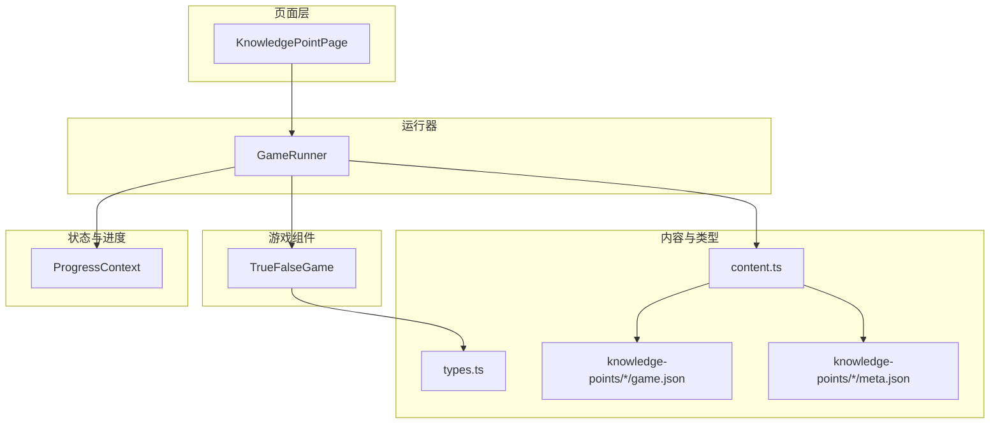
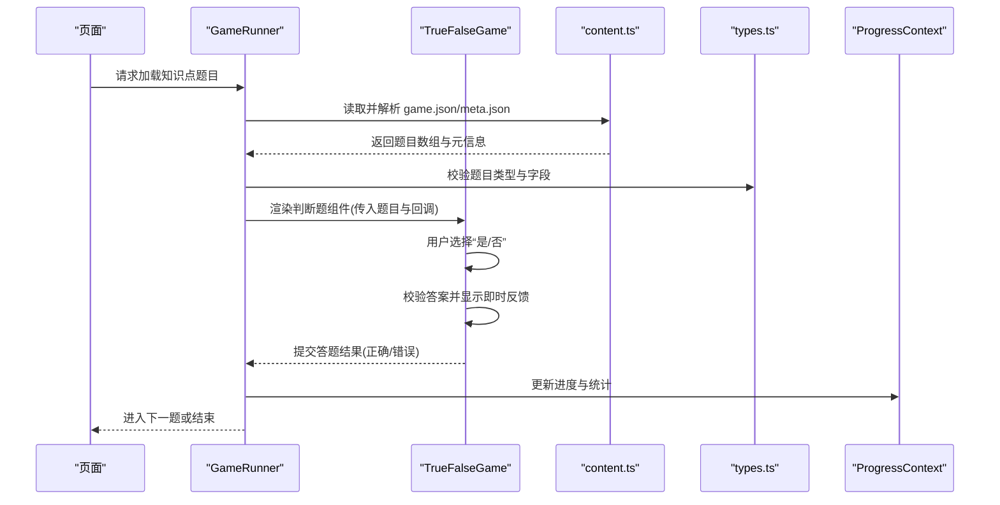
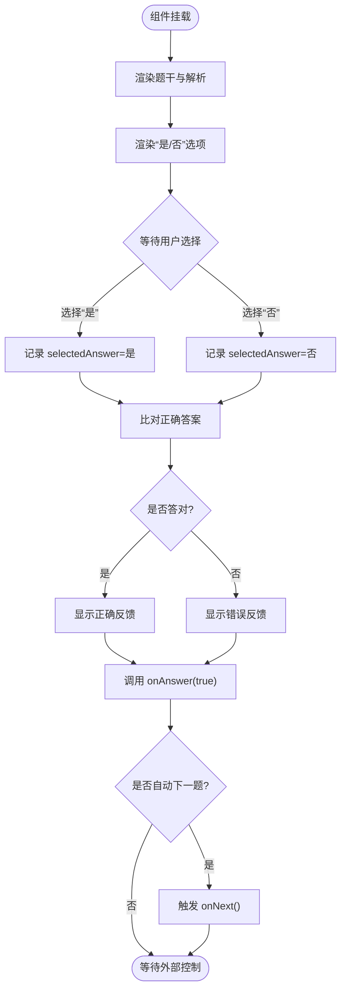
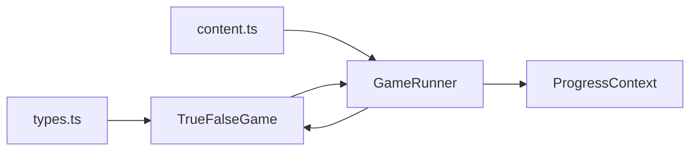

# 判断题游戏实现

<cite>
**本文引用的文件**   
- [TrueFalseGame.tsx](file://src/components/games/TrueFalseGame.tsx)
- [GameRunner.tsx](file://src/components/GameRunner.tsx)
- [types.ts](file://src/lib/types.ts)
- [content.ts](file://src/lib/content.ts)
- [ProgressContext.tsx](file://src/context/ProgressContext.tsx)
- [game.json](file://src/content/knowledge-points/g3-add-sub-10000/game.json)
- [meta.json](file://src/content/knowledge-points/g3-add-sub-10000/meta.json)
</cite>

## 目录
1. [简介](#简介)
2. [项目结构](#项目结构)
3. [核心组件](#核心组件)
4. [架构总览](#架构总览)
5. [详细组件分析](#详细组件分析)
6. [依赖关系分析](#依赖关系分析)
7. [性能考虑](#性能考虑)
8. [故障排查指南](#故障排查指南)
9. [结论](#结论)
10. [附录](#附录)

## 简介
本文件面向 math-k6 项目的“判断题”游戏，聚焦 TrueFalseGame 组件的实现与使用。文档将详细说明：
- 组件的简洁交互设计：真假选项的显示逻辑、用户选择处理与即时反馈
- Props 接口定义：题目内容、判断依据（解析）、正确答案等
- 答案验证机制与即时反馈系统
- 配置示例与扩展方法
- 视觉设计与用户体验优化建议
- 与其他游戏组件的复用模式与最佳实践

## 项目结构
判断题游戏位于 src/components/games 目录下，由 GameRunner 统一调度，数据来源于 content 目录下的知识点对应的 game.json 与 meta.json，类型定义在 lib/types.ts，进度管理通过 context/ProgressContext.tsx 提供。

图表来源
- [GameRunner.tsx](file://src/components/GameRunner.tsx)
- [TrueFalseGame.tsx](file://src/components/games/TrueFalseGame.tsx)
- [content.ts](file://src/lib/content.ts)
- [types.ts](file://src/lib/types.ts)
- [ProgressContext.tsx](file://src/context/ProgressContext.tsx)
- [game.json](file://src/content/knowledge-points/g3-add-sub-10000/game.json)
- [meta.json](file://src/content/knowledge-points/g3-add-sub-10000/meta.json)

章节来源
- [GameRunner.tsx](file://src/components/GameRunner.tsx)
- [TrueFalseGame.tsx](file://src/components/games/TrueFalseGame.tsx)
- [content.ts](file://src/lib/content.ts)
- [types.ts](file://src/lib/types.ts)
- [ProgressContext.tsx](file://src/context/ProgressContext.tsx)
- [game.json](file://src/content/knowledge-points/g3-add-sub-10000/game.json)
- [meta.json](file://src/content/knowledge-points/g3-add-sub-10000/meta.json)

## 核心组件
- TrueFalseGame：负责展示一道判断题、渲染“是/否”或“正确/错误”两个选项、处理用户点击、进行答案校验并给出即时反馈。
- GameRunner：加载知识点数据、按题型分发到对应游戏组件（包括 TrueFalseGame），管理答题流程与进度上报。
- types.ts：定义题目数据结构、题型枚举、游戏通用属性等类型。
- content.ts：读取并解析 knowledge-points 下的 JSON 配置，生成运行时可用的题目集合。
- ProgressContext.tsx：维护学习进度、提交答题结果、统计正确率等。

章节来源
- [TrueFalseGame.tsx](file://src/components/games/TrueFalseGame.tsx)
- [GameRunner.tsx](file://src/components/GameRunner.tsx)
- [types.ts](file://src/lib/types.ts)
- [content.ts](file://src/lib/content.ts)
- [ProgressContext.tsx](file://src/context/ProgressContext.tsx)

## 架构总览
下图展示了从页面到游戏组件的数据流与控制流：页面触发后，GameRunner 根据题型选择 TrueFalseGame；TrueFalseGame 接收题目与回调，完成作答后将结果回传给 Runner，再由 Runner 更新进度。

图表来源
- [GameRunner.tsx](file://src/components/GameRunner.tsx)
- [TrueFalseGame.tsx](file://src/components/games/TrueFalseGame.tsx)
- [content.ts](file://src/lib/content.ts)
- [types.ts](file://src/lib/types.ts)
- [ProgressContext.tsx](file://src/context/ProgressContext.tsx)

## 详细组件分析

### TrueFalseGame 组件
- 职责
  - 渲染题干与判断依据（解析）
  - 渲染“是/否”或“正确/错误”两个选项按钮
  - 捕获用户选择，进行答案校验
  - 给出即时反馈（如高亮、提示语、动画）
  - 调用回调通知上层（Runner）答题结果
- 交互流程
  - 初始状态：显示题干与两个选项，禁用提交直到用户选择
  - 用户选择：立即比对正确答案，标记选中项，显示对错反馈
  - 可选延迟跳转：根据配置决定是否自动进入下一题
- 关键状态
  - selectedAnswer：当前选中的答案
  - isCorrect：是否答对
  - feedbackMessage：反馈文案
  - disabled：是否禁用操作（如已作答）
- 事件与回调
  - onAnswer(answer, isCorrect)：向 Runner 报告答题结果
  - onNext()：进入下一题（可由 Runner 控制）

图表来源
- [TrueFalseGame.tsx](file://src/components/games/TrueFalseGame.tsx)

章节来源
- [TrueFalseGame.tsx](file://src/components/games/TrueFalseGame.tsx)

### Props 接口说明
- 题目内容
  - question：字符串，题干文本
  - explanation：字符串，判断依据或解析
  - answer：布尔值，正确答案（true 表示“是/正确”，false 表示“否/错误”）
- 交互控制
  - onAnswer(answer: boolean, isCorrect: boolean)：提交答案及是否正确
  - onNext?：可选回调，用于进入下一题
  - autoAdvance?: boolean：是否自动进入下一题
  - disabled?: boolean：是否禁用交互（如已完成）
- 展示定制
  - labelTrue?: string：真选项文案（默认“是”或“正确”）
  - labelFalse?: string：假选项文案（默认“否”或“错误”）
  - feedbackStyle?: object：反馈样式（颜色、图标等）
- 无障碍与可访问性
  - ariaLabelTrue/False：为选项提供屏幕阅读器标签
  - keyboardSupport：支持键盘 Enter/Space 选择

章节来源
- [TrueFalseGame.tsx](file://src/components/games/TrueFalseGame.tsx)
- [types.ts](file://src/lib/types.ts)

### 答案验证与即时反馈
- 验证逻辑
  - 用户选择后立即比较 selectedAnswer 与 answer
  - 计算 isCorrect 并生成反馈文案
- 反馈机制
  - 视觉：选中项高亮、正确绿色/错误红色、提示条或气泡
  - 动效：轻微缩放或抖动增强感知
  - 语音/读屏：通过 aria 属性提升可访问性
- 防误触
  - 已作答后锁定选项，防止重复提交
  - 可选二次确认（如需要）

章节来源
- [TrueFalseGame.tsx](file://src/components/games/TrueFalseGame.tsx)

### 配置示例（game.json）
- 字段说明
  - type：题型标识，如 "true-false"
  - questions：题目数组，每项包含 question、answer、explanation
  - settings：可选设置，如 autoAdvance、feedbackDelay、labelTrue/False
- 示例结构要点
  - 每个题目必须包含 question 与 answer
  - explanation 用于解释判断依据
  - settings 控制整体行为（如是否自动下一题）

章节来源
- [game.json](file://src/content/knowledge-points/g3-add-sub-10000/game.json)
- [content.ts](file://src/lib/content.ts)
- [types.ts](file://src/lib/types.ts)

### 与其他游戏组件的复用模式
- 统一入口
  - GameRunner 根据题型分发到具体组件（ChoiceGame、TrueFalseGame、FillBlankGame 等）
- 统一数据模型
  - 所有题型共享 types.ts 中的基础类型，确保一致性
- 统一进度上报
  - 各组件通过相同回调签名提交结果，ProgressContext 统一聚合统计
- 最佳实践
  - 保持组件 Props 最小化且语义清晰
  - 将业务逻辑（如验证）与 UI 渲染分离
  - 使用无障碍属性提升可访问性
  - 避免在组件内直接读写全局状态，通过回调与上下文传递

章节来源
- [GameRunner.tsx](file://src/components/GameRunner.tsx)
- [types.ts](file://src/lib/types.ts)
- [ProgressContext.tsx](file://src/context/ProgressContext.tsx)

## 依赖关系分析
- TrueFalseGame 依赖
  - types.ts：题目与回调类型定义
  - ProgressContext.tsx：通过 Runner 间接使用进度上下文
  - content.ts：通过 Runner 间接消费题目数据
- GameRunner 依赖
  - content.ts：加载与解析题目
  - types.ts：类型校验
  - ProgressContext.tsx：提交答题结果
- 数据流向
  - content.ts → GameRunner → TrueFalseGame
  - TrueFalseGame → GameRunner → ProgressContext

图表来源
- [TrueFalseGame.tsx](file://src/components/games/TrueFalseGame.tsx)
- [GameRunner.tsx](file://src/components/GameRunner.tsx)
- [types.ts](file://src/lib/types.ts)
- [content.ts](file://src/lib/content.ts)
- [ProgressContext.tsx](file://src/context/ProgressContext.tsx)

章节来源
- [TrueFalseGame.tsx](file://src/components/games/TrueFalseGame.tsx)
- [GameRunner.tsx](file://src/components/GameRunner.tsx)
- [types.ts](file://src/lib/types.ts)
- [content.ts](file://src/lib/content.ts)
- [ProgressContext.tsx](file://src/context/ProgressContext.tsx)

## 性能考虑
- 渲染优化
  - 仅当题目或状态变化时重渲染，避免不必要的子树更新
  - 使用 memoization 缓存解析文本与选项渲染
- 交互响应
  - 即时反馈应在主线程快速完成，避免阻塞
  - 大段解析文本按需展开，减少首屏压力
- 内存与资源
  - 题目数据按需加载，避免一次性载入过多内容
  - 清理定时器与事件监听，防止泄漏

[本节为通用指导，不直接分析具体文件]

## 故障排查指南
- 常见问题
  - 题目未显示：检查 content.ts 是否正确解析 game.json，字段名是否匹配
  - 无法作答：确认 disabled 状态与事件绑定是否正确
  - 反馈异常：核对 answer 与 selectedAnswer 的比较逻辑
  - 进度不更新：检查 onAnswer 回调是否被调用，ProgressContext 是否正确订阅
- 调试建议
  - 在 onAnswer 处打印参数，确认 isCorrect 计算
  - 使用浏览器开发者工具观察状态变化
  - 增加边界用例测试（空题干、缺失解析、非法 answer）

章节来源
- [TrueFalseGame.tsx](file://src/components/games/TrueFalseGame.tsx)
- [GameRunner.tsx](file://src/components/GameRunner.tsx)
- [content.ts](file://src/lib/content.ts)
- [ProgressContext.tsx](file://src/context/ProgressContext.tsx)

## 结论
TrueFalseGame 以简洁直观的“是/否”交互为核心，配合清晰的 Props 接口与统一的 Runner/类型/进度体系，实现了稳定、可扩展的判断题玩法。通过合理的验证与反馈机制、良好的可访问性与性能优化，能够在不同知识点场景下保持一致的用户体验。建议在扩展新题型时沿用现有模式，确保一致性与可维护性。

[本节为总结，不直接分析具体文件]

## 附录
- 视觉设计与用户体验优化建议
  - 色彩对比：正确/错误使用高对比色，确保可读性
  - 文案明确：反馈文案简洁易懂，避免歧义
  - 动效适度：轻微动效增强感知，避免干扰
  - 无障碍：为按钮与反馈添加合适的 aria 属性
  - 移动端适配：按钮尺寸与间距适合触控
- 扩展方法
  - 新增题型：在 GameRunner 中注册新组件，并在 types.ts 中扩展题型枚举
  - 自定义反馈：通过 props.feedbackStyle 或扩展组件内部样式
  - 多语言：通过 props.labelTrue/False 与 i18n 集成

[本节为概念性内容，不直接分析具体文件]